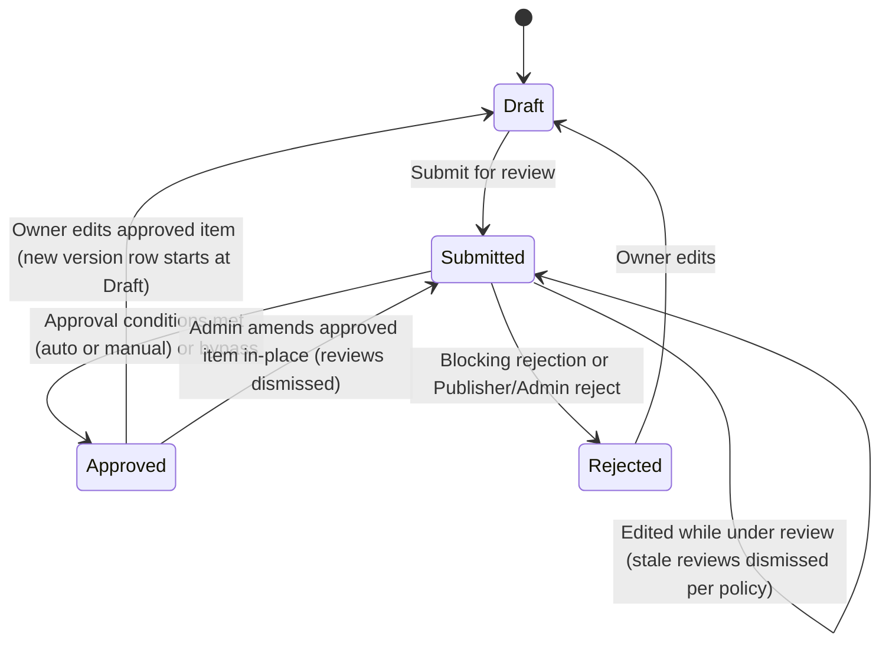

# G2H Design

## 1. Design Overview

### 1.1 Purpose

Glory 2 Him (G2H) is a content management system designed to allow users to contribute, organise, review, approve, publish, associate, and consume gospel-focused content.

The system is centred around `ContentItem`, which represents primary user-contributed content. Examples of content types include:

1. `Quote`
2. `Story`
3. `Testimony`
4. `Topic`
5. Future content types

All user-contributed and configurable content is subject to an approval process before it is considered trusted, visible, or publishable.

### 1.2 Core Design Principles

The design follows these principles:

1. Content must be versioned.
2. Content must be approvable.
3. Approval must be reusable across multiple entity types.
4. Approval must not be tightly coupled to each entity through direct database relationships.
5. Content associations must support both a specific content version and all versions of a content item group.
6. Content-specific behaviour must be policy-driven through settings.
7. `Topic` must be modelled as a `ContentType`, not as a separate database entity.
8. A `Topic` groups other content items through `ContentItemAssociation`.
9. The feed is a domain projection only, not a database entity.
10. Any publishable content type except `Topic` can appear in the feed.
11. All deletes are soft deletes.
12. Soft-deleted content must be excluded from public visibility.

### 1.3 Source Inputs

This design is based on:

1. The `Glory 2 Him.drawio` design file.
2. The current C# entity model files.
3. The current EF Core model snapshot.
4. The supplied design direction for approval, settings, feed, topic, versioning, visibility, and soft delete behaviour.

### 1.4 Current Model Completion Status

The current source files are not complete. This document separates the design into:

1. Current implemented model.
2. Diagram-driven intended model.
3. Required model extensions.
4. Recommended design rules.
5. Final agreed direction where this supersedes earlier diagram wording.

## 2. Domain Model Overview

### 2.1 Main Domain Areas

The domain model is grouped into the following areas:

1. Content
2. Content Types
3. Content Settings
4. Content Associations
5. Approval
6. Approval Policy Settings
7. Supporting Content Entities
8. Feed Projection
9. Topic Grouping
10. Events
11. AI Content Analysis
12. Security and Audit
13. Soft Delete

### 2.2 Main Entity Groups

| Area | Entities |
| --- | --- |
| Content | `ContentItem`, `ContentType`, `ContentItemSetting`, `ContentItemAssociation` |
| Approval | `Approval`, `ApprovalReview`, `ApprovalComment`, `ApprovalSetting`, `ApprovalSettingReviewerRole`, `ApprovalSettingPublisherRole` |
| Associated Entities | `Tag`, `Reaction`, `Comment`, `BibleReference`, `Link`, `Attachment` |
| Enum / Lookup | `EntityType`, `ApprovalStatus`, `Scope` |
| Future Subscription | `Subscription`, `SubscriptionDelivery`, or equivalent decoupled subscription records |

## 3. Content Design

### 3.1 ContentItem

`ContentItem` is the central content entity in the system.

It represents a versioned item of contributed content such as a quote, story, testimony, topic, or future content type.

### 3.2 ContentItem Properties

The content item model should contain the following design-relevant properties:

| Property | Purpose |
| --- | --- |
| `Id` | Unique identifier for this specific content version. |
| `ContentTypeId` | Identifies the type of content, such as `Quote`, `Story`, `Testimony`, or `Topic`. |
| `Title` | Optional content title. |
| `Author` | Optional content author. |
| `Content` | Required body content. |
| `ContentHash` | SHA-256 hash of the normalized `Content` (trim, collapse whitespace, lowercase). Control field computed on every write. Non-unique index on (`ContentTypeId`, `ContentHash`) for duplicate detection (§3.4.2). |
| `ContentItemGroupId` | Groups multiple versions of the same logical content item. |
| `Version` | Version number for the item. |
| `IsLatestVersion` | Identifies the latest version within the content group. Only one row per `ContentItemGroupId` may be latest. |
| `IsPublished` | Identifies the currently published version. Only one row per `ContentItemGroupId` may be published. |
| `ApprovalStatus` | Denormalized approval state (`Draft`, `Submitted`, `Approved`, `Rejected`). Mirrors the linked `Approval` record. `Approval` remains the source of truth. |
| `PublishDate` | Optional date/time from which the content can be visible. |
| `IsDeleted` | Soft-delete flag. When `true` the item is excluded from all public visibility. |
| `CreatedBy` | User who created the item. |
| `CreatedWhen` | Creation timestamp. |
| `UpdatedBy` | User who last updated the item. |
| `UpdatedWhen` | Last update timestamp. |
| `DeletedBy` | User who deleted the item. |
| `DeletedWhen` | Deletion timestamp. |
| `DeletionReason` | Reason for deletion. |

### 3.3 Content Versioning

Content is versioned by using:

1. `Id` for the specific version.
2. `ContentItemGroupId` for the logical content item across all versions.
3. `Version` for the version number.
4. `IsLatestVersion` to identify the latest editable version.
5. `IsPublished` to identify the current public version.

### 3.4 Content Versioning Rules

The following rules apply:

1. A new content item starts with `Version = 1`.
2. A new content item starts with `IsLatestVersion = true`.
3. A new content item starts with `IsPublished = false` unless it is approved and published through the approval workflow.
4. A content item that has not yet been approved may be edited in-place.
5. Editing a draft, submitted, or rejected item does not create a new version.
6. If approval reviews have already been submitted and the content item itself changes, those reviews must be dismissed (subject to `ApprovalSetting.RequireReapprovalOnChange`) and the item must be reviewed again. The item itself remains in its current status.
7. Once a content item has been approved, it becomes immutable to its owner. Only an `Admin` may amend an approved item in-place (rule 16).
8. When the owner edits an approved content item, a new `ContentItem` row is created with the same `ContentItemGroupId` and incremented `Version`. The owner is the only creator of new versions — `Publisher` and `Admin` roles never create version forks.
9. The new version becomes `IsLatestVersion = true`.
10. The previous latest version becomes `IsLatestVersion = false`.
11. The new version must not become `IsPublished = true` until approved.
12. The previously published version remains `IsPublished = true` until the new version is approved and published.
13. Only one content item per `ContentItemGroupId` may have `IsLatestVersion = true`.
14. Only one content item per `ContentItemGroupId` may have `IsPublished = true`.
15. Previous versions must remain available for audit, approval history, comparison, and rollback.
16. An `Admin` may amend an approved content item in-place without creating a new version. The normal updated event fires, the item's approval is reset to `Submitted`, and all active approval reviews are marked `Dismissed` (stale). The item then goes through the normal approval process again, or the `Admin` may bypass-approve it.
17. While such re-approval is pending, the amended item no longer satisfies canonical content visibility (its `ApprovalStatus` is `Submitted`) and is not publicly visible until approved again.
18. `IsLatestVersion` is written at exactly two points: creation (`true` on the new row) and version fork (`true` on the new row, `false` on the previous latest). No other operation — submit, review, approve, publish, or an `Admin` in-place amendment — changes `IsLatestVersion`.

#### 3.4.1 IsLatestVersion Lifecycle

`IsLatestVersion` marks the tip of the version chain — the row edits go to. `IsPublished` marks the row the public sees. During a review window the two flags deliberately sit on different rows. Exactly one `IsLatestVersion = true` per `ContentItemGroupId` at all times; at most one `IsPublished = true` (both enforced by unique filtered indexes).

| Lifecycle event | `IsLatestVersion` | `IsPublished` |
| --- | --- | --- |
| Create V1 | V1 = `true` (the only row is the tip) | V1 = `false` |
| Edit a not-yet-approved item (in-place) | unchanged | unchanged |
| Owner edits an `Approved` item (fork) | new row = `true`; previous latest = `false` | new row = `false`; previously published row unchanged |
| Submit / review / reject | unchanged | unchanged |
| Approve + publish | unchanged (the approved row already carries `true`) | approved row = `true`; previously published row = `false` |
| `Admin` amends an `Approved` item in-place | unchanged | unchanged (visibility is gated by `ApprovalStatus` until re-approved) |

Worked example (V1 published, owner edits):

| Step | V1 | V2 |
| --- | --- | --- |
| V1 approved + published | latest=`true`, published=`true` | — |
| Owner edits → fork V2 | latest=`false`, published=`true` (still live) | latest=`true`, published=`false`, `Draft` |
| V2 submitted, under review | latest=`false`, published=`true` | latest=`true`, published=`false`, `Submitted` |
| V2 approved + published | latest=`false`, published=`false` | latest=`true`, published=`true` |

#### 3.4.2 Duplicate Content Rule

Purpose: two different people cannot submit the exact same content.

1. The duplicate match compares `Content` only (not `Title` or `Author`).
2. The match is normalized: trim ends, collapse whitespace/newline runs to a single space, lowercase (invariant culture). The normalization function is a frozen contract — changing it requires recomputing every stored hash in a migration.
3. The match is scoped per `ContentTypeId`.
4. The match compares against all non-deleted rows (any status, any version). On modify, the item's own `ContentItemGroupId` is excluded.
5. Mechanism: `ContentHash` = SHA-256 of the normalized content, computed by the orchestration on every write and stored on `ContentItem`. A non-unique index on (`ContentTypeId`, `ContentHash`) makes the check an index seek. The index must not be unique — rows within one group may legitimately share a hash (for example a later version reverting to earlier wording); enforcement is application-side.
6. Response on a duplicate: add → polite acknowledgement ("Thank you for your submission") without creating the record and without revealing the duplicate; modify → validation error.

### 3.5 Approval Invalidation Rules

Approval invalidation is entity-scoped.

A change to an entity only invalidates approvals for that specific entity and must not reset approvals of unrelated entities.

For `ContentItem`:

1. Changes to `Title`, `Author`, `Content`, `ContentTypeId`, `PublishDate`, or other approval-sensitive content metadata may invalidate the content item's own approval.
2. If reviews exist for the content item, the reviews should be marked as `Dismissed` when the content changes.
3. The approval status of the item does not change when reviews are dismissed — a `Submitted` item remains `Submitted`. Exception: an `Admin` in-place amendment of an `Approved` item resets the approval to `Submitted`.
4. Reviewers must review the updated content again.

For linked entities:

1. Changes to tags, comments, reactions, Bible references, links, or attachments must not invalidate the parent `ContentItem` approval.
2. Only the changed entity's own approval lifecycle is affected.
3. Only the changed association's approval lifecycle is affected when the association itself changes.

Example:

1. A story is approved and published.
2. A new tag is associated to the story.
3. The tag or association may require approval.
4. The story remains approved and published.
5. The tag is only visible on the story once the tag and association are visible according to policy.

### 3.6 ContentType

`ContentType` defines the type of content represented by a `ContentItem`.

Standard content type examples:

1. `Quote`
2. `Story`
3. `Testimony`
4. `Topic`

### 3.7 ContentType Properties

| Property | Purpose |
| --- | --- |
| `Id` | Unique content type identifier. |
| `Name` | Name of the content type. |
| `ContentItemGroupId` | Groups all versions of this content type record together. Populated on creation and shared across all versions. |
| `Version` | Version number of the content type record, defaults to 1. |
| `IsLatestVersion` | Identifies the latest version of this content type record. |
| `PublishDate` | Optional date/time from which this content type becomes visible. |
| `IsPublished` | Identifies the currently published version of this content type record. |
| `ApprovalStatus` | Denormalized approval state (`Draft`, `Submitted`, `Approved`, `Rejected`). |
| `IsDeleted` | Soft-delete flag. When `true` the item is excluded from all public visibility. |
| `CreatedBy` | User who created the type. |
| `CreatedWhen` | Creation timestamp. |
| `UpdatedBy` | User who last updated the type. |
| `UpdatedWhen` | Last update timestamp. |
| `DeletedBy` | User who deleted the item. |
| `DeletedWhen` | Deletion timestamp. |
| `DeletionReason` | Reason for deletion. |

### 3.8 Content Type Rules

The following rules apply:

1. `ContentType.Name` must be unique.
2. Content type values should be seeded for standard G2H content types.
3. `Topic` should be represented as a `ContentType`, not as a separate root entity.
4. The feed must exclude `Topic` content items.
5. Any publishable content type except `Topic` can appear in the feed.

## 4. ContentItemAssociation Design

### 4.1 Purpose

`ContentItemAssociation` is the generic association mechanism between a content item and another entity.

It supports:

1. Tags
2. Reactions
3. Comments
4. Bible References
5. Links
6. Attachments
7. Child content items
8. Topic membership
9. Related content

### 4.2 Association Scope

Associations can apply to:

1. All versions of a content item.
2. One specific content item version.

This is controlled by `Scope`.

### 4.3 Scope Rules

| Scope | Meaning | Required Field |
| --- | --- | --- |
| `AllVersions` | Association applies to every version sharing the same `AssociatedContentItemGroupId`. | `AssociatedContentItemGroupId` |
| `ThisVersionOnly` | Association applies only to a single content item version. | `ContentItemId` |

### 4.4 Scope Consistency Rules

The following rules must be enforced:

1. If `Scope = AllVersions`, `AssociatedContentItemGroupId` must be supplied and `ContentItemId` must be null.
2. If `Scope = ThisVersionOnly`, `ContentItemId` must be supplied and `AssociatedContentItemGroupId` must be null.
3. Both fields must not be supplied at the same time.
4. Both fields must not be null.

### 4.5 ContentItemAssociation Properties

| Property | Purpose |
| --- | --- |
| `Id` | Unique association identifier. |
| `Scope` | Defines whether the association applies to one version or all versions. |
| `ContentItemId` | Specific content item version targeted by the association. Populated when `Scope = ThisVersionOnly`; null otherwise. |
| `AssociatedContentItemGroupId` | Target content item group for the association. Populated when `Scope = AllVersions`; null otherwise. |
| `ContentItemGroupId` | Groups all versions of this association record together. Populated on creation and shared across all versions. |
| `Version` | Version number of this association record, defaults to 1. |
| `IsLatestVersion` | Identifies the latest version of this association record. |
| `EntityType` | Type of the associated entity. |
| `EntityId` | Identifier of the associated entity. |
| `PublishDate` | Optional visibility date for the association. |
| `IsPublished` | Identifies whether the current version of this association is published. |
| `ApprovalStatus` | Denormalized approval state (`Draft`, `Submitted`, `Approved`, `Rejected`). |
| `IsDeleted` | Soft-delete flag. When `true` the association is excluded from all public visibility. |
| `CreatedBy` | User who created the association. |
| `CreatedWhen` | Creation timestamp. |
| `UpdatedBy` | User who last updated the association. |
| `UpdatedWhen` | Last update timestamp. |
| `DeletedBy` | User who deleted the item. |
| `DeletedWhen` | Deletion timestamp. |
| `DeletionReason` | Reason for deletion. |

### 4.6 Associated Entity Types

The supported associated entity types are defined by `EntityType`.

| EntityType | Purpose |
| --- | --- |
| `ContentItem` | Related content, topic child items, parent/child links. |
| `ContentItemAssociation` | Allows association records themselves to be approved. |
| `Tag` | Categorisation and labelling. |
| `Reaction` | Reactions such as love, like, celebrate. |
| `BibleReference` | Scripture references. |
| `Comment` | Comments on content. |
| `Link` | External or internal links. |
| `Attachment` | Files or binary resources. |

### 4.7 Association Approval

Associations are themselves subject to approval.

This means that even if a `Tag`, `Comment`, `BibleReference`, or `Link` is approved as an entity, the association between that entity and a `ContentItem` can still require its own approval.

Example:

1. A tag named `Faith` may already be approved.
2. A user associates `Faith` with a story.
3. The association can require approval based on `ContentItemSetting.TagAssociationsRequireApproval`.
4. The tag becomes visible on the story only when both the tag and association are visible.

## 5. Supporting Content Entities

### 5.1 Tag

`Tag` represents a categorisation label.

| Property | Purpose |
| --- | --- |
| `Id` | Unique tag identifier. |
| `Name` | Tag name. |
| `ContentItemGroupId` | Groups all versions of this tag record together. Populated on creation and shared across all versions. |
| `Version` | Version number of this tag record, defaults to 1. |
| `IsLatestVersion` | Identifies the latest version of this tag record. |
| `PublishDate` | Optional date/time from which this tag becomes visible. |
| `IsPublished` | Identifies whether the current version of this tag is published. |
| `ApprovalStatus` | Denormalized approval state (`Draft`, `Submitted`, `Approved`, `Rejected`). |
| `IsDeleted` | Soft-delete flag. When `true` the tag is excluded from all public visibility. |
| `CreatedBy` | User who created the tag. |
| `CreatedWhen` | Creation timestamp. |
| `UpdatedBy` | User who last updated the tag. |
| `UpdatedWhen` | Last update timestamp. |
| `DeletedBy` | User who deleted the item. |
| `DeletedWhen` | Deletion timestamp. |
| `DeletionReason` | Reason for deletion. |

### 5.2 Reaction

`Reaction` represents a reusable reaction definition.

| Property | Purpose |
| --- | --- |
| `Id` | Unique reaction identifier. |
| `Name` | Reaction name. |
| `UnicodeEmoji` | Emoji representation. |
| `ContentItemGroupId` | Groups all versions of this reaction record together. Populated on creation and shared across all versions. |
| `Version` | Version number of this reaction record, defaults to 1. |
| `IsLatestVersion` | Identifies the latest version of this reaction record. |
| `PublishDate` | Optional date/time from which this reaction becomes visible. |
| `IsPublished` | Identifies whether the current version of this reaction is published. |
| `ApprovalStatus` | Denormalized approval state (`Draft`, `Submitted`, `Approved`, `Rejected`). |
| `IsDeleted` | Soft-delete flag. When `true` the reaction is excluded from all public visibility. |
| `CreatedBy` | User who created the reaction. |
| `CreatedWhen` | Creation timestamp. |
| `UpdatedBy` | User who last updated the reaction. |
| `UpdatedWhen` | Last update timestamp. |
| `DeletedBy` | User who deleted the item. |
| `DeletedWhen` | Deletion timestamp. |
| `DeletionReason` | Reason for deletion. |

### 5.3 Comment

`Comment` represents user or reviewer visible discussion attached to content through `ContentItemAssociation`.

| Property | Purpose |
| --- | --- |
| `Id` | Unique comment identifier. |
| `Content` | Comment body text. |
| `CreatedBy` | User who created the comment. |
| `CreatedWhen` | Creation timestamp. |
| `UpdatedBy` | User who last updated the comment. |
| `UpdatedWhen` | Last update timestamp. |
| `DeletedBy` | User who deleted the item. |
| `DeletedWhen` | Deletion timestamp. |
| `DeletionReason` | Reason for deletion. |

### 5.4 BibleReference

`BibleReference` represents scripture references associated with content.

| Property | Purpose |
| --- | --- |
| `Id` | Unique Bible reference identifier. |
| `Reference` | Bible reference, such as `John 3:16`. |
| `Translation` | Bible translation, such as NIV, KJV, ESV. |
| `Scripture` | Optional scripture text. |
| `CreatedBy` | User who created the Bible reference. |
| `CreatedWhen` | Creation timestamp. |
| `UpdatedBy` | User who last updated the Bible reference. |
| `UpdatedWhen` | Last update timestamp. |
| `DeletedBy` | User who deleted the item. |
| `DeletedWhen` | Deletion timestamp. |
| `DeletionReason` | Reason for deletion. |

### 5.5 Link

`Link` represents an external or internal link associated with content.

| Property | Purpose |
| --- | --- |
| `Id` | Unique link identifier. |
| `Name` | Display name. |
| `Url` | Target URL. |
| `LinkType` | Internal, external, video, article, source, etc. |
| `CreatedBy` | User who created the link. |
| `CreatedWhen` | Creation timestamp. |
| `UpdatedBy` | User who last updated the link. |
| `UpdatedWhen` | Last update timestamp. |
| `DeletedBy` | User who deleted the item. |
| `DeletedWhen` | Deletion timestamp. |
| `DeletionReason` | Reason for deletion. |

### 5.6 Attachment

`Attachment` represents a file or binary resource associated with content.

| Property | Purpose |
| --- | --- |
| `Id` | Unique attachment identifier. |
| `Name` | Display name. |
| `BlobUri` | Storage location. |
| `Hash` | File hash for integrity and deduplication. |
| `CreatedBy` | User who created the attachment. |
| `CreatedWhen` | Creation timestamp. |
| `UpdatedBy` | User who last updated the attachment. |
| `UpdatedWhen` | Last update timestamp. |
| `DeletedBy` | User who deleted the item. |
| `DeletedWhen` | Deletion timestamp. |
| `DeletionReason` | Reason for deletion. |

## 6. ContentItemSetting Design

### 6.1 Purpose

`ContentItemSetting` defines policy settings for content interaction behaviour.

It controls whether related entities can be created, whether associations require approval, and whether associated entities should be displayed.

### 6.2 Default and Override Behaviour

`ContentItemSetting` can apply at two levels:

1. Content type default.
2. Specific content item override.

### 6.3 Default Rule

If `ContentItemId` is null, the setting applies to all content items of the given content type.

Example:

1. All `Quote` items may allow tags.
2. All `Story` items may allow comments.
3. All `Topic` items may allow child content associations.

### 6.4 Override Rule

If `ContentItemId` is supplied, the setting applies only to that specific content item and overrides the content type default.

### 6.5 Current Settings

| Area | Settings |
| --- | --- |
| Tags | `TagsAllowed`, `TagAssociationsRequireApproval`, `ShowTags` |
| Reactions | `ReactionsAllowed`, `ReactionAssociationsRequireApproval`, `ShowReactions` |
| Links | `LinksAllowed`, `LinkAssociationsRequireApproval`, `ShowLinks` |
| Attachments | `AttachmentsAllowed`, `AttachmentAssociationsRequireApproval`, `ShowAttachments` |
| Comments | `CommentsAllowed`, `CommentAssociationsRequireApproval`, `ShowComments` |
| Bible References | `BibleReferenceAllowed`, `BibleReferenceAssociationsRequireApproval`, `ShowBibleReferences` |

### 6.6 ContentItemSetting Properties

| Property | Purpose |
| --- | --- |
| `Id` | Unique content item setting identifier. |
| `ContentTypeId` | Content type this setting applies to. |
| `ContentItemId` | Optional specific content item override. |
| `IsDeleted` | Soft-delete flag. When `true` the setting is excluded from active policy resolution. |
| `CreatedBy` | User who created the setting. |
| `CreatedWhen` | Creation timestamp. |
| `UpdatedBy` | User who last updated the setting. |
| `UpdatedWhen` | Last update timestamp. |
| `DeletedBy` | User who deleted the item. |
| `DeletedWhen` | Deletion timestamp. |
| `DeletionReason` | Reason for deletion. |

### 6.7 Recommended Settings Extension

Recommended property:

```csharp
public bool LimitReactionsToLoveOnly { get; set; }
```

This supports favourite-style behaviour where only a love reaction should be allowed.

### 6.8 Recommended Type Correction

The current `ContentItemSetting.ContentTypeId` is a string, while `ContentType.Id` is a `Guid`.

Recommended change:

```csharp
public Guid ContentTypeId { get; set; }
```

## 7. Approval Design

### 7.1 Approval Purpose

The approval process controls whether an entity is trusted, accepted, and visible.

The approval system is intentionally not directly linked to all approved entities through database foreign keys.

Instead, it uses:

1. `EntityType`
2. `EntityId`

This allows the same approval workflow to apply to multiple entity types.

### 7.2 Approval Entity

`Approval` represents the workflow state for a specific entity instance.

| Property | Purpose |
| --- | --- |
| `Id` | Unique approval identifier. |
| `EntityType` | Type of entity being approved. |
| `EntityId` | Identifier of the entity being approved. |
| `ApprovalStatus` | Current approval status (`Draft`, `Submitted`, `Approved`, `Rejected`). |
| `IsApprovedByBypass` | `true` when the approval was granted via the bypass action while the approval conditions were not met. The actor is recorded on `UpdatedBy`. |
| `IsDeleted` | Soft-delete flag. When `true` the approval record is excluded from active workflow evaluation. |
| `CreatedBy` | User who created the approval record. |
| `CreatedWhen` | Creation timestamp. |
| `UpdatedBy` | User who last updated the approval record. |
| `UpdatedWhen` | Last update timestamp. |
| `DeletedBy` | User who deleted the item. |
| `DeletedWhen` | Deletion timestamp. |
| `DeletionReason` | Reason for deletion. |

### 7.3 Approval Status

Approval status values are:

| Status | Meaning |
| --- | --- |
| `Draft` | Entity is not yet submitted for review. |
| `Submitted` | Entity is awaiting one or more reviews. |
| `Approved` | Entity has received the required approvals. |
| `Rejected` | Entity has been rejected. |
| `Dismissed` | **`ApprovalReview` records only.** The review was invalidated by an entity-scoped change and must not count toward approval. Entities and `Approval` records never hold `Dismissed`. |

### 7.4 Approval Decoupling Rule

The approval process must not require a direct database relationship from every entity to `Approval`.

Instead:

1. Each approvable entity has its own table.
2. `Approval.EntityType` identifies the table/domain type.
3. `Approval.EntityId` identifies the specific entity instance.
4. Services enforce existence and consistency.
5. The database enforces uniqueness for approval records by `(EntityType, EntityId)`.

### 7.5 Approvable Entities

The following entities are subject to approval:

1. `ContentItem`
2. `ContentItemAssociation`
3. `Tag`
4. `Reaction`
5. `Comment`
6. `BibleReference`
7. `Link`
8. `Attachment`
9. `ContentType`, if end-user or admin-defined content types should be reviewed.
10. `ContentItemSetting`, if policy changes require approval.

### 7.6 ApprovalReview

`ApprovalReview` represents a reviewer decision for an approval record.

| Property | Purpose |
| --- | --- |
| `Id` | Unique review identifier. |
| `ApprovalId` | Parent approval record. |
| `ReviewerId` | User who reviewed the item. |
| `StatusId` | Review decision status. |
| `Comment` | Optional review comment. |
| `IsDeleted` | Soft-delete flag. When `true` the review is excluded from threshold calculations. |
| `CreatedBy` | User who created the review. |
| `CreatedWhen` | Creation timestamp. |
| `UpdatedBy` | User who last updated the review. |
| `UpdatedWhen` | Last update timestamp. |
| `DeletedBy` | User who deleted the item. |
| `DeletedWhen` | Deletion timestamp. |
| `DeletionReason` | Reason for deletion. |

### 7.7 ApprovalReview Rules

The following rules apply:

1. A reviewer may only have one active review per approval record. A second active review by the same reviewer must be rejected by validation — review decisions are not superseded or replaced.
2. A review can approve, reject, or become dismissed.
3. A rejection may block approval depending on `ApprovalSetting.BlockOnReject`.
4. Reviewer eligibility is controlled by `ApprovalSetting.RestrictWhoCanReview` and `ApprovalSettingReviewerRoles`.
5. Self-approval is controlled by `ApprovalSetting.AllowSelfApproval`.
6. Dismissed reviews must not count toward the approval threshold.
7. A reviewer may submit a new review only after their previous review was dismissed.
8. A reviewer whose identity matches the entity's `UpdatedBy` must never review that record, regardless of `AllowSelfApproval` — the person whose wording is under review cannot vouch for it.

### 7.8 ApprovalComment

`ApprovalComment` represents discussion or notes attached to an approval record.

| Property | Purpose |
| --- | --- |
| `Id` | Unique comment identifier. |
| `ApprovalId` | Parent approval record. |
| `UserId` | User who made the comment. |
| `Comment` | Comment text. |
| `IsResolved` | Whether the comment has been resolved. When `ApprovalSetting.RequireApprovalCommentResolutionBeforeApproval = true`, all comments on an approval must be resolved before the approval conditions are met. |
| `IsDeleted` | Soft-delete flag. When `true` the comment is excluded from public visibility. |
| `CreatedBy` | User who created the comment. |
| `CreatedWhen` | Creation timestamp. |
| `UpdatedBy` | User who last updated the comment. |
| `UpdatedWhen` | Last update timestamp. |
| `DeletedBy` | User who deleted the item. |
| `DeletedWhen` | Deletion timestamp. |
| `DeletionReason` | Reason for deletion. |

## 8. Approval Settings Design

### 8.1 Purpose

`ApprovalSetting` defines policy rules for approval workflows.

This is similar to GitHub pull request approval rules, where different entity types can require one or more approvers before they are approved.

### 8.2 ApprovalSetting Entity

Recommended properties:

| Property | Purpose |
| --- | --- |
| `Id` | Unique approval setting identifier. |
| `EntityType` | Entity type this rule applies to. |
| `RequireApprovals` | Whether approvals are required before the entity can be approved (GitHub "Require approvals" checkbox). When `false`, the approval conditions are trivially met. |
| `RequiredNumberOfApprovals` | Number of required approvals (1–5) before approval is complete. Applies when `RequireApprovals = true`. |
| `AllowSelfApproval` | Whether the author can approve their own item. |
| `BlockOnReject` | Whether a single rejection blocks the approval. |
| `RequireReapprovalOnChange` | Whether edits reset approval status. |
| `AutoApproveIfAllApprovalRequirementsMet` | Whether the entity is automatically approved when all approval requirements are met. |
| `RequireApprovalCommentResolutionBeforeApproval` | Whether all approval comments must be resolved before approval can be granted. |
| `DoNotAllowBypassingSettings` | When `true`, the bypass action is unavailable — the approval conditions cannot be bypassed by anyone, including `Admin`. |
| `RestrictWhoCanReview` | Whether reviewing is restricted to roles configured in `ApprovalSettingReviewerRoles`. |
| `RestrictWhoCanApprove` | Whether approve/reject/bypass is restricted to roles configured in `ApprovalSettingPublisherRoles`. |
| `IsDeleted` | Soft-delete flag. When `true` the setting is excluded from policy resolution. |
| `CreatedBy` | User who created the setting. |
| `CreatedWhen` | Creation timestamp. |
| `UpdatedBy` | User who last updated the setting. |
| `UpdatedWhen` | Last update timestamp. |
| `DeletedBy` | User who deleted the item. |
| `DeletedWhen` | Deletion timestamp. |
| `DeletionReason` | Reason for deletion. |

### 8.3 ApprovalSettingReviewerRole and ApprovalSettingPublisherRole Entities

Two role tables hang off `ApprovalSetting` via the `ApprovalSettingReviewerRoles` and `ApprovalSettingPublisherRoles` navigation collections:

1. `ApprovalSettingReviewerRole` — a role permitted to **review** (applies when `RestrictWhoCanReview = true`).
2. `ApprovalSettingPublisherRole` — a role permitted to **approve/reject/publish** (applies when `RestrictWhoCanApprove = true`).

Properties (identical shape for both):

| Property | Purpose |
| --- | --- |
| `Id` | Unique approval setting role identifier. |
| `ApprovalSettingId` | Parent approval setting. |
| `RoleName` | Role name compared against the user's roles via `ISecurityBroker.IsInRoleAsync`. May be a global role or a granular `%EntityType%-` role (§16.6). |
| `IsDeleted` | Soft-delete flag. When `true` the role is excluded from eligibility checks. |
| `CreatedBy` | User who created the role rule. |
| `CreatedWhen` | Creation timestamp. |
| `UpdatedBy` | User who last updated the role rule. |
| `UpdatedWhen` | Last update timestamp. |
| `DeletedBy` | User who deleted the item. |
| `DeletedWhen` | Deletion timestamp. |
| `DeletionReason` | Reason for deletion. |

### 8.4 Approval Policy Resolution

When an approval record is created or evaluated, the approval service must resolve the effective approval setting by entity type.

Recommended resolution order:

1. Entity-specific approval setting, if future design supports `EntityId` overrides.
2. Entity-type approval setting.
3. System default approval setting.

Approval settings are not snapshotted by default. If approval settings change, subsequent approval evaluation should use the latest effective settings.

### 8.5 Approval Threshold Rules

The approval conditions are controlled by `RequireApprovals`, `RequiredNumberOfApprovals` (1–5), and `BlockOnReject`:

```text
conditionsMet =
    (RequireApprovals == false
        OR (activeApprovals (excluding dismissed reviews) >= RequiredNumberOfApprovals
            AND NOT (BlockOnReject AND any active rejected review)))
    AND (RequireApprovalCommentResolutionBeforeApproval == false
        OR all approval comments are resolved)
```

1. If `RequireApprovals = false`, no reviews are required — the conditions are trivially met.
2. If `RequireApprovals = true`, `RequiredNumberOfApprovals` (1–5) valid approvals are required.
3. Dismissed reviews must not count.
4. While the conditions are not met, status remains `Submitted`.
5. Meeting the conditions enables the manual approve action for `Publisher`/`Admin` (the UI approve button).
6. If the conditions are met and `AutoApproveIfAllApprovalRequirementsMet = true`, the system applies `Approved` automatically — no human click; `IsApprovedByBypass` remains `false`.
7. When `RequireApprovalCommentResolutionBeforeApproval = true`, all approval comments must be resolved (`ApprovalComment.IsResolved = true`) before the conditions are met.

### 8.6 Self-Approval Rules

If `AllowSelfApproval = false`:

1. The creator of the entity must not approve the entity.
2. The creator of the approval record must not approve the entity if they are the same as the content creator.
3. Attempts to self-approve must be rejected by validation.

Regardless of `AllowSelfApproval`:

1. A user recorded on the entity's `UpdatedBy` must never review that entity — the person whose wording is under review cannot vouch for it. This includes a `Publisher` or `Admin` who amended the text during review; another `Publisher` or `Admin` must perform the approval.

### 8.7 Rejection Rules

If `BlockOnReject = true`:

1. A single rejection changes the approval status to `Rejected`.
2. No further approvals should move the item to `Approved` unless the item is resubmitted or rejection is cleared by an allowed process.

If `BlockOnReject = false`:

1. Rejections are recorded.
2. Approval can still proceed if the required approval threshold is met.

### 8.8 Reapproval Rules

If `RequireReapprovalOnChange = true`:

1. Editing a `Draft` or `Submitted` entity must dismiss existing active review decisions for that entity (GitHub: "Dismiss stale pull request approvals when new commits are pushed").
2. Dismissed reviews must be retained for audit.
3. The approval record keeps its current status — a `Submitted` item remains `Submitted`.

If `RequireReapprovalOnChange = false`:

1. Existing reviews are retained when a `Draft` or `Submitted` entity is edited.
2. Audit history must still record the change.

Regardless of this setting:

1. An `Admin` in-place amendment of an `Approved` entity always resets the approval to `Submitted` and dismisses active reviews. The normal approval process then applies, or the `Admin` may bypass-approve.

### 8.9 Role-Based Approval Rules

If `RestrictWhoCanReview = true`:

1. A reviewer must belong to at least one role configured in `ApprovalSettingReviewerRoles`. Role names may be global roles or granular `%EntityType%-` roles (see §16.6); they are compared against the user's roles via `ISecurityBroker.IsInRoleAsync`.
2. Users outside the configured roles cannot submit reviews.

If `RestrictWhoCanApprove = true`:

1. The approve, reject, and bypass actions require at least one role configured in `ApprovalSettingPublisherRoles`, compared the same way.
2. Users outside the configured roles cannot approve or reject.

Approval comments may still be allowed regardless of either restriction, depending on product rules.

## 9. Approval Lifecycle

### 9.1 Draft

An entity starts in `Draft` when it is created but not yet ready for review.

### 9.2 Submitted

An entity moves to `Submitted` when a user submits it for review.

### 9.3 Approved

An entity moves to `Approved` when approval policy rules are satisfied.

### 9.4 Rejected

An entity moves to `Rejected` when rejected according to the effective approval policy.

### 9.5 Dismissed (ApprovalReview only)

`Dismissed` applies only to `ApprovalReview` records. A review moves to `Dismissed` when existing review decisions are invalidated by an entity-scoped change. Entities and `Approval` records never hold a `Dismissed` status.

Dismissed reviews are retained for audit but must not count toward approval. The reviewer may submit a new review afterwards.

### 9.6 Recommended State Flow



## 10. Event Design

### 10.1 Purpose

The component design uses events to decouple entity creation and update operations from approval record creation, approval reset behaviour, and denormalized read state updates.

### 10.2 Event System Behaviour

Every service publishes consistent lifecycle events on its own event addresses. An address is named `<Subject>-<Verb>`, where the **subject is the service** — its class name minus the `Service` suffix — and the **verb** is the operation. Tense encodes direction: the present participle (`-ing`) is a **request** the owning service receives, and the past tense (`-ed`) is a **fact** it publishes once the work is done. Because the subject identifies the service, the verbs stay the standard CRUD set at every layer and never have to be reinvented to avoid collisions:

| Service | Request addresses | Fact addresses |
| --- | --- | --- |
| `ContentItemService` (foundation) | `ContentItem-Adding`, `ContentItem-Modifying`, `ContentItem-RemovingById`, `ContentItem-HardRemovingById`, `ContentItem-RetrievingById` | `ContentItem-Added`, `ContentItem-Modified`, `ContentItem-Removed` |
| `ContentItemOrchestrationService` | `ContentItemOrchestration-Adding`, `ContentItemOrchestration-Modifying`, `ContentItemOrchestration-RemovingById` | `ContentItemOrchestration-Added`, `ContentItemOrchestration-Modified`, `ContentItemOrchestration-Removed` |

1. Create operations emit an `-Added` fact.
2. Update operations emit a `-Modified` fact.
3. Soft delete operations emit a `-Removed` fact.
4. No hard delete facts are required because hard deletes are not planned.
5. A service publishes a fact only about its **own** unit of work. A foundation `-Added` means a row was written; an orchestration `-Added` means that orchestrated process completed with its gates passed and its invariants restored. They are different facts about different units of work, never two publishers of the same fact, so an orchestration must not republish the foundation's fact.
6. Subscribers choose accordingly. A foundation fact fires for **every** write to that entity regardless of the path that produced it, which suits projections and indexes that only need current row state. A layer fact fires only when that process completed, which is what a subscriber needs when its reaction depends on the guarantees that layer added, or when the process makes several foundation writes and the intermediate states must not be observed. Never subscribe to both for one reaction — it would double-fire.
7. A verb outside the CRUD set is introduced only when one service has two operations that CRUD cannot tell apart — a state transition such as `Approving`/`Approved` or `Publishing`/`Published` owns a narrower field scope than a general modify, so it is a separate method and therefore a separate verb.
8. Approval services subscribe to relevant lifecycle facts.
9. Event handlers determine whether approval must be created, retained, dismissed, reset, or updated.
10. Event handlers can update the denormalized `ApprovalStatus` field where appropriate, for example setting `ApprovalStatus = ApprovalStatus.Approved` when the threshold is met.

### 10.3 Recommended Events

Recommended domain events. The names below identify each event's **intent**; the address actually registered for it follows the `<Subject>-<Verb>` scheme in §10.2 and §10.10 — for example `ContentItemCreatedEvent` is published on the `ContentItem-Added` address by `ContentItemService`.

| Event | Purpose |
| --- | --- |
| `ContentItemCreatedEvent` | Create approval record for new content. |
| `ContentItemUpdatedEvent` | Dismiss or retain approval based on approval settings and entity-scoped rules. |
| `ContentItemDeletedEvent` | Record soft delete and remove from visibility. |
| `ContentItemAssociationCreatedEvent` | Create approval record for association. |
| `ContentItemAssociationUpdatedEvent` | Dismiss or retain association approval. |
| `ContentItemAssociationDeletedEvent` | Record soft delete and remove association from visibility. |
| `TagCreatedEvent` | Create approval record for tag. |
| `TagUpdatedEvent` | Dismiss or retain tag approval. |
| `TagDeletedEvent` | Record soft delete and remove tag from visibility. |
| `ReactionCreatedEvent` | Create approval record for reaction. |
| `ReactionUpdatedEvent` | Dismiss or retain reaction approval. |
| `ReactionDeletedEvent` | Record soft delete and remove reaction from visibility. |
| `CommentCreatedEvent` | Create approval record for comment. |
| `CommentUpdatedEvent` | Dismiss or retain comment approval. |
| `CommentDeletedEvent` | Record soft delete and remove comment from visibility. |
| `BibleReferenceCreatedEvent` | Create approval record for Bible reference. |
| `BibleReferenceUpdatedEvent` | Dismiss or retain Bible reference approval. |
| `BibleReferenceDeletedEvent` | Record soft delete and remove Bible reference from visibility. |
| `LinkCreatedEvent` | Create approval record for link. |
| `LinkUpdatedEvent` | Dismiss or retain link approval. |
| `LinkDeletedEvent` | Record soft delete and remove link from visibility. |
| `AttachmentCreatedEvent` | Create approval record for attachment. |
| `AttachmentUpdatedEvent` | Dismiss or retain attachment approval. |
| `AttachmentDeletedEvent` | Record soft delete and remove attachment from visibility. |
| `ApprovalCreatedEvent` | Notify subscribers that a new approval record has been created. |
| `ApprovalUpdatedEvent` | Propagate approval status changes to denormalized fields such as `ApprovalStatus`. |
| `ApprovalDeletedEvent` | Record soft delete and remove approval record from active workflow evaluation. |
| `ApprovalReviewCreatedEvent` | Trigger threshold evaluation after a reviewer submits a decision. |
| `ApprovalReviewUpdatedEvent` | Dismiss or retain review based on entity-scoped change rules. |
| `ApprovalReviewDeletedEvent` | Record soft delete and exclude review from threshold calculations. |
| `ApprovalCommentCreatedEvent` | Notify relevant parties that a comment has been added to an approval record. |
| `ApprovalCommentUpdatedEvent` | Propagate comment update to audit history. |
| `ApprovalCommentDeletedEvent` | Record soft delete and remove comment from public visibility. |

### 10.4 Soft Delete Behaviour

Hard deletes are not planned.

Soft delete should be implemented through:

```csharp
public string? DeletedBy { get; set; }
public DateTimeOffset? DeletedWhen { get; set; }
public string? DeletionReason { get; set; }
```

An entity is considered deleted when `DeletedWhen` is not null.

Soft-deleted entities:

1. Must not be visible in public UI.
2. Must not appear in feed projections.
3. Must not appear in topic child lists.
4. Must remain available for audit.
5. Must remain available for administrative review.

### 10.5 Delete Approval Direction

Deletion is not part of `ApprovalStatus`.

`ApprovalStatus` must remain focused on moderation workflow.

If delete approval is needed in future, introduce a separate pending-deletion workflow, for example:

```csharp
public bool PendingDeletion { get; set; }
```

or a separate delete-request entity that itself participates in approval.

### 10.6 Event Envelope

All events should be wrapped in an `EventEnvelope<T>` that carries the business payload alongside security, request, and event metadata.

```csharp
public sealed class EventEnvelope<T>
{
    public T Content { get; init; }

    public SecurityContext SecurityContext { get; init; }

    public RequestContext RequestContext { get; init; }

    public EventMetadata Metadata { get; init; }
}
```

The word `Envelope` is intentional. The event content is the business payload, while the envelope carries the contextual information required to process the event safely and consistently.

This design ensures that orchestration services and event handlers do not depend directly on `HttpContext`, `IHttpContextAccessor`, `ClaimsPrincipal`, or raw JWT tokens.

### 10.7 Security Context

`SecurityContext` is a normalized representation of the authenticated caller extracted at the application entry point.

```csharp
public sealed class SecurityContext
{
    // Identity
    public string? SubjectId { get; init; }

    public string? Username { get; init; }

    public string? TenantId { get; init; }

    // Authorization
    public IReadOnlyList<string> Roles { get; init; }

    public IReadOnlyList<string> Scopes { get; init; }

    public IReadOnlyList<string> Permissions { get; init; }

    // Authentication state
    public bool IsAuthenticated { get; init; }

    public AuthenticationType AuthenticationType { get; init; }

    // Client / application identity
    public string? ClientId { get; init; }

    public string? ClientApplicationName { get; init; }

    // Delegated/system access
    public bool IsSystemIdentity { get; init; }

    public string? DelegatedBySubjectId { get; init; }
}
```

Recommended enum:

```csharp
public enum AuthenticationType
{
    Unknown = 0,
    User = 1,
    Machine = 2,
    Delegated = 3,
    System = 4
}
```

`SubjectId` is used instead of `UserId` because OAuth 2.0 and OpenID Connect use the `sub` claim to represent the authenticated subject. For machine-to-machine flows there may be no human user, and using `SubjectId` avoids forcing every authenticated caller into a user-only model.

`SecurityContext` should be built from the `ClaimsPrincipal` provided by ASP.NET Core Identity and OpenIddict (see section 16). A `securityContextFactory` at the entry point is responsible for this normalization. The rest of the application must not depend on `ClaimsPrincipal` directly.

#### 10.7.1 1 Authentication Flow Examples

**OpenID Connect user login:**

```csharp
new SecurityContext
{
    SubjectId = subjectId,
    Username = username,
    TenantId = tenantId,
    Roles = roles,
    Scopes = scopes,
    Permissions = permissions,
    IsAuthenticated = true,
    AuthenticationType = AuthenticationType.User,
    ClientId = clientId,
    ClientApplicationName = clientApplicationName,
    IsSystemIdentity = false
};
```

**Client credentials / machine-to-machine:**

```csharp
new SecurityContext
{
    SubjectId = null,
    Username = null,
    Roles = [],
    Scopes = scopes,
    Permissions = permissions,
    IsAuthenticated = true,
    AuthenticationType = AuthenticationType.Machine,
    ClientId = clientId,
    ClientApplicationName = clientApplicationName,
    IsSystemIdentity = true
};
```

**Delegated access:**

```csharp
new SecurityContext
{
    SubjectId = actingSubjectId,
    DelegatedBySubjectId = delegatingSubjectId,
    Username = username,
    Roles = roles,
    Scopes = scopes,
    Permissions = permissions,
    IsAuthenticated = true,
    AuthenticationType = AuthenticationType.Delegated,
    ClientId = clientId,
    IsSystemIdentity = false
};
```

### 10.8 Request Context

`RequestContext` contains operational information about the original request or process that triggered the event.

```csharp
public sealed class RequestContext
{
    public Guid CorrelationId { get; init; }

    public DateTimeOffset RequestedDate { get; init; }

    public string? RequestId { get; init; }

    public string? SourceSystem { get; init; }

    public string? ClientApplicationId { get; init; }
}
```

`CorrelationId` represents the wider business operation or request chain and is useful for audit trails, diagnostics, tracing, distributed workflow correlation, support investigations, and replay analysis.

### 10.9 Event Metadata

`EventMetadata` contains information about the event instance itself.

```csharp
public sealed class EventMetadata
{
    public Guid EventId { get; init; }

    public string EventType { get; init; }

    public int Version { get; init; }

    public int RetryCount { get; init; }

    public string? CausationId { get; init; }

    public Guid? ParentCorrelationId { get; init; }
}
```

This metadata becomes more important when moving from in-process event handling to asynchronous or distributed event processing. It supports retries, replays, event versioning, diagnostics, idempotency, causation tracking, and parent/child event relationships.

Example causation chain:

```text
API Request
CorrelationId: A

StudentCreated
EventId: 1
CorrelationId: A

AddressCreated
EventId: 2
CorrelationId: A
CausationId: 1

AuditLogged
EventId: 3
CorrelationId: A
CausationId: 2
```

### 10.10 Current Implementation (EventHighway)

Events are published through the `EventBroker`, which wraps [EventHighway](https://github.com/The-Standard-Organization/EventHighway) — a durable, SQL-backed pub/sub substrate. Each service owns a set of event addresses named `<Subject>-<Verb>` (§10.2), split into two families: **requests** in the present tense (`ContentItem-Adding`, `-Modifying`, `-RemovingById`, `-RetrievingById`), answered by responder handlers on the owning service, and **facts** in the past tense (`ContentItem-Added`, `-Modified`, `-Removed`), published by the service after its work is done for observers to react to. The subject is the service rather than the entity, so a higher-level service announcing completion of its own unit of work sits on its own addresses — `ContentItemOrchestration-Adding` is handled by `ContentItemOrchestrationService`, which publishes `ContentItemOrchestration-Added` once the orchestrated add has completed. Receiver handler methods are always named `On<Verb><Entity>Async` (`OnAddingContentItemAsync`); the `On` prefix marks the receiver and never appears in the address itself. The address is selected by a strongly typed per-service operation enum passed on publish (for example `ContentItemEventOperation.Adding`, `ContentItemOrchestrationEventOperation.Added`) — no magic strings, and operations can be added per service without affecting the others. The broker composes the stored event name from the subject and operation (for example `"ContentItemAdding"`, `"ContentItemOrchestrationAdded"`), so the subject must be distinct per service or the stored names would collide. Every publish persists the event and dispatches it inline to the in-process delegate handlers subscribed to that address; handler failures are recorded per listener (with retry support) instead of failing the publisher. Subscriptions bind to exactly one operation. Handlers may optionally return a reply envelope (`ValueTask<EventEnvelope<T>?>`), which the broker serializes onto the delivery's `ListenerEventV2` row — the observable reply channel for request-style events such as `RetrievedById`, carrying the same security-context and metadata discipline as the request.

Publishing returns an `EventPublishResult<T>`: the persisted event id plus one `EventDelivery<T>` per subscription, each with its dispatch-time status and — for responders — the reply envelope deserialized back to `EventEnvelope<T>`. This is a dispatch-time snapshot: failed deliveries may still succeed later via retries, and the durable truth remains the event store. Notification-style publishers simply ignore the result.

Foundation services follow a dual-path shape (see `ContentTypeService` as the template):

- **Non-event path**: receive the object → convert to a request envelope via `IEventEnvelopeFactory.CreateAsync` (captures the caller's `SecurityContext`, stamps event/correlation identifiers) → call the shared private `DoXAsync` method.
- **Event path** (the `.Substrate` partial): one `On<Operation><Entity>Async` handler per request address (`OnAdding…`, `OnModifying…`, `OnRemoving…ById`, `OnRetrieving…ById`) → validate the envelope → dedup mutating handlers via the `ProcessedEvents` table (unique on EventId + ReceiverName; a deduplicated delivery replies `null`) → converge on the same `DoXAsync` methods → reply with the outcome envelope on the delivery.

The `DoXAsync` methods own auditing, validation, storage, and publishing the past-tense fact, so the two paths cannot diverge; every hop chains causation through `IEventEnvelopeFactory.CreateNextAsync` (fresh `EventId`, `CausationId` = source event, security/request context carried forward). Substrate handlers categorize failures into the service's typed exceptions and rethrow — deliveries record `Error` and retry; failures are never swallowed. Hard removal is deliberately not event-invokable, and reads publish no fact — a retrieve's reply rides the delivery's response.

The broker keeps per-entity pub/sub methods (`PublishContentItemAsync`, `SubscribeToContentItemEventAsync`, and so on), so publishing and subscribing always go through the broker — never directly against foundation services. All subscriptions are configured in one central place, `EventSubscriptionRegistration`, which also registers the participant and event addresses at startup.

The event handler must receive an `EventEnvelope<T>` rather than depending directly on `HttpContext`.

Current flow:

```text
HTTP Request
    ↓
Controller (thin pass-through)
    ↓
Orchestration / Foundation Service
    ↓
Create EventEnvelope<T> via IEventEnvelopeFactory
    ↓
Publish using EventBroker (EventHighway)
    ↓
Event persisted + dispatched inline
    ↓
Subscribed handler (registered in EventSubscriptionRegistration)
    ↓
Orchestration Service
```

### 10.11 Future Disconnected Processing

If the application later moves to background workers, queues, Azure Service Bus, RabbitMQ, Kafka, or another distributed event mechanism, the same envelope can be serialized and processed outside the original HTTP request.

Future flow:

```text
HTTP Request
    ↓
Controller (thin pass-through)
    ↓
Orchestration / Foundation Service
    ↓
Create EventEnvelope<T> via IEventEnvelopeFactory
    ↓
Serialize envelope
    ↓
Queue/message broker
    ↓
Background worker
    ↓
Deserialize envelope
    ↓
Orchestration Service
```

At that point there is no active `HttpContext`, no original request scope, and the original token may have expired. The `EventEnvelope<T>` prevents the architecture from depending on request-specific state.

### 10.12 Recommended Controller Pattern

Controllers are thin exposure points. Like brokers, they exist only to let requests into the business domain — they carry no business logic and must not build `SecurityContext`, `RequestContext`, `EventMetadata`, or `EventEnvelope<T>`. Envelopes and events are created only by internal services (coordinations, orchestrations, processings, foundations) via `IEventEnvelopeFactory`.

The controller should:

1. Rely on authentication middleware to authenticate the caller.
2. Accept the request model and `CancellationToken`.
3. Call the relevant orchestration service.
4. Map the result and domain exceptions to HTTP responses.

Example:

```csharp
[HttpPost]
public async ValueTask<IActionResult> PostStudentAsync(
    Student student,
    CancellationToken cancellationToken)
{
    Student createdStudent =
        await this.studentOrchestrationService
            .OrchestrateStudentCreationAsync(
                student,
                cancellationToken);

    return Ok(createdStudent);
}
```

### 10.13 Recommended Event Handler Pattern

Event handlers should accept the envelope and pass it to the relevant orchestration service.

```csharp
public sealed class StudentCreatedEventHandler
{
    private readonly IStudentOrchestrationService studentOrchestrationService;

    public StudentCreatedEventHandler(
        IStudentOrchestrationService studentOrchestrationService)
    {
        this.studentOrchestrationService = studentOrchestrationService;
    }

    public async ValueTask HandleAsync(
        EventEnvelope<Student> envelope,
        CancellationToken cancellationToken)
    {
        await this.studentOrchestrationService
            .OrchestrateStudentCreationAsync(
                envelope,
                cancellationToken);
    }
}
```

### 10.14 Recommended Envelope Validation

The envelope should be validated before orchestration proceeds. Validation should confirm:

1. Envelope is not null.
2. Content is not null.
3. Security context is present.
4. Request context is present.
5. Metadata is present.
6. Correlation id is present.
7. Event id is present.
8. Authenticated operations have valid identity details.
9. Machine operations have valid client details.

Example validation:

```csharp
private static void ValidateEnvelope<T>(EventEnvelope<T> envelope)
{
    if (envelope is null)
    {
        throw new InvalidEventEnvelopeException("Event envelope is required.");
    }

    if (envelope.Content is null)
    {
        throw new InvalidEventEnvelopeException("Event content is required.");
    }

    if (envelope.SecurityContext is null)
    {
        throw new InvalidEventEnvelopeException("Security context is required.");
    }

    if (envelope.RequestContext is null)
    {
        throw new InvalidEventEnvelopeException("Request context is required.");
    }

    if (envelope.Metadata is null)
    {
        throw new InvalidEventEnvelopeException("Event metadata is required.");
    }
}
```

### 10.15 Recommended Anti-Patterns

Avoid passing `HttpContext` into orchestration services:

```csharp
// AVOID
public ValueTask<Student> OrchestrateAsync(Student student, HttpContext httpContext)
```

Avoid using `IHttpContextAccessor` inside orchestration services:

```csharp
// AVOID
this.httpContextAccessor.HttpContext.User
```

Avoid serializing raw `ClaimsPrincipal` into events.

Avoid passing raw JWT tokens through the domain or event pipeline unless there is a specific and justified reason.

Avoid placing authorization decisions only in controllers when orchestration services are responsible for business workflow decisions.

Avoid scattering magic-string role and scope names throughout orchestration services. Keep role and claim names in a central constants class and perform checks through `ISecurityBroker`.

### 10.16 Authorization in Orchestration Services

Authorization is performed where the business decision is required — inside the orchestration service — using `ISecurityBroker` directly. A separate permission/authorization service is not used.

`ISecurityBroker` provides the required primitives:

```csharp
public interface ISecurityBroker
{
    ValueTask<User> GetCurrentUserAsync();
    ValueTask<bool> IsCurrentUserAuthenticatedAsync();
    ValueTask<bool> IsInRoleAsync(string roleName);
    ValueTask<bool> UserHasClaimAsync(string claimType, string claimValue);
    ValueTask<bool> UserHasClaimAsync(string claimType);
    ValueTask<SecurityContext> GetCurrentSecurityContextAsync();
}
```

Example usage in an orchestration service:

```csharp
public ValueTask<ContentItem> AddContentItemAsync(
    ContentItem contentItem,
    CancellationToken cancellationToken) =>
TryCatch(async () =>
{
    bool isAuthenticated =
        await this.securityBroker.IsCurrentUserAuthenticatedAsync();

    bool isBlocked =
        await this.securityBroker.IsInRoleAsync(Roles.ReadOnly)
            || await this.securityBroker.IsInRoleAsync(Roles.ContentItemReadOnly);

    ValidateUserIsAllowedToContribute(isAuthenticated, isBlocked);

    ContentItem createdContentItem =
        await this.contentItemService.AddContentItemAsync(
            contentItem,
            cancellationToken);

    return createdContentItem;
});
```

Rules:

1. Role and claim names must live in a central constants class (e.g. `Roles`) — no magic strings scattered through orchestration services.
2. Controllers must not perform business authorization; they rely on authentication middleware and standard policy attributes for coarse access only.
3. The `SecurityContext` for event envelopes is obtained via `ISecurityBroker.GetCurrentSecurityContextAsync()` inside the service that creates the envelope (`IEventEnvelopeFactory`).

## 11. Topic and Feed Design

### 11.1 Topic as Content

`Topic` is a `ContentType` used to group related content.

A topic is a `ContentItem` whose `ContentType` is `Topic`.

Example:

1. Create a `ContentItem` with `ContentType = Topic`.
2. Title it `God's Love`.
3. Associate other content items with that topic through `ContentItemAssociation`.
4. The associated content may be `Quote`, `Story`, `Testimony`, or any future publishable content type.

### 11.2 Topic Is Not a Feed Item

A `Topic` must not appear directly in the feed.

A topic acts as:

1. A grouping container.
2. A landing page.
3. A subscription target.
4. A thematic collection.
5. A way to organise related content without introducing a separate database entity.

### 11.3 Feed as a Domain Projection

The feed is not a database entity.

The feed is a domain projection of visible content ordered by publish date descending.

Conceptually:

```sql
SELECT *
FROM ContentItems
WHERE
    ContentType <> 'Topic'
    AND DeletedWhen IS NULL
    AND ApprovalStatus = 'Approved'
    AND IsPublished = 1
    AND (
        PublishDate IS NULL
        OR PublishDate <= SYSUTCDATETIME()
    )
ORDER BY PublishDate DESC, CreatedWhen DESC;
```

### 11.4 Topic Parent/Child Relationship

Topics use `ContentItemAssociation` for parent/child relationships.

A child item is associated to the topic by creating a `ContentItemAssociation` where:

| Field | Value |
| --- | --- |
| `ContentItemId` or `ContentItemGroupId` | The parent topic content item or topic group. |
| `EntityType` | `ContentItem` |
| `EntityId` | The child content item or child content item group. |
| `Scope` | Whether the association applies to one version or all versions. |
| `PublishDate` | Optional date/time from which the child association becomes visible. |

### 11.5 Topic Visibility

A topic can have its own visibility as a landing page or subscription target, but it does not appear in the feed.

A topic page is visible only when:

1. The topic content item is not soft deleted.
2. The topic content item is approved.
3. The topic content item is published.
4. The topic `PublishDate` is null or has passed.

### 11.6 Topic Child Visibility

A child item is visible under a topic only when:

1. The topic is visible.
2. The child content item is visible.
3. The `ContentItemAssociation` between the topic and child is approved if approval is required.
4. The `ContentItemAssociation.PublishDate` is null or has passed.
5. The effective `ContentItemSetting` allows the relationship or associated content to be shown.

### 11.7 Topic Ordering

The current model does not include an explicit sort order.

Recommended future extension on `ContentItemAssociation`:

```csharp
public int? SortOrder { get; set; }
```

Topic child ordering should be resolved as:

1. `SortOrder`, if supplied.
2. Association `PublishDate`, if supplied.
3. Child `PublishDate`, if supplied.
4. `CreatedWhen` as fallback.

### 11.8 Future Topic Subscriptions

Subscriptions should remain decoupled from the content model, similar to approvals.

A future subscription system may record:

1. Subscriber user id.
2. Target `EntityType`.
3. Target `EntityId`.
4. Preferred communication method.
5. Subscription status.
6. Last delivered content.
7. Delivery history.

A topic subscription means the user subscribes to a topic and receives associated child content according to subscription delivery rules.

Subscriptions should not control whether content is visible on the public UI.

## 12. Component Architecture

### 12.1 Architecture Overview

The component design follows a layered service architecture using:

1. Brokers
2. Foundation Services
3. Orchestration Services
4. Controllers
5. SQL Storage
6. Event System
7. Content Analysis Service

The primary dependency direction is:

```text
Controllers
    -> Orchestration Services
        -> Foundation Services
            -> Brokers
                -> SQL Storage / External Infrastructure
```

### 12.2 Broker Layer

Brokers abstract infrastructure, persistence, external systems, security access, event publication, and AI integrations.

Current intended brokers:

1. `StorageBroker`
2. `EventBroker`
3. `SecurityBroker`
4. `SecurityAuditBroker`
5. `AIBroker`

#### 12.2.1 1 StorageBroker

`StorageBroker` is responsible for SQL persistence through EF Core.

#### 12.2.2 2 EventBroker

`EventBroker` is responsible for publishing and receiving domain events.

#### 12.2.3 3 SecurityBroker

`SecurityBroker` is responsible for user identity, claims, roles, and permission checks.

#### 12.2.4 4 SecurityAuditBroker

`SecurityAuditBroker` is responsible for security-sensitive audit logging and traceability.

#### 12.2.5 5 AIBroker

`AIBroker` is responsible for infrastructure-level access to AI capabilities used by the content analysis workflow.

### 12.3 Foundation Service Layer

Foundation services own core CRUD, validation, and business rules for one entity.

Current intended foundation services:

| Number | Name | Purpose |
| --- | --- | --- |
| 1 | `ContentItemService` | CRUD, validation, and versioning rules for content items. |
| 2 | `ContentTypeService` | CRUD and validation for content types. |
| 3 | `ContentItemSettingsService` | CRUD and policy resolution for content item settings. |
| 4 | `ApprovalService` | Approval record creation, status transitions, and uniqueness enforcement. |
| 5 | `ApprovalSettingsService` | Approval policy rule management and effective setting resolution. |
| 6 | `ApprovalCommentService` | CRUD for approval comments. |
| 7 | `ApprovalReviewService` | Reviewer decision recording, eligibility validation, and threshold evaluation. |
| 8 | `TagService` | CRUD and validation for tags. |
| 9 | `ReactionService` | CRUD and validation for reaction definitions. |
| 10 | `CommentService` | CRUD and validation for comments. |
| 11 | `BibleReferenceService` | CRUD and validation for Bible references. |
| 12 | `LinkService` *(future)* | CRUD and validation for links. |
| 13 | `AttachmentService` *(future)* | CRUD and validation for attachments. |
| 14 | `ApprovalSettingReviewerRoleService` | CRUD and validation for approval setting reviewer roles. |
| 15 | `ApprovalSettingPublisherRoleService` | CRUD and validation for approval setting publisher roles. |

### 12.4 Orchestration Layer

Orchestration services Orchestrate multiple dependencies and enforce cross-entity workflows.

Current intended orchestrations:

| Number | Name | Purpose |
| --- | --- | --- |
| 1 | `ContentItemOrchestration` | Orchestrates content item creation, versioning, approval submission, and publish workflows. |
| 2 | `ContentTypeOrchestration` | Orchestrates content type management and seeding workflows. |
| 3 | `ContentItemSettingsOrchestration` | Orchestrates effective settings resolution across content type defaults and item overrides. |
| 4 | `ApprovalOrchestrationService` | Orchestrates approval submission, review decisions, policy outcomes, and denormalized state updates. |
| 5 | `ApprovalReviewOrchestration` | Orchestrates reviewer eligibility, threshold evaluation, and dismissal workflows. |
| 6 | `ApprovalCommentOrchestration` | Orchestrates approval comment creation and lifecycle management. |
| 7 | `TagOrchestration` | Orchestrates tag creation, versioning, approval, and association workflows. |
| 8 | `ReactionOrchestration` | Orchestrates reaction creation, versioning, approval, and association workflows. |
| 9 | `CommentOrchestration` | Orchestrates comment creation, versioning, approval, and association workflows. |
| 10 | `BibleReferenceOrchestration` | Orchestrates Bible reference creation, versioning, approval, and association workflows. |

#### 12.4.1 1 ContentItemOrchestration

`ContentItemOrchestration` orchestrates the full lifecycle of a content item across foundation services.

Responsibilities:

1. Orchestrate content item creation and modification, enforcing versioning rules and control field integrity.
2. Determine whether an edit results in an in-place update or a new version, based on current `ApprovalStatus`.
3. Update `IsLatestVersion` on the previous version when a new version is created.
4. Apply model mapping on every write operation — map only the fields that a caller is permitted to change onto a fresh entity loaded from the database before committing. This prevents any caller from tampering with control fields through the update path.
5. Orchestrate soft delete across the content item and flag dependent associations as appropriate.
6. Publish its own completion facts — `ContentItemOrchestration-Added`, `ContentItemOrchestration-Modified`, and `ContentItemOrchestration-Removed` — via `IEventBroker` once the orchestrated work has completed. The underlying row-level facts (`ContentItem-Added`, `-Modified`, `-Removed`) are published by `ContentItemService` and must not be republished here (§10.2).
7. The approval orchestration service subscribes to these events to manage approval records and workflow state.

Business Rules:

1. A content item in `Draft`, `Submitted`, or `Rejected` status may be edited in-place without creating a new version.
2. An `Approved` content item is immutable to its owner. An owner edit must create a new version with incremented `Version` and `IsLatestVersion = true` and the previous version set to `false`. Exception: an `Admin` may amend an approved record in-place without creating a new version; the approval then resets to `Submitted` and active reviews are dismissed.
3. Only one version per `ContentItemGroupId` may have `IsLatestVersion = true`. (also enforced by database unique index))
4. Only one version per `ContentItemGroupId` may have `IsPublished = true`. (also enforced by database unique index)
5. A content item must not be published until its `ApprovalStatus` is `Approved`. This is enforced by the orchestration workflow that listens for approval status changes and updates `IsPublished` accordingly when approval is granted.
6. The following fields are control fields and must never be accepted from an external caller. They must always be set internally by the orchestration or approval workflow:
   - `ContentItemGroupId`
   - `Version`
   - `IsLatestVersion`
   - `IsPublished`
   - `ApprovalStatus`
   - `IsDeleted`
   - `CreatedBy`
   - `CreatedWhen`
   - `DeletedBy`
   - `DeletedWhen`
   - `DeletionReason`
   - `ContentHash`
7. On every update, the orchestration must load the current entity from the database and map only the permitted caller-supplied fields (`Title`, `Author`, `Content`, `ContentTypeId`, `PublishDate`) onto that entity before saving.
8. Review dismissal is not the responsibility of this orchestration. Publishing `ContentItemUpdatedEvent` is sufficient — `ApprovalOrchestrationService` must handle dismissal when it receives that event.
9. Only the owner (`CreatedBy`) may modify a content item or its versions. A `Publisher` or `Admin` may amend the text of a `Submitted` item during review (typos/grammar); their identity is then recorded on `UpdatedBy`. `CreatedBy` never changes on an update.
10. An `Admin` in-place amendment of an `Approved` content item fires the normal updated event; the approval workflow resets the approval to `Submitted` and dismisses active reviews (§3.4 rule 16).
11. Duplicate content rule (§3.4.2): before add or modify, compute `ContentHash` from the normalized `Content` and check for a duplicate per (`ContentTypeId`, `ContentHash`) across non-deleted rows (excluding the item's own `ContentItemGroupId` on modify). Add → polite acknowledgement without creating; modify → validation error.

#### 12.4.2 2 ContentTypeOrchestration

`ContentTypeOrchestration` orchestrates the full lifecycle of a content type across foundation services.

Responsibilities:

1. Orchestrate content type creation and modification, enforcing versioning rules and control field integrity.
2. Determine whether an edit results in an in-place update or a new version, based on current `ApprovalStatus`.
3. Update `IsLatestVersion` on the previous version when a new version is created.
4. Apply model mapping on every write operation — map only the fields that a caller is permitted to change onto a fresh entity loaded from the database before committing. This prevents any caller from tampering with control fields through the update path.
5. Ensure required seeded content types exist on startup.
6. Orchestrate soft delete and prevent deletion of content types that have active content items.
7. Publish `ContentTypeCreatedEvent`, `ContentTypeUpdatedEvent`, and `ContentTypeDeletedEvent` via `ContentTypeEventService`.
8. The approval orchestration service subscribes to these events to manage approval records and workflow state.

Business Rules:

1. A content type in `Draft`, `Submitted`, or `Rejected` status may be edited in-place without creating a new version.
2. An `Approved` content type is immutable to its owner. An owner edit must create a new version with incremented `Version` and `IsLatestVersion = true` and the previous version set to `false`. Exception: an `Admin` may amend an approved record in-place without creating a new version; the approval then resets to `Submitted` and active reviews are dismissed.
3. Only one version per `ContentItemGroupId` may have `IsLatestVersion = true`. (also enforced by database unique index)
4. Only one version per `ContentItemGroupId` may have `IsPublished = true`. (also enforced by database unique index)
5. The seeded content types `Quote`, `Story`, `Testimony`, and `Topic` must always exist and may not be deleted.
6. A content type may not be deleted if it has active, non-deleted content items assigned to it.
7. `ContentType.Name` must be unique across all non-deleted records.
8. Renaming a content type must not affect existing content item assignments.
9. The following fields are control fields and must never be accepted from an external caller. They must always be set internally by the orchestration or approval workflow:
   - `ContentItemGroupId`
   - `Version`
   - `IsLatestVersion`
   - `IsPublished`
   - `ApprovalStatus`
   - `IsDeleted`
   - `CreatedBy`
   - `CreatedWhen`
   - `DeletedBy`
   - `DeletedWhen`
   - `DeletionReason`
10. On every update, the orchestration must load the current entity from the database and map only the permitted caller-supplied field (`Name`) onto that entity before saving.
11. Review dismissal is not the responsibility of this orchestration. Publishing `ContentTypeUpdatedEvent` is sufficient — `ApprovalOrchestrationService` must handle dismissal when it receives that event.

#### 12.4.3 3 ContentItemSettingsOrchestration

`ContentItemSettingsOrchestration` orchestrates the creation, modification, and policy resolution of content item settings across foundation services.

Responsibilities:

1. Orchestrate content item setting creation and modification, enforcing control field integrity.
2. Apply model mapping on every write operation — map only the fields that a caller is permitted to change onto a fresh entity loaded from the database before committing. This prevents any caller from tampering with control fields through the update path.
3. Orchestrate creation of default settings per content type.
4. Orchestrate creation of per-item overrides when a specific content item requires different behaviour.
5. Resolve the effective setting for a given content item by merging the content type default with any item-level override.
6. Validate that settings are consistent and do not conflict with system-level constraints.
7. Orchestrate soft delete of settings.
8. Publish `ContentItemSettingCreatedEvent`, `ContentItemSettingUpdatedEvent`, and `ContentItemSettingDeletedEvent` via `ContentItemEventService`.
9. The approval orchestration service subscribes to these events to manage approval records and workflow state.

Business Rules:

1. If no item-level override exists, the content type default setting applies.
2. If an item-level override exists, it takes full precedence over the content type default.
3. Only one default setting per content type may exist where `ContentItemId IS NULL`. (also enforced by database unique index)
4. Only one override setting per content item may exist where `ContentItemId IS NOT NULL`. (also enforced by database unique index)
5. Disabling a feature in settings must prevent the creation of new associations of that type for the affected content items.
6. The following fields are control fields and must never be accepted from an external caller. They must always be set internally by the orchestration or approval workflow:
   - `ContentTypeId`
   - `ContentItemId`
   - `ApprovalStatus`
   - `IsDeleted`
   - `CreatedBy`
   - `CreatedWhen`
   - `DeletedBy`
   - `DeletedWhen`
   - `DeletionReason`
7. On every update, the orchestration must load the current entity from the database and map only the permitted caller-supplied setting fields (`TagsAllowed`, `TagAssociationsRequireApproval`, `ShowTags`, `ReactionsAllowed`, `ReactionAssociationsRequireApproval`, `ShowReactions`, `LinksAllowed`, `LinkAssociationsRequireApproval`, `ShowLinks`, `AttachmentsAllowed`, `AttachmentAssociationsRequireApproval`, `ShowAttachments`, `CommentsAllowed`, `CommentAssociationsRequireApproval`, `ShowComments`, `BibleReferenceAllowed`, `BibleReferenceAssociationsRequireApproval`, `ShowBibleReferences`, `LimitReactionsToLoveOnly`) onto that entity before saving.
8. Review dismissal is not the responsibility of this orchestration. Publishing `ContentItemSettingUpdatedEvent` is sufficient — `ApprovalOrchestrationService` must handle dismissal when it receives that event.

#### 12.4.4 4 ApprovalOrchestrationService

`ApprovalOrchestrationService` orchestrates the approval workflow across entities, policy evaluation, and denormalized state.

Responsibilities:

1. Subscribe to entity `CreatedEvent` and `UpdatedEvent` messages for all approvable entity types.
2. On receiving a `CreatedEvent`, check whether an approval record already exists for the entity. If none exists, create one with `ApprovalStatus = Draft` via `ApprovalService`.
3. On receiving an `UpdatedEvent`, check whether an approval record exists for the entity. If none exists, create one with `ApprovalStatus = Draft`. If one exists, evaluate whether existing reviews must be dismissed based on the effective `ApprovalSetting.RequireReapprovalOnChange` policy.
4. Orchestrate approval submission by moving `ApprovalStatus` from `Draft` to `Submitted`.
5. Evaluate approval threshold after each review decision using `ApprovalSettingsService`.
6. Apply `Approved` status when the approval conditions (§8.5) are met and `AutoApproveIfAllApprovalRequirementsMet = true`.
7. Publish approval status changes via `ApprovalUpdatedEvent`. The owning entity's orchestration subscribes and updates the denormalized `ApprovalStatus` on the entity.
8. On `Approved`, the owning entity's orchestration sets `IsPublished = true` on the newly approved version.
9. The owning entity's orchestration sets `IsPublished = false` on the previously published version, ensuring only one published version exists per `ContentItemGroupId`. `IsLatestVersion` is not changed at publish time (see §3.4.1).
10. Use `SecurityBroker` to validate user identity and role claims during submission and review.
11. Publish `ApprovalCreatedEvent`, `ApprovalUpdatedEvent`, and `ApprovalDeletedEvent` via `ApprovalEventService`.

Business Rules:

1. An approval record must be unique per `(EntityType, EntityId)`.
2. If an approval record does not exist when a `CreatedEvent` or `UpdatedEvent` is received, it must be created before any other approval logic is applied.
3. An entity may not be submitted for approval if it is already in `Approved` status.
4. `Dismissed` never applies to `Approval` records — only to `ApprovalReview` records. After reviews are dismissed the item remains `Submitted` and eligible reviewers may submit new reviews.
5. Self-approval is blocked when `ApprovalSetting.AllowSelfApproval = false`.
6. A single rejection blocks further approval when `ApprovalSetting.BlockOnReject = true`.
7. Dismissed reviews must not contribute to the approval threshold count.
8. This orchestration is responsible for evaluating whether existing reviews must be dismissed when an entity updated event is received. The originating orchestration must not perform dismissal directly.
9. This orchestration is responsible for automatic approvals if applicable.
10. This orchestration is responsible for manual approval submission subject to policy rules  i.e. amount of required approvals, self-approval, and role-based approval. Manual approval requires the approval conditions (§8.5) to be met and is available to `Publisher` and `Admin` (global or matching `%EntityType%-Publisher`).
11. This orchestration is responsible for manual approval (bypass rules) i.e. policy rules not met but a permitted user needs to approve or reject anyway. This must be a separate method that does not enforce policy rules except role-based access: bypass is available to `Admin`, to the global `Publisher` role (any entity type), and to the matching `%EntityType%-Publisher` role (that entity type only). When `RestrictWhoCanApprove = true`, the actor must additionally match a role in `ApprovalSettingPublisherRoles`. Bypass is unavailable entirely when `ApprovalSetting.DoNotAllowBypassingSettings = true` — the conditions must then be met by everyone, including `Admin`. Bypassing sets `Approval.IsApprovedByBypass = true` and records the actor on `UpdatedBy`.
12. Dismissal is only applied when `ApprovalSetting.RequireReapprovalOnChange = true` for the relevant entity type. If `false`, existing reviews are retained and no dismissal occurs. Exception: an `Admin` in-place amendment of an `Approved` entity always resets the approval to `Submitted` and dismisses active reviews, regardless of this setting.
13. A `Publisher` or `Admin` may reject directly while the approval is `Submitted`; the outcome is recorded immediately as `Rejected`.

#### 12.4.5 5 ApprovalReviewOrchestration

`ApprovalReviewOrchestration` orchestrates the recording, validation, and evaluation of individual reviewer decisions.

Responsibilities:

1. Validate that a reviewer is eligible to review based on role and self-approval settings.
2. Ensure only one active review per reviewer per approval record exists.
3. Record the reviewer decision via `ApprovalReviewService`.
4. Publish `ApprovalReviewCreatedEvent`, `ApprovalReviewUpdatedEvent`, and `ApprovalReviewDeletedEvent` via `ApprovalReviewEventService`.

Business Rules:

1. A reviewer may not submit more than one active review per approval record. Review decisions are not superseded or replaced — a second active review must be rejected by validation.
2. A reviewer must belong to a role configured in `ApprovalSettingReviewerRoles` when `RestrictWhoCanReview = true`.
3. A reviewer must not review their own submitted entity when `AllowSelfApproval = false`.
4. Dismissed reviews must be retained for audit and must not be deleted.
5. A new review may be submitted after the reviewer's previous review was dismissed.
6. A reviewer whose identity matches the entity's `UpdatedBy` must never review that record, regardless of `AllowSelfApproval`. The entity's audit fields are retrieved via the `%EntityType%-RetrievingById` request event.

#### 12.4.6 6 ApprovalCommentOrchestration

`ApprovalCommentOrchestration` orchestrates the creation and lifecycle management of comments attached to approval records.

Responsibilities:

1. Orchestrate approval comment creation, ensuring the parent approval record exists before a comment is created.
2. Apply model mapping on every write operation — map only the fields that a caller is permitted to change onto a fresh entity loaded from the database before committing.
3. Orchestrate soft delete of approval comments.
4. Publish `ApprovalCommentCreatedEvent`, `ApprovalCommentUpdatedEvent`, and `ApprovalCommentDeletedEvent` via `ApprovalCommentEventService`.

Business Rules:

1. An approval comment may only be created against an existing, non-deleted approval record.
2. The following fields are control fields and must never be accepted from an external caller. They must always be set internally by the orchestration:
   - `ApprovalId`
   - `UserId`
   - `IsDeleted`
   - `CreatedBy`
   - `CreatedWhen`
   - `DeletedBy`
   - `DeletedWhen`
   - `DeletionReason`
3. On every update, the orchestration must load the current entity from the database and map only the permitted caller-supplied field (`Comment`) onto that entity before saving.
4. Approval comments do not participate in the approval threshold or status transition workflow.

#### 12.4.7 7 TagOrchestration

`TagOrchestration` orchestrates the full lifecycle of a tag across foundation services, including versioning, approval, and content item association.

Responsibilities:

1. Orchestrate tag creation and modification, enforcing versioning rules and control field integrity.
2. Determine whether an edit results in an in-place update or a new version, based on current `ApprovalStatus`.
3. Update `IsLatestVersion` on the previous version when a new version is created.
4. Apply model mapping on every write operation — map only the fields that a caller is permitted to change onto a fresh entity loaded from the database before committing. This prevents any caller from tampering with control fields through the update path.
5. Associate an approved tag with a content item by creating a `ContentItemAssociation`, validating that tagging is permitted by resolving the effective `ContentItemSetting`.
6. Orchestrate soft delete of tags and flag associated content item associations as appropriate.
7. Publish `TagCreatedEvent`, `TagUpdatedEvent`, and `TagDeletedEvent` via `TagEventService`.
8. The approval orchestration service subscribes to these events to manage approval records and workflow state.

Business Rules:

1. A tag in `Draft`, `Submitted`, or `Rejected` status may be edited in-place without creating a new version.
2. An `Approved` tag is immutable to its owner. An owner edit must create a new version with incremented `Version` and `IsLatestVersion = true` and the previous version set to `false`. Exception: an `Admin` may amend an approved record in-place without creating a new version; the approval then resets to `Submitted` and active reviews are dismissed.
3. Only one version per `ContentItemGroupId` may have `IsLatestVersion = true`. (also enforced by database unique index)
4. Only one version per `ContentItemGroupId` may have `IsPublished = true`. (also enforced by database unique index)
5. A tag may only be associated with a content item if `ContentItemSetting.TagsAllowed = true`.
6. The association requires its own approval when `ContentItemSetting.TagAssociationsRequireApproval = true`.
7. A tag is only visible on a content item when both the tag and the association are approved and not deleted.
8. A soft-deleted tag must not be visible on any content item.
9. The following fields are control fields and must never be accepted from an external caller. They must always be set internally by the orchestration or approval workflow:
   - `ContentItemGroupId`
   - `Version`
   - `IsLatestVersion`
   - `IsPublished`
   - `ApprovalStatus`
   - `IsDeleted`
   - `CreatedBy`
   - `CreatedWhen`
   - `DeletedBy`
   - `DeletedWhen`
   - `DeletionReason`
10. On every update, the orchestration must load the current entity from the database and map only the permitted caller-supplied field (`Name`) onto that entity before saving.
11. Review dismissal is not the responsibility of this orchestration. Publishing `TagUpdatedEvent` is sufficient — `ApprovalOrchestrationService` must handle dismissal when it receives that event.

#### 12.4.8 8 ReactionOrchestration

`ReactionOrchestration` orchestrates the full lifecycle of a reaction definition across foundation services, including versioning, approval, and content item association.

Responsibilities:

1. Orchestrate reaction definition creation and modification, enforcing versioning rules and control field integrity.
2. Determine whether an edit results in an in-place update or a new version, based on current `ApprovalStatus`.
3. Update `IsLatestVersion` on the previous version when a new version is created.
4. Apply model mapping on every write operation — map only the fields that a caller is permitted to change onto a fresh entity loaded from the database before committing. This prevents any caller from tampering with control fields through the update path.
5. Associate a reaction with a content item by creating a `ContentItemAssociation`, validating that reactions are permitted and enforcing `LimitReactionsToLoveOnly` when the setting is enabled.
6. Orchestrate soft delete of reactions and flag associated content item associations as appropriate.
7. Publish `ReactionCreatedEvent`, `ReactionUpdatedEvent`, and `ReactionDeletedEvent` via `ReactionEventService`.
8. The approval orchestration service subscribes to these events to manage approval records and workflow state.

Business Rules:

1. A reaction in `Draft`, `Submitted`, or `Rejected` status may be edited in-place without creating a new version.
2. An `Approved` reaction is immutable to its owner. An owner edit must create a new version with incremented `Version` and `IsLatestVersion = true` and the previous version set to `false`. Exception: an `Admin` may amend an approved record in-place without creating a new version; the approval then resets to `Submitted` and active reviews are dismissed.
3. Only one version per `ContentItemGroupId` may have `IsLatestVersion = true`. (also enforced by database unique index)
4. Only one version per `ContentItemGroupId` may have `IsPublished = true`. (also enforced by database unique index)
5. A reaction may only be associated with a content item if `ContentItemSetting.ReactionsAllowed = true`.
6. When `ContentItemSetting.LimitReactionsToLoveOnly = true`, only the designated love reaction may be associated.
7. The association requires its own approval when `ContentItemSetting.ReactionAssociationsRequireApproval = true`.
8. A soft-deleted reaction definition must not be associated with new content items.
9. The following fields are control fields and must never be accepted from an external caller. They must always be set internally by the orchestration or approval workflow:
   - `ContentItemGroupId`
   - `Version`
   - `IsLatestVersion`
   - `IsPublished`
   - `ApprovalStatus`
   - `IsDeleted`
   - `CreatedBy`
   - `CreatedWhen`
   - `DeletedBy`
   - `DeletedWhen`
   - `DeletionReason`
10. On every update, the orchestration must load the current entity from the database and map only the permitted caller-supplied fields (`Name`, `UnicodeEmoji`) onto that entity before saving.
11. Review dismissal is not the responsibility of this orchestration. Publishing `ReactionUpdatedEvent` is sufficient — `ApprovalOrchestrationService` must handle dismissal when it receives that event.

#### 12.4.9 9 CommentOrchestration

`CommentOrchestration` orchestrates the full lifecycle of a comment across foundation services, including versioning, approval, and content item association.

Responsibilities:

1. Orchestrate comment creation and modification, enforcing versioning rules and control field integrity.
2. Determine whether an edit results in an in-place update or a new version, based on current `ApprovalStatus`.
3. Update `IsLatestVersion` on the previous version when a new version is created.
4. Apply model mapping on every write operation — map only the fields that a caller is permitted to change onto a fresh entity loaded from the database before committing. This prevents any caller from tampering with control fields through the update path.
5. Associate an approved comment with a content item by creating a `ContentItemAssociation`, validating that comments are permitted by resolving the effective `ContentItemSetting`.
6. Orchestrate soft delete of comments and flag associated content item associations as appropriate.
7. Publish `CommentCreatedEvent`, `CommentUpdatedEvent`, and `CommentDeletedEvent` via `CommentEventService`.
8. The approval orchestration service subscribes to these events to manage approval records and workflow state.

Business Rules:

1. A comment in `Draft`, `Submitted`, or `Rejected` status may be edited in-place without creating a new version.
2. An `Approved` comment is immutable to its owner. An owner edit must create a new version with incremented `Version` and `IsLatestVersion = true` and the previous version set to `false`. Exception: an `Admin` may amend an approved record in-place without creating a new version; the approval then resets to `Submitted` and active reviews are dismissed.
3. Only one version per `ContentItemGroupId` may have `IsLatestVersion = true`. (also enforced by database unique index)
4. Only one version per `ContentItemGroupId` may have `IsPublished = true`. (also enforced by database unique index)
5. A comment may only be associated with a content item if `ContentItemSetting.CommentsAllowed = true`.
6. The association requires its own approval when `ContentItemSetting.CommentAssociationsRequireApproval = true`.
7. A soft-deleted comment must not be visible on any content item.
8. The following fields are control fields and must never be accepted from an external caller. They must always be set internally by the orchestration or approval workflow:
   - `ContentItemGroupId`
   - `Version`
   - `IsLatestVersion`
   - `IsPublished`
   - `ApprovalStatus`
   - `IsDeleted`
   - `CreatedBy`
   - `CreatedWhen`
   - `DeletedBy`
   - `DeletedWhen`
   - `DeletionReason`
9. On every update, the orchestration must load the current entity from the database and map only the permitted caller-supplied field (`Content`) onto that entity before saving.
10. Review dismissal is not the responsibility of this orchestration. Publishing `CommentUpdatedEvent` is sufficient — `ApprovalOrchestrationService` must handle dismissal when it receives that event.

#### 12.4.10 10 BibleReferenceOrchestration

`BibleReferenceOrchestration` orchestrates the full lifecycle of a Bible reference across foundation services, including versioning, approval, and content item association.

Responsibilities:

1. Orchestrate Bible reference creation and modification, enforcing versioning rules and control field integrity.
2. Determine whether an edit results in an in-place update or a new version, based on current `ApprovalStatus`.
3. Update `IsLatestVersion` on the previous version when a new version is created.
4. Apply model mapping on every write operation — map only the fields that a caller is permitted to change onto a fresh entity loaded from the database before committing. This prevents any caller from tampering with control fields through the update path.
5. Associate an approved Bible reference with a content item by creating a `ContentItemAssociation`, validating that Bible references are permitted by resolving the effective `ContentItemSetting`.
6. Orchestrate soft delete of Bible references and flag associated content item associations as appropriate.
7. Publish `BibleReferenceCreatedEvent`, `BibleReferenceUpdatedEvent`, and `BibleReferenceDeletedEvent` via `BibleReferenceEventService`.
8. The approval orchestration service subscribes to these events to manage approval records and workflow state.

Business Rules:

1. A Bible reference in `Draft`, `Submitted`, or `Rejected` status may be edited in-place without creating a new version.
2. An `Approved` Bible reference is immutable to its owner. An owner edit must create a new version with incremented `Version` and `IsLatestVersion = true` and the previous version set to `false`. Exception: an `Admin` may amend an approved record in-place without creating a new version; the approval then resets to `Submitted` and active reviews are dismissed.
3. Only one version per `ContentItemGroupId` may have `IsLatestVersion = true`. (also enforced by database unique index)
4. Only one version per `ContentItemGroupId` may have `IsPublished = true`. (also enforced by database unique index)
5. A Bible reference may only be associated with a content item if `ContentItemSetting.BibleReferenceAllowed = true`.
6. The association requires its own approval when `ContentItemSetting.BibleReferenceAssociationsRequireApproval = true`.
7. A soft-deleted Bible reference must not be visible on any content item.
8. The same Bible reference may be associated with multiple content items independently.
9. The following fields are control fields and must never be accepted from an external caller. They must always be set internally by the orchestration or approval workflow:
   - `ContentItemGroupId`
   - `Version`
   - `IsLatestVersion`
   - `IsPublished`
   - `ApprovalStatus`
   - `IsDeleted`
   - `CreatedBy`
   - `CreatedWhen`
   - `DeletedBy`
   - `DeletedWhen`
   - `DeletionReason`
10. On every update, the orchestration must load the current entity from the database and map only the permitted caller-supplied fields (`Reference`, `Translation`, `Scripture`) onto that entity before saving.
11. Review dismissal is not the responsibility of this orchestration. Publishing `BibleReferenceUpdatedEvent` is sufficient — `ApprovalOrchestrationService` must handle dismissal when it receives that event.

### 12.5 Controller Layer

Controllers expose API endpoints for the domain.

Current intended controllers:

| Number | Name | Purpose |
| --- | --- | --- |
| 1 | `ContentItemController` | Exposes endpoints for content item creation, editing, versioning, submission, and soft delete. |
| 2 | `ContentTypeController` | Exposes endpoints for content type management. |
| 3 | `ContentItemSettingsController` | Exposes endpoints for content item policy settings. |
| 4 | `ApprovalController` | Exposes endpoints for approval submission and status retrieval. |
| 5 | `ApprovalCommentController` | Exposes endpoints for adding and reading approval comments. |
| 6 | `ApprovalReviewController` | Exposes endpoints for submitting and reading approval reviews. |
| 7 | `TagController` | Exposes endpoints for tag management. |
| 8 | `ReactionController` | Exposes endpoints for reaction definition management. |
| 9 | `CommentController` | Exposes endpoints for comment management. |
| 10 | `BibleReferenceController` | Exposes endpoints for Bible reference management. |
| 11 | `LinkController` *(future)* | Exposes endpoints for link management. |
| 12 | `AttachmentController` *(future)* | Exposes endpoints for attachment management. |

### 12.6 SQL Storage

SQL is the persistence layer behind `StorageBroker`.

The EF Core model snapshot currently shows tables and constraints for:

| Number | Name | Purpose |
| --- | --- | --- |
| 1 | `Approvals` | Stores approval workflow state for all approvable entity types. |
| 2 | `ApprovalComments` | Stores discussion and notes attached to approval records. |
| 3 | `ApprovalReviews` | Stores individual reviewer decisions for approval records. |
| 4 | `ContentItems` | Stores all versioned content item records. |
| 5 | `ContentTypes` | Stores content type definitions such as `Quote`, `Story`, `Testimony`, and `Topic`. |
| 6 | `ContentItemSettings` | Stores policy settings for content interaction behaviour per content type or content item. |
| 7 | `ContentItemAssociations` | Stores generic associations between content items and other entities. |
| 8 | `Tags` | Stores tag definitions used for content categorisation. |
| 9 | `Reactions` | Stores reusable reaction definitions. |

### 12.7 Event System

The event system decouples entity creation, update, and soft-delete operations from approval workflow side effects.

Events are published through the `EventBroker` and consumed by approval and orchestration services as required.

### 12.8 Content Analysis Service

The `ContentAnalysisService` orchestrates AI-assisted analysis, duplicate detection, scripture extraction, categorisation, quality checks, and moderation suggestions.

The service may depend on `AIBroker`, `StorageBroker`, and approval/content services, but AI analysis must not replace human approval.

## 13. AI Content Analysis

### 13.1 Purpose

The component design includes an `AI Broker` and `Content Analysis Service`.

These components can be used to assist with content quality, safety, scripture relevance, duplication checks, and moderation suggestions.

### 13.2 AI Analysis Should Not Replace Approval

AI analysis must not replace human approval.

AI should provide:

1. Suggestions.
2. Warnings.
3. Duplicate detection.
4. Scripture reference extraction.
5. Content categorisation.
6. Moderation support.

Final approval should remain controlled by the approval process.

### 13.3 Recommended AI Analysis Outputs

Recommended outputs:

1. Suggested tags.
2. Suggested Bible references.
3. Similar existing content.
4. Potentially sensitive language warnings.
5. Suggested content type.
6. Quality score.
7. Recommended reviewer notes.

## 14. Visibility Rules

### 14.1 Canonical Content Visibility

A content item is visible only when:

```csharp
contentItem.DeletedWhen is null
&& contentItem.ApprovalStatus == ApprovalStatus.Approved
&& contentItem.IsPublished
&& (
    contentItem.PublishDate is null
    || contentItem.PublishDate <= utcNow
)
```

### 14.2 Feed Visibility

The feed is a projection of visible content items.

A content item appears in the feed only when:

1. The content item is visible according to canonical content visibility.
2. The content item `ContentType` is not `Topic`.

The feed is ordered by:

1. `PublishDate DESC`, if present.
2. `CreatedWhen DESC` as fallback.

### 14.3 Association Visibility

An association is visible only when:

1. The association is not soft deleted.
2. The association approval status is `Approved`, if approval is required.
3. The associated entity is not soft deleted.
4. The associated entity approval status is `Approved`, if approval is required.
5. The parent content item is visible.
6. `ContentItemAssociation.PublishDate` is null or has passed.
7. The effective `ContentItemSetting` allows the association type to be shown.

### 14.4 Topic Visibility

A topic page is visible only when:

1. The topic content item is visible according to canonical content visibility.
2. The topic content item has `ContentType = Topic`.

Topic children are visible only when:

1. The topic is visible.
2. The child content item is visible.
3. The topic-child association is visible.

### 14.5 Denial Posture and Audit Logging

When a caller requests an entity they are not allowed to see, the system uses a **no-existence-leak** posture:

1. A non-visible entity is reported as **not found — never as unauthorized**. An unprivileged probe must not be able to distinguish a non-public entity (draft, submitted, rejected, unpublished, future-scheduled) from an entity that does not exist.
2. The caller-facing error carries **no reason**: exception messages and the exception `Data` dictionary surface outward to callers, so neither may ever contain the denial reason, the entity's state, or the caller's identity.
3. A soft-deleted entity is not found for **every** caller, including `Admin` — review and audit reads cover the approval workflow, not takedowns.
4. Collection reads apply the same posture by **filtering**: rows the caller may not see silently drop out of the set instead of producing an error, so a collection read never reveals how many non-public rows exist.

So that debugging and audit remain correct despite the deliberately opaque outward answer, **the true denial reason must always be logged server-side, immediately before the generic error is thrown** — and only there:

1. Privilege denials (an anonymous caller, or an authenticated caller who is neither the owner nor in a review role, requesting a non-public entity) are logged as **warnings**, including the entity id and — when resolved — the denied user's id. These are the security-relevant events: repeated warnings for one caller indicate probing.
2. State-based misses (soft-deleted entity requested; a group with no non-deleted latest or published version) are logged as **information**, including the entity or group id.
3. The log message states the real reason and notes that the caller was answered with not-found, e.g. `Content item read denied. Content item {id} is not publicly visible and user "{userId}" is neither the owner nor in a review role; reported to the caller as not found.`

This posture and its logging rule apply to every read surface — by id, latest/published per group, and collection reads — and to both the direct and event (substrate) paths, which converge on the same do-work methods.

## 15. Recommended Corrections

### 14.1 Correct Typographical Issues

The draw.io model includes `ConentItemAssociation`.

The correct name should be:

```text
ContentItemAssociation
```

### 14.2 Remove ApprovalId from Approvable Entities

The draw.io model included `ApprovalId` on `ContentItem` and `ContentItemAssociation` as a direct foreign key to the `Approval` record. This has been resolved.

Final direction:

1. `ApprovalId` must not be placed on any approvable entity.
2. Approval lookup is performed generically through `Approval.EntityType` and `Approval.EntityId`.
3. `ApprovalId` on `ContentItemAssociation` has been removed. Approval for an association is resolved through `Approval(EntityType = ContentItemAssociation, EntityId = ContentItemAssociation.Id)`.
4. `ApprovalId` remains valid only on `ApprovalReview` and `ApprovalComment` as a direct foreign key to their parent `Approval` record, not as a lookup from approvable entities.

### 14.3 Add ContentItemAssociation to EntityType

The current `EntityType` enum does not include `ContentItemAssociation`.

Recommended addition:

```csharp
ContentItemAssociation = 7
```

This allows association records themselves to be approved through the same approval mechanism.

### 14.4 Add Topic Content Type

`Topic` does not require a separate `EntityType` because it is represented as a `ContentItem` with `ContentType = Topic`.

Recommended direction:

1. Add `Topic` as a seeded `ContentType`.
2. Use `EntityType.ContentItem` for topic parent/child associations.
3. Use `ContentItemAssociation` to connect topics to child content items.
4. Exclude `Topic` from feed projections.

### 14.5 Review ContentItemSetting Type Mismatch

The current `ContentItemSetting.ContentTypeId` is a string, while `ContentType.Id` is a `Guid`.

Recommended change:

```csharp
public Guid ContentTypeId { get; set; }
```

## 16. Recommended Service Responsibilities

### 16.1 ContentItemService

Responsible for:

1. Creating content item versions.
2. Updating `IsLatestVersion` flags.
3. Updating `IsPublished` flags when approval completes.
4. Validating content item fields.
5. Reading content by id, group id, type, latest version, and published version.
6. Reading content by (`ContentTypeId`, `ContentHash`) for duplicate detection.
7. Applying soft delete fields.

### 16.2 ContentItemAssociationService

Responsible for:

1. Creating associations.
2. Validating scope consistency.
3. Validating supported `EntityType`.
4. Applying publish date rules.
5. Reading associations for content item display.
6. Reading topic children.
7. Applying soft delete fields.

### 16.3 ContentItemSettingsService

Responsible for:

1. Creating default settings per content type.
2. Creating overrides per content item.
3. Resolving effective settings.
4. Validating whether tags, comments, reactions, links, attachments, Bible references, and child content associations are allowed.
5. Applying soft delete fields.

### 16.4 ApprovalService

Responsible for:

1. Creating approval records.
2. Reading approval status.
3. Submitting items for approval.
4. Applying approval status transitions.
5. Enforcing approval uniqueness per entity.
6. Recording bypass approvals (`IsApprovedByBypass`). Review dismissal is applied on `ApprovalReview` records via `ApprovalReviewService` — `Approval` records never hold `Dismissed`.

### 16.5 ApprovalReviewService

Responsible for:

1. Recording reviewer decisions.
2. Enforcing one active review per reviewer per approval.
3. Validating reviewer eligibility.
4. Evaluating approval thresholds.
5. Excluding dismissed reviews from threshold calculations.

### 16.6 ApprovalSettingsService

Responsible for:

1. Managing approval policy rules.
2. Managing reviewer and publisher role rules (`ApprovalSettingReviewerRoles`, `ApprovalSettingPublisherRoles`).
3. Resolving effective approval settings.
4. Validating approval configuration.

### 16.7 ApprovalOrchestrationService

Responsible for:

1. Coordinating approval submission.
2. Coordinating review decisions.
3. Applying approval policy outcomes.
4. Handling event-driven approval creation or reset.
5. Updating the denormalized `ApprovalStatus` on the owning entity, for example setting `ApprovalStatus = ApprovalStatus.Approved` when the required threshold is met.
6. Publishing content versions when approval completes.
7. Using `SecurityBroker` for user and role checks.

## 17. Recommended API Design

### 15.1 Content Endpoints

Recommended endpoints:

| Method | Endpoint | Purpose |
| --- | --- | --- |
| `POST` | `/api/content-items` | Create content item draft. |
| `PUT` | `/api/content-items/{id}` | Edit draft or create updated version depending on approval state. |
| `GET` | `/api/content-items/{id}` | Retrieve content item version. |
| `GET` | `/api/content-items/groups/{groupId}` | Retrieve all versions. |
| `GET` | `/api/content-items/groups/{groupId}/latest` | Retrieve latest version. |
| `GET` | `/api/content-items/groups/{groupId}/published` | Retrieve published version. |
| `POST` | `/api/content-items/{id}/submit` | Submit content item for approval. |
| `DELETE` | `/api/content-items/{id}` | Soft delete content item. |

### 15.2 Feed Endpoints

Recommended endpoints:

| Method | Endpoint | Purpose |
| --- | --- | --- |
| `GET` | `/api/feed` | Retrieve visible published content excluding topics. |
| `GET` | `/api/feed?contentType={name}` | Retrieve visible published content by content type. |

### 15.3 Topic Endpoints

Recommended endpoints:

| Method | Endpoint | Purpose |
| --- | --- | --- |
| `GET` | `/api/topics/{id}` | Retrieve visible topic landing page. |
| `GET` | `/api/topics/{id}/items` | Retrieve visible child items for a topic. |
| `POST` | `/api/topics/{id}/items` | Associate a content item with a topic. |

### 15.4 Association Endpoints

Recommended endpoints:

| Method | Endpoint | Purpose |
| --- | --- | --- |
| `POST` | `/api/content-items/{id}/associations` | Associate entity to a content item version. |
| `POST` | `/api/content-item-groups/{groupId}/associations` | Associate entity to all content item versions. |
| `GET` | `/api/content-items/{id}/associations` | Retrieve visible associations for a content item. |
| `DELETE` | `/api/content-item-associations/{id}` | Soft delete an association. |

### 15.5 Approval Endpoints

Recommended endpoints:

| Method | Endpoint | Purpose |
| --- | --- | --- |
| `POST` | `/api/approvals/{approvalId}/submit` | Submit for approval. |
| `POST` | `/api/approvals/{approvalId}/reviews` | Add approval review. |
| `POST` | `/api/approvals/{approvalId}/approve` | Approve when the approval conditions are met (`Publisher`/`Admin`). |
| `POST` | `/api/approvals/{approvalId}/bypass-approve` | Approve without waiting for the conditions (bypass); sets `IsApprovedByBypass = true`. |
| `POST` | `/api/approvals/{approvalId}/reject` | Reject immediately (`Publisher`/`Admin`). |
| `POST` | `/api/approvals/{approvalId}/comments` | Add approval comment. |
| `GET` | `/api/approvals/entity/{entityType}/{entityId}` | Retrieve approval for entity. |

## 16. Authentication and Authorisation

### 16.1 Purpose

Authentication and authorisation ensures that G2H users are correctly identified, that access to content and actions is controlled by role and permission, and that the system is ready to support future client applications, mobile apps, and machine-to-machine integrations without requiring a rewrite.

### 16.2 Technology Selection

G2H uses the following stack for authentication and authorisation:

| Component | Purpose |
| --- | --- |
| ASP.NET Core Identity | User management, password hashing, roles, claims, 2FA, and external login providers. |
| OpenIddict | OAuth 2.0 and OpenID Connect token issuance, scopes, client app registration, and machine-to-machine auth. |
| EF Core | Identity and OpenIddict data persisted to the same SQL database as the domain model. |

This combination gives full ownership of users and data with no vendor lock-in and no external auth service costs.

### 16.3 ASP.NET Core Identity

ASP.NET Core Identity provides:

1. Full control over users, roles, claims, passwords, and lockout policies.
2. Natural integration with EF Core — Identity tables live in the same database.
3. Role-based and claims-based authorisation for API endpoints and UI routes.
4. Two-factor authentication using TOTP, compatible with Microsoft Authenticator and Google Authenticator.
5. External login provider support including Google, Microsoft, GitHub, and Facebook.
6. Cookie-based authentication for the React frontend hosted within the same ASP.NET app.
7. JWT bearer token support for API consumers.

### 16.4 OpenIddict

OpenIddict layers OAuth 2.0 and OpenID Connect on top of ASP.NET Core Identity.

It enables:

1. OAuth 2.0 authorisation code flow with PKCE for mobile and public clients.
2. OpenID Connect for identity token issuance and userinfo endpoints.
3. Client credentials flow for machine-to-machine integrations such as background jobs and AI workers.
4. Scope-based permission control for fine-grained API access.
5. Client application registration for web, mobile, CLI, and partner integrations.

OpenIddict integrates directly with ASP.NET Core Identity and persists its data to EF Core, meaning no separate identity server infrastructure is required.

### 16.5 Scope Design

OAuth 2.0 scopes define what a client application is permitted to access.

Recommended initial scopes for G2H:

| Scope | Purpose |
| --- | --- |
| `content.read` | Read published content items, feed, topics, tags, and reactions. |
| `content.write` | Submit, edit, and soft-delete content items and associations. |
| `topics.read` | Read topic landing pages and child content. |
| `notes.read` | Read approval comments and review notes. |
| `notes.write` | Add approval comments. |
| `admin.users` | Manage users, roles, and approval settings. |

Client apps request only the scopes they need.

Example scope assignments by client type:

| Client | Requested Scopes |
| --- | --- |
| Web app (React, cookie auth) | All scopes based on user role. |
| Mobile app | `content.read` |
| Admin portal | `content.read`, `content.write`, `admin.users` |
| AI background worker | `content.read` via client credentials |
| Partner/ministry API consumer | `content.read` via client credentials |

### 16.6 Role Design

ASP.NET Core Identity roles control access within the G2H application. Roles are stored in the standard Identity roles table and assigned through admin user management.

There is **no `Contributor` role** — every authenticated user may contribute by default.

Global roles:

| Role | Purpose |
| --- | --- |
| `ReadOnly` | **The block role.** If present — even alongside any other roles — the user cannot contribute anywhere. Assigned to users who misbehave. Takes precedence over every other role. |
| `Reviewer` | Can submit approval reviews and approval comments for any entity type. |
| `Publisher` | Can approve and reject content for any entity type, may amend the text of `Submitted` items during review, and gains the option to bypass approval criteria by being in the role. |
| `Admin` | Full access including user management, approval settings, content type management, bypass approval, and in-place amendment of `Approved` records. |

Granular (entity-type-scoped) roles follow the `%EntityType%-ReadOnly`, `%EntityType%-Reviewer`, and `%EntityType%-Publisher` convention, created for each approvable entity type:

```text
ContentItem-ReadOnly,            ContentItem-Reviewer,            ContentItem-Publisher,
Tag-ReadOnly,                    Tag-Reviewer,                    Tag-Publisher,
BibleReference-ReadOnly,         BibleReference-Reviewer,         BibleReference-Publisher,
Comment-ReadOnly,                Comment-Reviewer,                Comment-Publisher,
Link-ReadOnly,                   Link-Reviewer,                   Link-Publisher,
Attachment-ReadOnly,             Attachment-Reviewer,             Attachment-Publisher,
ContentItemAssociation-ReadOnly, ContentItemAssociation-Reviewer, ContentItemAssociation-Publisher
```

The same convention applies to any further approvable entity types (e.g. `Reaction`, `ContentType`, `ContentItemSetting`).

Granular role rules:

1. A granular role grants its capability only for its own entity type. A user in `ContentItem-Reviewer` who is not `Admin`, not in a global role, and not in `Tag-Reviewer` cannot review tags.
2. `%EntityType%-ReadOnly` blocks contributions for that entity type only; the global `ReadOnly` role blocks all contributions.
3. The global `Publisher` role gains the option to bypass approval criteria for any entity type. `%EntityType%-Publisher` gains the bypass option only for that entity type.

Role claims from the identity token must be used to control visibility of role-restricted navigation items in the React frontend and to enforce API-level authorisation.

### 16.7 Authentication Flow

#### 16.7.1 1 Web App (Cookie Auth)

1. The React frontend is hosted within the same ASP.NET Core application.
2. Login submits credentials to the ASP.NET Core Identity sign-in endpoint.
3. On success, an HttpOnly cookie is issued and the user is redirected.
4. The cookie is sent automatically on subsequent requests.
5. Logout clears the cookie and redirects to the home page.
6. Role claims from the cookie identity are used for route guards and UI state.

#### 16.7.2 2 API (JWT Bearer)

1. API consumers authenticate using OAuth 2.0 via OpenIddict.
2. The authorisation code + PKCE flow is used for interactive clients such as mobile apps.
3. The client credentials flow is used for non-interactive clients such as background jobs.
4. Access tokens are issued as JWTs containing user identity, roles, and scopes.
5. APIs validate the JWT bearer token on each request.
6. API endpoints declare required scopes and roles using standard ASP.NET Core policy attributes.

Example:

```csharp
[Authorize(Policy = "content.write")]
[HttpPost("/api/content-items")]
public IActionResult CreateContentItem(...) { ... }
```

#### 16.7.3 3 Two-Factor Authentication

1. TOTP-based 2FA is supported via ASP.NET Core Identity.
2. Users can enable 2FA from their profile and scan a QR code with Microsoft Authenticator or Google Authenticator.
3. 2FA is enforced for `Admin` and `Publisher` roles by policy.

#### 16.7.4 4 External Login Providers

1. Google, Microsoft, GitHub, and Facebook external login providers can be configured.
2. External login users are linked to ASP.NET Core Identity accounts.
3. Role assignment for external login users follows the same rules as internal users.

### 16.8 Authorisation Policies

API authorisation is enforced using ASP.NET Core policy-based authorisation.

Recommended policies:

| Policy | Requirement |
| --- | --- |
| `content.read` | Authenticated user or valid access token with `content.read` scope. |
| `content.write` | Authenticated user not in the `ReadOnly` (or relevant `%EntityType%-ReadOnly`) role, or access token with `content.write` scope. |
| `review` | Authenticated user with `Reviewer` or `Publisher` role. |
| `publish` | Authenticated user with `Publisher` role. |
| `admin` | Authenticated user with `Admin` role or access token with `admin.users` scope. |

### 16.9 Phased Adoption

The recommended adoption path is:

**Phase 1 — Current**

1. ASP.NET Core Identity for user management, roles, and claims.
2. Cookie authentication for the React frontend.
3. JWT bearer token support for API consumers.
4. Role-based authorisation for all API endpoints.
5. 2FA with TOTP.
6. External login providers.

**Phase 2 — When Mobile or Public API is Required**

1. Add OpenIddict on top of the existing Identity setup.
2. No rewrite of Identity or domain model required.
3. Register client applications in OpenIddict.
4. Introduce scope-based authorisation alongside role-based authorisation.
5. Enable authorisation code + PKCE for mobile clients.
6. Enable client credentials for machine-to-machine integrations.

### 16.10 Future Token Claims Example

When OpenIddict is active, access tokens will carry structured claims:

```json
{
  "sub": "user-guid",
  "name": "Jane Doe",
  "role": ["Reviewer", "ContentItem-Publisher"],
  "plan": "premium",
  "scope": "content.read content.write notes.read notes.write"
}
```

APIs enforce access using:

```csharp
[Authorize(Policy = "content.write")]
```

This allows fine-grained permission control per client type without changing the domain model.

### 16.11 Architecture

The authentication and authorisation architecture follows the same layered pattern as the rest of the system:

```text
React Frontend (cookie auth)
Mobile App / Partner API (OAuth 2.0 + PKCE)
AI Worker / CLI (client credentials)
        │
        ▼
ASP.NET Core Identity + OpenIddict
        │
        ▼
G2H APIs (scope + role policy enforcement)
        │
        ▼
EF Core → SQL (Identity + OpenIddict + domain tables)
```

This keeps all users, tokens, roles, clients, and domain data in a single owned SQL database with no external dependency on a third-party identity provider.

## 19. Search Engine Optimisation

### 16.1 Purpose

Search engine optimisation (SEO) ensures that gospel content published through G2H is discoverable by search engines and social platforms, maximising the reach of the content.

### 16.2 ContentItem SEO Fields

The following optional fields should be added to `ContentItem` to support SEO:

| Property | Purpose |
| --- | --- |
| `Slug` | URL-friendly identifier used in canonical URLs, for example `/stories/gods-love`. Must be unique per content type. |
| `MetaTitle` | Override for the HTML `<title>` tag. Defaults to `Title` if not supplied. |
| `MetaDescription` | Short description for the HTML `<meta name="description">` tag and social preview cards. |
| `MetaKeywords` | Optional comma-separated keywords for legacy meta keyword support. |
| `CanonicalUrl` | Optional explicit canonical URL if the content is also published on an external site. |
| `OgTitle` | Open Graph title for social sharing previews. Defaults to `MetaTitle` or `Title` if not supplied. |
| `OgDescription` | Open Graph description for social sharing previews. Defaults to `MetaDescription` if not supplied. |
| `OgImageUrl` | Open Graph image URL for social sharing previews. |
| `StructuredDataJson` | Optional JSON-LD structured data blob for rich search results, for example `Article`, `Quote`, or `FAQPage` schema. |

### 16.3 Slug Rules

The following rules apply to `Slug`:

1. A slug must be URL-safe — lowercase letters, digits, and hyphens only.
2. A slug must be unique per content type across all non-deleted, published content items.
3. A slug should be auto-generated from `Title` when not explicitly supplied.
4. A slug must not change once a content item is published, to protect inbound links.
5. If an approved content item is edited and a new version is created, the new version inherits the slug from the previous published version.
6. An unpublished draft may have a provisional slug that can still be edited.

### 16.4 API SEO Considerations

The following API behaviour should be supported for SEO:

1. A `GET /api/content-items/by-slug/{contentType}/{slug}` endpoint should return the currently published version of a content item by slug and content type.
2. Content item API responses should include all SEO fields in the response body.
3. The feed API response should include `Slug`, `MetaTitle`, `MetaDescription`, and `OgImageUrl` to allow the frontend to render `<head>` metadata without a second request.
4. Topic landing page responses should include SEO fields for the topic content item itself.
5. APIs should not expose draft or unpublished SEO fields to unauthenticated callers.

### 16.5 Structured Data Recommendations

Recommended JSON-LD schema types for G2H content:

| Content Type | Recommended Schema |
| --- | --- |
| `Quote` | `Quotation` |
| `Story` | `Article` |
| `Testimony` | `Article` |
| `Topic` | `CollectionPage` |

Structured data should be rendered server-side or returned by the API for use in server-side rendered frontends.

### 16.6 Sitemap and Indexing

The following sitemap and indexing support should be considered:

1. A `/sitemap.xml` endpoint should list all published, non-deleted, non-topic content items with their slug-based canonical URLs.
2. A `/sitemap-topics.xml` endpoint should list all published, non-deleted topic content items.
3. Each sitemap entry should include `lastmod` derived from `UpdatedWhen`.
4. Soft-deleted or unapproved content must not appear in the sitemap.
5. A `robots.txt` endpoint should disallow indexing of draft, admin, and API routes.

## 20. UI / UX Design

### 17.1 Purpose

The G2H frontend is a React application responsible for presenting gospel content to users in a clean, readable, and accessible way.

The design reference is the Blogzine Bootstrap template (https://www.webestica.com/bootstrap-templates/blogzine-blog-magazine-template), which will be converted into a React + TypeScript + Vite + Bootstrap architecture with full componentisation and clean separation of concerns.

### 17.2 Technology Stack

| Layer | Technology |
| --- | --- |
| Framework | React 19+ |
| Language | TypeScript |
| Build tool | Vite |
| Styling | Bootstrap 5 |
| Routing | React Router v7 |
| State management | TBD — React Context or lightweight store |
| HTTP client | Axios or native Fetch with typed wrappers |
| Auth | Token-based — JWT or MSAL depending on identity provider |

### 17.3 Architecture Principles

The following principles apply to the frontend architecture:

1. Every visual element must be a reusable React component.
2. Components must not contain data-fetching logic — data flows in via props or context.
3. Pages are thin — they compose components and delegate data loading to services.
4. Services are typed wrappers over the HTTP layer and map API responses to frontend models.
5. Brokers are the lowest-level HTTP callers — one per API area — and are injected into services.
6. Models are TypeScript interfaces that match API response shapes.
7. Navigation must support both unauthenticated public routes and authenticated, role-aware private routes.

### 17.4 Folder Structure

Recommended project structure:

```
src/
  brokers/          # Typed HTTP callers per API area
  services/         # Business logic, mapping, orchestration over brokers
  models/           # TypeScript interfaces matching API response shapes
  components/       # Reusable UI components (atoms, molecules, organisms)
  pages/            # Route-level page components — compose components and call services
  layouts/          # Layout wrappers (public layout, authenticated layout, admin layout)
  navigation/       # Route definitions, guards, role-based access
  hooks/            # Shared custom React hooks
  context/          # React Context providers for auth, theme, etc.
  assets/           # Static assets, images, fonts
```

### 17.5 Pages

Planned pages based on the Blogzine template and the G2H domain:

| Page | Purpose |
| --- | --- |
| `HomePage` | Feed of published content items ordered by publish date. |
| `ContentItemPage` | Full view of a single published content item. |
| `TopicPage` | Topic landing page with list of associated child content items. |
| `TopicListPage` | Browse all published topics. |
| `SearchPage` | Search results across published content. |
| `LoginPage` | User login. |
| `LogoutPage` | User logout and session cleanup. |
| `ProfilePage` | Authenticated user profile. |
| `SubmitContentPage` | Authenticated form to submit new content. |
| `EditContentPage` | Authenticated form to edit a draft or create a new version. |
| `ApprovalQueuePage` | Reviewer queue of content pending approval. |
| `ApprovalDetailPage` | Detail view of a content item under review with review actions. |
| `AdminDashboardPage` | Admin overview of content, settings, and approval configuration. |
| `NotFoundPage` | 404 fallback. |

### 17.6 Components

Planned reusable components based on the Blogzine template:

| Component | Purpose |
| --- | --- |
| `Navbar` | Top navigation bar with logo, links, search, and auth state. |
| `Footer` | Site footer with links and attribution. |
| `ContentCard` | Feed card for a single content item — title, type, excerpt, publish date. |
| `ContentCardGrid` | Responsive grid of `ContentCard` components. |
| `ContentCardFeatured` | Hero-style featured content card. |
| `ContentDetail` | Full content item display — body, author, tags, reactions, comments, Bible references. |
| `TopicCard` | Card for a topic landing page preview. |
| `TagBadge` | Individual tag badge. |
| `TagList` | List of `TagBadge` components. |
| `ReactionBar` | Row of available reactions with counts. |
| `CommentList` | List of approved comments for a content item. |
| `CommentForm` | Authenticated form to submit a comment. |
| `BibleReferenceBlock` | Display block for a Bible reference and optional scripture text. |
| `ApprovalStatusBadge` | Badge showing current approval status. |
| `ApprovalReviewForm` | Form for a reviewer to submit an approval or rejection decision. |
| `ApprovalCommentForm` | Form to add a comment to an approval record. |
| `ContentForm` | Shared form for creating and editing content items. |
| `SearchBar` | Search input with debounce. |
| `Pagination` | Paginated navigation for feed and topic child lists. |
| `PrivateRoute` | Route guard for authenticated routes. |
| `RoleRoute` | Route guard for role-restricted routes. |
| `LoadingSpinner` | Generic loading indicator. |
| `ErrorMessage` | Generic error display. |

### 17.7 Navigation

Navigation must support three levels:

1. **Public routes** — accessible to unauthenticated users. Includes feed, content item views, topic pages, and search.
2. **Authenticated routes** — require a valid session. Includes submit, edit, profile, and approval queue.
3. **Role-restricted routes** — require a specific role such as `Reviewer` or `Admin`. Includes approval actions and admin dashboard.

Route guards should redirect unauthenticated users to the login page and unauthorised users to a 403 or not-found page.

### 17.8 Authentication

The following authentication behaviour is required:

1. Login redirects to the identity provider or displays a username/password form depending on the configured auth strategy.
2. On successful login, a token or session is stored and the user is redirected to the page they originally requested.
3. Logout clears the session and redirects to the home page.
4. The `Navbar` must reflect auth state — showing login or logout depending on session presence.
5. Role claims from the token must be used to control visibility of role-restricted navigation items.
6. Token refresh or silent renewal must be handled transparently.

### 17.9 Services and Brokers

| Layer | Responsibility |
| --- | --- |
| `ContentItemBroker` | Calls content item API endpoints. |
| `ContentTypeBroker` | Calls content type API endpoints. |
| `TagBroker` | Calls tag API endpoints. |
| `ReactionBroker` | Calls reaction API endpoints. |
| `CommentBroker` | Calls comment API endpoints. |
| `BibleReferenceBroker` | Calls Bible reference API endpoints. |
| `ApprovalBroker` | Calls approval, review, and comment API endpoints. |
| `FeedBroker` | Calls feed API endpoints. |
| `AuthBroker` | Handles token acquisition, refresh, and logout. |
| `ContentItemService` | Maps content item API responses to frontend models, composes broker calls. |
| `FeedService` | Builds feed page data from `FeedBroker`. |
| `ApprovalService` | Manages approval queue data and submission actions. |
| `AuthService` | Manages session state, role extraction, and token lifecycle. |

## 21. Summary

### 18.1 Final Design Direction

G2H should use `ContentItem` as the primary content model and represent different kinds of content through `ContentType`.

All content and supporting entities should use a shared approval workflow based on `EntityType` and `EntityId`, rather than direct entity-specific database relationships.

`ContentItemAssociation` should be the generic relationship table that links content items to tags, reactions, comments, Bible references, links, attachments, and other content items.

`Topic` should be implemented as a `ContentItem` of type `Topic`, with child content items attached using `ContentItemAssociation`.

The feed should not be a database entity. It should be a projection of visible, approved, published, non-deleted content items excluding `Topic`, ordered by publish date descending.

### 18.2 Immediate Next Changes

The next changes to look at:

1. Seed content types including `Quote`, `Story`, `Testimony`, and `Topic` — verify seeding exists in migrations or startup pipeline.
2. Add SEO fields to `ContentItem` — `Slug`, `MetaTitle`, `MetaDescription`, `MetaKeywords`, `CanonicalUrl`, `OgTitle`, `OgDescription`, `OgImageUrl`, `StructuredDataJson`.
3. Add EF Core configuration for SEO fields including a unique filtered index on `Slug` per content type for published records.
4. Add `GET /api/content-items/by-slug/{contentType}/{slug}` endpoint.
5. Update feed API response to include SEO fields.
6. Add slug generation logic to `ContentItemOrchestration` — auto-generate from `Title`, enforce immutability once published.
7. Add sitemap endpoint `/sitemap.xml` and `/sitemap-topics.xml`.
8. Add `robots.txt` endpoint.
9. Add JSON-LD structured data support per content type.

