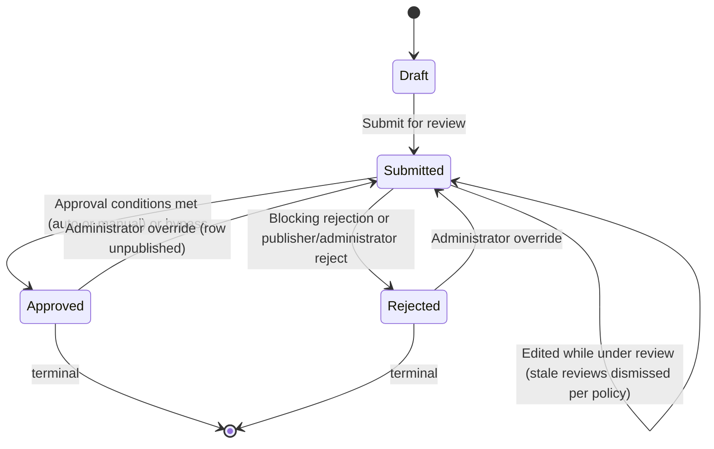

# G2H Design

## 1. Design Overview

### 1.1 Purpose

Glory 2 Him (G2H) is a content management system designed to allow users to contribute, organise, review, approve, publish, associate, and consume gospel-focused content.

The system is centred around `ContentItem`, which represents primary user-contributed content. Examples of content types include:

1. `Quote`
2. `Story`
3. `Testimony`
4. `Topic`
5. Future content types

All user-contributed and configurable content is subject to an approval process before it is considered trusted, visible, or publishable.

### 1.2 Core Design Principles

The design follows these principles:

1. Content must be versioned.
2. Content must be approvable.
3. Approval must be reusable across multiple entity types.
4. Approval must not be tightly coupled to each entity through direct database relationships.
5. Content associations must support both a specific content version and all versions of a content item group.
6. Content-specific behaviour must be policy-driven through settings.
7. `Topic` must be modelled as a `ContentType`, not as a separate database entity.
8. A `Topic` groups other content items through `Association`.
9. The feed is a domain projection only, not a database entity.
10. Any publishable content type except `Topic` can appear in the feed.
11. All deletes are soft deletes.
12. Soft-deleted content must be excluded from public visibility.

### 1.3 Source Inputs

This design is based on:

1. The `Glory 2 Him.drawio` design file.
2. The current C# entity model files.
3. The current EF Core model snapshot.
4. The supplied design direction for approval, settings, feed, topic, versioning, visibility, and soft delete behaviour.

### 1.4 Current Model Completion Status

The current source files are not complete. This document separates the design into:

1. Current implemented model.
2. Diagram-driven intended model.
3. Required model extensions.
4. Recommended design rules.
5. Final agreed direction where this supersedes earlier diagram wording.

### 1.5 How This Document Is Laid Out

**This document is the index.** Design is being split into area-scoped files
under `Documentation/Design/`, each owning one area and numbering its sections
with a prefix of its own. Four areas have moved so far: event design to
[`Documentation/Design/Events.md`](Design/Events.md) (§10 below is the pointer),
UI design to [`Documentation/Design/UI.md`](Design/UI.md) (§20), security
design to [`Documentation/Design/Security.md`](Design/Security.md) (§14 and
§18), and architecture design to
[`Documentation/Design/Architecture.md`](Design/Architecture.md) (§12, §16 and
§17). Everything else is still written here, in the section that already owns
the subject, and is still cited as `§N.M` until its own file exists.

The map immediately below says where every section lives, what to cite it as,
and — for an area not yet extracted — where it is going. The rulings behind the
split, its filenames, prefixes, citation form and completeness gates, are in
[`Documentation/Design/Split.md`](Design/Split.md), issue #481. `Split.md`
retires once the split has landed.

## Where Each Section Lives

A stale deep link into this file lands here, at the top, rather than at a
heading that has moved. This map is the one hop back: find the old number, and
it names the file the section is in now and the number to cite it by.

An area with no link is **not extracted yet** — its section is still in this
document under its existing number, and the prefixed form is what it will be
cited as once its file lands. A forward citation to one of those is expected to
dangle until then; this map is what resolves it.

| Old | Title | Lives in | Cite it as |
| --- | --- | --- | --- |
| §1 | Design Overview | This document — front matter for the whole design, not an area | `§1` |
| §2 | Domain Model Overview | `Design/Domain.md` — not extracted yet, still in this document | `§DOM2` |
| §3 | Content Design | `Design/Domain.md` — not extracted yet, still in this document | `§DOM3` |
| §4 | Association Design | `Design/Domain.md` — not extracted yet, still in this document | `§DOM4` |
| §5 | Supporting Content Entities | `Design/Domain.md` — not extracted yet, still in this document | `§DOM5` |
| §6 | ContentItemSetting Design | `Design/Domain.md` — not extracted yet, still in this document | `§DOM6` |
| §7 | Approval Design | `Design/Approval.md` — not extracted yet, still in this document | `§APR7` |
| §8 | Approval Settings Design | `Design/Approval.md` — not extracted yet, still in this document | `§APR8` |
| §9 | Approval Lifecycle | `Design/Approval.md` — not extracted yet, still in this document | `§APR9` |
| §10 | Event Design | [`Design/Events.md`](Design/Events.md) — extracted; §10 below is the pointer stub | `§EVNn` — renumbered rather than prefixed, so look the old number up in that file's *(formerly §10.X)* annotations rather than deriving it |
| §11 | Topic and Feed Design | `Design/Domain.md` — not extracted yet, still in this document | `§DOM11` |
| §12 | Component Architecture | [`Design/Architecture.md`](Design/Architecture.md) — extracted; §12 below is the pointer stub | `§ARC12` |
| §13 | AI Content Analysis | `Design/Approval.md` — not extracted yet, still in this document | `§APR13` |
| §14 | Visibility Rules | [`Design/Security.md`](Design/Security.md) — extracted; §14 below is the pointer stub | `§SEC14` |
| §15 | Recommended Corrections | This document — to be retired item by item, not relocated (`Split.md` §S4.1) | — |
| §16 | Recommended Service Responsibilities | [`Design/Architecture.md`](Design/Architecture.md) — extracted; §16 below is the pointer stub | `§ARC16` |
| §17 | Recommended API Design | [`Design/Architecture.md`](Design/Architecture.md) — extracted; §17 below is the pointer stub | `§ARC17` |
| §18 | Authentication and Authorisation | [`Design/Security.md`](Design/Security.md) — extracted; §18 below is the pointer stub | `§SEC18` |
| §19 | Search Engine Optimisation | `Design/Domain.md` — not extracted yet, still in this document | `§DOM19` |
| §20 | UI / UX Design | [`Design/UI.md`](Design/UI.md) — extracted; §20 below is the pointer stub | `§UI20` |
| §21 | Summary | This document — §21.1 to be retired, §21.2 to be kept here as a roadmap (`Split.md` §S4.2, §S4.3) | — |

The six area files, one line each:

- `Design/Domain.md` — `DOM` — the entity model: content, associations, supporting entities, settings, topic and feed, SEO. *(planned)*
- `Design/Approval.md` — `APR` — the approval entity, its settings, its lifecycle, and AI content analysis. *(planned)*
- [`Design/Architecture.md`](Design/Architecture.md) — `ARC` — the layer model, per-service responsibilities, and the API surface. **Exists.**
- [`Design/Security.md`](Design/Security.md) — `SEC` — visibility, enforcement posture, authentication and authorisation. **Exists.**
- [`Design/UI.md`](Design/UI.md) — `UI` — the React application's pages, components, navigation and authentication. **Exists.**
- [`Design/Events.md`](Design/Events.md) — `EVN` — event naming, addressing, the envelope, and the substrate. **Exists.**

## 2. Domain Model Overview

### 2.1 Main Domain Areas

The domain model is grouped into the following areas:

1. Content
2. Content Types
3. Content Settings
4. Content Associations
5. Approval
6. Approval Policy Settings
7. Supporting Content Entities
8. Feed Projection
9. Topic Grouping
10. Events
11. AI Content Analysis
12. Security and Audit
13. Soft Delete

### 2.2 Main Entity Groups

| Area | Entities |
| --- | --- |
| Content | `ContentItem`, `ContentType`, `ContentItemSetting`, `Association` |
| Approval | `Approval`, `ApprovalReview`, `ApprovalComment`, `ApprovalSetting` |
| Associated Entities | `Tag`, `Reaction`, `Comment`, `BibleReference`, `Link`, `Attachment` |
| Enum / Lookup | `EntityType`, `ApprovalStatus`, `Scope` |
| Future Subscription | `Subscription`, `SubscriptionDelivery`, or equivalent decoupled subscription records |

## 3. Content Design

### 3.1 ContentItem

`ContentItem` is the central content entity in the system.

It represents a versioned item of contributed content such as a quote, story, testimony, topic, or future content type.

### 3.2 ContentItem Properties

The content item model should contain the following design-relevant properties:

| Property | Purpose |
| --- | --- |
| `Id` | Unique identifier for this specific content version. |
| `ContentType` | Identifies the type of content, such as `Quote`, `Story`, `Testimony`, or `Topic`. |
| `Title` | Optional content title. |
| `Author` | Optional content author. |
| `Content` | Required body content. |
| `ContentHash` | SHA-256 hash of the normalized `Content` (trim, collapse whitespace, lowercase). Control field computed on every write. Non-unique index on (`ContentType`, `ContentHash`) for duplicate detection (§3.4.2). |
| `GroupId` | Groups multiple versions of the same logical content item. |
| `Version` | Version number for the item. The group's **tip** — the row edits go to — is the highest `Version` among its non-deleted rows, derived rather than stored (§3.4.1). |
| `IsPublished` | Identifies the currently published version. Only one row per `GroupId` may be published. |
| `ApprovalStatus` | Denormalized approval state (`Draft`, `Submitted`, `Approved`, `Rejected`). Mirrors the linked `Approval` record. `Approval` remains the source of truth. |
| `PublishDate` | Optional date/time from which the content can be visible. |
| `IsDeleted` | Soft-delete flag. When `true` the item is excluded from all public visibility. |
| `CreatedBy` | User who created the item. |
| `CreatedWhen` | Creation timestamp. |
| `UpdatedBy` | User who last updated the item. |
| `UpdatedWhen` | Last update timestamp. |
| `DeletedBy` | User who deleted the item. |
| `DeletedWhen` | Deletion timestamp. |
| `DeletionReason` | Reason for deletion. |

SEO and share fields — `Slug`, `MetaDescription` and `ShortCode` — are specified in §19.2, §19.3 and §19.7 and are not columns yet. `Content` may reference uploaded images inline by their media URL (§5.6.6); an inline reference is body text, not a column and not an association.

### 3.3 Content Versioning

Content is versioned by using:

1. `Id` for the specific version.
2. `GroupId` for the logical content item across all versions.
3. `Version` for the version number.
4. The highest `Version` among the group's non-deleted rows to identify the latest editable version. This is **derived, not a stored flag** (§3.4.1).
5. `IsPublished` to identify the current public version.

### 3.4 Content Versioning Rules

The following rules apply:

1. A new content item starts with `Version = 1`.
2. A new content item is its group's tip by construction — it is the only row, so it carries the highest `Version`. Nothing is written to say so (§3.4.1).
3. A new content item starts with `IsPublished = false` unless it is approved and published through the approval workflow.
4. A content item in `Draft` or `Submitted` may be edited in place.
5. Editing a `Draft` or `Submitted` item does not create a new version.
6. If approval reviews have already been submitted and the content item itself changes, those reviews must be dismissed (subject to `ApprovalSetting.RequireReapprovalOnChange`) and the item must be reviewed again. The item itself remains in its current status.
7. **`Approved` and `Rejected` are terminal.** A content item in either state is immutable in place — to its owner, to a publisher, and to an administrator alike. No role amends a terminal row's content, and there is no in-place exception (rule 16).
8. Editing a terminal content item creates a new `ContentItem` row with the same `GroupId` and incremented `Version`. The owner is the only creator of new versions — `Publishers` and `Administrators` roles never create version forks.

   A rejected row is terminal on the same terms as an approved one, and for the same reason: reviewers reached a verdict on that text, and text that changes underneath a verdict makes the verdict a record of nothing. The difference is only in what stays live — a **rejected** row never published, so a fork off one leaves the group with no public row until the new version is approved, where a fork off an approved one leaves the approved row published throughout (rule 12).
9. The new version becomes the group's tip, because its `Version` is the highest in the group. The fork is therefore ONE write.
10. The previous latest version stops being the tip for the same reason, and **nothing is written to demote it**. This rule used to require a second write, and that shape is withdrawn: a fork that demoted first and then failed to insert satisfied the old unique index while leaving the group with no tip at all — permanently uneditable, because the demote only ever wrote `false` (issue #265). Derived, that state cannot be represented.
11. The new version must not become `IsPublished = true` until approved.
12. The previously published version remains `IsPublished = true` until the new version is approved and published.
13. Exactly one content item per `GroupId` is the tip at any moment, and the derivation makes that true rather than enforcing it: the unique index on (`GroupId`, `Version`) admits one row per version, so the highest non-deleted `Version` in a group names exactly one row.
14. Only one content item per `GroupId` may have `IsPublished = true`.
15. Previous versions must remain available for audit, approval history, comparison, and rollback.
16. **There is no in-place amendment of a terminal item, by any role.** This rule previously granted an administrator one: amend an approved item without forking, resetting its approval to `Submitted` and dismissing active reviews. It is withdrawn, because a state that one role can edit out of is not terminal, and rule 7 depends on it being terminal for everyone.

    What replaces it is narrower and leaves a record. An administrator may move a terminal item's **status** back to `Submitted` through the approval transition operation (§8.6 HR-4, §9.7.1 rule 3) — an override, gated to `Administrators` alone, which unpublishes the row on the way out of `Approved`. Ordinary editing resumes only once the row is no longer terminal. The two acts stay separate: a status transition changes no content, and a content edit changes no status.
17. While such a re-opened item is pending, it no longer satisfies canonical content visibility (its `ApprovalStatus` is `Submitted`) and is not publicly visible until approved again.
18. **There is no stored latest-version flag to write.** This rule used to name the two points at which `IsLatestVersion` was written; the column is gone (issue #265) and the tip is read off the group's rows, so no operation — submit, review, approve, publish, or an administrator status override — can move the tip other than by adding a version.

#### 3.4.1 The Version Tip and the Published Row

The **tip** of the version chain is the row edits go to: the highest `Version` among the group's non-deleted rows. It is **derived, never stored**. `IsPublished` marks the row the public sees, and is stored. During a review window the two deliberately sit on different rows.

Exactly one row per `GroupId` is the tip at any moment — a consequence of the unique (`GroupId`, `Version`) index rather than a rule anything has to uphold. At most one `IsPublished = true` per `GroupId`, and that one *is* enforced, by a unique filtered index over the group's **live** rows — `WHERE IsPublished = 1 AND IsDeleted = 0`. The `IsDeleted` term is what stops a soft-deleted row holding the slot against versions that cannot see it; every versioned entity's slot index is declared from one place so the three cannot drift apart again, and a model test fails when a new one arrives without it (§5.6.4 rule 4).

The asymmetry is the point. "Exactly one tip" was previously enforced in two halves — a filtered unique index guaranteed *at most* one, and application code was trusted for *at least* one — and the halves came apart: a fork was demote-then-insert, so an insert that failed left a group with no tip, permanently uneditable. Derived, the state cannot be represented, and a failed fork writes nothing at all. "At most one published" has no matching failure mode: a group with no published row is an ordinary, recoverable state (§9.7.7 rule 7), so the stored flag and its index stay.

| Lifecycle event | Tip of the group | `IsPublished` |
| --- | --- | --- |
| Create V1 | V1 (the only row) | V1 = `false` |
| Edit a `Draft` or `Submitted` item (in place) | unchanged | unchanged |
| Owner edits a terminal item — `Approved` or `Rejected` (fork) | the new row, by carrying the higher `Version`; nothing is written to the previous tip | new row = `false`; previously published row unchanged |
| Submit / review / reject | unchanged | unchanged |
| Approve + publish | unchanged (approval adds no version) | approved row = `true`; previously published row = `false` |
| `Administrators` overrides a terminal item's status back to `Submitted` | unchanged | that row = `false` (§8.6 HR-4); no other row is republished |

Worked example (V1 published, owner edits):

| Step | V1 | V2 |
| --- | --- | --- |
| V1 approved + published | tip, published=`true` | — |
| Owner edits → fork V2 | published=`true` (still live) | tip, published=`false`, `Draft` |
| V2 submitted, under review | published=`true` | tip, published=`false`, `Submitted` |
| V2 approved + published | published=`false` | tip, published=`true` |

Worked example (V1 rejected, owner edits) — the case that distinguishes a rejected terminal row:

| Step | V1 | V2 |
| --- | --- | --- |
| V1 rejected | tip, published=`false`, `Rejected` | — |
| Owner edits → fork V2 | published=`false` | tip, published=`false`, `Draft` |
| V2 approved + published | published=`false` | tip, published=`true` |

Note the middle row: the group has **no published version at all** while V2 is in review, because V1 never had one to keep. Nothing is demoted at V2's publish, so §9.7.7 rule 7's ordering has nothing to order.

#### 3.4.2 Duplicate Content Rule

Purpose: two different people cannot submit the exact same content.

1. The duplicate match compares `Content` only (not `Title` or `Author`).
2. The match is normalized: trim ends, collapse whitespace/newline runs to a single space, lowercase (invariant culture). The normalization function is a frozen contract — changing it requires recomputing every stored hash in a migration.
3. The match is scoped per `ContentType`.
4. The match compares against all non-deleted rows (any status, any version). On modify, the item's own `GroupId` is excluded.
5. Mechanism: `ContentHash` = SHA-256 of the normalized content, computed by the orchestration on every write and stored on `ContentItem`. A non-unique index on (`ContentType`, `ContentHash`) makes the check an index seek. The index must not be unique — rows within one group may legitimately share a hash (for example a later version reverting to earlier wording); enforcement is application-side.
6. Response on a duplicate: add → polite acknowledgement ("Thank you for your submission") without creating the record and without revealing the duplicate; modify → validation error.

   **What the acknowledgement is, settled (#412).** The add answers *exactly* as a successful add answers — `201 Created`, with a `ContentItem` body composed field for field the way the persisted row would have been: a minted `Id` and `GroupId`, `Version` 1, unpublished, `Draft`, the computed `ContentHash`, and the same audit stamps the foundation applies. Nothing is written and **no completion fact is published**: a fact says a row exists, and none does. On the event path the same acknowledgement comes back as the delivery's *reply*, which is recorded as that delivery's response and reaches the requester alone — that asymmetry between a reply and a fact is what makes the acknowledgement safe to send there.

   The rule is not satisfied by hiding the message alone. **Both halves of the answer must be indistinguishable, or the arm that differs is the probe.** Two consequences follow, and both are enforcement, not commentary:

   - **Every rule the add applies to caller-supplied fields must be asked at the processing layer**, above the duplicate probe — not only at the foundation the quiet arm never reaches. A rule asked in one place only answers "duplicate" with an acknowledgement and "not a duplicate" with a validation error, which is a cleaner oracle than the message this rule replaces. The foundation keeps asking them too (§8.6.1, §14.6 rule 2).
   - **The client must not act on the acknowledgement's `Id`.** Following it lands on a row that is not there, and a 404 names the duplicate as plainly as any message. The contribution page therefore thanks the contributor and returns them to their own posts, taking the same journey for both outcomes.

   **What this deliberately does not close, stated at its real size.** No row is created, so the contributor's own reads will not show one. The rule closes the *answer*, not a later look; closing that too would mean creating a record, which is the thing the rule forbids.

   **Timing is not closed at all, and calling it "close" would be false.** The genuine arm performs a row insert, a `ProcessedEvents` insert and two publishes to the event store (the foundation's `ContentItem-Added` and this service's `ContentItemProcessing-Added`); the quiet arm performs none of them. That is a database write plus two cross-store round trips, not a sub-millisecond difference, and an attacker timing the endpoint recovers the yes/no answer the body was rewritten to hide — on few enough samples to be practical. **The response-shape rule therefore raises the cost of the probe; it does not eliminate it.** It is recorded as an open residual rather than padded, because a sleep long enough to cover a variable multi-store write is both unreliable and a denial-of-service surface of its own. Closing it properly means making the two arms do comparable work — the quiet arm performing the write into a discarded transaction, or the probe moving behind a uniform-latency boundary — and that is a larger change than rule 6 itself, to be designed rather than bolted on here.

### 3.5 Approval Invalidation Rules

Approval invalidation is entity-scoped.

A change to an entity only invalidates approvals for that specific entity and must not reset approvals of unrelated entities.

For `ContentItem`:

1. Changes to `Title`, `Author`, `Content`, `ContentType`, `PublishDate`, or other approval-sensitive content metadata may invalidate the content item's own approval.
2. If reviews exist for the content item, the reviews should be marked as `Dismissed` when the content changes.
3. The approval status of the item does not change when reviews are dismissed — a `Submitted` item remains `Submitted`. There is no exception: the `Administrators` in-place amendment that used to be one is withdrawn (§3.4 rule 16), and an amendment of a terminal item forks rather than resetting anything.
4. Reviewers must review the updated content again.

For linked entities:

1. Changes to tags, comments, reactions, Bible references, links, or attachments must not invalidate the parent `ContentItem` approval.
2. Only the changed entity's own approval lifecycle is affected.
3. Only the changed association's approval lifecycle is affected when the association itself changes.

Example:

1. A story is approved and published.
2. A new tag is associated to the story.
3. The tag or association may require approval.
4. The story remains approved and published.
5. The tag is only visible on the story once the tag and association are visible according to policy.

### 3.6 ContentType

`ContentType` is a fixed C# enum, not a database entity or a `ContentItem`. There is no `ContentTypes` table, no foundation service, no orchestration, and no lifecycle — a content type is a compile-time constant of the running application, not admin- or user-defined data.

```csharp
public enum ContentType
{
    Quote = 0,
    Story = 1,
    Testimony = 2,
    Devotional = 3,
    BibleStudy = 4,
    BlogPost = 5,
    Series = 999,
    Topic = 1000
}
```

`Series` and `Topic` are numbered apart from the standalone content types above — see §3.9.

### 3.7 ContentType Properties

Not applicable. `ContentType` has no properties of its own — it is persisted as a string (`HasConversion<string>()`, matching `Scope`, and matching `EntityType` on `ApprovalSettings` and `Associations`; the unconverted exceptions are `ApprovalStatus`, which has no conversion on any table, and `EntityType` on `Approvals` — both persist as `int`) wherever it is stored, and it is `ContentItem`, `ContentItemSetting`, and `ApprovalSetting` that carry a `ContentType` value, not the reverse. Adding, renaming, or removing a member is a code change and a release, not a runtime CRUD operation.

### 3.8 Content Type Rules

The following rules apply:

1. `Topic` and `Series` are `ContentType` members, not separate root entities.
2. The feed must exclude `Topic` and `Series` content items.
3. Any publishable content type except `Topic` and `Series` can appear in the feed.
4. `ContentItem.ContentType` is set on creation and never accepted from a caller on modify (§12.4.1 business rule 7a) — different content types carry different validation rules, so an item cannot be relabelled into a type its content was never checked against.
5. Adding a new `ContentType` member requires a code change; it can never be introduced by an end user or admin at runtime.

### 3.9 Series vs. Topic — to revisit

`Series` and `Topic` currently have identical documented behaviour: both are grouping content items excluded from the feed (§3.8 rules 1–3), and neither carries a rule that distinguishes one from the other. §11 ("Topic and Feed Design") describes the grouping mechanism only in terms of `Topic`; `Series` was added to the enum without an equivalent section or without checking whether it duplicates `Topic`.

**Open question:** are `Series` and `Topic` the same concept under two names, or do they represent genuinely different groupings (e.g. an ordered, authored sequence vs. an unordered subject tag)? This needs a design decision — either give `Series` its own rules distinct from §11, fold it into `Topic` and remove the member, or document the distinction explicitly (e.g. `Series` implies `Association.SortOrder`-based ordering per §9.6/§9.7.1 rule 4, `Topic` does not).

Until this is resolved, `Series` and `Topic` are numbered apart from the standalone content types (§3.6) as a placeholder, not as a statement that the design question is settled.

## 4. Association Design

### 4.1 Purpose

`Association` is the generic link between **two entities**. Both endpoints are generic and symmetric: neither is hard-wired to a `ContentItem`.

It supports:

1. Tags
2. Reactions
3. Comments
4. Bible References
5. Links
6. Attachments
7. Child content items
8. Topic and series membership
9. Related content
10. Related Bible references — a `BibleReference` to `BibleReference` pair, which the earlier one-sided shape could not express at all

**There is no `Kind` and no `SourceEndpoint`.** The `(EntityType, ContentType)` pair on each endpoint already carries the meaning, and direction falls out of the asymmetry — a `Series` paired with a `Story` is always container-to-member, because the reverse is not a thing that exists. A separate discriminator would be a second source of truth for something the endpoints already say, and two sources of truth for one fact eventually disagree.

**One narrow, structurally-constrained exception exists: `Purpose` (§4.9).** The no-discriminator rule rests on the premise that the endpoint pair carries the meaning — and for an `Attachment` endpoint the premise fails: `ContentItem` ↔ `Attachment` could equally mean header image, gallery member or downloadable file, and nothing on either endpoint can say which. `Purpose` names that slot. It is permitted **only** when an endpoint is an `Attachment` and forbidden otherwise, so it cannot grow into a general `Kind`: everywhere the pair is self-describing, a discriminator stays refused for the reason above.

### 4.2 Endpoint Shape

Each endpoint carries the same six fields:

| Field | Purpose | Owned by |
| --- | --- | --- |
| `Entity{A,B}Type` | The `EntityType` of the endpoint. | caller, create-only |
| `Entity{A,B}KeyId` | The specific row — the version, for a versioned entity type. | caller, create-only |
| `Entity{A,B}GroupId` | The version group. Equal to `KeyId` when the entity type is not versioned, so every endpoint has a group id and one set of rules covers both kinds. | caller for a versioned type; derived otherwise; create-only |
| `Entity{A,B}Scope` | Whether the association follows the endpoint across versions. | derived (§4.5); the only endpoint field that may change after creation |
| `Entity{A,B}EffectiveId` | `GroupId` under `AllVersions`, `KeyId` under `ThisVersionOnly`. | the database (§4.6) |
| `Entity{A,B}ContentType` | The endpoint's `ContentType`, denormalised so authorization composes from the row alone (§18.6). Null unless the type is `ContentItem`. | derived from the resolved endpoint, never caller-supplied |

Plus `UserId`, set only where the association is personal rather than editorial — today a `Reaction` endpoint. Null means editorial.

`Association` also implements `ISortOrder` (§11.7) and `IConfidence` (§9.7.1 rule 5), and carries `Purpose` and `IsDefault` for purposeful attachment placements (§4.9) — row-level fields like `UserId` and `SortOrder`, not part of either endpoint block.

### 4.3 Scope Rules

| Scope | Meaning | Effective id |
| --- | --- | --- |
| `AllVersions` | The association follows the endpoint's whole version group — a tag on a story survives the story being amended. | `GroupId` |
| `ThisVersionOnly` | The association applies to one specific row. | `KeyId` |

### 4.4 Canonical Ordering

The two endpoints are stored in a fixed order, A before B, computed on add. One row therefore serves both endpoints' lists, and "is X linked to Y" is one lookup rather than two.

A is the endpoint with the lower `(EntityType name, GroupId)` tuple; B is the other.

1. **Order on the enum name, not its numeric value**, using `string.CompareOrdinal`. The name is what SQL stores and what the §4.4 check constraint compares. A rename then breaks loudly at the constraint; a renumber would silently reorder existing rows.
2. **Order on `GroupId`, not the effective id.** `GroupId` never changes, so a scope toggle can never force A and B to swap columns — which would otherwise turn a set-scope operation into a repoint.
3. **Guid comparison must use SQL Server's ordering, not .NET's.** SQL Server orders `uniqueidentifier` by bytes 10–15 first; .NET compares the leading `_a`/`_b`/`_c` fields as integers. The two disagree on most pairs, so `Guid.CompareTo` would produce an order the database's own canonical-order constraint rejects. Use `new SqlGuid(a).CompareTo(new SqlGuid(b))`.
4. **Normalisation runs inside `DoAddAssociationAsync`, before the storage call** — not in the public method and not in an orchestration. `Association-Adding` is a public event address whose substrate handler enters `DoAdd` directly, so anything layered above it is bypassed.

### 4.5 Derived and Pinned Endpoint Fields

1. `Scope` is **derived, never accepted from a caller**: a non-versioned entity type resolves to `ThisVersionOnly` (it has exactly one row, so `AllVersions` would be a distinction without a difference); a versioned one defaults to `AllVersions`. The publication model comes from the §7.5.1 lookup — **never** from probing the entity for `IVersion` at runtime, which this repository has already proved unreliable twice.
2. `GroupId` is derived as `KeyId` for a non-versioned endpoint.
3. `ContentType` is derived from the resolved endpoint and never caller-supplied — it is an authorization input, so a caller who could set it could claim authority over a content type they hold no role for. Resolving it requires reading the endpoint row, which is an orchestration read; the foundation enforces the structural half of the rule (a value is permitted only on a `ContentItem` endpoint) and leaves a null endpoint costing the caller only the narrow role tier.
4. **Reclassification is forbidden.** `Type`, `KeyId` and `GroupId` are pinned against storage on every modify. Repointing an association is indistinguishable from deleting one link and creating another — except that it carries the original's approval state and review history across to a pair nobody reviewed.
5. The two endpoints must differ: `EntityAGroupId != EntityBGroupId`. Because a non-versioned endpoint's group id is its key id, this one rule covers an entity associated with itself, two versions of the same entity, and a tag paired with itself.

### 4.6 Effective Id

`Entity{A,B}EffectiveId` is a `PERSISTED` computed column — `CASE WHEN Scope = 'AllVersions' THEN GroupId ELSE KeyId END` — read-only to application code. It earns its keep twice:

1. **It is the read predicate.** Every tag panel and related-passage panel asks "associations for this entity". Without the column that is an `OR` across `KeyId`/`GroupId` plus two scope tests per side; with it, one seekable comparison on the query that runs on every page render.
2. **It makes uniqueness a database guarantee.** Two `AllVersions` rows for the same group differing only in `KeyId` mean the same thing; over the raw columns they are distinct rows, and the effective id collapses them. This matters because foundation services are reachable through public event addresses and cannot assume an orchestration's retrieve-or-add ran first. `UX_Associations_Pair` is the unique index over it, filtered on `IsDeleted = 0`, keyed on both endpoints' type and effective id with `UserId` last — nullable, so one index means "one per user" when set and "one globally" when null. It is paired with `CK_Association_CanonicalOrder`, without which the same pair written the other way round is a different key and the duplicate lands.

   `Purpose` (§4.9 — designed, not built) joins the key: `(EntityAType, EntityAEffectiveId, EntityBType, EntityBEffectiveId, UserId, Purpose)`, so the same pair may exist once per purpose — `UserId` keeps its position and its null-collapse role, with `Purpose` extending the key behind it. The index remains **deduplication**, not selection — it answers "has this exact statement been made before", while §4.9 rule 5 answers "which candidate renders". Existing rows all carry `Purpose = NULL`, which the unique index treats as a value, so per-pair semantics on non-attachment associations are unchanged.

### 4.7 Associated Entity Types

The supported entity types on either endpoint are defined by `EntityType`.

| EntityType | Purpose |
| --- | --- |
| `ContentItem` | Related content, topic and series children, parent/child links. |
| `Association` | Allows association records themselves to be approved. |
| `Tag` | Categorisation and labelling. |
| `Reaction` | Reactions such as love, like, celebrate. |
| `BibleReference` | Scripture references, including reference-to-reference pairs. |
| `Comment` | Comments on content. |
| `Link` | External or internal links. |
| `Attachment` | Files or binary resources. |

### 4.8 Association Approval

Associations are themselves subject to approval.

This means that even if a `Tag`, `Comment`, `BibleReference`, or `Link` is approved as an entity, the association between that entity and a `ContentItem` can still require its own approval.

Example:

1. A tag named `Faith` may already be approved.
2. A user associates `Faith` with a story.
3. The association can require approval based on the effective `ApprovalSetting` for `EntityType.Association` — see §8.4. This is **not** a `ContentItemSetting` concern (§6.1).
4. The tag becomes visible on the story only when both the tag and association are visible.

**Associations hosted on something other than a content item.** Because associations are symmetric, either endpoint may be any entity type, so a `BibleReference` ↔ `Tag` or `BibleReference` ↔ `BibleReference` association has no `ContentItem` to resolve settings from.

`ContentItemSetting` is not generalised to cover that. It stays scoped to content items (§6.1), and each host entity type gets its own settings entity instead — `BibleReferenceSetting` (§6.9) for the reference page. An association resolves the allowed/show switches per endpoint, from that endpoint's own settings entity, and is permitted only when both ends allow it (§6.10).

Approval is unaffected either way: `ApprovalSetting` is keyed on `(EntityType, ContentType, IsPersonal)` (§8.4) and needs no host at all. A personal association — one whose `UserId` is set (§4.2) — resolves the `(Association, IsPersonal = TRUE)` tier, which is how a user's own reaction can be exempt from review while an editorial placement is not.

### 4.9 Purposeful Placements — Purpose and IsDefault

**Status: designed, not built** (agreed 2026-08-17). Two row-level fields and one narrow operation, so an attachment can be attributed to a host *for a stated reason* — the header image of a story, the verse image of a Bible reference — without reintroducing the general discriminator §4.1 refuses.

| Field | Shape | Ownership |
| --- | --- | --- |
| `Purpose` | Nullable enum, persisted as a string via `HasConversion<string>()`, like the association's string-converted enum columns — `EntityAType` / `EntityBType`, the two `Scope`s and the two `ContentType`s — rather than its `int`-persisted `ApprovalStatus` (§3.7). Members are append-only: `Header = 0`, `Verse = 1`, `Gallery = 2` *(reserved)*. | Caller-chosen on add, then pinned against storage like the endpoints — re-purposing a row is remove + add, for the §4.5 rule 4 reason. |
| `IsDefault` | `bit NOT NULL DEFAULT 0`. Marks the preferred row among same-purpose candidates. | Refused on add; written only by the set-default operation (rule 4); pinned on the general modify. |

Rules:

1. **`Purpose` is mandatory when an endpoint is an `Attachment`, and forbidden when none is.** Enforced twice: `CK_Association_PurposeMatchesAttachmentEndpoint` — `(Purpose IS NULL AND EntityAType <> 'Attachment' AND EntityBType <> 'Attachment') OR (Purpose IS NOT NULL AND (EntityAType = 'Attachment' OR EntityBType = 'Attachment'))` — and the same rule in foundation validation with a typed exception. Every attachment association must say *why* the file is attached; a future purpose-less attachment (a downloadable file, say) is a new enum member such as `Download`, never a null.
2. **`IsDefault` requires a `Purpose`** — `CK_Association_DefaultRequiresPurpose`: `IsDefault = 0 OR Purpose IS NOT NULL`. A default with no slot to be the default *of* is meaningless.
3. **`Purpose` joins `UX_Associations_Pair` and both retrieve-or-add probes** (§4.6). The pair index is deduplication — so the same image may be a header candidate *and* a gallery member of one host as two rows, and a header add cannot false-positive against an existing gallery row of the same pair.
4. **`SetAssociationDefaultAsync` is the only writer of `IsDefault`.** It follows the set-scope/set-confidence shape (§14.7): it clears same-host, same-purpose siblings and then flags the target within one save — ordered so the rule 6 index never sees two flagged rows mid-flight — and publishes `Association-DefaultSet` on its own address. It **refuses a target that is not `Approved`** (or is deleted): only a vetted candidate can be promoted, so the default is always a member of the rendered set, never a hidden intention.

   **Who may call it is not yet ruled.** The nearest precedents disagree: `Sort` (also presentation) admits the owner and `Administrators` — but the row-local owner is the association's `CreatedBy`, who for a suggested candidate is not the host content's owner, and resolving the host's owner is not row-local (§14.7 posture A′) — while set-confidence and set-scope admit `Publishers` and `Administrators`. Until ruled, the conservative reading is `Administrators`, the one caller every precedent admits; whether the `Publishers` tier or the owner joins it is the open half of the ruling.
5. **Selection is a resolution rule, not a constraint.** Any number of same-purpose candidates may exist per host. The rendered attachment for a (host, purpose) slot is chosen among **visible candidates** — §14.3's association-visibility composite, which is association `Approved` + published + not deleted, both endpoints visible under their own §14.1 rule (so the attachment group must hold a published, non-deleted version), and the host's effective settings permitting display (§6.10 — `ShowAttachments` for a content item) — by `ORDER BY IsDefault DESC, PublishDate ASC, CreatedWhen ASC, Id ASC`, take 1: the default wins, otherwise the first approved candidate, with the ordering tail making "first" deterministic on every read surface. **`IsDefault` never overrides approval** — the flag orders candidates *within* the vetted set; a row outside it (`Draft`, `Submitted`, `Rejected`, unpublished, or deleted) does not exist to the resolver, flagged or not. A flagged row that later leaves the vetted set — an administrator status override, a takedown of the image — simply stops being a candidate, and the fallback covers the gap without an edit.
6. **At most one default per (host, purpose) slot** — `UX_Associations_DefaultPurpose`, unique over `(EntityBType, EntityBEffectiveId, Purpose)` filtered `WHERE IsDefault = 1 AND IsDeleted = 0`. Keying the host on the B side works because canonical ordering (§4.4) sorts on the enum *name*, and `"Attachment"` precedes every other resolvable endpoint name ordinally — so the attachment lands on A and the host on B. The one ordinal exception is `Association` itself, which sorts before `Attachment`; an `Association` ↔ `Attachment` pair is not a resolvable shape today and must stay refused while this index keys the host on B. Note the level: the constraint bites per **(host, purpose)** — per (pair, purpose) it would be vacuous, since rule 3 already permits only one row there. What it forbids is two *different* images both flagged as the default header of one item.
7. **Scope needs nothing new.** §4.5 rule 1's defaults are correct here: `AllVersions` on both sides for `ContentItem` ↔ `Attachment` means one candidate set per content group, resolving to the attachment group's newest published bytes (§5.6.4); a non-versioned host such as `BibleReference` derives `ThisVersionOnly` as always.
8. **The orchestration add flow threads `Purpose` through** — the add and both probes match on it — and refuses a caller-supplied `IsDefault`. The `Attachment` arm of endpoint resolution is unblocked by the `AttachmentService` of §12.3 entry 12; until that exists the arm keeps throwing, exactly as today.
9. **Approval of the attachment itself derives from the host** — §5.6.5. Nothing here changes association approval (§4.8): a purposeful association is approvable like any other.

## 5. Supporting Content Entities

### 5.1 Tag

`Tag` represents a categorisation label.

**The `GroupId` / `Version` / `IsLatestVersion` rows below are not implemented and never have been.** `Tag` carries `IApproval` only, `EntityTypeVersioning` declares it Single-Row (§7.5.1), and `IsLatestVersion` does not exist on any entity any more (§3.4.1). The rows are left standing because §7.5.1 rule 1 and §12.3.1 both cite this table as their worked example of documentation drift.

| Property | Purpose |
| --- | --- |
| `Id` | Unique tag identifier. |
| `Name` | Tag name. |
| `GroupId` | Groups all versions of this tag record together. Populated on creation and shared across all versions. |
| `Version` | Version number of this tag record, defaults to 1. |
| `IsLatestVersion` | Identifies the latest version of this tag record. |
| `PublishDate` | Optional date/time from which this tag becomes visible. |
| `IsPublished` | Identifies whether the current version of this tag is published. |
| `ApprovalStatus` | Denormalized approval state (`Draft`, `Submitted`, `Approved`, `Rejected`). |
| `IsDeleted` | Soft-delete flag. When `true` the tag is excluded from all public visibility. |
| `CreatedBy` | User who created the tag. |
| `CreatedWhen` | Creation timestamp. |
| `UpdatedBy` | User who last updated the tag. |
| `UpdatedWhen` | Last update timestamp. |
| `DeletedBy` | User who deleted the item. |
| `DeletedWhen` | Deletion timestamp. |
| `DeletionReason` | Reason for deletion. |

### 5.2 Reaction

`Reaction` represents a reusable reaction definition.

**As with `Tag` (§5.1), the `GroupId` / `Version` / `IsLatestVersion` rows below are not implemented and never have been.**

| Property | Purpose |
| --- | --- |
| `Id` | Unique reaction identifier. |
| `Name` | Reaction name. |
| `UnicodeEmoji` | Emoji representation. |
| `GroupId` | Groups all versions of this reaction record together. Populated on creation and shared across all versions. |
| `Version` | Version number of this reaction record, defaults to 1. |
| `IsLatestVersion` | Identifies the latest version of this reaction record. |
| `PublishDate` | Optional date/time from which this reaction becomes visible. |
| `IsPublished` | Identifies whether the current version of this reaction is published. |
| `ApprovalStatus` | Denormalized approval state (`Draft`, `Submitted`, `Approved`, `Rejected`). |
| `IsDeleted` | Soft-delete flag. When `true` the reaction is excluded from all public visibility. |
| `CreatedBy` | User who created the reaction. |
| `CreatedWhen` | Creation timestamp. |
| `UpdatedBy` | User who last updated the reaction. |
| `UpdatedWhen` | Last update timestamp. |
| `DeletedBy` | User who deleted the item. |
| `DeletedWhen` | Deletion timestamp. |
| `DeletionReason` | Reason for deletion. |

### 5.3 Comment

`Comment` represents user or reviewer visible discussion attached to content through `Association`.

| Property | Purpose |
| --- | --- |
| `Id` | Unique comment identifier. |
| `Content` | Comment body text. |
| `CreatedBy` | User who created the comment. |
| `CreatedWhen` | Creation timestamp. |
| `UpdatedBy` | User who last updated the comment. |
| `UpdatedWhen` | Last update timestamp. |
| `DeletedBy` | User who deleted the item. |
| `DeletedWhen` | Deletion timestamp. |
| `DeletionReason` | Reason for deletion. |

### 5.4 BibleReference

`BibleReference` represents scripture references associated with content.

| Property | Purpose |
| --- | --- |
| `Id` | Unique Bible reference identifier. |
| `USFM` | Canonical passage key including translation, such as `JHN.3.16.NIV`. Unique across non-deleted rows and immutable after creation (§7.5.1 rule 4, §12.3.1 rule 2a). |
| `Reference` | Bible reference, such as `John 3:16`. |
| `Translation` | Bible translation, such as NIV, KJV, ESV. |
| `Scripture` | Optional scripture text. |
| `CreatedBy` | User who created the Bible reference. |
| `CreatedWhen` | Creation timestamp. |
| `UpdatedBy` | User who last updated the Bible reference. |
| `UpdatedWhen` | Last update timestamp. |
| `DeletedBy` | User who deleted the item. |
| `DeletedWhen` | Deletion timestamp. |
| `DeletionReason` | Reason for deletion. |

### 5.5 Link

`Link` represents an external or internal link associated with content.

| Property | Purpose |
| --- | --- |
| `Id` | Unique link identifier. |
| `Name` | Display name. |
| `Url` | Target URL. |
| `LinkType` | Internal, external, video, article, source, etc. |
| `CreatedBy` | User who created the link. |
| `CreatedWhen` | Creation timestamp. |
| `UpdatedBy` | User who last updated the link. |
| `UpdatedWhen` | Last update timestamp. |
| `DeletedBy` | User who deleted the item. |
| `DeletedWhen` | Deletion timestamp. |
| `DeletionReason` | Reason for deletion. |

### 5.6 Attachment

`Attachment` represents a file or binary resource, attributed to hosts through `Association` (§4.9 for purposeful placements) or referenced inline from content bodies (§5.6.6).

| Property | Purpose |
| --- | --- |
| `Id` | Unique attachment identifier. |
| `Name` | Display name. |
| `BlobUri` | Storage location (§5.6.1). Never exposed to any client. |
| `Hash` | SHA-256 of the original uploaded bytes, for integrity and later deduplication (§5.6.3 rule 5). |
| `MimeType` | Served `Content-Type`; recorded from the re-encoded result, never trusted from the caller. |
| `SizeInBytes` | Size of the stored bytes — quotas, sweep reporting, storage telemetry. |
| `Width` / `Height` | Pixel dimensions, nullable — `og:image:width/height` (§19.8) and layout stability. |
| `AltText` | Optional accessibility text for purposeful placements (§5.6.3 rule 6). |
| `CreatedBy` | User who created the attachment. |
| `CreatedWhen` | Creation timestamp. |
| `UpdatedBy` | User who last updated the attachment. |
| `UpdatedWhen` | Last update timestamp. |
| `DeletedBy` | User who deleted the item. |
| `DeletedWhen` | Deletion timestamp. |
| `DeletionReason` | Reason for deletion. |

`MimeType`, `SizeInBytes`, `Width`, `Height` and `AltText` are agreed design (2026-08-17), not columns yet. §5.6.1–§5.6.7 specify the storage, serving, upload, approval and lifecycle design that lands with them; all of it shares that status.

#### 5.6.1 Physical Storage

1. Binaries live in **Azure Blob Storage**; SQL keeps metadata only. The `varbinary`-in-SQL alternative was rejected: the one precedent — profile avatars in the Identity database — is bounded at 256px, and content images are not, so database size, backup time and buffer-pool pressure would pay for the convenience forever. The entity was born with `BlobUri`; this section gives the column its producer.
2. One private container, `attachments`. Blob name = the attachment row's `Id` — one blob per **version row**, and a version's bytes never change, so blob names are immutable and cacheable (§5.6.2 rule 3).
3. Access goes through an `IBlobStorageBroker` wrapping `Azure.Storage.Blobs` — the same wrap-the-external-library pattern as the existing image-processing broker. Operations: upload, download, delete, exists, and list-by-prefix (for the §5.6.7 orphan sweep).
4. **Write order is blob first, row second**; deletion is the mirror — row first, blob second. An orphan blob is recoverable noise for the sweep; a row pointing at a deleted blob is a broken image.
5. `BlobUri` never leaves the server — no API response, no SAS URL handed to a browser. Everything serves through §5.6.2, which keeps storage swappable and the visibility gate in one place.
6. Development uses **Azurite** on the same broker code path. Azure-side blob soft delete (14 days) is enabled as belt-and-braces against sweep defects.

#### 5.6.2 Serving — the Media Endpoint

All attachment bytes are served by one endpoint: `GET /media/{attachmentId}` (§17.6).

1. Load the attachment metadata, apply the visibility gate, stream from blob storage with `Content-Type = MimeType`.
2. **The gate** (§14.7 posture A″): a published, approved, non-deleted attachment is public. A soft-deleted attachment is not found for **every** caller, including `Administrators` (§14.5 rule 3). Anything else answers **not-found** per §14.5 — never unauthorized — except to the uploader, the `Attachment` review roles, and reviewers or publishers of an entity whose row references the attachment, so a reviewer sees a draft's images in context. The gate does its own host check: it resolves the referencing host row — a §4.9 placement or a §5.6.6 inline body reference — and reads the host's state directly, never treating an association row's existence or approval as proof of host visibility (§14.3's composite rule is implemented nowhere yet — §12.5 entry 1 — and this gate must not repeat that gap).
3. Cache headers: a given `Id`'s bytes are immutable, so a published attachment serves `public, max-age=31536000, immutable`; a non-public one serves `private, no-store`. The consequence to accept deliberately: a takedown cannot recall bytes already cached downstream. It is bounded — ids are never reused, so a purged attachment's URL goes to not-found rather than to someone else's image — but a takedown that must be immediate needs a cache purge at the CDN, not a database write.
4. A CDN, when wanted, is a layer in front of `/media/*` — a configuration change, not a design change.

#### 5.6.3 Upload Rules

1. Upload is an authenticated multipart endpoint (`POST /api/attachments`, §17.6), following the existing profile-image endpoint's shape. The row is created at `Draft`: an attachment is never submitted by its uploader, because submission and approval derive from the host (§5.6.5).
2. **Raster images only** — `jpeg`, `png`, `webp`, `gif`. **SVG is refused**, not sanitised: script-capable XML is a stored-XSS vector.
3. The declared content type is a hint; the decision is **magic-bytes sniffing**. Size cap 10 MB; minimum dimensions 200×200 (§19.8 rule 6). A per-user rolling byte quota applies — an upload endpoint without one is a free file host.
4. **Every upload is re-encoded** through the image-processing broker before storage, and the original bytes are never stored. Re-encoding is the sanitiser: it destroys embedded payloads and strips EXIF metadata — including GPS coordinates, a real privacy concern for photos taken on phones.
5. `Hash` is the SHA-256 of the **original** uploaded bytes, computed before re-encode and recorded for integrity and later dedup (`IX_Attachments_Hash` already exists). Dedup itself is deferred — record now, collapse later.
6. `MimeType`, `SizeInBytes`, `Width` and `Height` are recorded from the re-encoded result. `AltText` is optional caller metadata; a header placement falls back to the host's `Title`, a verse image to its `Reference`, and inline images carry alt text in the markdown (§5.6.6).

#### 5.6.4 Versioning and Replacement

1. A stored binary is immutable. "Editing" an image is uploading a replacement: a **new version row pointing at a new blob** in the same `GroupId`, entering at `Draft` like any other versioned amendment (§3.4, §7.5.1).
2. The group's **published** row is the vetted one, and it is the only row the §4.9 resolution and the §5.6.2 gate ever surface publicly. A `Draft` replacement is invisible until it passes approval; the previously approved image keeps serving meanwhile.
3. An association with `AllVersions` on its attachment endpoint follows the group, so a vetted replacement propagates to every host with no association write.
4. **A deleted version does not hold the group's published slot.** The filtered unique index `UX_Attachments_GroupId_IsPublished` filters on `[IsPublished] = 1 AND [IsDeleted] = 0`, so soft-deleting a published version frees the slot and a later version can still be approved and published. The `IsDeleted` term is not redundant against §9.7.6 rule 1's unpublish-on-remove mandate — that is the flow half, this is the defence-in-depth half, for any row that reaches the state another way. Nor does it launder a takedown in the sense §4 closes for `Association`: the slot is a position within a group, not a name, so freeing it resurrects nothing — the deleted row stays deleted and unreadable to every read (§10.4). The sibling latest-version index this rule once also named is gone: `Attachment` lost `IsLatestVersion` with `ContentItem` and `Link` (§3.4.1), and the derived tip already excludes deleted rows.

    **The slot is not reserved while a row is deleted, so a restore must not assume it is still there.** A restored version comes back unpublished. §9.7.6 rule 1 clears `IsPublished` on the way out, and a row that reached the deleted state another way must be demoted on the way back in rather than re-entering the index against whatever now holds the slot. Approval status resumes as §9.7.6 says; publication does not resume with it.

    **`Link` and `ContentItem` carry the same term, from the same declaration.** All three published-slot indexes were written out by hand and all three drifted to the flag-only filter, so they are now configured through one shared declaration and a model test asserts the filter of every one — the case that matters most being a new versioned entity arriving without the index at all. For those two the term is defence in depth alone: their promote path already runs an unfiltered incumbent probe that clears a tombstone's flag before publishing (§12.4.1, §12.4.2). `GroupId` is the whole key in all three, since the filter pins `IsPublished` and a constant carries no selectivity. Index predicates are invisible to ordinary tests, and `has-pending-model-changes` detects a model the migrations do not match rather than a model that is wrong, so the guard is explicit at both ends: a model test on the declared filter, an integration test on the deployed one.

#### 5.6.5 Approval — Derived From the Host

`Attachment` keeps its full `IApproval` surface like every governed entity, and its approve operation must call `IAccessBroker` (§8.6.1) like every other. What differs is *where approval comes from*: nobody reviews an image out of context, so an attachment's approval derives from the host that displays it.

| Trigger | Effect |
| --- | --- |
| A host completes approval + publication, and a §4.9 purposeful association points at the attachment | The system approves and publishes the attachment, audited through the existing bypass mechanism — `IsApprovedByBypass = true`, reason `"Approved with host <EntityType>/<GroupId>"` — and the purposeful association is approved with it. |
| The approved host's body references `/media/{attachmentId}` inline (§5.6.6) | The same derived approval, from a single scan of the approved version's body at approval time. |
| A replacement version is uploaded into a group whose host is already approved and published (§5.6.4) | The host's approval is **not** re-opened — §3.5 keeps attachment changes from invalidating the parent — so the replacement has no host approval to ride on and must be vetted on its own: a publisher approves the new attachment version, and §5.6.4 rule 2's resolution picks it up. **Whether that is an explicit publisher review or an automatic re-derivation from the still-approved host was not decided at sign-off**; until it is, the explicit review is the safe reading, and the previously approved version keeps serving meanwhile. |
| A host is later unpublished or soft-deleted | **No automatic revocation** — another host may reference the attachment; reclaim is the §5.6.7 sweep, which checks every reference. |

The derived flow does not waive the §14.7 submission requirement — it satisfies it: an attachment (or purposeful association) still `Draft` is first submitted, then approved, in the same unit of work. Submit is already an owner-or-publisher act (§9.2) and the whole flow is publisher-gated, so no new permission is invented.

**The write is a bypass, and the slice no longer has to build a verb for it.** `IsApprovedByBypass` is derived from the access decision and an ordinary approve always clears it (§9.7.1 rule 3), so only a bypass can record what the derived flow does. This paragraph previously read that the path existed on `Association` alone and that the §12.3 entry 12 slice would therefore add a second bypass *verb* for `Attachment`. That is superseded: the bypass folded into the widened approval transition and is available on every approvable entity (§9.7.1 rule 3, §12.5.3 business rule 11), so `Attachment` inherits it with the transition #181 builds, and the derived flow requests it by setting the bypass pair on the payload. The bypass reason is supplied as on every other bypass — here composed by the flow rather than typed by a human, which is the one respect in which it differs.

**Open — whose identity performs the derived writes, and what happens when the bypass is refused.** Neither was ruled at sign-off, and both are real: a host publisher holding only a scoped role such as `ContentItem-Story-Publishers` is **not** in the `Attachment` `Publishers` tier, so either the derived writes run under a system actor that holds it or the flow requires the host's approver to hold it as well; and the bypass can be refused two ways — §14.7's decision refuses outright when `DoNotAllowBypassingSettings = true` for `Attachment`, and the same decision re-applies HR-2 to any acting identity that is the attachment's or the association's own `CreatedBy` and is not an `Administrators` taking HR-2's bypass exception (the case §4.9 rule 4 already contemplates, where the candidate was suggested by someone other than the host's owner). Either refusal leaves a vetted host published with its images non-public — survivable for a header (the §4.9 rule 5 fallback picks another candidate, or §19.8 rule 4's brand image) but not for an inline body image, which would simply be missing. Recorded here rather than assumed.

**Wiring.** The event-driven home for this is `ApprovalOrchestrationService` (§12.5.3 responsibility 12), which does not exist yet. **Interim rule:** the publisher action that approves the host also derives the attachment approvals synchronously in the same flow — acceptable because both operations are publisher-gated. Moving the side-effect into the orchestration later is a refactor, not a redesign.

`AttachmentsAllowed` / `ShowAttachments` (§6.5) remain the policy switches for whether a host may carry and display attachments; they gate the upload and association flows, not the `/media` read.

#### 5.6.6 Inline Images

The GitHub model: paste an image into the content editor, get an attachment and a markdown reference.

1. The editor posts the pasted image to the upload endpoint (§5.6.3) and receives the new attachment's id and media URL; it inserts `` at the cursor. Preview just renders the markdown — §5.6.2 serves the draft image to its uploader.
2. The attachment is standalone, owned by the uploader. **No association is created**, deliberately: the body markdown already **is** the authoritative record of inline placement — a reconciled association table is a cache of it, and caches of a body drift — and every association is an approvable governance object (§4.8), so a ten-image post would mint ten approval-bearing rows whose lifecycle means nothing to anyone.
3. Consequently, "referenced" means: `/media/{attachmentId}` appears in the `Content` of any **non-deleted `ContentItem` row — any version, any status**. Old versions keep their images renderable until hard-removed. The reference scan across the corpus is a sweep-time batch concern (§5.6.7), not a write-path one — and it must stay one for the *unused* determination. The §5.6.2 gate is the separate question: it cannot run a body scan per request, so its inline branch resolves against a **materialised reference index**, with the uploader and `Attachment`-role checks in front of it as a fast path rather than as a substitute — a host's reviewer is normally neither, and that reviewer is exactly who the §14.7 posture A″ admit exists for. The index is written from the body in the same unit of work as the save, and rebuilt wholesale by the sweep. It is a derived cache the body always overrules — never a second source of truth beside it, and never an approvable object like an association (§5.6.6 rule 2).
4. Associations are reserved for **purposeful placements** (§4.9): few, meaningful, individually governed. The two mechanisms answer different questions and neither duplicates the other.
5. An abandoned upload — pasted, never saved anywhere — is reclaimed by the §5.6.7 grace rules.

#### 5.6.7 Unused-Attachment Lifecycle

Storage must not grow unbounded, and reclaim must not destroy anything vetted history still needs.

An attachment **group** is unused when all three hold:

1. No non-deleted association touches any version of the group.
2. No `/media/{attachmentId}` reference — any version's id — appears in the `Content` of any non-deleted `ContentItem` row (§5.6.6 rule 3).
3. The newest version's `UpdatedWhen` is older than **30 days** — grace for paste-then-save gaps and slow drafts.

Process, as operations on `AttachmentProcessingService` (§12.4 entry 3), run manually until background-job infrastructure exists. **The gate splits on whether the step deletes.** The report is a read and admits the `Publishers` tier or `Administrators`; every step that deletes is **`Administrators` only**. The sweep acts across other people's attachments, so posture A's remove branch — owner or `Administrators` (§9.7.1 rule 7, §14.7 posture A.3) — has no owner to act as, and `Publishers` never removes at all; hard removal is `Administrators`-only everywhere (§14.6 rule 3).

1. **Sweep (report)** — list candidates with sizes; dry-run by default.
2. **Sweep (execute)** — soft-delete candidates with `DeletionReason = "Unused attachment sweep"`. A soft-deleted attachment answers not-found at `/media` and remains restorable.
3. **Purge** — rows soft-deleted for **90+ days**: hard-delete the row, then the blob (§5.6.1 rule 4's mirror order). The retention must exceed any content-restore window policy: condition 2 counts references only in non-deleted content rows, so an image referenced solely by a soft-deleted item reads as unused — and purge is the one step that cannot be undone if that item is later restored.
4. **Blob-orphan sweep** — blobs with no attachment row and age over 7 days are deleted; they are crash residue of the two-phase upload.

Storage telemetry — the sum of `SizeInBytes` by status — belongs on the admin dashboard, so "is storage growing?" never needs a database query.

## 6. ContentItemSetting Design

### 6.1 Purpose

`ContentItemSetting` exists primarily to **drive UI component visibility**, with a matching server-side gate so the UI cannot be bypassed.

Each facet has exactly two switches:

| Switch | Governs |
| --- | --- |
| `<Facet>Allowed` | Whether the *contribute* component is shown (e.g. the "Suggest a tag" box), **and** whether the association submit process will persist the record. When `false` the submit is rejected server-side, not merely hidden. |
| `Show<Facet>` | Whether the *display* component is shown (e.g. the tag panel). |

**`<Facet>AssociationsRequireApproval` is removed.** Whether an association requires approval is answered by `ApprovalSetting` and the approval workflow (§8.4), keyed on `(EntityType, ContentType, IsPersonal)`. Keeping a second copy here would create two sources of truth for one question and two places to look when an approval fails to fire. Six columns are dropped: the `RequireApproval` switch for each of Tags, Reactions, Links, Attachments, Comments and Bible References.

**Scope.** `ContentItemSetting` governs associations hosted on a `ContentItem` and nothing else. It is keyed on `ContentType` (required) with an optional `ContentItemId` override, both `ContentItem` concepts, and it is not generalised to other hosts. A host of another type gets its own settings entity following the same shape — see §6.9 for `BibleReferenceSetting` and §6.10 for how an association resolves the two.

### 6.2 Default and Override Behaviour

`ContentItemSetting` can apply at two levels:

1. Content type default.
2. Specific content item override.

### 6.3 Default Rule

If `ContentItemId` is null, the setting applies to all content items of the given content type.

Example:

1. All `Quote` items may allow tags.
2. All `Story` items may allow comments.
3. All `Topic` items may allow child content associations.

### 6.4 Override Rule

If `ContentItemId` is supplied, the setting applies only to that specific content item and overrides the content type default.

### 6.5 Current Settings

| Area | Settings |
| --- | --- |
| Tags | `TagsAllowed`, `ShowTags` |
| Reactions | `ReactionsAllowed`, `ShowReactions` |
| Links | `LinksAllowed`, `ShowLinks` |
| Attachments | `AttachmentsAllowed`, `ShowAttachments` |
| Comments | `CommentsAllowed`, `ShowComments` |
| Bible References | `BibleReferenceAllowed`, `ShowBibleReferences` |

### 6.6 ContentItemSetting Properties

| Property | Purpose |
| --- | --- |
| `Id` | Unique content item setting identifier. |
| `ContentType` | Content type this setting applies to. |
| `ContentItemId` | Optional specific content item override. |
| `SortOrder` | Where this content type sits wherever the types are presented as a list — the contribute page's type picker above all. Lower first; defaults to `1000`, past every value the seed curates, so a row written without a considered order lands after the ordered types rather than in front of them. Must be `0` or greater — the foundation rejects a negative on both write paths. |
| `IsDeleted` | Soft-delete flag. When `true` the setting is excluded from active policy resolution. |
| `CreatedBy` | User who created the setting. |
| `CreatedWhen` | Creation timestamp. |
| `UpdatedBy` | User who last updated the setting. |
| `UpdatedWhen` | Last update timestamp. |
| `DeletedBy` | User who deleted the item. |
| `DeletedWhen` | Deletion timestamp. |
| `DeletionReason` | Reason for deletion. |

### 6.7 Recommended Settings Extension

Recommended property:

```csharp
public bool LimitReactionsToLoveOnly { get; set; }
```

This supports favourite-style behaviour where only a love reaction should be allowed.

### 6.8 ContentItemSetting.ContentType typing — done

`ContentItemSetting.ContentType` is typed `ContentType` (§3.6), persisted as a string via `HasConversion<string>()` like every other `ContentType` column in the schema (§3.7). There is no `Guid` involved on either side — `ContentType` is not an entity and never had an `Id`.

```csharp
public ContentType ContentType { get; set; }
```

### 6.9 BibleReferenceSetting

`ContentItemSetting` is scoped to content items and nothing else. A Bible reference page hosts its own associations — suggested tags, related passages — and needs the equivalent switches, so it gets its own settings entity following the same shape.

| Property | Purpose |
| --- | --- |
| `Id` | Unique Bible reference setting identifier. |
| `BibleReferenceId` | Optional specific Bible reference override. Null means this row is the system-wide default. |
| `TagsAllowed` | Whether the "Suggest a tag" component renders, and whether the association submit persists. |
| `ShowTags` | Whether the tag panel renders. |
| `RelatedBibleReferencesAllowed` | Whether the "Suggest a Bible reference" component renders, and whether the association submit persists. |
| `ShowRelatedBibleReferences` | Whether the related-references panel renders. |
| `ReactionsAllowed` | Whether the reaction bar accepts a reaction, and whether the association submit persists. |
| `ShowReactions` | Whether the reaction bar renders. |
| `LimitReactionsToLoveOnly` | Restricts the passage to a single love reaction, as §6.7 does for content items. |
| `IsDeleted` | Soft-delete flag. When `true` the setting is excluded from active policy resolution. |
| audit fields | As `ContentItemSetting`. |

Rules:

1. There is no type dimension. `BibleReference` has no equivalent of `ContentType`, so the default tier is a single system-wide row rather than one per type.
2. At most one default may exist: `UNIQUE(Id) WHERE BibleReferenceId IS NULL` semantics — one row with a null `BibleReferenceId`.
3. At most one override per reference: `UNIQUE(BibleReferenceId) WHERE BibleReferenceId IS NOT NULL`.
4. An override takes full precedence over the default; the tiers are not merged, matching §6.4.
5. `BibleReference` is a Single-Row entity (§7.5.1), so the override keys on the row identifier directly with no version or group ambiguity.
6. As with `ContentItemSetting`, these switches never answer *whether approval is required* — that is `ApprovalSetting` (§8.4).

7. The reaction switches mirror `ContentItemSetting` exactly, so the reaction bar on a passage is configurable the same way it is on a story.

### 6.10 Resolving Settings for an Association

An association has two endpoints, so the settings entity that governs it is resolved from the **host** entity type of each end:

| Host endpoint type | Settings entity |
| --- | --- |
| `ContentItem` | `ContentItemSetting` |
| `BibleReference` | `BibleReferenceSetting` |

Rules:

1. The allowed/show switches are resolved per endpoint, from that endpoint's own settings entity.
2. Where both endpoints resolve a switch — a `BibleReference` ↔ `BibleReference` related-passage link resolves `RelatedBibleReferencesAllowed` on each end — the association is permitted only when **both** allow it. Denials union restrictively, matching the read-only role veto in §16.6.
3. An endpoint type with no settings entity imposes no restriction. It cannot silently deny, and it cannot silently grant on another endpoint's behalf.
4. Each new entity type that becomes a *host* for associations needs its own settings entity under this pattern. Entity types that only ever appear as the far end of an association — `Tag`, `Reaction` — do not.

## 7. Approval Design

### 7.1 Approval Purpose

The approval process controls whether an entity is trusted, accepted, and visible.

The approval system is intentionally not directly linked to all approved entities through database foreign keys.

Instead, it uses:

1. `EntityType`
2. `EntityId`

This allows the same approval workflow to apply to multiple entity types.

### 7.2 Approval Entity

`Approval` represents the workflow state for a specific entity instance.

| Property | Purpose |
| --- | --- |
| `Id` | Unique approval identifier. |
| `EntityType` | Type of entity being approved. |
| `EntityId` | Identifier of the entity being approved. |
| `ApprovalStatus` | Current approval status (`Draft`, `Submitted`, `Approved`, `Rejected`). |
| `IsApprovedByBypass` | `true` when the approval was granted via the bypass action while the approval conditions were not met. The actor is recorded on `UpdatedBy`. |
| `ApprovedByBypassReason` | Why the conditions were waived. Populated only alongside `IsApprovedByBypass`, and cleared with it. Capped at 500 characters. |
| `IsDeleted` | Soft-delete flag. When `true` the approval record is excluded from active workflow evaluation. |
| `CreatedBy` | User who created the approval record. |
| `CreatedWhen` | Creation timestamp. |
| `UpdatedBy` | User who last updated the approval record. |
| `UpdatedWhen` | Last update timestamp. |
| `DeletedBy` | User who deleted the item. |
| `DeletedWhen` | Deletion timestamp. |
| `DeletionReason` | Reason for deletion. |

### 7.3 Approval Status

Approval status values are:

| Status | Meaning |
| --- | --- |
| `Draft` | Entity is not yet submitted for review. |
| `Submitted` | Entity is awaiting one or more reviews. |
| `Approved` | Entity has received the required approvals. |
| `Rejected` | Entity has been rejected. |
| `Dismissed` | **`ApprovalReview` records only.** The review was invalidated by an entity-scoped change and must not count toward approval. Entities and `Approval` records never hold `Dismissed`. |

### 7.4 Approval Decoupling Rule

The approval process must not require a direct database relationship from every entity to `Approval`.

Instead:

1. Each approvable entity has its own table.
2. `Approval.EntityType` identifies the table/domain type.
3. `Approval.EntityId` identifies the specific entity instance.
4. Services enforce existence and consistency.
5. The database enforces uniqueness for approval records by `(EntityType, EntityId)`.

### 7.5 Approvable Entities

The following entities are subject to approval:

1. `ContentItem`
2. `Association`
3. `Tag`
4. `Reaction`
5. `Comment`
6. `BibleReference`
7. `Link`
8. `Attachment`
9. `ContentItemSetting`, if policy changes require approval.
10. `BibleReferenceSetting` (§6.9), on the same condition.

`ContentType` is not in this list — it is a fixed enum (§3.6), not a database entity, so it has no `EntityType` of its own and cannot itself be submitted for approval. Its role in the approval system is purely as a scoping dimension of `ContentItem` approval policy (§8.4).

### 7.5.1 Publication Model per Approvable Entity

Every approvable `EntityType` declares exactly one publication model. This table is the single source of truth for the approval workflow's versioned/single-row branch (§9.7.4).

| EntityType | Publication model |
| --- | --- |
| `ContentItem` | Versioned |
| `Link` | Versioned |
| `Attachment` | Versioned |
| `BibleReference` | Single-Row |
| `Tag` | Single-Row |
| `Reaction` | Single-Row |
| `Comment` | Single-Row |
| `Association` | Single-Row |
| `ContentItemSetting` | Single-Row |
| `BibleReferenceSetting` | Single-Row |

Rules:

1. The approval orchestration must resolve the publication model from this table, mirrored in code as one lookup keyed on `EntityType`. It must **not** infer it by probing the entity for the `IVersion` interface, by reflecting over property names, or by inspecting EF configuration.

   Runtime shape is not a stable discriminator, and the repository proves it twice. §5.1 and §5.2 describe `Tag` and `Reaction` as carrying `GroupId`/`Version`/`IsLatestVersion`, but neither implements the properties or the interface. More sharply, `BibleReference` dropped `IVersion` and its versioning properties while its storage configuration and validations kept referencing them — a probe would have silently changed the approval branch, where the compiler at least reports the mismatch.
2. Adding an entity type to §7.5 without adding it here is an incomplete change. A missing row is a hard error, never a default.
3. `Versioned` means an amendment to a **terminal** row — `Approved` or `Rejected` (§9.3, §9.4) — produces a **new row** (§3.4 rule 8), and any previously published row stays live until the new one is approved. `Single-Row` means the row that is edited **is** the published row, so there is nothing to fork into and an amendment of a terminal row is **refused** instead.

   The two branches are therefore not two ways of doing the same thing. Versioned preserves the rejected or approved text as a row and moves on; Single-Row has nowhere to preserve it, so it holds the row still until an administrator override re-opens it (§8.8 regardless-rule 1).

4. **Why this split survived `Approved` and `Rejected` becoming terminal.** The obvious simplification — version everything, so every terminal row can fork and one rule covers all ten types — was considered and rejected on two independent grounds.

   **Three of the Single-Row entities carry a natural-key unique index that a fork would violate.** A fork produces a second row holding the same `Tag.Name`, `Reaction.Name` or `BibleReference.USFM`, and each index refuses it. Versioning those types would have meant re-scoping each constraint to the live tip — narrowing a uniqueness guarantee to make room for rows nobody asked for.

   **And `Association` has no caller-editable content at all.** Every non-audit property is pinned against storage on modify, so the general modify's whole effective payload is the `Draft` ↔ `Submitted` carve-out — the same subtraction §8.6.1 uses to show a last-editor column would be provably inert on it. There is no content amendment to fork, so versioning it would add three columns and three indexes that nothing could ever write.

   The rule that generalises instead is **§3.4 rule 7**: a terminal row's content is immutable. Versioning decides *what an owner does next*, not whether the row is protected.

5. `Attachment` is Versioned but its approval is not independently sought — it derives from the host entity's approval (§5.6.5, §12.5.3 responsibility 12).

### 7.6 ApprovalReview

`ApprovalReview` represents a reviewer decision for an approval record.

| Property | Purpose |
| --- | --- |
| `Id` | Unique review identifier. |
| `ApprovalId` | Parent approval record. |
| `StatusId` | Review decision status. |
| `Comment` | Optional free text — capped at 1000 characters, never demanded — explaining **why** this reviewer reached this `StatusId`. A reviewer may approve without justifying it. It is rationale attached to *this reviewer's own verdict*: it has no settled state, nothing reads it and nothing waits on it. A reviewer who wants reasoning that other reviewers can see and act on writes an `ApprovalComment` instead — that entity carries `IsResolved` and may be either outstanding or purely informational (§7.8). |
| `IsDeleted` | Soft-delete flag. When `true` the review is excluded from threshold calculations. |
| `CreatedBy` | User who created the review. |
| `CreatedWhen` | Creation timestamp. |
| `UpdatedBy` | User who last updated the review. |
| `UpdatedWhen` | Last update timestamp. |
| `DeletedBy` | User who deleted the item. |
| `DeletedWhen` | Deletion timestamp. |
| `DeletionReason` | Reason for deletion. |

### 7.7 ApprovalReview Rules

The following rules apply:

1. A reviewer may only have one active review per approval record. A second active review by the same reviewer is refused — review decisions are not superseded or replaced. It is enforced in **two** places, not by one validation: `IAccessClient` refuses it on the add path, and the filtered unique index `UX_ApprovalReviews_ApprovalId_CreatedBy` is the backstop for every write that lands an active row. See §12.3.1, which records why the two surface differently.

    **The write window.** A reviewer may add, modify and withdraw their **active** review for as long as the parent approval is **`Submitted`** — the same window rule 2b states below. Note this is *narrower* than "not terminal": `Draft` is not terminal but is also not open, and the decision function refuses anything that is not `Submitted`. Before submission there is nothing to review; once the round closes the review record stands as filed.

    **A dismissed review may not be touched at all** — not amended, not withdrawn. §9.5 retains it as evidence that a verdict once applied to superseded content, so editing it would rewrite history in place and withdrawing it would destroy the very record the dismissal exists to keep. Both routes are refused; only `Administrators` hard removal, which is destructive maintenance, gets past it.
2. A review can approve, reject, or become dismissed. The verdict a **reviewer** may record is closed to `Approved` or `Rejected`; `Dismissed` is what *happens to* a review when an entity-scoped change invalidates it (§9.5), never something its author declares. A reviewer who could dismiss their own review would retract a rejection without recording a verdict, which is the same outcome as changing it but leaves no trace of the change.
2a. **A dismissed review is closed.** It is retained for audit and may not be amended — the reviewer files a new one (rule 7). Amending it instead would re-attach a stale judgement to text nobody re-read, because dismissal is precisely the record that the verdict no longer describes the current content.
2b. **A review may only be written while its `Approval` is `Submitted`** — this is the window, and it is enforced. Once the `Approval` reaches `Approved` or `Rejected` the round is over, and a verdict changed afterwards would not re-run the workflow: an entity could sit `Approved` with a standing rejection against it and nothing would notice. The check needs the parent `Approval`'s status, which is another entity's row, so it goes through `IAccessBroker` to `IAccessClient` (§8.6.1). Rules 2 and 2a are row-local and are enforced in the service itself.
3. A rejection may block approval depending on `ApprovalSetting.BlockOnReject`.
4. Reviewer eligibility is the review tier composed from the entity type (§8.3, §18.6), not per-setting configuration.
5. Self-approval is controlled by `ApprovalSetting.AllowSelfApproval`. It governs the ordinary route alone (§8.6 HR-2); the bypass answers to `DoNotAllowBypassingSettings`.
6. Dismissed reviews must not count toward the approval threshold.
7. A reviewer may submit a new review only after their previous review was dismissed.

    **Dismissal is not a user action, so this is not a route a reviewer can walk.** `Dismissed` is driven by the approval process: when an item subject to approval is amended, the orchestration receives the fact, determines from the approval settings that the existing verdicts are now stale, and sets every active `ApprovalReview` on that approval to `Dismissed` (§8.8, §12.5.3). A reviewer waits for that; they never trigger it. The dismiss verb exists so the workflow has something to call — it is not a control anyone drives by hand.

    **Consequence for a departed reviewer.** Reviews are owner-only, so a verdict recorded by someone who has since left stands: no `Administrators`, `Publishers` or peer reviewer may **edit or withdraw** it. That absolute is about *amendment*, and it holds. Clearing the block is a different question, and three routes exist:

    1. An administrator **bypass** (§8.6.1), waiving the §8.5 conditions and recording the waiver.
    2. A **change to the item under review**, which makes every active review stale and dismisses them — the intended route, and **now the live one: see the note below.**
    3. `Administrators` **hard removal**, which destroys the row and takes no access decision.

    **There is no dismiss-by-hand route, and there must not be one** (#295). One stood here — a publisher driving a standing verdict to `Dismissed` through a public verb and a registered request address — recorded rather than endorsed, and it is now removed at the gate: `DoDismissApprovalReviewAsync` refuses any caller that is not the workflow, which closes the API route and the event address together.

    A reviewer records `Approved` or `Rejected`. `Dismissed` is what happens *to* a verdict when the content it judged changes, and that is not a decision any person makes. The consequence worth stating: because nothing but the workflow can produce that status, the status value is itself the record of who acted — `UpdatedBy` names the human whose edit caused the dismissal without implying they performed it.

    Route 3 is recorded rather than endorsed: it clears the block without the change-and-dismiss cycle, though it does not edit the verdict — the amendment absolute survives. It is unnarrowed and needs no narrowing: hard removal is `Administrators`-only, and `Administrators` clears every tier, so an access decision could not make it stricter.

    **Route 2 is wired, so rule 7's re-file route is reachable.** Automatic dismissal is `ApprovalOrchestrationService`'s job (§12.5.3 b1): on a `-Modified` fact for an entity whose approval has `RequireReapprovalOnChange` set, the flow dismisses every still-counting review of the round before re-evaluating, and the re-evaluation reads the round again so it cannot approve on the strength of the reviews it just discarded.

    The dismissal runs under the **system identity**, not the editor's, and this is what makes route 2 possible at all. Rule 2 closes the verdict a REVIEWER may record to `Approved` or `Rejected`, and no role anywhere carries authority to dismiss — that is the point of #295. So the question is never whether the editor holds a sufficient tier; nobody does. The workflow does not ask the editor for authority that exists for no one: `IApprovalReviewWorkflowService` mints the system context in process and the caller supplies no identity at all. Automatic dismissal is not a user action, any more than automatic approval is.

    Route 1 (`Administrators` bypass) remains the way past a block. The predicate deciding *which* reviews a change invalidates lives on the access broker rather than in the flow, because the caller-facing read is identity-filtered and an identity-filtered read must never be the input to an invariant: an author sees none of the round's real approvals, so deciding from that view would dismiss nothing and then approve the edit on a review of the replaced text.

    Two alternatives were considered and rejected, recorded so the choice is visible rather than accidental (#226). **Letting a reviewer dismiss their own review** would make dismissal a self-retraction, which contradicts rule 2's whole point that dismissal happens *to* a verdict; the carve-out would have had to be unwound once route 2 landed. **Treating withdraw-then-refile as the sanctioned route** works mechanically — soft remove is owner-only and frees the index slot — but a withdrawn review leaves no record of what was said, which is the audit position §9.5 exists to preserve. Accepting a temporary gap cost less than either, and that gap is now closed.

    The dismissal WAS decided without consulting approval state, and the reasoning is kept because it is why the workflow needs no round-window guard today. §8.8 dismisses every active verdict when the reviewed content is amended — which is exactly when the round is being re-opened — and its *Regardless of this setting* rule 1 requires dismissal to work on a terminal round an administrator has moved back to `Submitted`. A round-window guard here would refuse in the cases the operation exists to serve. Whether the target is already dismissed or soft-deleted stays row-local, in the service (rule 2b).
8. A user who has filed an active review on an entity must not also set that entity's `ApprovalStatus` — reviewing is vouching, deciding is deciding, and one person doing both meets a threshold of `1` single-handed (§8.6 regardless-rule 1). `Administrators` are exempt, for the reason that rule gives. This replaces an earlier bar on anyone recorded in the entity's `UpdatedBy` reviewing it; that bar was withdrawn as unimplementable, and §8.6's *Why this is not written against `UpdatedBy`* records why.

### 7.8 ApprovalComment

`ApprovalComment` represents discussion or notes attached to an approval record.

| Property | Purpose |
| --- | --- |
| `Id` | Unique comment identifier. |
| `ApprovalId` | Parent approval record. |
| `Comment` | Comment text. **Required**, capped at 1000 characters. It is the substance of the record — an outstanding comment with no text holds its approval shut while saying nothing — so unlike `ApprovalReview.Comment` (§7.7, optional) it may not be blank. |
| `CommentType` | What the row **is**: `Comment` (a remark) or `Question` (an ask). Persisted by name, defaulting to `Comment` — which is what every row written before the column existed was, and what a caller who says nothing means. Validated only structurally, as an enum crossing a boundary. Not pinned on modify: correcting a remark into an ask, or back, is the author changing their own words. |
| `IsResolved` | Whether this comment is **settled** — whether it still requires something before the approval can proceed. See the note below the table; the distinction is load-bearing and both birth values are legitimate. When `ApprovalSetting.RequireReviewCommentResolutionBeforeApprovals = true`, no **outstanding** comment may remain before the approval conditions are met. |
| `IsDeleted` | Soft-delete flag. When `true` the comment is excluded from public visibility. |
| `CreatedBy` | User who created the comment. |
| `CreatedWhen` | Creation timestamp. |
| `UpdatedBy` | User who last updated the comment. |
| `UpdatedWhen` | Last update timestamp. |
| `DeletedBy` | User who deleted the item. |
| `DeletedWhen` | Deletion timestamp. |
| `DeletionReason` | Reason for deletion. |

**`IsResolved` means settled, not answered.** The distinction matters because it decides what the add path is allowed to do.

**Not every comment asks for anything.** An observation, or a reviewer recording their rationale so other reviewers can see the thinking behind a verdict, is informational — others may act on it or not, and nothing waits on it. That comment is created `IsResolved = true` and never blocks. A comment that *does* ask for something — a question, a change request — is created `false` and holds the approval shut until it is settled.

Three consequences follow, and each is easy to get wrong by reading the flag as "has the question been answered":

1. **Both birth values are legitimate**, so the add path applies **no SHAPE rule** to the field. A comment born settled is the informational case, not a missing validation. Pinning it `false` at creation — the way `IsDeleted` is pinned — would make it impossible to leave a remark without holding the approval shut, and is the single most tempting wrong "fix" in this area.

   **One PAIRING is refused, and only one.** That reasoning turns entirely on the add path being unable to tell an observation from an ask; `CommentType` is exactly that missing fact, so the pairing can now be ruled on where the field alone still cannot. An **ask born settled** is refused by `IAccessClient` (`AccessDenialReason.SettledAskNotPermitted`), because creating a resolved question *is* resolving one — a moment earlier, through a gate that never asks who may resolve — and it hands any caller a way past `RequireReviewCommentResolutionBeforeApprovals` without answering to the publisher tier §14.7 rule 5 gates on. The other three pairings stand untouched, including a **remark born outstanding**: it blocks where nothing had to, which is fail-closed and grants nobody anything. This is a gate question rather than a shape question, which is why it lives in the decision function and not in the foundation's validations.

   **The amend path asks the same pairing, ruled on the TRANSITION rather than the state.** A rule enforced only at birth is enforced only against callers who take one step: a remark born settled is permitted, retyping a remark as a question is an ordinary owner edit, and the two compose into the refused state in one extra call. `DecideMayAmendApprovalComment` therefore refuses any write that would *leave* a settled ask where storage did not already hold one. A row that is **already** a settled ask stays editable by its author — it got that way through the resolve operation and its publisher tier, so correcting its words moves nothing. This is also why `IsResolved` is ruled by the gate rather than pinned against storage: a pin is unconditional, and it would take the owner's remark with it.
2. **The column still defaults to `false`**, which is the fail-closed choice for a caller who says nothing: silence means outstanding.
3. **Settling runs both ways.** A comment recorded as an observation may later turn out to need action, and one settled prematurely must be able to block again — so `ResolveApprovalCommentAsync` is a two-way transition (§14.7 rule 5), not a one-shot.

**`CommentType` says what the row is; `IsResolved` says where it stands.** They are related at **birth only** — a `Question` is created outstanding, a `Comment` created settled — and never afterwards. The type is a separate column rather than a reading of the flag because the flag **moves**: the moment a question is settled it carries exactly what an informational comment was born with, and the two become indistinguishable. A thread cannot then say which rows were asks, and a resolve control cannot be offered on asks alone. Nothing recomputes one from the other. Rule 1 above still stands as a SHAPE rule — neither path pins `IsResolved` — but a caller who states both is no longer taken at their word: the **pairing** is refused wherever it can be reached, at birth by `DecideMayRecordApprovalComment` and on amend by `DecideMayAmendApprovalComment`.

Distinct from `ApprovalReview.Comment`, which is one reviewer's rationale for their **own** verdict and is never resolvable at all — nothing reads it and nothing waits on it. A reviewer who wants reasoning that others can see and act on writes an `ApprovalComment`; that is exactly the informational case above.

### 7.9 ApprovalReviewRequest

`ApprovalReviewRequest` invites a specific eligible person to review an approval. It is an **invitation, not an assignment**: §8.4 deliberately removed reviewer assignment, and this entity does not reinstate it. A request grants no eligibility (that stays composed from roles, §8.3), gates nothing, and appears in **no** §8.5 condition — the verdict, the counts and the blocks never read it. It exists so a moderation surface can show who has been asked and has not yet answered.

**Why this is not an "empty" `ApprovalReview`.** The reviewer's identity on a review *is* `CreatedBy` (§7.6) — there is no separate reviewer field — so a placeholder review created "for" someone else has only three shapes, and each breaks an invariant that holds elsewhere: written under the requester's identity it occupies the requester's own one-review-per-approval slot (`UX_ApprovalReviews_ApprovalId_CreatedBy`) and the target can never amend it (reviews are owner-only, §8.6.1); written under the target's identity it forges the audit trail, which the signed security context (§10.7) exists to prevent; and widening owner-only review writes so the row could be handed over is refused by §14.7 posture D rule 4. A request is therefore its own row, truthfully created by the requester.

| Property | Purpose |
| --- | --- |
| `Id` | Unique request identifier. |
| `ApprovalId` | Parent approval record. |
| `RequestedUserId` | The invited user's account id — the identity the answering review's `CreatedBy` is matched against. Never a display name: two accounts can share one. |
| `RequestedUserDisplayName` | Denormalised at request time for rendering only — the Core database cannot join the identity store's user table. Never compared, never trusted for identity. |
| `IsDeleted` | Soft-delete flag. A deleted request is withdrawn or answered and renders nowhere. |
| `CreatedBy` | User who made the request — truthful: the requester, not the target. |
| `CreatedWhen` | Creation timestamp. |
| `UpdatedBy` | User who last updated the request. |
| `UpdatedWhen` | Last update timestamp. |
| `DeletedBy` | User who withdrew the request, or the system identity when it was answered. |
| `DeletedWhen` | Deletion timestamp. |
| `DeletionReason` | Reason for deletion. |

The following rules apply:

1. **One active request per person per approval.** Enforced by the filtered unique index `UX_ApprovalReviewRequests_ApprovalId_RequestedUserId` (`IsDeleted = false`), mirroring the review index it exists beside.
2. **Requesting is open to the round's participants** — any holder of the review or publisher tier for the entity (the same suffix-matched set the verdict admits, §16.7.2), which is everyone above the read-only view. It is coordination, not decision, so HR-3 does not narrow it.
3. **The target must be worth inviting.** A request is refused unless the requested user currently satisfies the review tier for the entity, is not the entity's owner, and is **not blocked** by a `ReadOnly` whose scope covers it — an invitation to someone ineligible is a lie the UI would then render.

   **The block is a separate question from the tier, because a grant and a block can be held together**: somebody can be squarely in the review tier and still barred from voting (§18.6 rule 2). It is refused rather than dissolved like a duplicate — rule 4's idempotence covers invitations that are *redundant*, not ones that can never be answered, and an invitation nobody can answer leaves the round waiting on a vote that will never arrive.
4. **Duplicate requests dissolve quietly.** If the target already holds an active `ApprovalReview` or an active request for this approval, the operation returns the existing state without error — an idempotent dismiss, not a conflict.
5. **A pending request may be withdrawn by any member of the requesting tier** (rule 2), by soft delete, to undo a wrong invitation — deliberately wider than the owner-only rule on reviews, because a request carries **no verdict**: there is no judgement to protect, and `DeletedBy` records who withdrew it. This widening stops at the request; the answering review is owner-only from its first byte, exactly as §7.7 says.

   **PENDING is the whole of it.** Once the invitation has been ANSWERED it may no longer be withdrawn, and the attempt is refused rather than dissolved — withdrawing says the invitation was a mistake, and a standing verdict's provenance is not anyone's to rewrite. This is the mirror of rule 4: inviting somebody who has answered is harmless and dissolves quietly, while deleting the record that they were asked is not. In practice the gate is reached only where rule 6 has not run, since an answered request is normally already retired; withdrawing one already withdrawn stays the harmless no-op it has always been.
6. **An answered request retires itself.** When the requested user records their review, the request is soft-deleted under the system identity — leaving it standing would render the person twice, once asked and once answered.

    **Retirement is its own verb, not the withdrawal of rule 5.** The two differ in who acts, in what `DeletionReason` records, and in what a reader should conclude from the row: a withdrawal says the invitation was a mistake and names the person who withdrew it; a retirement says it was answered and names nobody. They also differ in what authorizes them, and that is what forces the split rather than a shared verb with a wider gate. The system identity is minted by `IEventEnvelopeBroker.CreateSystemAsync`, which deliberately carries **no roles** — the system flag stands in for the tier by itself — so it cannot satisfy rule 5's review-tier gate. Retirement therefore lives on `IApprovalReviewRequestWorkflowService.RetireAnsweredApprovalReviewRequestAsync`, an internal seam on the foundation service that mints the system context itself and gates on `IsSystemIdentity` instead of on a role. This is the same shape, and for the same reason, as `IApprovalReviewWorkflowService.DismissStaleApprovalReviewAsync` (§7.7 rule 7): the caller asks for the ACT and the service supplies the identity, which is what makes the flag unforgeable by construction rather than by validation. `ApprovalReviewerOrchestrationService` calls the seam from its `ApprovalReview-Added` subscription (§12.5.4 business rule 4); it does not write the row itself, and the approval round's orchestration takes no part in it.
7. **Requests live in the round's window.** Creation is refused unless the parent approval is `Submitted` (the §7.7 rule 1 window). A request still pending when the round closes blocks nothing — no §8.5 condition reads it — but it does not survive the close either; rule 8 retires it.
8. **A closed round retires what it never answered.** When an approval reaches an outcome — `Approved` or `Rejected` — every request still pending on it is soft-deleted under the system identity.

   **Blocking nothing is not the same as meaning nothing.** An earlier draft of rule 7 ended "it blocks nothing, so nothing needs to clean it up", and the first half of that is still true. What it missed is that the row is still **rendered**: a moderation panel showing an outstanding ask beside a settled outcome tells the reader the round is waiting for a vote, when the vote can no longer be cast at all — `IAccessClient` refuses to record a review on any round that is not `Submitted`, so the invitation is an ask with no possible answer. The clean-up is therefore about what the record *says*, not about what it gates.

   **Every route to an outcome, not just the button.** A round closes three ways — a reviewer or publisher deciding it, a standing rejection under `BlockOnReject`, and `AutoApproveIfAllApprovalRequirementsMet` closing it with no click at all — and all three retire. **`Dismissed` and `Draft` are not outcomes and retire nothing.** `Dismissed` is what happens to a *review* (§7.7 rule 2) rather than to a round; `Draft` has not entered a round at all (§9.7.3 rule 1). Neither has taken the answer away from anyone, so both still want their invitations — as does a `Submitted` round, which is the state every invitation is created in.

   **Under the system identity, and for rule 6's reason exactly.** The round closing is nobody's act. Attributing it to whoever cast the deciding vote would have `DeletedBy` name a person who withdrew nothing, and the withdraw verb of rule 5 could not serve it anyway — that gate asks for a review-tier role and the system identity holds none. It therefore runs through `IApprovalReviewRequestWorkflowService`, beside rule 6's retirement, as its **own verb with its own `DeletionReason`**: three different things can have happened to a deleted request row — withdrawn as a mistake, retired because it was answered, retired because the round closed — and a reader has to be able to tell them apart from the row.

   **A reset does not bring them back.** §8.6 HR-4's administrator override re-opens a decided round at `Submitted`, and it re-opens it with no invitations; a moderator asks again. Reinstating them was rejected because nothing could tell a close-retirement from a deliberate pre-close withdrawal except by matching `DeletionReason` text, and that field is documented as being *for a reader* — driving an invariant off it would make a sentence load-bearing. Asking again is one click and unambiguous; resurrecting the wrong rows is neither. This is the human counterpart of the posture the same reset already keeps for Berean (§8.6.2): what the round involved is kept, and only what it is *waiting for* is taken back.

   **It is bookkeeping, and it does not get to fail the close.** The retirement runs **after the outcome has been written**, as a reaction to the `Approval-Modified` that write publishes — and therefore **before** the entity sync rather than after it, which is a deliberate inversion of what this rule used to say. Delivery is synchronous inside `ModifyApprovalAsync`, so the reaction lands ahead of `PublishEntityApprovalCommandAsync`; nothing here reads the entity, and the rule's own subject is what the request row says rather than when the entity caught up. Recorded because a reader diffing this paragraph will see "and the entity sync published" gone and should know it was removed on purpose, and a failure in it never reaches the deciding caller — the same posture, and the same argument, as the AI reviewer's reset (§8.6.2): by that point the decision has committed and cannot be taken back, so faulting would report a decision that fully worked as an error. What a failure costs instead is the stale row this rule exists to remove, still clearable by hand, and an entry in the error log.

   **The posture is structural now rather than hand-written.** It used to be a `try`/`catch`/log around a direct call inside `ApprovalOrchestrationService`, repeated at each site that could close a round. As a subscription (§12.5.4 business rule 4) it is a delivery, and a failed delivery is recorded against the publish result rather than thrown at the publisher (§EVN23) — so the guarantee no longer depends on every future caller remembering the catch. Redelivery is safe because the retirement is idempotent: the handler gates on the signed status in the envelope and the gather returns no rows once they are gone, so a second delivery finds nothing to do. That covers a redelivery, which is sequential, and not two deliveries at once — which §12.5.4 business rule 4 states separately and #479 ruled accepted. The gather does **not** answer the round-closed half by itself — §12.5.4 business rule 4(i) has where that gate lives and why a bare subscription needs it written down. This is the one respect in which the §12.5.3/§12.5.4 split changes behaviour rather than only ownership.

   **Rows on rounds closed before this rule existed are left alone by any MIGRATION, and no backfill is written for them.** A re-versioned entity opens a *new* approval rather than touching the old round's rows, so nothing sweeps them wholesale. The count is small and bounded by how many invitations were outstanding when each round closed, which is why it is left rather than migrated.

   **What has changed is that they are no longer unreachable, and this paragraph used to say they were.** While the retirement was a direct call at the three sites that close a round, the only things that cleared a legacy row were a moderator withdrawing it by hand or the round being reset and decided again. As a subscription on `Approval-Modified` behind the status gate, **any** `-Modified` on an already-closed round now sweeps them — a caller-facing edit to a decided approval, or the reinstatement of a soft-deleted one, both of which leave the round `Approved` or `Rejected`. That is a benign improvement rather than a new rule: it retires exactly the rows this rule already wanted retired, under the same reason string, and it creates no way to reach a row on an open round. Recorded because the old sentence asserted the opposite and a reader would otherwise trust it.
9. **Future enhancement — notification.** The `ApprovalReviewRequest-Added` fact is the natural hook for notifying the invited user. Not built; recorded here so the eventual notification feature subscribes to an existing address instead of inventing a parallel signal.

## 8. Approval Settings Design

### 8.1 Purpose

`ApprovalSetting` defines policy rules for approval workflows.

This is similar to GitHub pull request approval rules, where different entity types can require one or more approvers before they are approved.

### 8.2 ApprovalSetting Entity

Recommended properties:

| Property | Purpose |
| --- | --- |
| `Id` | Unique approval setting identifier. |
| `EntityType` | Entity type this rule applies to. Nullable: `NULL` means every entity type — the global default tier (§8.4). |
| `ContentType` | The content type this rule is narrowed to. Nullable, and may be populated only when `EntityType = ContentItem`; `NULL` means every content type of the entity type. |
| `IsPersonal` | Whether this rule governs personal associations (`Association.UserId` set, §4.2) or editorial ones (`UserId` null). Nullable, and may be populated only when `EntityType = Association`; `NULL` means every association. It follows the row's `UserId`, whichever endpoint the personal entity sits on. |
| `RequireApprovals` | Whether approvals are required before the entity can be approved (GitHub "Require approvals" checkbox). When `false`, the approval conditions are trivially met. |
| `RequiredNumberOfApprovals` | Number of required approvals (1–5) before approval is complete. Applies when `RequireApprovals = true`. |
| `AllowSelfApproval` | Whether the author can approve their own item by the ordinary route (§8.6 HR-2). It does not govern the bypass. |
| `BlockOnReject` | Whether a single rejection blocks the approval. |
| `RequireReapprovalOnChange` | Whether edits reset approval status. |
| `AutoApproveIfAllApprovalRequirementsMet` | Whether the entity is automatically approved when all approval requirements are met. |
| `RequireReviewCommentResolutionBeforeApprovals` | Whether every `ApprovalComment` on the approval must be **settled** before approval can be granted. Only comments that ask for something ever hold it shut — an informational comment is created settled (§7.8). It gates the `Approval` entity only — it never affects an individual `ApprovalReview`'s own verdict. |
| `BlockOnZeroApprovalScore` | Whether an entity whose `IConfidence.ConfidenceScore` is `0` is blocked from approval. Defaults to `false`. Applies to both automatic approval and the manual approve action; a publisher or administrator may still bypass it (§12.5.3 business rule 11) or correct the score first (§9.7.1 rule 5). |
| `DoNotAllowBypassingSettings` | When `true`, the bypass action is unavailable — the approval conditions cannot be bypassed by anyone, including `Administrators`. |
| `IsAIReviewerOffered` | The AI reviewer feature switch (§8.6.2). `true` offers Berean in the reviewer-request UI and, once it is asked, has it file `ApprovalComment`s under its system identity. `false` means no AI reviewer is offered and no AI action of any kind is performed. **Commenting is not separately gated**: an AI reviewer that may be asked is one that may answer in words. |
| `IsAIReviewerAutomaticallyRequested` | Whether Berean is assigned **without anybody asking** when a round opens at `Submitted` (§8.6.2.1). Requires `IsAIReviewerOffered = true` to have any effect, and that pairing is enforced by a gate asked fresh on every automatic assignment rather than by a CHECK constraint (§8.6.2). Its three defaults deliberately disagree: the CLR initialiser and the column default are `true`, the fail-closed `ApprovalPolicyDefaults` value is `false`. **Stored and resolved — BUILT (#531):** the column, its migration and backfill, the seed constant, the setting screen's switch, and the resolved value composed into `AIReviewerPolicyVerdict.IsAutomaticallyRequested` all exist. **What acts on it is BUILT too (#534, #532)** (§8.6.2.1): `AIReviewerOrchestrationService`'s two subscriptions read that verdict, so a round that opens at `Submitted` under this switch gets Berean with nobody clicking. |
| `IsAIAllowedToVote` | Whether Berean may **additionally** cast an `ApprovalReview` — a vote — under its system identity, decided from `IConfidence.ConfidenceScore` against the two thresholds below. Requires `IsAIReviewerOffered = true`. With it `false` Berean still runs, still reads the score and still comments; the comment says what it believes the verdict should be and the score behind it, and no vote is cast. |
| `AIApprovalConfidenceRejectionThreshold` | `IConfidence.ConfidenceScore` value below which the AI reviewer files a `Rejected` `ApprovalReview`. Carried on **`ConfidenceScore`'s own scale — 0.00 to 10.00, persisted `decimal(4,2)`** (§13.5, whose initial suggestion threshold of 7.5 is a value on it). An earlier draft of this row said "0–1"; it was wrong, and a threshold column narrower than the score it is compared against cannot express most of the range. Read only when `IsAIAllowedToVote` is `true`; otherwise the score is reported in the comment and nothing is cast. |
| `AIApprovalConfidenceApprovalThreshold` | `ConfidenceScore` value above which the AI reviewer files an `Approved` `ApprovalReview`. Same 0.00–10.00 `decimal(4,2)` scale as the rejection threshold above, and never **below** it — the two may be equal, which simply closes the band between them. Between them the AI files an `ApprovalComment` only — no review — and a human decides. |
| `IsDeleted` | Soft-delete flag. When `true` the setting is excluded from policy resolution. |
| `CreatedBy` | User who created the setting. |
| `CreatedWhen` | Creation timestamp. |
| `UpdatedBy` | User who last updated the setting. |
| `UpdatedWhen` | Last update timestamp. |
| `DeletedBy` | User who deleted the item. |
| `DeletedWhen` | Deletion timestamp. |
| `DeletionReason` | Reason for deletion. |

### 8.3 Who May Review and Publish Is Composed, Not Configured

There are no reviewer- or publisher-role tables, and `ApprovalSetting` carries no `RestrictWhoCanReview` or `RestrictWhoCanApprove` flags. `ApprovalSettingReviewerRole` and `ApprovalSettingPublisherRole`, their services and their navigation collections were removed once the role convention had a single home.

Eligibility is **derived from the entity type** by the `%EntityType%-Reviewers` / `%EntityType%-Publishers` convention (§18.6), with the global `Reviewers`, `Publishers` and `Administrators` roles above them. Configuring the same fact in a table gave the system two answers to one question and no rule for which wins; the convention needs no row, cannot drift from the role names actually issued, and is composed in exactly one place — `G2H.Security.Client`, which owns role naming because naming is an access concern (§8.6.1).

A deployment that wants a *narrower* set than the convention grants restricts it where roles are issued, not by adding rows here.

### 8.4 Approval Policy Resolution

When an approval record is created or evaluated, the approval service must resolve the effective approval setting by entity type.

An `ApprovalSetting` row is identified by `(EntityType, ContentType, IsPersonal)`, and every part of the key is nullable:

- `EntityType` — `NULL` means "every entity type": the global default tier.
- `ContentType` — `NULL` means "every content type of this entity type". It may be populated only when `EntityType = ContentItem`, and must be `NULL` for every other entity type.
- `IsPersonal` — `NULL` means "every association". It may be populated only when `EntityType = Association`, and must be `NULL` for every other entity type. `TRUE` governs associations whose `UserId` is set — personal rather than editorial, §4.2 — and `FALSE` those whose `UserId` is null. It keys on the row's `UserId`, so a personal `Tag` or `Reaction` matches whichever endpoint it sits on.

Each scope is held by at most one live row, enforced by a filtered unique index per tier — `UX_ApprovalSettings_GlobalDefault`, `UX_ApprovalSettings_EntityTypeDefault`, `UX_ApprovalSettings_EntityTypeContentType`, `UX_ApprovalSettings_AssociationPersonality` — every one filtered on `IsDeleted = 0`, so a soft delete releases its scope.

Resolution order — the first matching row supplies **every** policy field. Fields are never merged across tiers, and rows with `IsDeleted = true` are skipped at every tier:

1. Entity-instance override — `(EntityType, EntityId)`. Reserved for a future design; no such store exists today.
2. The narrowing tier — `(Association, IsPersonal)` for an association, `(ContentItem, ContentType)` for a content item. The two are mutually exclusive by entity type, so no ordering between them is ever needed.
3. `(EntityType, NULL, NULL)` — the entity-type default.
4. `(NULL, NULL, NULL)` — the global default. One stored row that states the house policy for everything the tiers above do not narrow; the seed writes it.
5. The system default, when no row matches at all.

Rules:

1. The `ContentType` tier exists because one policy row cannot sensibly govern every content item. A `Testimony` may warrant two reviewers where a `Blog` needs one, yet both are `EntityType.ContentItem`. This mirrors the content-type-scoped roles in §18.6, so policy and permission are keyed the same way. The `IsPersonal` tier exists for the same reason on `Association`: a user's own reaction and an editorial tag placement are both associations, and the first must never wait on a review the second requires. It is a tier of the *policy*, never of *who* — no row is ever keyed on a user id; who is blocked or exempt is a role question (§18.6), and two homes for it would drift.

   A policy that requires no review is expressed, not special-cased: `RequireApprovals = false` with `AutoApproveIfAllApprovalRequirementsMet = true` opens the round and closes it on submission (§8.5 rules 1 and 6). The round still exists and §9.8 still holds; there is no path that skips the approval record.
2. **The system default is fail-closed.** It is reached only when no row resolves — on a seeded environment the global default answers first, so this is the policy of an environment the seed has not reached. When no row resolves, the effective policy is `RequireApprovals = true`, `RequiredNumberOfApprovals = 1`, `AutoApproveIfAllApprovalRequirementsMet = false`, `AllowSelfApproval = false`, `BlockOnReject = true`, `RequireReapprovalOnChange = true`, `DoNotAllowBypassingSettings = false`, `RequireReviewCommentResolutionBeforeApprovals = true`, `BlockOnZeroApprovalScore = true`. A missing configuration row must never mean "no approval needed" — an unseeded environment would silently publish everything.

   The last two were omitted when this rule was first written, even though §8.5 and HR-4 route 1 both depend on them, so their system default was simply unstated. Both take the strict reading the rest of the rule takes. Blocking on a zero score cannot deadlock anything: rule 8 of §8.5 is explicit that a **null** score does not block, and an entity the confidence process has not scored is null rather than zero.

   **This list is the authority, and it is not the same thing as the entity's property initialisers.** `ApprovalSetting` initialises `BlockOnReject` to `false` — a sensible default for a row somebody is creating in an admin screen, and the opposite of what this rule requires when *nothing resolves*. `IAccessClient` therefore falls back to a hard-coded system default rather than to a default-constructed setting; had it constructed one, it would have been silently more permissive than this rule on exactly one field, in exactly the unseeded environment the fail-closed reading exists for.
3. Approval settings are not snapshotted. If approval settings change, subsequent approval evaluation uses the latest effective settings.
4. Whether an association *may be created at all*, and whether it is *displayed*, are separate questions from whether it requires approval, and are not answered here — see §6 and the note in §4.8.

### 8.5 Approval Threshold Rules

The approval conditions are controlled by `RequireApprovals`, `RequiredNumberOfApprovals` (1–5), and `BlockOnReject`:

```text
conditionsMet =
    (RequireApprovals == false
        OR (activeApprovals (excluding dismissed reviews) >= RequiredNumberOfApprovals
            AND NOT (BlockOnReject AND any active rejected review)))
    AND (RequireReviewCommentResolutionBeforeApprovals == false
        OR all approval comments are resolved)
    AND (BlockOnZeroApprovalScore == false
        OR entity does not implement IConfidence
        OR ConfidenceScore != 0)
```

1. If `RequireApprovals = false`, no reviews are required — the conditions are trivially met.
2. If `RequireApprovals = true`, `RequiredNumberOfApprovals` (1–5) valid approvals are required.
3. Dismissed reviews must not count.
4. While the conditions are not met, status remains `Submitted`.
5. Meeting the conditions enables the manual approve action for `Publishers`/`Administrators` (the UI approve button).
6. If the conditions are met and `AutoApproveIfAllApprovalRequirementsMet = true`, the system applies `Approved` automatically — no human click; `IsApprovedByBypass` remains `false`.
7. When `RequireReviewCommentResolutionBeforeApprovals = true`, every comment on the approval must be **settled** (`ApprovalComment.IsResolved = true`) before the conditions are met. Only comments that ask for something ever hold this shut: an informational comment is created settled and never counts against it (§7.8). This gates the `Approval` entity, not any individual reviewer's verdict — a reviewer may record `Approved` while a comment is still outstanding; the approval simply cannot complete until it is settled.

    **The routes past an outstanding comment.** A submitter whose content is blocked by a comment left at `IsResolved = false` is unblocked when:

    1. **The thread resolves itself.** Another reviewer answers in a comment of their own — created settled, so it adds no new block — and then **the author of the blocking comment marks theirs settled**. Only they can: comments are owner-only, and no reviewer may settle a peer's (§14.7 rule 5).
    2. **An administrator settles it on the author's behalf**, through the resolve operation. This is the one comment operation an administrator may perform on someone else's row, and it changes no words.
    3. **An administrator bypasses**, moving to approval and waiving the §8.5 conditions outright rather than satisfying them (§8.6.1, HR-4). The comment stays outstanding and the waiver is recorded on the row.

    4. **The author withdraws it.** A soft-deleted comment leaves the block: §8.5 counts only comments where `IsDeleted is false && IsResolved is false`, which is also why `ApprovalComment-Removed` appears in the §10.17 re-test table as an unblocking fact. Owner-only, like every other write to the row.

    What is *not* a route: **nobody other than the author** may edit, settle or withdraw the blocking comment. That is the absolute — it is about who, not about which verb. Every route leaves a trace: route 1 keeps the conversation intact, route 2 records the overriding `Administrators` in `UpdatedBy`, route 3 records that the conditions were waived, and route 4 records `IsDeleted` / `DeletedBy` / `DeletionReason` and announces `-Removed`.

    Route 4 is the mirror of route 1 — if an author may settle their own comment, they may equally retract it — but it is worth naming, because an auditor tracing why a blocked approval completed will look for a `-Resolved` fact or a bypass flag and find neither.
8. When `BlockOnZeroApprovalScore = true`, an entity whose `ConfidenceScore` is `0` cannot meet the conditions. **A `null` score does not block** — it means the confidence process has not run yet, not that the association was judged worthless. Treating `null` as blocking would deadlock every approval until §13.4 ships, and would strand anything the process failed on. If a scored gate is wanted before that point, the setting to reach for is `RequireApprovals`, not this one.
9. A blocked entity is not `Rejected` — it remains `Submitted` with the conditions unmet. A publisher or administrator may bypass (§12.5.3 business rule 11), or correct the score through the set-confidence operation (§9.7.1 rule 5) and let the conditions re-evaluate.

### 8.6 Self-Approval Rules

These are **hard rules**. They are not defaults, they are not advisory, and no role — including `Administrators` — is exempt except where a rule states its own exception.

**HR-1. No one may ever review their own content.** Self-review of an `ApprovalReview` is refused *unconditionally*. `AllowSelfApproval` does not relax it. A review is one person vouching for another's work; a review of your own work carries no information, and a threshold met by self-reviews is not a threshold.

**HR-2. No one may approve their own content by the ordinary route unless `AllowSelfApproval` permits it.** This is the single rule the setting governs, and its reach is HR-4 route 1 alone — the bypass is route 3, it answers to `DoNotAllowBypassingSettings`, and it is open over your own submission to an `Administrators` only (next paragraph). With `AllowSelfApproval = false` — the fail-closed default (§8.4 rule 2) — the entity's creator must not approve it, and the creator of the `Approval` record must not approve it when they are also the content creator. Attempts must be rejected by validation, not merely discouraged.

**The setting governs HR-4 route 1, and an `Administrators` bypass over their own submission is HR-2's one exception.** Route 3 is a different act with a different record and its own gate, `DoNotAllowBypassingSettings`. Refusing it to the administrator-author left the override unreachable precisely where it is needed: on a small team the administrator is often the only publisher, so their own submission blocks on a threshold nobody else can meet, and the one route the design keeps for that case was refused before it was reached. What remained was editing the policy and approving quietly — the residual named below, which leaves no waiver on the row at all — or leaving the item stranded. The bypass is the better of the three, because it is attributable, carries a reason, and is closable.

The exception is narrow on every axis, and deliberately so, because HR-2's whole population **is** publisher-tier authors — nobody else may decide at all (HR-3) — so exempting the tier would not narrow the rule, it would retire it, and let one person create, submit, approve and publish alone. It rides on the bypass AND on the role: a `Publishers`-tier author is refused over their own submission on both routes, exactly as before. The **ordinary** self-approve stays shut for `Administrators` too. `DoNotAllowBypassingSettings = true` still closes route 3 to the author as it closes it to everyone. §8.6 regardless-rule 1 is asked *before* the policy is read, so no waiver reaches past it. And **HR-1 does not move**: nobody may review their own content whatever they hold, which is what keeps a bypass a recorded waiver rather than a vote wearing a second hat. *Ruled 2026-09-07, after an administrator's own submission could reach no route to approval at all.*

**HR-3. A reviewer may never set an `ApprovalStatus` directly.** A reviewer's whole instrument is the `ApprovalReview` record. They influence the outcome only *indirectly*, through automatic approval when the settings allow it. A reviewer applying the decision is the conflict the two-role split exists to prevent, and the role tiers are not interchangeable: `%EntityType%-Reviewers` is not a weaker `%EntityType%-Publishers`, it is a different job.

**The same principle governs the content underneath the status, and is stated where that gate lives.** A reviewer may not amend somebody else's row at all — §14.7 posture A.3 excludes the review tier from modify — because a rule that refuses a reviewer the `ApprovalStatus` field and lets them rewrite the text it describes is a rule about one column rather than about the job. HR-3 is written against `ApprovalStatus` because that is the field the approval workflow turns on; posture A.3 is the same principle on the content surface, and neither is a restriction of the other.

**HR-4. An `Approval`'s `ApprovalStatus` changes by exactly three routes, and no others.**

1. **Manual set by a publisher or administrator**, subject to every other settings check — the approval count in `RequiredNumberOfApprovals`, review-comment resolution under `RequireReviewCommentResolutionBeforeApprovals`, the rejection block under `BlockOnReject`, and the zero-score block under `BlockOnZeroApprovalScore`.
2. **Automatic approval**, when `AutoApproveIfAllApprovalRequirementsMet = true` and every condition in §8.5 is satisfied.
3. **Bypass by a publisher or administrator**, setting `IsApprovedByBypass = true` with an `ApprovedByBypassReason` alongside the status — and *only* when `DoNotAllowBypassingSettings = false`. For an `Administrators` this is the one route open over their **own** submission (HR-2's exception above); for everyone else in the tier HR-2 still refuses it, and `DoNotAllowBypassingSettings` closes it to all of them.

Setting `DoNotAllowBypassingSettings = true` closes route 3 entirely. Nobody, publishers and administrators included, can then approve without satisfying every required check.

**One residual, stated so it is not mistaken for a gap.** The setting governs approval *time*, not settings *editing*. An administrator with permission to edit approval settings can still disable or delete the rule and then approve. That is a deliberate limit of the mechanism — closing it requires separating "who may approve" from "who may configure approval", which is not modelled today. Any environment that needs a genuinely unbypassable rule must control who can edit `ApprovalSetting` rows.

**Regardless of `AllowSelfApproval`:**

1. **No one may both review and decide the same round.** A user recorded as the `CreatedBy` of an *active* — not `Dismissed`, not soft-deleted — `ApprovalReview` on the entity must not set that entity's `ApprovalStatus`, by any of HR-4's three routes. Reviewing is vouching; approving is deciding. One person doing both meets a `RequiredNumberOfApprovals = 1` threshold single-handed, which is self-approval wearing two hats. The bar attaches to the *act*, not to the role: a publisher who files a review has spent their vote on that round, and another `Publishers` or an `Administrators` must apply the decision. This is HR-3 restated by act rather than by role — HR-3 excludes the `Reviewers` role from deciding for exactly this reason, and a publisher who reviews is a reviewer applying the decision.

   **`Administrators` are exempt, and the exemption is the rule's own survival.** On a small team the administrator is often the only reviewer, and holding the bar against them means every round they review can end only in a bypass — which turns HR-4's accountability route into the routine one and stamps a waiver on rows that needed none. So an administrator's review counts toward the threshold like any other, and holding it does not bar them from applying the outcome. Nothing else is relaxed: the bar is checked before the policy is read and before a bypass is considered, so a publisher who has reviewed cannot bypass their way past it either — they refer the decision to an administrator. *Ruled 2026-09-04, after a moderation screen refused its own administrator's decision on a round only they had reviewed.*

2. **An amendment must be vouched for by someone other than whoever made it.** When the *content* of a `Draft` or `Submitted` entity changes — including a publisher or administrator fixing the wording during review — the reviews recorded against the previous text no longer describe what is being approved. This is discharged by the re-approval machinery, not by an identity check on the entity row: the content edit publishes `-Modified`, active reviews are dismissed (§8.8), dismissed reviews do not count (§8.5 rule 3), and the HR-4 route 1 threshold must be met again by reviews written against the amended text. Rule 1 then prevents the amender supplying that replacement vouch themselves and then deciding on it. An amender who wants the entity approved without waiting for fresh reviews has exactly one route left — bypass — and bypass is recorded (`IsApprovedByBypass`, `ApprovedByBypassReason`) and closable (`DoNotAllowBypassingSettings = true`).

**Why this is not written against `UpdatedBy`.** An earlier form of this clause barred whoever was recorded on the entity's `UpdatedBy`. That column cannot carry the rule, and the failure is not one of implementation. It is a single slot restamped by *every* write, including every narrow transition, so it answers neither "who last changed the content" nor "who has vouched for this text". A bar written against it is cleared by the next write: the author echoing their own row back unchanged — a modify that alters no field, available to the least privileged party in the flow — restores their own id and releases the publisher the bar was aimed at. Stamping only on a *real* content change does not save it either, because `X → Y → X` is two genuine edits whose net content is identical. And at the same time it refuses three sequences this document calls normal: a publisher correcting a confidence score and then approving (§8.5 rule 9, §9.7.1 rule 5), an administrator amending an approved entity and then bypass-approving (§8.8 rule 1, §3.4 rule 16), and the scope-setter whose ability to approve is the stated reason a scope change does not re-open approval (§9.7.1 rule 6). A rule that launders in the attacker's favour and misfires on the honest path is not a weaker version of the rule — it is a different and worse one. `UpdatedBy` is audit, not authorization.

**Two residuals, stated so they are not mistaken for gaps.**

1. With `RequireReapprovalOnChange = false`, rule 2's dismissal does not fire, so a publisher who amends a `Submitted` entity may approve it on the strength of reviews written against the earlier text — provided they filed none of those reviews themselves, which rule 1 still enforces. That is the configured meaning of the setting: an environment that turns re-approval off has said edits do not invalidate reviews. The fail-closed default is `true` (§8.4 rule 2), and an environment that wants amendments re-vouched must leave it there.
2. Nothing stops a publisher who amended the content from filing a *review* of it instead of deciding on it, because no data records that they were the amender. Rule 1 then bars them from the decision, so the amendment cannot reach `Approved` on their vouch alone unless the threshold is `1` and they are the only reviewer — a configuration in which the two-person rule was already absent. The UI must not offer the review action to a user who has just edited the entity, and the sequence is visible in audit; it is not enforced at the entity.

### 8.6.1 Where These Rules Are Enforced

**The foundation service is the last line of defence, not the first.** Every rule above must hold even when the orchestration is bypassed — and it can be, because foundation services are reachable through public event addresses (§10.2). A rule enforced only at orchestration is not enforced.

> **The rules below are enforced against the context the envelope carries, which is not the same claim as "against the caller's identity."** On the event path that context is deserialized from stored event content, and what makes it usable is that the envelope carrying it verifies: `EventBroker` signs every published envelope and each receiver checks the HMAC — over the event name, the direction and the carried sections — before any rule below reads it (§14.6 rule 4). Only this system holds the signing key, so a verifying envelope is one this system minted. Read every enforcement claim in this section with that qualifier attached: these rules are exactly as good as the key.

That creates a problem the architecture has to solve rather than wish away: HR-2 and HR-4 depend on `ApprovalSetting`, `ApprovalReview` and `ApprovalComment`, none of which a foundation service may read — a foundation service serves one entity and touches one table.

The answer is a **policy broker**, not a cross-entity read — and it extends the security client the services already depend on rather than introducing a second one:

1. **`ISecurityClient` gains an `Access` sub-client.** `G2H.Security.Client` already exposes grouped surfaces — `securityClient.Audits`, `securityClient.Users` — so `IAccessClient` joins them as `securityClient.Access`. Approval policy is an access question, and answering it beside identity keeps one client, one configuration, and one place a caller's rights are decided. A separate approvals client would have duplicated the claims plumbing and given the system two things to ask "may they?".
2. **`IAccessClient` owns the decision logic** — approval counts, comment resolution, the rejection and zero-score blocks, bypass permission, self-approval permission. It is a **pure function**: the caller gathers the rows it needs (`ApprovalSetting`, `Approval`, `ApprovalReview`, `ApprovalComment`) and passes them in. `Approval` is in that list because it is the hop: reviews are keyed on `ApprovalId`, and the only route from an entity to its reviews is the `Approval` row carrying that entity's `EntityType` and `EntityId`. Every question below that counts or inspects reviews needs it. The direction matters and is not stylistic: `Glory2Him.Core` holds a **project reference** to `G2H.Security.Client`, so a client that referenced `IStorageBroker` back would be a build cycle, not merely poor layering.

   **This clause used to say the client declares a read port that Core implements and injects.** That was the wrong trade, and the reason is worth keeping because it is not obvious. The client cannot reference `Glory2Him.Core`, so the four row shapes have to be re-declared on the client side **either way** — a port would not have avoided that cost, it would have added an async surface, its own exception tier and the loss of purity on top of it. Passing the rows instead leaves a function with no I/O, no failure modes but a malformed request, and rules that can be tested as rules.

   What the change does cost is the risk of an *ungathered* input, and that risk is real: a pure function cannot fetch what it was not given, so a missing list reads as **empty**, and empty is the permissive answer to every question asked of one. An ungathered comment list makes "all comments are resolved" vacuously true; an ungathered review list makes a rejection invisible. Both fail *open*, and both would pass any test written against them. This is closed structurally rather than by discipline: every section of every request is `required`, so a forgotten gather is a compile error at the call site.
3. Foundation services reach it through an **`IAccessBroker`** in `Brokers/Securities/`, alongside `ISecurityBroker` and `ISecurityAuditBroker`. The service still calls one storage broker for its own entity; the policy broker is a dependency like any other, so the service stays single-entity.
4. **The broker returns a verdict, not settings.** If it handed back an `ApprovalSetting`, the decision logic would be re-implemented in every foundation service and would drift. One question, one answer, one place.
5. **The actor is passed in from the envelope's `SecurityContext`.** The client must not resolve identity itself through `IHttpContextAccessor`: there is no `HttpContext` on the event path, so an approval arriving through an event address would carry an empty principal, and two identity sources that disagree would disagree precisely on the unauthenticated path. `SecurityAuditBroker` already takes the actor as an explicit `SecurityContext` argument wherever an actor applies, for exactly this reason — the lesson is taken rather than repeated.

   Note what this does *not* settle: it makes the envelope the single identity source, and the strength of that source is the strength of the signature over it. On the direct path the context is built from the real principal; on the event path it is deserialized and admitted only once the envelope verifies (§14.6 rule 4). One source is still the right answer — two would disagree in the permissive direction — but the source is only as trustworthy as the key that signed it.

   **One invariant holds this together and is easy to break by accident.** HR-1 and HR-2 are both `actor == CreatedBy` comparisons, and each side reaches the security client through a `ClaimsPrincipal` rebuilt from the envelope's actor. `AccessBroker` resolves the actor; `SecurityAuditBroker` stamps `CreatedBy`. They must build that principal **the same way**, so both go through a single `SecurityContextPrincipalFactory` rather than each carrying its own conversion. A second copy would not fail loudly — it would quietly answer "not the author" for the author, which is the permissive direction, and no existing test would notice.

**Known limitation.** The policy read and the status write are not in one transaction, so two concurrent approvals can each observe the threshold as met. The window is small and the outcome is an over-approval rather than an unauthorized one, but it is real and is not closed by anything above.

**`IAccessClient` has landed, and the gaps below closed with it — for two services.** The mechanism exists: `securityClient.Access` decides, `IAccessBroker` in `Brokers/Securities/` gathers, and `AssociationService`'s approve path and `ApprovalReviewService`'s add and modify paths both call it. What follows records what that changed and, just as importantly, what it did **not**.

**It is wired into every approvable entity that has a foundation service.** `TransitionContentItemApprovalAsync`, `TransitionTagApprovalAsync`, `TransitionReactionApprovalAsync`, `TransitionCommentApprovalAsync`, `TransitionBibleReferenceApprovalAsync`, `TransitionLinkApprovalAsync` and `TransitionAssociationApprovalAsync` all exist, and each calls `IAccessBroker` before writing. `ApprovalReviewService`'s add and modify paths do the same.

*This paragraph used to read "wired into `Association` and `ApprovalReview` only… the other six have no approve operation yet". That is out of date: the rollout happened, and consequence 2 below — the obligation on any new approve operation to call the broker — was discharged rather than left outstanding.* The one approvable entity still outside this is `Attachment`, which has no foundation service at all.

The rules are enforced everywhere they currently apply, which is still not the same claim as "everywhere", and must not be read as one.

**The HR-2 interim posture is over.** Foundation services refused self-approval *unconditionally* while the setting that governs it lived on a table they could not read. That bar now goes through the access decision, so `AllowSelfApproval = true` finally has the effect §8.6 says it has. The strict rule shipped first and has relaxed to the configured one, which was the plan.

**HR-4 route 1 is enforced.** `RequireApprovals`, `RequiredNumberOfApprovals`, `RequireReviewCommentResolutionBeforeApprovals`, `BlockOnReject` and `BlockOnZeroApprovalScore` are read on every approve, and the §8.5 formula is evaluated once, in one place. A caller reaching the foundation approve address directly can no longer publish a row with no reviews, or whose reviews are rejections, or whose `ConfidenceScore` is `0` under a policy that blocks it.

**HR-4 route 3 is implemented on all seven approvable entities, as part of the widened approval transition.** The bypass is requested by setting `IsApprovedByBypass` and `ApprovedByBypassReason` on the transition's payload; the service runs its row-local `Publishers`-tier gate, resolved from the **stored** row, then calls `IAccessBroker` with `IsBypassRequested` and the reason attached. `DoNotAllowBypassingSettings` closes a route that exists rather than gating nothing: under it the bypass is refused to everyone including `Administrators`, and an unexplained bypass is refused under any policy. The outcome lands on `<Entity>-Approved` — a bypass approval is an approval to every subscriber and the waiver travels on the row; a fact of its own would split the audience for one outcome and leave anyone subscribed to `-Approved` missing exactly the approvals most worth seeing.

**The earlier rejection of a bypass *flag* is reversed, and the reversal is recorded here because the reasoning that produced it was sound and needs answering rather than ignoring.** This section previously required a separate verb, on the grounds that "a flag would make every ordinary approve a potential bypass and would demote the reason — the only thing that makes a bypass tolerable — to an optional argument on the common path." That was built, as `BypassApproveAssociationAsync` on `Association`, and it is now withdrawn.

What changed is that the bypass stopped being the only thing the verb had to carry. Once `Administrators` overrides out of a terminal state became a supported write (HR-4), a separate verb per authority would have meant three verbs on seven services — twenty-one operations, each with its own payload validation, its own gate and its own tests, differing only in who may call them and what the target status is. Three verbs are three places for the derivation rules to drift, and the rules are the part that matters.

**Both mitigations survive the reversal, which is why it is tolerable.** The reason is still validated non-empty and bounded at 500 characters **before any policy is read**, so an unexplained bypass is refused under every policy — including one that would have permitted the waiver. And the pair that lands on the row is still *derived from the verdict*, never accepted: `IsApprovedByBypass` is written from `IsBypassUsed`, and the reason is retained only when a waiver actually occurred. A bypass that turned out to be unnecessary records no bypass at all. The flag on the payload is a **request**, not a value the caller writes.

The specific worry — that a flag makes every ordinary approve a potential bypass — is answered by the same derivation. An ordinary approve sends the flag false, asks for nothing, and can be granted nothing; the decision cannot waive what was not requested. What a caller can do by setting the flag is ask, in writing, with a reason attached, and be refused when policy says so.

**Route 2 remains unimplemented, and that is where the remaining gap sits.** `IAccessClient` answers it — `ApprovalConditionsVerdict.ShouldAutoApprove` — but nothing calls it. Route 2 needs the approval evaluation of §9.7.7, which belongs to an orchestration, and there is no `Association` orchestration. The exposure is bounded: it is an absent automation rather than an absent restriction, so the effect is that `AutoApproveIfAllApprovalRequirementsMet = true` does nothing, which is stricter than configured and not more permissive.

**What route 3 inherited, and so did not have to build.** `IsApprovedByBypass` and `ApprovedByBypassReason` are on `IApproval`, denormalised onto all eight approvable entities for the same reason `ApprovalStatus` is (§9.8) — so "what was published without meeting its conditions" is a query rather than a join. The approve path already derived both from the access decision and pinned them against storage on modify (§9.7.1 rule 3), and the verdict already reported **what** a bypass waived (`BypassedBlockReason`) rather than merely that one occurred: a bypass over a standing rejection and a bypass over nothing would otherwise leave identical records, and the first is the one anybody would later go looking for. The verb had only to request the bypass and carry the reason.

The row-local half is unchanged and still enforced first: the `Publishers`-tier gate resolved from the **stored** endpoints, HR-3's exclusion of `Reviewers` roles, and the `Submitted`-only precondition. It is kept deliberately even though the access decision repeats the tier check — it costs an unauthorised caller one role comparison instead of four table reads, and it means a defect in the gathering can only ever make the gate stricter, never open it.

**The review window is enforced.** §7.7 rule 2b — an `ApprovalReview` may only be written while its `Approval` is `Submitted` — is checked on both the add and the modify path. The modify path passes the **stored** review's `ApprovalId` rather than the caller's, because a caller who could name their own would point a review at an approval whose round is still open and change a verdict on one that closed.

**HR-1 is enforced.** The traversal it needs — `ApprovalReview.ApprovalId` → `Approval.EntityType`/`EntityId` → the target entity's `CreatedBy` — lives in `AccessBroker` as a switch over `EntityType`, not as a denormalised author column on `Approval`; a copied author would be a second source of truth for the one field the rule turns on. The same read returns the entity's `ContentType`, which incidentally repairs something else: `ApprovalReviewService`'s own role check matches any `-Reviewers` suffix, because a review row names no entity type, so a `Tag-Reviewers` passed it for a `Link`'s approval. The tier is now also checked against the entity actually under review.

One prerequisite was closed ahead of it, and has since been closed more thoroughly. `ApprovalReview.ReviewerId` was originally free text, so the index of the day, `UX_ApprovalReviews_ApprovalId_ReviewerId` — the only thing standing behind §7.7 rule 1 — could be cleared by inventing a second id, and one reviewer could meet `RequiredNumberOfApprovals = 3` alone. Binding the field to the acting user closed that; **the field has since been removed entirely** as redundant with `CreatedBy`, which is written by `SecurityAuditBroker` from the security context and pinned against storage, and was never caller-supplied. The index is now keyed on `CreatedBy`, so there is no second identity for it to disagree with and the hole cannot be reopened.

**A conflict that binding surfaced, since resolved.** The index was unfiltered — no predicate on `StatusId` or `IsDeleted` — so it enforced one review per reviewer per approval *ever*, not §7.7 rule 1's one *active* review. That was harmless while `ReviewerId` was free text, because a reviewer could re-file under a different id; once it was bound to the actor, §7.7 rule 7's re-file-after-dismissal had no route at all, and rule 1 forbids superseding the dismissed row in place. It now carries `StatusId <> Dismissed AND IsDeleted = 0`, so a withdrawn or dismissed review releases the slot and the re-file has somewhere to go. That removed the *index* as an obstacle, and the route is now reachable: the orchestration dismisses stale reviews automatically on a content change (§7.7 rule 7 route 2), under the system identity. A withdrawal frees the slot, and so does a dismissal — which only the workflow can perform.

Two things about that filter are worth stating, because nothing else in the suite would catch them. It is *meant* to use the same definition of *active* as `IAccessClient`'s own review counting — not dismissed, not soft-deleted — since one refuses the second review politely and the other is the backstop when something reaches storage anyway.

**The two have already drifted, and this paragraph used to assert they had not.** The index says `StatusId <> Dismissed AND IsDeleted = 0`. The counter maps `ApprovalStatus` to a verdict with everything that is not `Approved`/`Rejected` folding to `Dismissed`, so a review row at `Draft` or `Submitted` **occupies the index slot while being invisible to the counter**. Such a row is corrupt by construction — a review is filed with a verdict — so the sets agree on well-formed data, and the drift is latent rather than live. It is recorded because "they must not be allowed to drift" is not a mechanism, and nothing enforces the correspondence. And because the rule lives in an index rather than in code, no ordinary test exercises it and `has-pending-model-changes` would not notice a wrong predicate — it detects a model the migrations do not match, not a model that is wrong. A model-configuration test asserts the filter directly for that reason.

**The regardless-clause is enforced, and it cost nothing of its own.** §8.6's regardless-rules were rewritten — see *Why this is not written against `UpdatedBy`* there — precisely so they ask only questions `IAccessClient` already has to answer, and that held. Rule 1 ("no one may both review and decide the same round") is answered from the very `ApprovalReview` rows the client already reads to count approvals: one extra predicate on `CreatedBy`, folded into the same verdict. It is checked **before** the self-approval setting, because no setting relaxes it — a publisher who filed a review has spent their vote on that round whatever `AllowSelfApproval` says. Rule 2 needed no additional read at all, being a consequence of §8.8's dismissal plus §8.5 rule 3. **No new column, no migration, and no per-entity cost beyond the `IAccessBroker` call.**

The `UpdatedBy` bar that used to sit here is gone, not deferred. It was implemented once and withdrawn, and it is not waiting on a mechanism — the column cannot carry it at any point in the future either.

Two findings from that attempt are recorded because they close off the obvious retries. **No write history exists to fall back on:** `ProcessedEvent` carries only `Id`, `EventId`, `ReceiverName` and `ProcessedAt`, events carry envelopes rather than field-level diffs, and the security client's audit surface is stateless — so "read the audit trail" is not an available exit today, and would require building the ledger first. **And for some entities the clause is vacuous anyway:** `Association` has no caller-editable content at all — every non-audit property is pinned against storage, leaving the general modify's whole effective payload as the `Draft` ↔ `Submitted` carve-out — and the same subtraction test (§9.7.1 rule 2) gives the same answer for `Reaction` and `Tag`. Any last-content-editor column added to those three would be provably inert. If a future entity with real content needs more than rule 1 gives, the shape to reach for is a round-scoped **append-only** editor set cleared by the approval decision, never a single slot; but nothing needs it today.

Three consequences follow, and all are load-bearing:

1. **What remains open is route 2, and it is recorded rather than accepted.** The permissive gap that used to sit here has closed: `DoNotAllowBypassingSettings` gated nothing while no bypass existed, and now it gates the bypass request on all seven approvable entities. What is left is an absent automation, not an absent restriction — `AutoApproveIfAllApprovalRequirementsMet` has no effect, which errs strict. The `Known limitation` above can ship forever; so, on those terms, can this one — but only until an `Association` orchestration exists to host §9.7.7, at which point leaving it unwired would be a choice rather than a gap.
2. **`IAccessClient` landed before the approve operation was replicated (§9.7.1, §12.5.3), which is what made this a one-place job — and the replication has since happened.** Every service built before it would have inherited the gap, and the retrofit is not a permissive one-line relaxation: it is a whole new gate plus its tests, in each service. Sequencing it first meant the seven approve operations were each written against a gate that already existed.

   The obligation it created is **discharged** for the seven entities that have a foundation service, and stands only for `Attachment`, which has none. An approve operation added there must call `IAccessBroker`, and a review of that work should check for the call before anything else.
3. **The last-editor question is settled.** It was implemented once against `UpdatedBy` and withdrawn; the clause was then rewritten rather than a column added, and what replaced it rides on `IAccessClient` (consequence 2) instead of becoming a third mechanism. Nothing further is owed here.

### 8.6.2 AI Reviewer ("Berean") — Partially Implemented (issue #354)

**What is still a design proposal in this section is the CLASSIFICATION PASS and what Berean would do with it — everything about how an assignment ARRIVES is built, and the parts that are not are marked below.** Track A (#474, merged) built the settings, the offer, and a real, persisted assignment, and §8.6.2.1's automatic route is built beside it (#531, #534, #532), so a round can now get Berean with nobody clicking. All of that still stops short of Berean actually reading anything, writing a comment or casting a vote, because the classification library that would produce one does not exist in this codebase (§13.4: "no AI broker or content-analysis service exists in code today") — that is open question 3 and rules 1–3 of the thresholds below, and it is what the unbuilt annotations in this section now refer to. Treat every "would"/"is proposed to" below as still exactly that, and every sentence marked BUILT as a hard rule, the same as §8.6/§8.6.1.

**Purpose.** Offer an automated first pass on an approval — in words on every entity, and additionally as a vote on the ones that carry a confidence score (below) — surfaced through a reviewer identity — **Berean**, after Acts 17:11, "they examined the Scriptures every day to see if what Paul said was true" — rather than a generic "AI" label. Berean acts under a **system identity** (`SecurityContext.IsSystemIdentity = true`, the same concept `SecurityAuditBroker` already stamps `CreatedBy` from elsewhere in this document), not a granted role.

**Settings and gating — three booleans, and the second and third are both children of the first. All three are BUILT — the third as a stored, resolvable setting (#531) and, since #534 and #532, as a behaviour.**

1. **`IsAIReviewerOffered`** is the feature switch. **BUILT.** With it on, Berean is offered in the reviewer-request UI and, once asked, answers on the round in `ApprovalComment`s. **Commenting is not separately gated**, and an earlier draft that gave it its own switch was wrong: an AI reviewer you may assign is one that may answer, and a setting that offered Berean while silencing it would describe a reviewer who can be asked and can never reply. With it off nothing is offered and nothing is performed.
2. **`IsAIAllowedToVote`** requires the first, and governs one thing: whether Berean may **additionally** cast an `ApprovalReview`. **BUILT.**
3. **`IsAIReviewerAutomaticallyRequested`** requires the first too, and governs one thing: whether a round that opens at `Submitted` assigns Berean **without anybody clicking** (§8.6.2.1). **BUILT (#531) as far as storing and resolving it goes** — the column, its migration and its backfill, `ApprovalSettingSeedData`'s constant and its drift comparison, the setting screen's switch, and the composition of the resolved value into `AIReviewerPolicyVerdict.IsAutomaticallyRequested` inside `AccessService.ResolveAIReviewerPolicyAsync` (§8.6.1 rule 4). **BUILT as a behaviour too (#534, #532)** — the verdict is consumed: `AIReviewerOrchestrationService`'s two subscriptions on `Approval-Added` and `Approval-Modified`, the seam verb `AddAutomaticAIReviewerAssignmentAsync`, the unfiltered presence check `IAccessBroker.IsAIReviewerEverAssignedAsync` and the automatic assignment itself all exist (§8.6.2.1). An administrator setting it today gets Berean on every round that passes the gates. It is a sibling of the vote switch rather than a parent of it: it decides *how the assignment arrives*, never what Berean may do once it has one, so the two compose freely and neither reads the other.

All three resolve through the normal §8.4 tiering (`(EntityType, ContentType, IsPersonal)`), so AI participation can be enabled per content type exactly like every other approval policy, and all three fail closed when no row resolves.

**Three defaults, and they deliberately disagree. RULED.** The new switch takes `true` as its CLR property initialiser, `true` as its column default and backfill, and **`false`** in `ApprovalPolicyDefaults`. The three answer three different questions and would be wrong if they agreed:

- The **CLR initialiser and the column default** describe a row somebody is creating in the admin screen, or a row that already existed when the column was added. `IsAIReviewerOffered` initialises `false`, so the new switch is inert on a fresh row whatever it holds — and the useful meaning of that inert value is *what should happen the day somebody turns Berean on*. `true` says "then ask it on every round", which is the shape §8.6.2 describes and the reason the feature exists; `false` would make enabling Berean a two-edit job with no stated reason for the second edit. The backfill takes `true` for the same reason over the same population: a deployment that has already set `IsAIReviewerOffered` has said it wants Berean, and asking it on each round is the reading of that intent, not a widening of it.
- **`ApprovalPolicyDefaults` is reached only when NO row resolves** — §8.4 rule 2's fail-closed system default, which is the policy of an environment the seed has not reached. There the reading is that no AI action of any kind is performed, which is already what `IsAIReviewerOffered = false` says there; `true` beside it would be a value nothing can read, written in the one place in this system whose whole job is to be strict. This is the same disagreement §8.4 rule 2 already records for `BlockOnReject` — "this list is the authority, and it is not the same thing as the entity's property initialisers" — and it is recorded here for the same reason: a later reader finding the two apart must be able to tell a ruling from a bug.

**No CHECK constraint pairs the new switch to `IsAIReviewerOffered`, and the asymmetry with `CK_ApprovalSetting_AIVoteRequiresAIReviewer` is a ruling rather than an oversight.** The vote constraint exists because a stored `IsAIAllowedToVote = true` under an offer of `false` is a *contradiction* a reader would have to resolve — it asserts an automated verdict from a reviewer that is never asked anything. `IsAIReviewerAutomaticallyRequested = true` under an offer of `false` asserts no such thing: it is a **pre-set preference** that decides nothing until the offer is turned on, and §8.6.2.1's gate 4 asks the offer fresh on every automatic assignment, so the pairing is enforced where the act happens rather than where the row rests. A constraint would also make the default-constructed row unstorable — `true` beside an offer that initialises `false` — which is exactly the trap the threshold pair already names above, where a strict rule would have refused the `0.00`/`0.00` the fail-closed default ships. The constraint would therefore buy no invariant and cost the default.

**The review action is supplementary, and the switches are shaped to say so.** What `IsAIAllowedToVote = false` costs is the automated verdict and nothing else: Berean still runs, still reads whatever `IConfidence` score the entity carries, and still writes the comment — which states what it believes the verdict should be, and the score it is reasoning from. A human then casts the vote themselves, having read the same thing Berean would have voted on. That is the setting most deployments should sit on, and it is why the vote is the child switch rather than the top-level one.

**The old invariant survives without needing a rule.** §8.6.2 used to require that Berean never file a review without a comment justifying it, enforced by chaining three booleans. The comment now always happens — it is what `IsAIReviewerOffered` buys — so a vote without a justification is not something the settings have to forbid; it is not a state the offer and vote switches can express between them.

**Confidence is a single-direction scale, not a score-plus-direction pair. The two threshold columns are BUILT; the verdicts they decide are not.** High `ConfidenceScore` means agree/approve; low means disagree/reject. Both thresholds are values on `IConfidence`'s own **0.00–10.00 `decimal(4,2)`** scale (§13.5), not on a normalised one — there is one confidence scale in this system and a second would need converting at every comparison.

`decimal(4,2)` is a precision and not a range — on its own it admits `-99.99` — so the scale is held by `CK_ApprovalSetting_AIRejectionThresholdRange` and `CK_ApprovalSetting_AIApprovalThresholdRange`, and the ordering — the rejection threshold at or below the approval one — by `CK_ApprovalSetting_AIThresholdOrder`, each with the matching `ApprovalSettingService` validation in front of it so a caller is told which field is wrong rather than only which constraint fired. **The two may be equal**, and that is deliberate: rules 1 and 2 below are strict comparisons on either side of the pair, so an equal pair closes the band of rule 3 while leaving the two verdicts disjoint — and it is the pair the fail-closed system default ships, `0.00`/`0.00`, which a strict rule would make unstorable. §8.4 rule 2 does not name these two columns (Berean postdates it); the fail-closed reading of them is that the default casts no vote to threshold in the first place. An administrator edits both on the approval-setting screen; before the validations and the constraints existed, that screen's number inputs were the only thing keeping either value on the scale.

Given the resolved `AIApprovalConfidenceRejectionThreshold` and `AIApprovalConfidenceApprovalThreshold`:

1. `ConfidenceScore < AIApprovalConfidenceRejectionThreshold` → an `ApprovalComment` saying so and why, and — **only where `IsAIAllowedToVote` is `true`** — an `ApprovalReview` of `Rejected` alongside it, both under its system identity.
2. `ConfidenceScore > AIApprovalConfidenceApprovalThreshold` → the same, with a review of `Approved`.
3. Otherwise (the band between the two thresholds) → an `ApprovalComment` only, whatever the vote switch says. No `ApprovalReview` is written; a human decides.

With `IsAIAllowedToVote` off, all three cases collapse to case 3's shape — a comment and no vote — but the comment still reports which band the score fell in and what Berean would have cast. The reader loses the vote, never the reasoning.

**Rules 1–3 themselves are NOT built.** Nothing reads a `ConfidenceScore` against these thresholds today, no `ApprovalComment` is composed and no `ApprovalReview` is ever filed under Berean's identity — the subscriber that would do it does not exist (below), and neither does the classification call behind it (open question 3). The thresholds are stored, refused when invalid and editable; what they decide is still exactly a proposal.

**`ContentItem` is deliberately not scored, and that is settled rather than pending.** `IConfidence` stays where it is — on `Association` alone — and no confidence fields are added to `ContentItem`. A confidence score judges a **pairing**: how well this tag, or this Bible reference, actually relates to the item it is attached to (§13.4). A content item is not a pairing. There is no second endpoint to judge it against, so a single number attached to one would have no stated meaning, and §8.5's `BlockOnZeroApprovalScore` guard would start gating content on a figure nobody could define.

**So on an unscored entity Berean's whole output is `ApprovalComment`s.** It says what it thinks is wrong, in words, on the round, and a human decides — which is §13.2 holding rather than an exception to it, and is the shape §13.3's recommended outputs already have: a warning, a sensitive-language flag or a duplicate is a sentence, not a score. The threshold rules 1–3 above are reachable only where the entity implements `IConfidence`; where it does not there is nothing to compare, so `IsAIAllowedToVote` has nothing to act on however it resolves and no `ApprovalReview` is written — and the comment reports the absence of a score rather than a band it fell in. That is the same shape §8.5's zero-score guard already takes — `OR entity does not implement IConfidence` — and it rests on the same distinction: **a missing score is not a low score.**

**A comment is not thereby toothless.** Where `RequireReviewCommentResolutionBeforeApprovals` is on, an unsettled comment holds the round shut until somebody answers it, so a Berean flag can stop an approval without Berean ever casting a vote. Which of its comments are raised as asking for something and which are informational (§7.8 — an informational comment is created settled) is left to the implementation, and it is the decision that governs how much weight this carries: filed settled, every flag is a note nobody has to answer.

**Reviewer-suggestion UI. BUILT.** When the `ApprovalSetting` resolved for an entity has `IsAIReviewerOffered = true`, Berean is offered as the top suggestion in the reviewer-request UI (ahead of human suggestions), mirroring GitHub's Copilot-reviewer suggestion. With the setting `false`, Berean is not offered at all — the same fail-closed posture as every other setting in §8.4.

**Assignment. BUILT, and NOT an `ApprovalReviewRequest`.** Berean is not a role-bearing identity, so requesting it does not create the human invitation row §7.9 describes — it has no `RequestedUserId` for a second uniqueness dimension to name. Instead a dedicated `AIReviewerAssignment` row records the assignment: at most one LIVE row per approval, carrying two system-only flags, `IsAIReviewCompleted` and `IsAIReviewCommentsPresent`, both `false` until whatever the trigger event below eventually sets them. `GET/POST/DELETE api/AIReviewers/{entityType}/{entityId}` exposes it — Berean's **own resource** rather than a sub-resource of the approval round. This sentence read `api/Approvals/{entityType}/{entityId}/AIReviewer` until now, which is where the endpoints lived before the AI workflow took its own controller and orchestration; `apiBroker.aiReviewers.test.ts` has pinned them at the current address since that move, and §12.6 row 13 repeated the stale form from here before it was caught in review. `POST` is an upsert (create when absent, reset-to-pending when a completed assignment is asked again, a quiet no-op when one is already pending), gated fresh on every write against the resolved `IsAIReviewerOffered`. This is the **caller-facing** route, and §8.6.2.1 designs a second, reactive one beside it that creates the same row under the system identity; neither is reachable from the other's gate.

**Trigger event — NOT built.** `AIReviewerAssignmentService` already publishes the ordinary foundation facts (`AIReviewerAssignment-Added`, `-Modified`, `-RemovedById`) every foundation service does, and its substrate carries the standard `ProcessedEvent` dedup on the request side — so idempotent delivery (open question 2 below) is already answered by precedent, not still to be designed. What does not exist is a SUBSCRIBER: nothing consumes `AIReviewerAssignment-Added` to call a classification library and file the comment/review described above. Assigning Berean today creates a real, persisted row and nothing more happens to it.

**Explicitly open, not decided by anything above:**

1. **Whether a Berean `ApprovalReview` counts toward `RequiredNumberOfApprovals`** the same as a human vote, or is advisory-only and excluded from the §8.5 threshold count entirely. It bites only where `IsAIAllowedToVote` is on, so a deployment can run the AI reviewer usefully while this is unanswered — but it must be answered before that switch is turned on anywhere real. §8.6's HR-1–HR-4 were built around the human `Reviewers` and `Publishers` tiers; letting an automated identity satisfy an approval quorum is a materially bigger governance decision than letting it comment, and needs its own explicit ruling — this section does not make one.
2. ~~**Idempotency.**~~ Answered by precedent, not still open: `AIReviewerAssignmentService`'s substrate already carries the standard `ProcessedEvent` dual-record dedup every foundation service uses, ready for whatever subscriber is built to rely on rather than invent its own.
3. **Where the classification call lives** — inline in the event handler, or a dedicated orchestration — and what backs it: the `IConfidence` producer of §13.4 on the scored entities, and whatever composes the comment text on the unscored ones. Neither is decided, and neither is built (§13.4: "no AI broker or content-analysis service exists in code today"). This is the one piece of #354 with no landed slice yet.

### 8.6.2.1 Automatic assignment — BUILT (#531, #534, #532)

**The problem.** A moderator who has decided Berean should look at every `Testimony` has to remember to ask it, on every round, one click at a time — and the round most in need of a first pass is the one nobody has opened yet. `IsAIReviewerAutomaticallyRequested` (§8.2, §8.6.2 rule 3) turns that standing intention into policy: where it resolves `true`, a round that opens at `Submitted` gets Berean assigned without anybody clicking, on the same terms a human request would have created.

**What is built below — all of it, in three slices.** The setting this section reads landed first (#531): the column and its migration, the backfill, the seed constant and its drift entry, the admin switch, and the resolved value composed into `AIReviewerPolicyVerdict.IsAutomaticallyRequested` — which is gate 4's answer. The seam verb landed next (#534), and the two subscriptions, the unfiltered storage-broker read gate 6 needs, the gates themselves and the assignment they produce landed with #532. The switch is therefore settable, answerable and acted on: a round that passes the six gates is assigned automatically because of it.

*The gates shipped as **six** rather than the five this section first listed, and the list below is the shipped set rather than the original. Two gates were added ahead of the rest — the envelope verification §14.6 rule 4 requires of any receiver, and the round's own soft-delete flag — and the offer and the automatic switch, which this section always resolved through **one** `IAccessBroker` verdict, are one gate rather than two now that they are read as one field. Nothing was removed and no gate's meaning changed. The numbering below matches the `GATE n` comments in `AIReviewerOrchestrationService.Substrate.cs`, and issue #532's criterion 3 carries the same correction.*

**Layer and service — `AIReviewerOrchestrationService` (§12.5 entry 4), as two subscriptions and one seam call.** The flow touches **two entity types**: `Approval`, which it reads off the inbound signed envelope rather than from storage, and `AIReviewerAssignment`, which it writes. Two entity types in one flow is §12.1 rule 2's orchestration, and this is the orchestration that already owns Berean's lifecycle — putting the reactive half anywhere else would give the one row two owners. It is not a foundation concern: an `AIReviewerAssignment` foundation service reacting to an `Approval` fact would be a second entity type read inside a single-entity service.

No new service, no new layer and no new address. The approvable entity under the round is touched only through `IAccessBroker`'s visibility probe, which is a broker read and adds neither a service dependency nor an exception arm (§16.7.1 finding 3).

**Event contracts.**

| Direction | Address | Why |
| --- | --- | --- |
| Consumed | `Approval-Added` | A round opened. Where it opened at `Submitted` — a create at `Submitted` per §9.7.2 rule 1 — the gates below decide. |
| Consumed | `Approval-Modified` | A round *reached* `Submitted`: a draft submitted, or §8.6 HR-4's reset re-opening a decided one. One address hears every route, for the reason §12.5.4 business rule 4(i) gives — all of them write through `ModifyApprovalAsync`. |
| Published | *(none by the orchestration)* | The write goes out through the foundation seam, which publishes the ordinary `AIReviewerAssignment-Added` fact it already publishes for the caller-facing add. |

There is **no new request address**, because the automatic path is not something a caller may ask for: it is a reaction, and the act it performs is already exposed to callers at `AIReviewerAssignment-Adding`. There is therefore no `-ing` verb to justify under §EVN2 rule 7, and the fact keeps the CRUD meaning it already has at its own layer.

**The write is a seam verb: `IAIReviewerAssignmentWorkflowService.AddAutomaticAIReviewerAssignmentAsync`.** The seam carries two members rather than one (§16.7.1, §12.5.3 rule 19). It cannot be the caller-facing add: that operation's gate asks for the requesting tier, and the identity this write runs under is the **system** identity, which `IEventEnvelopeBroker.CreateSystemAsync` mints deliberately roleless. The caller asks for the ACT and the service supplies the identity — the same shape, and the same reason, as the seam's existing return-to-pending verb and as §7.9 rule 6's retirement. The row is authored by the system, so `CreatedBy` names the system and not whoever's submission opened the round (§14.6.1's actor rule).

**The security boundary.**

1. **Identity is envelope data.** The handler reads the approval's id, its `EntityType`, its `EntityId` and its `ApprovalStatus` out of `envelope.Content` — signed system data inside the HMAC (§14.6 rule 4) — and never from an ambient accessor. It reads no caller identity at all, because there is no caller: the act is the workflow's own, and the envelope it verifies is what establishes that the fact came from this system.
2. **It relaxes nothing and grants nothing.** The automatic path creates the same row the caller-facing path creates and confers no authority on anybody; a human's `RequestAIReviewerAsync` keeps its requesting-tier gate unchanged, and this path's own gates are strictly additional to it. No gate below is skipped because the identity is the system's.
3. **The presence check of gate 6 is UNFILTERED, and that took a new storage-broker member.** An identity-filtered or soft-delete-filtered read must never decide an invariant — a read that answers nothing because the row is hidden is not the same as a row that does not exist — and this is exactly the case where the difference decides the behaviour. The only existing by-approval read, `IStorageBroker.SelectAIReviewerAssignmentByApprovalIdAsync`, hard-filters `IsDeleted == false` inside the query, so a **withdrawn** assignment reads as absent and the automatic path would re-assign Berean to a round a moderator had just taken it off — silently, and on every subsequent `-Modified`.

   **RULE — `IStorageBroker` carries `ValueTask<IQueryable<AIReviewerAssignment>> SelectAllAIReviewerAssignmentsAsync(CancellationToken)`** (added by #532), which is the member the other fourteen entities on that broker already carried and the one `AIReviewerAssignment` had been given without. `AccessBroker` composes the `ApprovalId` predicate over it and awaits there, with **no `IsDeleted` term** — the predicate and the await both in the broker, which is where a narrow read belongs and where `AccessBroker`'s existing `SelectAll*`-plus-predicate gathers already sit. No schema change, no new index: `UX_AIReviewerAssignments_ApprovalId` is filtered and answers the live question, and this read deliberately asks the other one. The existing filtered read stays exactly as it is; it answers a different question and every current caller is asking that one.

   *An earlier draft of this paragraph asserted that the check "needs no new storage-broker member", citing a `SelectAllAIReviewerAssignmentsAsync` that did not then exist. It is corrected here rather than quietly dropped, because the wrong version reads as a cheaper design and a reader who found it would have built gate 6 on the filtered read.*

**The six gates, in this order.** Each is cheap before the one after it, which is the order and not a coincidence — the three that read the signed envelope cost nothing, and the three broker reads follow:

1. **The envelope verifies** — against the accepted name for the address it arrived on, `"ApprovalAdded"` or `"ApprovalModified"`, through `IEnvelopeIntegrityBroker`. §14.6 rule 4 puts verification in the RECEIVER rather than the transport, because a handler is reachable without going through the broker; without it, anyone able to put a message on either fact address could drive Berean onto any round they named. Everything below reads that envelope's content, which is why this one is first.
2. **The round itself is not soft-deleted** — `envelope.Content.IsDeleted` is `false`. Read off the signed content rather than re-read from storage: it is the row the foundation published, inside the HMAC gate 1 has just verified. It is not the same question as gate 5 and neither implies the other — this is the round's own flag, that one is the subject's.
3. **The round is open.** `envelope.Content.ApprovalStatus == Submitted`, read before any gather. A `Draft` round has not entered review and there is nothing yet to review; a decided one is closed. This is the same signed-status gate §EVN18(e) condition 4 requires, and it answers every publisher rather than an enumeration of call sites.
4. **Berean is offered AND automatic assignment is configured** — the resolved `IsAutomaticallyRequested` is `true`. The two questions come back from **one** `IAccessBroker` verdict, which resolves §8.4's tiering in its one home (§8.6.1 rule 4); the verdict carries the composed field rather than the orchestration carrying an `IApprovalSettingService`. `AIReviewerPolicyVerdict.IsAutomaticallyRequested` is composed as `IsAIReviewerOffered && IsAIReviewerAutomaticallyRequested` in `AccessService.ResolveAIReviewerPolicyAsync` and nowhere else, so a handler that reads it has asked the offer as well — which is where the pairing the schema deliberately does not constrain (§8.6.2) is enforced, fresh on every assignment exactly as the caller-facing write asks it. An unresolved round answers `null` and fails closed, as it already does.
5. **The subject is visible** — the entity behind `(EntityType, EntityId)` reads back and is not soft-deleted. A takedown leaves the approval record and the entity's denormalised `ApprovalStatus` alone (§9.7.6), so a taken-down row still looks open to every status-shaped gate; without this, a `-Modified` on such a round would set an AI pass running over content nobody may see. This is §16.7.2's repair gate and §12.5.4 business rule 2's, held to the same standard for the same reason.
6. **Nobody has decided about Berean on this round** — there is no `AIReviewerAssignment` row for the `ApprovalId` **at all**, live or soft-deleted, per the unfiltered read ruled above. A live row means Berean is already assigned and this is a redelivery or a second route; a soft-deleted row means a human withdrew it, and an automatic policy must not overturn a person's decision on the round in front of them. The moderator's route back is unchanged — `POST` asks again explicitly — and it is theirs to take.

Gate 6 is also what makes the reaction **terminate**, which matters more than it looks: see §EVN18's reviewer and AI subscription tables.

**Failure posture — it never faults the round.** An automatic assignment is bookkeeping that runs *because* a round opened, never something the round waits on, so a failure of this handler must leave the approval exactly as it is. Delivery failure is already contained by construction (§EVN23) and reported through `EventPublishResult`, and the same posture §7.9 rule 8's retirement takes governs here: log it and let the round proceed. What a missed assignment costs is that Berean has not been asked — recoverable by one click, by the person who would have clicked it before this feature existed. That asymmetry is why fail-quiet is right here and would be wrong for any of the six gates, each of which fails **closed**.

**The `ProcessedEvent` ruling — neither handler records one, and that is ruled rather than omitted.** It follows the tier rule, not this feature: a fact handler above the foundation writes and checks nothing in that table (`Documentation/Design/Events.md` §EVN19 rules 1 and 4). Both halves of the pair are storage-broker calls an orchestration may not hold (§12.5), there is no transaction here to commit them in because this service writes no row of its own — the seam owns its unit of work — and neither question the pair answers arises: nothing asks this handler for anything, and the fact its write publishes is the foundation's. What stands in its place is gate 3's signed status plus gate 6's unfiltered presence check, which together make a redelivery a no-op: the second delivery finds the row the first wrote and stands down.

Two deliveries **at once** are the case that argument does not cover, and the answer is the one #479 already ruled (§12.5.4 business rule 4): both may pass gate 6 before either commits, and the filtered unique index `UX_AIReviewerAssignments_ApprovalId` refuses the loser, whose dependency-validation failure is contained by the posture above. The end state is identical either way — one assignment on the round — so no concurrency token is added here, for the same reason none was added there.

**Storage and migration shape. BUILT (#531).** One new column on `ApprovalSettings`:

| Column | Type | Default | Notes |
| --- | --- | --- | --- |
| `IsAIReviewerAutomaticallyRequested` | `bit NOT NULL` | `1` | Backfilled `1` on existing rows. No CHECK constraint (ruled above), no index — nothing queries on it; it is read only after a row has already been resolved by §8.4's tiering. |

The migration is append-only and works as a single batch on the deploy path, and it does so by needing no second statement at all: `20260913140000_AddApprovalSettingAutomaticAIReviewerRequest` is one `AddColumn` with `defaultValue: true`, which creates the column and backfills every existing row in the same statement. There is no add-then-update and therefore nothing for `EXEC` to separate — exactly the shape `20260907235859_AddApprovalSettingAIReviewerFields` used for the existing AI columns. *An earlier draft of this sentence said the backfill "goes behind `EXEC`, exactly as the migrations that added the existing AI columns do"; it was wrong about both halves, and it is corrected here rather than dropped because it described a shape this migration deliberately avoids.*

**Seed consequence — there is one, and it is the seeded global default row, not a role tier. BUILT (#531).** `ApprovalSettingSeedData` writes the house policy (§8.4 tier 4) field by field from named constants, so the new column does not inherit the column default there and its value is a decision this design has to make: the seed gains an explicit constant of **`true`**, matching the initialiser and the backfill, so that an operator turning `IsAIReviewerOffered` on in a seeded environment gets the behaviour without a second edit. It also gains the matching entry in that file's live-versus-shipped drift comparison, which enumerates the fields by name — a field omitted there is a field whose drift is never reported, which is the same silent failure §12.5.1 names for a hand-written role list.

No `ContentType` member is added and no enum is widened, so §12.5.1's walk-the-enum role seed is untouched and there is no unseedable role tier in this change.

**Risks.**

- **Reversible:** every gate, the seam verb, the two subscriptions, and the value the seed writes. Turning the feature off is one setting on one row, at whatever tier resolves.
- **Not reversible:** the migration. It adds a column and backfills it, so rolling it back is a drop — and the backfilled `true` cannot be told apart afterwards from a `true` an administrator chose. An environment that wants the switch off must set it off, not roll the migration back.
- **Watch for:** gate 6 being moved onto the existing filtered read. It is the one mistake here that produces no error, no log and no failing test — only Berean quietly reappearing on rounds a moderator took it off.

**Out of scope.** Everything §8.6.2 already records as unbuilt stays unbuilt: the classification call (open question 3), the `ApprovalComment` Berean would write, the `ApprovalReview` it would cast, and the threshold rules 1–3. Whether a Berean review counts toward `RequiredNumberOfApprovals` (open question 1) is untouched — this section changes how an assignment *arrives*, never what it may do. No UI is designed here beyond the existing setting screen carrying one more checkbox, and no change is made to the `api/AIReviewers` surface.

### 8.7 Rejection Rules

If `BlockOnReject = true`:

1. A single rejection changes the approval status to `Rejected` **immediately and independently of `RequiredNumberOfApprovals`** — the first rejection ends the round even when the threshold is higher and even when approvals have already been recorded.
2. No further approvals should move the item to `Approved` unless the item is resubmitted or rejection is cleared by an allowed process.

If `BlockOnReject = false`:

1. Rejections are recorded and reviewing continues. The approval stays `Submitted`.
2. Approval can still proceed if the required approval threshold is met. A rejection never counts toward that threshold and never blocks it — with `RequiredNumberOfApprovals = 2`, one rejection alongside two approvals still satisfies the conditions.

### 8.8 Reapproval Rules

If `RequireReapprovalOnChange = true`:

1. Editing a `Draft` or `Submitted` entity must dismiss existing active review decisions for that entity (GitHub: "Dismiss stale pull request approvals when new commits are pushed").
2. Dismissed reviews must be retained for audit.
3. The approval record keeps its current status — a `Submitted` item remains `Submitted`.

If `RequireReapprovalOnChange = false`:

1. Existing reviews are retained when a `Draft` or `Submitted` entity is edited.
2. Audit history must still record the change.

Regardless of this setting:

1. **An administrator override that moves a terminal entity back to `Submitted` always dismisses active reviews.** This replaces the in-place amendment that used to sit here — that is withdrawn, because a state one role can edit out of is not terminal (§3.4 rule 16). The override changes status, never content, and is gated to `Administrators` alone (§8.6 HR-4).

   The dismissal is unconditional here for the same reason it is unconditional after a rejection: the reviews belong to a round that closed. `RequireReapprovalOnChange` governs whether an edit *during* a round invalidates the reviews taken so far; it has nothing to say about reviews that already produced a verdict. Re-opening the round on the strength of those verdicts would let an approval be reinstated by the very reviews the override just overruled.

   The normal approval process then applies, or the `Administrators` may bypass-approve.

**Both branches above are scoped to a live round.** Neither fires on an edit of a terminal entity, because there is no such edit: a versioned entity forks (and the fork's own approval starts empty, with nothing to dismiss) and a non-versioned entity's edit is refused.

### 8.9 Role-Based Approval Rules

Reviewing requires a review-tier role and deciding requires the `Publishers` tier, both **composed from the entity type** (§8.3, §18.6). There is no per-setting role configuration and no flag that turns the restriction on or off — the tiers always apply.

1. Recording an `ApprovalReview` requires a global `Reviewers`/`Publishers`/`Administrators`, or a `%EntityType%-Reviewers` / `%EntityType%-Publishers` matching the entity under review.
2. Approving, rejecting and bypassing require the `Publishers` tier — global `Publishers`/`Administrators` or `%EntityType%-Publishers`. Reviewer-tier roles are excluded at every tier by HR-3.
3. Commenting is not gated by either tier. A comment is not a verdict — it may be a question, a change request, an observation, or a reviewer's rationale put where others can see it — and the submitter must be able to respond on their own submission.

## 9. Approval Lifecycle

### 9.1 Draft

An entity starts in `Draft` when it is created but not yet ready for review.

### 9.2 Submitted

**The caller supplies the entry state; the persisted default is `Draft`.** The column default stays `Draft` so a value is never invented, but in practice the UI decides, and for most contributions it submits directly. `ContentItem` is expected to be the only entity where saving work-in-progress is routine — suggesting a tag, reacting, or citing a passage is a finished act with no draft stage.

1. A create at `Submitted` creates the `Approval` at `Submitted` and the entity enters the review queue immediately. This is the common path.
2. A create at `Draft` creates the `Approval` record at `Draft`. Nothing is reviewable, no reviewer queue shows it, and the approval flow stops there (§9.7.3).
3. Beyond creation, an entity moves between `Draft` and `Submitted` by **either** of two routes, and both are live.

   **A dedicated `Submit<Entity>ByIdAsync` operation**, on every approvable foundation service, answering on its own `<Entity>-Submitting` address and publishing `<Entity>-Submitted`. It owns exactly `ApprovalStatus`, drives it to a fixed value, and therefore takes nothing but the id — there is no field on it a caller could misuse. It refuses any stored status but `Draft`.

   **The general modify's carve-out**, as the single narrow exception to the content-only rule (§9.7.1) — because a later submission is often inseparable from the edit that made the work ready, and splitting them would publish two facts for one act.

   *An earlier version of this rule said there was no separate submit operation, on the reasoning that it would be "a surface whose only job was to set one field the modify already had in hand". That was built anyway and the reasoning did not survive contact: the two are not redundant. The narrow verb can be authorized in its own right and carries no payload to validate, which the modify cannot claim; the carve-out keeps edit-then-submit a single event, which the verb cannot. Rules 4 and 5 apply to both.*
4. **The carve-out is gated on ownership, not on write permission.** It is available to the entity's owner (`CreatedBy`) and to `Publishers` / `Administrators`. It is **not** available to a reviewer: HR-3 forbids them setting `ApprovalStatus` by any route, and a modify is a route. *(Since §14.7 posture A.3 took the review tier out of the modify gate entirely, a reviewer no longer reaches this check at all — they are refused one step earlier, for the content rather than for the status. The distinction is kept because the two questions are still separate ones: the modify gate decides who may write the row, this rule decides who may move the status, and a later widening of the first must not silently widen the second.)*
5. The carve-out covers `ApprovalStatus` and **only** the `Draft` ↔ `Submitted` pair. Every other approval field stays pinned against storage on modify — `IsPublished` and `PublishDate` absolutely, always. Once the status has left `{Draft, Submitted}`, the owner may not change it at all: `Approved` and `Rejected` are terminal (§9.3, §9.4), and the only thing that moves a row out of either is the `Administrators` override on the approval transition operation (§8.6 HR-4). A publisher decides a `Submitted` row; only an administrator re-opens a decided one.
6. A submission through modify sets the entity's denormalized `ApprovalStatus = Submitted`; the `Approval` record is moved in the same orchestration branch (§9.8). It adds no version, so it cannot move the group's tip (§3.4 rule 18), and it never changes `IsPublished` (§3.4.1). Because the write is a modify, it publishes `-Modified`, which is exactly what makes in-flight reviews stale under `RequireReapprovalOnChange` (§8.8) — the edit and the resubmission are one event because they are one act.
7. A version fork produces a new row at `Draft` with its own `Approval` at `Draft`. **The fork does not submit** — the owner must submit the new version explicitly. A fork off an `Approved` row leaves that row `Approved` and `IsPublished = true` until the new version is approved; a fork off a `Rejected` row leaves nothing published at all, because a rejected row never was.

### 9.3 Approved

An entity moves to `Approved` when approval policy rules are satisfied.

**`Approved` is terminal.** The row's content is immutable from here, for every role (§3.4 rule 7). It leaves this state by exactly one route: an administrator override through the approval transition operation (§8.6 HR-4), which unpublishes it on the way out.

### 9.4 Rejected

An entity moves to `Rejected` when rejected according to the effective approval policy.

**`Rejected` is terminal on the same terms as `Approved`.** Earlier drafts moved a rejected item back to `Draft` when its owner edited it; that is withdrawn. Reviewers reached a verdict on particular text, and letting that text change underneath the verdict makes the verdict a record of nothing — which is the same reason an approved row is immutable, and it does not stop applying because the verdict went the other way.

What an owner does with a rejection therefore depends on the publication model (§7.5.1):

- **Versioned** — editing forks a new row at `Draft` (§3.4 rule 8). The rejected row stays as the record of what was rejected and why.
- **Non-versioned** — there is no row to fork into, so the edit is refused outright. The row is corrected only after an administrator override moves it to `Submitted`.

A rejected row never published, so nothing is unpublished when it is forked or overridden.

### 9.5 Dismissed (ApprovalReview only)

`Dismissed` applies only to `ApprovalReview` records. A review moves to `Dismissed` when existing review decisions are invalidated by an entity-scoped change. Entities and `Approval` records never hold a `Dismissed` status.

Dismissed reviews are retained for audit but must not count toward approval. The reviewer may submit a new review afterwards.

### 9.6 Recommended State Flow



`Approved` and `Rejected` are terminal, so no edge leaves them except the `Administrators` override. Two edges that used to be here are gone: `Rejected --> Draft: Owner edits` and `Approved --> Submitted: Admin amends approved item in-place`.

**Where an owner's edit of a terminal row went.** It is not a transition at all — for a versioned entity it creates a *different row*, which enters this diagram at `[*] --> Draft` with its own `Approval`. The old `Approved --> Draft` edge described that fork as though one row moved, which it never did: the approved row stays `Approved` and, until the fork is approved, stays published. For a non-versioned entity the edit is simply refused, so there is no edge to draw.

### 9.7 Approval Process Flow

This is the end-to-end flow. §7 defines the entities, §8 the policy, §9.1–§9.6 the states; this section defines the sequence that moves between them. Where a step restates a rule from §8, the rule in §8 is authoritative.

#### 9.7.1 Entity operations (foundation services)

**The write surface, and what each part of it may carry.** These four rules bound every write to an approvable entity at the foundation. They are the last line of defence (§8.6.1) and hold on the event path as well as the direct one — enforced there against the context the envelope carries, which is admitted only once the envelope's signature verifies (§14.6 rule 4).

| Operation | May carry | Gated on |
| --- | --- | --- |
| `Add<Entity>Async` | `ApprovalStatus` of `Draft` or `Submitted` **only**. Never `IsPublished`, never `PublishDate`, never any other status. | any contributor not blocked by a read-only role |
| `Modify<Entity>Async` | **content only**, plus the single `Draft` ↔ `Submitted` carve-out of §9.2 rules 4–6. Audit, approval, sorting and confidence fields are pinned against storage. Refused outright when the stored row is `Approved` or `Rejected` (§12.3.1 shared rule 9). | write permission for the row; the carve-out additionally requires ownership or the `Publishers` tier |
| `Transition<Entity>ApprovalAsync` | all of `IApproval` as one unit — `ApprovalStatus` (`Submitted`, `Approved` or `Rejected`; never `Draft` or `Dismissed`), `IsPublished`, `PublishDate` — plus the bypass pair as a *request*. `IsPublished`/`PublishDate` and the bypass pair that land are derived, not copied. | the `Publishers` tier, **or** a system identity minted in process; never the content's own author (HR-2) unless they are an `Administrators` requesting a bypass — and never a user holding an active `ApprovalReview` on the row unless they are an `Administrators` (§8.6 regardless-rule 1). Out of a terminal stored status it is an override, and then `Administrators` or the system identity only (HR-4) |
| the other narrow operations | exactly their own field group and nothing else | per operation (§14.7) |

**Pinning is by comparison against storage, not by omission.** A non-content field is not "left alone" — the validator reads the stored row and refuses the write when the caller's value differs. Omission would let a caller clear a field by sending a default, and `default` is a legal value for most of them: `ApprovalStatus.Draft` is `0`, `Scope.AllVersions` is `0`, `false` is the default for `IsPublished`. A rule that trusts absence cannot tell "not supplied" from "set to the dangerous value".

**The `Publishers` tier** means the global `Publishers` or `Administrators` role, or a scoped `%EntityType%-Publishers` / `%EntityType%-%ContentType%-Publishers` matching at least one endpoint (§18.6). `Reviewers`-tier roles are excluded from it everywhere, by HR-3.

1. **Add.** Any authenticated user may contribute unless they hold a blocking read-only role (§14.7 posture A). The row is written with `IsPublished = false` and the `ApprovalStatus` the caller asked for — `Submitted` on the common path, `Draft` when saving work in progress (§9.2). The foundation publishes its `-Added` fact; the orchestration publishes its own completion fact (§10.2 rule 5).
2. **Modify.** The general modify operation is for **content changes only**. It is available to the owner, and to `Publishers` / `Administrators` while the entity is not yet approved (so typos can be corrected during review).

   **What counts as content is defined by subtraction, not by a per-entity list.** Every approvable entity's properties fall into exactly four groups:

   | Group | Owned by | Examples |
   | --- | --- | --- |
   | Members of `IKey`, `IAudit`, `IVersion`, `IApproval`, `ISortOrder`, `IConfidence` | the identifier broker, the security-audit broker, the version fork, and the approve, sort and set-confidence operations respectively | `Id`, `CreatedBy`, `UpdatedWhen`, `IsDeleted`, `GroupId`, `Version`, `ApprovalStatus`, `IsPublished`, `PublishDate`, `IsApprovedByBypass`, `ApprovedByBypassReason`, `SortOrder`, `ConfidenceScore`, `ConfidenceReason` |
   | Derived content | computed by the service layer that owns the flow — an orchestration or processing service, or a foundation transition where only it sees the moment — from other input or from ambient context | `ContentItem.ContentHash` (from `Content`); `ContentItem.Slug` (by the processing service) and `ShortCode` (by the foundation's approve transition, §9.7.1 rule 3) — both generated, then frozen at first publish (§19.3, §19.7); an association's `EntityAScope` / `EntityBScope` (from the endpoint's publication model), `EntityAContentType` / `EntityBContentType` (from the resolved endpoint) and `UserId` (from the security context) |
   | Caller-supplied, create-only | the caller, once | `ContentItem.ContentType` — a content type carries its own validation rules, so an item cannot be relabelled into a type its content was never checked against (§12.4.1 business rule 7a); an association's `Purpose` (§4.9) |
   | Caller-supplied content | the caller | `ContentItem.Title`, `Author`, `Content`, `MetaDescription` (§19.2) |

   Only the last group is mapped from the caller's entity onto the row loaded from storage. The first is never accepted from a caller at all; the second is written by the service layer that owns the flow rather than copied from input; the third is accepted on add and then pinned against storage on every modify. This replaces enumerating control fields per entity — a new property is caller-editable content unless it is on one of the interfaces, is derived, or is declared create-only. `Association.IsDefault` (§4.9) joins the first group by ownership rather than by interface: it belongs to the set-default transition alone — refused on add, pinned on modify — exactly as `SortOrder` belongs to sort. The subtraction test reads it as operation-owned, not as content.

   Note the consequence for `ContentItem`: `PublishDate` is an `IApproval` member, so it leaves the modify path and belongs solely to the approve operation. `MapPermittedFields` no longer carries it, and `ContentItemService` pins it — with the rest of `IApproval` — against storage on every modify, because a rule enforced only at orchestration is not enforced (§8.6.1).

   The add surface is closed on the same terms and for the same reason. The orchestration's new-row initializer no longer takes `PublishDate` from the caller either, and `ValidateOnAddContentItem` refuses a supplied `PublishDate` or `IsPublished` and any status outside `Draft`/`Submitted` — the rules `AssociationService` already applied. Pinning modify alone would have left the shorter route open: rather than escalate an existing row, a caller could simply insert one that arrives approved and published.
3. **The approval transition.** Each approvable foundation service exposes a **separate state-transition operation** whose entire field scope is `IApproval` — `ApprovalStatus`, `IsPublished`, `PublishDate`, and the bypass pair (§10.2 rule 7, §10.17):

   ```csharp
   ValueTask<ContentItem> TransitionContentItemApprovalAsync(
       ContentItem contentItem,
       CancellationToken cancellationToken = default);
   ```

   **One verb carries every approval-state move**, because they are one act under different authority rather than three operations: the ordinary `Submitted → Approved`/`Rejected` verdict, the `Administrators` override that re-opens a terminal row (§8.6 HR-4), and the bypass that approves over unmet conditions (§12.4.4 BR11). There is no separate reset verb and no separate bypass verb. The name says "transition" rather than "approve" because the operation genuinely un-approves: an override moves a decided row back to `Submitted` and unpublishes it.

   It loads the row from storage and copies **only** the `IApproval` members onto it, exactly as the general modify copies only content fields. It publishes the fact the DECISION names — `<Entity>-Approved`, `<Entity>-Rejected` or `<Entity>-Submitted` — never `<Entity>-Modified`, and the approval workflow does not subscribe to that address, so an approval write can never re-enter the flow that caused it.

   **What the target may be, and what is resolved from storage.** The caller's copy may carry `Submitted`, `Approved` or `Rejected`; `Draft` and `Dismissed` are refused. Everything authorization rests on is read from the **stored** row instead — the author, and the status that decides whether this is an ordinary decision or an override. A caller-supplied status would be self-certification: anyone could present an approved row as `Submitted` and have it decided as an ordinary round, which is the whole of the override gate.

   **Publication is derived, not copied.** A transition landing anywhere but `Approved` forces `IsPublished = false` and `PublishDate = null`, so an override cannot leave a re-opened row publicly visible while it waits for a second verdict. Nothing auto-republishes whatever it demoted; the group simply has no public row until something is approved again. The validator refuses the inverse pairing (`IsPublished = true` with a non-`Approved` status), so the pair closes in both directions.

   **A second admissible actor: the workflow's own identity.** The transition accepts **either** the `Publishers` tier via `IAccessBroker`, **or** a `SecurityContext` with `IsSystemIdentity = true`. Some of the workflow's writes have no human permitted to make them — §8.6 regardless-rule 1 bars the very reviewer whose review fired an automatic approval from deciding it, and the previously published sibling that a newly approved version demotes is itself `Approved`, so no `Publishers` may touch it. The system identity stands in for the publisher tier and for nothing else: it requests no bypass and is granted none, because waiving the §8.5 conditions is a human act that has to be explained by a human.

   **The flag is a claim about provenance, and provenance is not carried by the payload.** Anyone able to put a message on `<Entity>-Approving` unchallenged would otherwise walk past every approval rule in this document by setting one JSON property. That boundary was first drawn at the call site — honoured only on a context this process minted itself, refused on the event path — which was sound but could not survive the approval workflow needing to sync its decision onto an entity *over an event* (§16.7.1).

   **It is drawn at the signature instead.** Only this system holds the signing key, so a verified envelope is one this system minted, and the flag is inside the signed payload so it cannot be added to a genuine envelope or asserted on a forged one. Provenance is still passed to the shared do-work as an argument by each entry point rather than read off the data — but the approve substrate handler now passes `true` alongside the direct path, because it has verified the envelope before it gets there. Entry points that receive no workflow command still pass `false`. The dismissal handler used to be the standing example; it no longer exists, because dismissal no longer answers on an event address at all (#295).

   **Two `IApproval` members are derived rather than copied, and the distinction is load-bearing.** `IsApprovedByBypass` and `ApprovedByBypassReason` are written from the access decision, never from the caller's entity. They exist to record that the approval conditions were waived — and anyone who can *set* a field can equally *clear* it, so a caller allowed to supply them could perform a genuine bypass and then send `IsApprovedByBypass = false`, erasing the one event the field is there to capture. This is the same rule §18.6 applies to an association's denormalised `ContentType`, and for the same reason: a value that will be read back as evidence must not be sourced from the party it is evidence about. The general modify pins both against storage like every other approval field, closing the side door.

   Because they are derived, an ordinary approve always writes `false` and `null` — including on an entity that was previously bypass-approved and has since been amended and re-approved normally. Clearing is deliberate: the flag describes *this* approval, not the row's history.

   One more derived write joins them, on a single entity: at the **first publish of a `ContentItem` group** — no row of the group has ever been published — `ApproveContentItemAsync` additionally derives `ShortCode` (§19.7): CSPRNG-generated, collision-checked, never copied from the caller's entity, the same anti-tamper posture as the bypass pair. This is the one deliberate widening of the verb's otherwise `IApproval`-only field scope (mirrored in §10.17 rule 5), and it lives here because first publish is a moment only this operation ever sees — §12.4.1 rule 10 keeps approval transitions out of the processing service entirely.

   Approve and publish are one operation because `IApproval` covers both; no separate `-Publishing` verb is needed. Splitting modify from approve this way means the general modify grants no access to the approval fields — to `Publishers` no more than to anyone else, and to `Reviewers` not even the content beneath them (§14.7 posture A.3) — and the approval operation cannot change content. Each validates exactly the fields it owns and is gated by the role appropriate to it.

   `PublishDate` belongs here and only here. It is an `IApproval` member, so under the subtraction rule in rule 2 it is not content and the general modify never carries it — scheduling publication is a decision made at approval time, by whoever approves.

3a. **The version demotion — withdrawn, with the field it wrote.** This rule described `Demote<Entity>VersionAsync` on the two `Versioned` entities: a narrow verb owning `IsLatestVersion`, gated to the owner, publishing `<Entity>-Demoted` and carrying no request address. Neither the verb nor the field exists any more (issue #265, §3.4.1). The tip is derived from the group's highest non-deleted `Version`, so a fork is one insert and there is no second write for a verb to own.

   **The reasoning that produced it was sound and is worth keeping, because it is the half that survived.** The verb existed because the fork had nowhere legitimate to write the flag: both processing services demoted the previous latest through the general modify — the one path required to refuse an `IVersion` member — and the two services disagreed about whether that worked. On `Link`, whose modify was missing the pin, the demotion succeeded and left the field writable by any caller with write permission. On `ContentItem`, whose modify had the pin, the demotion was refused outright and forking an approved item could not complete at all. The asymmetry was the tell. What it was pointing at, though, was not a missing verb but a **field that should never have been stored**: a value no operation may legitimately write is a value nothing needs to hold. Deriving it removes the write, the verb, the pin, the index and the fact address together.

   **And it closed a failure the verb could not.** A demote-then-insert fork whose insert failed satisfied the old filtered unique index — the demote only ever wrote `false` — and left the group with no tip at all, permanently uneditable. A narrow verb does not fix that; only removing the second write does.

   **"Only the latest version may be modified" survives as a real check**, and is now a question about the group rather than a flag on the row: the processing service asks whether any non-deleted sibling carries a higher `Version` (§12.4.1). It reaches the row by id, so without that question a superseded row would be silently editable.

4. **Sort.** Ordering is neither content nor approval state, so it is its own interface and its own operation. `ISortOrder` declares a single nullable `int? SortOrder`, and is implemented only by entities that actually appear in an ordered list — today just `Association`.

   ```csharp
   public interface ISortOrder
   {
       /// <summary>Position within the containing list. Null when unordered.</summary>
       int? SortOrder { get; set; }
   }
   ```

   Keeping it off `IApproval` matters for permissions as much as for tidiness: the approve operation is gated on a review role, so an author could not arrange the posts inside their own series without fetching a reviewer. A separate operation can be gated on ownership instead. It also keeps a permanently null column off the eight other `IApproval` implementors.

   The operation writes `SortOrder` and nothing else, publishes `<Entity>-Sorted`, and **does not** enter the approval workflow — reordering a series never resets its members to `Submitted`.

   **A pairwise swap cannot express a drag, so the signature takes an anchor and a side, not two peers.** Dragging item 2 to position 7 in a ten-item list shifts items 3–7 each up by one; swapping the items at positions 2 and 7 leaves 3–6 where they were, which is a visibly different result. Any signature of the form `Sort(first, second)` can only ever swap.

   ```csharp
   public enum SortPosition { Before = 0, After = 1 }

   ValueTask<Association> SortAssociationAsync(
       Association association,
       Association anchorAssociation,
       SortPosition position,
       CancellationToken cancellationToken = default);
   ```

   This expresses every case the UI produces: nudge up is `(item, itemAbove, Before)`, nudge down is `(item, itemBelow, After)`, and an arbitrary drag is `(item, whateverItWasDroppedNextTo, Before|After)` — distance is irrelevant because the anchor is wherever it landed.

   **Ordering values are sparse, so a move rewrites one row.** `SortOrder` is assigned in steps (100, 200, 300 …) rather than as a dense 1, 2, 3 sequence. Placing an item between two others sets it to the midpoint of their values, so the surrounding rows are untouched, the operation stays single-entity as a foundation method must be, and one move produces one `-Sorted` fact rather than a cascade of them. When the gap between two neighbours closes, that list is rebalanced by rewriting its values back to even steps — a maintenance action, not part of the move.

   `SortOrder` is not unique within a list. Ties are legal and resolved by the tie-break chain in §11.7; a unique index would turn every move into a two-step dance to vacate the target value first.
5. **Set confidence.** `IConfidence` declares the score, its reason, and the provenance of both:

   ```csharp
   public interface IConfidence
   {
       decimal? ConfidenceScore { get; set; }    // 0.00 – 10.00
       string?  ConfidenceReason { get; set; }   // max 500
       Guid?    SourceBatchId { get; set; }      // the producer run
       string?  ModelVersion { get; set; }       // e.g. "Mistral_7B_Instruct_Q8_0_v0.3"
   }
   ```

   The score runs **0.00 to 10.00** — `.HasPrecision(4, 2)`, so an automated process may estimate to two decimal places and fractional thresholds such as 7.5 are expressible (§13.5). The existing `BETWEEN 0 AND 10` check constraint holds unchanged, but without an explicit precision EF defaults a `decimal?` to `decimal(18,2)` on SQL Server — wasteful, and silent about intent.

   **All four fields are written together, as one unit.** A human correcting a machine score must clear `SourceBatchId` and `ModelVersion` in the same write, or the row will claim a model produced a score a publisher actually typed. Both are therefore nullable — null means a human set it — and neither is ever accepted from a caller: someone who could set `ModelVersion` could disguise their own score as machine output, or set a value that evades a retraction sweep.

   `ModelVersion` is written from a constant held by the producer, never hand-typed. An inconsistently-spelled value silently drops rows out of the retraction query that exists to catch them.

   Every foundation service whose entity implements it exposes a narrow operation owning exactly those two fields:

   ```csharp
   ValueTask<Association> SetAssociationConfidenceAsync(
       Association association,
       CancellationToken cancellationToken = default);
   ```

   It publishes `<Entity>-ConfidenceSet`, never `<Entity>-Modified` — so a re-score does not re-enter the approval workflow, and the confidence process writing back cannot re-trigger itself (§10.17 rule 4 applies identically).

   Callable by the confidence process (§13.4) and by `Publishers` / `Administrators`. **Not by the entity's owner** — a contributor who could set their own score to 10 would defeat the purpose of scoring. This is also the path a publisher uses to correct a score before approving; it is not a general modify.

6. **Set scope.** For an association, toggling an endpoint between `AllVersions` and `ThisVersionOnly` is the one endpoint-related change permitted after creation (§12.4.1 business rule 7a applies to the rest). It is its own operation, restricted to `Publishers` / `Administrators`, and publishes `<Entity>-Scoped`.

   It does **not** re-enter approval. Narrowing or widening reach does not change what is asserted, and only a publisher or administrator can do it — the same people who would be re-approving it.

6a. **Set default.** `IsDefault` (§4.9 — designed, not built) is `Association`'s narrow selection flag: `SetAssociationDefaultAsync` writes `IsDefault` alone, refuses a target that is not `Approved`, clears same-host same-purpose siblings in the same save, and publishes `Association-DefaultSet` (§4.9 rule 4). Like sort, it never enters the approval workflow — promoting a vetted candidate changes what renders, not what is asserted.

7. **Remove.** Removal is a takedown, not a moderation step. The owner or an administrator may remove an entity in **any** approval state, including `Approved` (§14.6 rule 3, §14.7 posture A.3). `Reviewers` and `Publishers` moderate through the approval workflow and never remove. Hard removal is `Administrators` only. Approval state never gates removal — see §10.5: deletion is not an approval state.

#### 9.7.2 Approval resolution

Runs before any branch below.

1. Resolve the `Approval` for `(EntityType, EntityId)`. If none exists, create it at the status the entity's own row carries — `Submitted` for a create at `Submitted`, `Draft` for a create at `Draft` (§9.2 rules 1–2) — and at `Draft` for anything else, a row that cannot be read included: nothing enters review on a status nobody offered. The resolution mints the approval's id; the foundation stamps the audit fields.

   *An earlier version of this rule said a new `Approval` was never created at `Submitted`. That contradicted §9.2 rule 1 and left a create at `Submitted` with a `Draft` round beneath a `Submitted` entity — the two divergent from the first moment, which §9.8 forbids — so it did not survive.*

   **Resolution is reached two ways, and only one of them may go on to evaluate.** The *fact-triggered* case is the flows of §9.7.3–§9.7.5: a fact arrives, the round is resolved, and the flow proceeds to evaluate it. The *read-triggered* case is a moderation read finding no round where one should exist — the verdict (§16.7.2) and the reviewer-scope read — and it stops at resolution. A read may create the record it needs to answer; it may never approve, transition or publish. Anything else makes a GET a decision made under the workflow identity on a caller's behalf.

   **The read-triggered case resolves no round for an entity that is not visible, and answers `NotFound` instead.** A subject that cannot be read, or has been soft-deleted, is not one a round may be opened for: removal leaves both the approval and the entity's own `ApprovalStatus` untouched (§9.7.6), so a taken-down row still reads `Submitted` and no status-shaped gate will catch it. The probe asks visibility, and it is asked on **every** moderation read rather than only on the way into a repair — the ordinary takedown happens to an item that already has a round, so a gate reachable only when the round is missing would leave exactly that case answering a full verdict on a tombstone (§14.5 rule 3, §16.7.2).

   The **fact-triggered** case carries no such probe, and does not need one: a fact is published by an entity's own service after a write it permitted, and every one of those services refuses to write a soft-deleted row — so a takedown produces no `-Added`, `-Modified` or `-Submitted` to react to. What protects the two cases differs, and that is the honest description: the read is gated because a caller supplies the id, and the flows are gated because nothing upstream can emit the fact.
2. Existence is evaluated against **all** rows for the key, including soft-deleted ones. `UX_Approvals_EntityType_EntityId` is unique and is **not** filtered on `IsDeleted`, so a closed approval still occupies the key and a second insert can never succeed. A closed approval is reinstated in place (`IsDeleted = false`, deletion fields cleared), not re-inserted.
3. Resolution must not use the caller-facing reads. Those are visibility-filtered and report `NotFound` for a soft-deleted approval, so they can answer "does not exist" for a key that does exist. A dedicated unfiltered probe is required, following the §14.6 pattern of filtered reads for entities and gated boolean probes for cross-row facts.
4. `Approval.EntityId` is the identifier of a specific **row**, never of a version group. Every version row owns its own `Approval`. Approvals, reviews and comments never migrate, copy or cascade between versions sharing a `GroupId`.

#### 9.7.3 Added flow

1. **If the approval was created at `Draft`, the flow ends here.** The content is not ready to be reviewed, so no policy is resolved, no evaluation runs, and nothing can be approved or published. The approval record exists only so that the later submit action has something to transition.
2. Otherwise (created at `Submitted`), resolve the effective `ApprovalSetting` (§8.4).
3. Run the approval evaluation (§9.7.7). At creation time no reviews exist, so this approves only where `RequireApprovals = false` **and** `AutoApproveIfAllApprovalRequirementsMet = true`.
4. Added flow ends.

#### 9.7.4 Modified flow

**Every `-Modified` fact reaching this flow is a content change, by construction** — there is no field-comparison gate, because three earlier rules make one unnecessary:

1. The operation split (§9.7.1 rules 2–3). Approval state is writable only through `Transition<Entity>ApprovalAsync`, which emits `<Entity>-Approved` or `-Rejected`, and through the submit verb, which emits `-Submitted`. This flow subscribes to `-Modified` and to `-Submitted` — the second because a submission is a modification of exactly one field, and the flow's first act (moving the round with the entity, rule 2 below) is what it needs. It never sees `-Approved` or `-Rejected`. `-Submitted` is subscribed on the **foundation's** address for every entity, `ContentItem` and `Link` included: the submit verb is a foundation transition everywhere (§9.2 rule 3), and nothing above the foundation takes part in it, so the foundation fact is the top-layer fact (§10.17 rule 1).
2. The permitted-field mapping (§12.5.2 business rule 2). A general modify carries only caller-editable content fields onto the storage row — plus the one carve-out of §9.2 rules 3–6, `ApprovalStatus` between `Draft` and `Submitted` — so the only approval-state change a `-Modified` fact can carry is that pair, and the flow's first act is to move the approval with the entity when it did (§9.2 rule 6, §9.8).
3. Orchestration-tier subscription (§10.17 rule 1). A version fork used to write the previous latest row as well, a bookkeeping write whose only change was the stored latest-version flag. There is no such write any more: the tip is derived, so a fork is a single insert and emits a single `-Added` (§3.4.1, §9.7.1 rule 3a) — and the orchestration emits exactly one fact per completed amend regardless, so there is nothing for a subscriber to misread on either count.

There are currently **no** permitted-modify fields that are exempt from approval. `SortOrder` was the one candidate — reordering posts within a series must not reset the membership association and dismiss its reviews — and giving it its own interface and operation (§9.7.1 rule 4) removes it from the modify path entirely. Should a future property be caller-editable but not approval-sensitive, list it alongside that entity's permitted-field mapping; a fact whose only differences are those fields ends this flow immediately.

Then, having read the approval's current status and `ApprovalSetting.RequireReapprovalOnChange`:

| Current approval status | Approval after the edit | Entity `ApprovalStatus` | Active reviews | Entity `IsPublished` |
| --- | --- | --- | --- | --- |
| `Draft` | stays `Draft` — unless the edit carried the §9.2 carve-out to `Submitted`, in which case the approval moves to `Submitted` first and the round is evaluated as a submission | as the edit set it | dismissed only when `RequireReapprovalOnChange = true` | untouched |
| `Submitted` | stays `Submitted` (§3.4 rule 6, §3.5 rule 3, §8.8 rule 3) — unless the edit carried the carve-out back to `Draft`, in which case the approval follows | as the edit set it | dismissed only when `RequireReapprovalOnChange = true` | untouched |
| `Approved` or `Rejected`, **Versioned** entity | not reached: the owner's edit forks a new `Draft` row (§3.4 rule 8) which runs the Added flow with its own approval | — | — | new row `false`; previously published row, if any, untouched |
| `Approved` or `Rejected`, **Single-Row** entity | not reached: the edit is refused at the foundation | — | — | untouched |

**This flow only ever sees `Draft` and `Submitted`.** Both terminal rows above are unreachable rather than merely unusual, because §3.4 rule 7 makes a terminal row immutable in place — a versioned entity's edit becomes a *different row* running the Added flow, and a non-versioned entity's edit is refused before any fact is published. The rows are kept in the table so that a reader looking for "what happens when someone edits an approved item" finds the answer here rather than concluding it was overlooked.

Two invariants hold across every row, and now hold without exception: the flow never writes `Submitted` onto an approval of its own accord — it follows the entity only where §9.2's carve-out already moved it, so a `Draft` the owner left at `Draft` stays `Draft` — and it never dismisses reviews when `RequireReapprovalOnChange = false`. The `Administrators` in-place amendment that used to be the exception is withdrawn (§3.4 rule 16); what replaced it is a status override that publishes an approval transition rather than a `-Modified`, so it does not reach this flow at all.

The versioned/single-row split is resolved from §7.5.1, never by probing the entity's runtime shape.

#### 9.7.5 Review flow

**Approval review.** Record the review subject to the §7.7 and §8.6/§8.9 gates — one active review per reviewer, self-approval policy, reviewer roles, and the bar on a reviewer also deciding the round — administrators excepted (§8.6 regardless-rule 1). Then run the approval evaluation (§9.7.7).

**Rejection review.** When the review carries a rejected decision:

1. Record the review, subject to the same gates.
2. If `BlockOnReject = true`, set the `Approval` and the entity to `Rejected` immediately (§8.7 rule 1). This is **independent of the approval threshold** — the first rejection ends the round even when `RequiredNumberOfApprovals` is higher and even when approvals have already been recorded. No evaluation runs. Do **not** change `IsPublished`: rejection leaves it untouched, and any previously published version of the same group stays published. The group's tip is untouched too, and cannot be otherwise — a rejection adds no version (§3.4.1). Visibility is gated by `ApprovalStatus` (§14.1).
3. If `BlockOnReject = false`, the approval stays `Submitted` and reviewing continues. The rejection is recorded for audit, never counts toward `RequiredNumberOfApprovals`, and does not block — approval may still proceed once the §8.5 conditions are met.

   Worked example with `RequiredNumberOfApprovals = 2` and `BlockOnReject = false`: reviewer A rejects, reviewers B and C approve. The approval count reaches 2, the conditions are met, and the item may then be approved — automatically if `AutoApproveIfAllApprovalRequirementsMet = true`, otherwise by a publisher or administrator clicking approve. The same sequence with `BlockOnReject = true` would have ended at reviewer A.

**Direct decision.** While the approval is `Submitted`, a publisher or administrator may approve or reject directly (§12.5.3 business rules 10 and 13). A direct approve still requires the §8.5 conditions to be met; a direct reject does not, and moves both records to `Rejected` immediately. Rejection withholds approval rather than granting it, so `DoNotAllowBypassingSettings` does not gate it and `IsApprovedByBypass` stays `false`.

**Built on the `Approval` row as the modify-side outcome gate.** `ModifyApprovalAsync` is the verb that moves the workflow record itself, so a payload moving its status into `Approved` or `Rejected` consults the §8.6.1 decision (`MayDecideApprovalByIdAsync`, resolved off the **stored** approval's target) in addition to the §14.7 posture D amend gate — two different questions, deliberately composed as an AND: the amend gate admits the submitter so they can resubmit, and without the second question that same admission would let a role-less submitter approve their own round. The payload's `IsApprovedByBypass`/`ApprovedByBypassReason` are the bypass *request* on this path; what lands is derived from the verdict exactly as bypass rule 2 below describes — the flag from `IsBypassUsed`, the reason kept only when a waiver actually occurred.

**The derivation runs on both outcomes, and it CLEARS as well as sets.** The pair records how *this* decision was reached, never how a previous one was, so an approval granted on its own merits and a rejection both write `false`/`null` — a decision that waived nothing must not leave the row still claiming a waiver. Three cases make that concrete, and all three are the same rule: approving normally over a round that was previously bypass-approved clears the stale pair; requesting a bypass when the §8.5 conditions turn out to be already met records no waiver, because none occurred; and rejecting clears it too. Deriving only on approval would strand the flag outright — a row bypass-approved and then rejected could never be corrected, since the one outcome left to it would itself be pinned. **Two moments may rewrite the pair, not one:** applying an outcome, and WITHDRAWING one. The second is §8.6 HR-4's administrators override, which §16.7.5 exposes as the reset — a round moved out of `Approved` or `Rejected` back to `Submitted` clears the pair in the same write, because the outcome the waiver describes is being removed and a round back with its reviewers must not still claim a waiver for a decision it no longer holds. Every OTHER status move leaves the pair pinned, which is what stops an ordinary amend erasing a waiver while the approval still stands. This is what the entity rows have always done: their approve transition serves both verdicts and rewrites the pair every time. Outside an outcome the pair stays pinned against storage. On add, none of the three may arrive at all: an approval is born `Draft` or `Submitted` with the pair unset. The derivation is no safety net for a forged insert, because it fires only on a status *change* into an outcome — a row forged as `Approved` is therefore never decided (`Approved` → `Approved` applies no outcome) and its forged pair stays pinned alongside it, correctable only by moving the row out of `Approved` and back through a real decision, which is a repair nobody would know to perform on evidence that looks legitimate.

Two further guards on the same verb, both closing gaps where an invariant was stated but unenforced. **A retracted approval is closed to writes**: modify refuses a soft-deleted row and reports it as not found the way the read path does (§14.5), because neither gate can see the deletion for itself — `AmendApprovalRequest` carries no such field and the decision reads only the status — so the outcome gate would otherwise approve a round its owner had already withdrawn. The check sits after the permission gates, following the remove path, so a caller who may not touch the row learns nothing about its deletion state. **And `Dismissed` is refused on modify as well as add**, which is what §7.2 has always required of the value ("`ApprovalReview` records only … Entities and `Approval` records never hold `Dismissed`"); the status is deliberately unpinned on modify, so before this nothing stood in the way of parking an approval in a state `ToApprovalState` maps onto `Draft` — one nobody could review or decide until it was moved back.

**Bypass.** Governed by §12.5.3 business rule 11, and **built on all seven approvable entities** as part of the widened approval transition (§8.6.1, §9.7.1 rule 3) — requested by setting the bypass pair on the payload, role-gated to the `Publishers` tier resolved from the stored row, and refused outright when `DoNotAllowBypassingSettings = true`. It is narrower than the transition that carries it: a bypass may only accompany a target of `Approved`. There is no bypass-reject and no bypass-reopen — a rejection withholds approval rather than granting it and a re-open decides nothing, so neither has anything to waive. Three things about the built shape are load-bearing:

1. **The reason is required, and it comes from the caller.** It rides in `ApprovedByBypassReason` on the payload, on both the direct and the event path — an envelope carries one entity and nothing else, so a separate parameter could never have reached the event path anyway. It is validated non-empty and capped at 500 to match the column **before any policy is read**, so an unexplained bypass is refused under every policy, including one that would have permitted the waiver. A bypass is only tolerable because it leaves a record, and an unexplained one records nothing worth reading.
2. **Neither `IsApprovedByBypass` nor `ApprovedByBypassReason` is copied from the caller's entity**, because they exist to record that the conditions were waived and a caller who can write them can equally clear them. But the two are not derived the same way, and the difference matters. The **flag** is derived outright: it is written from the verdict's `IsBypassUsed` rather than hardcoded `true`. The reason's **value** is necessarily the caller's own words (rule 1) — no verdict can say why a human chose to override. What the verdict decides is whether that value is *kept*: it is written only when `IsBypassUsed` is true and cleared to `null` otherwise, so the row can never claim a waiver the decision did not make, nor carry an excuse for one that never happened.
3. **The verdict reports what the bypass waived**, not merely that a waiver occurred: `BypassedBlockReason` names what *would* have blocked the approval, and is `None` when nothing would have (§8.6.1). A bypass over a standing rejection and a bypass over nothing are different events, and the first is the one anybody would later go looking for.

The outcome publishes the ordinary `-Approved` fact. There is no bypass fact: a bypass approval is an approval to every subscriber, the waiver travels on the row, and a second fact would split the audience for one outcome and leave a consumer subscribed to `-Approved` alone silently missing exactly the approvals most worth seeing.

#### 9.7.6 Removal

**The approval workflow does not subscribe to the seven ENTITIES' `-Removed` facts.** Deletion is not an approval state (§10.5), a removal is a takedown rather than a moderation step (§9.7.1 rule 4), and nothing about an entity's removal should re-open or re-evaluate approval. For those seven the orchestration subscribes to `-Added` and `-Modified` only.

The two **workflow records** are the deliberate exception (#196 decision 10). Removing an `ApprovalReview` or an `ApprovalComment` moves the threshold rather than withdrawing a subject — a withdrawn approving review drops the count, a soft-deleted outstanding comment unblocks — so those removals *are* subscribed (§10.17(a)).

Three consequences follow from that, and each is handled where it belongs rather than by an approval subscription:

1. **The removing orchestration sets `IsPublished = false` on the row it removes**, in the same unit of work. This is an entity concern, not an approval one. A soft-deleted row that keeps `IsPublished = true` is a row claiming to be its group's published version while being invisible to every read — and until the slot indexes carried an `IsDeleted` term it also blocked every later version from publishing, the filtered-unique-index trap described in §3.4. The index now excludes it (§3.4.1), which makes this rule the flow half of a defence in depth rather than the only thing standing between a takedown and a permanently unpublishable group. It is still required: the flag is read directly, not only through the index.
2. **The reviewer queue excludes approvals whose subject is deleted.** Because the approval record is untouched by removal, it would otherwise sit at `Submitted` forever, pointing at a subject that answers not-found to every caller. This is a read-side filter on the queue projection, not a state change.
3. **Approval transitions are refused for a deleted subject.** The approve, reject and bypass operations validate that the entity is not soft-deleted before applying any transition, so a review submitted before a takedown cannot approve and re-publish a tombstone afterwards. This is a validation on the transition, not an event reaction.

   **It is enforced in five places, and the duplication is §14.6 rule 2 rather than redundancy.** The entity's own transition refuses a deleted row before any approval question is asked. The approval orchestration refuses the decision, reporting `NotFound` — in the *same sentence* a missing approval gives, because §14.5 rule 2 has exception messages reach callers and two refusals a caller can tell apart are one refusal and one oracle. The decision function refuses it too, as `SubjectUnavailable`, asked *after* the tier so the reason is only ever reported to somebody who already holds the publisher tier. The shared evaluation (§9.7.7) declines to auto-approve a round whose subject has gone — the case a comment resolved or a review withdrawn *after* the takedown otherwise reaches, since the round is still `Submitted` and its conditions can still be met. And the **standing-rejection** branch of §9.7.5 declines the same way: it is reached *before* the evaluation rather than through it, so a gate inside the evaluation does not cover it, and rule 3 names reject as explicitly as it names approve.

   **Why the round is left open rather than closed.** Approving it would write the divergence §9.8 forbids and leave it standing: the entity transition refuses the deleted row, so the approval would reach `Approved` while the entity stayed where it was, and there is no reconcile pass to settle them. Leaving the round untouched is also what makes a restore resume where it left off, which is the whole advantage of removal not touching the approval.

If the entity is later restored, its approval is still present and unchanged, so it resumes at its stored status with its review history intact — which is the main advantage of leaving it alone.

#### 9.7.7 Approval evaluation (shared)

Invoked identically by the Added, Modified and Review flows. **The phrase "automatic approval" must not be used** — two distinct settings are involved and must never be collapsed:

- `RequireApprovals = false` — no reviews are required; the approval conditions are trivially met (§8.5 rule 1).
- `AutoApproveIfAllApprovalRequirementsMet = true` — the system applies `Approved` without a human click *once the conditions are already met* (§8.5 rule 6). It never bypasses the conditions and never substitutes for them.

1. Resolve the effective `ApprovalSetting` (§8.4).
2. Evaluate `conditionsMet` exactly as defined by the formula in §8.5 — approval count excluding dismissed and deleted reviews, `BlockOnReject`, and `RequireReviewCommentResolutionBeforeApprovals`. Step count alone is never sufficient.
3. If `conditionsMet` is false, the approval stays `Submitted`. Stop.
4. If `conditionsMet` is true and `AutoApproveIfAllApprovalRequirementsMet = true`, apply `Approved` automatically with `IsApprovedByBypass = false`.
5. If `conditionsMet` is true and the flag is false, the approval stays `Submitted` and the manual approve action becomes available to `Publishers` / `Administrators` (§8.5 rule 5).
6. On `Approved`: set the entity's `ApprovalStatus = Approved` and `IsPublished = true`, and set `IsPublished = false` on the previously published row of the same group, so only one published version exists per `GroupId`. Publication does not move the group's tip, and cannot: approval adds no version (§3.4.1). For a Single-Row entity there is no group and no previous row — the "only one published" clause is vacuous, and only the row's own flag is set.
7. Both writes in rule 6 span two rows and must be ordered so that no window exists in which two rows are published: demote the previous row first, then promote the new one.

   **The ordering is a correctness requirement, not a tidiness one.** The published slot is held by a unique index filtered on `IsPublished = 1`, so promoting while the incumbent still holds it does not merely look wrong — the write is rejected. Any approval on a group that already has a published version fails until the demote lands.

   **Where it runs.** For the two approvable Versioned types, `ContentItem` and `Link` (§7.5.1), the approval command is addressed to the processing service, which owns cross-row work on one entity; it demotes then promotes as two sequential calls in one method, so the order is guaranteed by the call stack rather than by delivery. Reacting to the `-Approved` fact instead cannot work: by then the promote has already been attempted and refused. Every other approvable type is Single-Row, has no group, and the clause is vacuous — no probe runs for them.

   **The incumbent probe must not filter on `IsDeleted`.** A soft delete does not clear `IsPublished`, and the index filter names only that column, so a tombstone still occupies the slot. A visibility-filtered probe cannot see it, would skip the demote, and would leave the group permanently unpublishable — the same trap §3.4 describes.

   **Partial failure leaves the group dark, and that is the safe direction.** If the demote succeeds and the promote fails, the group has nothing published: content disappears from public view until the approval is retried, which the retained `Approval` row makes possible. The alternative ordering risks two published rows, and the index would refuse it anyway. A reconcile pass — drive the entity to match its approval (§9.8) — repairs it, and is the same pass §16.7.1 already anticipates for a sync whose reply never arrived.
8. **On any outcome, the round's outstanding review invitations are retired** (§7.9 rule 8). It applies to all three routes to a closed round and is written down once, here: this evaluation's automatic `Approved`, the §9.7.5 rejection branch's automatic `Rejected`, and the manual decision of §16.7.1. It runs last, after the entity write above, and a failure in it is logged rather than propagated — §7.9 rule 8 records why, and it is the same posture the AI reviewer's reset keeps (§8.6.2).

### 9.8 Denormalized Status Invariant

`Approval.ApprovalStatus` is the source of truth. The `ApprovalStatus` carried on each approvable entity is a denormalization maintained for query efficiency (§3.2).

Every branch that changes an `Approval` must, before it completes, write the same value to the denormalized `ApprovalStatus` on the entity that approval keys on via `(EntityType, EntityId)`. **No branch may leave the two divergent.**

Because the approval is per-row, a fork's previous and new versions each mirror their own approval, and a change to one never affects the other.

## 10. Event Design

Moved to [`Documentation/Design/Events.md`](Design/Events.md) — unifies this section with the
former standalone `EventSubstrate.md`, removing the duplication between them.
Sections there carry an `EVN` prefix (`§EVN1`, `§EVN2`, ...) rather than
restarting bare at 1, so a citation stays unambiguous once other
`Documentation/Design/*.md` files exist with their own prefixes. Each relocated
section keeps a `(formerly §10.X)` annotation naming its old position, so a
`§10.X` citation in code still resolves by grep even though the citable number
itself is now `§EVNx`, not `§10.X` verbatim. Lettered citations are anchored
separately: `§10.17(a)` and `§10.17(b)` appear in service and test comments and
the heading annotation carries no letter, so `§EVN18` lists those forms
explicitly.

Resolving is not the same as being right. The annotation maps an old number to
a new one and asserts nothing about whether the section was the correct one to
cite in the first place. A `§10.2` in a comment about how a value is
*persisted* lands on event naming and addressing because that is what §10.2
always was, not because the move sent it there; enum string persistence is
§3.7.

## 11. Topic and Feed Design

### 11.1 Topic as Content

`Topic` is a `ContentType` used to group related content.

A topic is a `ContentItem` whose `ContentType` is `Topic`.

Example:

1. Create a `ContentItem` with `ContentType = Topic`.
2. Title it `God's Love`.
3. Associate other content items with that topic through `Association`.
4. The associated content may be `Quote`, `Story`, `Testimony`, or any future publishable content type.

### 11.2 Topic Is Not a Feed Item

A `Topic` must not appear directly in the feed.

A topic acts as:

1. A grouping container.
2. A landing page.
3. A subscription target.
4. A thematic collection.
5. A way to organise related content without introducing a separate database entity.

### 11.3 Feed as a Domain Projection

The feed is not a database entity.

The feed is a domain projection of visible content ordered by publish date descending.

Conceptually:

```sql
SELECT *
FROM ContentItems
WHERE
    ContentType <> 'Topic'
    AND DeletedWhen IS NULL
    AND ApprovalStatus = 'Approved'
    AND IsPublished = 1
    AND (
        PublishDate IS NULL
        OR PublishDate <= SYSUTCDATETIME()
    )
ORDER BY PublishDate DESC, CreatedWhen DESC;
```

### 11.4 Topic Parent/Child Relationship

Topics use `Association` for parent/child relationships.

A child item is associated to the topic by creating a `Association` where:

| Field | Value |
| --- | --- |
| `ContentItemId` or `GroupId` | The parent topic content item or topic group. |
| `EntityType` | `ContentItem` |
| `EntityId` | The child content item or child content item group. |
| `Scope` | Whether the association applies to one version or all versions. |
| `PublishDate` | Optional date/time from which the child association becomes visible. |

### 11.5 Topic Visibility

A topic can have its own visibility as a landing page or subscription target, but it does not appear in the feed.

A topic page is visible only when:

1. The topic content item is not soft deleted.
2. The topic content item is approved.
3. The topic content item is published.
4. The topic `PublishDate` is null or has passed.

### 11.6 Topic Child Visibility

A child item is visible under a topic only when:

1. The topic is visible.
2. The child content item is visible.
3. The `Association` between the topic and child is approved if approval is required.
4. The `Association.PublishDate` is null or has passed.
5. The effective `ContentItemSetting` allows the relationship or associated content to be shown.

### 11.7 Topic Ordering

`Association` implements `ISortOrder` (§9.7.1 rule 4), carrying a nullable `int? SortOrder` written only by the sort operation.

Ordering is resolved as:

1. `SortOrder`, if supplied.
2. Association `PublishDate`, if supplied.
3. Child `PublishDate`, if supplied.
4. `CreatedWhen`.
5. `Id`, so the order is total and paging cannot skip or repeat a row.

`SortOrder` is the position of the association within the **containing** endpoint's list — the series a post belongs to. It is null where neither endpoint is a container, because canonical ordering means one row serves both endpoints' lists and a bare integer would then have no owner. Values are sparse rather than dense, so a move rewrites a single row; see §9.7.1 rule 4.

### 11.8 Future Topic Subscriptions

Subscriptions should remain decoupled from the content model, similar to approvals.

A future subscription system may record:

1. Subscriber user id.
2. Target `EntityType`.
3. Target `EntityId`.
4. Preferred communication method.
5. Subscription status.
6. Last delivered content.
7. Delivery history.

A topic subscription means the user subscribes to a topic and receives associated child content according to subscription delivery rules.

Subscriptions should not control whether content is visible on the public UI.

## 12. Component Architecture

Moved to [`Documentation/Design/Architecture.md`](Design/Architecture.md). Sections
there carry an `ARC` prefix and otherwise keep the numbers they had here, so
`§12.5` is now `§ARC12.5`. Each relocated section also keeps a
`(formerly §12.X)` annotation naming its old position, so a `§12.X` citation
in code still resolves by grep even though the citable number itself is now
prefixed.

## 13. AI Content Analysis

### 13.1 Purpose

The component design includes an `AI Broker` and `Content Analysis Service`.

These components can be used to assist with content quality, safety, scripture relevance, duplication checks, and moderation suggestions.

### 13.2 AI Analysis Should Not Replace Approval

AI analysis must not replace human approval.

AI should provide:

1. Suggestions.
2. Warnings.
3. Duplicate detection.
4. Scripture reference extraction.
5. Content categorisation.
6. Moderation support.

Final approval should remain controlled by the approval process.

**On an entity that carries no confidence score, this list IS the whole output.** Scoring is an `Association` mechanism — it judges how well a pairing holds together (§13.4) — and `ContentItem` deliberately does not implement `IConfidence`. Everything the AI has to say about a content item therefore reaches the round as an `ApprovalComment` under the Berean identity (§8.6.2), which is where the six outputs above already belong: a warning and a duplicate are sentences a reviewer reads, not numbers.

### 13.3 Recommended AI Analysis Outputs

Recommended outputs:

1. Suggested tags.
2. Suggested Bible references.
3. Similar existing content.
4. Potentially sensitive language warnings.
5. Suggested content type.
6. Quality score.
7. Recommended reviewer notes.

### 13.4 Association Confidence Scoring

**Status: designed, not built.** No AI broker or content-analysis service exists in code today.

A confidence process subscribes to association `-Added` and `-Modified` facts, resolves both endpoints, and judges how well they actually relate — does this tag describe this content item; does this Bible reference genuinely support this passage. It then writes a score and a human-readable reason through the set-confidence operation (§9.7.1 rule 5), which reviewers see alongside the item in their queue.

Rules:

1. The process writes only through `Set<Entity>ConfidenceAsync`, which publishes `<Entity>-ConfidenceSet`. It must never write through the general modify, or its own write would re-enter the flow that triggered it and would reset the association's approval.
2. Scoring is **advisory**. It informs a reviewer and can gate approval through `BlockOnZeroApprovalScore`, but never approves anything itself — §13.2 holds.
3. The process runs asynchronously off the fact. It must not block the write that produced it: a suggestion flow that waited on a model call would make the "Suggest a tag" box feel broken.
4. A re-score of an already-approved association does not disturb its approval (rule 1), so the process is safe to re-run over historical rows.
5. A machine-written score is distinguishable from a human-written one: `SourceBatchId` and `ModelVersion` are populated by a producer and null when a publisher set the score by hand (§9.7.1 rule 5). The process must write all four `IConfidence` fields as one unit so the two never disagree.

### 13.5 Automated Association Suggestions

**Status: designed, not built.** This is a work item, not a description of existing behaviour.

When a content item is created, a suggestion process analyses its content and proposes associations for a reviewer to accept or reject:

1. Match the content against **already-approved** tags, and create associations for the best matches. The process never invents a new tag — it only proposes links to vocabulary that has already passed review.
2. Do the same for Bible references.
3. Take **at most** *N* matches (initially 5 of each) scoring above a threshold (initially 7.5 of 10). The cap is a ceiling, not a quota — if one tag clears the threshold, one association is created; if none do, none are.
4. Each suggestion is created as a normal association through the orchestration, so retrieve-or-add (§9.7.2) applies — a suggestion duplicating an existing association returns that one rather than creating a second.
5. Suggestions enter at `Submitted` so they reach the reviewer queue, each with its own `Approval` record. **Every association is approved individually**; a batch of five suggested tags is five independent approval decisions, not one.
6. The suggester **may** write a score and reason at creation. Where it does, that value is a first-glance note explaining why the row was proposed — context for the process that comes next, and nothing more. The resulting `-Added` fact reaches the confidence process (§13.4), which is the component actually responsible for scoring: it re-evaluates the pair independently and its score and reason **replace** whatever was there.

   The original is **not** preserved. There is no score history and no second column pair. The scoring process is authoritative by definition, so a divergence between the two carries no meaning worth storing — and a reviewer seeing two scores would have to be told which one counts.

Open points to settle before building:

7. **Bulk retraction** is served by the two provenance fields on `IConfidence` (§9.7.1 rule 5), at two granularities:

   | Question | Predicate |
   | --- | --- |
   | "retract everything this model version produced" | `WHERE ModelVersion = @version` |
   | "retract this one run" | `WHERE SourceBatchId = @run` |

   They are not redundant. `ModelVersion` catches a badly-calibrated model across every run it ever made; `SourceBatchId` catches a single run that went wrong for a reason unrelated to the model — a bad prompt, the wrong input set, a bug in the batching code.

   **No tracking table is needed.** Carrying the model identity on the row is what removes it: the common query is a direct match with no join, nothing has to be kept in sync, and a row is self-describing without a lookup. If run telemetry is ever wanted — start and end time, row counts, prompt configuration — that is operational logging, not domain data, and should not become a third bookkeeping table alongside `Approvals` and `ProcessedEvents`.

   The one thing that cannot be deferred is the columns themselves: rows written before they exist carry null forever and stay unretractable as a group.
8. **Ordering and ties.** "Top 5" needs a defined sort and a tie-break, or the set differs between runs over identical input.
9. **Volume.** Up to five tags plus five Bible references per content item is up to ten reviewer decisions per creation, each with its own approval record (rule 5). Worth confirming that is the intended default workload before it becomes one.

## 14. Visibility Rules

Moved to [`Documentation/Design/Security.md`](Design/Security.md). Sections
there carry a `SEC` prefix and otherwise keep the numbers they had here, so
`§14.6.1` is now `§SEC14.6.1`. Each relocated section also keeps a
`(formerly §14.X)` annotation naming its old position, so a `§14.X` citation
in code still resolves by grep even though the citable number itself is now
prefixed.

## 15. Recommended Corrections

### 15.1 Correct Typographical Issues

The draw.io model includes `ConentItemAssociation`.

The correct name should be:

```text
Association
```

### 15.2 Remove ApprovalId from Approvable Entities

The draw.io model included `ApprovalId` on `ContentItem` and `Association` as a direct foreign key to the `Approval` record. This has been resolved.

Final direction:

1. `ApprovalId` must not be placed on any approvable entity.
2. Approval lookup is performed generically through `Approval.EntityType` and `Approval.EntityId`.
3. `ApprovalId` on `Association` has been removed. Approval for an association is resolved through `Approval(EntityType = Association, EntityId = Association.Id)`.
4. `ApprovalId` remains valid only on `ApprovalReview` and `ApprovalComment` as a direct foreign key to their parent `Approval` record, not as a lookup from approvable entities.

### 15.3 Add Association to EntityType — done

`EntityType` includes `Association = 7`.

```csharp
Association = 7
```

This allows association records themselves to be approved through the same approval mechanism.

### 15.4 Add Topic Content Type

`Topic` does not require a separate `EntityType` because it is represented as a `ContentItem` with `ContentType = Topic`.

Recommended direction:

1. Add `Topic` as a seeded `ContentType`.
2. Use `EntityType.ContentItem` for topic parent/child associations.
3. Use `Association` to connect topics to child content items.
4. Exclude `Topic` from feed projections.

### 15.5 ContentItemSetting Type Mismatch — done

Resolved by converting `ContentType` from a database entity to a fixed enum (§3.6) rather than by changing `ContentItemSetting.ContentType` to a `Guid`. There is no `ContentType.Id` any more for the two sides to mismatch against — `ContentItem.ContentType`, `ContentItemSetting.ContentType`, and the nullable `ApprovalSetting.ContentType` (§8.4) are all typed `ContentType` and persisted as a string via `HasConversion<string>()`.

## 16. Recommended Service Responsibilities

Moved to [`Documentation/Design/Architecture.md`](Design/Architecture.md). Sections
there carry an `ARC` prefix and otherwise keep the numbers they had here, so
`§16.7.1` is now `§ARC16.7.1`. Each relocated section also keeps a
`(formerly §16.X)` annotation naming its old position, so a `§16.X` citation
in code still resolves by grep even though the citable number itself is now
prefixed.

## 17. Recommended API Design

Moved to [`Documentation/Design/Architecture.md`](Design/Architecture.md). Sections
there carry an `ARC` prefix and otherwise keep the numbers they had here, so
`§17.6` is now `§ARC17.6`. Each relocated section also keeps a
`(formerly §17.X)` annotation naming its old position, so a `§17.X` citation
in code still resolves by grep even though the citable number itself is now
prefixed.

## 18. Authentication and Authorisation

Moved to [`Documentation/Design/Security.md`](Design/Security.md). Sections
there carry a `SEC` prefix and otherwise keep the numbers they had here, so
`§18.6` is now `§SEC18.6`. Each relocated section also keeps a
`(formerly §18.X)` annotation naming its old position, so a `§18.X` citation
in code still resolves by grep even though the citable number itself is now
prefixed.

## 19. Search Engine Optimisation

### 19.1 Purpose

Search engine optimisation (SEO) ensures that gospel content published through G2H is discoverable by search engines and social platforms, maximising the reach of the content.

### 19.2 ContentItem SEO Fields

**Status: designed, not built** (revised 2026-08-17 — this replaces the earlier nine-field list). **Stored fields are write-time facts — one authored (`MetaDescription`), two derived and then frozen at the group's first publish (`Slug`, `ShortCode`); everything else is derived at render time.** Every derived value has exactly one source of truth already, and a stored copy of a derivable value is a future stale bug — the sharpest case being a stored `OgImageUrl`, which goes stale the moment the header image changes (§19.8 rule 2). `MetaKeywords` is dropped outright: no engine has read it since roughly 2009, so storing it is pure liability.

Stored on `ContentItem`:

| Property | Purpose |
| --- | --- |
| `Slug` | URL-friendly identifier used in canonical URLs (§19.3). `nvarchar(160)`. |
| `MetaDescription` | Author-editable description for `<meta name="description">` and social preview cards. `nvarchar(300)`, optional — render falls back to a trimmed excerpt of `Content`. |
| `ShortCode` | Share code behind `/s/{code}` (§19.7). `nvarchar(16)`, null until the group first publishes. |

Derived at render time, never stored:

| Value | Derived from |
| --- | --- |
| `MetaTitle` / `OgTitle` | `Title` |
| `OgDescription` | `MetaDescription`, else the excerpt |
| `OgImageUrl` (+ `og:image:width/height`) | the header-image resolution (§4.9 rule 5) → the media URL (§5.6.2) — see §19.8 |
| `CanonicalUrl` | the route: `https://{host}/{ContentType}/{Slug}` |
| JSON-LD | the typed projection per §19.5; there is no `StructuredDataJson` column |

`Slug` and `ShortCode` are group-level facts stored on every version row: the version fork copies them forward, modify pins them once the group has published (§12.4.1 rule 12), and the by-slug read resolves through the published row, so a slug lookup naturally returns the publicly visible version.

### 19.3 Slug Rules

The following rules apply to `Slug`:

1. A slug must be URL-safe — lowercase letters, digits, and hyphens only.
2. A slug must be unique per content type across **published, non-deleted** rows — a filtered unique index on (`ContentType`, `Slug`) `WHERE IsPublished = 1 AND IsDeleted = 0`. The filter cannot be `IsDeleted = 0` alone: version forks legitimately share one slug within a group, so only a one-row-per-group predicate can host the uniqueness. The `IsDeleted` term is not redundant against §9.7.6 rule 1's unpublish-on-remove mandate: §5.6.4 rule 4 records that the analogous group-slot indexes were all built on the flag alone and that no remove flow clears `IsPublished` today — so a new index must carry the term rather than inherit the trap they were built with. A taken-down group's slug therefore leaves the index and is not reserved: a later item may legitimately generate the same slug. Uniqueness across never-published groups is application-side, at generation time, over non-deleted rows.
3. A slug is always generated from `Title` — never accepted from a caller (§12.4.1 rules 6 and 12). Generation: lowercase, ASCII-fold, non-alphanumerics to hyphens, collapse and trim; on collision, suffix `-2`, `-3`, and so on.
4. A slug must not change once any version of the group has been published, to protect inbound links.
5. If an approved content item is edited and a new version is created, the new version inherits the slug from the previous published version.
6. An unpublished group's slug is provisional: it re-derives when `Title` changes, and freezes at the group's first publish. It is derived either way — "provisional" describes its stability, not a caller-editable window.

### 19.4 API SEO Considerations

The following API behaviour should be supported for SEO:

1. A `GET /api/content-items/by-slug/{contentType}/{slug}` endpoint should return the currently published version of a content item by slug and content type.
2. Content item API responses should include the stored SEO fields (§19.2) and the derived head values, so a client renders `<head>` metadata without a second request.
3. The feed API response should include `Slug`, `MetaDescription`, and the resolved header-image media URL (§4.9 rule 5, §5.6.2).
4. Topic landing page responses should include SEO fields for the topic content item itself.
5. APIs should not expose draft or unpublished SEO fields to unauthenticated callers.
6. The public content route is `/{ContentType}/{Slug}`. The content-type segment is a closed enum, so it cannot collide with application routes — and slug uniqueness is per content type (§19.3 rule 2), which is exactly the scope the route shape requires.

### 19.5 Structured Data Recommendations

Recommended JSON-LD schema types for G2H content:

| Content Type | Recommended Schema |
| --- | --- |
| `Quote` | `Quotation` |
| `Story` | `Article` |
| `Testimony` | `Article` |
| `Topic` | `CollectionPage` |

Structured data is derived from the typed projection and injected by the crawler middleware (§19.8); there is no stored JSON-LD column (§19.2).

### 19.6 Sitemap and Indexing

The following sitemap and indexing support should be considered:

1. A `/sitemap.xml` endpoint should list all published, non-deleted, non-topic content items with their slug-based canonical URLs.
2. A `/sitemap-topics.xml` endpoint should list all published, non-deleted topic content items.
3. Each sitemap entry should include `lastmod` derived from `UpdatedWhen`.
4. Soft-deleted or unapproved content must not appear in the sitemap.
5. A `robots.txt` endpoint should disallow indexing of draft, admin, and API routes, and point at the sitemaps through `Sitemap:` directives.

### 19.7 Short Links

**Status: designed, not built** (agreed 2026-08-17). Self-hosted — an external shortener (bit.ly and kin) was rejected outright: every shared link would depend on a third party for its lifetime, and every click would leak to one.

1. `ShortCode` is base62 — `[0-9A-Za-z]{7}`, roughly 3.5 × 10¹² codes — generated from a CSPRNG at the **group's first publish**, the same moment the slug freezes — written by the foundation's approve transition (§9.7.1 rule 3), the only operation that runs at that moment; collision-checked against its unique index; immutable thereafter and copied across version forks like the slug (§19.2).
2. The unique index is filtered `WHERE ShortCode IS NOT NULL AND IsPublished = 1 AND IsDeleted = 0` — the same one-row-per-group predicate as the slug index, for the same fork reason, and carrying the `IsDeleted` term for the same reason (§19.3 rule 2). A taken-down item's short link answers not-found (its target fails §14.1); its code leaves the index and could in principle be reissued, though at 3.5 × 10¹² CSPRNG codes an accidental reuse is negligible.
3. `GET /s/{code}` resolves the code and answers **301** to the canonical URL — permanent, so link equity consolidates on the canonical route. An unknown code, or one whose target is not visible, answers **404** per §14.5. No Open Graph tags are needed at `/s/` — unfurlers follow the redirect and read the destination's head (§19.8).
4. Share buttons compose real intents from the short link — the WhatsApp and Twitter/X share URLs — replacing the placeholder `href="#"` buttons.
5. A branded short **domain** is a DNS and host-binding decision layered on later; nothing in the schema or code changes. `/s/` works on the main host meanwhile.
6. A generic `ShortLink` entity (`EntityType` / `EntityId` / `Code`) was considered and deferred: `ContentItem` is today the only consumer, and extracting the column into a table should a second consumer appear is a mechanical migration.

### 19.8 Crawler Rendering — Head Injection

**Status: designed, not built** (agreed 2026-08-17). The frontend is a client-side-rendered SPA, and crawlers and social unfurlers (Google, `facebookexternalhit`, WhatsApp, `Twitterbot`) do not execute JavaScript — a meta tag added client-side is never seen. Two alternatives were rejected: a full SSR migration is a platform rewrite to solve a meta-tag problem, and prerender-on-build cannot follow content that changes at approval time, not build time.

1. The WebApp host already owns the `index.html` fallback. A middleware intercepts requests matching `/{ContentType}/{Slug}` (§19.4 rule 6), resolves the published item through §14.1, and rewrites `<head>` before serving: `<title>`, the meta description, `og:type` / `og:title` / `og:description` / `og:url` / `og:image` (with width and height from the attachment metadata, §5.6), `twitter:card = summary_large_image`, the canonical link, and the §19.5 JSON-LD. The SPA hydrates and takes over navigation exactly as before.
2. **Nothing sets or stores the OG image — it is derived on every read**, through one chain: resolve the item's Header slot by §4.9 rule 5 → follow the association's attachment endpoint to its group → take the group's published version row → emit its absolute media URL (§5.6.2). Promote a different candidate, or publish a vetted replacement image, and the next crawl sees it; a stamped-at-approval URL would need re-stamping on the first and would 404 to crawlers on the second.
3. **Derived never means unvetted — approval gates every hop.** The §4.9 resolver only sees approved candidates; only a published attachment version is ever emitted; `/media` independently answers not-found for anything unpublished; and the page itself only exists for hosts passing §14.1.
4. An item with no resolvable header falls back to a **static site-brand OG image**, so shares are never imageless.
5. The resolution is one indexed top-1 query on a page render that already loads the item — not worth caching until profiling says otherwise.
6. `og:image` launches with the **stored full-size image** — the re-encoded upload of §5.6.3 rule 4, at its uploaded dimensions — validated at least 200×200 on upload (WhatsApp's floor, §5.6.3 rule 3), with 1200×630 recommended in the editor UI. A cached 1200×630 derivative through the image-processing broker is a deferred optimisation, deliberately not launch scope.

## 20. UI / UX Design

Moved to [`Documentation/Design/UI.md`](Design/UI.md). Sections there carry a
`UI` prefix and otherwise keep the numbers they had here, so `§20.6.1` is now
`§UI20.6.1`. Each relocated section also keeps a `(formerly §20.X)` annotation
naming its old position, so a `§20.X` citation in code still resolves by grep
even though the citable number itself is now prefixed.

## 21. Summary

### 21.1 Final Design Direction

G2H should use `ContentItem` as the primary content model and represent different kinds of content through `ContentType`.

All content and supporting entities should use a shared approval workflow based on `EntityType` and `EntityId`, rather than direct entity-specific database relationships.

`Association` should be the generic relationship table that links content items to tags, reactions, comments, Bible references, links, attachments, and other content items.

`Topic` should be implemented as a `ContentItem` of type `Topic`, with child content items attached using `Association`.

The feed should not be a database entity. It should be a projection of visible, approved, published, non-deleted content items excluding `Topic`, ordered by publish date descending.

### 21.2 Immediate Next Changes

The next changes to look at, in dependency order (revised 2026-08-17 — the images, attachments and SEO workstream):

1. Seed content types including `Quote`, `Story`, `Testimony`, and `Topic` — verify seeding exists in migrations or startup pipeline.
2. The `Attachment` slice: exceptions, `AttachmentService` (§12.3 entry 12 — its approve operation must call `IAccessBroker`, §8.6.1), `AttachmentProcessingService` (§12.4 entry 3), registration and event subscriptions; the metadata columns (§5.6); `IBlobStorageBroker` with Azurite (§5.6.1). Update the dependency graph when the broker and services are built — its data is a snapshot of current source.
3. Upload and media endpoints (§5.6.2, §5.6.3, §17.6) and paste-to-upload in the editor (§5.6.6).
4. `Purpose` + `IsDefault` on `Association` (§4.9): columns, check constraints, index changes, foundation validation, `SetAssociationDefaultAsync`, the orchestration's `Attachment` endpoint arm, and the header-image picker UI. With it, the §5.6.5 derived approval on the host-approving publisher flow — the interim synchronous rule, moving to §12.5.3 responsibility 12 when the approval orchestration lands.
5. Stored SEO fields on `ContentItem` — `Slug`, `MetaDescription`, `ShortCode` (§19.2) — with the filtered unique indexes of §19.3 rule 2 and §19.7 rule 2, slug generation in `ContentItemProcessingService` (§12.4.1 rule 12), and short-code derivation in the approve transition (§9.7.1 rule 3).
6. `GET /api/content-items/by-slug/{contentType}/{slug}`, and feed fields including the resolved header-image media URL (§19.4).
7. The crawler middleware and `/{ContentType}/{Slug}` route (§19.8 — carries the §19.5 JSON-LD), and `/s/{code}` (§19.7).
8. Sitemap and `robots.txt` endpoints (§19.6).
9. The unused-attachment sweep, purge and blob-orphan operations (§5.6.7).
10. The replication proof: a `BibleReference` verse image end-to-end — the same upload (§5.6.3), an `Attachment` ↔ `BibleReference` association with `Purpose = Verse` (§4.9), derived approval (§5.6.5) and the same top-1 resolution, with zero `BibleReference` schema changes.

Item 5 can proceed independently of items 2–4; item 6 needs both tracks (the §4.9 resolution from item 4 and the columns from item 5); items 7–8 follow 5–6; items 9–10 close the workstream. The portal rendering real content items (§20) is the surface items 6–8 exist for.

