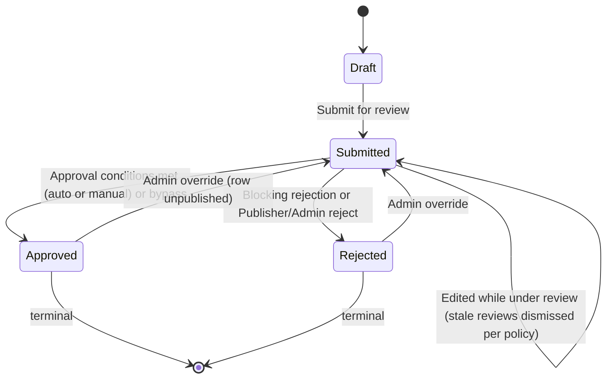

# G2H Design

## 1. Design Overview

### 1.1 Purpose

Glory 2 Him (G2H) is a content management system designed to allow users to contribute, organise, review, approve, publish, associate, and consume gospel-focused content.

The system is centred around `ContentItem`, which represents primary user-contributed content. Examples of content types include:

1. `Quote`
2. `Story`
3. `Testimony`
4. `Topic`
5. Future content types

All user-contributed and configurable content is subject to an approval process before it is considered trusted, visible, or publishable.

### 1.2 Core Design Principles

The design follows these principles:

1. Content must be versioned.
2. Content must be approvable.
3. Approval must be reusable across multiple entity types.
4. Approval must not be tightly coupled to each entity through direct database relationships.
5. Content associations must support both a specific content version and all versions of a content item group.
6. Content-specific behaviour must be policy-driven through settings.
7. `Topic` must be modelled as a `ContentType`, not as a separate database entity.
8. A `Topic` groups other content items through `Association`.
9. The feed is a domain projection only, not a database entity.
10. Any publishable content type except `Topic` can appear in the feed.
11. All deletes are soft deletes.
12. Soft-deleted content must be excluded from public visibility.

### 1.3 Source Inputs

This design is based on:

1. The `Glory 2 Him.drawio` design file.
2. The current C# entity model files.
3. The current EF Core model snapshot.
4. The supplied design direction for approval, settings, feed, topic, versioning, visibility, and soft delete behaviour.

### 1.4 Current Model Completion Status

The current source files are not complete. This document separates the design into:

1. Current implemented model.
2. Diagram-driven intended model.
3. Required model extensions.
4. Recommended design rules.
5. Final agreed direction where this supersedes earlier diagram wording.

## 2. Domain Model Overview

### 2.1 Main Domain Areas

The domain model is grouped into the following areas:

1. Content
2. Content Types
3. Content Settings
4. Content Associations
5. Approval
6. Approval Policy Settings
7. Supporting Content Entities
8. Feed Projection
9. Topic Grouping
10. Events
11. AI Content Analysis
12. Security and Audit
13. Soft Delete

### 2.2 Main Entity Groups

| Area | Entities |
| --- | --- |
| Content | `ContentItem`, `ContentType`, `ContentItemSetting`, `Association` |
| Approval | `Approval`, `ApprovalReview`, `ApprovalComment`, `ApprovalSetting` |
| Associated Entities | `Tag`, `Reaction`, `Comment`, `BibleReference`, `Link`, `Attachment` |
| Enum / Lookup | `EntityType`, `ApprovalStatus`, `Scope` |
| Future Subscription | `Subscription`, `SubscriptionDelivery`, or equivalent decoupled subscription records |

## 3. Content Design

### 3.1 ContentItem

`ContentItem` is the central content entity in the system.

It represents a versioned item of contributed content such as a quote, story, testimony, topic, or future content type.

### 3.2 ContentItem Properties

The content item model should contain the following design-relevant properties:

| Property | Purpose |
| --- | --- |
| `Id` | Unique identifier for this specific content version. |
| `ContentType` | Identifies the type of content, such as `Quote`, `Story`, `Testimony`, or `Topic`. |
| `Title` | Optional content title. |
| `Author` | Optional content author. |
| `Content` | Required body content. |
| `ContentHash` | SHA-256 hash of the normalized `Content` (trim, collapse whitespace, lowercase). Control field computed on every write. Non-unique index on (`ContentType`, `ContentHash`) for duplicate detection (§3.4.2). |
| `GroupId` | Groups multiple versions of the same logical content item. |
| `Version` | Version number for the item. |
| `IsLatestVersion` | Identifies the latest version within the content group. Only one row per `GroupId` may be latest. |
| `IsPublished` | Identifies the currently published version. Only one row per `GroupId` may be published. |
| `ApprovalStatus` | Denormalized approval state (`Draft`, `Submitted`, `Approved`, `Rejected`). Mirrors the linked `Approval` record. `Approval` remains the source of truth. |
| `PublishDate` | Optional date/time from which the content can be visible. |
| `IsDeleted` | Soft-delete flag. When `true` the item is excluded from all public visibility. |
| `CreatedBy` | User who created the item. |
| `CreatedWhen` | Creation timestamp. |
| `UpdatedBy` | User who last updated the item. |
| `UpdatedWhen` | Last update timestamp. |
| `DeletedBy` | User who deleted the item. |
| `DeletedWhen` | Deletion timestamp. |
| `DeletionReason` | Reason for deletion. |

### 3.3 Content Versioning

Content is versioned by using:

1. `Id` for the specific version.
2. `GroupId` for the logical content item across all versions.
3. `Version` for the version number.
4. `IsLatestVersion` to identify the latest editable version.
5. `IsPublished` to identify the current public version.

### 3.4 Content Versioning Rules

The following rules apply:

1. A new content item starts with `Version = 1`.
2. A new content item starts with `IsLatestVersion = true`.
3. A new content item starts with `IsPublished = false` unless it is approved and published through the approval workflow.
4. A content item in `Draft` or `Submitted` may be edited in place.
5. Editing a `Draft` or `Submitted` item does not create a new version.
6. If approval reviews have already been submitted and the content item itself changes, those reviews must be dismissed (subject to `ApprovalSetting.RequireReapprovalOnChange`) and the item must be reviewed again. The item itself remains in its current status.
7. **`Approved` and `Rejected` are terminal.** A content item in either state is immutable in place — to its owner, to a `Publisher`, and to an `Admin` alike. No role amends a terminal row's content, and there is no in-place exception (rule 16).
8. Editing a terminal content item creates a new `ContentItem` row with the same `GroupId` and incremented `Version`. The owner is the only creator of new versions — `Publisher` and `Admin` roles never create version forks.

   A rejected row is terminal on the same terms as an approved one, and for the same reason: reviewers reached a verdict on that text, and text that changes underneath a verdict makes the verdict a record of nothing. The difference is only in what stays live — a **rejected** row never published, so a fork off one leaves the group with no public row until the new version is approved, where a fork off an approved one leaves the approved row published throughout (rule 12).
9. The new version becomes `IsLatestVersion = true`.
10. The previous latest version becomes `IsLatestVersion = false`.
11. The new version must not become `IsPublished = true` until approved.
12. The previously published version remains `IsPublished = true` until the new version is approved and published.
13. Only one content item per `GroupId` may have `IsLatestVersion = true`.
14. Only one content item per `GroupId` may have `IsPublished = true`.
15. Previous versions must remain available for audit, approval history, comparison, and rollback.
16. **There is no in-place amendment of a terminal item, by any role.** This rule previously granted an `Admin` one: amend an approved item without forking, resetting its approval to `Submitted` and dismissing active reviews. It is withdrawn, because a state that one role can edit out of is not terminal, and rule 7 depends on it being terminal for everyone.

    What replaces it is narrower and leaves a record. An `Admin` may move a terminal item's **status** back to `Submitted` through the approval transition operation (§8.6 HR-4, §9.7.1 rule 3) — an override, gated to `Admin` alone, which unpublishes the row on the way out of `Approved`. Ordinary editing resumes only once the row is no longer terminal. The two acts stay separate: a status transition changes no content, and a content edit changes no status.
17. While such a re-opened item is pending, it no longer satisfies canonical content visibility (its `ApprovalStatus` is `Submitted`) and is not publicly visible until approved again.
18. `IsLatestVersion` is written at exactly two points: creation (`true` on the new row) and version fork (`true` on the new row, `false` on the previous latest). No other operation — submit, review, approve, publish, or an `Admin` status override — changes `IsLatestVersion`.

#### 3.4.1 IsLatestVersion Lifecycle

`IsLatestVersion` marks the tip of the version chain — the row edits go to. `IsPublished` marks the row the public sees. During a review window the two flags deliberately sit on different rows. Exactly one `IsLatestVersion = true` per `GroupId` at all times; at most one `IsPublished = true` (both enforced by unique filtered indexes).

| Lifecycle event | `IsLatestVersion` | `IsPublished` |
| --- | --- | --- |
| Create V1 | V1 = `true` (the only row is the tip) | V1 = `false` |
| Edit a `Draft` or `Submitted` item (in place) | unchanged | unchanged |
| Owner edits a terminal item — `Approved` or `Rejected` (fork) | new row = `true`; previous latest = `false` | new row = `false`; previously published row unchanged |
| Submit / review / reject | unchanged | unchanged |
| Approve + publish | unchanged (the approved row already carries `true`) | approved row = `true`; previously published row = `false` |
| `Admin` overrides a terminal item's status back to `Submitted` | unchanged | that row = `false` (§8.6 HR-4); no other row is republished |

Worked example (V1 published, owner edits):

| Step | V1 | V2 |
| --- | --- | --- |
| V1 approved + published | latest=`true`, published=`true` | — |
| Owner edits → fork V2 | latest=`false`, published=`true` (still live) | latest=`true`, published=`false`, `Draft` |
| V2 submitted, under review | latest=`false`, published=`true` | latest=`true`, published=`false`, `Submitted` |
| V2 approved + published | latest=`false`, published=`false` | latest=`true`, published=`true` |

Worked example (V1 rejected, owner edits) — the case that distinguishes a rejected terminal row:

| Step | V1 | V2 |
| --- | --- | --- |
| V1 rejected | latest=`true`, published=`false`, `Rejected` | — |
| Owner edits → fork V2 | latest=`false`, published=`false` | latest=`true`, published=`false`, `Draft` |
| V2 approved + published | latest=`false`, published=`false` | latest=`true`, published=`true` |

Note the middle row: the group has **no published version at all** while V2 is in review, because V1 never had one to keep. Nothing is demoted at V2's publish, so §9.7.7 rule 7's ordering has nothing to order.

#### 3.4.2 Duplicate Content Rule

Purpose: two different people cannot submit the exact same content.

1. The duplicate match compares `Content` only (not `Title` or `Author`).
2. The match is normalized: trim ends, collapse whitespace/newline runs to a single space, lowercase (invariant culture). The normalization function is a frozen contract — changing it requires recomputing every stored hash in a migration.
3. The match is scoped per `ContentType`.
4. The match compares against all non-deleted rows (any status, any version). On modify, the item's own `GroupId` is excluded.
5. Mechanism: `ContentHash` = SHA-256 of the normalized content, computed by the orchestration on every write and stored on `ContentItem`. A non-unique index on (`ContentType`, `ContentHash`) makes the check an index seek. The index must not be unique — rows within one group may legitimately share a hash (for example a later version reverting to earlier wording); enforcement is application-side.
6. Response on a duplicate: add → polite acknowledgement ("Thank you for your submission") without creating the record and without revealing the duplicate; modify → validation error.

### 3.5 Approval Invalidation Rules

Approval invalidation is entity-scoped.

A change to an entity only invalidates approvals for that specific entity and must not reset approvals of unrelated entities.

For `ContentItem`:

1. Changes to `Title`, `Author`, `Content`, `ContentType`, `PublishDate`, or other approval-sensitive content metadata may invalidate the content item's own approval.
2. If reviews exist for the content item, the reviews should be marked as `Dismissed` when the content changes.
3. The approval status of the item does not change when reviews are dismissed — a `Submitted` item remains `Submitted`. There is no exception: the `Admin` in-place amendment that used to be one is withdrawn (§3.4 rule 16), and an amendment of a terminal item forks rather than resetting anything.
4. Reviewers must review the updated content again.

For linked entities:

1. Changes to tags, comments, reactions, Bible references, links, or attachments must not invalidate the parent `ContentItem` approval.
2. Only the changed entity's own approval lifecycle is affected.
3. Only the changed association's approval lifecycle is affected when the association itself changes.

Example:

1. A story is approved and published.
2. A new tag is associated to the story.
3. The tag or association may require approval.
4. The story remains approved and published.
5. The tag is only visible on the story once the tag and association are visible according to policy.

### 3.6 ContentType

`ContentType` is a fixed C# enum, not a database entity or a `ContentItem`. There is no `ContentTypes` table, no foundation service, no orchestration, and no lifecycle — a content type is a compile-time constant of the running application, not admin- or user-defined data.

```csharp
public enum ContentType
{
    Quote = 0,
    Story = 1,
    Testimony = 2,
    Devotional = 3,
    BibleStudy = 4,
    BlogPost = 5,
    Series = 999,
    Topic = 1000
}
```

`Series` and `Topic` are numbered apart from the standalone content types above — see §3.9.

### 3.7 ContentType Properties

Not applicable. `ContentType` has no properties of its own — it is persisted as a string (`HasConversion<string>()`, matching `EntityType`, `Scope`, and `ApprovalStatus`) wherever it is stored, and it is `ContentItem`, `ContentItemSetting`, and `ApprovalSetting` that carry a `ContentType` value, not the reverse. Adding, renaming, or removing a member is a code change and a release, not a runtime CRUD operation.

### 3.8 Content Type Rules

The following rules apply:

1. `Topic` and `Series` are `ContentType` members, not separate root entities.
2. The feed must exclude `Topic` and `Series` content items.
3. Any publishable content type except `Topic` and `Series` can appear in the feed.
4. `ContentItem.ContentType` is set on creation and never accepted from a caller on modify (§12.4.1 business rule 7a) — different content types carry different validation rules, so an item cannot be relabelled into a type its content was never checked against.
5. Adding a new `ContentType` member requires a code change; it can never be introduced by an end user or admin at runtime.

### 3.9 Series vs. Topic — to revisit

`Series` and `Topic` currently have identical documented behaviour: both are grouping content items excluded from the feed (§3.8 rules 1–3), and neither carries a rule that distinguishes one from the other. §11 ("Topic and Feed Design") describes the grouping mechanism only in terms of `Topic`; `Series` was added to the enum without an equivalent section or without checking whether it duplicates `Topic`.

**Open question:** are `Series` and `Topic` the same concept under two names, or do they represent genuinely different groupings (e.g. an ordered, authored sequence vs. an unordered subject tag)? This needs a design decision — either give `Series` its own rules distinct from §11, fold it into `Topic` and remove the member, or document the distinction explicitly (e.g. `Series` implies `Association.SortOrder`-based ordering per §9.6/§9.7.1 rule 4, `Topic` does not).

Until this is resolved, `Series` and `Topic` are numbered apart from the standalone content types (§3.6) as a placeholder, not as a statement that the design question is settled.

## 4. Association Design

### 4.1 Purpose

`Association` is the generic link between **two entities**. Both endpoints are generic and symmetric: neither is hard-wired to a `ContentItem`.

It supports:

1. Tags
2. Reactions
3. Comments
4. Bible References
5. Links
6. Attachments
7. Child content items
8. Topic and series membership
9. Related content
10. Related Bible references — a `BibleReference` to `BibleReference` pair, which the earlier one-sided shape could not express at all

**There is no `Kind` and no `SourceEndpoint`.** The `(EntityType, ContentType)` pair on each endpoint already carries the meaning, and direction falls out of the asymmetry — a `Series` paired with a `Story` is always container-to-member, because the reverse is not a thing that exists. A separate discriminator would be a second source of truth for something the endpoints already say, and two sources of truth for one fact eventually disagree.

### 4.2 Endpoint Shape

Each endpoint carries the same six fields:

| Field | Purpose | Owned by |
| --- | --- | --- |
| `Entity{A,B}Type` | The `EntityType` of the endpoint. | caller, create-only |
| `Entity{A,B}KeyId` | The specific row — the version, for a versioned entity type. | caller, create-only |
| `Entity{A,B}GroupId` | The version group. Equal to `KeyId` when the entity type is not versioned, so every endpoint has a group id and one set of rules covers both kinds. | caller for a versioned type; derived otherwise; create-only |
| `Entity{A,B}Scope` | Whether the association follows the endpoint across versions. | derived (§4.5); the only endpoint field that may change after creation |
| `Entity{A,B}EffectiveId` | `GroupId` under `AllVersions`, `KeyId` under `ThisVersionOnly`. | the database (§4.6) |
| `Entity{A,B}ContentType` | The endpoint's `ContentType`, denormalised so authorization composes from the row alone (§18.6). Null unless the type is `ContentItem`. | derived from the resolved endpoint, never caller-supplied |

Plus `UserId`, set only where the association is personal rather than editorial — today a `Reaction` endpoint. Null means editorial.

`Association` also implements `ISortOrder` (§11.7) and `IConfidence` (§9.7.1 rule 5).

### 4.3 Scope Rules

| Scope | Meaning | Effective id |
| --- | --- | --- |
| `AllVersions` | The association follows the endpoint's whole version group — a tag on a story survives the story being amended. | `GroupId` |
| `ThisVersionOnly` | The association applies to one specific row. | `KeyId` |

### 4.4 Canonical Ordering

The two endpoints are stored in a fixed order, A before B, computed on add. One row therefore serves both endpoints' lists, and "is X linked to Y" is one lookup rather than two.

A is the endpoint with the lower `(EntityType name, GroupId)` tuple; B is the other.

1. **Order on the enum name, not its numeric value**, using `string.CompareOrdinal`. The name is what SQL stores and what the §4.4 check constraint compares. A rename then breaks loudly at the constraint; a renumber would silently reorder existing rows.
2. **Order on `GroupId`, not the effective id.** `GroupId` never changes, so a scope toggle can never force A and B to swap columns — which would otherwise turn a set-scope operation into a repoint.
3. **Guid comparison must use SQL Server's ordering, not .NET's.** SQL Server orders `uniqueidentifier` by bytes 10–15 first; .NET compares the leading `_a`/`_b`/`_c` fields as integers. The two disagree on most pairs, so `Guid.CompareTo` would produce an order the database's own canonical-order constraint rejects. Use `new SqlGuid(a).CompareTo(new SqlGuid(b))`.
4. **Normalisation runs inside `DoAddAssociationAsync`, before the storage call** — not in the public method and not in an orchestration. `Association-Adding` is a public event address whose substrate handler enters `DoAdd` directly, so anything layered above it is bypassed.

### 4.5 Derived and Pinned Endpoint Fields

1. `Scope` is **derived, never accepted from a caller**: a non-versioned entity type resolves to `ThisVersionOnly` (it has exactly one row, so `AllVersions` would be a distinction without a difference); a versioned one defaults to `AllVersions`. The publication model comes from the §7.5.1 lookup — **never** from probing the entity for `IVersion` at runtime, which this repository has already proved unreliable twice.
2. `GroupId` is derived as `KeyId` for a non-versioned endpoint.
3. `ContentType` is derived from the resolved endpoint and never caller-supplied — it is an authorization input, so a caller who could set it could claim authority over a content type they hold no role for. Resolving it requires reading the endpoint row, which is an orchestration read; the foundation enforces the structural half of the rule (a value is permitted only on a `ContentItem` endpoint) and leaves a null endpoint costing the caller only the narrow role tier.
4. **Reclassification is forbidden.** `Type`, `KeyId` and `GroupId` are pinned against storage on every modify. Repointing an association is indistinguishable from deleting one link and creating another — except that it carries the original's approval state and review history across to a pair nobody reviewed.
5. The two endpoints must differ: `EntityAGroupId != EntityBGroupId`. Because a non-versioned endpoint's group id is its key id, this one rule covers an entity associated with itself, two versions of the same entity, and a tag paired with itself.

### 4.6 Effective Id

`Entity{A,B}EffectiveId` is a `PERSISTED` computed column — `CASE WHEN Scope = 'AllVersions' THEN GroupId ELSE KeyId END` — read-only to application code. It earns its keep twice:

1. **It is the read predicate.** Every tag panel and related-passage panel asks "associations for this entity". Without the column that is an `OR` across `KeyId`/`GroupId` plus two scope tests per side; with it, one seekable comparison on the query that runs on every page render.
2. **It makes uniqueness a database guarantee.** Two `AllVersions` rows for the same group differing only in `KeyId` mean the same thing; over the raw columns they are distinct rows, and the effective id collapses them. This matters because foundation services are reachable through public event addresses and cannot assume an orchestration's retrieve-or-add ran first. `UX_Associations_Pair` is the unique index over it, filtered on `IsDeleted = 0`, keyed on both endpoints' type and effective id with `UserId` last — nullable, so one index means "one per user" when set and "one globally" when null. It is paired with `CK_Association_CanonicalOrder`, without which the same pair written the other way round is a different key and the duplicate lands.

### 4.7 Associated Entity Types

The supported entity types on either endpoint are defined by `EntityType`.

| EntityType | Purpose |
| --- | --- |
| `ContentItem` | Related content, topic and series children, parent/child links. |
| `Association` | Allows association records themselves to be approved. |
| `Tag` | Categorisation and labelling. |
| `Reaction` | Reactions such as love, like, celebrate. |
| `BibleReference` | Scripture references, including reference-to-reference pairs. |
| `Comment` | Comments on content. |
| `Link` | External or internal links. |
| `Attachment` | Files or binary resources. |

### 4.8 Association Approval

Associations are themselves subject to approval.

This means that even if a `Tag`, `Comment`, `BibleReference`, or `Link` is approved as an entity, the association between that entity and a `ContentItem` can still require its own approval.

Example:

1. A tag named `Faith` may already be approved.
2. A user associates `Faith` with a story.
3. The association can require approval based on the effective `ApprovalSetting` for `EntityType.Association` — see §8.4. This is **not** a `ContentItemSetting` concern (§6.1).
4. The tag becomes visible on the story only when both the tag and association are visible.

**Associations hosted on something other than a content item.** Because associations are symmetric, either endpoint may be any entity type, so a `BibleReference` ↔ `Tag` or `BibleReference` ↔ `BibleReference` association has no `ContentItem` to resolve settings from.

`ContentItemSetting` is not generalised to cover that. It stays scoped to content items (§6.1), and each host entity type gets its own settings entity instead — `BibleReferenceSetting` (§6.9) for the reference page. An association resolves the allowed/show switches per endpoint, from that endpoint's own settings entity, and is permitted only when both ends allow it (§6.10).

Approval is unaffected either way: `ApprovalSetting` is keyed on `(EntityType, ContentType)` (§8.4) and needs no host at all.

## 5. Supporting Content Entities

### 5.1 Tag

`Tag` represents a categorisation label.

| Property | Purpose |
| --- | --- |
| `Id` | Unique tag identifier. |
| `Name` | Tag name. |
| `GroupId` | Groups all versions of this tag record together. Populated on creation and shared across all versions. |
| `Version` | Version number of this tag record, defaults to 1. |
| `IsLatestVersion` | Identifies the latest version of this tag record. |
| `PublishDate` | Optional date/time from which this tag becomes visible. |
| `IsPublished` | Identifies whether the current version of this tag is published. |
| `ApprovalStatus` | Denormalized approval state (`Draft`, `Submitted`, `Approved`, `Rejected`). |
| `IsDeleted` | Soft-delete flag. When `true` the tag is excluded from all public visibility. |
| `CreatedBy` | User who created the tag. |
| `CreatedWhen` | Creation timestamp. |
| `UpdatedBy` | User who last updated the tag. |
| `UpdatedWhen` | Last update timestamp. |
| `DeletedBy` | User who deleted the item. |
| `DeletedWhen` | Deletion timestamp. |
| `DeletionReason` | Reason for deletion. |

### 5.2 Reaction

`Reaction` represents a reusable reaction definition.

| Property | Purpose |
| --- | --- |
| `Id` | Unique reaction identifier. |
| `Name` | Reaction name. |
| `UnicodeEmoji` | Emoji representation. |
| `GroupId` | Groups all versions of this reaction record together. Populated on creation and shared across all versions. |
| `Version` | Version number of this reaction record, defaults to 1. |
| `IsLatestVersion` | Identifies the latest version of this reaction record. |
| `PublishDate` | Optional date/time from which this reaction becomes visible. |
| `IsPublished` | Identifies whether the current version of this reaction is published. |
| `ApprovalStatus` | Denormalized approval state (`Draft`, `Submitted`, `Approved`, `Rejected`). |
| `IsDeleted` | Soft-delete flag. When `true` the reaction is excluded from all public visibility. |
| `CreatedBy` | User who created the reaction. |
| `CreatedWhen` | Creation timestamp. |
| `UpdatedBy` | User who last updated the reaction. |
| `UpdatedWhen` | Last update timestamp. |
| `DeletedBy` | User who deleted the item. |
| `DeletedWhen` | Deletion timestamp. |
| `DeletionReason` | Reason for deletion. |

### 5.3 Comment

`Comment` represents user or reviewer visible discussion attached to content through `Association`.

| Property | Purpose |
| --- | --- |
| `Id` | Unique comment identifier. |
| `Content` | Comment body text. |
| `CreatedBy` | User who created the comment. |
| `CreatedWhen` | Creation timestamp. |
| `UpdatedBy` | User who last updated the comment. |
| `UpdatedWhen` | Last update timestamp. |
| `DeletedBy` | User who deleted the item. |
| `DeletedWhen` | Deletion timestamp. |
| `DeletionReason` | Reason for deletion. |

### 5.4 BibleReference

`BibleReference` represents scripture references associated with content.

| Property | Purpose |
| --- | --- |
| `Id` | Unique Bible reference identifier. |
| `Reference` | Bible reference, such as `John 3:16`. |
| `Translation` | Bible translation, such as NIV, KJV, ESV. |
| `Scripture` | Optional scripture text. |
| `CreatedBy` | User who created the Bible reference. |
| `CreatedWhen` | Creation timestamp. |
| `UpdatedBy` | User who last updated the Bible reference. |
| `UpdatedWhen` | Last update timestamp. |
| `DeletedBy` | User who deleted the item. |
| `DeletedWhen` | Deletion timestamp. |
| `DeletionReason` | Reason for deletion. |

### 5.5 Link

`Link` represents an external or internal link associated with content.

| Property | Purpose |
| --- | --- |
| `Id` | Unique link identifier. |
| `Name` | Display name. |
| `Url` | Target URL. |
| `LinkType` | Internal, external, video, article, source, etc. |
| `CreatedBy` | User who created the link. |
| `CreatedWhen` | Creation timestamp. |
| `UpdatedBy` | User who last updated the link. |
| `UpdatedWhen` | Last update timestamp. |
| `DeletedBy` | User who deleted the item. |
| `DeletedWhen` | Deletion timestamp. |
| `DeletionReason` | Reason for deletion. |

### 5.6 Attachment

`Attachment` represents a file or binary resource associated with content.

| Property | Purpose |
| --- | --- |
| `Id` | Unique attachment identifier. |
| `Name` | Display name. |
| `BlobUri` | Storage location. |
| `Hash` | File hash for integrity and deduplication. |
| `CreatedBy` | User who created the attachment. |
| `CreatedWhen` | Creation timestamp. |
| `UpdatedBy` | User who last updated the attachment. |
| `UpdatedWhen` | Last update timestamp. |
| `DeletedBy` | User who deleted the item. |
| `DeletedWhen` | Deletion timestamp. |
| `DeletionReason` | Reason for deletion. |

## 6. ContentItemSetting Design

### 6.1 Purpose

`ContentItemSetting` exists primarily to **drive UI component visibility**, with a matching server-side gate so the UI cannot be bypassed.

Each facet has exactly two switches:

| Switch | Governs |
| --- | --- |
| `<Facet>Allowed` | Whether the *contribute* component is shown (e.g. the "Suggest a tag" box), **and** whether the association submit process will persist the record. When `false` the submit is rejected server-side, not merely hidden. |
| `Show<Facet>` | Whether the *display* component is shown (e.g. the tag panel). |

**`<Facet>AssociationsRequireApproval` is removed.** Whether an association requires approval is answered by `ApprovalSetting` and the approval workflow (§8.4), keyed on `(EntityType, ContentType)`. Keeping a second copy here would create two sources of truth for one question and two places to look when an approval fails to fire. Six columns are dropped: the `RequireApproval` switch for each of Tags, Reactions, Links, Attachments, Comments and Bible References.

**Scope.** `ContentItemSetting` governs associations hosted on a `ContentItem` and nothing else. It is keyed on `ContentType` (required) with an optional `ContentItemId` override, both `ContentItem` concepts, and it is not generalised to other hosts. A host of another type gets its own settings entity following the same shape — see §6.9 for `BibleReferenceSetting` and §6.10 for how an association resolves the two.

### 6.2 Default and Override Behaviour

`ContentItemSetting` can apply at two levels:

1. Content type default.
2. Specific content item override.

### 6.3 Default Rule

If `ContentItemId` is null, the setting applies to all content items of the given content type.

Example:

1. All `Quote` items may allow tags.
2. All `Story` items may allow comments.
3. All `Topic` items may allow child content associations.

### 6.4 Override Rule

If `ContentItemId` is supplied, the setting applies only to that specific content item and overrides the content type default.

### 6.5 Current Settings

| Area | Settings |
| --- | --- |
| Tags | `TagsAllowed`, `ShowTags` |
| Reactions | `ReactionsAllowed`, `ShowReactions` |
| Links | `LinksAllowed`, `ShowLinks` |
| Attachments | `AttachmentsAllowed`, `ShowAttachments` |
| Comments | `CommentsAllowed`, `ShowComments` |
| Bible References | `BibleReferenceAllowed`, `ShowBibleReferences` |

### 6.6 ContentItemSetting Properties

| Property | Purpose |
| --- | --- |
| `Id` | Unique content item setting identifier. |
| `ContentType` | Content type this setting applies to. |
| `ContentItemId` | Optional specific content item override. |
| `IsDeleted` | Soft-delete flag. When `true` the setting is excluded from active policy resolution. |
| `CreatedBy` | User who created the setting. |
| `CreatedWhen` | Creation timestamp. |
| `UpdatedBy` | User who last updated the setting. |
| `UpdatedWhen` | Last update timestamp. |
| `DeletedBy` | User who deleted the item. |
| `DeletedWhen` | Deletion timestamp. |
| `DeletionReason` | Reason for deletion. |

### 6.7 Recommended Settings Extension

Recommended property:

```csharp
public bool LimitReactionsToLoveOnly { get; set; }
```

This supports favourite-style behaviour where only a love reaction should be allowed.

### 6.8 ContentItemSetting.ContentType typing — done

`ContentItemSetting.ContentType` is typed `ContentType` (§3.6), persisted as a string via `HasConversion<string>()` like every other enum in the schema. There is no `Guid` involved on either side — `ContentType` is not an entity and never had an `Id`.

```csharp
public ContentType ContentType { get; set; }
```

### 6.9 BibleReferenceSetting

`ContentItemSetting` is scoped to content items and nothing else. A Bible reference page hosts its own associations — suggested tags, related passages — and needs the equivalent switches, so it gets its own settings entity following the same shape.

| Property | Purpose |
| --- | --- |
| `Id` | Unique Bible reference setting identifier. |
| `BibleReferenceId` | Optional specific Bible reference override. Null means this row is the system-wide default. |
| `TagsAllowed` | Whether the "Suggest a tag" component renders, and whether the association submit persists. |
| `ShowTags` | Whether the tag panel renders. |
| `RelatedBibleReferencesAllowed` | Whether the "Suggest a Bible reference" component renders, and whether the association submit persists. |
| `ShowRelatedBibleReferences` | Whether the related-references panel renders. |
| `ReactionsAllowed` | Whether the reaction bar accepts a reaction, and whether the association submit persists. |
| `ShowReactions` | Whether the reaction bar renders. |
| `LimitReactionsToLoveOnly` | Restricts the passage to a single love reaction, as §6.7 does for content items. |
| `IsDeleted` | Soft-delete flag. When `true` the setting is excluded from active policy resolution. |
| audit fields | As `ContentItemSetting`. |

Rules:

1. There is no type dimension. `BibleReference` has no equivalent of `ContentType`, so the default tier is a single system-wide row rather than one per type.
2. At most one default may exist: `UNIQUE(Id) WHERE BibleReferenceId IS NULL` semantics — one row with a null `BibleReferenceId`.
3. At most one override per reference: `UNIQUE(BibleReferenceId) WHERE BibleReferenceId IS NOT NULL`.
4. An override takes full precedence over the default; the tiers are not merged, matching §6.4.
5. `BibleReference` is a Single-Row entity (§7.5.1), so the override keys on the row identifier directly with no version or group ambiguity.
6. As with `ContentItemSetting`, these switches never answer *whether approval is required* — that is `ApprovalSetting` (§8.4).

7. The reaction switches mirror `ContentItemSetting` exactly, so the reaction bar on a passage is configurable the same way it is on a story.

### 6.10 Resolving Settings for an Association

An association has two endpoints, so the settings entity that governs it is resolved from the **host** entity type of each end:

| Host endpoint type | Settings entity |
| --- | --- |
| `ContentItem` | `ContentItemSetting` |
| `BibleReference` | `BibleReferenceSetting` |

Rules:

1. The allowed/show switches are resolved per endpoint, from that endpoint's own settings entity.
2. Where both endpoints resolve a switch — a `BibleReference` ↔ `BibleReference` related-passage link resolves `RelatedBibleReferencesAllowed` on each end — the association is permitted only when **both** allow it. Denials union restrictively, matching the read-only role veto in §16.6.
3. An endpoint type with no settings entity imposes no restriction. It cannot silently deny, and it cannot silently grant on another endpoint's behalf.
4. Each new entity type that becomes a *host* for associations needs its own settings entity under this pattern. Entity types that only ever appear as the far end of an association — `Tag`, `Reaction` — do not.

## 7. Approval Design

### 7.1 Approval Purpose

The approval process controls whether an entity is trusted, accepted, and visible.

The approval system is intentionally not directly linked to all approved entities through database foreign keys.

Instead, it uses:

1. `EntityType`
2. `EntityId`

This allows the same approval workflow to apply to multiple entity types.

### 7.2 Approval Entity

`Approval` represents the workflow state for a specific entity instance.

| Property | Purpose |
| --- | --- |
| `Id` | Unique approval identifier. |
| `EntityType` | Type of entity being approved. |
| `EntityId` | Identifier of the entity being approved. |
| `ApprovalStatus` | Current approval status (`Draft`, `Submitted`, `Approved`, `Rejected`). |
| `IsApprovedByBypass` | `true` when the approval was granted via the bypass action while the approval conditions were not met. The actor is recorded on `UpdatedBy`. |
| `ApprovedByBypassReason` | Why the conditions were waived. Populated only alongside `IsApprovedByBypass`, and cleared with it. Capped at 500 characters. |
| `IsDeleted` | Soft-delete flag. When `true` the approval record is excluded from active workflow evaluation. |
| `CreatedBy` | User who created the approval record. |
| `CreatedWhen` | Creation timestamp. |
| `UpdatedBy` | User who last updated the approval record. |
| `UpdatedWhen` | Last update timestamp. |
| `DeletedBy` | User who deleted the item. |
| `DeletedWhen` | Deletion timestamp. |
| `DeletionReason` | Reason for deletion. |

### 7.3 Approval Status

Approval status values are:

| Status | Meaning |
| --- | --- |
| `Draft` | Entity is not yet submitted for review. |
| `Submitted` | Entity is awaiting one or more reviews. |
| `Approved` | Entity has received the required approvals. |
| `Rejected` | Entity has been rejected. |
| `Dismissed` | **`ApprovalReview` records only.** The review was invalidated by an entity-scoped change and must not count toward approval. Entities and `Approval` records never hold `Dismissed`. |

### 7.4 Approval Decoupling Rule

The approval process must not require a direct database relationship from every entity to `Approval`.

Instead:

1. Each approvable entity has its own table.
2. `Approval.EntityType` identifies the table/domain type.
3. `Approval.EntityId` identifies the specific entity instance.
4. Services enforce existence and consistency.
5. The database enforces uniqueness for approval records by `(EntityType, EntityId)`.

### 7.5 Approvable Entities

The following entities are subject to approval:

1. `ContentItem`
2. `Association`
3. `Tag`
4. `Reaction`
5. `Comment`
6. `BibleReference`
7. `Link`
8. `Attachment`
9. `ContentItemSetting`, if policy changes require approval.
10. `BibleReferenceSetting` (§6.9), on the same condition.

`ContentType` is not in this list — it is a fixed enum (§3.6), not a database entity, so it has no `EntityType` of its own and cannot itself be submitted for approval. Its role in the approval system is purely as a scoping dimension of `ContentItem` approval policy (§8.4).

### 7.5.1 Publication Model per Approvable Entity

Every approvable `EntityType` declares exactly one publication model. This table is the single source of truth for the approval workflow's versioned/single-row branch (§9.7.4).

| EntityType | Publication model |
| --- | --- |
| `ContentItem` | Versioned |
| `Link` | Versioned |
| `Attachment` | Versioned |
| `BibleReference` | Single-Row |
| `Tag` | Single-Row |
| `Reaction` | Single-Row |
| `Comment` | Single-Row |
| `Association` | Single-Row |
| `ContentItemSetting` | Single-Row |
| `BibleReferenceSetting` | Single-Row |

Rules:

1. The approval orchestration must resolve the publication model from this table, mirrored in code as one lookup keyed on `EntityType`. It must **not** infer it by probing the entity for the `IVersion` interface, by reflecting over property names, or by inspecting EF configuration.

   Runtime shape is not a stable discriminator, and the repository proves it twice. §5.1 and §5.2 describe `Tag` and `Reaction` as carrying `GroupId`/`Version`/`IsLatestVersion`, but neither implements the properties or the interface. More sharply, `BibleReference` dropped `IVersion` and its versioning properties while its storage configuration and validations kept referencing them — a probe would have silently changed the approval branch, where the compiler at least reports the mismatch.
2. Adding an entity type to §7.5 without adding it here is an incomplete change. A missing row is a hard error, never a default.
3. `Versioned` means an amendment to a **terminal** row — `Approved` or `Rejected` (§9.3, §9.4) — produces a **new row** (§3.4 rule 8), and any previously published row stays live until the new one is approved. `Single-Row` means the row that is edited **is** the published row, so there is nothing to fork into and an amendment of a terminal row is **refused** instead.

   The two branches are therefore not two ways of doing the same thing. Versioned preserves the rejected or approved text as a row and moves on; Single-Row has nowhere to preserve it, so it holds the row still until an `Admin` override re-opens it (§8.8 regardless-rule 1).

4. **Why this split survived `Approved` and `Rejected` becoming terminal.** The obvious simplification — version everything, so every terminal row can fork and one rule covers all ten types — was considered and rejected on two independent grounds.

   **Three of the Single-Row entities carry a natural-key unique index that a fork would violate.** A fork produces a second row holding the same `Tag.Name`, `Reaction.Name` or `BibleReference.USFM`, and each index refuses it. Versioning those types would have meant re-scoping each constraint to the live tip — narrowing a uniqueness guarantee to make room for rows nobody asked for.

   **And `Association` has no caller-editable content at all.** Every non-audit property is pinned against storage on modify, so the general modify's whole effective payload is the `Draft` ↔ `Submitted` carve-out — the same subtraction §8.6.1 uses to show a last-editor column would be provably inert on it. There is no content amendment to fork, so versioning it would add three columns and three indexes that nothing could ever write.

   The rule that generalises instead is **§3.4 rule 7**: a terminal row's content is immutable. Versioning decides *what an owner does next*, not whether the row is protected.

### 7.6 ApprovalReview

`ApprovalReview` represents a reviewer decision for an approval record.

| Property | Purpose |
| --- | --- |
| `Id` | Unique review identifier. |
| `ApprovalId` | Parent approval record. |
| `ReviewerId` | User who reviewed the item. |
| `StatusId` | Review decision status. |
| `Comment` | Optional free text explaining **why** this reviewer reached this `StatusId`. It is rationale attached to a verdict, not a question — it has no resolved state and nothing waits on it. Discussion between reviewers is `ApprovalComment`, which is a different thing (§7.8). |
| `IsDeleted` | Soft-delete flag. When `true` the review is excluded from threshold calculations. |
| `CreatedBy` | User who created the review. |
| `CreatedWhen` | Creation timestamp. |
| `UpdatedBy` | User who last updated the review. |
| `UpdatedWhen` | Last update timestamp. |
| `DeletedBy` | User who deleted the item. |
| `DeletedWhen` | Deletion timestamp. |
| `DeletionReason` | Reason for deletion. |

### 7.7 ApprovalReview Rules

The following rules apply:

1. A reviewer may only have one active review per approval record. A second active review by the same reviewer must be rejected by validation — review decisions are not superseded or replaced.
2. A review can approve, reject, or become dismissed. The verdict a **reviewer** may record is closed to `Approved` or `Rejected`; `Dismissed` is what *happens to* a review when an entity-scoped change invalidates it (§9.5), never something its author declares. A reviewer who could dismiss their own review would retract a rejection without recording a verdict, which is the same outcome as changing it but leaves no trace of the change.
2a. **A dismissed review is closed.** It is retained for audit and may not be amended — the reviewer files a new one (rule 7). Amending it instead would re-attach a stale judgement to text nobody re-read, because dismissal is precisely the record that the verdict no longer describes the current content.
2b. **A review may only be written while its `Approval` is `Submitted`** — this is the window, and it is enforced. Once the `Approval` reaches `Approved` or `Rejected` the round is over, and a verdict changed afterwards would not re-run the workflow: an entity could sit `Approved` with a standing rejection against it and nothing would notice. The check needs the parent `Approval`'s status, which is another entity's row, so it goes through `IAccessBroker` to `IAccessClient` (§8.6.1). Rules 2 and 2a are row-local and are enforced in the service itself.
3. A rejection may block approval depending on `ApprovalSetting.BlockOnReject`.
4. Reviewer eligibility is the review tier composed from the entity type (§8.3, §18.6), not per-setting configuration.
5. Self-approval is controlled by `ApprovalSetting.AllowSelfApproval`.
6. Dismissed reviews must not count toward the approval threshold.
7. A reviewer may submit a new review only after their previous review was dismissed.
8. A user who has filed an active review on an entity must not also set that entity's `ApprovalStatus` — reviewing is vouching, deciding is deciding, and one person doing both meets a threshold of `1` single-handed (§8.6 regardless-rule 1). This replaces an earlier bar on anyone recorded in the entity's `UpdatedBy` reviewing it; that bar was withdrawn as unimplementable, and §8.6's *Why this is not written against `UpdatedBy`* records why.

### 7.8 ApprovalComment

`ApprovalComment` represents discussion or notes attached to an approval record.

| Property | Purpose |
| --- | --- |
| `Id` | Unique comment identifier. |
| `ApprovalId` | Parent approval record. |
| `UserId` | User who made the comment. |
| `Comment` | Comment text. |
| `IsResolved` | Whether the question this comment raised has been answered and is no longer open. An `ApprovalComment` is **open discussion between reviewers**, unlike `ApprovalReview.Comment`, which is one reviewer's rationale for their own verdict and is never resolvable. When `ApprovalSetting.RequireReviewCommentResolutionBeforeApprovals = true`, no unanswered question may be outstanding before the approval conditions are met. |
| `IsDeleted` | Soft-delete flag. When `true` the comment is excluded from public visibility. |
| `CreatedBy` | User who created the comment. |
| `CreatedWhen` | Creation timestamp. |
| `UpdatedBy` | User who last updated the comment. |
| `UpdatedWhen` | Last update timestamp. |
| `DeletedBy` | User who deleted the item. |
| `DeletedWhen` | Deletion timestamp. |
| `DeletionReason` | Reason for deletion. |

## 8. Approval Settings Design

### 8.1 Purpose

`ApprovalSetting` defines policy rules for approval workflows.

This is similar to GitHub pull request approval rules, where different entity types can require one or more approvers before they are approved.

### 8.2 ApprovalSetting Entity

Recommended properties:

| Property | Purpose |
| --- | --- |
| `Id` | Unique approval setting identifier. |
| `EntityType` | Entity type this rule applies to. |
| `RequireApprovals` | Whether approvals are required before the entity can be approved (GitHub "Require approvals" checkbox). When `false`, the approval conditions are trivially met. |
| `RequiredNumberOfApprovals` | Number of required approvals (1–5) before approval is complete. Applies when `RequireApprovals = true`. |
| `AllowSelfApproval` | Whether the author can approve their own item. |
| `BlockOnReject` | Whether a single rejection blocks the approval. |
| `RequireReapprovalOnChange` | Whether edits reset approval status. |
| `AutoApproveIfAllApprovalRequirementsMet` | Whether the entity is automatically approved when all approval requirements are met. |
| `RequireReviewCommentResolutionBeforeApprovals` | Whether every `ApprovalComment` on the approval must be resolved before approval can be granted. It gates the `Approval` entity only — it never affects an individual `ApprovalReview`'s own verdict. |
| `BlockOnZeroApprovalScore` | Whether an entity whose `IConfidence.ConfidenceScore` is `0` is blocked from approval. Defaults to `false`. Applies to both automatic approval and the manual approve action; a `Publisher`/`Admin` may still bypass it (§12.5.3 business rule 11) or correct the score first (§9.7.1 rule 5). |
| `DoNotAllowBypassingSettings` | When `true`, the bypass action is unavailable — the approval conditions cannot be bypassed by anyone, including `Admin`. |
| `IsDeleted` | Soft-delete flag. When `true` the setting is excluded from policy resolution. |
| `CreatedBy` | User who created the setting. |
| `CreatedWhen` | Creation timestamp. |
| `UpdatedBy` | User who last updated the setting. |
| `UpdatedWhen` | Last update timestamp. |
| `DeletedBy` | User who deleted the item. |
| `DeletedWhen` | Deletion timestamp. |
| `DeletionReason` | Reason for deletion. |

### 8.3 Who May Review and Publish Is Composed, Not Configured

There are no reviewer- or publisher-role tables, and `ApprovalSetting` carries no `RestrictWhoCanReview` or `RestrictWhoCanApprove` flags. `ApprovalSettingReviewerRole` and `ApprovalSettingPublisherRole`, their services and their navigation collections were removed once the role convention had a single home.

Eligibility is **derived from the entity type** by the `%EntityType%-Reviewer` / `%EntityType%-Publisher` convention (§18.6), with the global `Reviewer`, `Publisher` and `Admin` roles above them. Configuring the same fact in a table gave the system two answers to one question and no rule for which wins; the convention needs no row, cannot drift from the role names actually issued, and is composed in exactly one place — `G2H.Security.Client`, which owns role naming because naming is an access concern (§8.6.1).

A deployment that wants a *narrower* set than the convention grants restricts it where roles are issued, not by adding rows here.

### 8.4 Approval Policy Resolution

When an approval record is created or evaluated, the approval service must resolve the effective approval setting by entity type.

An `ApprovalSetting` row is identified by `(EntityType, ContentType)`. `ContentType` is a nullable enum, where `NULL` means "every content type of this entity type". It may be populated only when `EntityType = ContentItem`, and must be `NULL` for every other entity type. The unique index moves from `(EntityType)` to `(EntityType, ContentType)` accordingly.

Resolution order — the first matching row supplies **every** policy field. Fields are never merged across tiers, and rows with `IsDeleted = true` are skipped at every tier:

1. Entity-instance override — `(EntityType, EntityId)`. Reserved for a future design; no such store exists today.
2. `(EntityType, ContentType)` — the content-type policy. Applies only when `EntityType = ContentItem`.
3. `(EntityType, ContentType = NULL)` — the entity-type default.
4. The system default, when no row matches at all.

Rules:

1. The `ContentType` tier exists because one policy row cannot sensibly govern every content item. A `Testimony` may warrant two reviewers where a `Blog` needs one, yet both are `EntityType.ContentItem`. This mirrors the content-type-scoped roles in §18.6, so policy and permission are keyed the same way.
2. **The system default is fail-closed.** When no row resolves, the effective policy is `RequireApprovals = true`, `RequiredNumberOfApprovals = 1`, `AutoApproveIfAllApprovalRequirementsMet = false`, `AllowSelfApproval = false`, `BlockOnReject = true`, `RequireReapprovalOnChange = true`, `DoNotAllowBypassingSettings = false`, `RequireReviewCommentResolutionBeforeApprovals = true`, `BlockOnZeroApprovalScore = true`. A missing configuration row must never mean "no approval needed" — an unseeded environment would silently publish everything.

   The last two were omitted when this rule was first written, even though §8.5 and HR-4 route 1 both depend on them, so their system default was simply unstated. Both take the strict reading the rest of the rule takes. Blocking on a zero score cannot deadlock anything: rule 8 of §8.5 is explicit that a **null** score does not block, and an entity the confidence process has not scored is null rather than zero.

   **This list is the authority, and it is not the same thing as the entity's property initialisers.** `ApprovalSetting` initialises `BlockOnReject` to `false` — a sensible default for a row somebody is creating in an admin screen, and the opposite of what this rule requires when *nothing resolves*. `IAccessClient` therefore falls back to a hard-coded system default rather than to a default-constructed setting; had it constructed one, it would have been silently more permissive than this rule on exactly one field, in exactly the unseeded environment the fail-closed reading exists for.
3. Approval settings are not snapshotted. If approval settings change, subsequent approval evaluation uses the latest effective settings.
4. Whether an association *may be created at all*, and whether it is *displayed*, are separate questions from whether it requires approval, and are not answered here — see §6 and the note in §4.8.

### 8.5 Approval Threshold Rules

The approval conditions are controlled by `RequireApprovals`, `RequiredNumberOfApprovals` (1–5), and `BlockOnReject`:

```text
conditionsMet =
    (RequireApprovals == false
        OR (activeApprovals (excluding dismissed reviews) >= RequiredNumberOfApprovals
            AND NOT (BlockOnReject AND any active rejected review)))
    AND (RequireReviewCommentResolutionBeforeApprovals == false
        OR all approval comments are resolved)
    AND (BlockOnZeroApprovalScore == false
        OR entity does not implement IConfidence
        OR ConfidenceScore != 0)
```

1. If `RequireApprovals = false`, no reviews are required — the conditions are trivially met.
2. If `RequireApprovals = true`, `RequiredNumberOfApprovals` (1–5) valid approvals are required.
3. Dismissed reviews must not count.
4. While the conditions are not met, status remains `Submitted`.
5. Meeting the conditions enables the manual approve action for `Publisher`/`Admin` (the UI approve button).
6. If the conditions are met and `AutoApproveIfAllApprovalRequirementsMet = true`, the system applies `Approved` automatically — no human click; `IsApprovedByBypass` remains `false`.
7. When `RequireReviewCommentResolutionBeforeApprovals = true`, every comment raised during review must be resolved (`ApprovalComment.IsResolved = true`) before the conditions are met. This gates the `Approval` entity, not any individual reviewer's verdict — a reviewer may record `Approved` while a question is still open; the approval simply cannot complete until it is answered.
8. When `BlockOnZeroApprovalScore = true`, an entity whose `ConfidenceScore` is `0` cannot meet the conditions. **A `null` score does not block** — it means the confidence process has not run yet, not that the association was judged worthless. Treating `null` as blocking would deadlock every approval until §13.4 ships, and would strand anything the process failed on. If a scored gate is wanted before that point, the setting to reach for is `RequireApprovals`, not this one.
9. A blocked entity is not `Rejected` — it remains `Submitted` with the conditions unmet. A `Publisher`/`Admin` may bypass (§12.5.3 business rule 11), or correct the score through the set-confidence operation (§9.7.1 rule 5) and let the conditions re-evaluate.

### 8.6 Self-Approval Rules

These are **hard rules**. They are not defaults, they are not advisory, and no role — including `Admin` — is exempt except where a rule states its own exception.

**HR-1. No one may ever review their own content.** Self-review of an `ApprovalReview` is refused *unconditionally*. `AllowSelfApproval` does not relax it. A review is one person vouching for another's work; a review of your own work carries no information, and a threshold met by self-reviews is not a threshold.

**HR-2. No one may approve their own content unless `AllowSelfApproval` permits it.** This is the single rule the setting governs. With `AllowSelfApproval = false` — the fail-closed default (§8.4 rule 2) — the entity's creator must not approve it, and the creator of the `Approval` record must not approve it when they are also the content creator. Attempts must be rejected by validation, not merely discouraged.

**HR-3. A `Reviewer` may never set an `ApprovalStatus` directly.** A reviewer's whole instrument is the `ApprovalReview` record. They influence the outcome only *indirectly*, through automatic approval when the settings allow it. A reviewer applying the decision is the conflict the two-role split exists to prevent, and the role tiers are not interchangeable: `%EntityType%-Reviewer` is not a weaker `%EntityType%-Publisher`, it is a different job.

**HR-4. An `Approval`'s `ApprovalStatus` changes by exactly three routes, and no others.**

1. **Manual set by a `Publisher`/`Admin`**, subject to every other settings check — the approval count in `RequiredNumberOfApprovals`, review-comment resolution under `RequireReviewCommentResolutionBeforeApprovals`, the rejection block under `BlockOnReject`, and the zero-score block under `BlockOnZeroApprovalScore`.
2. **Automatic approval**, when `AutoApproveIfAllApprovalRequirementsMet = true` and every condition in §8.5 is satisfied.
3. **Bypass by a `Publisher`/`Admin`**, setting `IsApprovedByBypass = true` with an `ApprovedByBypassReason` alongside the status — and *only* when `DoNotAllowBypassingSettings = false`.

Setting `DoNotAllowBypassingSettings = true` closes route 3 entirely. Nobody, publishers and administrators included, can then approve without satisfying every required check.

**One residual, stated so it is not mistaken for a gap.** The setting governs approval *time*, not settings *editing*. An administrator with permission to edit approval settings can still disable or delete the rule and then approve. That is a deliberate limit of the mechanism — closing it requires separating "who may approve" from "who may configure approval", which is not modelled today. Any environment that needs a genuinely unbypassable rule must control who can edit `ApprovalSetting` rows.

**Regardless of `AllowSelfApproval`:**

1. **No one may both review and decide the same round.** A user recorded as the `ReviewerId` or the `CreatedBy` of an *active* — not `Dismissed`, not soft-deleted — `ApprovalReview` on the entity must not set that entity's `ApprovalStatus`, by any of HR-4's three routes. Reviewing is vouching; approving is deciding. One person doing both meets a `RequiredNumberOfApprovals = 1` threshold single-handed, which is self-approval wearing two hats. The bar attaches to the *act*, not to the role: a `Publisher` who files a review has spent their vote on that round, and another `Publisher` or `Admin` must apply the decision. This is HR-3 restated by act rather than by role — HR-3 excludes the `Reviewer` role from deciding for exactly this reason, and a `Publisher` who reviews is a reviewer applying the decision.

2. **An amendment must be vouched for by someone other than whoever made it.** When the *content* of a `Draft` or `Submitted` entity changes — including a `Publisher` or `Admin` fixing the wording during review — the reviews recorded against the previous text no longer describe what is being approved. This is discharged by the re-approval machinery, not by an identity check on the entity row: the content edit publishes `-Modified`, active reviews are dismissed (§8.8), dismissed reviews do not count (§8.5 rule 3), and the HR-4 route 1 threshold must be met again by reviews written against the amended text. Rule 1 then prevents the amender supplying that replacement vouch themselves and then deciding on it. An amender who wants the entity approved without waiting for fresh reviews has exactly one route left — bypass — and bypass is recorded (`IsApprovedByBypass`, `ApprovedByBypassReason`) and closable (`DoNotAllowBypassingSettings = true`).

**Why this is not written against `UpdatedBy`.** An earlier form of this clause barred whoever was recorded on the entity's `UpdatedBy`. That column cannot carry the rule, and the failure is not one of implementation. It is a single slot restamped by *every* write, including every narrow transition, so it answers neither "who last changed the content" nor "who has vouched for this text". A bar written against it is cleared by the next write: the author echoing their own row back unchanged — a modify that alters no field, available to the least privileged party in the flow — restores their own id and releases the publisher the bar was aimed at. Stamping only on a *real* content change does not save it either, because `X → Y → X` is two genuine edits whose net content is identical. And at the same time it refuses three sequences this document calls normal: a `Publisher` correcting a confidence score and then approving (§8.5 rule 9, §9.7.1 rule 5), an `Admin` amending an approved entity and then bypass-approving (§8.8 rule 1, §3.4 rule 16), and the scope-setter whose ability to approve is the stated reason a scope change does not re-open approval (§9.7.1 rule 6). A rule that launders in the attacker's favour and misfires on the honest path is not a weaker version of the rule — it is a different and worse one. `UpdatedBy` is audit, not authorization.

**Two residuals, stated so they are not mistaken for gaps.**

1. With `RequireReapprovalOnChange = false`, rule 2's dismissal does not fire, so a `Publisher` who amends a `Submitted` entity may approve it on the strength of reviews written against the earlier text — provided they filed none of those reviews themselves, which rule 1 still enforces. That is the configured meaning of the setting: an environment that turns re-approval off has said edits do not invalidate reviews. The fail-closed default is `true` (§8.4 rule 2), and an environment that wants amendments re-vouched must leave it there.
2. Nothing stops a `Publisher` who amended the content from filing a *review* of it instead of deciding on it, because no data records that they were the amender. Rule 1 then bars them from the decision, so the amendment cannot reach `Approved` on their vouch alone unless the threshold is `1` and they are the only reviewer — a configuration in which the two-person rule was already absent. The UI must not offer the review action to a user who has just edited the entity, and the sequence is visible in audit; it is not enforced at the entity.

### 8.6.1 Where These Rules Are Enforced

**The foundation service is the last line of defence, not the first.** Every rule above must hold even when the orchestration is bypassed — and it can be, because foundation services are reachable through public event addresses (§10.2). A rule enforced only at orchestration is not enforced.

> **The rules below are enforced against the context the envelope carries, which is not the same claim as "against the caller's identity."** On the event path that context is deserialized from stored event content and believed as-is — nothing signs or verifies it (§14.6 rule 4). Nothing external can reach those addresses today and that is checked rather than assumed, so this is design debt to pay before a host is wired, not a live hole. Read every enforcement claim in this section with that qualifier attached.

That creates a problem the architecture has to solve rather than wish away: HR-2 and HR-4 depend on `ApprovalSetting`, `ApprovalReview` and `ApprovalComment`, none of which a foundation service may read — a foundation service serves one entity and touches one table.

The answer is a **policy broker**, not a cross-entity read — and it extends the security client the services already depend on rather than introducing a second one:

1. **`ISecurityClient` gains an `Access` sub-client.** `G2H.Security.Client` already exposes grouped surfaces — `securityClient.Audits`, `securityClient.Users` — so `IAccessClient` joins them as `securityClient.Access`. Approval policy is an access question, and answering it beside identity keeps one client, one configuration, and one place a caller's rights are decided. A separate approvals client would have duplicated the claims plumbing and given the system two things to ask "may they?".
2. **`IAccessClient` owns the decision logic** — approval counts, comment resolution, the rejection and zero-score blocks, bypass permission, self-approval permission. It is a **pure function**: the caller gathers the rows it needs (`ApprovalSetting`, `Approval`, `ApprovalReview`, `ApprovalComment`) and passes them in. `Approval` is in that list because it is the hop: reviews are keyed on `ApprovalId`, and the only route from an entity to its reviews is the `Approval` row carrying that entity's `EntityType` and `EntityId`. Every question below that counts or inspects reviews needs it. The direction matters and is not stylistic: `Glory2Him.Core` holds a **project reference** to `G2H.Security.Client`, so a client that referenced `IStorageBroker` back would be a build cycle, not merely poor layering.

   **This clause used to say the client declares a read port that Core implements and injects.** That was the wrong trade, and the reason is worth keeping because it is not obvious. The client cannot reference `Glory2Him.Core`, so the four row shapes have to be re-declared on the client side **either way** — a port would not have avoided that cost, it would have added an async surface, its own exception tier and the loss of purity on top of it. Passing the rows instead leaves a function with no I/O, no failure modes but a malformed request, and rules that can be tested as rules.

   What the change does cost is the risk of an *ungathered* input, and that risk is real: a pure function cannot fetch what it was not given, so a missing list reads as **empty**, and empty is the permissive answer to every question asked of one. An ungathered comment list makes "all comments are resolved" vacuously true; an ungathered review list makes a rejection invisible. Both fail *open*, and both would pass any test written against them. This is closed structurally rather than by discipline: every section of every request is `required`, so a forgotten gather is a compile error at the call site.
3. Foundation services reach it through an **`IAccessBroker`** in `Brokers/Securities/`, alongside `ISecurityBroker` and `ISecurityAuditBroker`. The service still calls one storage broker for its own entity; the policy broker is a dependency like any other, so the service stays single-entity.
4. **The broker returns a verdict, not settings.** If it handed back an `ApprovalSetting`, the decision logic would be re-implemented in every foundation service and would drift. One question, one answer, one place.
5. **The actor is passed in from the envelope's `SecurityContext`.** The client must not resolve identity itself through `IHttpContextAccessor`: there is no `HttpContext` on the event path, so an approval arriving through an event address would carry an empty principal, and two identity sources that disagree would disagree precisely on the unauthenticated path. `SecurityAuditBroker` already carries an access-token constructor for exactly this reason — the lesson is taken rather than repeated.

   Note what this does *not* settle: it makes the envelope the single identity source, not an authenticated one. On the direct path that context is built from the real principal; on the event path it is deserialized and unverified (§14.6 rule 4). One source is still the right answer — two would disagree in the permissive direction — but the source is only as trustworthy as the path it arrived on.

   **One invariant holds this together and is easy to break by accident.** HR-1 and HR-2 are both `actor == CreatedBy` comparisons, and each side reaches the security client through a `ClaimsPrincipal` rebuilt from the envelope's actor. `AccessBroker` resolves the actor; `SecurityAuditBroker` stamps `CreatedBy`. They must build that principal **the same way**, so both go through a single `SecurityContextPrincipalFactory` rather than each carrying its own conversion. A second copy would not fail loudly — it would quietly answer "not the author" for the author, which is the permissive direction, and no existing test would notice.

**Known limitation.** The policy read and the status write are not in one transaction, so two concurrent approvals can each observe the threshold as met. The window is small and the outcome is an over-approval rather than an unauthorized one, but it is real and is not closed by anything above.

**`IAccessClient` has landed, and the gaps below closed with it — for two services.** The mechanism exists: `securityClient.Access` decides, `IAccessBroker` in `Brokers/Securities/` gathers, and `AssociationService`'s approve path and `ApprovalReviewService`'s add and modify paths both call it. What follows records what that changed and, just as importantly, what it did **not**.

**It is wired into every approvable entity that has a foundation service.** `ApproveContentItemAsync`, `ApproveTagAsync`, `ApproveReactionAsync`, `ApproveCommentAsync`, `ApproveBibleReferenceAsync`, `ApproveLinkAsync` and `ApproveAssociationAsync` all exist, and each calls `IAccessBroker` before writing. `ApprovalReviewService`'s add and modify paths do the same.

*This paragraph used to read "wired into `Association` and `ApprovalReview` only… the other six have no approve operation yet". That is out of date: the rollout happened, and consequence 2 below — the obligation on any new approve operation to call the broker — was discharged rather than left outstanding.* The one approvable entity still outside this is `Attachment`, which has no foundation service at all.

The rules are enforced everywhere they currently apply, which is still not the same claim as "everywhere", and must not be read as one.

**The HR-2 interim posture is over.** Foundation services refused self-approval *unconditionally* while the setting that governs it lived on a table they could not read. That bar now goes through the access decision, so `AllowSelfApproval = true` finally has the effect §8.6 says it has. The strict rule shipped first and has relaxed to the configured one, which was the plan.

**HR-4 route 1 is enforced.** `RequireApprovals`, `RequiredNumberOfApprovals`, `RequireReviewCommentResolutionBeforeApprovals`, `BlockOnReject` and `BlockOnZeroApprovalScore` are read on every approve, and the §8.5 formula is evaluated once, in one place. A caller reaching the foundation approve address directly can no longer publish a row with no reviews, or whose reviews are rejections, or whose `ConfidenceScore` is `0` under a policy that blocks it.

**HR-4 route 3 is now implemented — on `Association`.** `BypassApproveAssociationAsync` is the bypass verb, and it is a separate operation rather than a flag on approve: a flag would make every ordinary approve a potential bypass and would demote the reason — the only thing that makes a bypass tolerable — to an optional argument on the common path. It runs the same row-local `Publisher`-tier gate as the ordinary approve, resolved from the **stored** endpoints, then calls `IAccessBroker` with `IsBypassRequested = true` and the reason attached. `DoNotAllowBypassingSettings` therefore now closes a route that exists rather than gating nothing: under it the bypass is refused to everyone including `Admin`, and an unexplained bypass is refused under any policy. Both entry paths reach it — the direct method and the `Association-BypassApproving` address — and both land on `Association-Approved`, because a bypass approval is an approval to every subscriber and the waiver travels on the row; a fact of its own would split the audience for one outcome and leave anyone subscribed to `-Approved` missing exactly the approvals most worth seeing. **Scope: `Association` only.** The other six each have an ordinary approve operation but no bypass verb, so a bypass is unavailable on them rather than ungated.

**Route 2 remains unimplemented, and that is where the remaining gap sits.** `IAccessClient` answers it — `ApprovalConditionsVerdict.ShouldAutoApprove` — but nothing calls it. Route 2 needs the approval evaluation of §9.7.7, which belongs to an orchestration, and there is no `Association` orchestration. The exposure is bounded: it is an absent automation rather than an absent restriction, so the effect is that `AutoApproveIfAllApprovalRequirementsMet = true` does nothing, which is stricter than configured and not more permissive.

**What route 3 inherited, and so did not have to build.** `IsApprovedByBypass` and `ApprovedByBypassReason` are on `IApproval`, denormalised onto all eight approvable entities for the same reason `ApprovalStatus` is (§9.8) — so "what was published without meeting its conditions" is a query rather than a join. The approve path already derived both from the access decision and pinned them against storage on modify (§9.7.1 rule 3), and the verdict already reported **what** a bypass waived (`BypassedBlockReason`) rather than merely that one occurred: a bypass over a standing rejection and a bypass over nothing would otherwise leave identical records, and the first is the one anybody would later go looking for. The verb had only to request the bypass and carry the reason.

The row-local half is unchanged and still enforced first: the `Publisher`-tier gate resolved from the **stored** endpoints, HR-3's exclusion of `Reviewer` roles, and the `Submitted`-only precondition. It is kept deliberately even though the access decision repeats the tier check — it costs an unauthorised caller one role comparison instead of four table reads, and it means a defect in the gathering can only ever make the gate stricter, never open it.

**The review window is enforced.** §7.7 rule 2b — an `ApprovalReview` may only be written while its `Approval` is `Submitted` — is checked on both the add and the modify path. The modify path passes the **stored** review's `ApprovalId` rather than the caller's, because a caller who could name their own would point a review at an approval whose round is still open and change a verdict on one that closed.

**HR-1 is enforced.** The traversal it needs — `ApprovalReview.ApprovalId` → `Approval.EntityType`/`EntityId` → the target entity's `CreatedBy` — lives in `AccessBroker` as a switch over `EntityType`, not as a denormalised author column on `Approval`; a copied author would be a second source of truth for the one field the rule turns on. The same read returns the entity's `ContentType`, which incidentally repairs something else: `ApprovalReviewService`'s own role check matches any `-Reviewer` suffix, because a review row names no entity type, so a `Tag-Reviewer` passed it for a `Link`'s approval. The tier is now also checked against the entity actually under review.

One prerequisite was closed ahead of it: `ApprovalReview.ReviewerId` is now bound to the acting user on add and pinned against storage on modify. Without that binding `ReviewerId` was free text, so `UX_ApprovalReviews_ApprovalId_ReviewerId` — the only thing standing behind §7.7 rule 1 — could be cleared by inventing a second id, and one reviewer could meet `RequiredNumberOfApprovals = 3` alone. Any HR-1 check written against `ReviewerId` before that would have been defeated by the very field it reads.

**A conflict that binding surfaced, since resolved.** The index was unfiltered — no predicate on `StatusId` or `IsDeleted` — so it enforced one review per reviewer per approval *ever*, not §7.7 rule 1's one *active* review. That was harmless while `ReviewerId` was free text, because a reviewer could re-file under a different id; once it was bound to the actor, §7.7 rule 7's re-file-after-dismissal had no route at all, and rule 1 forbids superseding the dismissed row in place. It now carries `StatusId <> Dismissed AND IsDeleted = 0`, so a withdrawn or dismissed review releases the slot and the re-file has somewhere to go.

Two things about that filter are worth stating, because nothing else in the suite would catch them. It uses the **same** definition of *active* as `IAccessClient`'s own review counting — not dismissed, not soft-deleted — and the two must not be allowed to drift, since one refuses the second review politely and the other is the backstop when something reaches storage anyway. And because the rule lives in an index rather than in code, no ordinary test exercises it and `has-pending-model-changes` would not notice a wrong predicate — it detects a model the migrations do not match, not a model that is wrong. A model-configuration test asserts the filter directly for that reason.

**The regardless-clause is enforced, and it cost nothing of its own.** §8.6's regardless-rules were rewritten — see *Why this is not written against `UpdatedBy`* there — precisely so they ask only questions `IAccessClient` already has to answer, and that held. Rule 1 ("no one may both review and decide the same round") is answered from the very `ApprovalReview` rows the client already reads to count approvals: one extra predicate on `ReviewerId` / `CreatedBy`, folded into the same verdict. It is checked **before** the self-approval setting, because no setting relaxes it — a `Publisher` who filed a review has spent their vote on that round whatever `AllowSelfApproval` says. Rule 2 needed no additional read at all, being a consequence of §8.8's dismissal plus §8.5 rule 3. **No new column, no migration, and no per-entity cost beyond the `IAccessBroker` call.**

The `UpdatedBy` bar that used to sit here is gone, not deferred. It was implemented once and withdrawn, and it is not waiting on a mechanism — the column cannot carry it at any point in the future either.

Two findings from that attempt are recorded because they close off the obvious retries. **No write history exists to fall back on:** `ProcessedEvent` carries only `Id`, `EventId`, `ReceiverName` and `ProcessedAt`, events carry envelopes rather than field-level diffs, and the security client's audit surface is stateless — so "read the audit trail" is not an available exit today, and would require building the ledger first. **And for some entities the clause is vacuous anyway:** `Association` has no caller-editable content at all — every non-audit property is pinned against storage, leaving the general modify's whole effective payload as the `Draft` ↔ `Submitted` carve-out — and the same subtraction test (§9.7.1 rule 2) gives the same answer for `Reaction` and `Tag`. Any last-content-editor column added to those three would be provably inert. If a future entity with real content needs more than rule 1 gives, the shape to reach for is a round-scoped **append-only** editor set cleared by the approval decision, never a single slot; but nothing needs it today.

Three consequences follow, and all are load-bearing:

1. **What remains open is route 2, and it is recorded rather than accepted.** The permissive gap that used to sit here has closed: `DoNotAllowBypassingSettings` gated nothing while no bypass verb existed, and now it gates the verb that exists. What is left is an absent automation, not an absent restriction — `AutoApproveIfAllApprovalRequirementsMet` has no effect, which errs strict. The `Known limitation` above can ship forever; so, on those terms, can this one — but only until an `Association` orchestration exists to host §9.7.7, at which point leaving it unwired would be a choice rather than a gap.
2. **`IAccessClient` landed before the approve operation was replicated (§9.7.1, §12.5.3), which is what made this a one-place job — and the replication has since happened.** Every service built before it would have inherited the gap, and the retrofit is not a permissive one-line relaxation: it is a whole new gate plus its tests, in each service. Sequencing it first meant the seven approve operations were each written against a gate that already existed.

   The obligation it created is **discharged** for the seven entities that have a foundation service, and stands only for `Attachment`, which has none. An approve operation added there must call `IAccessBroker`, and a review of that work should check for the call before anything else.
3. **The last-editor question is settled.** It was implemented once against `UpdatedBy` and withdrawn; the clause was then rewritten rather than a column added, and what replaced it rides on `IAccessClient` (consequence 2) instead of becoming a third mechanism. Nothing further is owed here.

### 8.7 Rejection Rules

If `BlockOnReject = true`:

1. A single rejection changes the approval status to `Rejected` **immediately and independently of `RequiredNumberOfApprovals`** — the first rejection ends the round even when the threshold is higher and even when approvals have already been recorded.
2. No further approvals should move the item to `Approved` unless the item is resubmitted or rejection is cleared by an allowed process.

If `BlockOnReject = false`:

1. Rejections are recorded and reviewing continues. The approval stays `Submitted`.
2. Approval can still proceed if the required approval threshold is met. A rejection never counts toward that threshold and never blocks it — with `RequiredNumberOfApprovals = 2`, one rejection alongside two approvals still satisfies the conditions.

### 8.8 Reapproval Rules

If `RequireReapprovalOnChange = true`:

1. Editing a `Draft` or `Submitted` entity must dismiss existing active review decisions for that entity (GitHub: "Dismiss stale pull request approvals when new commits are pushed").
2. Dismissed reviews must be retained for audit.
3. The approval record keeps its current status — a `Submitted` item remains `Submitted`.

If `RequireReapprovalOnChange = false`:

1. Existing reviews are retained when a `Draft` or `Submitted` entity is edited.
2. Audit history must still record the change.

Regardless of this setting:

1. **An `Admin` override that moves a terminal entity back to `Submitted` always dismisses active reviews.** This replaces the in-place amendment that used to sit here — that is withdrawn, because a state one role can edit out of is not terminal (§3.4 rule 16). The override changes status, never content, and is gated to `Admin` alone (§8.6 HR-4).

   The dismissal is unconditional here for the same reason it is unconditional after a rejection: the reviews belong to a round that closed. `RequireReapprovalOnChange` governs whether an edit *during* a round invalidates the reviews taken so far; it has nothing to say about reviews that already produced a verdict. Re-opening the round on the strength of those verdicts would let an approval be reinstated by the very reviews the override just overruled.

   The normal approval process then applies, or the `Admin` may bypass-approve.

**Both branches above are scoped to a live round.** Neither fires on an edit of a terminal entity, because there is no such edit: a versioned entity forks (and the fork's own approval starts empty, with nothing to dismiss) and a non-versioned entity's edit is refused.

### 8.9 Role-Based Approval Rules

Reviewing requires a review-tier role and deciding requires the `Publisher` tier, both **composed from the entity type** (§8.3, §18.6). There is no per-setting role configuration and no flag that turns the restriction on or off — the tiers always apply.

1. Recording an `ApprovalReview` requires a global `Reviewer`/`Publisher`/`Admin`, or a `%EntityType%-Reviewer` / `%EntityType%-Publisher` matching the entity under review.
2. Approving, rejecting and bypassing require the `Publisher` tier — global `Publisher`/`Admin` or `%EntityType%-Publisher`. Reviewer-tier roles are excluded at every tier by HR-3.
3. Commenting is not gated by either tier. An open question is not a verdict, and the submitter must be able to answer one.

## 9. Approval Lifecycle

### 9.1 Draft

An entity starts in `Draft` when it is created but not yet ready for review.

### 9.2 Submitted

**The caller supplies the entry state; the persisted default is `Draft`.** The column default stays `Draft` so a value is never invented, but in practice the UI decides, and for most contributions it submits directly. `ContentItem` is expected to be the only entity where saving work-in-progress is routine — suggesting a tag, reacting, or citing a passage is a finished act with no draft stage.

1. A create at `Submitted` creates the `Approval` at `Submitted` and the entity enters the review queue immediately. This is the common path.
2. A create at `Draft` creates the `Approval` record at `Draft`. Nothing is reviewable, no reviewer queue shows it, and the approval flow stops there (§9.7.3).
3. Beyond creation, an entity moves between `Draft` and `Submitted` by **either** of two routes, and both are live.

   **A dedicated `Submit<Entity>ByIdAsync` operation**, on every approvable foundation service, answering on its own `<Entity>-Submitting` address and publishing `<Entity>-Submitted`. It owns exactly `ApprovalStatus`, drives it to a fixed value, and therefore takes nothing but the id — there is no field on it a caller could misuse. It refuses any stored status but `Draft`.

   **The general modify's carve-out**, as the single narrow exception to the content-only rule (§9.7.1) — because a later submission is often inseparable from the edit that made the work ready, and splitting them would publish two facts for one act.

   *An earlier version of this rule said there was no separate submit operation, on the reasoning that it would be "a surface whose only job was to set one field the modify already had in hand". That was built anyway and the reasoning did not survive contact: the two are not redundant. The narrow verb can be authorized in its own right and carries no payload to validate, which the modify cannot claim; the carve-out keeps edit-then-submit a single event, which the verb cannot. Rules 4 and 5 apply to both.*
4. **The carve-out is gated on ownership, not on write permission.** It is available to the entity's owner (`CreatedBy`) and to `Publisher` / `Admin`. It is **not** available to a `Reviewer` — a reviewer may hold write permission on the row and may amend its content, but HR-3 forbids them setting `ApprovalStatus` by any route, and a modify is a route.
5. The carve-out covers `ApprovalStatus` and **only** the `Draft` ↔ `Submitted` pair. Every other approval field stays pinned against storage on modify — `IsPublished` and `PublishDate` absolutely, always. Once the status has left `{Draft, Submitted}`, the owner may not change it at all: `Approved` and `Rejected` are terminal (§9.3, §9.4), and the only thing that moves a row out of either is the `Admin` override on the approval transition operation (§8.6 HR-4). A `Publisher` decides a `Submitted` row; only an `Admin` re-opens a decided one.
6. A submission through modify sets the entity's denormalized `ApprovalStatus = Submitted`; the `Approval` record is moved in the same orchestration branch (§9.8). It never changes `IsLatestVersion` (§3.4 rule 18) and never changes `IsPublished` (§3.4.1). Because the write is a modify, it publishes `-Modified`, which is exactly what makes in-flight reviews stale under `RequireReapprovalOnChange` (§8.8) — the edit and the resubmission are one event because they are one act.
7. A version fork produces a new row at `Draft` with its own `Approval` at `Draft`. **The fork does not submit** — the owner must submit the new version explicitly. A fork off an `Approved` row leaves that row `Approved` and `IsPublished = true` until the new version is approved; a fork off a `Rejected` row leaves nothing published at all, because a rejected row never was.

### 9.3 Approved

An entity moves to `Approved` when approval policy rules are satisfied.

**`Approved` is terminal.** The row's content is immutable from here, for every role (§3.4 rule 7). It leaves this state by exactly one route: an `Admin` override through the approval transition operation (§8.6 HR-4), which unpublishes it on the way out.

### 9.4 Rejected

An entity moves to `Rejected` when rejected according to the effective approval policy.

**`Rejected` is terminal on the same terms as `Approved`.** Earlier drafts moved a rejected item back to `Draft` when its owner edited it; that is withdrawn. Reviewers reached a verdict on particular text, and letting that text change underneath the verdict makes the verdict a record of nothing — which is the same reason an approved row is immutable, and it does not stop applying because the verdict went the other way.

What an owner does with a rejection therefore depends on the publication model (§7.5.1):

- **Versioned** — editing forks a new row at `Draft` (§3.4 rule 8). The rejected row stays as the record of what was rejected and why.
- **Non-versioned** — there is no row to fork into, so the edit is refused outright. The row is corrected only after an `Admin` override moves it to `Submitted`.

A rejected row never published, so nothing is unpublished when it is forked or overridden.

### 9.5 Dismissed (ApprovalReview only)

`Dismissed` applies only to `ApprovalReview` records. A review moves to `Dismissed` when existing review decisions are invalidated by an entity-scoped change. Entities and `Approval` records never hold a `Dismissed` status.

Dismissed reviews are retained for audit but must not count toward approval. The reviewer may submit a new review afterwards.

### 9.6 Recommended State Flow



`Approved` and `Rejected` are terminal, so no edge leaves them except the `Admin` override. Two edges that used to be here are gone: `Rejected --> Draft: Owner edits` and `Approved --> Submitted: Admin amends approved item in-place`.

**Where an owner's edit of a terminal row went.** It is not a transition at all — for a versioned entity it creates a *different row*, which enters this diagram at `[*] --> Draft` with its own `Approval`. The old `Approved --> Draft` edge described that fork as though one row moved, which it never did: the approved row stays `Approved` and, until the fork is approved, stays published. For a non-versioned entity the edit is simply refused, so there is no edge to draw.

### 9.7 Approval Process Flow

This is the end-to-end flow. §7 defines the entities, §8 the policy, §9.1–§9.6 the states; this section defines the sequence that moves between them. Where a step restates a rule from §8, the rule in §8 is authoritative.

#### 9.7.1 Entity operations (foundation services)

**The write surface, and what each part of it may carry.** These four rules bound every write to an approvable entity at the foundation. They are the last line of defence (§8.6.1) and hold on the event path as well as the direct one — enforced there against the context the envelope carries, which is not authenticated today (§14.6 rule 4).

| Operation | May carry | Gated on |
| --- | --- | --- |
| `Add<Entity>Async` | `ApprovalStatus` of `Draft` or `Submitted` **only**. Never `IsPublished`, never `PublishDate`, never any other status. | any contributor not blocked by a read-only role |
| `Modify<Entity>Async` | **content only**, plus the single `Draft` ↔ `Submitted` carve-out of §9.2 rules 4–6. Audit, approval, sorting and confidence fields are pinned against storage. | write permission for the row; the carve-out additionally requires ownership or the `Publisher` tier |
| `Approve<Entity>Async` | all of `IApproval` — `ApprovalStatus`, `IsPublished`, `PublishDate` — as one unit. | the `Publisher` tier; never the content's own author (HR-2), and never a user holding an active `ApprovalReview` on the row (§8.6 regardless-rule 1) |
| the other narrow operations | exactly their own field group and nothing else | per operation (§14.7) |

**Pinning is by comparison against storage, not by omission.** A non-content field is not "left alone" — the validator reads the stored row and refuses the write when the caller's value differs. Omission would let a caller clear a field by sending a default, and `default` is a legal value for most of them: `ApprovalStatus.Draft` is `0`, `Scope.AllVersions` is `0`, `false` is the default for `IsPublished`. A rule that trusts absence cannot tell "not supplied" from "set to the dangerous value".

**The `Publisher` tier** means the global `Publisher` or `Admin` role, or a scoped `%EntityType%-Publisher` / `%EntityType%-%ContentType%-Publisher` matching at least one endpoint (§18.6). `Reviewer`-tier roles are excluded from it everywhere, by HR-3.

1. **Add.** Any authenticated user may contribute unless they hold a blocking read-only role (§14.7 posture A). The row is written with `IsPublished = false` and the `ApprovalStatus` the caller asked for — `Submitted` on the common path, `Draft` when saving work in progress (§9.2). The foundation publishes its `-Added` fact; the orchestration publishes its own completion fact (§10.2 rule 5).
2. **Modify.** The general modify operation is for **content changes only**. It is available to the owner, and to `Publisher` / `Admin` while the entity is not yet approved (so typos can be corrected during review).

   **What counts as content is defined by subtraction, not by a per-entity list.** Every approvable entity's properties fall into exactly three groups:

   | Group | Owned by | Examples |
   | --- | --- | --- |
   | Members of `IKey`, `IAudit`, `IVersion`, `IApproval`, `ISortOrder`, `IConfidence` | the identifier broker, the security-audit broker, the version fork, and the approve, sort and set-confidence operations respectively | `Id`, `CreatedBy`, `UpdatedWhen`, `IsDeleted`, `GroupId`, `Version`, `IsLatestVersion`, `ApprovalStatus`, `IsPublished`, `PublishDate`, `IsApprovedByBypass`, `ApprovedByBypassReason`, `SortOrder`, `ConfidenceScore`, `ConfidenceReason` |
   | Derived content | computed by the orchestration from other input or from ambient context | `ContentItem.ContentHash` (from `Content`); an association's `EntityAScope` / `EntityBScope` (from the endpoint's publication model), `EntityAContentType` / `EntityBContentType` (from the resolved endpoint) and `UserId` (from the security context) |
   | Caller-supplied, create-only | the caller, once | `ContentItem.ContentType` — a content type carries its own validation rules, so an item cannot be relabelled into a type its content was never checked against (§12.4.1 business rule 7a) |
   | Caller-supplied content | the caller | `ContentItem.Title`, `Author`, `Content` |

   Only the last group is mapped from the caller's entity onto the row loaded from storage. The first is never accepted from a caller at all; the second is written by the orchestration rather than copied from input; the third is accepted on add and then pinned against storage on every modify. This replaces enumerating control fields per entity — a new property is caller-editable content unless it is on one of the interfaces, is derived, or is declared create-only.

   Note the consequence for `ContentItem`: `PublishDate` is an `IApproval` member, so it leaves the modify path and belongs solely to the approve operation. `MapPermittedFields` no longer carries it, and `ContentItemService` pins it — with the rest of `IApproval` — against storage on every modify, because a rule enforced only at orchestration is not enforced (§8.6.1).

   The add surface is closed on the same terms and for the same reason. The orchestration's new-row initializer no longer takes `PublishDate` from the caller either, and `ValidateOnAddContentItem` refuses a supplied `PublishDate` or `IsPublished` and any status outside `Draft`/`Submitted` — the rules `AssociationService` already applied. Pinning modify alone would have left the shorter route open: rather than escalate an existing row, a caller could simply insert one that arrives approved and published.
3. **Approve.** Each approvable foundation service exposes a **separate state-transition operation** whose entire field scope is `IApproval` — `ApprovalStatus`, `IsPublished` and `PublishDate` (§10.2 rule 7, §10.17):

   ```csharp
   ValueTask<ContentItem> ApproveContentItemAsync(
       ContentItem contentItem,
       CancellationToken cancellationToken = default);
   ```

   It loads the row from storage and copies **only** the `IApproval` members onto it, exactly as the general modify copies only content fields. It publishes `<Entity>-Approved`, never `<Entity>-Modified`, and the approval workflow does not subscribe to that address — so an approval write can never re-enter the flow that caused it.

   **Two `IApproval` members are derived rather than copied, and the distinction is load-bearing.** `IsApprovedByBypass` and `ApprovedByBypassReason` are written from the access decision, never from the caller's entity. They exist to record that the approval conditions were waived — and anyone who can *set* a field can equally *clear* it, so a caller allowed to supply them could perform a genuine bypass and then send `IsApprovedByBypass = false`, erasing the one event the field is there to capture. This is the same rule §18.6 applies to an association's denormalised `ContentType`, and for the same reason: a value that will be read back as evidence must not be sourced from the party it is evidence about. The general modify pins both against storage like every other approval field, closing the side door.

   Because they are derived, an ordinary approve always writes `false` and `null` — including on an entity that was previously bypass-approved and has since been amended and re-approved normally. Clearing is deliberate: the flag describes *this* approval, not the row's history.

   Approve and publish are one operation because `IApproval` covers both; no separate `-Publishing` verb is needed. Splitting modify from approve this way means the general modify grants `Reviewer` and `Publisher` no access at all, and the approval operation cannot change content. Each validates exactly the fields it owns and is gated by the role appropriate to it.

   `PublishDate` belongs here and only here. It is an `IApproval` member, so under the subtraction rule in rule 2 it is not content and the general modify never carries it — scheduling publication is a decision made at approval time, by whoever approves.

4. **Sort.** Ordering is neither content nor approval state, so it is its own interface and its own operation. `ISortOrder` declares a single nullable `int? SortOrder`, and is implemented only by entities that actually appear in an ordered list — today just `Association`.

   ```csharp
   public interface ISortOrder
   {
       /// <summary>Position within the containing list. Null when unordered.</summary>
       int? SortOrder { get; set; }
   }
   ```

   Keeping it off `IApproval` matters for permissions as much as for tidiness: the approve operation is gated on a review role, so an author could not arrange the posts inside their own series without fetching a reviewer. A separate operation can be gated on ownership instead. It also keeps a permanently null column off the eight other `IApproval` implementors.

   The operation writes `SortOrder` and nothing else, publishes `<Entity>-Sorted`, and **does not** enter the approval workflow — reordering a series never resets its members to `Submitted`.

   **A pairwise swap cannot express a drag, so the signature takes an anchor and a side, not two peers.** Dragging item 2 to position 7 in a ten-item list shifts items 3–7 each up by one; swapping the items at positions 2 and 7 leaves 3–6 where they were, which is a visibly different result. Any signature of the form `Sort(first, second)` can only ever swap.

   ```csharp
   public enum SortPosition { Before = 0, After = 1 }

   ValueTask<Association> SortAssociationAsync(
       Association association,
       Association anchorAssociation,
       SortPosition position,
       CancellationToken cancellationToken = default);
   ```

   This expresses every case the UI produces: nudge up is `(item, itemAbove, Before)`, nudge down is `(item, itemBelow, After)`, and an arbitrary drag is `(item, whateverItWasDroppedNextTo, Before|After)` — distance is irrelevant because the anchor is wherever it landed.

   **Ordering values are sparse, so a move rewrites one row.** `SortOrder` is assigned in steps (100, 200, 300 …) rather than as a dense 1, 2, 3 sequence. Placing an item between two others sets it to the midpoint of their values, so the surrounding rows are untouched, the operation stays single-entity as a foundation method must be, and one move produces one `-Sorted` fact rather than a cascade of them. When the gap between two neighbours closes, that list is rebalanced by rewriting its values back to even steps — a maintenance action, not part of the move.

   `SortOrder` is not unique within a list. Ties are legal and resolved by the tie-break chain in §11.7; a unique index would turn every move into a two-step dance to vacate the target value first.
5. **Set confidence.** `IConfidence` declares the score, its reason, and the provenance of both:

   ```csharp
   public interface IConfidence
   {
       decimal? ConfidenceScore { get; set; }    // 0.00 – 10.00
       string?  ConfidenceReason { get; set; }   // max 500
       Guid?    SourceBatchId { get; set; }      // the producer run
       string?  ModelVersion { get; set; }       // e.g. "Mistral_7B_Instruct_Q8_0_v0.3"
   }
   ```

   The score runs **0.00 to 10.00** — `.HasPrecision(4, 2)`, so an automated process may estimate to two decimal places and fractional thresholds such as 7.5 are expressible (§13.5). The existing `BETWEEN 0 AND 10` check constraint holds unchanged, but without an explicit precision EF defaults a `decimal?` to `decimal(18,2)` on SQL Server — wasteful, and silent about intent.

   **All four fields are written together, as one unit.** A human correcting a machine score must clear `SourceBatchId` and `ModelVersion` in the same write, or the row will claim a model produced a score a publisher actually typed. Both are therefore nullable — null means a human set it — and neither is ever accepted from a caller: someone who could set `ModelVersion` could disguise their own score as machine output, or set a value that evades a retraction sweep.

   `ModelVersion` is written from a constant held by the producer, never hand-typed. An inconsistently-spelled value silently drops rows out of the retraction query that exists to catch them.

   Every foundation service whose entity implements it exposes a narrow operation owning exactly those two fields:

   ```csharp
   ValueTask<Association> SetAssociationConfidenceAsync(
       Association association,
       CancellationToken cancellationToken = default);
   ```

   It publishes `<Entity>-ConfidenceSet`, never `<Entity>-Modified` — so a re-score does not re-enter the approval workflow, and the confidence process writing back cannot re-trigger itself (§10.17 rule 4 applies identically).

   Callable by the confidence process (§13.4) and by `Publisher` / `Admin`. **Not by the entity's owner** — a contributor who could set their own score to 10 would defeat the purpose of scoring. This is also the path a publisher uses to correct a score before approving; it is not a general modify.

6. **Set scope.** For an association, toggling an endpoint between `AllVersions` and `ThisVersionOnly` is the one endpoint-related change permitted after creation (§12.4.1 business rule 7a applies to the rest). It is its own operation, restricted to `Publisher` / `Admin`, and publishes `<Entity>-Scoped`.

   It does **not** re-enter approval. Narrowing or widening reach does not change what is asserted, and only a publisher or administrator can do it — the same people who would be re-approving it.

7. **Remove.** Removal is a takedown, not a moderation step. The owner or an `Admin` may remove an entity in **any** approval state, including `Approved` (§14.6 rule 3, §14.7 posture A.3). `Reviewer` and `Publisher` moderate through the approval workflow and never remove. Hard removal is `Admin` only. Approval state never gates removal — see §10.5: deletion is not an approval state.

#### 9.7.2 Approval resolution

Runs before any branch below.

1. Resolve the `Approval` for `(EntityType, EntityId)`. If none exists, create it with `ApprovalStatus = Draft`. A newly created `Approval` is never created at `Submitted` — only the submit action (§9.2) moves it there.
2. Existence is evaluated against **all** rows for the key, including soft-deleted ones. `UX_Approvals_EntityType_EntityId` is unique and is **not** filtered on `IsDeleted`, so a closed approval still occupies the key and a second insert can never succeed. A closed approval is reinstated in place (`IsDeleted = false`, deletion fields cleared), not re-inserted.
3. Resolution must not use the caller-facing reads. Those are visibility-filtered and report `NotFound` for a soft-deleted approval, so they can answer "does not exist" for a key that does exist. A dedicated unfiltered probe is required, following the §14.6 pattern of filtered reads for entities and gated boolean probes for cross-row facts.
4. `Approval.EntityId` is the identifier of a specific **row**, never of a version group. Every version row owns its own `Approval`. Approvals, reviews and comments never migrate, copy or cascade between versions sharing a `GroupId`.

#### 9.7.3 Added flow

1. **If the approval was created at `Draft`, the flow ends here.** The content is not ready to be reviewed, so no policy is resolved, no evaluation runs, and nothing can be approved or published. The approval record exists only so that the later submit action has something to transition.
2. Otherwise (created at `Submitted`), resolve the effective `ApprovalSetting` (§8.4).
3. Run the approval evaluation (§9.7.7). At creation time no reviews exist, so this approves only where `RequireApprovals = false` **and** `AutoApproveIfAllApprovalRequirementsMet = true`.
4. Added flow ends.

#### 9.7.4 Modified flow

**Every `-Modified` fact reaching this flow is a content change, by construction** — there is no field-comparison gate, because three earlier rules make one unnecessary:

1. The operation split (§9.7.1 rules 2–3). Approval state is writable only through `Approve<Entity>Async`, which emits `<Entity>-Approved`. This flow subscribes to `-Modified` and never sees it.
2. The permitted-field mapping (§12.5.2 business rule 2). A general modify carries only caller-editable content fields onto the storage row, so a `-Modified` fact cannot carry an approval-state change even if a caller supplied one.
3. Orchestration-tier subscription (§10.17 rule 1). A version fork demotes the previous latest row through the general modify, emitting a *foundation* `-Modified` for a row whose only change is `IsLatestVersion`; the orchestration emits exactly one fact per completed amend, so the bookkeeping write is never observed.

There are currently **no** permitted-modify fields that are exempt from approval. `SortOrder` was the one candidate — reordering posts within a series must not reset the membership association and dismiss its reviews — and giving it its own interface and operation (§9.7.1 rule 4) removes it from the modify path entirely. Should a future property be caller-editable but not approval-sensitive, list it alongside that entity's permitted-field mapping; a fact whose only differences are those fields ends this flow immediately.

Then, having read the approval's current status and `ApprovalSetting.RequireReapprovalOnChange`:

| Current approval status | Approval after the edit | Entity `ApprovalStatus` | Active reviews | Entity `IsPublished` |
| --- | --- | --- | --- | --- |
| `Draft` | stays `Draft` | stays `Draft` | dismissed only when `RequireReapprovalOnChange = true` | untouched |
| `Submitted` | stays `Submitted` (§3.4 rule 6, §3.5 rule 3, §8.8 rule 3) | stays `Submitted` | dismissed only when `RequireReapprovalOnChange = true` | untouched |
| `Approved` or `Rejected`, **Versioned** entity | not reached: the owner's edit forks a new `Draft` row (§3.4 rule 8) which runs the Added flow with its own approval | — | — | new row `false`; previously published row, if any, untouched |
| `Approved` or `Rejected`, **Single-Row** entity | not reached: the edit is refused at the foundation | — | — | untouched |

**This flow only ever sees `Draft` and `Submitted`.** Both terminal rows above are unreachable rather than merely unusual, because §3.4 rule 7 makes a terminal row immutable in place — a versioned entity's edit becomes a *different row* running the Added flow, and a non-versioned entity's edit is refused before any fact is published. The rows are kept in the table so that a reader looking for "what happens when someone edits an approved item" finds the answer here rather than concluding it was overlooked.

Two invariants hold across every row, and now hold without exception: the flow never writes `Submitted` onto an approval that is currently `Draft`, and it never dismisses reviews when `RequireReapprovalOnChange = false`. The `Admin` in-place amendment that used to be the exception is withdrawn (§3.4 rule 16); what replaced it is a status override that publishes an approval transition rather than a `-Modified`, so it does not reach this flow at all.

The versioned/single-row split is resolved from §7.5.1, never by probing the entity's runtime shape.

#### 9.7.5 Review flow

**Approval review.** Record the review subject to the §7.7 and §8.6/§8.9 gates — one active review per reviewer, self-approval policy, reviewer roles, and the bar on a reviewer also deciding the round (§8.6 regardless-rule 1). Then run the approval evaluation (§9.7.7).

**Rejection review.** When the review carries a rejected decision:

1. Record the review, subject to the same gates.
2. If `BlockOnReject = true`, set the `Approval` and the entity to `Rejected` immediately (§8.7 rule 1). This is **independent of the approval threshold** — the first rejection ends the round even when `RequiredNumberOfApprovals` is higher and even when approvals have already been recorded. No evaluation runs. Do **not** change `IsLatestVersion` or `IsPublished`: rejection leaves both untouched, and any previously published version of the same group stays published. Visibility is gated by `ApprovalStatus` (§14.1).
3. If `BlockOnReject = false`, the approval stays `Submitted` and reviewing continues. The rejection is recorded for audit, never counts toward `RequiredNumberOfApprovals`, and does not block — approval may still proceed once the §8.5 conditions are met.

   Worked example with `RequiredNumberOfApprovals = 2` and `BlockOnReject = false`: reviewer A rejects, reviewers B and C approve. The approval count reaches 2, the conditions are met, and the item may then be approved — automatically if `AutoApproveIfAllApprovalRequirementsMet = true`, otherwise by a `Publisher`/`Admin` clicking approve. The same sequence with `BlockOnReject = true` would have ended at reviewer A.

**Direct decision.** While the approval is `Submitted`, a `Publisher` or `Admin` may approve or reject directly (§12.5.3 business rules 10 and 13). A direct approve still requires the §8.5 conditions to be met; a direct reject does not, and moves both records to `Rejected` immediately. Rejection withholds approval rather than granting it, so `DoNotAllowBypassingSettings` does not gate it and `IsApprovedByBypass` stays `false`.

**Bypass.** Governed by §12.5.3 business rule 11, and **built** on `Association` as `BypassApproveAssociationAsync` (§8.6.1) — a separate method rather than a flag on approve, role-gated to the `Publisher` tier resolved from the stored endpoints, and refused outright when `DoNotAllowBypassingSettings = true`. Three things about the built shape are load-bearing:

1. **The reason is required, and it comes from the caller.** On the direct path it is a parameter on the verb rather than a field on the entity — an argument to the decision, not part of what is saved. On the event path it rides in `Content.ApprovedByBypassReason`, because an envelope carries one entity and nothing else; a missing one is routed into the same required-field validation rather than dereferenced, so the request is refused as invalid naming the field. Either way it is validated non-empty and capped at 500 to match the column, so an unexplained bypass is refused before any policy is read. A bypass is only tolerable because it leaves a record, and an unexplained one records nothing worth reading.
2. **Neither `IsApprovedByBypass` nor `ApprovedByBypassReason` is copied from the caller's entity**, because they exist to record that the conditions were waived and a caller who can write them can equally clear them. But the two are not derived the same way, and the difference matters. The **flag** is derived outright: it is written from the verdict's `IsBypassUsed` rather than hardcoded `true`. The reason's **value** is necessarily the caller's own words (rule 1) — no verdict can say why a human chose to override. What the verdict decides is whether that value is *kept*: it is written only when `IsBypassUsed` is true and cleared to `null` otherwise, so the row can never claim a waiver the decision did not make, nor carry an excuse for one that never happened.
3. **The verdict reports what the bypass waived**, not merely that a waiver occurred: `BypassedBlockReason` names what *would* have blocked the approval, and is `None` when nothing would have (§8.6.1). A bypass over a standing rejection and a bypass over nothing are different events, and the first is the one anybody would later go looking for.

The outcome publishes the ordinary `-Approved` fact. There is no bypass fact: a bypass approval is an approval to every subscriber, the waiver travels on the row, and a second fact would split the audience for one outcome and leave a consumer subscribed to `-Approved` alone silently missing exactly the approvals most worth seeing.

#### 9.7.6 Removal

**The approval workflow does not subscribe to `-Removed` facts.** Deletion is not an approval state (§10.5), a removal is a takedown rather than a moderation step (§9.7.1 rule 4), and nothing about a removal should re-open or re-evaluate approval. The approval orchestration subscribes to `-Added` and `-Modified` only.

Three consequences follow from that, and each is handled where it belongs rather than by an approval subscription:

1. **The removing orchestration sets `IsPublished = false` on the row it removes**, in the same unit of work. This is an entity concern, not an approval one. A soft-deleted row that keeps `IsPublished = true` continues to occupy the group's single published slot and permanently blocks any other version from being published — the same filtered-unique-index trap described in §3.4.
2. **The reviewer queue excludes approvals whose subject is deleted.** Because the approval record is untouched by removal, it would otherwise sit at `Submitted` forever, pointing at a subject that answers not-found to every caller. This is a read-side filter on the queue projection, not a state change.
3. **Approval transitions are refused for a deleted subject.** The approve, reject and bypass operations validate that the entity is not soft-deleted before applying any transition, so a review submitted before a takedown cannot approve and re-publish a tombstone afterwards. This is a validation on the transition, not an event reaction.

If the entity is later restored, its approval is still present and unchanged, so it resumes at its stored status with its review history intact — which is the main advantage of leaving it alone.

#### 9.7.7 Approval evaluation (shared)

Invoked identically by the Added, Modified and Review flows. **The phrase "automatic approval" must not be used** — two distinct settings are involved and must never be collapsed:

- `RequireApprovals = false` — no reviews are required; the approval conditions are trivially met (§8.5 rule 1).
- `AutoApproveIfAllApprovalRequirementsMet = true` — the system applies `Approved` without a human click *once the conditions are already met* (§8.5 rule 6). It never bypasses the conditions and never substitutes for them.

1. Resolve the effective `ApprovalSetting` (§8.4).
2. Evaluate `conditionsMet` exactly as defined by the formula in §8.5 — approval count excluding dismissed and deleted reviews, `BlockOnReject`, and `RequireReviewCommentResolutionBeforeApprovals`. Step count alone is never sufficient.
3. If `conditionsMet` is false, the approval stays `Submitted`. Stop.
4. If `conditionsMet` is true and `AutoApproveIfAllApprovalRequirementsMet = true`, apply `Approved` automatically with `IsApprovedByBypass = false`.
5. If `conditionsMet` is true and the flag is false, the approval stays `Submitted` and the manual approve action becomes available to `Publisher` / `Admin` (§8.5 rule 5).
6. On `Approved`: set the entity's `ApprovalStatus = Approved` and `IsPublished = true`, and set `IsPublished = false` on the previously published row of the same group, so only one published version exists per `GroupId`. `IsLatestVersion` is not changed at publish time (§3.4.1). For a Single-Row entity there is no group and no previous row — the "only one published" clause is vacuous, and only the row's own flag is set.
7. Both writes in rule 6 span two rows and must be ordered so that no window exists in which two rows are published: demote the previous row first, then promote the new one.

### 9.8 Denormalized Status Invariant

`Approval.ApprovalStatus` is the source of truth. The `ApprovalStatus` carried on each approvable entity is a denormalization maintained for query efficiency (§3.2).

Every branch that changes an `Approval` must, before it completes, write the same value to the denormalized `ApprovalStatus` on the entity that approval keys on via `(EntityType, EntityId)`. **No branch may leave the two divergent.**

Because the approval is per-row, a fork's previous and new versions each mirror their own approval, and a change to one never affects the other.

## 10. Event Design

### 10.1 Purpose

The component design uses events to decouple entity creation and update operations from approval record creation, approval reset behaviour, and denormalized read state updates.

### 10.2 Event System Behaviour

Every service publishes consistent lifecycle events on its own event addresses. An address is named `<Subject>-<Verb>`, where the **subject is the service** — its class name minus the `Service` suffix — and the **verb** is the operation. Tense encodes direction: the present participle (`-ing`) is a **request** the owning service receives, and the past tense (`-ed`) is a **fact** it publishes once the work is done. Because the subject identifies the service, the verbs stay the standard CRUD set at every layer and never have to be reinvented to avoid collisions:

| Service | Request addresses | Fact addresses |
| --- | --- | --- |
| `ContentItemService` (foundation) | `ContentItem-Adding`, `ContentItem-Modifying`, `ContentItem-RemovingById`, `ContentItem-HardRemovingById`, `ContentItem-RetrievingById` | `ContentItem-Added`, `ContentItem-Modified`, `ContentItem-Removed` |
| `ContentItemProcessingService` | `ContentItemProcessing-Adding`, `ContentItemProcessing-Modifying`, `ContentItemProcessing-RemovingById` | `ContentItemProcessing-Added`, `ContentItemProcessing-Modified`, `ContentItemProcessing-Removed` |

1. Create operations emit an `-Added` fact.
2. Update operations emit a `-Modified` fact.
3. Soft delete operations emit a `-Removed` fact.
4. No hard delete facts are required because hard deletes are not planned.
5. A service publishes a fact only about its **own** unit of work. A foundation `-Added` means a row was written; an orchestration `-Added` means that orchestrated process completed with its gates passed and its invariants restored. They are different facts about different units of work, never two publishers of the same fact, so an orchestration must not republish the foundation's fact.
6. Subscribers choose accordingly. A foundation fact fires for **every** write to that entity regardless of the path that produced it, which suits projections and indexes that only need current row state. A layer fact fires only when that process completed, which is what a subscriber needs when its reaction depends on the guarantees that layer added, or when the process makes several foundation writes and the intermediate states must not be observed. Never subscribe to both for one reaction — it would double-fire.
7. A verb outside the CRUD set is introduced only when one service has two operations that CRUD cannot tell apart — a state transition such as `Approving`/`Approved` or `Publishing`/`Published` owns a narrower field scope than a general modify, so it is a separate method and therefore a separate verb.
8. Approval services subscribe to relevant lifecycle facts.
9. Event handlers determine whether approval must be created, retained, dismissed, reset, or updated.
10. Event handlers can update the denormalized `ApprovalStatus` field where appropriate, for example setting `ApprovalStatus = ApprovalStatus.Approved` when the threshold is met.

### 10.3 Recommended Events

Recommended domain events. The names below identify each event's **intent**; the address actually registered for it follows the `<Subject>-<Verb>` scheme in §10.2 and §10.10 — for example `ContentItemCreatedEvent` is published on the `ContentItem-Added` address by `ContentItemService`.

| Event | Purpose |
| --- | --- |
| `ContentItemCreatedEvent` | Create approval record for new content. |
| `ContentItemUpdatedEvent` | Dismiss or retain approval based on approval settings and entity-scoped rules. |
| `ContentItemDeletedEvent` | Record soft delete and remove from visibility. |
| `AssociationCreatedEvent` | Create approval record for association. |
| `AssociationUpdatedEvent` | Dismiss or retain association approval. |
| `AssociationDeletedEvent` | Record soft delete and remove association from visibility. |
| `TagCreatedEvent` | Create approval record for tag. |
| `TagUpdatedEvent` | Dismiss or retain tag approval. |
| `TagDeletedEvent` | Record soft delete and remove tag from visibility. |
| `ReactionCreatedEvent` | Create approval record for reaction. |
| `ReactionUpdatedEvent` | Dismiss or retain reaction approval. |
| `ReactionDeletedEvent` | Record soft delete and remove reaction from visibility. |
| `CommentCreatedEvent` | Create approval record for comment. |
| `CommentUpdatedEvent` | Dismiss or retain comment approval. |
| `CommentDeletedEvent` | Record soft delete and remove comment from visibility. |
| `BibleReferenceCreatedEvent` | Create approval record for Bible reference. |
| `BibleReferenceUpdatedEvent` | Dismiss or retain Bible reference approval. |
| `BibleReferenceDeletedEvent` | Record soft delete and remove Bible reference from visibility. |
| `LinkCreatedEvent` | Create approval record for link. |
| `LinkUpdatedEvent` | Dismiss or retain link approval. |
| `LinkDeletedEvent` | Record soft delete and remove link from visibility. |
| `AttachmentCreatedEvent` | Create approval record for attachment. |
| `AttachmentUpdatedEvent` | Dismiss or retain attachment approval. |
| `AttachmentDeletedEvent` | Record soft delete and remove attachment from visibility. |
| `ApprovalCreatedEvent` | Notify subscribers that a new approval record has been created. |
| `ApprovalUpdatedEvent` | Propagate approval status changes to denormalized fields such as `ApprovalStatus`. |
| `ApprovalDeletedEvent` | Record soft delete and remove approval record from active workflow evaluation. |
| `ApprovalReviewCreatedEvent` | Trigger threshold evaluation after a reviewer submits a decision. |
| `ApprovalReviewUpdatedEvent` | Dismiss or retain review based on entity-scoped change rules. |
| `ApprovalReviewDeletedEvent` | Record soft delete and exclude review from threshold calculations. |
| `ApprovalCommentCreatedEvent` | Notify relevant parties that a comment has been added to an approval record. |
| `ApprovalCommentUpdatedEvent` | Propagate comment update to audit history. |
| `ApprovalCommentDeletedEvent` | Record soft delete and remove comment from public visibility. |

### 10.4 Soft Delete Behaviour

Hard deletes are not planned.

Soft delete should be implemented through:

```csharp
public string? DeletedBy { get; set; }
public DateTimeOffset? DeletedWhen { get; set; }
public string? DeletionReason { get; set; }
```

An entity is considered deleted when `DeletedWhen` is not null.

Soft-deleted entities:

1. Must not be visible in public UI.
2. Must not appear in feed projections.
3. Must not appear in topic child lists.
4. Must remain available for audit.
5. Must remain available for administrative review.

### 10.5 Delete Approval Direction

Deletion is not part of `ApprovalStatus`.

`ApprovalStatus` must remain focused on moderation workflow.

If delete approval is needed in future, introduce a separate pending-deletion workflow, for example:

```csharp
public bool PendingDeletion { get; set; }
```

or a separate delete-request entity that itself participates in approval.

### 10.6 Event Envelope

All events should be wrapped in an `EventEnvelope<T>` that carries the business payload alongside security, request, and event metadata.

```csharp
public sealed class EventEnvelope<T>
{
    public T Content { get; init; }

    public SecurityContext SecurityContext { get; init; }

    public RequestContext RequestContext { get; init; }

    public EventMetadata Metadata { get; init; }
}
```

The word `Envelope` is intentional. The event content is the business payload, while the envelope carries the contextual information required to process the event safely and consistently.

This design ensures that orchestration services and event handlers do not depend directly on `HttpContext`, `IHttpContextAccessor`, `ClaimsPrincipal`, or raw JWT tokens.

### 10.7 Security Context

`SecurityContext` is a normalized representation of the authenticated caller extracted at the application entry point.

```csharp
public sealed class SecurityContext
{
    // Identity
    public string? SubjectId { get; init; }

    public string? Username { get; init; }

    public string? TenantId { get; init; }

    // Authorization
    public IReadOnlyList<string> Roles { get; init; }

    public IReadOnlyList<string> Scopes { get; init; }

    public IReadOnlyList<string> Permissions { get; init; }

    // Authentication state
    public bool IsAuthenticated { get; init; }

    public AuthenticationType AuthenticationType { get; init; }

    // Client / application identity
    public string? ClientId { get; init; }

    public string? ClientApplicationName { get; init; }

    // Delegated/system access
    public bool IsSystemIdentity { get; init; }

    public string? DelegatedBySubjectId { get; init; }
}
```

Recommended enum:

```csharp
public enum AuthenticationType
{
    Unknown = 0,
    User = 1,
    Machine = 2,
    Delegated = 3,
    System = 4
}
```

`SubjectId` is used instead of `UserId` because OAuth 2.0 and OpenID Connect use the `sub` claim to represent the authenticated subject. For machine-to-machine flows there may be no human user, and using `SubjectId` avoids forcing every authenticated caller into a user-only model.

`SecurityContext` should be built from the `ClaimsPrincipal` provided by ASP.NET Core Identity and OpenIddict (see section 16). A `securityContextFactory` at the entry point is responsible for this normalization. The rest of the application must not depend on `ClaimsPrincipal` directly.

#### 10.7.1 Authentication Flow Examples

**OpenID Connect user login:**

```csharp
new SecurityContext
{
    SubjectId = subjectId,
    Username = username,
    TenantId = tenantId,
    Roles = roles,
    Scopes = scopes,
    Permissions = permissions,
    IsAuthenticated = true,
    AuthenticationType = AuthenticationType.User,
    ClientId = clientId,
    ClientApplicationName = clientApplicationName,
    IsSystemIdentity = false
};
```

**Client credentials / machine-to-machine:**

```csharp
new SecurityContext
{
    SubjectId = null,
    Username = null,
    Roles = [],
    Scopes = scopes,
    Permissions = permissions,
    IsAuthenticated = true,
    AuthenticationType = AuthenticationType.Machine,
    ClientId = clientId,
    ClientApplicationName = clientApplicationName,
    IsSystemIdentity = true
};
```

**Delegated access:**

```csharp
new SecurityContext
{
    SubjectId = actingSubjectId,
    DelegatedBySubjectId = delegatingSubjectId,
    Username = username,
    Roles = roles,
    Scopes = scopes,
    Permissions = permissions,
    IsAuthenticated = true,
    AuthenticationType = AuthenticationType.Delegated,
    ClientId = clientId,
    IsSystemIdentity = false
};
```

### 10.8 Request Context

`RequestContext` contains operational information about the original request or process that triggered the event.

```csharp
public sealed class RequestContext
{
    public Guid CorrelationId { get; init; }

    public DateTimeOffset RequestedDate { get; init; }

    public string? RequestId { get; init; }

    public string? SourceSystem { get; init; }

    public string? ClientApplicationId { get; init; }
}
```

`CorrelationId` represents the wider business operation or request chain and is useful for audit trails, diagnostics, tracing, distributed workflow correlation, support investigations, and replay analysis.

### 10.9 Event Metadata

`EventMetadata` contains information about the event instance itself.

```csharp
public sealed class EventMetadata
{
    public Guid EventId { get; init; }

    public string EventType { get; init; }

    public int Version { get; init; }

    public int RetryCount { get; init; }

    public string? CausationId { get; init; }

    public Guid? ParentCorrelationId { get; init; }
}
```

This metadata becomes more important when moving from in-process event handling to asynchronous or distributed event processing. It supports retries, replays, event versioning, diagnostics, idempotency, causation tracking, and parent/child event relationships.

Example causation chain:

```text
API Request
CorrelationId: A

StudentCreated
EventId: 1
CorrelationId: A

AddressCreated
EventId: 2
CorrelationId: A
CausationId: 1

AuditLogged
EventId: 3
CorrelationId: A
CausationId: 2
```

### 10.10 Current Implementation (EventHighway)

Events are published through the `EventBroker`, which wraps [EventHighway](https://github.com/The-Standard-Organization/EventHighway) — a durable, SQL-backed pub/sub substrate. Each service owns a set of event addresses named `<Subject>-<Verb>` (§10.2), split into two families: **requests** in the present tense (`ContentItem-Adding`, `-Modifying`, `-RemovingById`, `-RetrievingById`), answered by responder handlers on the owning service, and **facts** in the past tense (`ContentItem-Added`, `-Modified`, `-Removed`), published by the service after its work is done for observers to react to. The subject is the service rather than the entity, so a higher-level service announcing completion of its own unit of work sits on its own addresses — `ContentItemProcessing-Adding` is handled by `ContentItemProcessingService`, which publishes `ContentItemProcessing-Added` once the processed add has completed. Receiver handler methods are always named `On<Verb><Entity>Async` (`OnAddingContentItemAsync`); the `On` prefix marks the receiver and never appears in the address itself. The address is selected by a strongly typed per-service operation enum passed on publish (for example `ContentItemEventOperation.Adding`, `ContentItemProcessingEventOperation.Added`) — no magic strings, and operations can be added per service without affecting the others. The broker composes the stored event name from the subject and operation (for example `"ContentItemAdding"`, `"ContentItemProcessingAdded"`), so the subject must be distinct per service or the stored names would collide. Every publish persists the event and dispatches it inline to the in-process delegate handlers subscribed to that address; handler failures are recorded per listener (with retry support) instead of failing the publisher. Subscriptions bind to exactly one operation. Handlers may optionally return a reply envelope (`ValueTask<EventEnvelope<T>?>`), which the broker serializes onto the delivery's `ListenerEventV2` row — the observable reply channel for request-style events such as `RetrievedById`, carrying the same security-context and metadata discipline as the request.

Publishing returns an `EventPublishResult<T>`: the persisted event id plus one `EventDelivery<T>` per subscription, each with its dispatch-time status and — for responders — the reply envelope deserialized back to `EventEnvelope<T>`. This is a dispatch-time snapshot: failed deliveries may still succeed later via retries, and the durable truth remains the event store. Notification-style publishers simply ignore the result.

Foundation services follow a dual-path shape (see `ContentItemService` as the template):

- **Non-event path**: receive the object → convert to a request envelope via `IEventEnvelopeFactory.CreateAsync` (captures the caller's `SecurityContext`, stamps event/correlation identifiers) → call the shared private `DoXAsync` method.
- **Event path** (the `.Substrate` partial): one `On<Operation><Entity>Async` handler per request address (`OnAdding…`, `OnModifying…`, `OnRemoving…ById`, `OnRetrieving…ById`) → validate the envelope → dedup mutating handlers via the `ProcessedEvents` table (unique on EventId + ReceiverName; a deduplicated delivery replies `null`) → converge on the same `DoXAsync` methods → reply with the outcome envelope on the delivery.

The `DoXAsync` methods own auditing, validation, storage, and publishing the past-tense fact, so the two paths cannot diverge; every hop chains causation through `IEventEnvelopeFactory.CreateNextAsync` (fresh `EventId`, `CausationId` = source event, security/request context carried forward). Substrate handlers categorize failures into the service's typed exceptions and rethrow — deliveries record `Error` and retry; failures are never swallowed. Hard removal is deliberately not event-invokable, and reads publish no fact — a retrieve's reply rides the delivery's response.

The broker keeps per-entity pub/sub methods (`PublishContentItemAsync`, `SubscribeToContentItemEventAsync`, and so on), so publishing and subscribing always go through the broker — never directly against foundation services. All subscriptions are configured in one central place, `EventSubscriptionRegistration`, which also registers the participant and event addresses at startup.

The event handler must receive an `EventEnvelope<T>` rather than depending directly on `HttpContext`.

Current flow:

```text
HTTP Request
    ↓
Controller (thin pass-through)
    ↓
Orchestration / Foundation Service
    ↓
Create EventEnvelope<T> via IEventEnvelopeFactory
    ↓
Publish using EventBroker (EventHighway)
    ↓
Event persisted + dispatched inline
    ↓
Subscribed handler (registered in EventSubscriptionRegistration)
    ↓
Orchestration Service
```

### 10.11 Future Disconnected Processing

If the application later moves to background workers, queues, Azure Service Bus, RabbitMQ, Kafka, or another distributed event mechanism, the same envelope can be serialized and processed outside the original HTTP request.

Future flow:

```text
HTTP Request
    ↓
Controller (thin pass-through)
    ↓
Orchestration / Foundation Service
    ↓
Create EventEnvelope<T> via IEventEnvelopeFactory
    ↓
Serialize envelope
    ↓
Queue/message broker
    ↓
Background worker
    ↓
Deserialize envelope
    ↓
Orchestration Service
```

At that point there is no active `HttpContext`, no original request scope, and the original token may have expired. The `EventEnvelope<T>` prevents the architecture from depending on request-specific state.

### 10.12 Recommended Controller Pattern

Controllers are thin exposure points. Like brokers, they exist only to let requests into the business domain — they carry no business logic and must not build `SecurityContext`, `RequestContext`, `EventMetadata`, or `EventEnvelope<T>`. Envelopes and events are created only by internal services (coordinations, orchestrations, processings, foundations) via `IEventEnvelopeFactory`.

The controller should:

1. Rely on authentication middleware to authenticate the caller.
2. Accept the request model and `CancellationToken`.
3. Call the relevant orchestration service.
4. Map the result and domain exceptions to HTTP responses.

Example:

```csharp
[HttpPost]
public async ValueTask<IActionResult> PostStudentAsync(
    Student student,
    CancellationToken cancellationToken)
{
    Student createdStudent =
        await this.studentOrchestrationService
            .OrchestrateStudentCreationAsync(
                student,
                cancellationToken);

    return Ok(createdStudent);
}
```

### 10.13 Recommended Event Handler Pattern

Event handlers should accept the envelope and pass it to the relevant orchestration service.

```csharp
public sealed class StudentCreatedEventHandler
{
    private readonly IStudentOrchestrationService studentOrchestrationService;

    public StudentCreatedEventHandler(
        IStudentOrchestrationService studentOrchestrationService)
    {
        this.studentOrchestrationService = studentOrchestrationService;
    }

    public async ValueTask HandleAsync(
        EventEnvelope<Student> envelope,
        CancellationToken cancellationToken)
    {
        await this.studentOrchestrationService
            .OrchestrateStudentCreationAsync(
                envelope,
                cancellationToken);
    }
}
```

### 10.14 Recommended Envelope Validation

The envelope should be validated before orchestration proceeds. Validation should confirm:

1. Envelope is not null.
2. Content is not null.
3. Security context is present.
4. Request context is present.
5. Metadata is present.
6. Correlation id is present.
7. Event id is present.
8. Authenticated operations have valid identity details.
9. Machine operations have valid client details.

Example validation:

```csharp
private static void ValidateEnvelope<T>(EventEnvelope<T> envelope)
{
    if (envelope is null)
    {
        throw new InvalidEventEnvelopeException("Event envelope is required.");
    }

    if (envelope.Content is null)
    {
        throw new InvalidEventEnvelopeException("Event content is required.");
    }

    if (envelope.SecurityContext is null)
    {
        throw new InvalidEventEnvelopeException("Security context is required.");
    }

    if (envelope.RequestContext is null)
    {
        throw new InvalidEventEnvelopeException("Request context is required.");
    }

    if (envelope.Metadata is null)
    {
        throw new InvalidEventEnvelopeException("Event metadata is required.");
    }
}
```

### 10.15 Recommended Anti-Patterns

Avoid passing `HttpContext` into orchestration services:

```csharp
// AVOID
public ValueTask<Student> OrchestrateAsync(Student student, HttpContext httpContext)
```

Avoid using `IHttpContextAccessor` inside orchestration services:

```csharp
// AVOID
this.httpContextAccessor.HttpContext.User
```

Avoid serializing raw `ClaimsPrincipal` into events.

Avoid passing raw JWT tokens through the domain or event pipeline unless there is a specific and justified reason.

Avoid placing authorization decisions only in controllers when orchestration services are responsible for business workflow decisions.

Avoid scattering magic-string role and scope names throughout orchestration services. Keep role and claim names in a central constants class and perform checks through `ISecurityBroker`.

### 10.16 Authorization in Orchestration Services

Authorization is performed where the business decision is required — inside the orchestration service — using `ISecurityBroker` directly. A separate permission/authorization service is not used.

`ISecurityBroker` provides the required primitives:

```csharp
public interface ISecurityBroker
{
    ValueTask<User> GetCurrentUserAsync();
    ValueTask<bool> IsCurrentUserAuthenticatedAsync();
    ValueTask<bool> IsInRoleAsync(string roleName);
    ValueTask<bool> UserHasClaimAsync(string claimType, string claimValue);
    ValueTask<bool> UserHasClaimAsync(string claimType);
    ValueTask<SecurityContext> GetCurrentSecurityContextAsync();
}
```

Example usage in an orchestration service:

```csharp
public ValueTask<ContentItem> AddContentItemAsync(
    ContentItem contentItem,
    CancellationToken cancellationToken) =>
TryCatch(async () =>
{
    bool isAuthenticated =
        await this.securityBroker.IsCurrentUserAuthenticatedAsync();

    bool isBlocked =
        await this.securityBroker.IsInRoleAsync(Roles.ReadOnly)
            || await this.securityBroker.IsInRoleAsync(Roles.ContentItemReadOnly);

    ValidateUserIsAllowedToContribute(isAuthenticated, isBlocked);

    ContentItem createdContentItem =
        await this.contentItemService.AddContentItemAsync(
            contentItem,
            cancellationToken);

    return createdContentItem;
});
```

Rules:

1. Role and claim names must live in a central constants class (e.g. `Roles`) — no magic strings scattered through orchestration services.
2. Controllers must not perform business authorization; they rely on authentication middleware and standard policy attributes for coarse access only.
3. The `SecurityContext` for event envelopes is obtained via `ISecurityBroker.GetCurrentSecurityContextAsync()` inside the service that creates the envelope (`IEventEnvelopeFactory`).

### 10.17 Approval Workflow Wiring

The approval workflow both **consumes** entity lifecycle facts and **causes** entity writes (§9.7.7 rule 6). Wired naively that cycle does not terminate, so the wiring is specified here rather than left to the implementation.

**Inbound — subscribe to the entity's top-layer fact, never the foundation fact.**

An entity's **top-layer service** is the highest business layer that owns its write flows — its orchestration service if it has one, otherwise its processing service, otherwise the foundation itself (§12.1). The tier matters; which of the two upper layers it happens to be does not.

1. The approval orchestration subscribes to the top-layer `-Added` and `-Modified` facts **where a layer above the foundation exists** — for `ContentItem` that is `ContentItemProcessing-Added` / `-Modified` (§12.4.1). It does not subscribe to `-Removed` at all (§9.7.6). Per §10.2 rule 6 it must not also subscribe to the foundation facts for the same reaction.

   Where an approvable entity has nothing above its foundation — today that is every one except `ContentItem` — it subscribes to the **foundation** facts instead. That is safe for a Single-Row entity (§7.5.1): the loop is broken by rule 4 below rather than by the subscription tier, and with no version fork there is no multi-row bookkeeping write to misread. A **Versioned** entity must have a service above its foundation before it can participate in approval, for the reason in rule 2.
2. The reason is §10.2 rule 5. A version fork writes two foundation rows and therefore emits two foundation facts — a `-Modified` for the previous latest row being demoted, and an `-Added` for the new version. Reacting to the demotion would reset the still-published previous version's approval and dismiss its review history, for a write that changed only `IsLatestVersion`. The top-layer service emits exactly one fact per completed amend, which is the unit of work the approval workflow actually cares about — and it is the fork that makes this a *layer* question rather than an *orchestration* question, since the fork is single-entity processing work.
3. The consequence to accept deliberately: a write made directly against a foundation service bypasses approval invalidation. Approvable entities are therefore written through their top-layer service, and an exposer must bind to that service rather than the foundation for any approvable entity.

**Outbound — approval-caused writes use a transition verb, never `-Modifying`.**

4. Every write the approval workflow causes on an entity's approval state goes through `Approve<Entity>Async` on the owning foundation service, published as `<Entity>-Approving` / `-Approved`. §10.2 rule 7 already establishes this vocabulary — a transition owning a narrower field scope than a general modify is a separate method and therefore a separate verb. Its scope is the whole of `IApproval`, so no separate publish verb is required.
5. This operation validates only the `IApproval` members and **must not** publish `<Entity>-Modified`. This is what breaks the cycle: the workflow subscribes to `-Modified` and causes only `-Approved`.

**Why `ProcessedEvents` is not sufficient on its own.**

6. `ProcessedEvents` is unique on `(EventId, ReceiverName)` and stops *redeliveries of one event*. It does not stop *new events caused by a handler's own write*: a write-back publishes on an envelope minted by `CreateNextAsync` with a **fresh** `EventId`, which the receiver has never seen. Under the inline dispatch of §10.10 the repetition would be synchronous re-entry inside the original request.
7. The changed-field gate of §9.7.4 is the second line of defence. Rules 1 and 4 above are the first.

**Ownership of the entity write.**

8. `ApprovalOrchestrationService` performs the entity write itself (§16.7 responsibilities 5 and 6, §10.2 rule 10). It does not publish an approval fact for the owning entity's orchestration to react to. This resolves a contradiction in earlier drafts: §12.5.3 responsibilities 7–9 previously assigned the same write to the owning entity's orchestration, which would have required every approvable entity's orchestration to subscribe to approval facts and would have reintroduced the cycle at one remove.

## 11. Topic and Feed Design

### 11.1 Topic as Content

`Topic` is a `ContentType` used to group related content.

A topic is a `ContentItem` whose `ContentType` is `Topic`.

Example:

1. Create a `ContentItem` with `ContentType = Topic`.
2. Title it `God's Love`.
3. Associate other content items with that topic through `Association`.
4. The associated content may be `Quote`, `Story`, `Testimony`, or any future publishable content type.

### 11.2 Topic Is Not a Feed Item

A `Topic` must not appear directly in the feed.

A topic acts as:

1. A grouping container.
2. A landing page.
3. A subscription target.
4. A thematic collection.
5. A way to organise related content without introducing a separate database entity.

### 11.3 Feed as a Domain Projection

The feed is not a database entity.

The feed is a domain projection of visible content ordered by publish date descending.

Conceptually:

```sql
SELECT *
FROM ContentItems
WHERE
    ContentType <> 'Topic'
    AND DeletedWhen IS NULL
    AND ApprovalStatus = 'Approved'
    AND IsPublished = 1
    AND (
        PublishDate IS NULL
        OR PublishDate <= SYSUTCDATETIME()
    )
ORDER BY PublishDate DESC, CreatedWhen DESC;
```

### 11.4 Topic Parent/Child Relationship

Topics use `Association` for parent/child relationships.

A child item is associated to the topic by creating a `Association` where:

| Field | Value |
| --- | --- |
| `ContentItemId` or `GroupId` | The parent topic content item or topic group. |
| `EntityType` | `ContentItem` |
| `EntityId` | The child content item or child content item group. |
| `Scope` | Whether the association applies to one version or all versions. |
| `PublishDate` | Optional date/time from which the child association becomes visible. |

### 11.5 Topic Visibility

A topic can have its own visibility as a landing page or subscription target, but it does not appear in the feed.

A topic page is visible only when:

1. The topic content item is not soft deleted.
2. The topic content item is approved.
3. The topic content item is published.
4. The topic `PublishDate` is null or has passed.

### 11.6 Topic Child Visibility

A child item is visible under a topic only when:

1. The topic is visible.
2. The child content item is visible.
3. The `Association` between the topic and child is approved if approval is required.
4. The `Association.PublishDate` is null or has passed.
5. The effective `ContentItemSetting` allows the relationship or associated content to be shown.

### 11.7 Topic Ordering

`Association` implements `ISortOrder` (§9.7.1 rule 4), carrying a nullable `int? SortOrder` written only by the sort operation.

Ordering is resolved as:

1. `SortOrder`, if supplied.
2. Association `PublishDate`, if supplied.
3. Child `PublishDate`, if supplied.
4. `CreatedWhen`.
5. `Id`, so the order is total and paging cannot skip or repeat a row.

`SortOrder` is the position of the association within the **containing** endpoint's list — the series a post belongs to. It is null where neither endpoint is a container, because canonical ordering means one row serves both endpoints' lists and a bare integer would then have no owner. Values are sparse rather than dense, so a move rewrites a single row; see §9.7.1 rule 4.

### 11.8 Future Topic Subscriptions

Subscriptions should remain decoupled from the content model, similar to approvals.

A future subscription system may record:

1. Subscriber user id.
2. Target `EntityType`.
3. Target `EntityId`.
4. Preferred communication method.
5. Subscription status.
6. Last delivered content.
7. Delivery history.

A topic subscription means the user subscribes to a topic and receives associated child content according to subscription delivery rules.

Subscriptions should not control whether content is visible on the public UI.

## 12. Component Architecture

### 12.1 Architecture Overview

The component design follows a layered service architecture using:

1. Brokers
2. Foundation Services
3. Processing Services
4. Orchestration Services
5. Controllers
6. SQL Storage
7. Event System
8. Content Analysis Service

The primary dependency direction is:

```text
Controllers
    -> Orchestration Services
        -> Processing Services
            -> Foundation Services
                -> Brokers
                    -> SQL Storage / External Infrastructure
```

**Not every layer exists for every entity, and a caller binds to the highest layer that exists.** The distinction between the two business layers is the entity count, not the amount of logic:

1. A **processing service** owns higher-order logic for **one** entity type, composing repeated calls to that entity's single foundation service — retrieve-then-branch, probe-then-write, read-then-filter. Multi-step is not multi-entity: a version fork writes two rows through one foundation service and is still processing work.
2. An **orchestration service** exists only where a flow spans **two or more** entity types, and coordinates them through their respective processing (or, where none exists, foundation) services.

An entity whose flows never leave its own type therefore has no orchestration service at all, and `ContentItem` is that case (§12.4.1). Where an entity has both, the orchestration sits on top of the processing service rather than beside it.

This layering is a decomposition rule, not a security boundary — §14.6 still requires every service to gate its own callers independently, because an exposer may bind to any layer directly.

### 12.2 Broker Layer

Brokers abstract infrastructure, persistence, external systems, security access, event publication, and AI integrations.

Current intended brokers:

1. `StorageBroker`
2. `EventBroker`
3. `SecurityBroker`
4. `SecurityAuditBroker`
5. `AIBroker`

#### 12.2.1 StorageBroker

`StorageBroker` is responsible for SQL persistence through EF Core.

#### 12.2.2 EventBroker

`EventBroker` is responsible for publishing and receiving domain events.

#### 12.2.3 SecurityBroker

`SecurityBroker` is responsible for user identity, claims, roles, and permission checks.

#### 12.2.4 SecurityAuditBroker

`SecurityAuditBroker` is responsible for security-sensitive audit logging and traceability.

#### 12.2.5 AIBroker

`AIBroker` is responsible for infrastructure-level access to AI capabilities used by the content analysis workflow.

### 12.3 Foundation Service Layer

Foundation services own core CRUD, validation, and business rules for one entity.

Current intended foundation services:

| Number | Name | Purpose |
| --- | --- | --- |
| 1 | `ContentItemService` | CRUD, validation, and versioning rules for content items. |
| 2 | `ContentItemSettingsService` | CRUD and policy resolution for content item settings. |
| 3 | `ApprovalService` | Approval record creation, status transitions, and uniqueness enforcement. |
| 4 | `ApprovalSettingsService` | Approval policy rule management and effective setting resolution. |
| 5 | `ApprovalCommentService` | CRUD for approval comments. |
| 6 | `ApprovalReviewService` | Reviewer decision recording, eligibility validation, and threshold evaluation. |
| 7 | `TagService` | CRUD and validation for tags. |
| 8 | `ReactionService` | CRUD and validation for reaction definitions. |
| 9 | `CommentService` | CRUD and validation for comments. |
| 10 | `BibleReferenceService` | CRUD and validation for Bible references. |
| 11 | `LinkService` *(future)* | CRUD and validation for links. |
| 12 | `AttachmentService` *(future)* | CRUD and validation for attachments. |

`ContentType` is not in this list — it is a fixed enum (§3.6), not an entity, so it has no foundation service.

### 12.4 Processing Layer

Processing services own higher-order business logic for a **single** entity type, composing repeated calls to that entity's foundation service. They exist wherever an entity's flows are richer than CRUD but never leave its own type.

Current intended processings:

| Number | Name | Purpose |
| --- | --- | --- |
| 1 | `ContentItemProcessingService` | Content item creation, versioning (in-place vs. fork), duplicate-content enforcement, soft delete, and per-caller read visibility. |

#### 12.4.1 ContentItemProcessingService

`ContentItemProcessingService` owns the full lifecycle of a content item through `ContentItemService`, its single foundation dependency.

It is deliberately **not** an orchestration service. Every one of its flows touches exactly one entity type, so there is nothing to coordinate (§12.1). The version fork is the case that most resembles orchestration and is not: it writes two rows, but both through the same foundation service, for the same entity. There is no `ContentItemProcessingService` above it, and none is planned — see responsibility 5 below for the requirement that used to imply one.

Responsibilities:

1. Process content item creation and modification, enforcing versioning rules and control field integrity.
2. Determine whether an edit results in an in-place update or a new version, based on current `ApprovalStatus`.
3. Update `IsLatestVersion` on the previous version when a new version is created.
4. Apply model mapping on every write operation — map only the fields that a caller is permitted to change onto a fresh entity loaded from the database before committing. This prevents any caller from tampering with control fields through the update path.
5. Process soft delete of the content item itself, and **nothing else**. Dependent associations are deliberately left untouched: a soft delete breaks no link, and association visibility is a read-time composite evaluated by whoever can resolve both endpoints (§14.3 rules 3–4), not a flag written on delete. This responsibility previously read "flag dependent associations as appropriate", which predates §14.3 and would have made this a cross-entity write — the single requirement that would have forced this service to be an orchestration.
6. Publish its own completion facts — `ContentItemProcessing-Added`, `ContentItemProcessing-Modified`, and `ContentItemProcessing-Removed` — via `IEventBroker` once the processed work has completed. The underlying row-level facts (`ContentItem-Added`, `-Modified`, `-Removed`) are published by `ContentItemService` and must not be republished here (§10.2).
7. The approval orchestration service subscribes to these events to manage approval records and workflow state.

Business Rules:

1. A content item in `Draft`, `Submitted`, or `Rejected` status may be edited in-place without creating a new version.
2. An `Approved` content item is immutable to its owner. An owner edit must create a new version with incremented `Version` and `IsLatestVersion = true` and the previous version set to `false`. Exception: an `Admin` may amend an approved record in-place without creating a new version; the approval then resets to `Submitted` and active reviews are dismissed.
3. Only one version per `GroupId` may have `IsLatestVersion = true`. (also enforced by database unique index))
4. Only one version per `GroupId` may have `IsPublished = true`. (also enforced by database unique index)
5. A content item must not be published until its `ApprovalStatus` is `Approved`. This is enforced by `ApprovalOrchestrationService`, which listens for approval status changes and updates `IsPublished` accordingly when approval is granted.
6. The following fields are control fields and must never be accepted from an external caller. They must always be set internally by this service or the approval workflow:
   - `GroupId`
   - `Version`
   - `IsLatestVersion`
   - `IsPublished`
   - `PublishDate`
   - `ApprovalStatus`
   - `IsDeleted`
   - `CreatedBy`
   - `CreatedWhen`
   - `DeletedBy`
   - `DeletedWhen`
   - `DeletionReason`
   - `ContentHash`
7. On every update, this service must load the current entity from the database and map only the permitted caller-supplied fields — `Title`, `Author` and `Content` — onto that entity before saving. `ContentType` and `PublishDate` were previously in this list and are removed: the first is create-only (business rule 7a), the second is an `IApproval` member written by the approve operation (§9.7.1 rule 3).
7a. **`ContentType` is set at creation and may never change.** Reclassifying a content item is not permitted — different content types carry different validation rules, so a `Story` cannot become a `Testimony` by relabelling it; the existing content was never validated against the target type's rules. An item filed under the wrong type is removed and re-created.

   Enforcement belongs in the foundation, not only here: `ValidateAgainstStorageContentItemOnModify` pins `ContentType` against the stored row and rejects a difference, in the same way it pins `CreatedBy` and `CreatedWhen`. §14.6 requires the foundation to be safe when called alone, and `ContentItem-Modifying` is a public address whose caller is, today, unauthenticated (§14.6 rule 4). This service dropping it from the permitted map is defence in depth. Note that pinning against storage is identity-independent, so this particular rule holds even against a forged context — which is exactly why the pins matter more than the gates on that path.

   A version fork carries the value forward unchanged; it is preserved, never re-chosen.
8. Review dismissal is not the responsibility of this service. Publishing `ContentItemUpdatedEvent` is sufficient — `ApprovalOrchestrationService` must handle dismissal when it receives that event.
9. Only the owner (`CreatedBy`) may modify a content item or its versions. A `Publisher` or `Admin` may amend the text of a `Submitted` item during review (typos/grammar); their identity is then recorded on `UpdatedBy`. `CreatedBy` never changes on an update.
10. **There is no in-place amendment of a terminal content item, by any role.** An edit of an `Approved` or `Rejected` item forks a new version (§3.4 rules 7–8), including for an `Admin` — the in-place carve-out this rule used to describe is withdrawn (§3.4 rule 16). An `Admin` who wants the row itself re-opened uses the status override instead, which is an approval transition and does not reach this service.
11. Duplicate content rule (§3.4.2): before add or modify, compute `ContentHash` from the normalized `Content` and check for a duplicate per (`ContentType`, `ContentHash`) across non-deleted rows (excluding the item's own `GroupId` on modify). Add → polite acknowledgement without creating; modify → validation error.

### 12.5 Orchestration Layer

Orchestration services coordinate **two or more** entity types and enforce cross-entity workflows, each entity reached through its own processing service where one exists, or its foundation service where none does.

Current intended orchestrations:

| Number | Name | Purpose |
| --- | --- | --- |
| 1 | `AssociationOrchestrationService` | Resolves an association's two endpoints across their respective entity services, runs the retrieve-or-add suggestion, and evaluates the §14.3 composite visibility rule. |
| 2 | `ContentItemSettingsOrchestration` | Orchestrates effective settings resolution across content type defaults and item overrides. |
| 3 | `ApprovalOrchestrationService` | Orchestrates approval submission, review decisions, policy outcomes, and denormalized state updates. |
| 4 | `ApprovalReviewOrchestration` | Orchestrates reviewer eligibility, threshold evaluation, and dismissal workflows. |
| 5 | `ApprovalCommentOrchestration` | Orchestrates approval comment creation and lifecycle management. |
| 6 | `TagOrchestration` | Orchestrates tag creation, versioning, approval, and association workflows. |
| 7 | `ReactionOrchestration` | Orchestrates reaction creation, versioning, approval, and association workflows. |
| 8 | `CommentOrchestration` | Orchestrates comment creation, versioning, approval, and association workflows. |
| 9 | `BibleReferenceOrchestration` | Orchestrates Bible reference creation, versioning, approval, and association workflows. |

> **Open — most of this table has not been re-tested against the §12.1 entity-count rule.** `ContentItemOrchestration` was listed here until it was checked and found to touch exactly one entity type; it is now `ContentItemProcessingService` (§12.4.1). Each remaining single-entity candidate needs the same check before it is built, and any that turns out to touch only its own type belongs in §12.4 — or, where it has no cross-row rule either, nowhere above its foundation.
>
> Status at the time of writing: **entry 3 (`Approval`) is confirmed multi-entity** — it subscribes to entity facts and spans `Approval`, `ApprovalReview` and `ApprovalSetting`. **Entry 4 (`ApprovalReview`) is not**: `ApprovalReviewService` has no entity-service dependencies, its dismissal and self-approval rules are already implemented at the foundation, and §12.5.3 R5 already assigns threshold evaluation to `ApprovalOrchestrationService`. **Entry 1 (`Association`) is provisional**: it does read several entity types, but it takes seven entity services, which breaks the dependency-count guidance regardless of layer — its endpoint-resolution design is being revisited, and its classification is re-tested when that settles. Entries 2 and 5–9 are untested.

#### 12.5.1 ContentType — no orchestration

`ContentType` is a fixed enum (§3.6), not a database entity — there is no `ContentTypeOrchestration`, no `ContentTypeService`, no lifecycle to orchestrate, and no events to publish. Adding or removing a content type is a code change and a release, gated by the normal PR/build process rather than by a runtime authorization rule.

Content-type-scoped identity roles (§18.6) are seeded once, at startup, for every member of the enum — they are not created or removed reactively in response to a content type lifecycle, because there is no such lifecycle.

#### 12.5.2 ContentItemSettingsOrchestration

`ContentItemSettingsOrchestration` orchestrates the creation, modification, and policy resolution of content item settings across foundation services.

Responsibilities:

1. Orchestrate content item setting creation and modification, enforcing control field integrity.
2. Apply model mapping on every write operation — map only the fields that a caller is permitted to change onto a fresh entity loaded from the database before committing. This prevents any caller from tampering with control fields through the update path.
3. Orchestrate creation of default settings per content type.
4. Orchestrate creation of per-item overrides when a specific content item requires different behaviour.
5. Resolve the effective setting for a given content item by merging the content type default with any item-level override.
6. Validate that settings are consistent and do not conflict with system-level constraints.
7. Orchestrate soft delete of settings.
8. Publish `ContentItemSettingCreatedEvent`, `ContentItemSettingUpdatedEvent`, and `ContentItemSettingDeletedEvent` via `ContentItemEventService`.
9. The approval orchestration service subscribes to these events to manage approval records and workflow state.

Business Rules:

1. If no item-level override exists, the content type default setting applies.
2. If an item-level override exists, it takes full precedence over the content type default.
3. Only one default setting per content type may exist where `ContentItemId IS NULL`. (also enforced by database unique index)
4. Only one override setting per content item may exist where `ContentItemId IS NOT NULL`. (also enforced by database unique index)
5. Disabling a feature in settings must prevent the creation of new associations of that type for the affected content items.
6. The following fields are control fields and must never be accepted from an external caller. They must always be set internally by the orchestration or approval workflow:
   - `ContentType`
   - `ContentItemId`
   - `ApprovalStatus`
   - `IsDeleted`
   - `CreatedBy`
   - `CreatedWhen`
   - `DeletedBy`
   - `DeletedWhen`
   - `DeletionReason`
7. On every update, the orchestration must load the current entity from the database and map only the permitted caller-supplied setting fields (`TagsAllowed`, `ShowTags`, `ReactionsAllowed`, `ShowReactions`, `LinksAllowed`, `ShowLinks`, `AttachmentsAllowed`, `ShowAttachments`, `CommentsAllowed`, `ShowComments`, `BibleReferenceAllowed`, `ShowBibleReferences`, `LimitReactionsToLoveOnly`) onto that entity before saving.
8. Review dismissal is not the responsibility of this orchestration. Publishing `ContentItemSettingUpdatedEvent` is sufficient — `ApprovalOrchestrationService` must handle dismissal when it receives that event.

#### 12.5.3 ApprovalOrchestrationService

`ApprovalOrchestrationService` orchestrates the approval workflow across entities, policy evaluation, and denormalized state.

Responsibilities:

1. Subscribe to each approvable entity's **top-layer** `-Added` and `-Modified` facts, per §10.17 — the orchestration fact where one exists, the processing fact otherwise (`ContentItemProcessing-Added` / `-Modified` for `ContentItem`). It does **not** subscribe to `-Removed`: a removal is a takedown, not a moderation step, and must never re-open or re-evaluate approval (§9.7.6).
2. On receiving a `CreatedEvent`, check whether an approval record already exists for the entity. If none exists, create one with `ApprovalStatus = Draft` via `ApprovalService`.
3. On receiving an `UpdatedEvent`, check whether an approval record exists for the entity. If none exists, create one with `ApprovalStatus = Draft`. If one exists, evaluate whether existing reviews must be dismissed based on the effective `ApprovalSetting.RequireReapprovalOnChange` policy.
4. Orchestrate approval submission by moving `ApprovalStatus` from `Draft` to `Submitted`.
5. Evaluate approval threshold after each review decision using `ApprovalSettingsService`.
6. Apply `Approved` status when the approval conditions (§8.5) are met and `AutoApproveIfAllApprovalRequirementsMet = true`.
7. Write the denormalized `ApprovalStatus` onto the owning entity itself, through that entity's state-transition operation rather than a general modify (§10.17 rules 4–5). The two values must never diverge (§9.8).
8. On `Approved`, set `IsPublished = true` on the newly approved version.
9. Set `IsPublished = false` on the previously published version, ensuring only one published version exists per `GroupId`, and order the two writes so no window exists in which both are published. `IsLatestVersion` is not changed at publish time (see §3.4.1). For a Single-Row entity (§7.5.1) there is no previous row and this rule is vacuous.
10. Use `SecurityBroker` to validate user identity and role claims during submission and review.
11. Publish `ApprovalCreatedEvent`, `ApprovalUpdatedEvent`, and `ApprovalDeletedEvent` via `ApprovalEventService`.

Business Rules:

1. An approval record must be unique per `(EntityType, EntityId)`.
2. If an approval record does not exist when a `CreatedEvent` or `UpdatedEvent` is received, it must be created before any other approval logic is applied.
3. An entity may not be submitted for approval if it is already in `Approved` status.
4. `Dismissed` never applies to `Approval` records — only to `ApprovalReview` records. After reviews are dismissed the item remains `Submitted` and eligible reviewers may submit new reviews.
5. Self-approval is blocked when `ApprovalSetting.AllowSelfApproval = false`.
6. A single rejection blocks further approval when `ApprovalSetting.BlockOnReject = true`.
7. Dismissed reviews must not contribute to the approval threshold count.
8. This orchestration is responsible for evaluating whether existing reviews must be dismissed when an entity updated event is received. The originating orchestration must not perform dismissal directly.
9. This orchestration is responsible for automatic approvals if applicable.
10. This orchestration is responsible for manual approval submission subject to policy rules  i.e. amount of required approvals, self-approval, and role-based approval. Manual approval requires the approval conditions (§8.5) to be met and is available to `Publisher` and `Admin` (global or matching `%EntityType%-Publisher`).
11. This orchestration is responsible for manual approval (bypass rules) i.e. policy rules not met but a permitted user needs to approve anyway. This must be a separate method that does not enforce policy rules except role-based access: bypass is available to `Admin`, to the global `Publisher` role (any entity type), and to the matching `%EntityType%-Publisher` role (that entity type only) — the `Publisher` tier, composed from the entity type rather than configured (§8.3). Bypass is unavailable entirely when `ApprovalSetting.DoNotAllowBypassingSettings = true` — the conditions must then be met by everyone, including `Admin`. Bypassing sets `IsApprovedByBypass = true` and records the actor on `UpdatedBy`.

    **This is built at the foundation, on `Association` only** (`BypassApproveAssociationAsync`, §8.6.1, §9.7.5). The other six approvable entities each have an ordinary approve operation but no bypass verb, so a bypass is simply unavailable on them — *not*, as this said previously, because they have no approve operation at all. Four points where the built shape is narrower or more specific than the rule above, and each is deliberate:

    - **Approve only.** A rejection withholds approval rather than granting it, so there is nothing for a bypass to waive; the decision sent to `IAccessClient` is fixed to `Approve`, and a direct reject stays the ordinary path (business rule 13, §9.7.5).
    - **The reason is required, and supplied by the caller** — a parameter on the verb on the direct path, and `Content.ApprovedByBypassReason` on the event path, where an envelope carries one entity and nothing else. Validated non-empty and capped at 500 to match the column, so an unexplained bypass is refused before any policy is read.
    - **Neither `IsApprovedByBypass` nor `ApprovedByBypassReason` is accepted off the caller's entity.** They record that the conditions were waived, so a caller who could write them could equally clear them. The flag is derived outright, from the verdict's `IsBypassUsed` rather than being hardcoded `true`. The reason's value is necessarily the caller's, since no verdict can say why a human chose to override; what the verdict decides is its **retention** — it is kept only when `IsBypassUsed` is true, and cleared to `null` otherwise.
    - **The verdict reports what the bypass waived** — `BypassedBlockReason` names the block that would have fired, and is `None` when the conditions were in fact met — so a bypass that overrode a standing rejection is distinguishable from one that overrode nothing.

    The row-local `Publisher`-tier gate still runs first and is resolved from the **stored** row, not the caller's copy; the access decision repeats the tier check, which means a defect in the gathering can only make the gate stricter. The outcome publishes the ordinary `-Approved` fact — there is no separate bypass fact (§9.7.5).
12. Dismissal is only applied when `ApprovalSetting.RequireReapprovalOnChange = true` for the relevant entity type. If `false`, existing reviews are retained and no dismissal occurs. Exception: an `Admin` **status override** moving a terminal entity back to `Submitted` always dismisses active reviews regardless of this setting (§8.8 regardless-rule 1) — those reviews produced the verdict being overruled, and re-opening the round on their strength would let the override be undone by the very reviews it overrode. The in-place amendment that used to be this exception is withdrawn (§3.4 rule 16).
13. A `Publisher` or `Admin` may reject directly while the approval is `Submitted`; the outcome is recorded immediately as `Rejected`.
14. Retrieve-or-create (business rule 2) must evaluate existence against **all** rows for `(EntityType, EntityId)`, including soft-deleted ones, because `UX_Approvals_EntityType_EntityId` is not filtered on `IsDeleted` and the caller-facing reads are visibility-filtered. Either can report "does not exist" for a key that does exist, and the resulting insert cannot succeed (§9.7.2).
15. The `-Modified` branch runs only when an approval-sensitive field changed (§9.7.4). A fact whose only differences are workflow or bookkeeping fields ends the branch immediately, with no read or write of the approval.
16. The versioned/single-row branch is resolved from the §7.5.1 publication-model table, never by probing the entity for `IVersion`, by reflection, or by inspecting EF configuration.
17. No approval transition may be applied to a soft-deleted entity. The approve, reject and bypass operations validate that the subject is not deleted before applying any transition, so a review submitted before a takedown cannot approve and re-publish it afterwards (§9.7.6 rule 3). Removal itself never changes the approval record.
18. `Rejected` is reachable by exactly two routes: a blocking review rejection when `BlockOnReject = true` (§8.7 rule 1), and a direct `Publisher`/`Admin` rejection (business rule 13). Both apply immediately and independently of `RequiredNumberOfApprovals`, and both leave `IsPublished` and `IsLatestVersion` untouched.

#### 12.5.4 ApprovalReviewOrchestration

`ApprovalReviewOrchestration` orchestrates the recording, validation, and evaluation of individual reviewer decisions.

Responsibilities:

1. Validate that a reviewer is eligible to review based on role and self-approval settings.
2. Ensure only one active review per reviewer per approval record exists.
3. Record the reviewer decision via `ApprovalReviewService`.
4. Publish `ApprovalReviewCreatedEvent`, `ApprovalReviewUpdatedEvent`, and `ApprovalReviewDeletedEvent` via `ApprovalReviewEventService`.

Business Rules:

1. A reviewer may not submit more than one active review per approval record. Review decisions are not superseded or replaced — a second active review must be rejected by validation.
2. A reviewer must hold the review tier for the entity under review (§8.3).
3. A reviewer must not review their own submitted entity when `AllowSelfApproval = false`.
4. Dismissed reviews must be retained for audit and must not be deleted.
5. A new review may be submitted after the reviewer's previous review was dismissed.
6. A user who has filed an active review on the entity must not also set its `ApprovalStatus`, regardless of `AllowSelfApproval` (§8.6 regardless-rule 1). This is answered from the `ApprovalReview` rows the approval policy already reads, not by fetching the entity's audit fields — the earlier form of this rule compared the actor to the entity's `UpdatedBy` and was withdrawn, so the `%EntityType%-RetrievingById` round-trip it needed is no longer part of this step.

#### 12.5.5 ApprovalCommentOrchestration

`ApprovalCommentOrchestration` orchestrates the creation and lifecycle management of comments attached to approval records.

Responsibilities:

1. Orchestrate approval comment creation, ensuring the parent approval record exists before a comment is created.
2. Apply model mapping on every write operation — map only the fields that a caller is permitted to change onto a fresh entity loaded from the database before committing.
3. Orchestrate soft delete of approval comments.
4. Publish `ApprovalCommentCreatedEvent`, `ApprovalCommentUpdatedEvent`, and `ApprovalCommentDeletedEvent` via `ApprovalCommentEventService`.

Business Rules:

1. An approval comment may only be created against an existing, non-deleted approval record.
2. The following fields are control fields and must never be accepted from an external caller. They must always be set internally by the orchestration:
   - `ApprovalId`
   - `UserId`
   - `IsDeleted`
   - `CreatedBy`
   - `CreatedWhen`
   - `DeletedBy`
   - `DeletedWhen`
   - `DeletionReason`
3. On every update, the orchestration must load the current entity from the database and map only the permitted caller-supplied field (`Comment`) onto that entity before saving.
4. Approval comments do not participate in the approval threshold or status transition workflow.

#### 12.5.6 TagOrchestration

`TagOrchestration` orchestrates the full lifecycle of a tag across foundation services, including versioning, approval, and content item association.

Responsibilities:

1. Orchestrate tag creation and modification, enforcing versioning rules and control field integrity.
2. Determine whether an edit results in an in-place update or a new version, based on current `ApprovalStatus`.
3. Update `IsLatestVersion` on the previous version when a new version is created.
4. Apply model mapping on every write operation — map only the fields that a caller is permitted to change onto a fresh entity loaded from the database before committing. This prevents any caller from tampering with control fields through the update path.
5. Associate an approved tag with a content item by creating a `Association`, validating that tagging is permitted by resolving the effective `ContentItemSetting`.
6. Orchestrate soft delete of tags. Dependent associations are left untouched — a soft delete breaks no link, and association visibility is the read-time composite of §14.3 rules 3–4, not a flag written on delete (same correction as §12.4.1 responsibility 5).
7. Publish `TagCreatedEvent`, `TagUpdatedEvent`, and `TagDeletedEvent` via `TagEventService`.
8. The approval orchestration service subscribes to these events to manage approval records and workflow state.

Business Rules:

1. A tag in `Draft`, `Submitted`, or `Rejected` status may be edited in-place without creating a new version.
2. An `Approved` tag is immutable to its owner. An owner edit must create a new version with incremented `Version` and `IsLatestVersion = true` and the previous version set to `false`. Exception: an `Admin` may amend an approved record in-place without creating a new version; the approval then resets to `Submitted` and active reviews are dismissed.
3. Only one version per `GroupId` may have `IsLatestVersion = true`. (also enforced by database unique index)
4. Only one version per `GroupId` may have `IsPublished = true`. (also enforced by database unique index)
5. A tag may only be associated with a content item if `ContentItemSetting.TagsAllowed = true`.
6. The association requires its own approval according to the effective `ApprovalSetting` for its `EntityType` (§8.4).
7. A tag is only visible on a content item when both the tag and the association are approved and not deleted.
8. A soft-deleted tag must not be visible on any content item.
9. The following fields are control fields and must never be accepted from an external caller. They must always be set internally by the orchestration or approval workflow:
   - `GroupId`
   - `Version`
   - `IsLatestVersion`
   - `IsPublished`
   - `ApprovalStatus`
   - `IsDeleted`
   - `CreatedBy`
   - `CreatedWhen`
   - `DeletedBy`
   - `DeletedWhen`
   - `DeletionReason`
10. On every update, the orchestration must load the current entity from the database and map only the permitted caller-supplied field (`Name`) onto that entity before saving.
11. Review dismissal is not the responsibility of this orchestration. Publishing `TagUpdatedEvent` is sufficient — `ApprovalOrchestrationService` must handle dismissal when it receives that event.

#### 12.5.7 ReactionOrchestration

`ReactionOrchestration` orchestrates the full lifecycle of a reaction definition across foundation services, including versioning, approval, and content item association.

Responsibilities:

1. Orchestrate reaction definition creation and modification, enforcing versioning rules and control field integrity.
2. Determine whether an edit results in an in-place update or a new version, based on current `ApprovalStatus`.
3. Update `IsLatestVersion` on the previous version when a new version is created.
4. Apply model mapping on every write operation — map only the fields that a caller is permitted to change onto a fresh entity loaded from the database before committing. This prevents any caller from tampering with control fields through the update path.
5. Associate a reaction with a content item by creating a `Association`, validating that reactions are permitted and enforcing `LimitReactionsToLoveOnly` when the setting is enabled.
6. Orchestrate soft delete of reactions. Dependent associations are left untouched — a soft delete breaks no link, and association visibility is the read-time composite of §14.3 rules 3–4, not a flag written on delete (same correction as §12.4.1 responsibility 5).
7. Publish `ReactionCreatedEvent`, `ReactionUpdatedEvent`, and `ReactionDeletedEvent` via `ReactionEventService`.
8. The approval orchestration service subscribes to these events to manage approval records and workflow state.

Business Rules:

1. A reaction in `Draft`, `Submitted`, or `Rejected` status may be edited in-place without creating a new version.
2. An `Approved` reaction is immutable to its owner. An owner edit must create a new version with incremented `Version` and `IsLatestVersion = true` and the previous version set to `false`. Exception: an `Admin` may amend an approved record in-place without creating a new version; the approval then resets to `Submitted` and active reviews are dismissed.
3. Only one version per `GroupId` may have `IsLatestVersion = true`. (also enforced by database unique index)
4. Only one version per `GroupId` may have `IsPublished = true`. (also enforced by database unique index)
5. A reaction may only be associated with a content item if `ContentItemSetting.ReactionsAllowed = true`.
6. When `ContentItemSetting.LimitReactionsToLoveOnly = true`, only the designated love reaction may be associated.
7. The association requires its own approval according to the effective `ApprovalSetting` for its `EntityType` (§8.4).
8. A soft-deleted reaction definition must not be associated with new content items.
9. The following fields are control fields and must never be accepted from an external caller. They must always be set internally by the orchestration or approval workflow:
   - `GroupId`
   - `Version`
   - `IsLatestVersion`
   - `IsPublished`
   - `ApprovalStatus`
   - `IsDeleted`
   - `CreatedBy`
   - `CreatedWhen`
   - `DeletedBy`
   - `DeletedWhen`
   - `DeletionReason`
10. On every update, the orchestration must load the current entity from the database and map only the permitted caller-supplied fields (`Name`, `UnicodeEmoji`) onto that entity before saving.
11. Review dismissal is not the responsibility of this orchestration. Publishing `ReactionUpdatedEvent` is sufficient — `ApprovalOrchestrationService` must handle dismissal when it receives that event.

#### 12.5.8 CommentOrchestration

`CommentOrchestration` orchestrates the full lifecycle of a comment across foundation services, including versioning, approval, and content item association.

Responsibilities:

1. Orchestrate comment creation and modification, enforcing versioning rules and control field integrity.
2. Determine whether an edit results in an in-place update or a new version, based on current `ApprovalStatus`.
3. Update `IsLatestVersion` on the previous version when a new version is created.
4. Apply model mapping on every write operation — map only the fields that a caller is permitted to change onto a fresh entity loaded from the database before committing. This prevents any caller from tampering with control fields through the update path.
5. Associate an approved comment with a content item by creating a `Association`, validating that comments are permitted by resolving the effective `ContentItemSetting`.
6. Orchestrate soft delete of comments. Dependent associations are left untouched — a soft delete breaks no link, and association visibility is the read-time composite of §14.3 rules 3–4, not a flag written on delete (same correction as §12.4.1 responsibility 5).
7. Publish `CommentCreatedEvent`, `CommentUpdatedEvent`, and `CommentDeletedEvent` via `CommentEventService`.
8. The approval orchestration service subscribes to these events to manage approval records and workflow state.

Business Rules:

1. A comment in `Draft`, `Submitted`, or `Rejected` status may be edited in-place without creating a new version.
2. An `Approved` comment is immutable to its owner. An owner edit must create a new version with incremented `Version` and `IsLatestVersion = true` and the previous version set to `false`. Exception: an `Admin` may amend an approved record in-place without creating a new version; the approval then resets to `Submitted` and active reviews are dismissed.
3. Only one version per `GroupId` may have `IsLatestVersion = true`. (also enforced by database unique index)
4. Only one version per `GroupId` may have `IsPublished = true`. (also enforced by database unique index)
5. A comment may only be associated with a content item if `ContentItemSetting.CommentsAllowed = true`.
6. The association requires its own approval according to the effective `ApprovalSetting` for its `EntityType` (§8.4).
7. A soft-deleted comment must not be visible on any content item.
8. The following fields are control fields and must never be accepted from an external caller. They must always be set internally by the orchestration or approval workflow:
   - `GroupId`
   - `Version`
   - `IsLatestVersion`
   - `IsPublished`
   - `ApprovalStatus`
   - `IsDeleted`
   - `CreatedBy`
   - `CreatedWhen`
   - `DeletedBy`
   - `DeletedWhen`
   - `DeletionReason`
9. On every update, the orchestration must load the current entity from the database and map only the permitted caller-supplied field (`Content`) onto that entity before saving.
10. Review dismissal is not the responsibility of this orchestration. Publishing `CommentUpdatedEvent` is sufficient — `ApprovalOrchestrationService` must handle dismissal when it receives that event.

#### 12.5.9 BibleReferenceOrchestration

`BibleReferenceOrchestration` orchestrates the full lifecycle of a Bible reference across foundation services, including versioning, approval, and content item association.

Responsibilities:

1. Orchestrate Bible reference creation and modification, enforcing versioning rules and control field integrity.
2. Determine whether an edit results in an in-place update or a new version, based on current `ApprovalStatus`.
3. Update `IsLatestVersion` on the previous version when a new version is created.
4. Apply model mapping on every write operation — map only the fields that a caller is permitted to change onto a fresh entity loaded from the database before committing. This prevents any caller from tampering with control fields through the update path.
5. Associate an approved Bible reference with a content item by creating a `Association`, validating that Bible references are permitted by resolving the effective `ContentItemSetting`.
6. Orchestrate soft delete of Bible references. Dependent associations are left untouched — a soft delete breaks no link, and association visibility is the read-time composite of §14.3 rules 3–4, not a flag written on delete (same correction as §12.4.1 responsibility 5).
7. Publish `BibleReferenceCreatedEvent`, `BibleReferenceUpdatedEvent`, and `BibleReferenceDeletedEvent` via `BibleReferenceEventService`.
8. The approval orchestration service subscribes to these events to manage approval records and workflow state.

Business Rules:

1. A Bible reference in `Draft`, `Submitted`, or `Rejected` status may be edited in-place without creating a new version.
2. An `Approved` Bible reference is immutable to its owner. An owner edit must create a new version with incremented `Version` and `IsLatestVersion = true` and the previous version set to `false`. Exception: an `Admin` may amend an approved record in-place without creating a new version; the approval then resets to `Submitted` and active reviews are dismissed.
3. Only one version per `GroupId` may have `IsLatestVersion = true`. (also enforced by database unique index)
4. Only one version per `GroupId` may have `IsPublished = true`. (also enforced by database unique index)
5. A Bible reference may only be associated with a content item if `ContentItemSetting.BibleReferenceAllowed = true`.
6. The association requires its own approval according to the effective `ApprovalSetting` for its `EntityType` (§8.4).
7. A soft-deleted Bible reference must not be visible on any content item.
8. The same Bible reference may be associated with multiple content items independently.
9. The following fields are control fields and must never be accepted from an external caller. They must always be set internally by the orchestration or approval workflow:
   - `GroupId`
   - `Version`
   - `IsLatestVersion`
   - `IsPublished`
   - `ApprovalStatus`
   - `IsDeleted`
   - `CreatedBy`
   - `CreatedWhen`
   - `DeletedBy`
   - `DeletedWhen`
   - `DeletionReason`
10. On every update, the orchestration must load the current entity from the database and map only the permitted caller-supplied fields (`Reference`, `Translation`, `Scripture`) onto that entity before saving.
11. Review dismissal is not the responsibility of this orchestration. Publishing `BibleReferenceUpdatedEvent` is sufficient — `ApprovalOrchestrationService` must handle dismissal when it receives that event.

### 12.6 Controller Layer

Controllers expose API endpoints for the domain.

Current intended controllers:

| Number | Name | Purpose |
| --- | --- | --- |
| 1 | `ContentItemController` | Exposes endpoints for content item creation, editing, versioning, submission, and soft delete. |
| 2 | `ContentItemSettingsController` | Exposes endpoints for content item policy settings. |
| 3 | `ApprovalController` | Exposes endpoints for approval submission and status retrieval. |
| 4 | `ApprovalCommentController` | Exposes endpoints for adding and reading approval comments. |
| 5 | `ApprovalReviewController` | Exposes endpoints for submitting and reading approval reviews. |
| 6 | `TagController` | Exposes endpoints for tag management. |
| 7 | `ReactionController` | Exposes endpoints for reaction definition management. |
| 8 | `CommentController` | Exposes endpoints for comment management. |
| 9 | `BibleReferenceController` | Exposes endpoints for Bible reference management. |
| 10 | `LinkController` *(future)* | Exposes endpoints for link management. |
| 11 | `AttachmentController` *(future)* | Exposes endpoints for attachment management. |

`ContentType` is not in this list — a fixed enum has no CRUD endpoints.

### 12.7 SQL Storage

SQL is the persistence layer behind `StorageBroker`.

The EF Core model snapshot currently shows tables and constraints for:

| Number | Name | Purpose |
| --- | --- | --- |
| 1 | `Approvals` | Stores approval workflow state for all approvable entity types. |
| 2 | `ApprovalComments` | Stores discussion and notes attached to approval records. |
| 3 | `ApprovalReviews` | Stores individual reviewer decisions for approval records. |
| 4 | `ContentItems` | Stores all versioned content item records. `ContentType` (§3.6) is a column on this table, not a table of its own. |
| 5 | `ContentItemSettings` | Stores policy settings for content interaction behaviour per content type or content item. |
| 6 | `Associations` | Stores generic associations between content items and other entities. |
| 7 | `Tags` | Stores tag definitions used for content categorisation. |
| 8 | `Reactions` | Stores reusable reaction definitions. |

### 12.8 Event System

The event system decouples entity creation, update, and soft-delete operations from approval workflow side effects.

Events are published through the `EventBroker` and consumed by approval and orchestration services as required.

### 12.9 Content Analysis Service

The `ContentAnalysisService` orchestrates AI-assisted analysis, duplicate detection, scripture extraction, categorisation, quality checks, and moderation suggestions.

The service may depend on `AIBroker`, `StorageBroker`, and approval/content services, but AI analysis must not replace human approval.

## 13. AI Content Analysis

### 13.1 Purpose

The component design includes an `AI Broker` and `Content Analysis Service`.

These components can be used to assist with content quality, safety, scripture relevance, duplication checks, and moderation suggestions.

### 13.2 AI Analysis Should Not Replace Approval

AI analysis must not replace human approval.

AI should provide:

1. Suggestions.
2. Warnings.
3. Duplicate detection.
4. Scripture reference extraction.
5. Content categorisation.
6. Moderation support.

Final approval should remain controlled by the approval process.

### 13.3 Recommended AI Analysis Outputs

Recommended outputs:

1. Suggested tags.
2. Suggested Bible references.
3. Similar existing content.
4. Potentially sensitive language warnings.
5. Suggested content type.
6. Quality score.
7. Recommended reviewer notes.

### 13.4 Association Confidence Scoring

**Status: designed, not built.** No AI broker or content-analysis service exists in code today.

A confidence process subscribes to association `-Added` and `-Modified` facts, resolves both endpoints, and judges how well they actually relate — does this tag describe this content item; does this Bible reference genuinely support this passage. It then writes a score and a human-readable reason through the set-confidence operation (§9.7.1 rule 5), which reviewers see alongside the item in their queue.

Rules:

1. The process writes only through `Set<Entity>ConfidenceAsync`, which publishes `<Entity>-ConfidenceSet`. It must never write through the general modify, or its own write would re-enter the flow that triggered it and would reset the association's approval.
2. Scoring is **advisory**. It informs a reviewer and can gate approval through `BlockOnZeroApprovalScore`, but never approves anything itself — §13.2 holds.
3. The process runs asynchronously off the fact. It must not block the write that produced it: a suggestion flow that waited on a model call would make the "Suggest a tag" box feel broken.
4. A re-score of an already-approved association does not disturb its approval (rule 1), so the process is safe to re-run over historical rows.
5. A machine-written score is distinguishable from a human-written one: `SourceBatchId` and `ModelVersion` are populated by a producer and null when a publisher set the score by hand (§9.7.1 rule 5). The process must write all four `IConfidence` fields as one unit so the two never disagree.

### 13.5 Automated Association Suggestions

**Status: designed, not built.** This is a work item, not a description of existing behaviour.

When a content item is created, a suggestion process analyses its content and proposes associations for a reviewer to accept or reject:

1. Match the content against **already-approved** tags, and create associations for the best matches. The process never invents a new tag — it only proposes links to vocabulary that has already passed review.
2. Do the same for Bible references.
3. Take **at most** *N* matches (initially 5 of each) scoring above a threshold (initially 7.5 of 10). The cap is a ceiling, not a quota — if one tag clears the threshold, one association is created; if none do, none are.
4. Each suggestion is created as a normal association through the orchestration, so retrieve-or-add (§9.7.2) applies — a suggestion duplicating an existing association returns that one rather than creating a second.
5. Suggestions enter at `Submitted` so they reach the reviewer queue, each with its own `Approval` record. **Every association is approved individually**; a batch of five suggested tags is five independent approval decisions, not one.
6. The suggester **may** write a score and reason at creation. Where it does, that value is a first-glance note explaining why the row was proposed — context for the process that comes next, and nothing more. The resulting `-Added` fact reaches the confidence process (§13.4), which is the component actually responsible for scoring: it re-evaluates the pair independently and its score and reason **replace** whatever was there.

   The original is **not** preserved. There is no score history and no second column pair. The scoring process is authoritative by definition, so a divergence between the two carries no meaning worth storing — and a reviewer seeing two scores would have to be told which one counts.

Open points to settle before building:

7. **Bulk retraction** is served by the two provenance fields on `IConfidence` (§9.7.1 rule 5), at two granularities:

   | Question | Predicate |
   | --- | --- |
   | "retract everything this model version produced" | `WHERE ModelVersion = @version` |
   | "retract this one run" | `WHERE SourceBatchId = @run` |

   They are not redundant. `ModelVersion` catches a badly-calibrated model across every run it ever made; `SourceBatchId` catches a single run that went wrong for a reason unrelated to the model — a bad prompt, the wrong input set, a bug in the batching code.

   **No tracking table is needed.** Carrying the model identity on the row is what removes it: the common query is a direct match with no join, nothing has to be kept in sync, and a row is self-describing without a lookup. If run telemetry is ever wanted — start and end time, row counts, prompt configuration — that is operational logging, not domain data, and should not become a third bookkeeping table alongside `Approvals` and `ProcessedEvents`.

   The one thing that cannot be deferred is the columns themselves: rows written before they exist carry null forever and stay unretractable as a group.
8. **Ordering and ties.** "Top 5" needs a defined sort and a tie-break, or the set differs between runs over identical input.
9. **Volume.** Up to five tags plus five Bible references per content item is up to ten reviewer decisions per creation, each with its own approval record (rule 5). Worth confirming that is the intended default workload before it becomes one.

## 14. Visibility Rules

### 14.1 Canonical Content Visibility

A content item is visible only when:

```csharp
contentItem.DeletedWhen is null
&& contentItem.ApprovalStatus == ApprovalStatus.Approved
&& contentItem.IsPublished
&& (
    contentItem.PublishDate is null
    || contentItem.PublishDate <= utcNow
)
```

### 14.2 Feed Visibility

The feed is a projection of visible content items.

A content item appears in the feed only when:

1. The content item is visible according to canonical content visibility.
2. The content item `ContentType` is not `Topic`.

The feed is ordered by:

1. `PublishDate DESC`, if present.
2. `CreatedWhen DESC` as fallback.

### 14.3 Association Visibility

An association is visible only when:

1. The association is not soft deleted.
2. The association approval status is `Approved`, if approval is required.
3. **Both** endpoints are not soft deleted.
4. **Both** endpoints are visible under their own entity's §14.1 rule — not deleted, approved if approval is required, and published if their publish date has passed.
5. `Association.PublishDate` is null or has passed.
6. The effective settings for each host endpoint allow the association to be shown (§6.10).

Rules 3 and 4 replace the earlier "the associated entity" and "the parent content item is visible", both of which assumed one endpoint was always a `ContentItem`. Under symmetric endpoints there is no parent, and the driving case — `BibleReference` ↔ `BibleReference` — has no content item at all.

**Layer.** Rules 3, 4 and 6 span more than one entity, so they cannot be evaluated by the association's foundation service, whose reads touch only its own table. The foundation keeps a self-only filter covering rules 1, 2 and 5; the composite rule belongs to an orchestration or aggregation service that can resolve both endpoints. A public read surface must therefore bind to that service, not to the foundation's collection read.

### 14.4 Topic Visibility

A topic page is visible only when:

1. The topic content item is visible according to canonical content visibility.
2. The topic content item has `ContentType = Topic`.

Topic children are visible only when:

1. The topic is visible.
2. The child content item is visible.
3. The topic-child association is visible.

### 14.5 Denial Posture and Audit Logging

When a caller requests an entity they are not allowed to see, the system uses a **no-existence-leak** posture:

1. A non-visible entity is reported as **not found — never as unauthorized**. An unprivileged probe must not be able to distinguish a non-public entity (draft, submitted, rejected, unpublished, future-scheduled) from an entity that does not exist.
2. The caller-facing error carries **no reason**: exception messages and the exception `Data` dictionary surface outward to callers, so neither may ever contain the denial reason, the entity's state, or the caller's identity.
3. A soft-deleted entity is not found for **every** caller, including `Admin` — review and audit reads cover the approval workflow, not takedowns.
4. Collection reads apply the same posture by **filtering**: rows the caller may not see silently drop out of the set instead of producing an error, so a collection read never reveals how many non-public rows exist.

So that debugging and audit remain correct despite the deliberately opaque outward answer, **the true denial reason must always be logged server-side, immediately before the generic error is thrown** — and only there:

1. Privilege denials (an anonymous caller, or an authenticated caller who is neither the owner nor in a review role, requesting a non-public entity) are logged as **warnings**, including the entity id and — when resolved — the denied user's id. These are the security-relevant events: repeated warnings for one caller indicate probing.
2. State-based misses (soft-deleted entity requested; a group with no non-deleted latest or published version) are logged as **information**, including the entity or group id.
3. The log message states the real reason and notes that the caller was answered with not-found, e.g. `Content item read denied. Content item {id} is not publicly visible and user "{userId}" is neither the owner nor in a review role; reported to the caller as not found.`

This posture and its logging rule apply to every read surface — by id, latest/published per group, and collection reads — and to both the direct and event (substrate) paths, which converge on the same do-work methods.

### 14.6 Security Enforcement in Every Layer

An exposer (controller, page, or any other host) may bind to a foundation service, a processing service, or an orchestration service directly — there is no guarantee that a request passes through any particular layer. Therefore:

1. **Every service enforces security itself.** Each service — foundation, processing, and orchestration — applies authentication, role, ownership, and visibility rules against the ambient `SecurityContext` (captured on its own inbound envelope) for every operation it exposes. No service ever assumes an upstream layer already gated the caller.
2. **Duplicate enforcement across layers is intended** (defense in depth). An orchestration re-checking a rule its foundation also checks is correct, not redundant: either service must be safe when called alone.
3. **Each layer enforces the rules appropriate to its altitude.** Foundations enforce row-level rules — the contribution gate (authenticated, not blocked by a `ReadOnly` role), row write permission (owner or moderation role; removal by owner or `Admin`; hard removal by `Admin` only), and read visibility (§14.1, §14.5). Orchestrations additionally enforce process rules that span rows or states — for example that an `Approved` content item is amended only by its owner and only by forking a new version, which requires the foundation to still permit the owner's write to the approved row being demoted.
4. **The same rules apply on both entry paths — but the event path's `SecurityContext` is not authenticated yet.** The direct method path and the event (substrate) path converge on the same do-work methods, so every rule above is enforced on both. What differs is the provenance of the context they are enforced against. **Replay is handled:** `ProcessedEvents` deduplicates on `Metadata.EventId` per receiver, so a re-delivered envelope is a no-op. **Forgery is not.** `EventBroker.DeserializeEnvelope` is a bare `JsonSerializer.Deserialize<EventEnvelope<T>>(content)!`; `EnvelopeIntegrity` is present on the envelope model but has no writer and no verifier anywhere in the repository; the participant registers `IsSecretRequired = false`; and the `Validate*EventEnvelope` methods require `Content` and `Metadata` to be present but never inspect `SecurityContext`. Whoever can put a message on a request address therefore states their own identity and roles, and is believed.

   **It compounds once, through a mechanism that is otherwise correct.** A single `SecurityContextPrincipalFactory` feeds both the actor `AccessBroker` sends to `IAccessClient` and the `CreatedBy` that `SecurityAuditBroker` stamps — deliberately, because HR-1 and HR-2 are `actor == CreatedBy` comparisons and two conversions would disagree in the permissive direction (§8.6.1). The consequence on an unauthenticated context is that a forged actor authors the row and then satisfies the self-review and self-approval comparisons *against itself*. The rules are not weakened; they are evaluated against a subject the caller chose.

   **Nothing external can reach this today, and that is checked rather than assumed:** no host project references `Glory2Him.Core` — only its three test projects do — `new EventBroker(` appears nowhere in the repository, no `EventHighwayConnectionString` is configured in any settings file, and no code publishes to any `-ing` request address (published facts are all past-tense `-ed` notifications). This is design debt to pay before the substrate is wired, not a live hole. **The remediation is already specified:** the `IEnvelopeIntegrityBroker` in `Documentation/EventSubstrate.md` — sign on publish, verify on receive — applied at the single choke point where an envelope enters the process, `EventBroker`'s deserialization, so that no handler can be reached by an envelope whose `SecurityContext` was not signed. Until that exists, the honest reading of this rule is "enforced against the context the envelope carries", which is not the same claim as "enforced against the caller's identity", and the two must not be conflated on the way to wiring a host.
5. **Denials follow §14.5**: reads answer not-found with the true reason logged server-side; writes answer unauthorized (revealing a write denial leaks nothing the caller did not already assert).

Cross-row rules under visibility filtering: because the entity-returning collection reads are visibility-filtered per caller, a cross-row rule must never be computed over them. Instead the foundation exposes a **boolean probe** for such a rule — `CheckContentItemContentExistsAsync(contentTypeId, contentHash, excludedGroupId)` for the duplicate-content rule (§3.4.2) — which queries the unfiltered store but returns only a yes/no answer. A boolean reveals no row data: the caller must already possess the exact content to probe it, and the duplicate rule already reveals "identical content exists" to submitters. The probe still carries the contribution gate (it exists to support contribution flows), and this is the pattern for any future global rule: filtered reads for entities, gated boolean probes for cross-row facts.

### 14.7 Per-Entity Security Rules

The §14.6 mandate is applied per entity according to what the entity is. Four postures cover every foundation entity; each service documents its posture in its class XML doc and enforces it on all six CRUD surfaces (Add, RetrieveAll, RetrieveById, Modify, RemoveById, HardRemoveById), on both entry paths.

**A. User-contributed approvable content** — `ContentItem`, `Association`, `Tag`, `Reaction`, `Comment`, `BibleReference`, `Link` (and `Attachment` when implemented):

1. Contribution gate on writes: authenticated and not blocked by `ReadOnly` or `%EntityType%-ReadOnly`.
2. Review roles: global `Reviewer` / `Publisher` / `Admin` plus `%EntityType%-Reviewer` / `%EntityType%-Publisher` (§18.6).
3. Modify: owner (`CreatedBy`) or review role. Remove: owner or `Admin` (a takedown, not a moderation step — checked before the idempotent already-deleted short-circuit). Hard remove: `Admin` only.
4. Reads: the §14.1 public-visibility rule; non-public rows answer not-found to everyone but the owner and the review roles (§14.5). Collections: review roles see all non-deleted rows; authenticated callers see public plus their own; anonymous callers see public only.

**A′. `Association` — the endpoint-derived variant of posture A.** An association has no scoped roles of its own; every scoped question is answered from its two endpoints, using only the columns on the row (§18.6):

1. **Contribution gate.** Blocked by the global `ReadOnly`, **or** by `%EntityAType%-ReadOnly`, **or** by `%EntityBType%-ReadOnly`. **The `OR` is load-bearing.** Under an `AND`, a user holding `Tag-ReadOnly` alongside `BibleReference-Reviewer` could pair a tag with an entity type they are not banned from and land it on a public scripture page — exactly what `Tag-ReadOnly` exists to prevent. A block on one end blocks the association.
2. **Review roles.** A global `Reviewer` / `Publisher` / `Admin`, **or** a scoped role matching *at least one* endpoint. Each endpoint is checked at both tiers: the coarse `%EntityType%-Reviewer` / `-Publisher`, and the narrow `%EntityType%-%ContentType%-Reviewer` / `-Publisher` from the denormalised endpoint content type. One endpoint is enough because the pairing is the thing under review and the reviewer can see both ends of it; requiring both would leave every cross-type association unreviewable by anyone short of a global role.
3. **The contribution veto is scoped to writes only.** It is never consulted by the review check or by either read path. §18.6 defines `ReadOnly` as a contribution block, and making it a read block would strip audit visibility from a moderator who happens to hold one scoped `ReadOnly`.
4. **The gate splits on the remove and hard-remove paths.** Removal is handed an id, not an association, so the endpoint half of the veto cannot run until the row is loaded. Authentication and the global block still run first, so an anonymous or globally blocked caller never reaches the `Associations` table and cannot use these surfaces to probe which association ids exist. (On the event path a deduplication lookup against `ProcessedEvents` precedes the gate; it is keyed on the event id, not the association id, so it reveals nothing about which rows exist.) Hard removal is `Admin` only **and** subject to the same endpoint veto — a block that stopped the reversible takedown but not the irreversible one would be the wrong way round.
5. **The collection read filter resolves its sets in memory first.** It composes an expression tree and has no row to inspect, so the caller's reviewable entity types and content types are resolved in C# and the resulting sets are closed over; `Contains` over a local collection translates to `IN (...)`, and both enums persist as strings so the converted values are parameterised. A caller with no scoped roles gets two empty sets and the query degrades to exactly the public-plus-own predicate.
6. **The narrow tier tests the endpoint type as well as the content type — on both read paths.** Only `ContentItem` carries a content type (§18.6 rule 5), and the foundation refuses one on any other endpoint, so it is tempting to match the content type alone. That rule lives in the service, not the schema: no check constraint ties the column to an `EntityType` of `ContentItem`, so a row arriving by migration, backfill or direct SQL is not bound by it. Matching on the content type alone would hand a `ContentItem-Testimony-Reviewer` a `Tag` endpoint carrying `Testimony`, while the single read — which composes the role from both halves of the endpoint, and so asks for the never-granted `Tag-Testimony-Reviewer` — refuses the same row. The bulk path must not be the more permissive of the two.

**Approval and publication now have a code path.** `ApproveAssociationAsync` and `BypassApproveAssociationAsync` own the whole of `IApproval` between them — `ApprovalStatus`, `IsPublished` and `PublishDate` move together in both, so approve and publish are one operation and there is no separate publish verb. Those two are the **only** paths that write the three fields: add still refuses a caller-supplied `IsPublished`, `PublishDate` or non-`Draft`/`Submitted` status, and the general modify still pins all three against storage. The public clause on both read paths is therefore reachable for the first time, and rules 3 and 5 above describe live behaviour rather than a caveat. Both verbs require the endpoint-derived `Publisher` tier and refuse any row not currently `Submitted`, so a `Draft` cannot skip the submission the workflow is built around — the bypass included, because what a bypass waives are the §8.5 approval *conditions*, never the requirement that there be a submission to decide on. Where the two differ is on either side of that: the ordinary approve admits `Approved` or `Rejected` and can only ever *clear* the pair `IsApprovedByBypass` / `ApprovedByBypassReason`, while the bypass verb admits `Approved` alone — there is no bypass-reject, a rejection waives nothing and is already unconditional through the ordinary verb — and is the one path that ever *sets* that pair (§9.7.5).

**The five state transitions and who may call them.** The general modify is content-only; every other field group has its own narrow operation that owns exactly its own fields and publishes its own fact. That separation is the approval workflow's cycle-breaker — the workflow subscribes to `-Modified` and causes `-Approved`, so a transition publishing `-Modified` would re-enter the handler that caused it. `ProcessedEvents` cannot break it: that table is keyed on the event id and a write-back mints a fresh one, so under inline dispatch the repetition is synchronous re-entry inside the originating request.

| Operation | Field scope | Who may call it | Publishes |
| --- | --- | --- | --- |
| `ApproveAssociationAsync` | all of `IApproval` | the **`Publisher` tier** — global `Publisher`/`Admin` or `PublisherFor(endpoint)` — and never the row's own `CreatedBy` (HR-2) | `Association-Approved` on approval, `Association-Rejected` on rejection |
| `BypassApproveAssociationAsync` | all of `IApproval`, plus `IsApprovedByBypass` / `ApprovedByBypassReason` | the **`Publisher` tier** row-locally, exactly as above — **and then** an access decision (§8.6.1) that permits the bypass, which repeats the tier check, re-applies HR-2 and HR-3, and refuses outright when `DoNotAllowBypassingSettings = true` | `Association-Approved` — the ordinary fact, never one of its own (§9.7.5) |
| `SortAssociationAsync` | `SortOrder` only | owner, `Admin` | `Association-Sorted` |
| `SetAssociationConfidenceAsync` | all four `IConfidence` fields, as one unit | `Publisher`, `Admin` — **never the owner** | `Association-ConfidenceSet` |
| `SetAssociationScopeAsync` | `EntityAScope` / `EntityBScope` | `Publisher`, `Admin` | `Association-Scoped` |

Submission is deliberately absent: it is the `Draft` ↔ `Submitted` carve-out on the general modify (§9.2 rules 4–6), not an operation of its own. Five things about the table are load-bearing rather than incidental. **Every transition is a write**, so the global `ReadOnly` veto of rule 1 applies to all five before anything is read. **Authorization is decided against the STORED endpoints**, never the caller's copy — the endpoint content type is an authorization input, so trusting the caller's would be self-certification. **Set-confidence excludes the owner**, and that exclusion is the operation's whole point: a contributor who could score their own association defeats scoring. **Set-scope's `Publisher`/`Admin` restriction is what justifies scope changes not re-opening approval** — only the people who would be re-approving it can make one — so widening that gate would invalidate the no-reapproval rule, not merely loosen a policy. **And approve admits neither a `Reviewer` nor the author** — HR-3 keeps the decision out of reviewers' hands entirely, and HR-2 keeps it out of the author's; together they are what stop this, the first path by which an association becomes publicly visible, from being a path a contributor can walk end to end alone. A third exclusion joins them, and it is now live: §8.6 regardless-rule 1 also bars anyone holding an active `ApprovalReview` on the row, which is HR-3 restated by act rather than by role and catches the `Publisher` who files the single required review and then decides on it. It arrives through `IAccessBroker` — §8.6.1 records why it cannot be answered row-locally.

Sort takes an anchor and a side rather than a target index, because a pairwise swap cannot express a drag. Values are sparse (100, 200, 300 …) and landing beside an anchor is a half-step away, which at the default spacing is the midpoint between the anchor and its neighbour — so exactly one row is written and the operation stays single-entity. Ties are legal and fall through the §11.7 tie-break chain. Sort is the one transition with no request address: its signature needs a second entity and an envelope carries one, so it is direct-call only and publishes its fact like the others. Set-scope re-runs the same duplicate check an add does, because a scope toggle recomputes the effective id and can move the row onto a key `UX_Associations_Pair` already holds.

**Known gap — the approval workflow does not re-apply the endpoint rule.** `ApprovalService`, `ApprovalReviewService` and `ApprovalCommentService` identify a reviewer by generic suffix match (`role.EndsWith("-Reviewer")`), so a bare `Tag-Reviewer` can act on the *approval record* of a `ContentItem` ↔ `BibleReference` association even though rule 2 above would refuse them on the association itself. Those services carry no entity-type scoping row-locally (§14.7 posture D rule 2), so the check has to be re-enforced where the approval is acted on. Recorded here rather than fixed with the endpoint rules.

**B. Reference data** — `ContentType`:

1. All writes, including hard removal: `Admin` only. No owner branch — only admins author reference data.
2. Reads: §14.1 public visibility for everyone; non-public rows are visible to `Admin` only. Collections: `Admin` sees all non-deleted rows; everyone else sees public rows only.

**C. Configuration** — `ApprovalSetting`, `ContentItemSetting`:

1. All writes, including hard removal: `Admin` only.
2. Reads of the approval-policy entities require an authenticated caller (any signed-in user may see the rules their submissions run under); anonymous callers get not-found / an empty set. `ContentItemSetting` is public-read (effective settings drive rendering for anonymous visitors). In both cases only non-deleted rows are visible; there is no §14.1 approval-visibility concept.

**D. Approval workflow records** — `Approval`, `ApprovalReview`, `ApprovalComment`:

1. These records are never public. Reads: owner (`CreatedBy`) or a review role; everyone else gets not-found (§14.5). Collections: review roles see all non-deleted rows; authenticated callers see their own; anonymous callers see an empty set.
2. Because these entities carry no entity-type scoping row-locally, the foundation accepts the global review roles plus any granular role following the `%EntityType%-Reviewer` / `%EntityType%-Publisher` convention; enforcing that the granular role matches the approval's target `EntityType` is an orchestration (process-level) rule.
3. `Approval`: add/modify/remove gate is the global contribution gate; modify by owner or review role (resubmission by the submitter, status transitions by reviewers); remove by owner or `Admin`; hard remove `Admin` only.
4. `ApprovalReview`: adding requires a review role (§8.9 — only reviewers review); a review is its reviewer's own verdict, so modify and remove are owner-or-`Admin`; hard remove `Admin` only.
5. `ApprovalComment`: adding requires only the contribution gate (submitters converse in review threads); modify by owner or review role (reviewers resolve comments); remove by owner or `Admin`; hard remove `Admin` only.

Soft-deleted rows follow §14.5 for every posture: not found for every caller including `Admin`, with the state-based miss logged as information.

## 15. Recommended Corrections

### 15.1 Correct Typographical Issues

The draw.io model includes `ConentItemAssociation`.

The correct name should be:

```text
Association
```

### 15.2 Remove ApprovalId from Approvable Entities

The draw.io model included `ApprovalId` on `ContentItem` and `Association` as a direct foreign key to the `Approval` record. This has been resolved.

Final direction:

1. `ApprovalId` must not be placed on any approvable entity.
2. Approval lookup is performed generically through `Approval.EntityType` and `Approval.EntityId`.
3. `ApprovalId` on `Association` has been removed. Approval for an association is resolved through `Approval(EntityType = Association, EntityId = Association.Id)`.
4. `ApprovalId` remains valid only on `ApprovalReview` and `ApprovalComment` as a direct foreign key to their parent `Approval` record, not as a lookup from approvable entities.

### 15.3 Add Association to EntityType — done

`EntityType` includes `Association = 7`.

```csharp
Association = 7
```

This allows association records themselves to be approved through the same approval mechanism.

### 15.4 Add Topic Content Type

`Topic` does not require a separate `EntityType` because it is represented as a `ContentItem` with `ContentType = Topic`.

Recommended direction:

1. Add `Topic` as a seeded `ContentType`.
2. Use `EntityType.ContentItem` for topic parent/child associations.
3. Use `Association` to connect topics to child content items.
4. Exclude `Topic` from feed projections.

### 15.5 ContentItemSetting Type Mismatch — done

Resolved by converting `ContentType` from a database entity to a fixed enum (§3.6) rather than by changing `ContentItemSetting.ContentType` to a `Guid`. There is no `ContentType.Id` any more for the two sides to mismatch against — `ContentItem.ContentType`, `ContentItemSetting.ContentType`, and the nullable `ApprovalSetting.ContentType` (§8.4) are all typed `ContentType` and persisted as a string via `HasConversion<string>()`.

## 16. Recommended Service Responsibilities

### 16.1 ContentItemService

Responsible for:

1. Creating content item versions.
2. Updating `IsLatestVersion` flags.
3. Updating `IsPublished` flags when approval completes.
4. Validating content item fields.
5. Reading content by id, group id, type, latest version, and published version.
6. Reading content by (`ContentType`, `ContentHash`) for duplicate detection.
7. Applying soft delete fields.

### 16.2 AssociationService

Responsible for:

1. Creating associations.
2. Validating scope consistency.
3. Validating supported `EntityType`.
4. Applying publish date rules.
5. Reading associations for content item display.
6. Reading topic children.
7. Applying soft delete fields.

### 16.3 ContentItemSettingsService

Responsible for:

1. Creating default settings per content type.
2. Creating overrides per content item.
3. Resolving effective settings.
4. Validating whether tags, comments, reactions, links, attachments, Bible references, and child content associations are allowed.
5. Applying soft delete fields.

### 16.4 ApprovalService

Responsible for:

1. Creating approval records.
2. Reading approval status.
3. Submitting items for approval.
4. Applying approval status transitions.
5. Enforcing approval uniqueness per entity.
6. Recording bypass approvals (`IsApprovedByBypass`). Review dismissal is applied on `ApprovalReview` records via `ApprovalReviewService` — `Approval` records never hold `Dismissed`.

### 16.5 ApprovalReviewService

Responsible for:

1. Recording reviewer decisions, with `ReviewerId` bound to the acting user and pinned against storage on modify.
2. Validating reviewer eligibility — the review-role gate, and owner-or-`Admin` for amending or withdrawing a verdict.

Explicitly **not** its responsibility, despite earlier drafts of this list: enforcing one active review per reviewer (that is `UX_ApprovalReviews_ApprovalId_ReviewerId`, §7.7 rule 1), evaluating approval thresholds, and excluding dismissed reviews from those calculations. All three need `ApprovalSetting` and the whole review set, which a single-entity foundation service may not read — they belong to `IAccessClient` behind `IAccessBroker` (§8.6.1).

### 16.6 ApprovalSettingsService

Responsible for:

1. Managing approval policy rules.
3. Resolving effective approval settings.
4. Validating approval configuration.

### 16.7 ApprovalOrchestrationService

Responsible for:

1. Coordinating approval submission.
2. Coordinating review decisions.
3. Applying approval policy outcomes.
4. Handling event-driven approval creation or reset.
5. Updating the denormalized `ApprovalStatus` on the owning entity, for example setting `ApprovalStatus = ApprovalStatus.Approved` when the required threshold is met.
6. Publishing content versions when approval completes.
7. Using `SecurityBroker` for user and role checks.

## 17. Recommended API Design

### 17.1 Content Endpoints

Recommended endpoints:

| Method | Endpoint | Purpose |
| --- | --- | --- |
| `POST` | `/api/content-items` | Create content item draft. |
| `PUT` | `/api/content-items/{id}` | Edit draft or create updated version depending on approval state. |
| `GET` | `/api/content-items/{id}` | Retrieve content item version. |
| `GET` | `/api/content-items/groups/{groupId}` | Retrieve all versions. |
| `GET` | `/api/content-items/groups/{groupId}/latest` | Retrieve latest version. |
| `GET` | `/api/content-items/groups/{groupId}/published` | Retrieve published version. |
| `POST` | `/api/content-items/{id}/submit` | Submit content item for approval. |
| `DELETE` | `/api/content-items/{id}` | Soft delete content item. |

### 17.2 Feed Endpoints

Recommended endpoints:

| Method | Endpoint | Purpose |
| --- | --- | --- |
| `GET` | `/api/feed` | Retrieve visible published content excluding topics. |
| `GET` | `/api/feed?contentType={name}` | Retrieve visible published content by content type. |

### 17.3 Topic Endpoints

Recommended endpoints:

| Method | Endpoint | Purpose |
| --- | --- | --- |
| `GET` | `/api/topics/{id}` | Retrieve visible topic landing page. |
| `GET` | `/api/topics/{id}/items` | Retrieve visible child items for a topic. |
| `POST` | `/api/topics/{id}/items` | Associate a content item with a topic. |

### 17.4 Association Endpoints

Recommended endpoints:

| Method | Endpoint | Purpose |
| --- | --- | --- |
| `POST` | `/api/content-items/{id}/associations` | Associate entity to a content item version. |
| `POST` | `/api/content-item-groups/{groupId}/associations` | Associate entity to all content item versions. |
| `GET` | `/api/content-items/{id}/associations` | Retrieve visible associations for a content item. |
| `DELETE` | `/api/content-item-associations/{id}` | Soft delete an association. |

### 17.5 Approval Endpoints

Recommended endpoints:

| Method | Endpoint | Purpose |
| --- | --- | --- |
| `POST` | `/api/approvals/{approvalId}/submit` | Submit for approval. |
| `POST` | `/api/approvals/{approvalId}/reviews` | Add approval review. |
| `POST` | `/api/approvals/{approvalId}/approve` | Approve when the approval conditions are met (`Publisher`/`Admin`). |
| `POST` | `/api/approvals/{approvalId}/bypass-approve` | Approve without waiting for the conditions (bypass); sets `IsApprovedByBypass = true`. |
| `POST` | `/api/approvals/{approvalId}/reject` | Reject immediately (`Publisher`/`Admin`). |
| `POST` | `/api/approvals/{approvalId}/comments` | Add approval comment. |
| `GET` | `/api/approvals/entity/{entityType}/{entityId}` | Retrieve approval for entity. |

## 18. Authentication and Authorisation

### 18.1 Purpose

Authentication and authorisation ensures that G2H users are correctly identified, that access to content and actions is controlled by role and permission, and that the system is ready to support future client applications, mobile apps, and machine-to-machine integrations without requiring a rewrite.

### 18.2 Technology Selection

G2H uses the following stack for authentication and authorisation:

| Component | Purpose |
| --- | --- |
| ASP.NET Core Identity | User management, password hashing, roles, claims, 2FA, and external login providers. |
| OpenIddict | OAuth 2.0 and OpenID Connect token issuance, scopes, client app registration, and machine-to-machine auth. |
| EF Core | Identity and OpenIddict data persisted to the same SQL database as the domain model. |

This combination gives full ownership of users and data with no vendor lock-in and no external auth service costs.

### 18.3 ASP.NET Core Identity

ASP.NET Core Identity provides:

1. Full control over users, roles, claims, passwords, and lockout policies.
2. Natural integration with EF Core — Identity tables live in the same database.
3. Role-based and claims-based authorisation for API endpoints and UI routes.
4. Two-factor authentication using TOTP, compatible with Microsoft Authenticator and Google Authenticator.
5. External login provider support including Google, Microsoft, GitHub, and Facebook.
6. Cookie-based authentication for the React frontend hosted within the same ASP.NET app.
7. JWT bearer token support for API consumers.

### 18.4 OpenIddict

OpenIddict layers OAuth 2.0 and OpenID Connect on top of ASP.NET Core Identity.

It enables:

1. OAuth 2.0 authorisation code flow with PKCE for mobile and public clients.
2. OpenID Connect for identity token issuance and userinfo endpoints.
3. Client credentials flow for machine-to-machine integrations such as background jobs and AI workers.
4. Scope-based permission control for fine-grained API access.
5. Client application registration for web, mobile, CLI, and partner integrations.

OpenIddict integrates directly with ASP.NET Core Identity and persists its data to EF Core, meaning no separate identity server infrastructure is required.

### 18.5 Scope Design

OAuth 2.0 scopes define what a client application is permitted to access.

Recommended initial scopes for G2H:

| Scope | Purpose |
| --- | --- |
| `content.read` | Read published content items, feed, topics, tags, and reactions. |
| `content.write` | Submit, edit, and soft-delete content items and associations. |
| `topics.read` | Read topic landing pages and child content. |
| `notes.read` | Read approval comments and review notes. |
| `notes.write` | Add approval comments. |
| `admin.users` | Manage users, roles, and approval settings. |

Client apps request only the scopes they need.

Example scope assignments by client type:

| Client | Requested Scopes |
| --- | --- |
| Web app (React, cookie auth) | All scopes based on user role. |
| Mobile app | `content.read` |
| Admin portal | `content.read`, `content.write`, `admin.users` |
| AI background worker | `content.read` via client credentials |
| Partner/ministry API consumer | `content.read` via client credentials |

### 18.6 Role Design

ASP.NET Core Identity roles control access within the G2H application. Roles are stored in the standard Identity roles table and assigned through admin user management.

There is **no `Contributor` role** — every authenticated user may contribute by default.

Global roles:

| Role | Purpose |
| --- | --- |
| `ReadOnly` | **The block role.** If present — even alongside any other roles — the user cannot contribute anywhere. Assigned to users who misbehave. Takes precedence over every other role. |
| `Reviewer` | Can submit approval reviews and approval comments for any entity type. |
| `Publisher` | Can approve and reject content for any entity type, may amend the text of `Submitted` items during review, and gains the option to bypass approval criteria by being in the role. |
| `Admin` | Full access including user management, approval settings, bypass approval, and the status override that re-opens a terminal record (§8.6 HR-4). **Not** in-place amendment of an `Approved` record — that is withdrawn (§3.4 rule 16); an `Admin` editing terminal content forks like anyone else. |

Granular (entity-type-scoped) roles follow the `%EntityType%-ReadOnly`, `%EntityType%-Reviewer`, and `%EntityType%-Publisher` convention, created for each approvable entity type:

```text
ContentItem-ReadOnly,            ContentItem-Reviewer,            ContentItem-Publisher,
Tag-ReadOnly,                    Tag-Reviewer,                    Tag-Publisher,
BibleReference-ReadOnly,         BibleReference-Reviewer,         BibleReference-Publisher,
Comment-ReadOnly,                Comment-Reviewer,                Comment-Publisher,
Link-ReadOnly,                   Link-Reviewer,                   Link-Publisher,
Attachment-ReadOnly,             Attachment-Reviewer,             Attachment-Publisher,
Association-ReadOnly,            Association-Reviewer,            Association-Publisher
```

The same convention applies to any further approvable entity types (e.g. `Reaction`, `ContentItemSetting`).

**Content-type-scoped roles.** `ContentItem` has a further granularity: `%EntityType%-%ContentType%-Reviewer` and `-Publisher`, so a reviewer can be trusted with stories but not testimonies.

```text
ContentItem-Story-Reviewer,      ContentItem-Story-Publisher,
ContentItem-Series-Reviewer,     ContentItem-Series-Publisher,
ContentItem-Testimony-Reviewer,  ContentItem-Testimony-Publisher
```

**The capability must stay last in the name.** `ContentItem-Blog-Reviewer`, not `ContentItem-Reviewer-Blog`. `ApprovalService`, `ApprovalReviewService` and `ApprovalCommentService` all identify a reviewer by suffix — `role.EndsWith("-Reviewer")` — so a name ending in the content type would not be recognised as a review role at all, and a content-type-scoped reviewer would silently lose every capability the suffix check grants. Capability-last keeps those three checks working untouched.

The capability segment is also **singular** (`-Reviewer`, `-Publisher`), matching every existing role constant and the global `Reviewer` / `Publisher` / `Admin`. A plural variant would match neither the constants nor the suffix checks.

Granular role rules:

1. A granular role grants its capability only for its own entity type. A user in `ContentItem-Reviewer` who is not `Admin`, not in a global role, and not in `Tag-Reviewer` cannot review tags.
2. `%EntityType%-ReadOnly` blocks contributions for that entity type only; the global `ReadOnly` role blocks all contributions.
3. The global `Publisher` role gains the option to bypass approval criteria for any entity type. `%EntityType%-Publisher` gains the bypass option only for that entity type.
4. The three tiers widen from narrow to broad — `ContentItem-Blog-Reviewer` ⊂ `ContentItem-Reviewer` ⊂ `Reviewer`. Holding any one of them satisfies a check for that content type; the narrow role never satisfies a check for a different content type.
5. Content-type-scoped roles apply to `ContentItem` only. No other entity type has a sub-classification, and none should be invented to make the pattern uniform.

**The role segment is the `ContentType` enum member name** (`Quote`, `Story`, `Testimony`, `Topic`, `Series`) — there is no `Slug` any more (§3.7). Every member is already a single PascalCase word with no whitespace or hyphens by construction, so no derivation step is needed and no two members can ever collide on the composed role name.

**Role lifecycle is fixed, not driven by any content-type lifecycle** — there is none (§12.5.1). `ContentType` is a compile-time enum, so the full set of content-type-scoped roles is known at compile time and can be enumerated and seeded once, at application startup, for every member: `ContentItem-Quote-Reviewer`, `ContentItem-Quote-Publisher`, `ContentItem-Story-Reviewer`, `ContentItem-Story-Publisher`, and so on for every member. Adding a `ContentType` member is a code change and a release; the corresponding roles are seeded on that release's startup, the same as any other fixed role. There is no rename cascade, no stale role claim, and no removal case to design for.

**This capability does not exist yet.** Core's `ISecurityBroker` is read-only on roles — `IsInRoleAsync` and nothing more — and `IIdentityBroker` in the web app manages *user-to-role assignment* (`InsertUserToRoleAsync`, `DeleteUserFromRoleAsync`, `SelectAllRoles`) but cannot create, rename or delete a role. Since Identity is owned by the web app and the `ContentType` enum is owned by Core, the startup seed belongs on the web-app side, reading the fixed set of Core enum members, not on a new Core dependency into the Identity store.

Because these role names now depend on a **fixed enum** rather than on data, they can be enumerated at compile time, and a test can assert the full set exists.

**Composing an association's role check.** An `Association` is authorised from its two endpoints (§14.7), so the check must be able to name both role tiers for each end. The entity type is on the row, but the content type is not — it lives on the endpoint. Rather than resolve the endpoint (which the foundation may not do, §14.3, and which an `IQueryable` filter cannot do at all), the association **denormalises each endpoint's `ContentType` onto its own row.** A `Story` content item's association therefore satisfies `ContentItem-Reviewer` *or* `ContentItem-Story-Reviewer` from the row alone.

The enum member name is stored — as a string, via the same `HasConversion<string>()` used everywhere else `ContentType` is persisted — because the role name needs the member name and there is no separate identifier to join through any more. It is **derived on write and never accepted from a caller** — it is an input to an authorization decision, so a caller who could set it could claim authority over a content type they do not hold a role for.

**The denormalised value can never go stale.** `ContentType` members never change identity once released (§3.6), so there is no rename to cascade; and a content item's `ContentType` is create-only (§3.8 rule 4), so there is no reclassification to chase either. The value is written once, at association creation, from an endpoint whose type can never change — which is what makes denormalising it safe rather than a maintenance liability.

Role claims from the identity token must be used to control visibility of role-restricted navigation items in the React frontend and to enforce API-level authorisation.

### 18.7 Authentication Flow

#### 18.7.1 Web App (Cookie Auth)

1. The React frontend is hosted within the same ASP.NET Core application.
2. Login submits credentials to the ASP.NET Core Identity sign-in endpoint.
3. On success, an HttpOnly cookie is issued and the user is redirected.
4. The cookie is sent automatically on subsequent requests.
5. Logout clears the cookie and redirects to the home page.
6. Role claims from the cookie identity are used for route guards and UI state.

#### 18.7.2 API (JWT Bearer)

1. API consumers authenticate using OAuth 2.0 via OpenIddict.
2. The authorisation code + PKCE flow is used for interactive clients such as mobile apps.
3. The client credentials flow is used for non-interactive clients such as background jobs.
4. Access tokens are issued as JWTs containing user identity, roles, and scopes.
5. APIs validate the JWT bearer token on each request.
6. API endpoints declare required scopes and roles using standard ASP.NET Core policy attributes.

Example:

```csharp
[Authorize(Policy = "content.write")]
[HttpPost("/api/content-items")]
public IActionResult CreateContentItem(...) { ... }
```

#### 18.7.3 Two-Factor Authentication

1. TOTP-based 2FA is supported via ASP.NET Core Identity.
2. Users can enable 2FA from their profile and scan a QR code with Microsoft Authenticator or Google Authenticator.
3. 2FA is enforced for `Admin` and `Publisher` roles by policy.

#### 18.7.4 External Login Providers

1. Google, Microsoft, GitHub, and Facebook external login providers can be configured.
2. External login users are linked to ASP.NET Core Identity accounts.
3. Role assignment for external login users follows the same rules as internal users.

### 18.8 Authorisation Policies

API authorisation is enforced using ASP.NET Core policy-based authorisation.

Recommended policies:

| Policy | Requirement |
| --- | --- |
| `content.read` | Authenticated user or valid access token with `content.read` scope. |
| `content.write` | Authenticated user not in the `ReadOnly` (or relevant `%EntityType%-ReadOnly`) role, or access token with `content.write` scope. |
| `review` | Authenticated user with `Reviewer` or `Publisher` role. |
| `publish` | Authenticated user with `Publisher` role. |
| `admin` | Authenticated user with `Admin` role or access token with `admin.users` scope. |

### 18.9 Phased Adoption

The recommended adoption path is:

**Phase 1 — Current**

1. ASP.NET Core Identity for user management, roles, and claims.
2. Cookie authentication for the React frontend.
3. JWT bearer token support for API consumers.
4. Role-based authorisation for all API endpoints.
5. 2FA with TOTP.
6. External login providers.

**Phase 2 — When Mobile or Public API is Required**

1. Add OpenIddict on top of the existing Identity setup.
2. No rewrite of Identity or domain model required.
3. Register client applications in OpenIddict.
4. Introduce scope-based authorisation alongside role-based authorisation.
5. Enable authorisation code + PKCE for mobile clients.
6. Enable client credentials for machine-to-machine integrations.

### 18.10 Future Token Claims Example

When OpenIddict is active, access tokens will carry structured claims:

```json
{
  "sub": "user-guid",
  "name": "Jane Doe",
  "role": ["Reviewer", "ContentItem-Publisher"],
  "plan": "premium",
  "scope": "content.read content.write notes.read notes.write"
}
```

APIs enforce access using:

```csharp
[Authorize(Policy = "content.write")]
```

This allows fine-grained permission control per client type without changing the domain model.

### 18.11 Architecture

The authentication and authorisation architecture follows the same layered pattern as the rest of the system:

```text
React Frontend (cookie auth)
Mobile App / Partner API (OAuth 2.0 + PKCE)
AI Worker / CLI (client credentials)
        │
        ▼
ASP.NET Core Identity + OpenIddict
        │
        ▼
G2H APIs (scope + role policy enforcement)
        │
        ▼
EF Core → SQL (Identity + OpenIddict + domain tables)
```

This keeps all users, tokens, roles, clients, and domain data in a single owned SQL database with no external dependency on a third-party identity provider.

## 19. Search Engine Optimisation

### 19.1 Purpose

Search engine optimisation (SEO) ensures that gospel content published through G2H is discoverable by search engines and social platforms, maximising the reach of the content.

### 19.2 ContentItem SEO Fields

The following optional fields should be added to `ContentItem` to support SEO:

| Property | Purpose |
| --- | --- |
| `Slug` | URL-friendly identifier used in canonical URLs, for example `/stories/gods-love`. Must be unique per content type. |
| `MetaTitle` | Override for the HTML `<title>` tag. Defaults to `Title` if not supplied. |
| `MetaDescription` | Short description for the HTML `<meta name="description">` tag and social preview cards. |
| `MetaKeywords` | Optional comma-separated keywords for legacy meta keyword support. |
| `CanonicalUrl` | Optional explicit canonical URL if the content is also published on an external site. |
| `OgTitle` | Open Graph title for social sharing previews. Defaults to `MetaTitle` or `Title` if not supplied. |
| `OgDescription` | Open Graph description for social sharing previews. Defaults to `MetaDescription` if not supplied. |
| `OgImageUrl` | Open Graph image URL for social sharing previews. |
| `StructuredDataJson` | Optional JSON-LD structured data blob for rich search results, for example `Article`, `Quote`, or `FAQPage` schema. |

### 19.3 Slug Rules

The following rules apply to `Slug`:

1. A slug must be URL-safe — lowercase letters, digits, and hyphens only.
2. A slug must be unique per content type across all non-deleted, published content items.
3. A slug should be auto-generated from `Title` when not explicitly supplied.
4. A slug must not change once a content item is published, to protect inbound links.
5. If an approved content item is edited and a new version is created, the new version inherits the slug from the previous published version.
6. An unpublished draft may have a provisional slug that can still be edited.

### 19.4 API SEO Considerations

The following API behaviour should be supported for SEO:

1. A `GET /api/content-items/by-slug/{contentType}/{slug}` endpoint should return the currently published version of a content item by slug and content type.
2. Content item API responses should include all SEO fields in the response body.
3. The feed API response should include `Slug`, `MetaTitle`, `MetaDescription`, and `OgImageUrl` to allow the frontend to render `<head>` metadata without a second request.
4. Topic landing page responses should include SEO fields for the topic content item itself.
5. APIs should not expose draft or unpublished SEO fields to unauthenticated callers.

### 19.5 Structured Data Recommendations

Recommended JSON-LD schema types for G2H content:

| Content Type | Recommended Schema |
| --- | --- |
| `Quote` | `Quotation` |
| `Story` | `Article` |
| `Testimony` | `Article` |
| `Topic` | `CollectionPage` |

Structured data should be rendered server-side or returned by the API for use in server-side rendered frontends.

### 19.6 Sitemap and Indexing

The following sitemap and indexing support should be considered:

1. A `/sitemap.xml` endpoint should list all published, non-deleted, non-topic content items with their slug-based canonical URLs.
2. A `/sitemap-topics.xml` endpoint should list all published, non-deleted topic content items.
3. Each sitemap entry should include `lastmod` derived from `UpdatedWhen`.
4. Soft-deleted or unapproved content must not appear in the sitemap.
5. A `robots.txt` endpoint should disallow indexing of draft, admin, and API routes.

## 20. UI / UX Design

### 20.1 Purpose

The G2H frontend is a React application responsible for presenting gospel content to users in a clean, readable, and accessible way.

The design reference is the Blogzine Bootstrap template (https://www.webestica.com/bootstrap-templates/blogzine-blog-magazine-template), which will be converted into a React + TypeScript + Vite + Bootstrap architecture with full componentisation and clean separation of concerns.

### 20.2 Technology Stack

| Layer | Technology |
| --- | --- |
| Framework | React 19+ |
| Language | TypeScript |
| Build tool | Vite |
| Styling | Bootstrap 5 |
| Routing | React Router v7 |
| State management | TBD — React Context or lightweight store |
| HTTP client | Axios or native Fetch with typed wrappers |
| Auth | Token-based — JWT or MSAL depending on identity provider |

### 20.3 Architecture Principles

The following principles apply to the frontend architecture:

1. Every visual element must be a reusable React component.
2. Components must not contain data-fetching logic — data flows in via props or context.
3. Pages are thin — they compose components and delegate data loading to services.
4. Services are typed wrappers over the HTTP layer and map API responses to frontend models.
5. Brokers are the lowest-level HTTP callers — one per API area — and are injected into services.
6. Models are TypeScript interfaces that match API response shapes.
7. Navigation must support both unauthenticated public routes and authenticated, role-aware private routes.

### 20.4 Folder Structure

Recommended project structure:

```
src/
  brokers/          # Typed HTTP callers per API area
  services/         # Business logic, mapping, orchestration over brokers
  models/           # TypeScript interfaces matching API response shapes
  components/       # Reusable UI components (atoms, molecules, organisms)
  pages/            # Route-level page components — compose components and call services
  layouts/          # Layout wrappers (public layout, authenticated layout, admin layout)
  navigation/       # Route definitions, guards, role-based access
  hooks/            # Shared custom React hooks
  context/          # React Context providers for auth, theme, etc.
  assets/           # Static assets, images, fonts
```

### 20.5 Pages

Planned pages based on the Blogzine template and the G2H domain:

| Page | Purpose |
| --- | --- |
| `HomePage` | Feed of published content items ordered by publish date. |
| `ContentItemPage` | Full view of a single published content item. |
| `TopicPage` | Topic landing page with list of associated child content items. |
| `TopicListPage` | Browse all published topics. |
| `SearchPage` | Search results across published content. |
| `LoginPage` | User login. |
| `LogoutPage` | User logout and session cleanup. |
| `ProfilePage` | Authenticated user profile. |
| `SubmitContentPage` | Authenticated form to submit new content. |
| `EditContentPage` | Authenticated form to edit a draft or create a new version. |
| `ApprovalQueuePage` | Reviewer queue of content pending approval. |
| `ApprovalDetailPage` | Detail view of a content item under review with review actions. |
| `AdminDashboardPage` | Admin overview of content, settings, and approval configuration. |
| `NotFoundPage` | 404 fallback. |

### 20.6 Components

Planned reusable components based on the Blogzine template:

| Component | Purpose |
| --- | --- |
| `Navbar` | Top navigation bar with logo, links, search, and auth state. |
| `Footer` | Site footer with links and attribution. |
| `ContentCard` | Feed card for a single content item — title, type, excerpt, publish date. |
| `ContentCardGrid` | Responsive grid of `ContentCard` components. |
| `ContentCardFeatured` | Hero-style featured content card. |
| `ContentDetail` | Full content item display — body, author, tags, reactions, comments, Bible references. |
| `TopicCard` | Card for a topic landing page preview. |
| `TagBadge` | Individual tag badge. |
| `TagList` | List of `TagBadge` components. |
| `ReactionBar` | Row of available reactions with counts. |
| `CommentList` | List of approved comments for a content item. |
| `CommentForm` | Authenticated form to submit a comment. |
| `BibleReferenceBlock` | Display block for a Bible reference and optional scripture text. |
| `ApprovalStatusBadge` | Badge showing current approval status. |
| `ApprovalReviewForm` | Form for a reviewer to submit an approval or rejection decision. |
| `ApprovalCommentForm` | Form to add a comment to an approval record. |
| `ContentForm` | Shared form for creating and editing content items. |
| `SearchBar` | Search input with debounce. |
| `Pagination` | Paginated navigation for feed and topic child lists. |
| `PrivateRoute` | Route guard for authenticated routes. |
| `RoleRoute` | Route guard for role-restricted routes. |
| `LoadingSpinner` | Generic loading indicator. |
| `ErrorMessage` | Generic error display. |

### 20.7 Navigation

Navigation must support three levels:

1. **Public routes** — accessible to unauthenticated users. Includes feed, content item views, topic pages, and search.
2. **Authenticated routes** — require a valid session. Includes submit, edit, profile, and approval queue.
3. **Role-restricted routes** — require a specific role such as `Reviewer` or `Admin`. Includes approval actions and admin dashboard.

Route guards should redirect unauthenticated users to the login page and unauthorised users to a 403 or not-found page.

### 20.8 Authentication

The following authentication behaviour is required:

1. Login redirects to the identity provider or displays a username/password form depending on the configured auth strategy.
2. On successful login, a token or session is stored and the user is redirected to the page they originally requested.
3. Logout clears the session and redirects to the home page.
4. The `Navbar` must reflect auth state — showing login or logout depending on session presence.
5. Role claims from the token must be used to control visibility of role-restricted navigation items.
6. Token refresh or silent renewal must be handled transparently.

### 20.9 Services and Brokers

| Layer | Responsibility |
| --- | --- |
| `ContentItemBroker` | Calls content item API endpoints. |
| `TagBroker` | Calls tag API endpoints. |
| `ReactionBroker` | Calls reaction API endpoints. |
| `CommentBroker` | Calls comment API endpoints. |
| `BibleReferenceBroker` | Calls Bible reference API endpoints. |
| `ApprovalBroker` | Calls approval, review, and comment API endpoints. |
| `FeedBroker` | Calls feed API endpoints. |
| `AuthBroker` | Handles token acquisition, refresh, and logout. |
| `ContentItemService` | Maps content item API responses to frontend models, composes broker calls. |
| `FeedService` | Builds feed page data from `FeedBroker`. |
| `ApprovalService` | Manages approval queue data and submission actions. |
| `AuthService` | Manages session state, role extraction, and token lifecycle. |

## 21. Summary

### 21.1 Final Design Direction

G2H should use `ContentItem` as the primary content model and represent different kinds of content through `ContentType`.

All content and supporting entities should use a shared approval workflow based on `EntityType` and `EntityId`, rather than direct entity-specific database relationships.

`Association` should be the generic relationship table that links content items to tags, reactions, comments, Bible references, links, attachments, and other content items.

`Topic` should be implemented as a `ContentItem` of type `Topic`, with child content items attached using `Association`.

The feed should not be a database entity. It should be a projection of visible, approved, published, non-deleted content items excluding `Topic`, ordered by publish date descending.

### 21.2 Immediate Next Changes

The next changes to look at:

1. Seed content types including `Quote`, `Story`, `Testimony`, and `Topic` — verify seeding exists in migrations or startup pipeline.
2. Add SEO fields to `ContentItem` — `Slug`, `MetaTitle`, `MetaDescription`, `MetaKeywords`, `CanonicalUrl`, `OgTitle`, `OgDescription`, `OgImageUrl`, `StructuredDataJson`.
3. Add EF Core configuration for SEO fields including a unique filtered index on `Slug` per content type for published records.
4. Add `GET /api/content-items/by-slug/{contentType}/{slug}` endpoint.
5. Update feed API response to include SEO fields.
6. Add slug generation logic to `ContentItemProcessingService` — auto-generate from `Title`, enforce immutability once published.
7. Add sitemap endpoint `/sitemap.xml` and `/sitemap-topics.xml`.
8. Add `robots.txt` endpoint.
9. Add JSON-LD structured data support per content type.

