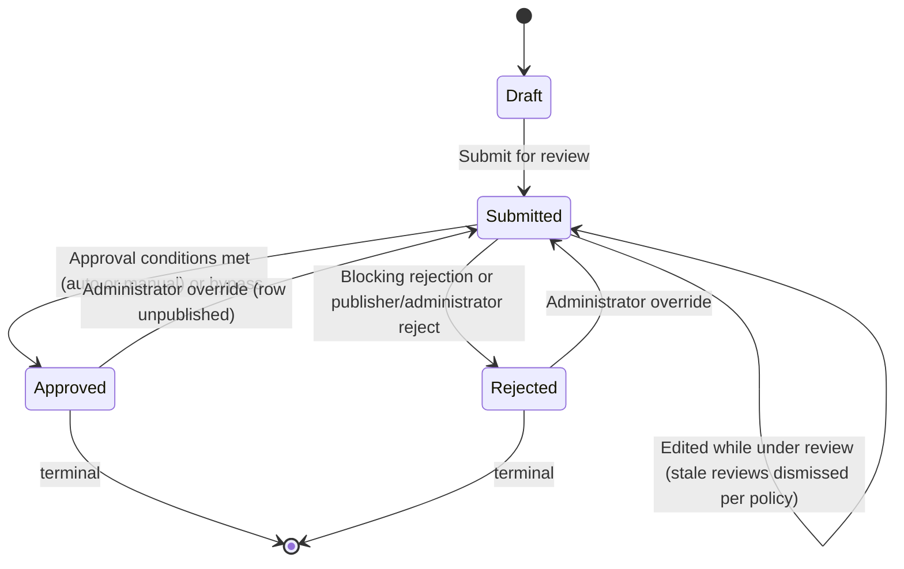

# G2H Design

## 1. Design Overview

### 1.1 Purpose

Glory 2 Him (G2H) is a content management system designed to allow users to contribute, organise, review, approve, publish, associate, and consume gospel-focused content.

The system is centred around `ContentItem`, which represents primary user-contributed content. Examples of content types include:

1. `Quote`
2. `Story`
3. `Testimony`
4. `Topic`
5. Future content types

All user-contributed and configurable content is subject to an approval process before it is considered trusted, visible, or publishable.

### 1.2 Core Design Principles

The design follows these principles:

1. Content must be versioned.
2. Content must be approvable.
3. Approval must be reusable across multiple entity types.
4. Approval must not be tightly coupled to each entity through direct database relationships.
5. Content associations must support both a specific content version and all versions of a content item group.
6. Content-specific behaviour must be policy-driven through settings.
7. `Topic` must be modelled as a `ContentType`, not as a separate database entity.
8. A `Topic` groups other content items through `Association`.
9. The feed is a domain projection only, not a database entity.
10. Any publishable content type except `Topic` can appear in the feed.
11. All deletes are soft deletes.
12. Soft-deleted content must be excluded from public visibility.

### 1.3 Source Inputs

This design is based on:

1. The `Glory 2 Him.drawio` design file.
2. The current C# entity model files.
3. The current EF Core model snapshot.
4. The supplied design direction for approval, settings, feed, topic, versioning, visibility, and soft delete behaviour.

### 1.4 Current Model Completion Status

The current source files are not complete. This document separates the design into:

1. Current implemented model.
2. Diagram-driven intended model.
3. Required model extensions.
4. Recommended design rules.
5. Final agreed direction where this supersedes earlier diagram wording.

## 2. Domain Model Overview

### 2.1 Main Domain Areas

The domain model is grouped into the following areas:

1. Content
2. Content Types
3. Content Settings
4. Content Associations
5. Approval
6. Approval Policy Settings
7. Supporting Content Entities
8. Feed Projection
9. Topic Grouping
10. Events
11. AI Content Analysis
12. Security and Audit
13. Soft Delete

### 2.2 Main Entity Groups

| Area | Entities |
| --- | --- |
| Content | `ContentItem`, `ContentType`, `ContentItemSetting`, `Association` |
| Approval | `Approval`, `ApprovalReview`, `ApprovalComment`, `ApprovalSetting` |
| Associated Entities | `Tag`, `Reaction`, `Comment`, `BibleReference`, `Link`, `Attachment` |
| Enum / Lookup | `EntityType`, `ApprovalStatus`, `Scope` |
| Future Subscription | `Subscription`, `SubscriptionDelivery`, or equivalent decoupled subscription records |

## 3. Content Design

### 3.1 ContentItem

`ContentItem` is the central content entity in the system.

It represents a versioned item of contributed content such as a quote, story, testimony, topic, or future content type.

### 3.2 ContentItem Properties

The content item model should contain the following design-relevant properties:

| Property | Purpose |
| --- | --- |
| `Id` | Unique identifier for this specific content version. |
| `ContentType` | Identifies the type of content, such as `Quote`, `Story`, `Testimony`, or `Topic`. |
| `Title` | Optional content title. |
| `Author` | Optional content author. |
| `Content` | Required body content. |
| `ContentHash` | SHA-256 hash of the normalized `Content` (trim, collapse whitespace, lowercase). Control field computed on every write. Non-unique index on (`ContentType`, `ContentHash`) for duplicate detection (§3.4.2). |
| `GroupId` | Groups multiple versions of the same logical content item. |
| `Version` | Version number for the item. The group's **tip** — the row edits go to — is the highest `Version` among its non-deleted rows, derived rather than stored (§3.4.1). |
| `IsPublished` | Identifies the currently published version. Only one row per `GroupId` may be published. |
| `ApprovalStatus` | Denormalized approval state (`Draft`, `Submitted`, `Approved`, `Rejected`). Mirrors the linked `Approval` record. `Approval` remains the source of truth. |
| `PublishDate` | Optional date/time from which the content can be visible. |
| `IsDeleted` | Soft-delete flag. When `true` the item is excluded from all public visibility. |
| `CreatedBy` | User who created the item. |
| `CreatedWhen` | Creation timestamp. |
| `UpdatedBy` | User who last updated the item. |
| `UpdatedWhen` | Last update timestamp. |
| `DeletedBy` | User who deleted the item. |
| `DeletedWhen` | Deletion timestamp. |
| `DeletionReason` | Reason for deletion. |

SEO and share fields — `Slug`, `MetaDescription` and `ShortCode` — are specified in §19.2, §19.3 and §19.7 and are not columns yet. `Content` may reference uploaded images inline by their media URL (§5.6.6); an inline reference is body text, not a column and not an association.

### 3.3 Content Versioning

Content is versioned by using:

1. `Id` for the specific version.
2. `GroupId` for the logical content item across all versions.
3. `Version` for the version number.
4. The highest `Version` among the group's non-deleted rows to identify the latest editable version. This is **derived, not a stored flag** (§3.4.1).
5. `IsPublished` to identify the current public version.

### 3.4 Content Versioning Rules

The following rules apply:

1. A new content item starts with `Version = 1`.
2. A new content item is its group's tip by construction — it is the only row, so it carries the highest `Version`. Nothing is written to say so (§3.4.1).
3. A new content item starts with `IsPublished = false` unless it is approved and published through the approval workflow.
4. A content item in `Draft` or `Submitted` may be edited in place.
5. Editing a `Draft` or `Submitted` item does not create a new version.
6. If approval reviews have already been submitted and the content item itself changes, those reviews must be dismissed (subject to `ApprovalSetting.RequireReapprovalOnChange`) and the item must be reviewed again. The item itself remains in its current status.
7. **`Approved` and `Rejected` are terminal.** A content item in either state is immutable in place — to its owner, to a publisher, and to an administrator alike. No role amends a terminal row's content, and there is no in-place exception (rule 16).
8. Editing a terminal content item creates a new `ContentItem` row with the same `GroupId` and incremented `Version`. The owner is the only creator of new versions — `Publishers` and `Administrators` roles never create version forks.

   A rejected row is terminal on the same terms as an approved one, and for the same reason: reviewers reached a verdict on that text, and text that changes underneath a verdict makes the verdict a record of nothing. The difference is only in what stays live — a **rejected** row never published, so a fork off one leaves the group with no public row until the new version is approved, where a fork off an approved one leaves the approved row published throughout (rule 12).
9. The new version becomes the group's tip, because its `Version` is the highest in the group. The fork is therefore ONE write.
10. The previous latest version stops being the tip for the same reason, and **nothing is written to demote it**. This rule used to require a second write, and that shape is withdrawn: a fork that demoted first and then failed to insert satisfied the old unique index while leaving the group with no tip at all — permanently uneditable, because the demote only ever wrote `false` (issue #265). Derived, that state cannot be represented.
11. The new version must not become `IsPublished = true` until approved.
12. The previously published version remains `IsPublished = true` until the new version is approved and published.
13. Exactly one content item per `GroupId` is the tip at any moment, and the derivation makes that true rather than enforcing it: the unique index on (`GroupId`, `Version`) admits one row per version, so the highest non-deleted `Version` in a group names exactly one row.
14. Only one content item per `GroupId` may have `IsPublished = true`.
15. Previous versions must remain available for audit, approval history, comparison, and rollback.
16. **There is no in-place amendment of a terminal item, by any role.** This rule previously granted an administrator one: amend an approved item without forking, resetting its approval to `Submitted` and dismissing active reviews. It is withdrawn, because a state that one role can edit out of is not terminal, and rule 7 depends on it being terminal for everyone.

    What replaces it is narrower and leaves a record. An administrator may move a terminal item's **status** back to `Submitted` through the approval transition operation (§8.6 HR-4, §9.7.1 rule 3) — an override, gated to `Administrators` alone, which unpublishes the row on the way out of `Approved`. Ordinary editing resumes only once the row is no longer terminal. The two acts stay separate: a status transition changes no content, and a content edit changes no status.
17. While such a re-opened item is pending, it no longer satisfies canonical content visibility (its `ApprovalStatus` is `Submitted`) and is not publicly visible until approved again.
18. **There is no stored latest-version flag to write.** This rule used to name the two points at which `IsLatestVersion` was written; the column is gone (issue #265) and the tip is read off the group's rows, so no operation — submit, review, approve, publish, or an administrator status override — can move the tip other than by adding a version.

#### 3.4.1 The Version Tip and the Published Row

The **tip** of the version chain is the row edits go to: the highest `Version` among the group's non-deleted rows. It is **derived, never stored**. `IsPublished` marks the row the public sees, and is stored. During a review window the two deliberately sit on different rows.

Exactly one row per `GroupId` is the tip at any moment — a consequence of the unique (`GroupId`, `Version`) index rather than a rule anything has to uphold. At most one `IsPublished = true` per `GroupId`, and that one *is* enforced, by a unique filtered index over the group's **live** rows — `WHERE IsPublished = 1 AND IsDeleted = 0`. The `IsDeleted` term is what stops a soft-deleted row holding the slot against versions that cannot see it; every versioned entity's slot index is declared from one place so the three cannot drift apart again, and a model test fails when a new one arrives without it (§5.6.4 rule 4).

The asymmetry is the point. "Exactly one tip" was previously enforced in two halves — a filtered unique index guaranteed *at most* one, and application code was trusted for *at least* one — and the halves came apart: a fork was demote-then-insert, so an insert that failed left a group with no tip, permanently uneditable. Derived, the state cannot be represented, and a failed fork writes nothing at all. "At most one published" has no matching failure mode: a group with no published row is an ordinary, recoverable state (§9.7.7 rule 7), so the stored flag and its index stay.

| Lifecycle event | Tip of the group | `IsPublished` |
| --- | --- | --- |
| Create V1 | V1 (the only row) | V1 = `false` |
| Edit a `Draft` or `Submitted` item (in place) | unchanged | unchanged |
| Owner edits a terminal item — `Approved` or `Rejected` (fork) | the new row, by carrying the higher `Version`; nothing is written to the previous tip | new row = `false`; previously published row unchanged |
| Submit / review / reject | unchanged | unchanged |
| Approve + publish | unchanged (approval adds no version) | approved row = `true`; previously published row = `false` |
| `Administrators` overrides a terminal item's status back to `Submitted` | unchanged | that row = `false` (§8.6 HR-4); no other row is republished |

Worked example (V1 published, owner edits):

| Step | V1 | V2 |
| --- | --- | --- |
| V1 approved + published | tip, published=`true` | — |
| Owner edits → fork V2 | published=`true` (still live) | tip, published=`false`, `Draft` |
| V2 submitted, under review | published=`true` | tip, published=`false`, `Submitted` |
| V2 approved + published | published=`false` | tip, published=`true` |

Worked example (V1 rejected, owner edits) — the case that distinguishes a rejected terminal row:

| Step | V1 | V2 |
| --- | --- | --- |
| V1 rejected | tip, published=`false`, `Rejected` | — |
| Owner edits → fork V2 | published=`false` | tip, published=`false`, `Draft` |
| V2 approved + published | published=`false` | tip, published=`true` |

Note the middle row: the group has **no published version at all** while V2 is in review, because V1 never had one to keep. Nothing is demoted at V2's publish, so §9.7.7 rule 7's ordering has nothing to order.

#### 3.4.2 Duplicate Content Rule

Purpose: two different people cannot submit the exact same content.

1. The duplicate match compares `Content` only (not `Title` or `Author`).
2. The match is normalized: trim ends, collapse whitespace/newline runs to a single space, lowercase (invariant culture). The normalization function is a frozen contract — changing it requires recomputing every stored hash in a migration.
3. The match is scoped per `ContentType`.
4. The match compares against all non-deleted rows (any status, any version). On modify, the item's own `GroupId` is excluded.
5. Mechanism: `ContentHash` = SHA-256 of the normalized content, computed by the orchestration on every write and stored on `ContentItem`. A non-unique index on (`ContentType`, `ContentHash`) makes the check an index seek. The index must not be unique — rows within one group may legitimately share a hash (for example a later version reverting to earlier wording); enforcement is application-side.
6. Response on a duplicate: add → polite acknowledgement ("Thank you for your submission") without creating the record and without revealing the duplicate; modify → validation error.

### 3.5 Approval Invalidation Rules

Approval invalidation is entity-scoped.

A change to an entity only invalidates approvals for that specific entity and must not reset approvals of unrelated entities.

For `ContentItem`:

1. Changes to `Title`, `Author`, `Content`, `ContentType`, `PublishDate`, or other approval-sensitive content metadata may invalidate the content item's own approval.
2. If reviews exist for the content item, the reviews should be marked as `Dismissed` when the content changes.
3. The approval status of the item does not change when reviews are dismissed — a `Submitted` item remains `Submitted`. There is no exception: the `Administrators` in-place amendment that used to be one is withdrawn (§3.4 rule 16), and an amendment of a terminal item forks rather than resetting anything.
4. Reviewers must review the updated content again.

For linked entities:

1. Changes to tags, comments, reactions, Bible references, links, or attachments must not invalidate the parent `ContentItem` approval.
2. Only the changed entity's own approval lifecycle is affected.
3. Only the changed association's approval lifecycle is affected when the association itself changes.

Example:

1. A story is approved and published.
2. A new tag is associated to the story.
3. The tag or association may require approval.
4. The story remains approved and published.
5. The tag is only visible on the story once the tag and association are visible according to policy.

### 3.6 ContentType

`ContentType` is a fixed C# enum, not a database entity or a `ContentItem`. There is no `ContentTypes` table, no foundation service, no orchestration, and no lifecycle — a content type is a compile-time constant of the running application, not admin- or user-defined data.

```csharp
public enum ContentType
{
    Quote = 0,
    Story = 1,
    Testimony = 2,
    Devotional = 3,
    BibleStudy = 4,
    BlogPost = 5,
    Series = 999,
    Topic = 1000
}
```

`Series` and `Topic` are numbered apart from the standalone content types above — see §3.9.

### 3.7 ContentType Properties

Not applicable. `ContentType` has no properties of its own — it is persisted as a string (`HasConversion<string>()`, matching `Scope`, and matching `EntityType` on `ApprovalSettings` and `Associations`; the unconverted exceptions are `ApprovalStatus`, which has no conversion on any table, and `EntityType` on `Approvals` — both persist as `int`) wherever it is stored, and it is `ContentItem`, `ContentItemSetting`, and `ApprovalSetting` that carry a `ContentType` value, not the reverse. Adding, renaming, or removing a member is a code change and a release, not a runtime CRUD operation.

### 3.8 Content Type Rules

The following rules apply:

1. `Topic` and `Series` are `ContentType` members, not separate root entities.
2. The feed must exclude `Topic` and `Series` content items.
3. Any publishable content type except `Topic` and `Series` can appear in the feed.
4. `ContentItem.ContentType` is set on creation and never accepted from a caller on modify (§12.4.1 business rule 7a) — different content types carry different validation rules, so an item cannot be relabelled into a type its content was never checked against.
5. Adding a new `ContentType` member requires a code change; it can never be introduced by an end user or admin at runtime.

### 3.9 Series vs. Topic — to revisit

`Series` and `Topic` currently have identical documented behaviour: both are grouping content items excluded from the feed (§3.8 rules 1–3), and neither carries a rule that distinguishes one from the other. §11 ("Topic and Feed Design") describes the grouping mechanism only in terms of `Topic`; `Series` was added to the enum without an equivalent section or without checking whether it duplicates `Topic`.

**Open question:** are `Series` and `Topic` the same concept under two names, or do they represent genuinely different groupings (e.g. an ordered, authored sequence vs. an unordered subject tag)? This needs a design decision — either give `Series` its own rules distinct from §11, fold it into `Topic` and remove the member, or document the distinction explicitly (e.g. `Series` implies `Association.SortOrder`-based ordering per §9.6/§9.7.1 rule 4, `Topic` does not).

Until this is resolved, `Series` and `Topic` are numbered apart from the standalone content types (§3.6) as a placeholder, not as a statement that the design question is settled.

## 4. Association Design

### 4.1 Purpose

`Association` is the generic link between **two entities**. Both endpoints are generic and symmetric: neither is hard-wired to a `ContentItem`.

It supports:

1. Tags
2. Reactions
3. Comments
4. Bible References
5. Links
6. Attachments
7. Child content items
8. Topic and series membership
9. Related content
10. Related Bible references — a `BibleReference` to `BibleReference` pair, which the earlier one-sided shape could not express at all

**There is no `Kind` and no `SourceEndpoint`.** The `(EntityType, ContentType)` pair on each endpoint already carries the meaning, and direction falls out of the asymmetry — a `Series` paired with a `Story` is always container-to-member, because the reverse is not a thing that exists. A separate discriminator would be a second source of truth for something the endpoints already say, and two sources of truth for one fact eventually disagree.

**One narrow, structurally-constrained exception exists: `Purpose` (§4.9).** The no-discriminator rule rests on the premise that the endpoint pair carries the meaning — and for an `Attachment` endpoint the premise fails: `ContentItem` ↔ `Attachment` could equally mean header image, gallery member or downloadable file, and nothing on either endpoint can say which. `Purpose` names that slot. It is permitted **only** when an endpoint is an `Attachment` and forbidden otherwise, so it cannot grow into a general `Kind`: everywhere the pair is self-describing, a discriminator stays refused for the reason above.

### 4.2 Endpoint Shape

Each endpoint carries the same six fields:

| Field | Purpose | Owned by |
| --- | --- | --- |
| `Entity{A,B}Type` | The `EntityType` of the endpoint. | caller, create-only |
| `Entity{A,B}KeyId` | The specific row — the version, for a versioned entity type. | caller, create-only |
| `Entity{A,B}GroupId` | The version group. Equal to `KeyId` when the entity type is not versioned, so every endpoint has a group id and one set of rules covers both kinds. | caller for a versioned type; derived otherwise; create-only |
| `Entity{A,B}Scope` | Whether the association follows the endpoint across versions. | derived (§4.5); the only endpoint field that may change after creation |
| `Entity{A,B}EffectiveId` | `GroupId` under `AllVersions`, `KeyId` under `ThisVersionOnly`. | the database (§4.6) |
| `Entity{A,B}ContentType` | The endpoint's `ContentType`, denormalised so authorization composes from the row alone (§18.6). Null unless the type is `ContentItem`. | derived from the resolved endpoint, never caller-supplied |

Plus `UserId`, set only where the association is personal rather than editorial — today a `Reaction` endpoint. Null means editorial.

`Association` also implements `ISortOrder` (§11.7) and `IConfidence` (§9.7.1 rule 5), and carries `Purpose` and `IsDefault` for purposeful attachment placements (§4.9) — row-level fields like `UserId` and `SortOrder`, not part of either endpoint block.

### 4.3 Scope Rules

| Scope | Meaning | Effective id |
| --- | --- | --- |
| `AllVersions` | The association follows the endpoint's whole version group — a tag on a story survives the story being amended. | `GroupId` |
| `ThisVersionOnly` | The association applies to one specific row. | `KeyId` |

### 4.4 Canonical Ordering

The two endpoints are stored in a fixed order, A before B, computed on add. One row therefore serves both endpoints' lists, and "is X linked to Y" is one lookup rather than two.

A is the endpoint with the lower `(EntityType name, GroupId)` tuple; B is the other.

1. **Order on the enum name, not its numeric value**, using `string.CompareOrdinal`. The name is what SQL stores and what the §4.4 check constraint compares. A rename then breaks loudly at the constraint; a renumber would silently reorder existing rows.
2. **Order on `GroupId`, not the effective id.** `GroupId` never changes, so a scope toggle can never force A and B to swap columns — which would otherwise turn a set-scope operation into a repoint.
3. **Guid comparison must use SQL Server's ordering, not .NET's.** SQL Server orders `uniqueidentifier` by bytes 10–15 first; .NET compares the leading `_a`/`_b`/`_c` fields as integers. The two disagree on most pairs, so `Guid.CompareTo` would produce an order the database's own canonical-order constraint rejects. Use `new SqlGuid(a).CompareTo(new SqlGuid(b))`.
4. **Normalisation runs inside `DoAddAssociationAsync`, before the storage call** — not in the public method and not in an orchestration. `Association-Adding` is a public event address whose substrate handler enters `DoAdd` directly, so anything layered above it is bypassed.

### 4.5 Derived and Pinned Endpoint Fields

1. `Scope` is **derived, never accepted from a caller**: a non-versioned entity type resolves to `ThisVersionOnly` (it has exactly one row, so `AllVersions` would be a distinction without a difference); a versioned one defaults to `AllVersions`. The publication model comes from the §7.5.1 lookup — **never** from probing the entity for `IVersion` at runtime, which this repository has already proved unreliable twice.
2. `GroupId` is derived as `KeyId` for a non-versioned endpoint.
3. `ContentType` is derived from the resolved endpoint and never caller-supplied — it is an authorization input, so a caller who could set it could claim authority over a content type they hold no role for. Resolving it requires reading the endpoint row, which is an orchestration read; the foundation enforces the structural half of the rule (a value is permitted only on a `ContentItem` endpoint) and leaves a null endpoint costing the caller only the narrow role tier.
4. **Reclassification is forbidden.** `Type`, `KeyId` and `GroupId` are pinned against storage on every modify. Repointing an association is indistinguishable from deleting one link and creating another — except that it carries the original's approval state and review history across to a pair nobody reviewed.
5. The two endpoints must differ: `EntityAGroupId != EntityBGroupId`. Because a non-versioned endpoint's group id is its key id, this one rule covers an entity associated with itself, two versions of the same entity, and a tag paired with itself.

### 4.6 Effective Id

`Entity{A,B}EffectiveId` is a `PERSISTED` computed column — `CASE WHEN Scope = 'AllVersions' THEN GroupId ELSE KeyId END` — read-only to application code. It earns its keep twice:

1. **It is the read predicate.** Every tag panel and related-passage panel asks "associations for this entity". Without the column that is an `OR` across `KeyId`/`GroupId` plus two scope tests per side; with it, one seekable comparison on the query that runs on every page render.
2. **It makes uniqueness a database guarantee.** Two `AllVersions` rows for the same group differing only in `KeyId` mean the same thing; over the raw columns they are distinct rows, and the effective id collapses them. This matters because foundation services are reachable through public event addresses and cannot assume an orchestration's retrieve-or-add ran first. `UX_Associations_Pair` is the unique index over it, filtered on `IsDeleted = 0`, keyed on both endpoints' type and effective id with `UserId` last — nullable, so one index means "one per user" when set and "one globally" when null. It is paired with `CK_Association_CanonicalOrder`, without which the same pair written the other way round is a different key and the duplicate lands.

   `Purpose` (§4.9 — designed, not built) joins the key: `(EntityAType, EntityAEffectiveId, EntityBType, EntityBEffectiveId, UserId, Purpose)`, so the same pair may exist once per purpose — `UserId` keeps its position and its null-collapse role, with `Purpose` extending the key behind it. The index remains **deduplication**, not selection — it answers "has this exact statement been made before", while §4.9 rule 5 answers "which candidate renders". Existing rows all carry `Purpose = NULL`, which the unique index treats as a value, so per-pair semantics on non-attachment associations are unchanged.

### 4.7 Associated Entity Types

The supported entity types on either endpoint are defined by `EntityType`.

| EntityType | Purpose |
| --- | --- |
| `ContentItem` | Related content, topic and series children, parent/child links. |
| `Association` | Allows association records themselves to be approved. |
| `Tag` | Categorisation and labelling. |
| `Reaction` | Reactions such as love, like, celebrate. |
| `BibleReference` | Scripture references, including reference-to-reference pairs. |
| `Comment` | Comments on content. |
| `Link` | External or internal links. |
| `Attachment` | Files or binary resources. |

### 4.8 Association Approval

Associations are themselves subject to approval.

This means that even if a `Tag`, `Comment`, `BibleReference`, or `Link` is approved as an entity, the association between that entity and a `ContentItem` can still require its own approval.

Example:

1. A tag named `Faith` may already be approved.
2. A user associates `Faith` with a story.
3. The association can require approval based on the effective `ApprovalSetting` for `EntityType.Association` — see §8.4. This is **not** a `ContentItemSetting` concern (§6.1).
4. The tag becomes visible on the story only when both the tag and association are visible.

**Associations hosted on something other than a content item.** Because associations are symmetric, either endpoint may be any entity type, so a `BibleReference` ↔ `Tag` or `BibleReference` ↔ `BibleReference` association has no `ContentItem` to resolve settings from.

`ContentItemSetting` is not generalised to cover that. It stays scoped to content items (§6.1), and each host entity type gets its own settings entity instead — `BibleReferenceSetting` (§6.9) for the reference page. An association resolves the allowed/show switches per endpoint, from that endpoint's own settings entity, and is permitted only when both ends allow it (§6.10).

Approval is unaffected either way: `ApprovalSetting` is keyed on `(EntityType, ContentType, IsPersonal)` (§8.4) and needs no host at all. A personal association — one whose `UserId` is set (§4.2) — resolves the `(Association, IsPersonal = TRUE)` tier, which is how a user's own reaction can be exempt from review while an editorial placement is not.

### 4.9 Purposeful Placements — Purpose and IsDefault

**Status: designed, not built** (agreed 2026-08-17). Two row-level fields and one narrow operation, so an attachment can be attributed to a host *for a stated reason* — the header image of a story, the verse image of a Bible reference — without reintroducing the general discriminator §4.1 refuses.

| Field | Shape | Ownership |
| --- | --- | --- |
| `Purpose` | Nullable enum, persisted as a string via `HasConversion<string>()`, like the association's string-converted enum columns — `EntityAType` / `EntityBType`, the two `Scope`s and the two `ContentType`s — rather than its `int`-persisted `ApprovalStatus` (§3.7). Members are append-only: `Header = 0`, `Verse = 1`, `Gallery = 2` *(reserved)*. | Caller-chosen on add, then pinned against storage like the endpoints — re-purposing a row is remove + add, for the §4.5 rule 4 reason. |
| `IsDefault` | `bit NOT NULL DEFAULT 0`. Marks the preferred row among same-purpose candidates. | Refused on add; written only by the set-default operation (rule 4); pinned on the general modify. |

Rules:

1. **`Purpose` is mandatory when an endpoint is an `Attachment`, and forbidden when none is.** Enforced twice: `CK_Association_PurposeMatchesAttachmentEndpoint` — `(Purpose IS NULL AND EntityAType <> 'Attachment' AND EntityBType <> 'Attachment') OR (Purpose IS NOT NULL AND (EntityAType = 'Attachment' OR EntityBType = 'Attachment'))` — and the same rule in foundation validation with a typed exception. Every attachment association must say *why* the file is attached; a future purpose-less attachment (a downloadable file, say) is a new enum member such as `Download`, never a null.
2. **`IsDefault` requires a `Purpose`** — `CK_Association_DefaultRequiresPurpose`: `IsDefault = 0 OR Purpose IS NOT NULL`. A default with no slot to be the default *of* is meaningless.
3. **`Purpose` joins `UX_Associations_Pair` and both retrieve-or-add probes** (§4.6). The pair index is deduplication — so the same image may be a header candidate *and* a gallery member of one host as two rows, and a header add cannot false-positive against an existing gallery row of the same pair.
4. **`SetAssociationDefaultAsync` is the only writer of `IsDefault`.** It follows the set-scope/set-confidence shape (§14.7): it clears same-host, same-purpose siblings and then flags the target within one save — ordered so the rule 6 index never sees two flagged rows mid-flight — and publishes `Association-DefaultSet` on its own address. It **refuses a target that is not `Approved`** (or is deleted): only a vetted candidate can be promoted, so the default is always a member of the rendered set, never a hidden intention.

   **Who may call it is not yet ruled.** The nearest precedents disagree: `Sort` (also presentation) admits the owner and `Administrators` — but the row-local owner is the association's `CreatedBy`, who for a suggested candidate is not the host content's owner, and resolving the host's owner is not row-local (§14.7 posture A′) — while set-confidence and set-scope admit `Publishers` and `Administrators`. Until ruled, the conservative reading is `Administrators`, the one caller every precedent admits; whether the `Publishers` tier or the owner joins it is the open half of the ruling.
5. **Selection is a resolution rule, not a constraint.** Any number of same-purpose candidates may exist per host. The rendered attachment for a (host, purpose) slot is chosen among **visible candidates** — §14.3's association-visibility composite, which is association `Approved` + published + not deleted, both endpoints visible under their own §14.1 rule (so the attachment group must hold a published, non-deleted version), and the host's effective settings permitting display (§6.10 — `ShowAttachments` for a content item) — by `ORDER BY IsDefault DESC, PublishDate ASC, CreatedWhen ASC, Id ASC`, take 1: the default wins, otherwise the first approved candidate, with the ordering tail making "first" deterministic on every read surface. **`IsDefault` never overrides approval** — the flag orders candidates *within* the vetted set; a row outside it (`Draft`, `Submitted`, `Rejected`, unpublished, or deleted) does not exist to the resolver, flagged or not. A flagged row that later leaves the vetted set — an administrator status override, a takedown of the image — simply stops being a candidate, and the fallback covers the gap without an edit.
6. **At most one default per (host, purpose) slot** — `UX_Associations_DefaultPurpose`, unique over `(EntityBType, EntityBEffectiveId, Purpose)` filtered `WHERE IsDefault = 1 AND IsDeleted = 0`. Keying the host on the B side works because canonical ordering (§4.4) sorts on the enum *name*, and `"Attachment"` precedes every other resolvable endpoint name ordinally — so the attachment lands on A and the host on B. The one ordinal exception is `Association` itself, which sorts before `Attachment`; an `Association` ↔ `Attachment` pair is not a resolvable shape today and must stay refused while this index keys the host on B. Note the level: the constraint bites per **(host, purpose)** — per (pair, purpose) it would be vacuous, since rule 3 already permits only one row there. What it forbids is two *different* images both flagged as the default header of one item.
7. **Scope needs nothing new.** §4.5 rule 1's defaults are correct here: `AllVersions` on both sides for `ContentItem` ↔ `Attachment` means one candidate set per content group, resolving to the attachment group's newest published bytes (§5.6.4); a non-versioned host such as `BibleReference` derives `ThisVersionOnly` as always.
8. **The orchestration add flow threads `Purpose` through** — the add and both probes match on it — and refuses a caller-supplied `IsDefault`. The `Attachment` arm of endpoint resolution is unblocked by the `AttachmentService` of §12.3 entry 12; until that exists the arm keeps throwing, exactly as today.
9. **Approval of the attachment itself derives from the host** — §5.6.5. Nothing here changes association approval (§4.8): a purposeful association is approvable like any other.

## 5. Supporting Content Entities

### 5.1 Tag

`Tag` represents a categorisation label.

**The `GroupId` / `Version` / `IsLatestVersion` rows below are not implemented and never have been.** `Tag` carries `IApproval` only, `EntityTypeVersioning` declares it Single-Row (§7.5.1), and `IsLatestVersion` does not exist on any entity any more (§3.4.1). The rows are left standing because §7.5.1 rule 1 and §12.3.1 both cite this table as their worked example of documentation drift.

| Property | Purpose |
| --- | --- |
| `Id` | Unique tag identifier. |
| `Name` | Tag name. |
| `GroupId` | Groups all versions of this tag record together. Populated on creation and shared across all versions. |
| `Version` | Version number of this tag record, defaults to 1. |
| `IsLatestVersion` | Identifies the latest version of this tag record. |
| `PublishDate` | Optional date/time from which this tag becomes visible. |
| `IsPublished` | Identifies whether the current version of this tag is published. |
| `ApprovalStatus` | Denormalized approval state (`Draft`, `Submitted`, `Approved`, `Rejected`). |
| `IsDeleted` | Soft-delete flag. When `true` the tag is excluded from all public visibility. |
| `CreatedBy` | User who created the tag. |
| `CreatedWhen` | Creation timestamp. |
| `UpdatedBy` | User who last updated the tag. |
| `UpdatedWhen` | Last update timestamp. |
| `DeletedBy` | User who deleted the item. |
| `DeletedWhen` | Deletion timestamp. |
| `DeletionReason` | Reason for deletion. |

### 5.2 Reaction

`Reaction` represents a reusable reaction definition.

**As with `Tag` (§5.1), the `GroupId` / `Version` / `IsLatestVersion` rows below are not implemented and never have been.**

| Property | Purpose |
| --- | --- |
| `Id` | Unique reaction identifier. |
| `Name` | Reaction name. |
| `UnicodeEmoji` | Emoji representation. |
| `GroupId` | Groups all versions of this reaction record together. Populated on creation and shared across all versions. |
| `Version` | Version number of this reaction record, defaults to 1. |
| `IsLatestVersion` | Identifies the latest version of this reaction record. |
| `PublishDate` | Optional date/time from which this reaction becomes visible. |
| `IsPublished` | Identifies whether the current version of this reaction is published. |
| `ApprovalStatus` | Denormalized approval state (`Draft`, `Submitted`, `Approved`, `Rejected`). |
| `IsDeleted` | Soft-delete flag. When `true` the reaction is excluded from all public visibility. |
| `CreatedBy` | User who created the reaction. |
| `CreatedWhen` | Creation timestamp. |
| `UpdatedBy` | User who last updated the reaction. |
| `UpdatedWhen` | Last update timestamp. |
| `DeletedBy` | User who deleted the item. |
| `DeletedWhen` | Deletion timestamp. |
| `DeletionReason` | Reason for deletion. |

### 5.3 Comment

`Comment` represents user or reviewer visible discussion attached to content through `Association`.

| Property | Purpose |
| --- | --- |
| `Id` | Unique comment identifier. |
| `Content` | Comment body text. |
| `CreatedBy` | User who created the comment. |
| `CreatedWhen` | Creation timestamp. |
| `UpdatedBy` | User who last updated the comment. |
| `UpdatedWhen` | Last update timestamp. |
| `DeletedBy` | User who deleted the item. |
| `DeletedWhen` | Deletion timestamp. |
| `DeletionReason` | Reason for deletion. |

### 5.4 BibleReference

`BibleReference` represents scripture references associated with content.

| Property | Purpose |
| --- | --- |
| `Id` | Unique Bible reference identifier. |
| `USFM` | Canonical passage key including translation, such as `JHN.3.16.NIV`. Unique across non-deleted rows and immutable after creation (§7.5.1 rule 4, §12.3.1 rule 2a). |
| `Reference` | Bible reference, such as `John 3:16`. |
| `Translation` | Bible translation, such as NIV, KJV, ESV. |
| `Scripture` | Optional scripture text. |
| `CreatedBy` | User who created the Bible reference. |
| `CreatedWhen` | Creation timestamp. |
| `UpdatedBy` | User who last updated the Bible reference. |
| `UpdatedWhen` | Last update timestamp. |
| `DeletedBy` | User who deleted the item. |
| `DeletedWhen` | Deletion timestamp. |
| `DeletionReason` | Reason for deletion. |

### 5.5 Link

`Link` represents an external or internal link associated with content.

| Property | Purpose |
| --- | --- |
| `Id` | Unique link identifier. |
| `Name` | Display name. |
| `Url` | Target URL. |
| `LinkType` | Internal, external, video, article, source, etc. |
| `CreatedBy` | User who created the link. |
| `CreatedWhen` | Creation timestamp. |
| `UpdatedBy` | User who last updated the link. |
| `UpdatedWhen` | Last update timestamp. |
| `DeletedBy` | User who deleted the item. |
| `DeletedWhen` | Deletion timestamp. |
| `DeletionReason` | Reason for deletion. |

### 5.6 Attachment

`Attachment` represents a file or binary resource, attributed to hosts through `Association` (§4.9 for purposeful placements) or referenced inline from content bodies (§5.6.6).

| Property | Purpose |
| --- | --- |
| `Id` | Unique attachment identifier. |
| `Name` | Display name. |
| `BlobUri` | Storage location (§5.6.1). Never exposed to any client. |
| `Hash` | SHA-256 of the original uploaded bytes, for integrity and later deduplication (§5.6.3 rule 5). |
| `MimeType` | Served `Content-Type`; recorded from the re-encoded result, never trusted from the caller. |
| `SizeInBytes` | Size of the stored bytes — quotas, sweep reporting, storage telemetry. |
| `Width` / `Height` | Pixel dimensions, nullable — `og:image:width/height` (§19.8) and layout stability. |
| `AltText` | Optional accessibility text for purposeful placements (§5.6.3 rule 6). |
| `CreatedBy` | User who created the attachment. |
| `CreatedWhen` | Creation timestamp. |
| `UpdatedBy` | User who last updated the attachment. |
| `UpdatedWhen` | Last update timestamp. |
| `DeletedBy` | User who deleted the item. |
| `DeletedWhen` | Deletion timestamp. |
| `DeletionReason` | Reason for deletion. |

`MimeType`, `SizeInBytes`, `Width`, `Height` and `AltText` are agreed design (2026-08-17), not columns yet. §5.6.1–§5.6.7 specify the storage, serving, upload, approval and lifecycle design that lands with them; all of it shares that status.

#### 5.6.1 Physical Storage

1. Binaries live in **Azure Blob Storage**; SQL keeps metadata only. The `varbinary`-in-SQL alternative was rejected: the one precedent — profile avatars in the Identity database — is bounded at 256px, and content images are not, so database size, backup time and buffer-pool pressure would pay for the convenience forever. The entity was born with `BlobUri`; this section gives the column its producer.
2. One private container, `attachments`. Blob name = the attachment row's `Id` — one blob per **version row**, and a version's bytes never change, so blob names are immutable and cacheable (§5.6.2 rule 3).
3. Access goes through an `IBlobStorageBroker` wrapping `Azure.Storage.Blobs` — the same wrap-the-external-library pattern as the existing image-processing broker. Operations: upload, download, delete, exists, and list-by-prefix (for the §5.6.7 orphan sweep).
4. **Write order is blob first, row second**; deletion is the mirror — row first, blob second. An orphan blob is recoverable noise for the sweep; a row pointing at a deleted blob is a broken image.
5. `BlobUri` never leaves the server — no API response, no SAS URL handed to a browser. Everything serves through §5.6.2, which keeps storage swappable and the visibility gate in one place.
6. Development uses **Azurite** on the same broker code path. Azure-side blob soft delete (14 days) is enabled as belt-and-braces against sweep defects.

#### 5.6.2 Serving — the Media Endpoint

All attachment bytes are served by one endpoint: `GET /media/{attachmentId}` (§17.6).

1. Load the attachment metadata, apply the visibility gate, stream from blob storage with `Content-Type = MimeType`.
2. **The gate** (§14.7 posture A″): a published, approved, non-deleted attachment is public. A soft-deleted attachment is not found for **every** caller, including `Administrators` (§14.5 rule 3). Anything else answers **not-found** per §14.5 — never unauthorized — except to the uploader, the `Attachment` review roles, and reviewers or publishers of an entity whose row references the attachment, so a reviewer sees a draft's images in context. The gate does its own host check: it resolves the referencing host row — a §4.9 placement or a §5.6.6 inline body reference — and reads the host's state directly, never treating an association row's existence or approval as proof of host visibility (§14.3's composite rule is implemented nowhere yet — §12.5 entry 1 — and this gate must not repeat that gap).
3. Cache headers: a given `Id`'s bytes are immutable, so a published attachment serves `public, max-age=31536000, immutable`; a non-public one serves `private, no-store`. The consequence to accept deliberately: a takedown cannot recall bytes already cached downstream. It is bounded — ids are never reused, so a purged attachment's URL goes to not-found rather than to someone else's image — but a takedown that must be immediate needs a cache purge at the CDN, not a database write.
4. A CDN, when wanted, is a layer in front of `/media/*` — a configuration change, not a design change.

#### 5.6.3 Upload Rules

1. Upload is an authenticated multipart endpoint (`POST /api/attachments`, §17.6), following the existing profile-image endpoint's shape. The row is created at `Draft`: an attachment is never submitted by its uploader, because submission and approval derive from the host (§5.6.5).
2. **Raster images only** — `jpeg`, `png`, `webp`, `gif`. **SVG is refused**, not sanitised: script-capable XML is a stored-XSS vector.
3. The declared content type is a hint; the decision is **magic-bytes sniffing**. Size cap 10 MB; minimum dimensions 200×200 (§19.8 rule 6). A per-user rolling byte quota applies — an upload endpoint without one is a free file host.
4. **Every upload is re-encoded** through the image-processing broker before storage, and the original bytes are never stored. Re-encoding is the sanitiser: it destroys embedded payloads and strips EXIF metadata — including GPS coordinates, a real privacy concern for photos taken on phones.
5. `Hash` is the SHA-256 of the **original** uploaded bytes, computed before re-encode and recorded for integrity and later dedup (`IX_Attachments_Hash` already exists). Dedup itself is deferred — record now, collapse later.
6. `MimeType`, `SizeInBytes`, `Width` and `Height` are recorded from the re-encoded result. `AltText` is optional caller metadata; a header placement falls back to the host's `Title`, a verse image to its `Reference`, and inline images carry alt text in the markdown (§5.6.6).

#### 5.6.4 Versioning and Replacement

1. A stored binary is immutable. "Editing" an image is uploading a replacement: a **new version row pointing at a new blob** in the same `GroupId`, entering at `Draft` like any other versioned amendment (§3.4, §7.5.1).
2. The group's **published** row is the vetted one, and it is the only row the §4.9 resolution and the §5.6.2 gate ever surface publicly. A `Draft` replacement is invisible until it passes approval; the previously approved image keeps serving meanwhile.
3. An association with `AllVersions` on its attachment endpoint follows the group, so a vetted replacement propagates to every host with no association write.
4. **A deleted version does not hold the group's published slot.** The filtered unique index `UX_Attachments_GroupId_IsPublished` filters on `[IsPublished] = 1 AND [IsDeleted] = 0`, so soft-deleting a published version frees the slot and a later version can still be approved and published. The `IsDeleted` term is not redundant against §9.7.6 rule 1's unpublish-on-remove mandate — that is the flow half, this is the defence-in-depth half, for any row that reaches the state another way. Nor does it launder a takedown in the sense §4 closes for `Association`: the slot is a position within a group, not a name, so freeing it resurrects nothing — the deleted row stays deleted and unreadable to every read (§10.4). The sibling latest-version index this rule once also named is gone: `Attachment` lost `IsLatestVersion` with `ContentItem` and `Link` (§3.4.1), and the derived tip already excludes deleted rows.

    **The slot is not reserved while a row is deleted, so a restore must not assume it is still there.** A restored version comes back unpublished. §9.7.6 rule 1 clears `IsPublished` on the way out, and a row that reached the deleted state another way must be demoted on the way back in rather than re-entering the index against whatever now holds the slot. Approval status resumes as §9.7.6 says; publication does not resume with it.

    **`Link` and `ContentItem` carry the same term, from the same declaration.** All three published-slot indexes were written out by hand and all three drifted to the flag-only filter, so they are now configured through one shared declaration and a model test asserts the filter of every one — the case that matters most being a new versioned entity arriving without the index at all. For those two the term is defence in depth alone: their promote path already runs an unfiltered incumbent probe that clears a tombstone's flag before publishing (§12.4.1, §12.4.2). `GroupId` is the whole key in all three, since the filter pins `IsPublished` and a constant carries no selectivity. Index predicates are invisible to ordinary tests, and `has-pending-model-changes` detects a model the migrations do not match rather than a model that is wrong, so the guard is explicit at both ends: a model test on the declared filter, an integration test on the deployed one.

#### 5.6.5 Approval — Derived From the Host

`Attachment` keeps its full `IApproval` surface like every governed entity, and its approve operation must call `IAccessBroker` (§8.6.1) like every other. What differs is *where approval comes from*: nobody reviews an image out of context, so an attachment's approval derives from the host that displays it.

| Trigger | Effect |
| --- | --- |
| A host completes approval + publication, and a §4.9 purposeful association points at the attachment | The system approves and publishes the attachment, audited through the existing bypass mechanism — `IsApprovedByBypass = true`, reason `"Approved with host <EntityType>/<GroupId>"` — and the purposeful association is approved with it. |
| The approved host's body references `/media/{attachmentId}` inline (§5.6.6) | The same derived approval, from a single scan of the approved version's body at approval time. |
| A replacement version is uploaded into a group whose host is already approved and published (§5.6.4) | The host's approval is **not** re-opened — §3.5 keeps attachment changes from invalidating the parent — so the replacement has no host approval to ride on and must be vetted on its own: a publisher approves the new attachment version, and §5.6.4 rule 2's resolution picks it up. **Whether that is an explicit publisher review or an automatic re-derivation from the still-approved host was not decided at sign-off**; until it is, the explicit review is the safe reading, and the previously approved version keeps serving meanwhile. |
| A host is later unpublished or soft-deleted | **No automatic revocation** — another host may reference the attachment; reclaim is the §5.6.7 sweep, which checks every reference. |

The derived flow does not waive the §14.7 submission requirement — it satisfies it: an attachment (or purposeful association) still `Draft` is first submitted, then approved, in the same unit of work. Submit is already an owner-or-publisher act (§9.2) and the whole flow is publisher-gated, so no new permission is invented.

**The write is a bypass, and the slice no longer has to build a verb for it.** `IsApprovedByBypass` is derived from the access decision and an ordinary approve always clears it (§9.7.1 rule 3), so only a bypass can record what the derived flow does. This paragraph previously read that the path existed on `Association` alone and that the §12.3 entry 12 slice would therefore add a second bypass *verb* for `Attachment`. That is superseded: the bypass folded into the widened approval transition and is available on every approvable entity (§9.7.1 rule 3, §12.5.3 business rule 11), so `Attachment` inherits it with the transition #181 builds, and the derived flow requests it by setting the bypass pair on the payload. The bypass reason is supplied as on every other bypass — here composed by the flow rather than typed by a human, which is the one respect in which it differs.

**Open — whose identity performs the derived writes, and what happens when the bypass is refused.** Neither was ruled at sign-off, and both are real: a host publisher holding only a scoped role such as `ContentItem-Story-Publishers` is **not** in the `Attachment` `Publishers` tier, so either the derived writes run under a system actor that holds it or the flow requires the host's approver to hold it as well; and the bypass can be refused two ways — §14.7's decision refuses outright when `DoNotAllowBypassingSettings = true` for `Attachment`, and the same decision re-applies HR-2, which refuses wherever the acting identity is the attachment's or the association's own `CreatedBy` (the case §4.9 rule 4 already contemplates, where the candidate was suggested by someone other than the host's owner). Either refusal leaves a vetted host published with its images non-public — survivable for a header (the §4.9 rule 5 fallback picks another candidate, or §19.8 rule 4's brand image) but not for an inline body image, which would simply be missing. Recorded here rather than assumed.

**Wiring.** The event-driven home for this is `ApprovalOrchestrationService` (§12.5.3 responsibility 12), which does not exist yet. **Interim rule:** the publisher action that approves the host also derives the attachment approvals synchronously in the same flow — acceptable because both operations are publisher-gated. Moving the side-effect into the orchestration later is a refactor, not a redesign.

`AttachmentsAllowed` / `ShowAttachments` (§6.5) remain the policy switches for whether a host may carry and display attachments; they gate the upload and association flows, not the `/media` read.

#### 5.6.6 Inline Images

The GitHub model: paste an image into the content editor, get an attachment and a markdown reference.

1. The editor posts the pasted image to the upload endpoint (§5.6.3) and receives the new attachment's id and media URL; it inserts `` at the cursor. Preview just renders the markdown — §5.6.2 serves the draft image to its uploader.
2. The attachment is standalone, owned by the uploader. **No association is created**, deliberately: the body markdown already **is** the authoritative record of inline placement — a reconciled association table is a cache of it, and caches of a body drift — and every association is an approvable governance object (§4.8), so a ten-image post would mint ten approval-bearing rows whose lifecycle means nothing to anyone.
3. Consequently, "referenced" means: `/media/{attachmentId}` appears in the `Content` of any **non-deleted `ContentItem` row — any version, any status**. Old versions keep their images renderable until hard-removed. The reference scan across the corpus is a sweep-time batch concern (§5.6.7), not a write-path one — and it must stay one for the *unused* determination. The §5.6.2 gate is the separate question: it cannot run a body scan per request, so its inline branch resolves against a **materialised reference index**, with the uploader and `Attachment`-role checks in front of it as a fast path rather than as a substitute — a host's reviewer is normally neither, and that reviewer is exactly who the §14.7 posture A″ admit exists for. The index is written from the body in the same unit of work as the save, and rebuilt wholesale by the sweep. It is a derived cache the body always overrules — never a second source of truth beside it, and never an approvable object like an association (§5.6.6 rule 2).
4. Associations are reserved for **purposeful placements** (§4.9): few, meaningful, individually governed. The two mechanisms answer different questions and neither duplicates the other.
5. An abandoned upload — pasted, never saved anywhere — is reclaimed by the §5.6.7 grace rules.

#### 5.6.7 Unused-Attachment Lifecycle

Storage must not grow unbounded, and reclaim must not destroy anything vetted history still needs.

An attachment **group** is unused when all three hold:

1. No non-deleted association touches any version of the group.
2. No `/media/{attachmentId}` reference — any version's id — appears in the `Content` of any non-deleted `ContentItem` row (§5.6.6 rule 3).
3. The newest version's `UpdatedWhen` is older than **30 days** — grace for paste-then-save gaps and slow drafts.

Process, as operations on `AttachmentProcessingService` (§12.4 entry 3), run manually until background-job infrastructure exists. **The gate splits on whether the step deletes.** The report is a read and admits the `Publishers` tier or `Administrators`; every step that deletes is **`Administrators` only**. The sweep acts across other people's attachments, so posture A's remove branch — owner or `Administrators` (§9.7.1 rule 7, §14.7 posture A.3) — has no owner to act as, and `Publishers` never removes at all; hard removal is `Administrators`-only everywhere (§14.6 rule 3).

1. **Sweep (report)** — list candidates with sizes; dry-run by default.
2. **Sweep (execute)** — soft-delete candidates with `DeletionReason = "Unused attachment sweep"`. A soft-deleted attachment answers not-found at `/media` and remains restorable.
3. **Purge** — rows soft-deleted for **90+ days**: hard-delete the row, then the blob (§5.6.1 rule 4's mirror order). The retention must exceed any content-restore window policy: condition 2 counts references only in non-deleted content rows, so an image referenced solely by a soft-deleted item reads as unused — and purge is the one step that cannot be undone if that item is later restored.
4. **Blob-orphan sweep** — blobs with no attachment row and age over 7 days are deleted; they are crash residue of the two-phase upload.

Storage telemetry — the sum of `SizeInBytes` by status — belongs on the admin dashboard, so "is storage growing?" never needs a database query.

## 6. ContentItemSetting Design

### 6.1 Purpose

`ContentItemSetting` exists primarily to **drive UI component visibility**, with a matching server-side gate so the UI cannot be bypassed.

Each facet has exactly two switches:

| Switch | Governs |
| --- | --- |
| `<Facet>Allowed` | Whether the *contribute* component is shown (e.g. the "Suggest a tag" box), **and** whether the association submit process will persist the record. When `false` the submit is rejected server-side, not merely hidden. |
| `Show<Facet>` | Whether the *display* component is shown (e.g. the tag panel). |

**`<Facet>AssociationsRequireApproval` is removed.** Whether an association requires approval is answered by `ApprovalSetting` and the approval workflow (§8.4), keyed on `(EntityType, ContentType, IsPersonal)`. Keeping a second copy here would create two sources of truth for one question and two places to look when an approval fails to fire. Six columns are dropped: the `RequireApproval` switch for each of Tags, Reactions, Links, Attachments, Comments and Bible References.

**Scope.** `ContentItemSetting` governs associations hosted on a `ContentItem` and nothing else. It is keyed on `ContentType` (required) with an optional `ContentItemId` override, both `ContentItem` concepts, and it is not generalised to other hosts. A host of another type gets its own settings entity following the same shape — see §6.9 for `BibleReferenceSetting` and §6.10 for how an association resolves the two.

### 6.2 Default and Override Behaviour

`ContentItemSetting` can apply at two levels:

1. Content type default.
2. Specific content item override.

### 6.3 Default Rule

If `ContentItemId` is null, the setting applies to all content items of the given content type.

Example:

1. All `Quote` items may allow tags.
2. All `Story` items may allow comments.
3. All `Topic` items may allow child content associations.

### 6.4 Override Rule

If `ContentItemId` is supplied, the setting applies only to that specific content item and overrides the content type default.

### 6.5 Current Settings

| Area | Settings |
| --- | --- |
| Tags | `TagsAllowed`, `ShowTags` |
| Reactions | `ReactionsAllowed`, `ShowReactions` |
| Links | `LinksAllowed`, `ShowLinks` |
| Attachments | `AttachmentsAllowed`, `ShowAttachments` |
| Comments | `CommentsAllowed`, `ShowComments` |
| Bible References | `BibleReferenceAllowed`, `ShowBibleReferences` |

### 6.6 ContentItemSetting Properties

| Property | Purpose |
| --- | --- |
| `Id` | Unique content item setting identifier. |
| `ContentType` | Content type this setting applies to. |
| `ContentItemId` | Optional specific content item override. |
| `SortOrder` | Where this content type sits wherever the types are presented as a list — the contribute page's type picker above all. Lower first; defaults to `1000`, past every value the seed curates, so a row written without a considered order lands after the ordered types rather than in front of them. Must be `0` or greater — the foundation rejects a negative on both write paths. |
| `IsDeleted` | Soft-delete flag. When `true` the setting is excluded from active policy resolution. |
| `CreatedBy` | User who created the setting. |
| `CreatedWhen` | Creation timestamp. |
| `UpdatedBy` | User who last updated the setting. |
| `UpdatedWhen` | Last update timestamp. |
| `DeletedBy` | User who deleted the item. |
| `DeletedWhen` | Deletion timestamp. |
| `DeletionReason` | Reason for deletion. |

### 6.7 Recommended Settings Extension

Recommended property:

```csharp
public bool LimitReactionsToLoveOnly { get; set; }
```

This supports favourite-style behaviour where only a love reaction should be allowed.

### 6.8 ContentItemSetting.ContentType typing — done

`ContentItemSetting.ContentType` is typed `ContentType` (§3.6), persisted as a string via `HasConversion<string>()` like every other `ContentType` column in the schema (§3.7). There is no `Guid` involved on either side — `ContentType` is not an entity and never had an `Id`.

```csharp
public ContentType ContentType { get; set; }
```

### 6.9 BibleReferenceSetting

`ContentItemSetting` is scoped to content items and nothing else. A Bible reference page hosts its own associations — suggested tags, related passages — and needs the equivalent switches, so it gets its own settings entity following the same shape.

| Property | Purpose |
| --- | --- |
| `Id` | Unique Bible reference setting identifier. |
| `BibleReferenceId` | Optional specific Bible reference override. Null means this row is the system-wide default. |
| `TagsAllowed` | Whether the "Suggest a tag" component renders, and whether the association submit persists. |
| `ShowTags` | Whether the tag panel renders. |
| `RelatedBibleReferencesAllowed` | Whether the "Suggest a Bible reference" component renders, and whether the association submit persists. |
| `ShowRelatedBibleReferences` | Whether the related-references panel renders. |
| `ReactionsAllowed` | Whether the reaction bar accepts a reaction, and whether the association submit persists. |
| `ShowReactions` | Whether the reaction bar renders. |
| `LimitReactionsToLoveOnly` | Restricts the passage to a single love reaction, as §6.7 does for content items. |
| `IsDeleted` | Soft-delete flag. When `true` the setting is excluded from active policy resolution. |
| audit fields | As `ContentItemSetting`. |

Rules:

1. There is no type dimension. `BibleReference` has no equivalent of `ContentType`, so the default tier is a single system-wide row rather than one per type.
2. At most one default may exist: `UNIQUE(Id) WHERE BibleReferenceId IS NULL` semantics — one row with a null `BibleReferenceId`.
3. At most one override per reference: `UNIQUE(BibleReferenceId) WHERE BibleReferenceId IS NOT NULL`.
4. An override takes full precedence over the default; the tiers are not merged, matching §6.4.
5. `BibleReference` is a Single-Row entity (§7.5.1), so the override keys on the row identifier directly with no version or group ambiguity.
6. As with `ContentItemSetting`, these switches never answer *whether approval is required* — that is `ApprovalSetting` (§8.4).

7. The reaction switches mirror `ContentItemSetting` exactly, so the reaction bar on a passage is configurable the same way it is on a story.

### 6.10 Resolving Settings for an Association

An association has two endpoints, so the settings entity that governs it is resolved from the **host** entity type of each end:

| Host endpoint type | Settings entity |
| --- | --- |
| `ContentItem` | `ContentItemSetting` |
| `BibleReference` | `BibleReferenceSetting` |

Rules:

1. The allowed/show switches are resolved per endpoint, from that endpoint's own settings entity.
2. Where both endpoints resolve a switch — a `BibleReference` ↔ `BibleReference` related-passage link resolves `RelatedBibleReferencesAllowed` on each end — the association is permitted only when **both** allow it. Denials union restrictively, matching the read-only role veto in §16.6.
3. An endpoint type with no settings entity imposes no restriction. It cannot silently deny, and it cannot silently grant on another endpoint's behalf.
4. Each new entity type that becomes a *host* for associations needs its own settings entity under this pattern. Entity types that only ever appear as the far end of an association — `Tag`, `Reaction` — do not.

## 7. Approval Design

### 7.1 Approval Purpose

The approval process controls whether an entity is trusted, accepted, and visible.

The approval system is intentionally not directly linked to all approved entities through database foreign keys.

Instead, it uses:

1. `EntityType`
2. `EntityId`

This allows the same approval workflow to apply to multiple entity types.

### 7.2 Approval Entity

`Approval` represents the workflow state for a specific entity instance.

| Property | Purpose |
| --- | --- |
| `Id` | Unique approval identifier. |
| `EntityType` | Type of entity being approved. |
| `EntityId` | Identifier of the entity being approved. |
| `ApprovalStatus` | Current approval status (`Draft`, `Submitted`, `Approved`, `Rejected`). |
| `IsApprovedByBypass` | `true` when the approval was granted via the bypass action while the approval conditions were not met. The actor is recorded on `UpdatedBy`. |
| `ApprovedByBypassReason` | Why the conditions were waived. Populated only alongside `IsApprovedByBypass`, and cleared with it. Capped at 500 characters. |
| `IsDeleted` | Soft-delete flag. When `true` the approval record is excluded from active workflow evaluation. |
| `CreatedBy` | User who created the approval record. |
| `CreatedWhen` | Creation timestamp. |
| `UpdatedBy` | User who last updated the approval record. |
| `UpdatedWhen` | Last update timestamp. |
| `DeletedBy` | User who deleted the item. |
| `DeletedWhen` | Deletion timestamp. |
| `DeletionReason` | Reason for deletion. |

### 7.3 Approval Status

Approval status values are:

| Status | Meaning |
| --- | --- |
| `Draft` | Entity is not yet submitted for review. |
| `Submitted` | Entity is awaiting one or more reviews. |
| `Approved` | Entity has received the required approvals. |
| `Rejected` | Entity has been rejected. |
| `Dismissed` | **`ApprovalReview` records only.** The review was invalidated by an entity-scoped change and must not count toward approval. Entities and `Approval` records never hold `Dismissed`. |

### 7.4 Approval Decoupling Rule

The approval process must not require a direct database relationship from every entity to `Approval`.

Instead:

1. Each approvable entity has its own table.
2. `Approval.EntityType` identifies the table/domain type.
3. `Approval.EntityId` identifies the specific entity instance.
4. Services enforce existence and consistency.
5. The database enforces uniqueness for approval records by `(EntityType, EntityId)`.

### 7.5 Approvable Entities

The following entities are subject to approval:

1. `ContentItem`
2. `Association`
3. `Tag`
4. `Reaction`
5. `Comment`
6. `BibleReference`
7. `Link`
8. `Attachment`
9. `ContentItemSetting`, if policy changes require approval.
10. `BibleReferenceSetting` (§6.9), on the same condition.

`ContentType` is not in this list — it is a fixed enum (§3.6), not a database entity, so it has no `EntityType` of its own and cannot itself be submitted for approval. Its role in the approval system is purely as a scoping dimension of `ContentItem` approval policy (§8.4).

### 7.5.1 Publication Model per Approvable Entity

Every approvable `EntityType` declares exactly one publication model. This table is the single source of truth for the approval workflow's versioned/single-row branch (§9.7.4).

| EntityType | Publication model |
| --- | --- |
| `ContentItem` | Versioned |
| `Link` | Versioned |
| `Attachment` | Versioned |
| `BibleReference` | Single-Row |
| `Tag` | Single-Row |
| `Reaction` | Single-Row |
| `Comment` | Single-Row |
| `Association` | Single-Row |
| `ContentItemSetting` | Single-Row |
| `BibleReferenceSetting` | Single-Row |

Rules:

1. The approval orchestration must resolve the publication model from this table, mirrored in code as one lookup keyed on `EntityType`. It must **not** infer it by probing the entity for the `IVersion` interface, by reflecting over property names, or by inspecting EF configuration.

   Runtime shape is not a stable discriminator, and the repository proves it twice. §5.1 and §5.2 describe `Tag` and `Reaction` as carrying `GroupId`/`Version`/`IsLatestVersion`, but neither implements the properties or the interface. More sharply, `BibleReference` dropped `IVersion` and its versioning properties while its storage configuration and validations kept referencing them — a probe would have silently changed the approval branch, where the compiler at least reports the mismatch.
2. Adding an entity type to §7.5 without adding it here is an incomplete change. A missing row is a hard error, never a default.
3. `Versioned` means an amendment to a **terminal** row — `Approved` or `Rejected` (§9.3, §9.4) — produces a **new row** (§3.4 rule 8), and any previously published row stays live until the new one is approved. `Single-Row` means the row that is edited **is** the published row, so there is nothing to fork into and an amendment of a terminal row is **refused** instead.

   The two branches are therefore not two ways of doing the same thing. Versioned preserves the rejected or approved text as a row and moves on; Single-Row has nowhere to preserve it, so it holds the row still until an administrator override re-opens it (§8.8 regardless-rule 1).

4. **Why this split survived `Approved` and `Rejected` becoming terminal.** The obvious simplification — version everything, so every terminal row can fork and one rule covers all ten types — was considered and rejected on two independent grounds.

   **Three of the Single-Row entities carry a natural-key unique index that a fork would violate.** A fork produces a second row holding the same `Tag.Name`, `Reaction.Name` or `BibleReference.USFM`, and each index refuses it. Versioning those types would have meant re-scoping each constraint to the live tip — narrowing a uniqueness guarantee to make room for rows nobody asked for.

   **And `Association` has no caller-editable content at all.** Every non-audit property is pinned against storage on modify, so the general modify's whole effective payload is the `Draft` ↔ `Submitted` carve-out — the same subtraction §8.6.1 uses to show a last-editor column would be provably inert on it. There is no content amendment to fork, so versioning it would add three columns and three indexes that nothing could ever write.

   The rule that generalises instead is **§3.4 rule 7**: a terminal row's content is immutable. Versioning decides *what an owner does next*, not whether the row is protected.

5. `Attachment` is Versioned but its approval is not independently sought — it derives from the host entity's approval (§5.6.5, §12.5.3 responsibility 12).

### 7.6 ApprovalReview

`ApprovalReview` represents a reviewer decision for an approval record.

| Property | Purpose |
| --- | --- |
| `Id` | Unique review identifier. |
| `ApprovalId` | Parent approval record. |
| `StatusId` | Review decision status. |
| `Comment` | Optional free text — capped at 1000 characters, never demanded — explaining **why** this reviewer reached this `StatusId`. A reviewer may approve without justifying it. It is rationale attached to *this reviewer's own verdict*: it has no settled state, nothing reads it and nothing waits on it. A reviewer who wants reasoning that other reviewers can see and act on writes an `ApprovalComment` instead — that entity carries `IsResolved` and may be either outstanding or purely informational (§7.8). |
| `IsDeleted` | Soft-delete flag. When `true` the review is excluded from threshold calculations. |
| `CreatedBy` | User who created the review. |
| `CreatedWhen` | Creation timestamp. |
| `UpdatedBy` | User who last updated the review. |
| `UpdatedWhen` | Last update timestamp. |
| `DeletedBy` | User who deleted the item. |
| `DeletedWhen` | Deletion timestamp. |
| `DeletionReason` | Reason for deletion. |

### 7.7 ApprovalReview Rules

The following rules apply:

1. A reviewer may only have one active review per approval record. A second active review by the same reviewer is refused — review decisions are not superseded or replaced. It is enforced in **two** places, not by one validation: `IAccessClient` refuses it on the add path, and the filtered unique index `UX_ApprovalReviews_ApprovalId_CreatedBy` is the backstop for every write that lands an active row. See §12.3.1, which records why the two surface differently.

    **The write window.** A reviewer may add, modify and withdraw their **active** review for as long as the parent approval is **`Submitted`** — the same window rule 2b states below. Note this is *narrower* than "not terminal": `Draft` is not terminal but is also not open, and the decision function refuses anything that is not `Submitted`. Before submission there is nothing to review; once the round closes the review record stands as filed.

    **A dismissed review may not be touched at all** — not amended, not withdrawn. §9.5 retains it as evidence that a verdict once applied to superseded content, so editing it would rewrite history in place and withdrawing it would destroy the very record the dismissal exists to keep. Both routes are refused; only `Administrators` hard removal, which is destructive maintenance, gets past it.
2. A review can approve, reject, or become dismissed. The verdict a **reviewer** may record is closed to `Approved` or `Rejected`; `Dismissed` is what *happens to* a review when an entity-scoped change invalidates it (§9.5), never something its author declares. A reviewer who could dismiss their own review would retract a rejection without recording a verdict, which is the same outcome as changing it but leaves no trace of the change.
2a. **A dismissed review is closed.** It is retained for audit and may not be amended — the reviewer files a new one (rule 7). Amending it instead would re-attach a stale judgement to text nobody re-read, because dismissal is precisely the record that the verdict no longer describes the current content.
2b. **A review may only be written while its `Approval` is `Submitted`** — this is the window, and it is enforced. Once the `Approval` reaches `Approved` or `Rejected` the round is over, and a verdict changed afterwards would not re-run the workflow: an entity could sit `Approved` with a standing rejection against it and nothing would notice. The check needs the parent `Approval`'s status, which is another entity's row, so it goes through `IAccessBroker` to `IAccessClient` (§8.6.1). Rules 2 and 2a are row-local and are enforced in the service itself.
3. A rejection may block approval depending on `ApprovalSetting.BlockOnReject`.
4. Reviewer eligibility is the review tier composed from the entity type (§8.3, §18.6), not per-setting configuration.
5. Self-approval is controlled by `ApprovalSetting.AllowSelfApproval`.
6. Dismissed reviews must not count toward the approval threshold.
7. A reviewer may submit a new review only after their previous review was dismissed.

    **Dismissal is not a user action, so this is not a route a reviewer can walk.** `Dismissed` is driven by the approval process: when an item subject to approval is amended, the orchestration receives the fact, determines from the approval settings that the existing verdicts are now stale, and sets every active `ApprovalReview` on that approval to `Dismissed` (§8.8, §12.5.3). A reviewer waits for that; they never trigger it. The dismiss verb exists so the workflow has something to call — it is not a control anyone drives by hand.

    **Consequence for a departed reviewer.** Reviews are owner-only, so a verdict recorded by someone who has since left stands: no `Administrators`, `Publishers` or peer reviewer may **edit or withdraw** it. That absolute is about *amendment*, and it holds. Clearing the block is a different question, and three routes exist:

    1. An administrator **bypass** (§8.6.1), waiving the §8.5 conditions and recording the waiver.
    2. A **change to the item under review**, which makes every active review stale and dismisses them — the intended route, and **now the live one: see the note below.**
    3. `Administrators` **hard removal**, which destroys the row and takes no access decision.

    **There is no dismiss-by-hand route, and there must not be one** (#295). One stood here — a publisher driving a standing verdict to `Dismissed` through a public verb and a registered request address — recorded rather than endorsed, and it is now removed at the gate: `DoDismissApprovalReviewAsync` refuses any caller that is not the workflow, which closes the API route and the event address together.

    A reviewer records `Approved` or `Rejected`. `Dismissed` is what happens *to* a verdict when the content it judged changes, and that is not a decision any person makes. The consequence worth stating: because nothing but the workflow can produce that status, the status value is itself the record of who acted — `UpdatedBy` names the human whose edit caused the dismissal without implying they performed it.

    Route 3 is recorded rather than endorsed: it clears the block without the change-and-dismiss cycle, though it does not edit the verdict — the amendment absolute survives. It is unnarrowed and needs no narrowing: hard removal is `Administrators`-only, and `Administrators` clears every tier, so an access decision could not make it stricter.

    **Route 2 is wired, so rule 7's re-file route is reachable.** Automatic dismissal is `ApprovalOrchestrationService`'s job (§12.5.3 b1): on a `-Modified` fact for an entity whose approval has `RequireReapprovalOnChange` set, the flow dismisses every still-counting review of the round before re-evaluating, and the re-evaluation reads the round again so it cannot approve on the strength of the reviews it just discarded.

    The dismissal runs under the **system identity**, not the editor's, and this is what makes route 2 possible at all. Rule 2 closes the verdict a REVIEWER may record to `Approved` or `Rejected`, and no role anywhere carries authority to dismiss — that is the point of #295. So the question is never whether the editor holds a sufficient tier; nobody does. The workflow does not ask the editor for authority that exists for no one: `IApprovalReviewWorkflowService` mints the system context in process and the caller supplies no identity at all. Automatic dismissal is not a user action, any more than automatic approval is.

    Route 1 (`Administrators` bypass) remains the way past a block. The predicate deciding *which* reviews a change invalidates lives on the access broker rather than in the flow, because the caller-facing read is identity-filtered and an identity-filtered read must never be the input to an invariant: an author sees none of the round's real approvals, so deciding from that view would dismiss nothing and then approve the edit on a review of the replaced text.

    Two alternatives were considered and rejected, recorded so the choice is visible rather than accidental (#226). **Letting a reviewer dismiss their own review** would make dismissal a self-retraction, which contradicts rule 2's whole point that dismissal happens *to* a verdict; the carve-out would have had to be unwound once route 2 landed. **Treating withdraw-then-refile as the sanctioned route** works mechanically — soft remove is owner-only and frees the index slot — but a withdrawn review leaves no record of what was said, which is the audit position §9.5 exists to preserve. Accepting a temporary gap cost less than either, and that gap is now closed.

    The dismissal WAS decided without consulting approval state, and the reasoning is kept because it is why the workflow needs no round-window guard today. §8.8 dismisses every active verdict when the reviewed content is amended — which is exactly when the round is being re-opened — and its *Regardless of this setting* rule 1 requires dismissal to work on a terminal round an administrator has moved back to `Submitted`. A round-window guard here would refuse in the cases the operation exists to serve. Whether the target is already dismissed or soft-deleted stays row-local, in the service (rule 2b).
8. A user who has filed an active review on an entity must not also set that entity's `ApprovalStatus` — reviewing is vouching, deciding is deciding, and one person doing both meets a threshold of `1` single-handed (§8.6 regardless-rule 1). This replaces an earlier bar on anyone recorded in the entity's `UpdatedBy` reviewing it; that bar was withdrawn as unimplementable, and §8.6's *Why this is not written against `UpdatedBy`* records why.

### 7.8 ApprovalComment

`ApprovalComment` represents discussion or notes attached to an approval record.

| Property | Purpose |
| --- | --- |
| `Id` | Unique comment identifier. |
| `ApprovalId` | Parent approval record. |
| `Comment` | Comment text. **Required**, capped at 1000 characters. It is the substance of the record — an outstanding comment with no text holds its approval shut while saying nothing — so unlike `ApprovalReview.Comment` (§7.7, optional) it may not be blank. |
| `IsResolved` | Whether this comment is **settled** — whether it still requires something before the approval can proceed. See the note below the table; the distinction is load-bearing and both birth values are legitimate. When `ApprovalSetting.RequireReviewCommentResolutionBeforeApprovals = true`, no **outstanding** comment may remain before the approval conditions are met. |
| `IsDeleted` | Soft-delete flag. When `true` the comment is excluded from public visibility. |
| `CreatedBy` | User who created the comment. |
| `CreatedWhen` | Creation timestamp. |
| `UpdatedBy` | User who last updated the comment. |
| `UpdatedWhen` | Last update timestamp. |
| `DeletedBy` | User who deleted the item. |
| `DeletedWhen` | Deletion timestamp. |
| `DeletionReason` | Reason for deletion. |

**`IsResolved` means settled, not answered.** The distinction matters because it decides what the add path is allowed to do.

**Not every comment asks for anything.** An observation, or a reviewer recording their rationale so other reviewers can see the thinking behind a verdict, is informational — others may act on it or not, and nothing waits on it. That comment is created `IsResolved = true` and never blocks. A comment that *does* ask for something — a question, a change request — is created `false` and holds the approval shut until it is settled.

Three consequences follow, and each is easy to get wrong by reading the flag as "has the question been answered":

1. **Both birth values are legitimate**, so the add path applies **no rule** to the field. A comment born settled is the informational case, not a missing validation. Pinning it `false` at creation — the way `IsDeleted` is pinned — would make it impossible to leave a remark without holding the approval shut, and is the single most tempting wrong "fix" in this area.
2. **The column still defaults to `false`**, which is the fail-closed choice for a caller who says nothing: silence means outstanding.
3. **Settling runs both ways.** A comment recorded as an observation may later turn out to need action, and one settled prematurely must be able to block again — so `ResolveApprovalCommentAsync` is a two-way transition (§14.7 rule 5), not a one-shot.

Distinct from `ApprovalReview.Comment`, which is one reviewer's rationale for their **own** verdict and is never resolvable at all — nothing reads it and nothing waits on it. A reviewer who wants reasoning that others can see and act on writes an `ApprovalComment`; that is exactly the informational case above.

### 7.9 ApprovalReviewRequest

`ApprovalReviewRequest` invites a specific eligible person to review an approval. It is an **invitation, not an assignment**: §8.4 deliberately removed reviewer assignment, and this entity does not reinstate it. A request grants no eligibility (that stays composed from roles, §8.3), gates nothing, and appears in **no** §8.5 condition — the verdict, the counts and the blocks never read it. It exists so a moderation surface can show who has been asked and has not yet answered.

**Why this is not an "empty" `ApprovalReview`.** The reviewer's identity on a review *is* `CreatedBy` (§7.6) — there is no separate reviewer field — so a placeholder review created "for" someone else has only three shapes, and each breaks an invariant that holds elsewhere: written under the requester's identity it occupies the requester's own one-review-per-approval slot (`UX_ApprovalReviews_ApprovalId_CreatedBy`) and the target can never amend it (reviews are owner-only, §8.6.1); written under the target's identity it forges the audit trail, which the signed security context (§10.7) exists to prevent; and widening owner-only review writes so the row could be handed over is refused by §14.7 posture D rule 4. A request is therefore its own row, truthfully created by the requester.

| Property | Purpose |
| --- | --- |
| `Id` | Unique request identifier. |
| `ApprovalId` | Parent approval record. |
| `RequestedUserId` | The invited user's account id — the identity the answering review's `CreatedBy` is matched against. Never a display name: two accounts can share one. |
| `RequestedUserDisplayName` | Denormalised at request time for rendering only — the Core database cannot join the identity store's user table. Never compared, never trusted for identity. |
| `IsDeleted` | Soft-delete flag. A deleted request is withdrawn or answered and renders nowhere. |
| `CreatedBy` | User who made the request — truthful: the requester, not the target. |
| `CreatedWhen` | Creation timestamp. |
| `UpdatedBy` | User who last updated the request. |
| `UpdatedWhen` | Last update timestamp. |
| `DeletedBy` | User who withdrew the request, or the system identity when it was answered. |
| `DeletedWhen` | Deletion timestamp. |
| `DeletionReason` | Reason for deletion. |

The following rules apply:

1. **One active request per person per approval.** Enforced by the filtered unique index `UX_ApprovalReviewRequests_ApprovalId_RequestedUserId` (`IsDeleted = false`), mirroring the review index it exists beside.
2. **Requesting is open to the round's participants** — any holder of the review or publisher tier for the entity (the same suffix-matched set the verdict admits, §16.7.2), which is everyone above the read-only view. It is coordination, not decision, so HR-3 does not narrow it.
3. **The target must be worth inviting.** A request is refused unless the requested user currently satisfies the review tier for the entity, is not the entity's owner, and is **not blocked** by a `ReadOnly` whose scope covers it — an invitation to someone ineligible is a lie the UI would then render.

   **The block is a separate question from the tier, because a grant and a block can be held together**: somebody can be squarely in the review tier and still barred from voting (§18.6 rule 2). It is refused rather than dissolved like a duplicate — rule 4's idempotence covers invitations that are *redundant*, not ones that can never be answered, and an invitation nobody can answer leaves the round waiting on a vote that will never arrive.
4. **Duplicate requests dissolve quietly.** If the target already holds an active `ApprovalReview` or an active request for this approval, the operation returns the existing state without error — an idempotent dismiss, not a conflict.
5. **A pending request may be withdrawn by any member of the requesting tier** (rule 2), by soft delete, to undo a wrong invitation — deliberately wider than the owner-only rule on reviews, because a request carries **no verdict**: there is no judgement to protect, and `DeletedBy` records who withdrew it. This widening stops at the request; the answering review is owner-only from its first byte, exactly as §7.7 says.

   **PENDING is the whole of it.** Once the invitation has been ANSWERED it may no longer be withdrawn, and the attempt is refused rather than dissolved — withdrawing says the invitation was a mistake, and a standing verdict's provenance is not anyone's to rewrite. This is the mirror of rule 4: inviting somebody who has answered is harmless and dissolves quietly, while deleting the record that they were asked is not. In practice the gate is reached only where rule 6 has not run, since an answered request is normally already retired; withdrawing one already withdrawn stays the harmless no-op it has always been.
6. **An answered request retires itself.** When the requested user records their review, the request is soft-deleted under the system identity — leaving it standing would render the person twice, once asked and once answered.

    **Retirement is its own verb, not the withdrawal of rule 5.** The two differ in who acts, in what `DeletionReason` records, and in what a reader should conclude from the row: a withdrawal says the invitation was a mistake and names the person who withdrew it; a retirement says it was answered and names nobody. They also differ in what authorizes them, and that is what forces the split rather than a shared verb with a wider gate. The system identity is minted by `IEventEnvelopeBroker.CreateSystemAsync`, which deliberately carries **no roles** — the system flag stands in for the tier by itself — so it cannot satisfy rule 5's review-tier gate. Retirement therefore lives on `IApprovalReviewRequestWorkflowService.RetireAnsweredApprovalReviewRequestAsync`, an internal seam on the foundation service that mints the system context itself and gates on `IsSystemIdentity` instead of on a role. This is the same shape, and for the same reason, as `IApprovalReviewWorkflowService.DismissStaleApprovalReviewAsync` (§7.7 rule 7): the caller asks for the ACT and the service supplies the identity, which is what makes the flag unforgeable by construction rather than by validation. The orchestration calls the seam; it does not write the row itself.
7. **Requests live in the round's window.** Creation is refused unless the parent approval is `Submitted` (the §7.7 rule 1 window). A request still pending when the round closes is inert history — it blocks nothing, so nothing needs to clean it up.
8. **Future enhancement — notification.** The `ApprovalReviewRequest-Added` fact is the natural hook for notifying the invited user. Not built; recorded here so the eventual notification feature subscribes to an existing address instead of inventing a parallel signal.

## 8. Approval Settings Design

### 8.1 Purpose

`ApprovalSetting` defines policy rules for approval workflows.

This is similar to GitHub pull request approval rules, where different entity types can require one or more approvers before they are approved.

### 8.2 ApprovalSetting Entity

Recommended properties:

| Property | Purpose |
| --- | --- |
| `Id` | Unique approval setting identifier. |
| `EntityType` | Entity type this rule applies to. Nullable: `NULL` means every entity type — the global default tier (§8.4). |
| `ContentType` | The content type this rule is narrowed to. Nullable, and may be populated only when `EntityType = ContentItem`; `NULL` means every content type of the entity type. |
| `IsPersonal` | Whether this rule governs personal associations (`Association.UserId` set, §4.2) or editorial ones (`UserId` null). Nullable, and may be populated only when `EntityType = Association`; `NULL` means every association. It follows the row's `UserId`, whichever endpoint the personal entity sits on. |
| `RequireApprovals` | Whether approvals are required before the entity can be approved (GitHub "Require approvals" checkbox). When `false`, the approval conditions are trivially met. |
| `RequiredNumberOfApprovals` | Number of required approvals (1–5) before approval is complete. Applies when `RequireApprovals = true`. |
| `AllowSelfApproval` | Whether the author can approve their own item. |
| `BlockOnReject` | Whether a single rejection blocks the approval. |
| `RequireReapprovalOnChange` | Whether edits reset approval status. |
| `AutoApproveIfAllApprovalRequirementsMet` | Whether the entity is automatically approved when all approval requirements are met. |
| `RequireReviewCommentResolutionBeforeApprovals` | Whether every `ApprovalComment` on the approval must be **settled** before approval can be granted. Only comments that ask for something ever hold it shut — an informational comment is created settled (§7.8). It gates the `Approval` entity only — it never affects an individual `ApprovalReview`'s own verdict. |
| `BlockOnZeroApprovalScore` | Whether an entity whose `IConfidence.ConfidenceScore` is `0` is blocked from approval. Defaults to `false`. Applies to both automatic approval and the manual approve action; a publisher or administrator may still bypass it (§12.5.3 business rule 11) or correct the score first (§9.7.1 rule 5). |
| `DoNotAllowBypassingSettings` | When `true`, the bypass action is unavailable — the approval conditions cannot be bypassed by anyone, including `Administrators`. |
| `IsAIApprovalInteractionsAllowed` | Whether an AI reviewer (§8.6.2) may interact with this approval at all. Gates the two settings below — `false` means no AI action of any kind is offered or performed. |
| `IsAIApprovalCommentAllowed` | Whether the AI reviewer may submit an `ApprovalComment` under its system identity. Requires `IsAIApprovalInteractionsAllowed = true`. |
| `IsAIApprovalReviewAllowed` | Whether the AI reviewer may submit an `ApprovalReview` under its system identity. Requires **both** `IsAIApprovalInteractionsAllowed = true` and `IsAIApprovalCommentAllowed = true` — the AI must never cast a vote without a comment justifying it. |
| `AIApprovalConfidenceRejectionThreshold` | `IConfidence.ConfidenceScore` value below which the AI reviewer files a `Rejected` `ApprovalReview`. Same 0–1 scale as `ConfidenceScore`. |
| `AIApprovalConfidenceApprovalThreshold` | `ConfidenceScore` value above which the AI reviewer files an `Approved` `ApprovalReview`. Between the two thresholds, the AI files an `ApprovalComment` only — no review — and a human decides. |
| `IsDeleted` | Soft-delete flag. When `true` the setting is excluded from policy resolution. |
| `CreatedBy` | User who created the setting. |
| `CreatedWhen` | Creation timestamp. |
| `UpdatedBy` | User who last updated the setting. |
| `UpdatedWhen` | Last update timestamp. |
| `DeletedBy` | User who deleted the item. |
| `DeletedWhen` | Deletion timestamp. |
| `DeletionReason` | Reason for deletion. |

### 8.3 Who May Review and Publish Is Composed, Not Configured

There are no reviewer- or publisher-role tables, and `ApprovalSetting` carries no `RestrictWhoCanReview` or `RestrictWhoCanApprove` flags. `ApprovalSettingReviewerRole` and `ApprovalSettingPublisherRole`, their services and their navigation collections were removed once the role convention had a single home.

Eligibility is **derived from the entity type** by the `%EntityType%-Reviewers` / `%EntityType%-Publishers` convention (§18.6), with the global `Reviewers`, `Publishers` and `Administrators` roles above them. Configuring the same fact in a table gave the system two answers to one question and no rule for which wins; the convention needs no row, cannot drift from the role names actually issued, and is composed in exactly one place — `G2H.Security.Client`, which owns role naming because naming is an access concern (§8.6.1).

A deployment that wants a *narrower* set than the convention grants restricts it where roles are issued, not by adding rows here.

### 8.4 Approval Policy Resolution

When an approval record is created or evaluated, the approval service must resolve the effective approval setting by entity type.

An `ApprovalSetting` row is identified by `(EntityType, ContentType, IsPersonal)`, and every part of the key is nullable:

- `EntityType` — `NULL` means "every entity type": the global default tier.
- `ContentType` — `NULL` means "every content type of this entity type". It may be populated only when `EntityType = ContentItem`, and must be `NULL` for every other entity type.
- `IsPersonal` — `NULL` means "every association". It may be populated only when `EntityType = Association`, and must be `NULL` for every other entity type. `TRUE` governs associations whose `UserId` is set — personal rather than editorial, §4.2 — and `FALSE` those whose `UserId` is null. It keys on the row's `UserId`, so a personal `Tag` or `Reaction` matches whichever endpoint it sits on.

Each scope is held by at most one live row, enforced by a filtered unique index per tier — `UX_ApprovalSettings_GlobalDefault`, `UX_ApprovalSettings_EntityTypeDefault`, `UX_ApprovalSettings_EntityTypeContentType`, `UX_ApprovalSettings_AssociationPersonality` — every one filtered on `IsDeleted = 0`, so a soft delete releases its scope.

Resolution order — the first matching row supplies **every** policy field. Fields are never merged across tiers, and rows with `IsDeleted = true` are skipped at every tier:

1. Entity-instance override — `(EntityType, EntityId)`. Reserved for a future design; no such store exists today.
2. The narrowing tier — `(Association, IsPersonal)` for an association, `(ContentItem, ContentType)` for a content item. The two are mutually exclusive by entity type, so no ordering between them is ever needed.
3. `(EntityType, NULL, NULL)` — the entity-type default.
4. `(NULL, NULL, NULL)` — the global default. One stored row that states the house policy for everything the tiers above do not narrow; the seed writes it.
5. The system default, when no row matches at all.

Rules:

1. The `ContentType` tier exists because one policy row cannot sensibly govern every content item. A `Testimony` may warrant two reviewers where a `Blog` needs one, yet both are `EntityType.ContentItem`. This mirrors the content-type-scoped roles in §18.6, so policy and permission are keyed the same way. The `IsPersonal` tier exists for the same reason on `Association`: a user's own reaction and an editorial tag placement are both associations, and the first must never wait on a review the second requires. It is a tier of the *policy*, never of *who* — no row is ever keyed on a user id; who is blocked or exempt is a role question (§18.6), and two homes for it would drift.

   A policy that requires no review is expressed, not special-cased: `RequireApprovals = false` with `AutoApproveIfAllApprovalRequirementsMet = true` opens the round and closes it on submission (§8.5 rules 1 and 6). The round still exists and §9.8 still holds; there is no path that skips the approval record.
2. **The system default is fail-closed.** It is reached only when no row resolves — on a seeded environment the global default answers first, so this is the policy of an environment the seed has not reached. When no row resolves, the effective policy is `RequireApprovals = true`, `RequiredNumberOfApprovals = 1`, `AutoApproveIfAllApprovalRequirementsMet = false`, `AllowSelfApproval = false`, `BlockOnReject = true`, `RequireReapprovalOnChange = true`, `DoNotAllowBypassingSettings = false`, `RequireReviewCommentResolutionBeforeApprovals = true`, `BlockOnZeroApprovalScore = true`. A missing configuration row must never mean "no approval needed" — an unseeded environment would silently publish everything.

   The last two were omitted when this rule was first written, even though §8.5 and HR-4 route 1 both depend on them, so their system default was simply unstated. Both take the strict reading the rest of the rule takes. Blocking on a zero score cannot deadlock anything: rule 8 of §8.5 is explicit that a **null** score does not block, and an entity the confidence process has not scored is null rather than zero.

   **This list is the authority, and it is not the same thing as the entity's property initialisers.** `ApprovalSetting` initialises `BlockOnReject` to `false` — a sensible default for a row somebody is creating in an admin screen, and the opposite of what this rule requires when *nothing resolves*. `IAccessClient` therefore falls back to a hard-coded system default rather than to a default-constructed setting; had it constructed one, it would have been silently more permissive than this rule on exactly one field, in exactly the unseeded environment the fail-closed reading exists for.
3. Approval settings are not snapshotted. If approval settings change, subsequent approval evaluation uses the latest effective settings.
4. Whether an association *may be created at all*, and whether it is *displayed*, are separate questions from whether it requires approval, and are not answered here — see §6 and the note in §4.8.

### 8.5 Approval Threshold Rules

The approval conditions are controlled by `RequireApprovals`, `RequiredNumberOfApprovals` (1–5), and `BlockOnReject`:

```text
conditionsMet =
    (RequireApprovals == false
        OR (activeApprovals (excluding dismissed reviews) >= RequiredNumberOfApprovals
            AND NOT (BlockOnReject AND any active rejected review)))
    AND (RequireReviewCommentResolutionBeforeApprovals == false
        OR all approval comments are resolved)
    AND (BlockOnZeroApprovalScore == false
        OR entity does not implement IConfidence
        OR ConfidenceScore != 0)
```

1. If `RequireApprovals = false`, no reviews are required — the conditions are trivially met.
2. If `RequireApprovals = true`, `RequiredNumberOfApprovals` (1–5) valid approvals are required.
3. Dismissed reviews must not count.
4. While the conditions are not met, status remains `Submitted`.
5. Meeting the conditions enables the manual approve action for `Publishers`/`Administrators` (the UI approve button).
6. If the conditions are met and `AutoApproveIfAllApprovalRequirementsMet = true`, the system applies `Approved` automatically — no human click; `IsApprovedByBypass` remains `false`.
7. When `RequireReviewCommentResolutionBeforeApprovals = true`, every comment on the approval must be **settled** (`ApprovalComment.IsResolved = true`) before the conditions are met. Only comments that ask for something ever hold this shut: an informational comment is created settled and never counts against it (§7.8). This gates the `Approval` entity, not any individual reviewer's verdict — a reviewer may record `Approved` while a comment is still outstanding; the approval simply cannot complete until it is settled.

    **The routes past an outstanding comment.** A submitter whose content is blocked by a comment left at `IsResolved = false` is unblocked when:

    1. **The thread resolves itself.** Another reviewer answers in a comment of their own — created settled, so it adds no new block — and then **the author of the blocking comment marks theirs settled**. Only they can: comments are owner-only, and no reviewer may settle a peer's (§14.7 rule 5).
    2. **An administrator settles it on the author's behalf**, through the resolve operation. This is the one comment operation an administrator may perform on someone else's row, and it changes no words.
    3. **An administrator bypasses**, moving to approval and waiving the §8.5 conditions outright rather than satisfying them (§8.6.1, HR-4). The comment stays outstanding and the waiver is recorded on the row.

    4. **The author withdraws it.** A soft-deleted comment leaves the block: §8.5 counts only comments where `IsDeleted is false && IsResolved is false`, which is also why `ApprovalComment-Removed` appears in the §10.17 re-test table as an unblocking fact. Owner-only, like every other write to the row.

    What is *not* a route: **nobody other than the author** may edit, settle or withdraw the blocking comment. That is the absolute — it is about who, not about which verb. Every route leaves a trace: route 1 keeps the conversation intact, route 2 records the overriding `Administrators` in `UpdatedBy`, route 3 records that the conditions were waived, and route 4 records `IsDeleted` / `DeletedBy` / `DeletionReason` and announces `-Removed`.

    Route 4 is the mirror of route 1 — if an author may settle their own comment, they may equally retract it — but it is worth naming, because an auditor tracing why a blocked approval completed will look for a `-Resolved` fact or a bypass flag and find neither.
8. When `BlockOnZeroApprovalScore = true`, an entity whose `ConfidenceScore` is `0` cannot meet the conditions. **A `null` score does not block** — it means the confidence process has not run yet, not that the association was judged worthless. Treating `null` as blocking would deadlock every approval until §13.4 ships, and would strand anything the process failed on. If a scored gate is wanted before that point, the setting to reach for is `RequireApprovals`, not this one.
9. A blocked entity is not `Rejected` — it remains `Submitted` with the conditions unmet. A publisher or administrator may bypass (§12.5.3 business rule 11), or correct the score through the set-confidence operation (§9.7.1 rule 5) and let the conditions re-evaluate.

### 8.6 Self-Approval Rules

These are **hard rules**. They are not defaults, they are not advisory, and no role — including `Administrators` — is exempt except where a rule states its own exception.

**HR-1. No one may ever review their own content.** Self-review of an `ApprovalReview` is refused *unconditionally*. `AllowSelfApproval` does not relax it. A review is one person vouching for another's work; a review of your own work carries no information, and a threshold met by self-reviews is not a threshold.

**HR-2. No one may approve their own content unless `AllowSelfApproval` permits it.** This is the single rule the setting governs. With `AllowSelfApproval = false` — the fail-closed default (§8.4 rule 2) — the entity's creator must not approve it, and the creator of the `Approval` record must not approve it when they are also the content creator. Attempts must be rejected by validation, not merely discouraged.

**HR-3. A reviewer may never set an `ApprovalStatus` directly.** A reviewer's whole instrument is the `ApprovalReview` record. They influence the outcome only *indirectly*, through automatic approval when the settings allow it. A reviewer applying the decision is the conflict the two-role split exists to prevent, and the role tiers are not interchangeable: `%EntityType%-Reviewers` is not a weaker `%EntityType%-Publishers`, it is a different job.

**HR-4. An `Approval`'s `ApprovalStatus` changes by exactly three routes, and no others.**

1. **Manual set by a publisher or administrator**, subject to every other settings check — the approval count in `RequiredNumberOfApprovals`, review-comment resolution under `RequireReviewCommentResolutionBeforeApprovals`, the rejection block under `BlockOnReject`, and the zero-score block under `BlockOnZeroApprovalScore`.
2. **Automatic approval**, when `AutoApproveIfAllApprovalRequirementsMet = true` and every condition in §8.5 is satisfied.
3. **Bypass by a publisher or administrator**, setting `IsApprovedByBypass = true` with an `ApprovedByBypassReason` alongside the status — and *only* when `DoNotAllowBypassingSettings = false`.

Setting `DoNotAllowBypassingSettings = true` closes route 3 entirely. Nobody, publishers and administrators included, can then approve without satisfying every required check.

**One residual, stated so it is not mistaken for a gap.** The setting governs approval *time*, not settings *editing*. An administrator with permission to edit approval settings can still disable or delete the rule and then approve. That is a deliberate limit of the mechanism — closing it requires separating "who may approve" from "who may configure approval", which is not modelled today. Any environment that needs a genuinely unbypassable rule must control who can edit `ApprovalSetting` rows.

**Regardless of `AllowSelfApproval`:**

1. **No one may both review and decide the same round.** A user recorded as the `CreatedBy` of an *active* — not `Dismissed`, not soft-deleted — `ApprovalReview` on the entity must not set that entity's `ApprovalStatus`, by any of HR-4's three routes. Reviewing is vouching; approving is deciding. One person doing both meets a `RequiredNumberOfApprovals = 1` threshold single-handed, which is self-approval wearing two hats. The bar attaches to the *act*, not to the role: a publisher who files a review has spent their vote on that round, and another `Publishers` or `Administrators` must apply the decision. This is HR-3 restated by act rather than by role — HR-3 excludes the `Reviewers` role from deciding for exactly this reason, and a publisher who reviews is a reviewer applying the decision.

2. **An amendment must be vouched for by someone other than whoever made it.** When the *content* of a `Draft` or `Submitted` entity changes — including a publisher or administrator fixing the wording during review — the reviews recorded against the previous text no longer describe what is being approved. This is discharged by the re-approval machinery, not by an identity check on the entity row: the content edit publishes `-Modified`, active reviews are dismissed (§8.8), dismissed reviews do not count (§8.5 rule 3), and the HR-4 route 1 threshold must be met again by reviews written against the amended text. Rule 1 then prevents the amender supplying that replacement vouch themselves and then deciding on it. An amender who wants the entity approved without waiting for fresh reviews has exactly one route left — bypass — and bypass is recorded (`IsApprovedByBypass`, `ApprovedByBypassReason`) and closable (`DoNotAllowBypassingSettings = true`).

**Why this is not written against `UpdatedBy`.** An earlier form of this clause barred whoever was recorded on the entity's `UpdatedBy`. That column cannot carry the rule, and the failure is not one of implementation. It is a single slot restamped by *every* write, including every narrow transition, so it answers neither "who last changed the content" nor "who has vouched for this text". A bar written against it is cleared by the next write: the author echoing their own row back unchanged — a modify that alters no field, available to the least privileged party in the flow — restores their own id and releases the publisher the bar was aimed at. Stamping only on a *real* content change does not save it either, because `X → Y → X` is two genuine edits whose net content is identical. And at the same time it refuses three sequences this document calls normal: a publisher correcting a confidence score and then approving (§8.5 rule 9, §9.7.1 rule 5), an administrator amending an approved entity and then bypass-approving (§8.8 rule 1, §3.4 rule 16), and the scope-setter whose ability to approve is the stated reason a scope change does not re-open approval (§9.7.1 rule 6). A rule that launders in the attacker's favour and misfires on the honest path is not a weaker version of the rule — it is a different and worse one. `UpdatedBy` is audit, not authorization.

**Two residuals, stated so they are not mistaken for gaps.**

1. With `RequireReapprovalOnChange = false`, rule 2's dismissal does not fire, so a publisher who amends a `Submitted` entity may approve it on the strength of reviews written against the earlier text — provided they filed none of those reviews themselves, which rule 1 still enforces. That is the configured meaning of the setting: an environment that turns re-approval off has said edits do not invalidate reviews. The fail-closed default is `true` (§8.4 rule 2), and an environment that wants amendments re-vouched must leave it there.
2. Nothing stops a publisher who amended the content from filing a *review* of it instead of deciding on it, because no data records that they were the amender. Rule 1 then bars them from the decision, so the amendment cannot reach `Approved` on their vouch alone unless the threshold is `1` and they are the only reviewer — a configuration in which the two-person rule was already absent. The UI must not offer the review action to a user who has just edited the entity, and the sequence is visible in audit; it is not enforced at the entity.

### 8.6.1 Where These Rules Are Enforced

**The foundation service is the last line of defence, not the first.** Every rule above must hold even when the orchestration is bypassed — and it can be, because foundation services are reachable through public event addresses (§10.2). A rule enforced only at orchestration is not enforced.

> **The rules below are enforced against the context the envelope carries, which is not the same claim as "against the caller's identity."** On the event path that context is deserialized from stored event content and believed as-is — nothing signs or verifies it (§14.6 rule 4). Nothing external can reach those addresses today and that is checked rather than assumed, so this is design debt to pay before a host is wired, not a live hole. Read every enforcement claim in this section with that qualifier attached.

That creates a problem the architecture has to solve rather than wish away: HR-2 and HR-4 depend on `ApprovalSetting`, `ApprovalReview` and `ApprovalComment`, none of which a foundation service may read — a foundation service serves one entity and touches one table.

The answer is a **policy broker**, not a cross-entity read — and it extends the security client the services already depend on rather than introducing a second one:

1. **`ISecurityClient` gains an `Access` sub-client.** `G2H.Security.Client` already exposes grouped surfaces — `securityClient.Audits`, `securityClient.Users` — so `IAccessClient` joins them as `securityClient.Access`. Approval policy is an access question, and answering it beside identity keeps one client, one configuration, and one place a caller's rights are decided. A separate approvals client would have duplicated the claims plumbing and given the system two things to ask "may they?".
2. **`IAccessClient` owns the decision logic** — approval counts, comment resolution, the rejection and zero-score blocks, bypass permission, self-approval permission. It is a **pure function**: the caller gathers the rows it needs (`ApprovalSetting`, `Approval`, `ApprovalReview`, `ApprovalComment`) and passes them in. `Approval` is in that list because it is the hop: reviews are keyed on `ApprovalId`, and the only route from an entity to its reviews is the `Approval` row carrying that entity's `EntityType` and `EntityId`. Every question below that counts or inspects reviews needs it. The direction matters and is not stylistic: `Glory2Him.Core` holds a **project reference** to `G2H.Security.Client`, so a client that referenced `IStorageBroker` back would be a build cycle, not merely poor layering.

   **This clause used to say the client declares a read port that Core implements and injects.** That was the wrong trade, and the reason is worth keeping because it is not obvious. The client cannot reference `Glory2Him.Core`, so the four row shapes have to be re-declared on the client side **either way** — a port would not have avoided that cost, it would have added an async surface, its own exception tier and the loss of purity on top of it. Passing the rows instead leaves a function with no I/O, no failure modes but a malformed request, and rules that can be tested as rules.

   What the change does cost is the risk of an *ungathered* input, and that risk is real: a pure function cannot fetch what it was not given, so a missing list reads as **empty**, and empty is the permissive answer to every question asked of one. An ungathered comment list makes "all comments are resolved" vacuously true; an ungathered review list makes a rejection invisible. Both fail *open*, and both would pass any test written against them. This is closed structurally rather than by discipline: every section of every request is `required`, so a forgotten gather is a compile error at the call site.
3. Foundation services reach it through an **`IAccessBroker`** in `Brokers/Securities/`, alongside `ISecurityBroker` and `ISecurityAuditBroker`. The service still calls one storage broker for its own entity; the policy broker is a dependency like any other, so the service stays single-entity.
4. **The broker returns a verdict, not settings.** If it handed back an `ApprovalSetting`, the decision logic would be re-implemented in every foundation service and would drift. One question, one answer, one place.
5. **The actor is passed in from the envelope's `SecurityContext`.** The client must not resolve identity itself through `IHttpContextAccessor`: there is no `HttpContext` on the event path, so an approval arriving through an event address would carry an empty principal, and two identity sources that disagree would disagree precisely on the unauthenticated path. `SecurityAuditBroker` already takes the actor as an explicit `SecurityContext` argument wherever an actor applies, for exactly this reason — the lesson is taken rather than repeated.

   Note what this does *not* settle: it makes the envelope the single identity source, not an authenticated one. On the direct path that context is built from the real principal; on the event path it is deserialized and unverified (§14.6 rule 4). One source is still the right answer — two would disagree in the permissive direction — but the source is only as trustworthy as the path it arrived on.

   **One invariant holds this together and is easy to break by accident.** HR-1 and HR-2 are both `actor == CreatedBy` comparisons, and each side reaches the security client through a `ClaimsPrincipal` rebuilt from the envelope's actor. `AccessBroker` resolves the actor; `SecurityAuditBroker` stamps `CreatedBy`. They must build that principal **the same way**, so both go through a single `SecurityContextPrincipalFactory` rather than each carrying its own conversion. A second copy would not fail loudly — it would quietly answer "not the author" for the author, which is the permissive direction, and no existing test would notice.

**Known limitation.** The policy read and the status write are not in one transaction, so two concurrent approvals can each observe the threshold as met. The window is small and the outcome is an over-approval rather than an unauthorized one, but it is real and is not closed by anything above.

**`IAccessClient` has landed, and the gaps below closed with it — for two services.** The mechanism exists: `securityClient.Access` decides, `IAccessBroker` in `Brokers/Securities/` gathers, and `AssociationService`'s approve path and `ApprovalReviewService`'s add and modify paths both call it. What follows records what that changed and, just as importantly, what it did **not**.

**It is wired into every approvable entity that has a foundation service.** `TransitionContentItemApprovalAsync`, `TransitionTagApprovalAsync`, `TransitionReactionApprovalAsync`, `TransitionCommentApprovalAsync`, `TransitionBibleReferenceApprovalAsync`, `TransitionLinkApprovalAsync` and `TransitionAssociationApprovalAsync` all exist, and each calls `IAccessBroker` before writing. `ApprovalReviewService`'s add and modify paths do the same.

*This paragraph used to read "wired into `Association` and `ApprovalReview` only… the other six have no approve operation yet". That is out of date: the rollout happened, and consequence 2 below — the obligation on any new approve operation to call the broker — was discharged rather than left outstanding.* The one approvable entity still outside this is `Attachment`, which has no foundation service at all.

The rules are enforced everywhere they currently apply, which is still not the same claim as "everywhere", and must not be read as one.

**The HR-2 interim posture is over.** Foundation services refused self-approval *unconditionally* while the setting that governs it lived on a table they could not read. That bar now goes through the access decision, so `AllowSelfApproval = true` finally has the effect §8.6 says it has. The strict rule shipped first and has relaxed to the configured one, which was the plan.

**HR-4 route 1 is enforced.** `RequireApprovals`, `RequiredNumberOfApprovals`, `RequireReviewCommentResolutionBeforeApprovals`, `BlockOnReject` and `BlockOnZeroApprovalScore` are read on every approve, and the §8.5 formula is evaluated once, in one place. A caller reaching the foundation approve address directly can no longer publish a row with no reviews, or whose reviews are rejections, or whose `ConfidenceScore` is `0` under a policy that blocks it.

**HR-4 route 3 is implemented on all seven approvable entities, as part of the widened approval transition.** The bypass is requested by setting `IsApprovedByBypass` and `ApprovedByBypassReason` on the transition's payload; the service runs its row-local `Publishers`-tier gate, resolved from the **stored** row, then calls `IAccessBroker` with `IsBypassRequested` and the reason attached. `DoNotAllowBypassingSettings` closes a route that exists rather than gating nothing: under it the bypass is refused to everyone including `Administrators`, and an unexplained bypass is refused under any policy. The outcome lands on `<Entity>-Approved` — a bypass approval is an approval to every subscriber and the waiver travels on the row; a fact of its own would split the audience for one outcome and leave anyone subscribed to `-Approved` missing exactly the approvals most worth seeing.

**The earlier rejection of a bypass *flag* is reversed, and the reversal is recorded here because the reasoning that produced it was sound and needs answering rather than ignoring.** This section previously required a separate verb, on the grounds that "a flag would make every ordinary approve a potential bypass and would demote the reason — the only thing that makes a bypass tolerable — to an optional argument on the common path." That was built, as `BypassApproveAssociationAsync` on `Association`, and it is now withdrawn.

What changed is that the bypass stopped being the only thing the verb had to carry. Once `Administrators` overrides out of a terminal state became a supported write (HR-4), a separate verb per authority would have meant three verbs on seven services — twenty-one operations, each with its own payload validation, its own gate and its own tests, differing only in who may call them and what the target status is. Three verbs are three places for the derivation rules to drift, and the rules are the part that matters.

**Both mitigations survive the reversal, which is why it is tolerable.** The reason is still validated non-empty and bounded at 500 characters **before any policy is read**, so an unexplained bypass is refused under every policy — including one that would have permitted the waiver. And the pair that lands on the row is still *derived from the verdict*, never accepted: `IsApprovedByBypass` is written from `IsBypassUsed`, and the reason is retained only when a waiver actually occurred. A bypass that turned out to be unnecessary records no bypass at all. The flag on the payload is a **request**, not a value the caller writes.

The specific worry — that a flag makes every ordinary approve a potential bypass — is answered by the same derivation. An ordinary approve sends the flag false, asks for nothing, and can be granted nothing; the decision cannot waive what was not requested. What a caller can do by setting the flag is ask, in writing, with a reason attached, and be refused when policy says so.

**Route 2 remains unimplemented, and that is where the remaining gap sits.** `IAccessClient` answers it — `ApprovalConditionsVerdict.ShouldAutoApprove` — but nothing calls it. Route 2 needs the approval evaluation of §9.7.7, which belongs to an orchestration, and there is no `Association` orchestration. The exposure is bounded: it is an absent automation rather than an absent restriction, so the effect is that `AutoApproveIfAllApprovalRequirementsMet = true` does nothing, which is stricter than configured and not more permissive.

**What route 3 inherited, and so did not have to build.** `IsApprovedByBypass` and `ApprovedByBypassReason` are on `IApproval`, denormalised onto all eight approvable entities for the same reason `ApprovalStatus` is (§9.8) — so "what was published without meeting its conditions" is a query rather than a join. The approve path already derived both from the access decision and pinned them against storage on modify (§9.7.1 rule 3), and the verdict already reported **what** a bypass waived (`BypassedBlockReason`) rather than merely that one occurred: a bypass over a standing rejection and a bypass over nothing would otherwise leave identical records, and the first is the one anybody would later go looking for. The verb had only to request the bypass and carry the reason.

The row-local half is unchanged and still enforced first: the `Publishers`-tier gate resolved from the **stored** endpoints, HR-3's exclusion of `Reviewers` roles, and the `Submitted`-only precondition. It is kept deliberately even though the access decision repeats the tier check — it costs an unauthorised caller one role comparison instead of four table reads, and it means a defect in the gathering can only ever make the gate stricter, never open it.

**The review window is enforced.** §7.7 rule 2b — an `ApprovalReview` may only be written while its `Approval` is `Submitted` — is checked on both the add and the modify path. The modify path passes the **stored** review's `ApprovalId` rather than the caller's, because a caller who could name their own would point a review at an approval whose round is still open and change a verdict on one that closed.

**HR-1 is enforced.** The traversal it needs — `ApprovalReview.ApprovalId` → `Approval.EntityType`/`EntityId` → the target entity's `CreatedBy` — lives in `AccessBroker` as a switch over `EntityType`, not as a denormalised author column on `Approval`; a copied author would be a second source of truth for the one field the rule turns on. The same read returns the entity's `ContentType`, which incidentally repairs something else: `ApprovalReviewService`'s own role check matches any `-Reviewers` suffix, because a review row names no entity type, so a `Tag-Reviewers` passed it for a `Link`'s approval. The tier is now also checked against the entity actually under review.

One prerequisite was closed ahead of it, and has since been closed more thoroughly. `ApprovalReview.ReviewerId` was originally free text, so the index of the day, `UX_ApprovalReviews_ApprovalId_ReviewerId` — the only thing standing behind §7.7 rule 1 — could be cleared by inventing a second id, and one reviewer could meet `RequiredNumberOfApprovals = 3` alone. Binding the field to the acting user closed that; **the field has since been removed entirely** as redundant with `CreatedBy`, which is written by `SecurityAuditBroker` from the security context and pinned against storage, and was never caller-supplied. The index is now keyed on `CreatedBy`, so there is no second identity for it to disagree with and the hole cannot be reopened.

**A conflict that binding surfaced, since resolved.** The index was unfiltered — no predicate on `StatusId` or `IsDeleted` — so it enforced one review per reviewer per approval *ever*, not §7.7 rule 1's one *active* review. That was harmless while `ReviewerId` was free text, because a reviewer could re-file under a different id; once it was bound to the actor, §7.7 rule 7's re-file-after-dismissal had no route at all, and rule 1 forbids superseding the dismissed row in place. It now carries `StatusId <> Dismissed AND IsDeleted = 0`, so a withdrawn or dismissed review releases the slot and the re-file has somewhere to go. That removed the *index* as an obstacle, and the route is now reachable: the orchestration dismisses stale reviews automatically on a content change (§7.7 rule 7 route 2), under the system identity. A withdrawal frees the slot, and so does a dismissal — which only the workflow can perform.

Two things about that filter are worth stating, because nothing else in the suite would catch them. It is *meant* to use the same definition of *active* as `IAccessClient`'s own review counting — not dismissed, not soft-deleted — since one refuses the second review politely and the other is the backstop when something reaches storage anyway.

**The two have already drifted, and this paragraph used to assert they had not.** The index says `StatusId <> Dismissed AND IsDeleted = 0`. The counter maps `ApprovalStatus` to a verdict with everything that is not `Approved`/`Rejected` folding to `Dismissed`, so a review row at `Draft` or `Submitted` **occupies the index slot while being invisible to the counter**. Such a row is corrupt by construction — a review is filed with a verdict — so the sets agree on well-formed data, and the drift is latent rather than live. It is recorded because "they must not be allowed to drift" is not a mechanism, and nothing enforces the correspondence. And because the rule lives in an index rather than in code, no ordinary test exercises it and `has-pending-model-changes` would not notice a wrong predicate — it detects a model the migrations do not match, not a model that is wrong. A model-configuration test asserts the filter directly for that reason.

**The regardless-clause is enforced, and it cost nothing of its own.** §8.6's regardless-rules were rewritten — see *Why this is not written against `UpdatedBy`* there — precisely so they ask only questions `IAccessClient` already has to answer, and that held. Rule 1 ("no one may both review and decide the same round") is answered from the very `ApprovalReview` rows the client already reads to count approvals: one extra predicate on `CreatedBy`, folded into the same verdict. It is checked **before** the self-approval setting, because no setting relaxes it — a publisher who filed a review has spent their vote on that round whatever `AllowSelfApproval` says. Rule 2 needed no additional read at all, being a consequence of §8.8's dismissal plus §8.5 rule 3. **No new column, no migration, and no per-entity cost beyond the `IAccessBroker` call.**

The `UpdatedBy` bar that used to sit here is gone, not deferred. It was implemented once and withdrawn, and it is not waiting on a mechanism — the column cannot carry it at any point in the future either.

Two findings from that attempt are recorded because they close off the obvious retries. **No write history exists to fall back on:** `ProcessedEvent` carries only `Id`, `EventId`, `ReceiverName` and `ProcessedAt`, events carry envelopes rather than field-level diffs, and the security client's audit surface is stateless — so "read the audit trail" is not an available exit today, and would require building the ledger first. **And for some entities the clause is vacuous anyway:** `Association` has no caller-editable content at all — every non-audit property is pinned against storage, leaving the general modify's whole effective payload as the `Draft` ↔ `Submitted` carve-out — and the same subtraction test (§9.7.1 rule 2) gives the same answer for `Reaction` and `Tag`. Any last-content-editor column added to those three would be provably inert. If a future entity with real content needs more than rule 1 gives, the shape to reach for is a round-scoped **append-only** editor set cleared by the approval decision, never a single slot; but nothing needs it today.

Three consequences follow, and all are load-bearing:

1. **What remains open is route 2, and it is recorded rather than accepted.** The permissive gap that used to sit here has closed: `DoNotAllowBypassingSettings` gated nothing while no bypass existed, and now it gates the bypass request on all seven approvable entities. What is left is an absent automation, not an absent restriction — `AutoApproveIfAllApprovalRequirementsMet` has no effect, which errs strict. The `Known limitation` above can ship forever; so, on those terms, can this one — but only until an `Association` orchestration exists to host §9.7.7, at which point leaving it unwired would be a choice rather than a gap.
2. **`IAccessClient` landed before the approve operation was replicated (§9.7.1, §12.5.3), which is what made this a one-place job — and the replication has since happened.** Every service built before it would have inherited the gap, and the retrofit is not a permissive one-line relaxation: it is a whole new gate plus its tests, in each service. Sequencing it first meant the seven approve operations were each written against a gate that already existed.

   The obligation it created is **discharged** for the seven entities that have a foundation service, and stands only for `Attachment`, which has none. An approve operation added there must call `IAccessBroker`, and a review of that work should check for the call before anything else.
3. **The last-editor question is settled.** It was implemented once against `UpdatedBy` and withdrawn; the clause was then rewritten rather than a column added, and what replaced it rides on `IAccessClient` (consequence 2) instead of becoming a third mechanism. Nothing further is owed here.

### 8.6.2 AI Reviewer ("Berean") — Proposed, Not Yet Implemented

**Everything in this section is a design proposal.** Unlike §8.6/§8.6.1 above, nothing here is a hard rule or a built mechanism yet — it is recorded so the shape is agreed before code, in line with the practice of settling design here first (§8.6.1's own history is the cautionary example of the alternative). Treat every "would"/"is proposed to" as exactly that.

**Purpose.** Offer an automated first pass on an approval, driven by whatever `IConfidence` classification the entity already produces, surfaced through a reviewer identity — **Berean**, after Acts 17:11, "they examined the Scriptures every day to see if what Paul said was true" — rather than a generic "AI" label. Berean acts under a **system identity** (`SecurityContext.IsSystemIdentity = true`, the same concept `SecurityAuditBroker` already stamps `CreatedBy` from elsewhere in this document), not a granted role.

**Settings and gating.** The three booleans in §8.2 form a strict chain: `IsAIApprovalReviewAllowed` requires `IsAIApprovalCommentAllowed`, which requires `IsAIApprovalInteractionsAllowed`. Berean may never file a review without a comment justifying it, and may never act at all with the top-level switch off. All three resolve through the normal §8.4 tiering (`(EntityType, ContentType)`), so AI participation can be enabled per content type exactly like every other approval policy.

**Confidence is a single-direction scale, not a score-plus-direction pair.** High `ConfidenceScore` means agree/approve; low means disagree/reject. Given the resolved `AIApprovalConfidenceRejectionThreshold` and `AIApprovalConfidenceApprovalThreshold`:

1. `ConfidenceScore < AIApprovalConfidenceRejectionThreshold` → Berean files an `ApprovalReview` of `Rejected`, with an `ApprovalComment` stating why, both under its system identity.
2. `ConfidenceScore > AIApprovalConfidenceApprovalThreshold` → Berean files an `ApprovalReview` of `Approved`, with an `ApprovalComment` stating why.
3. Otherwise (the band between the two thresholds) → Berean files an `ApprovalComment` only. No `ApprovalReview` is written; a human reviewer decides.

**Reviewer-suggestion UI.** When the `ApprovalSetting` resolved for an entity has `IsAIApprovalInteractionsAllowed = true`, Berean is offered as the top suggestion in the reviewer-request UI (ahead of human suggestions), mirroring GitHub's Copilot-reviewer suggestion. With the setting `false`, Berean is not offered at all — the same fail-closed posture as every other setting in §8.4.

**Trigger event.** Requesting Berean as a reviewer publishes an event — working name `OnAIReviewerAssigned` — that an AI-review process subscribes to, calling the classification library and then filing the comment/review as above. The exact address and tense need a pass against the §14 event-naming conventions before this is built (assigning a reviewer and kicking off an automated pipeline reads as an orchestration/workflow fact, not a foundation CRUD one — the naming register should reflect that), and are not settled by this section.

**Explicitly open, not decided by anything above:**

1. **Whether a Berean `ApprovalReview` counts toward `RequiredNumberOfApprovals`** the same as a human vote, or is advisory-only and excluded from the §8.5 threshold count entirely. §8.6's HR-1–HR-4 were built around the human `Reviewers` and `Publishers` tiers; letting an automated identity satisfy an approval quorum is a materially bigger governance decision than letting it comment, and needs its own explicit ruling — this section does not make one.
2. **Idempotency.** Event redelivery must not cause Berean to file a duplicate review or comment. Whatever mechanism handles this should follow the existing `ProcessedEvent` dedup pattern on the event path rather than inventing a second one.
3. **Where the classification call lives** — inline in the event handler, or a dedicated orchestration — and which `IConfidence` implementation backs it. Not decided.

### 8.7 Rejection Rules

If `BlockOnReject = true`:

1. A single rejection changes the approval status to `Rejected` **immediately and independently of `RequiredNumberOfApprovals`** — the first rejection ends the round even when the threshold is higher and even when approvals have already been recorded.
2. No further approvals should move the item to `Approved` unless the item is resubmitted or rejection is cleared by an allowed process.

If `BlockOnReject = false`:

1. Rejections are recorded and reviewing continues. The approval stays `Submitted`.
2. Approval can still proceed if the required approval threshold is met. A rejection never counts toward that threshold and never blocks it — with `RequiredNumberOfApprovals = 2`, one rejection alongside two approvals still satisfies the conditions.

### 8.8 Reapproval Rules

If `RequireReapprovalOnChange = true`:

1. Editing a `Draft` or `Submitted` entity must dismiss existing active review decisions for that entity (GitHub: "Dismiss stale pull request approvals when new commits are pushed").
2. Dismissed reviews must be retained for audit.
3. The approval record keeps its current status — a `Submitted` item remains `Submitted`.

If `RequireReapprovalOnChange = false`:

1. Existing reviews are retained when a `Draft` or `Submitted` entity is edited.
2. Audit history must still record the change.

Regardless of this setting:

1. **An administrator override that moves a terminal entity back to `Submitted` always dismisses active reviews.** This replaces the in-place amendment that used to sit here — that is withdrawn, because a state one role can edit out of is not terminal (§3.4 rule 16). The override changes status, never content, and is gated to `Administrators` alone (§8.6 HR-4).

   The dismissal is unconditional here for the same reason it is unconditional after a rejection: the reviews belong to a round that closed. `RequireReapprovalOnChange` governs whether an edit *during* a round invalidates the reviews taken so far; it has nothing to say about reviews that already produced a verdict. Re-opening the round on the strength of those verdicts would let an approval be reinstated by the very reviews the override just overruled.

   The normal approval process then applies, or the `Administrators` may bypass-approve.

**Both branches above are scoped to a live round.** Neither fires on an edit of a terminal entity, because there is no such edit: a versioned entity forks (and the fork's own approval starts empty, with nothing to dismiss) and a non-versioned entity's edit is refused.

### 8.9 Role-Based Approval Rules

Reviewing requires a review-tier role and deciding requires the `Publishers` tier, both **composed from the entity type** (§8.3, §18.6). There is no per-setting role configuration and no flag that turns the restriction on or off — the tiers always apply.

1. Recording an `ApprovalReview` requires a global `Reviewers`/`Publishers`/`Administrators`, or a `%EntityType%-Reviewers` / `%EntityType%-Publishers` matching the entity under review.
2. Approving, rejecting and bypassing require the `Publishers` tier — global `Publishers`/`Administrators` or `%EntityType%-Publishers`. Reviewer-tier roles are excluded at every tier by HR-3.
3. Commenting is not gated by either tier. A comment is not a verdict — it may be a question, a change request, an observation, or a reviewer's rationale put where others can see it — and the submitter must be able to respond on their own submission.

## 9. Approval Lifecycle

### 9.1 Draft

An entity starts in `Draft` when it is created but not yet ready for review.

### 9.2 Submitted

**The caller supplies the entry state; the persisted default is `Draft`.** The column default stays `Draft` so a value is never invented, but in practice the UI decides, and for most contributions it submits directly. `ContentItem` is expected to be the only entity where saving work-in-progress is routine — suggesting a tag, reacting, or citing a passage is a finished act with no draft stage.

1. A create at `Submitted` creates the `Approval` at `Submitted` and the entity enters the review queue immediately. This is the common path.
2. A create at `Draft` creates the `Approval` record at `Draft`. Nothing is reviewable, no reviewer queue shows it, and the approval flow stops there (§9.7.3).
3. Beyond creation, an entity moves between `Draft` and `Submitted` by **either** of two routes, and both are live.

   **A dedicated `Submit<Entity>ByIdAsync` operation**, on every approvable foundation service, answering on its own `<Entity>-Submitting` address and publishing `<Entity>-Submitted`. It owns exactly `ApprovalStatus`, drives it to a fixed value, and therefore takes nothing but the id — there is no field on it a caller could misuse. It refuses any stored status but `Draft`.

   **The general modify's carve-out**, as the single narrow exception to the content-only rule (§9.7.1) — because a later submission is often inseparable from the edit that made the work ready, and splitting them would publish two facts for one act.

   *An earlier version of this rule said there was no separate submit operation, on the reasoning that it would be "a surface whose only job was to set one field the modify already had in hand". That was built anyway and the reasoning did not survive contact: the two are not redundant. The narrow verb can be authorized in its own right and carries no payload to validate, which the modify cannot claim; the carve-out keeps edit-then-submit a single event, which the verb cannot. Rules 4 and 5 apply to both.*
4. **The carve-out is gated on ownership, not on write permission.** It is available to the entity's owner (`CreatedBy`) and to `Publishers` / `Administrators`. It is **not** available to a reviewer — a reviewer may hold write permission on the row and may amend its content, but HR-3 forbids them setting `ApprovalStatus` by any route, and a modify is a route.
5. The carve-out covers `ApprovalStatus` and **only** the `Draft` ↔ `Submitted` pair. Every other approval field stays pinned against storage on modify — `IsPublished` and `PublishDate` absolutely, always. Once the status has left `{Draft, Submitted}`, the owner may not change it at all: `Approved` and `Rejected` are terminal (§9.3, §9.4), and the only thing that moves a row out of either is the `Administrators` override on the approval transition operation (§8.6 HR-4). A publisher decides a `Submitted` row; only an administrator re-opens a decided one.
6. A submission through modify sets the entity's denormalized `ApprovalStatus = Submitted`; the `Approval` record is moved in the same orchestration branch (§9.8). It adds no version, so it cannot move the group's tip (§3.4 rule 18), and it never changes `IsPublished` (§3.4.1). Because the write is a modify, it publishes `-Modified`, which is exactly what makes in-flight reviews stale under `RequireReapprovalOnChange` (§8.8) — the edit and the resubmission are one event because they are one act.
7. A version fork produces a new row at `Draft` with its own `Approval` at `Draft`. **The fork does not submit** — the owner must submit the new version explicitly. A fork off an `Approved` row leaves that row `Approved` and `IsPublished = true` until the new version is approved; a fork off a `Rejected` row leaves nothing published at all, because a rejected row never was.

### 9.3 Approved

An entity moves to `Approved` when approval policy rules are satisfied.

**`Approved` is terminal.** The row's content is immutable from here, for every role (§3.4 rule 7). It leaves this state by exactly one route: an administrator override through the approval transition operation (§8.6 HR-4), which unpublishes it on the way out.

### 9.4 Rejected

An entity moves to `Rejected` when rejected according to the effective approval policy.

**`Rejected` is terminal on the same terms as `Approved`.** Earlier drafts moved a rejected item back to `Draft` when its owner edited it; that is withdrawn. Reviewers reached a verdict on particular text, and letting that text change underneath the verdict makes the verdict a record of nothing — which is the same reason an approved row is immutable, and it does not stop applying because the verdict went the other way.

What an owner does with a rejection therefore depends on the publication model (§7.5.1):

- **Versioned** — editing forks a new row at `Draft` (§3.4 rule 8). The rejected row stays as the record of what was rejected and why.
- **Non-versioned** — there is no row to fork into, so the edit is refused outright. The row is corrected only after an administrator override moves it to `Submitted`.

A rejected row never published, so nothing is unpublished when it is forked or overridden.

### 9.5 Dismissed (ApprovalReview only)

`Dismissed` applies only to `ApprovalReview` records. A review moves to `Dismissed` when existing review decisions are invalidated by an entity-scoped change. Entities and `Approval` records never hold a `Dismissed` status.

Dismissed reviews are retained for audit but must not count toward approval. The reviewer may submit a new review afterwards.

### 9.6 Recommended State Flow



`Approved` and `Rejected` are terminal, so no edge leaves them except the `Administrators` override. Two edges that used to be here are gone: `Rejected --> Draft: Owner edits` and `Approved --> Submitted: Admin amends approved item in-place`.

**Where an owner's edit of a terminal row went.** It is not a transition at all — for a versioned entity it creates a *different row*, which enters this diagram at `[*] --> Draft` with its own `Approval`. The old `Approved --> Draft` edge described that fork as though one row moved, which it never did: the approved row stays `Approved` and, until the fork is approved, stays published. For a non-versioned entity the edit is simply refused, so there is no edge to draw.

### 9.7 Approval Process Flow

This is the end-to-end flow. §7 defines the entities, §8 the policy, §9.1–§9.6 the states; this section defines the sequence that moves between them. Where a step restates a rule from §8, the rule in §8 is authoritative.

#### 9.7.1 Entity operations (foundation services)

**The write surface, and what each part of it may carry.** These four rules bound every write to an approvable entity at the foundation. They are the last line of defence (§8.6.1) and hold on the event path as well as the direct one — enforced there against the context the envelope carries, which is not authenticated today (§14.6 rule 4).

| Operation | May carry | Gated on |
| --- | --- | --- |
| `Add<Entity>Async` | `ApprovalStatus` of `Draft` or `Submitted` **only**. Never `IsPublished`, never `PublishDate`, never any other status. | any contributor not blocked by a read-only role |
| `Modify<Entity>Async` | **content only**, plus the single `Draft` ↔ `Submitted` carve-out of §9.2 rules 4–6. Audit, approval, sorting and confidence fields are pinned against storage. Refused outright when the stored row is `Approved` or `Rejected` (§12.3.1 shared rule 9). | write permission for the row; the carve-out additionally requires ownership or the `Publishers` tier |
| `Transition<Entity>ApprovalAsync` | all of `IApproval` as one unit — `ApprovalStatus` (`Submitted`, `Approved` or `Rejected`; never `Draft` or `Dismissed`), `IsPublished`, `PublishDate` — plus the bypass pair as a *request*. `IsPublished`/`PublishDate` and the bypass pair that land are derived, not copied. | the `Publishers` tier, **or** a system identity minted in process; never the content's own author (HR-2), and never a user holding an active `ApprovalReview` on the row (§8.6 regardless-rule 1). Out of a terminal stored status it is an override, and then `Administrators` or the system identity only (HR-4) |
| the other narrow operations | exactly their own field group and nothing else | per operation (§14.7) |

**Pinning is by comparison against storage, not by omission.** A non-content field is not "left alone" — the validator reads the stored row and refuses the write when the caller's value differs. Omission would let a caller clear a field by sending a default, and `default` is a legal value for most of them: `ApprovalStatus.Draft` is `0`, `Scope.AllVersions` is `0`, `false` is the default for `IsPublished`. A rule that trusts absence cannot tell "not supplied" from "set to the dangerous value".

**The `Publishers` tier** means the global `Publishers` or `Administrators` role, or a scoped `%EntityType%-Publishers` / `%EntityType%-%ContentType%-Publishers` matching at least one endpoint (§18.6). `Reviewers`-tier roles are excluded from it everywhere, by HR-3.

1. **Add.** Any authenticated user may contribute unless they hold a blocking read-only role (§14.7 posture A). The row is written with `IsPublished = false` and the `ApprovalStatus` the caller asked for — `Submitted` on the common path, `Draft` when saving work in progress (§9.2). The foundation publishes its `-Added` fact; the orchestration publishes its own completion fact (§10.2 rule 5).
2. **Modify.** The general modify operation is for **content changes only**. It is available to the owner, and to `Publishers` / `Administrators` while the entity is not yet approved (so typos can be corrected during review).

   **What counts as content is defined by subtraction, not by a per-entity list.** Every approvable entity's properties fall into exactly four groups:

   | Group | Owned by | Examples |
   | --- | --- | --- |
   | Members of `IKey`, `IAudit`, `IVersion`, `IApproval`, `ISortOrder`, `IConfidence` | the identifier broker, the security-audit broker, the version fork, and the approve, sort and set-confidence operations respectively | `Id`, `CreatedBy`, `UpdatedWhen`, `IsDeleted`, `GroupId`, `Version`, `ApprovalStatus`, `IsPublished`, `PublishDate`, `IsApprovedByBypass`, `ApprovedByBypassReason`, `SortOrder`, `ConfidenceScore`, `ConfidenceReason` |
   | Derived content | computed by the service layer that owns the flow — an orchestration or processing service, or a foundation transition where only it sees the moment — from other input or from ambient context | `ContentItem.ContentHash` (from `Content`); `ContentItem.Slug` (by the processing service) and `ShortCode` (by the foundation's approve transition, §9.7.1 rule 3) — both generated, then frozen at first publish (§19.3, §19.7); an association's `EntityAScope` / `EntityBScope` (from the endpoint's publication model), `EntityAContentType` / `EntityBContentType` (from the resolved endpoint) and `UserId` (from the security context) |
   | Caller-supplied, create-only | the caller, once | `ContentItem.ContentType` — a content type carries its own validation rules, so an item cannot be relabelled into a type its content was never checked against (§12.4.1 business rule 7a); an association's `Purpose` (§4.9) |
   | Caller-supplied content | the caller | `ContentItem.Title`, `Author`, `Content`, `MetaDescription` (§19.2) |

   Only the last group is mapped from the caller's entity onto the row loaded from storage. The first is never accepted from a caller at all; the second is written by the service layer that owns the flow rather than copied from input; the third is accepted on add and then pinned against storage on every modify. This replaces enumerating control fields per entity — a new property is caller-editable content unless it is on one of the interfaces, is derived, or is declared create-only. `Association.IsDefault` (§4.9) joins the first group by ownership rather than by interface: it belongs to the set-default transition alone — refused on add, pinned on modify — exactly as `SortOrder` belongs to sort. The subtraction test reads it as operation-owned, not as content.

   Note the consequence for `ContentItem`: `PublishDate` is an `IApproval` member, so it leaves the modify path and belongs solely to the approve operation. `MapPermittedFields` no longer carries it, and `ContentItemService` pins it — with the rest of `IApproval` — against storage on every modify, because a rule enforced only at orchestration is not enforced (§8.6.1).

   The add surface is closed on the same terms and for the same reason. The orchestration's new-row initializer no longer takes `PublishDate` from the caller either, and `ValidateOnAddContentItem` refuses a supplied `PublishDate` or `IsPublished` and any status outside `Draft`/`Submitted` — the rules `AssociationService` already applied. Pinning modify alone would have left the shorter route open: rather than escalate an existing row, a caller could simply insert one that arrives approved and published.
3. **The approval transition.** Each approvable foundation service exposes a **separate state-transition operation** whose entire field scope is `IApproval` — `ApprovalStatus`, `IsPublished`, `PublishDate`, and the bypass pair (§10.2 rule 7, §10.17):

   ```csharp
   ValueTask<ContentItem> TransitionContentItemApprovalAsync(
       ContentItem contentItem,
       CancellationToken cancellationToken = default);
   ```

   **One verb carries every approval-state move**, because they are one act under different authority rather than three operations: the ordinary `Submitted → Approved`/`Rejected` verdict, the `Administrators` override that re-opens a terminal row (§8.6 HR-4), and the bypass that approves over unmet conditions (§12.4.4 BR11). There is no separate reset verb and no separate bypass verb. The name says "transition" rather than "approve" because the operation genuinely un-approves: an override moves a decided row back to `Submitted` and unpublishes it.

   It loads the row from storage and copies **only** the `IApproval` members onto it, exactly as the general modify copies only content fields. It publishes the fact the DECISION names — `<Entity>-Approved`, `<Entity>-Rejected` or `<Entity>-Submitted` — never `<Entity>-Modified`, and the approval workflow does not subscribe to that address, so an approval write can never re-enter the flow that caused it.

   **What the target may be, and what is resolved from storage.** The caller's copy may carry `Submitted`, `Approved` or `Rejected`; `Draft` and `Dismissed` are refused. Everything authorization rests on is read from the **stored** row instead — the author, and the status that decides whether this is an ordinary decision or an override. A caller-supplied status would be self-certification: anyone could present an approved row as `Submitted` and have it decided as an ordinary round, which is the whole of the override gate.

   **Publication is derived, not copied.** A transition landing anywhere but `Approved` forces `IsPublished = false` and `PublishDate = null`, so an override cannot leave a re-opened row publicly visible while it waits for a second verdict. Nothing auto-republishes whatever it demoted; the group simply has no public row until something is approved again. The validator refuses the inverse pairing (`IsPublished = true` with a non-`Approved` status), so the pair closes in both directions.

   **A second admissible actor: the workflow's own identity.** The transition accepts **either** the `Publishers` tier via `IAccessBroker`, **or** a `SecurityContext` with `IsSystemIdentity = true`. Some of the workflow's writes have no human permitted to make them — §8.6 regardless-rule 1 bars the very reviewer whose review fired an automatic approval from deciding it, and the previously published sibling that a newly approved version demotes is itself `Approved`, so no `Publishers` may touch it. The system identity stands in for the publisher tier and for nothing else: it requests no bypass and is granted none, because waiving the §8.5 conditions is a human act that has to be explained by a human.

   **The flag is a claim about provenance, and provenance is not carried by the payload.** Anyone able to put a message on `<Entity>-Approving` unchallenged would otherwise walk past every approval rule in this document by setting one JSON property. That boundary was first drawn at the call site — honoured only on a context this process minted itself, refused on the event path — which was sound but could not survive the approval workflow needing to sync its decision onto an entity *over an event* (§16.7.1).

   **It is drawn at the signature instead.** Only this system holds the signing key, so a verified envelope is one this system minted, and the flag is inside the signed payload so it cannot be added to a genuine envelope or asserted on a forged one. Provenance is still passed to the shared do-work as an argument by each entry point rather than read off the data — but the approve substrate handler now passes `true` alongside the direct path, because it has verified the envelope before it gets there. Entry points that receive no workflow command still pass `false`. The dismissal handler used to be the standing example; it no longer exists, because dismissal no longer answers on an event address at all (#295).

   **Two `IApproval` members are derived rather than copied, and the distinction is load-bearing.** `IsApprovedByBypass` and `ApprovedByBypassReason` are written from the access decision, never from the caller's entity. They exist to record that the approval conditions were waived — and anyone who can *set* a field can equally *clear* it, so a caller allowed to supply them could perform a genuine bypass and then send `IsApprovedByBypass = false`, erasing the one event the field is there to capture. This is the same rule §18.6 applies to an association's denormalised `ContentType`, and for the same reason: a value that will be read back as evidence must not be sourced from the party it is evidence about. The general modify pins both against storage like every other approval field, closing the side door.

   Because they are derived, an ordinary approve always writes `false` and `null` — including on an entity that was previously bypass-approved and has since been amended and re-approved normally. Clearing is deliberate: the flag describes *this* approval, not the row's history.

   One more derived write joins them, on a single entity: at the **first publish of a `ContentItem` group** — no row of the group has ever been published — `ApproveContentItemAsync` additionally derives `ShortCode` (§19.7): CSPRNG-generated, collision-checked, never copied from the caller's entity, the same anti-tamper posture as the bypass pair. This is the one deliberate widening of the verb's otherwise `IApproval`-only field scope (mirrored in §10.17 rule 5), and it lives here because first publish is a moment only this operation ever sees — §12.4.1 rule 10 keeps approval transitions out of the processing service entirely.

   Approve and publish are one operation because `IApproval` covers both; no separate `-Publishing` verb is needed. Splitting modify from approve this way means the general modify grants `Reviewers` and `Publishers` no access at all, and the approval operation cannot change content. Each validates exactly the fields it owns and is gated by the role appropriate to it.

   `PublishDate` belongs here and only here. It is an `IApproval` member, so under the subtraction rule in rule 2 it is not content and the general modify never carries it — scheduling publication is a decision made at approval time, by whoever approves.

3a. **The version demotion — withdrawn, with the field it wrote.** This rule described `Demote<Entity>VersionAsync` on the two `Versioned` entities: a narrow verb owning `IsLatestVersion`, gated to the owner, publishing `<Entity>-Demoted` and carrying no request address. Neither the verb nor the field exists any more (issue #265, §3.4.1). The tip is derived from the group's highest non-deleted `Version`, so a fork is one insert and there is no second write for a verb to own.

   **The reasoning that produced it was sound and is worth keeping, because it is the half that survived.** The verb existed because the fork had nowhere legitimate to write the flag: both processing services demoted the previous latest through the general modify — the one path required to refuse an `IVersion` member — and the two services disagreed about whether that worked. On `Link`, whose modify was missing the pin, the demotion succeeded and left the field writable by any caller with write permission. On `ContentItem`, whose modify had the pin, the demotion was refused outright and forking an approved item could not complete at all. The asymmetry was the tell. What it was pointing at, though, was not a missing verb but a **field that should never have been stored**: a value no operation may legitimately write is a value nothing needs to hold. Deriving it removes the write, the verb, the pin, the index and the fact address together.

   **And it closed a failure the verb could not.** A demote-then-insert fork whose insert failed satisfied the old filtered unique index — the demote only ever wrote `false` — and left the group with no tip at all, permanently uneditable. A narrow verb does not fix that; only removing the second write does.

   **"Only the latest version may be modified" survives as a real check**, and is now a question about the group rather than a flag on the row: the processing service asks whether any non-deleted sibling carries a higher `Version` (§12.4.1). It reaches the row by id, so without that question a superseded row would be silently editable.

4. **Sort.** Ordering is neither content nor approval state, so it is its own interface and its own operation. `ISortOrder` declares a single nullable `int? SortOrder`, and is implemented only by entities that actually appear in an ordered list — today just `Association`.

   ```csharp
   public interface ISortOrder
   {
       /// <summary>Position within the containing list. Null when unordered.</summary>
       int? SortOrder { get; set; }
   }
   ```

   Keeping it off `IApproval` matters for permissions as much as for tidiness: the approve operation is gated on a review role, so an author could not arrange the posts inside their own series without fetching a reviewer. A separate operation can be gated on ownership instead. It also keeps a permanently null column off the eight other `IApproval` implementors.

   The operation writes `SortOrder` and nothing else, publishes `<Entity>-Sorted`, and **does not** enter the approval workflow — reordering a series never resets its members to `Submitted`.

   **A pairwise swap cannot express a drag, so the signature takes an anchor and a side, not two peers.** Dragging item 2 to position 7 in a ten-item list shifts items 3–7 each up by one; swapping the items at positions 2 and 7 leaves 3–6 where they were, which is a visibly different result. Any signature of the form `Sort(first, second)` can only ever swap.

   ```csharp
   public enum SortPosition { Before = 0, After = 1 }

   ValueTask<Association> SortAssociationAsync(
       Association association,
       Association anchorAssociation,
       SortPosition position,
       CancellationToken cancellationToken = default);
   ```

   This expresses every case the UI produces: nudge up is `(item, itemAbove, Before)`, nudge down is `(item, itemBelow, After)`, and an arbitrary drag is `(item, whateverItWasDroppedNextTo, Before|After)` — distance is irrelevant because the anchor is wherever it landed.

   **Ordering values are sparse, so a move rewrites one row.** `SortOrder` is assigned in steps (100, 200, 300 …) rather than as a dense 1, 2, 3 sequence. Placing an item between two others sets it to the midpoint of their values, so the surrounding rows are untouched, the operation stays single-entity as a foundation method must be, and one move produces one `-Sorted` fact rather than a cascade of them. When the gap between two neighbours closes, that list is rebalanced by rewriting its values back to even steps — a maintenance action, not part of the move.

   `SortOrder` is not unique within a list. Ties are legal and resolved by the tie-break chain in §11.7; a unique index would turn every move into a two-step dance to vacate the target value first.
5. **Set confidence.** `IConfidence` declares the score, its reason, and the provenance of both:

   ```csharp
   public interface IConfidence
   {
       decimal? ConfidenceScore { get; set; }    // 0.00 – 10.00
       string?  ConfidenceReason { get; set; }   // max 500
       Guid?    SourceBatchId { get; set; }      // the producer run
       string?  ModelVersion { get; set; }       // e.g. "Mistral_7B_Instruct_Q8_0_v0.3"
   }
   ```

   The score runs **0.00 to 10.00** — `.HasPrecision(4, 2)`, so an automated process may estimate to two decimal places and fractional thresholds such as 7.5 are expressible (§13.5). The existing `BETWEEN 0 AND 10` check constraint holds unchanged, but without an explicit precision EF defaults a `decimal?` to `decimal(18,2)` on SQL Server — wasteful, and silent about intent.

   **All four fields are written together, as one unit.** A human correcting a machine score must clear `SourceBatchId` and `ModelVersion` in the same write, or the row will claim a model produced a score a publisher actually typed. Both are therefore nullable — null means a human set it — and neither is ever accepted from a caller: someone who could set `ModelVersion` could disguise their own score as machine output, or set a value that evades a retraction sweep.

   `ModelVersion` is written from a constant held by the producer, never hand-typed. An inconsistently-spelled value silently drops rows out of the retraction query that exists to catch them.

   Every foundation service whose entity implements it exposes a narrow operation owning exactly those two fields:

   ```csharp
   ValueTask<Association> SetAssociationConfidenceAsync(
       Association association,
       CancellationToken cancellationToken = default);
   ```

   It publishes `<Entity>-ConfidenceSet`, never `<Entity>-Modified` — so a re-score does not re-enter the approval workflow, and the confidence process writing back cannot re-trigger itself (§10.17 rule 4 applies identically).

   Callable by the confidence process (§13.4) and by `Publishers` / `Administrators`. **Not by the entity's owner** — a contributor who could set their own score to 10 would defeat the purpose of scoring. This is also the path a publisher uses to correct a score before approving; it is not a general modify.

6. **Set scope.** For an association, toggling an endpoint between `AllVersions` and `ThisVersionOnly` is the one endpoint-related change permitted after creation (§12.4.1 business rule 7a applies to the rest). It is its own operation, restricted to `Publishers` / `Administrators`, and publishes `<Entity>-Scoped`.

   It does **not** re-enter approval. Narrowing or widening reach does not change what is asserted, and only a publisher or administrator can do it — the same people who would be re-approving it.

6a. **Set default.** `IsDefault` (§4.9 — designed, not built) is `Association`'s narrow selection flag: `SetAssociationDefaultAsync` writes `IsDefault` alone, refuses a target that is not `Approved`, clears same-host same-purpose siblings in the same save, and publishes `Association-DefaultSet` (§4.9 rule 4). Like sort, it never enters the approval workflow — promoting a vetted candidate changes what renders, not what is asserted.

7. **Remove.** Removal is a takedown, not a moderation step. The owner or an administrator may remove an entity in **any** approval state, including `Approved` (§14.6 rule 3, §14.7 posture A.3). `Reviewers` and `Publishers` moderate through the approval workflow and never remove. Hard removal is `Administrators` only. Approval state never gates removal — see §10.5: deletion is not an approval state.

#### 9.7.2 Approval resolution

Runs before any branch below.

1. Resolve the `Approval` for `(EntityType, EntityId)`. If none exists, create it at the status the entity's own row carries — `Submitted` for a create at `Submitted`, `Draft` for a create at `Draft` (§9.2 rules 1–2) — and at `Draft` for anything else, a row that cannot be read included: nothing enters review on a status nobody offered. The resolution mints the approval's id; the foundation stamps the audit fields.

   *An earlier version of this rule said a new `Approval` was never created at `Submitted`. That contradicted §9.2 rule 1 and left a create at `Submitted` with a `Draft` round beneath a `Submitted` entity — the two divergent from the first moment, which §9.8 forbids — so it did not survive.*
2. Existence is evaluated against **all** rows for the key, including soft-deleted ones. `UX_Approvals_EntityType_EntityId` is unique and is **not** filtered on `IsDeleted`, so a closed approval still occupies the key and a second insert can never succeed. A closed approval is reinstated in place (`IsDeleted = false`, deletion fields cleared), not re-inserted.
3. Resolution must not use the caller-facing reads. Those are visibility-filtered and report `NotFound` for a soft-deleted approval, so they can answer "does not exist" for a key that does exist. A dedicated unfiltered probe is required, following the §14.6 pattern of filtered reads for entities and gated boolean probes for cross-row facts.
4. `Approval.EntityId` is the identifier of a specific **row**, never of a version group. Every version row owns its own `Approval`. Approvals, reviews and comments never migrate, copy or cascade between versions sharing a `GroupId`.

#### 9.7.3 Added flow

1. **If the approval was created at `Draft`, the flow ends here.** The content is not ready to be reviewed, so no policy is resolved, no evaluation runs, and nothing can be approved or published. The approval record exists only so that the later submit action has something to transition.
2. Otherwise (created at `Submitted`), resolve the effective `ApprovalSetting` (§8.4).
3. Run the approval evaluation (§9.7.7). At creation time no reviews exist, so this approves only where `RequireApprovals = false` **and** `AutoApproveIfAllApprovalRequirementsMet = true`.
4. Added flow ends.

#### 9.7.4 Modified flow

**Every `-Modified` fact reaching this flow is a content change, by construction** — there is no field-comparison gate, because three earlier rules make one unnecessary:

1. The operation split (§9.7.1 rules 2–3). Approval state is writable only through `Transition<Entity>ApprovalAsync`, which emits `<Entity>-Approved`, `-Rejected` or `-Submitted`. This flow subscribes to `-Modified` and never sees any of them.
2. The permitted-field mapping (§12.5.2 business rule 2). A general modify carries only caller-editable content fields onto the storage row, so a `-Modified` fact cannot carry an approval-state change even if a caller supplied one.
3. Orchestration-tier subscription (§10.17 rule 1). A version fork used to write the previous latest row as well, a bookkeeping write whose only change was the stored latest-version flag. There is no such write any more: the tip is derived, so a fork is a single insert and emits a single `-Added` (§3.4.1, §9.7.1 rule 3a) — and the orchestration emits exactly one fact per completed amend regardless, so there is nothing for a subscriber to misread on either count.

There are currently **no** permitted-modify fields that are exempt from approval. `SortOrder` was the one candidate — reordering posts within a series must not reset the membership association and dismiss its reviews — and giving it its own interface and operation (§9.7.1 rule 4) removes it from the modify path entirely. Should a future property be caller-editable but not approval-sensitive, list it alongside that entity's permitted-field mapping; a fact whose only differences are those fields ends this flow immediately.

Then, having read the approval's current status and `ApprovalSetting.RequireReapprovalOnChange`:

| Current approval status | Approval after the edit | Entity `ApprovalStatus` | Active reviews | Entity `IsPublished` |
| --- | --- | --- | --- | --- |
| `Draft` | stays `Draft` | stays `Draft` | dismissed only when `RequireReapprovalOnChange = true` | untouched |
| `Submitted` | stays `Submitted` (§3.4 rule 6, §3.5 rule 3, §8.8 rule 3) | stays `Submitted` | dismissed only when `RequireReapprovalOnChange = true` | untouched |
| `Approved` or `Rejected`, **Versioned** entity | not reached: the owner's edit forks a new `Draft` row (§3.4 rule 8) which runs the Added flow with its own approval | — | — | new row `false`; previously published row, if any, untouched |
| `Approved` or `Rejected`, **Single-Row** entity | not reached: the edit is refused at the foundation | — | — | untouched |

**This flow only ever sees `Draft` and `Submitted`.** Both terminal rows above are unreachable rather than merely unusual, because §3.4 rule 7 makes a terminal row immutable in place — a versioned entity's edit becomes a *different row* running the Added flow, and a non-versioned entity's edit is refused before any fact is published. The rows are kept in the table so that a reader looking for "what happens when someone edits an approved item" finds the answer here rather than concluding it was overlooked.

Two invariants hold across every row, and now hold without exception: the flow never writes `Submitted` onto an approval that is currently `Draft`, and it never dismisses reviews when `RequireReapprovalOnChange = false`. The `Administrators` in-place amendment that used to be the exception is withdrawn (§3.4 rule 16); what replaced it is a status override that publishes an approval transition rather than a `-Modified`, so it does not reach this flow at all.

The versioned/single-row split is resolved from §7.5.1, never by probing the entity's runtime shape.

#### 9.7.5 Review flow

**Approval review.** Record the review subject to the §7.7 and §8.6/§8.9 gates — one active review per reviewer, self-approval policy, reviewer roles, and the bar on a reviewer also deciding the round (§8.6 regardless-rule 1). Then run the approval evaluation (§9.7.7).

**Rejection review.** When the review carries a rejected decision:

1. Record the review, subject to the same gates.
2. If `BlockOnReject = true`, set the `Approval` and the entity to `Rejected` immediately (§8.7 rule 1). This is **independent of the approval threshold** — the first rejection ends the round even when `RequiredNumberOfApprovals` is higher and even when approvals have already been recorded. No evaluation runs. Do **not** change `IsPublished`: rejection leaves it untouched, and any previously published version of the same group stays published. The group's tip is untouched too, and cannot be otherwise — a rejection adds no version (§3.4.1). Visibility is gated by `ApprovalStatus` (§14.1).
3. If `BlockOnReject = false`, the approval stays `Submitted` and reviewing continues. The rejection is recorded for audit, never counts toward `RequiredNumberOfApprovals`, and does not block — approval may still proceed once the §8.5 conditions are met.

   Worked example with `RequiredNumberOfApprovals = 2` and `BlockOnReject = false`: reviewer A rejects, reviewers B and C approve. The approval count reaches 2, the conditions are met, and the item may then be approved — automatically if `AutoApproveIfAllApprovalRequirementsMet = true`, otherwise by a publisher or administrator clicking approve. The same sequence with `BlockOnReject = true` would have ended at reviewer A.

**Direct decision.** While the approval is `Submitted`, a publisher or administrator may approve or reject directly (§12.5.3 business rules 10 and 13). A direct approve still requires the §8.5 conditions to be met; a direct reject does not, and moves both records to `Rejected` immediately. Rejection withholds approval rather than granting it, so `DoNotAllowBypassingSettings` does not gate it and `IsApprovedByBypass` stays `false`.

**Built on the `Approval` row as the modify-side outcome gate.** `ModifyApprovalAsync` is the verb that moves the workflow record itself, so a payload moving its status into `Approved` or `Rejected` consults the §8.6.1 decision (`MayDecideApprovalByIdAsync`, resolved off the **stored** approval's target) in addition to the §14.7 posture D amend gate — two different questions, deliberately composed as an AND: the amend gate admits the submitter so they can resubmit, and without the second question that same admission would let a role-less submitter approve their own round. The payload's `IsApprovedByBypass`/`ApprovedByBypassReason` are the bypass *request* on this path; what lands is derived from the verdict exactly as bypass rule 2 below describes — the flag from `IsBypassUsed`, the reason kept only when a waiver actually occurred.

**The derivation runs on both outcomes, and it CLEARS as well as sets.** The pair records how *this* decision was reached, never how a previous one was, so an approval granted on its own merits and a rejection both write `false`/`null` — a decision that waived nothing must not leave the row still claiming a waiver. Three cases make that concrete, and all three are the same rule: approving normally over a round that was previously bypass-approved clears the stale pair; requesting a bypass when the §8.5 conditions turn out to be already met records no waiver, because none occurred; and rejecting clears it too. Deriving only on approval would strand the flag outright — a row bypass-approved, reopened to `Submitted` (a workflow move, where the pair stays pinned) and then rejected could never be corrected, since the only paths permitted to rewrite the pair are outcomes and the one outcome left to it would itself be pinned. This is what the entity rows have always done: their approve transition serves both verdicts and rewrites the pair every time. Outside an outcome the pair stays pinned against storage. On add, none of the three may arrive at all: an approval is born `Draft` or `Submitted` with the pair unset. The derivation is no safety net for a forged insert, because it fires only on a status *change* into an outcome — a row forged as `Approved` is therefore never decided (`Approved` → `Approved` applies no outcome) and its forged pair stays pinned alongside it, correctable only by moving the row out of `Approved` and back through a real decision, which is a repair nobody would know to perform on evidence that looks legitimate.

Two further guards on the same verb, both closing gaps where an invariant was stated but unenforced. **A retracted approval is closed to writes**: modify refuses a soft-deleted row and reports it as not found the way the read path does (§14.5), because neither gate can see the deletion for itself — `AmendApprovalRequest` carries no such field and the decision reads only the status — so the outcome gate would otherwise approve a round its owner had already withdrawn. The check sits after the permission gates, following the remove path, so a caller who may not touch the row learns nothing about its deletion state. **And `Dismissed` is refused on modify as well as add**, which is what §7.2 has always required of the value ("`ApprovalReview` records only … Entities and `Approval` records never hold `Dismissed`"); the status is deliberately unpinned on modify, so before this nothing stood in the way of parking an approval in a state `ToApprovalState` maps onto `Draft` — one nobody could review or decide until it was moved back.

**Bypass.** Governed by §12.5.3 business rule 11, and **built on all seven approvable entities** as part of the widened approval transition (§8.6.1, §9.7.1 rule 3) — requested by setting the bypass pair on the payload, role-gated to the `Publishers` tier resolved from the stored row, and refused outright when `DoNotAllowBypassingSettings = true`. It is narrower than the transition that carries it: a bypass may only accompany a target of `Approved`. There is no bypass-reject and no bypass-reopen — a rejection withholds approval rather than granting it and a re-open decides nothing, so neither has anything to waive. Three things about the built shape are load-bearing:

1. **The reason is required, and it comes from the caller.** It rides in `ApprovedByBypassReason` on the payload, on both the direct and the event path — an envelope carries one entity and nothing else, so a separate parameter could never have reached the event path anyway. It is validated non-empty and capped at 500 to match the column **before any policy is read**, so an unexplained bypass is refused under every policy, including one that would have permitted the waiver. A bypass is only tolerable because it leaves a record, and an unexplained one records nothing worth reading.
2. **Neither `IsApprovedByBypass` nor `ApprovedByBypassReason` is copied from the caller's entity**, because they exist to record that the conditions were waived and a caller who can write them can equally clear them. But the two are not derived the same way, and the difference matters. The **flag** is derived outright: it is written from the verdict's `IsBypassUsed` rather than hardcoded `true`. The reason's **value** is necessarily the caller's own words (rule 1) — no verdict can say why a human chose to override. What the verdict decides is whether that value is *kept*: it is written only when `IsBypassUsed` is true and cleared to `null` otherwise, so the row can never claim a waiver the decision did not make, nor carry an excuse for one that never happened.
3. **The verdict reports what the bypass waived**, not merely that a waiver occurred: `BypassedBlockReason` names what *would* have blocked the approval, and is `None` when nothing would have (§8.6.1). A bypass over a standing rejection and a bypass over nothing are different events, and the first is the one anybody would later go looking for.

The outcome publishes the ordinary `-Approved` fact. There is no bypass fact: a bypass approval is an approval to every subscriber, the waiver travels on the row, and a second fact would split the audience for one outcome and leave a consumer subscribed to `-Approved` alone silently missing exactly the approvals most worth seeing.

#### 9.7.6 Removal

**The approval workflow does not subscribe to the seven ENTITIES' `-Removed` facts.** Deletion is not an approval state (§10.5), a removal is a takedown rather than a moderation step (§9.7.1 rule 4), and nothing about an entity's removal should re-open or re-evaluate approval. For those seven the orchestration subscribes to `-Added` and `-Modified` only.

The two **workflow records** are the deliberate exception (#196 decision 10). Removing an `ApprovalReview` or an `ApprovalComment` moves the threshold rather than withdrawing a subject — a withdrawn approving review drops the count, a soft-deleted outstanding comment unblocks — so those removals *are* subscribed (§10.17(a)).

Three consequences follow from that, and each is handled where it belongs rather than by an approval subscription:

1. **The removing orchestration sets `IsPublished = false` on the row it removes**, in the same unit of work. This is an entity concern, not an approval one. A soft-deleted row that keeps `IsPublished = true` is a row claiming to be its group's published version while being invisible to every read — and until the slot indexes carried an `IsDeleted` term it also blocked every later version from publishing, the filtered-unique-index trap described in §3.4. The index now excludes it (§3.4.1), which makes this rule the flow half of a defence in depth rather than the only thing standing between a takedown and a permanently unpublishable group. It is still required: the flag is read directly, not only through the index.
2. **The reviewer queue excludes approvals whose subject is deleted.** Because the approval record is untouched by removal, it would otherwise sit at `Submitted` forever, pointing at a subject that answers not-found to every caller. This is a read-side filter on the queue projection, not a state change.
3. **Approval transitions are refused for a deleted subject.** The approve, reject and bypass operations validate that the entity is not soft-deleted before applying any transition, so a review submitted before a takedown cannot approve and re-publish a tombstone afterwards. This is a validation on the transition, not an event reaction.

If the entity is later restored, its approval is still present and unchanged, so it resumes at its stored status with its review history intact — which is the main advantage of leaving it alone.

#### 9.7.7 Approval evaluation (shared)

Invoked identically by the Added, Modified and Review flows. **The phrase "automatic approval" must not be used** — two distinct settings are involved and must never be collapsed:

- `RequireApprovals = false` — no reviews are required; the approval conditions are trivially met (§8.5 rule 1).
- `AutoApproveIfAllApprovalRequirementsMet = true` — the system applies `Approved` without a human click *once the conditions are already met* (§8.5 rule 6). It never bypasses the conditions and never substitutes for them.

1. Resolve the effective `ApprovalSetting` (§8.4).
2. Evaluate `conditionsMet` exactly as defined by the formula in §8.5 — approval count excluding dismissed and deleted reviews, `BlockOnReject`, and `RequireReviewCommentResolutionBeforeApprovals`. Step count alone is never sufficient.
3. If `conditionsMet` is false, the approval stays `Submitted`. Stop.
4. If `conditionsMet` is true and `AutoApproveIfAllApprovalRequirementsMet = true`, apply `Approved` automatically with `IsApprovedByBypass = false`.
5. If `conditionsMet` is true and the flag is false, the approval stays `Submitted` and the manual approve action becomes available to `Publishers` / `Administrators` (§8.5 rule 5).
6. On `Approved`: set the entity's `ApprovalStatus = Approved` and `IsPublished = true`, and set `IsPublished = false` on the previously published row of the same group, so only one published version exists per `GroupId`. Publication does not move the group's tip, and cannot: approval adds no version (§3.4.1). For a Single-Row entity there is no group and no previous row — the "only one published" clause is vacuous, and only the row's own flag is set.
7. Both writes in rule 6 span two rows and must be ordered so that no window exists in which two rows are published: demote the previous row first, then promote the new one.

   **The ordering is a correctness requirement, not a tidiness one.** The published slot is held by a unique index filtered on `IsPublished = 1`, so promoting while the incumbent still holds it does not merely look wrong — the write is rejected. Any approval on a group that already has a published version fails until the demote lands.

   **Where it runs.** For the two approvable Versioned types, `ContentItem` and `Link` (§7.5.1), the approval command is addressed to the processing service, which owns cross-row work on one entity; it demotes then promotes as two sequential calls in one method, so the order is guaranteed by the call stack rather than by delivery. Reacting to the `-Approved` fact instead cannot work: by then the promote has already been attempted and refused. Every other approvable type is Single-Row, has no group, and the clause is vacuous — no probe runs for them.

   **The incumbent probe must not filter on `IsDeleted`.** A soft delete does not clear `IsPublished`, and the index filter names only that column, so a tombstone still occupies the slot. A visibility-filtered probe cannot see it, would skip the demote, and would leave the group permanently unpublishable — the same trap §3.4 describes.

   **Partial failure leaves the group dark, and that is the safe direction.** If the demote succeeds and the promote fails, the group has nothing published: content disappears from public view until the approval is retried, which the retained `Approval` row makes possible. The alternative ordering risks two published rows, and the index would refuse it anyway. A reconcile pass — drive the entity to match its approval (§9.8) — repairs it, and is the same pass §16.7.1 already anticipates for a sync whose reply never arrived.

### 9.8 Denormalized Status Invariant

`Approval.ApprovalStatus` is the source of truth. The `ApprovalStatus` carried on each approvable entity is a denormalization maintained for query efficiency (§3.2).

Every branch that changes an `Approval` must, before it completes, write the same value to the denormalized `ApprovalStatus` on the entity that approval keys on via `(EntityType, EntityId)`. **No branch may leave the two divergent.**

Because the approval is per-row, a fork's previous and new versions each mirror their own approval, and a change to one never affects the other.

## 10. Event Design

### 10.1 Purpose

The component design uses events to decouple entity creation and update operations from approval record creation, approval reset behaviour, and denormalized read state updates.

### 10.2 Event System Behaviour

Every service publishes consistent lifecycle events on its own event addresses. An address is named `<Subject>-<Verb>`, where the **subject is the service** — its class name minus the `Service` suffix — and the **verb** is the operation. Tense encodes direction: the present participle (`-ing`) is a **request** the owning service receives, and the past tense (`-ed`) is a **fact** it publishes once the work is done. Because the subject identifies the service, the verbs stay the standard CRUD set at every layer and never have to be reinvented to avoid collisions:

| Service | Request addresses | Fact addresses |
| --- | --- | --- |
| `ContentItemService` (foundation) | `ContentItem-Adding`, `ContentItem-Modifying`, `ContentItem-RemovingById`, `ContentItem-HardRemovingById`, `ContentItem-RetrievingById` | `ContentItem-Added`, `ContentItem-Modified`, `ContentItem-Removed` |
| `ContentItemProcessingService` | `ContentItemProcessing-Adding`, `ContentItemProcessing-Modifying`, `ContentItemProcessing-RemovingById` | `ContentItemProcessing-Added`, `ContentItemProcessing-Modified`, `ContentItemProcessing-Removed` |
| `LinkProcessingService` | `LinkProcessing-Adding`, `LinkProcessing-Modifying`, `LinkProcessing-RemovingById`, `LinkProcessing-RetrievingById` | `LinkProcessing-Added`, `LinkProcessing-Modified`, `LinkProcessing-Removed` |

1. Create operations emit an `-Added` fact.
2. Update operations emit a `-Modified` fact.
3. Soft delete operations emit a `-Removed` fact.
4. No hard delete facts are required because hard deletes are not planned.
5. A service publishes a fact only about its **own** unit of work. A foundation `-Added` means a row was written; an orchestration `-Added` means that orchestrated process completed with its gates passed and its invariants restored. They are different facts about different units of work, never two publishers of the same fact, so an orchestration must not republish the foundation's fact.
6. Subscribers choose accordingly. A foundation fact fires for **every** write to that entity regardless of the path that produced it, which suits projections and indexes that only need current row state. A layer fact fires only when that process completed, which is what a subscriber needs when its reaction depends on the guarantees that layer added, or when the process makes several foundation writes and the intermediate states must not be observed. Never subscribe to both for one reaction — it would double-fire.
7. A verb outside the CRUD set is introduced only when one service has two operations that CRUD cannot tell apart — a state transition such as `Approving`/`Approved` or `Publishing`/`Published` owns a narrower field scope than a general modify, so it is a separate method and therefore a separate verb.
8. Approval services subscribe to relevant lifecycle facts.
9. Event handlers determine whether approval must be created, retained, dismissed, reset, or updated.
10. Event handlers can update the denormalized `ApprovalStatus` field where appropriate, for example setting `ApprovalStatus = ApprovalStatus.Approved` when the threshold is met.

### 10.3 Recommended Events

Recommended domain events. The names below identify each event's **intent**; the address actually registered for it follows the `<Subject>-<Verb>` scheme in §10.2 and §10.10 — for example `ContentItemCreatedEvent` is published on the `ContentItem-Added` address by `ContentItemService`.

| Event | Purpose |
| --- | --- |
| `ContentItemCreatedEvent` | Create approval record for new content. |
| `ContentItemUpdatedEvent` | Dismiss or retain approval based on approval settings and entity-scoped rules. |
| `ContentItemDeletedEvent` | Record soft delete and remove from visibility. |
| `AssociationCreatedEvent` | Create approval record for association. |
| `AssociationUpdatedEvent` | Dismiss or retain association approval. |
| `AssociationDeletedEvent` | Record soft delete and remove association from visibility. |
| `TagCreatedEvent` | Create approval record for tag. |
| `TagUpdatedEvent` | Dismiss or retain tag approval. |
| `TagDeletedEvent` | Record soft delete and remove tag from visibility. |
| `ReactionCreatedEvent` | Create approval record for reaction. |
| `ReactionUpdatedEvent` | Dismiss or retain reaction approval. |
| `ReactionDeletedEvent` | Record soft delete and remove reaction from visibility. |
| `CommentCreatedEvent` | Create approval record for comment. |
| `CommentUpdatedEvent` | Dismiss or retain comment approval. |
| `CommentDeletedEvent` | Record soft delete and remove comment from visibility. |
| `BibleReferenceCreatedEvent` | Create approval record for Bible reference. |
| `BibleReferenceUpdatedEvent` | Dismiss or retain Bible reference approval. |
| `BibleReferenceDeletedEvent` | Record soft delete and remove Bible reference from visibility. |
| `LinkCreatedEvent` | Create approval record for link. |
| `LinkUpdatedEvent` | Dismiss or retain link approval. |
| `LinkDeletedEvent` | Record soft delete and remove link from visibility. |
| `AttachmentCreatedEvent` | Create approval record for attachment. |
| `AttachmentUpdatedEvent` | Dismiss or retain attachment approval. |
| `AttachmentDeletedEvent` | Record soft delete and remove attachment from visibility. |
| `ApprovalCreatedEvent` | Notify subscribers that a new approval record has been created. |
| `ApprovalUpdatedEvent` | Propagate approval status changes to denormalized fields such as `ApprovalStatus`. |
| `ApprovalDeletedEvent` | Record soft delete and remove approval record from active workflow evaluation. |
| `ApprovalReviewCreatedEvent` | Trigger threshold evaluation after a reviewer submits a decision. |
| `ApprovalReviewUpdatedEvent` | Dismiss or retain review based on entity-scoped change rules. |
| `ApprovalReviewDeletedEvent` | Record soft delete and exclude review from threshold calculations. |
| `ApprovalCommentCreatedEvent` | Notify relevant parties that a comment has been added to an approval record. |
| `ApprovalCommentUpdatedEvent` | Propagate comment update to audit history. |
| `ApprovalCommentDeletedEvent` | Record soft delete and remove comment from public visibility. |

### 10.4 Soft Delete Behaviour

Hard deletes are not planned.

Soft delete should be implemented through:

```csharp
public string? DeletedBy { get; set; }
public DateTimeOffset? DeletedWhen { get; set; }
public string? DeletionReason { get; set; }
```

An entity is considered deleted when `DeletedWhen` is not null.

Soft-deleted entities:

1. Must not be visible in public UI.
2. Must not appear in feed projections.
3. Must not appear in topic child lists.
4. Must remain available for audit.
5. Must remain available for administrative review.

### 10.5 Delete Approval Direction

Deletion is not part of `ApprovalStatus`.

`ApprovalStatus` must remain focused on moderation workflow.

If delete approval is needed in future, introduce a separate pending-deletion workflow, for example:

```csharp
public bool PendingDeletion { get; set; }
```

or a separate delete-request entity that itself participates in approval.

### 10.6 Event Envelope

All events should be wrapped in an `EventEnvelope<T>` that carries the business payload alongside security, request, and event metadata.

```csharp
public sealed class EventEnvelope<T>
{
    public T Content { get; init; }

    public SecurityContext SecurityContext { get; init; }

    public RequestContext RequestContext { get; init; }

    public EventMetadata Metadata { get; init; }
}
```

The word `Envelope` is intentional. The event content is the business payload, while the envelope carries the contextual information required to process the event safely and consistently.

This design ensures that orchestration services and event handlers do not depend directly on `HttpContext`, `IHttpContextAccessor`, `ClaimsPrincipal`, or raw JWT tokens.

### 10.7 Security Context

`SecurityContext` is a normalized representation of the authenticated caller extracted at the application entry point.

```csharp
public sealed class SecurityContext
{
    // Identity
    public string? SubjectId { get; init; }

    public string? Username { get; init; }

    public string? TenantId { get; init; }

    // Authorization
    public IReadOnlyList<string> Roles { get; init; }

    public IReadOnlyList<string> Scopes { get; init; }

    public IReadOnlyList<string> Permissions { get; init; }

    // Authentication state
    public bool IsAuthenticated { get; init; }

    public AuthenticationType AuthenticationType { get; init; }

    // Client / application identity
    public string? ClientId { get; init; }

    public string? ClientApplicationName { get; init; }

    // Delegated/system access
    public bool IsSystemIdentity { get; init; }

    public string? DelegatedBySubjectId { get; init; }
}
```

Recommended enum:

```csharp
public enum AuthenticationType
{
    Unknown = 0,
    User = 1,
    Machine = 2,
    Delegated = 3,
    System = 4
}
```

`SubjectId` is used instead of `UserId` because OAuth 2.0 and OpenID Connect use the `sub` claim to represent the authenticated subject. For machine-to-machine flows there may be no human user, and using `SubjectId` avoids forcing every authenticated caller into a user-only model.

`SecurityContext` should be built from the `ClaimsPrincipal` provided by ASP.NET Core Identity and OpenIddict (see section 16). A `securityContextFactory` at the entry point is responsible for this normalization. The rest of the application must not depend on `ClaimsPrincipal` directly.

**`Username` is the account's login name, never its email address.** It is read from the username claim — `ClaimTypes.Name`, where ASP.NET Core Identity puts `UserName` — and nothing that names the caller falls back to `Email` to fill it. The reason is that this field does not stay in memory: the envelope carrying it is signed (§14.6 rule 4) and then serialised whole into the stored event, so whatever `Username` holds is written into every event that caller ever causes. **That makes the rule forward-only.** The signature binds the payload, so an email already written into a stored event cannot be scrubbed without destroying the integrity proof the event path depends on; correcting the field corrects new events, and existing ones are a retention question rather than an edit. The same reasoning bars any other personal data from the security context — it is an authorisation record, not a profile.

`Username` is carried for diagnostics and for a human-readable actor on the event path. **No rule is ever decided on it.** Authorisation compares `SubjectId`, and audit stamps `CreatedBy`/`UpdatedBy` from the subject claim (§14.6.1) — two accounts can share a display name, so a rule matching on a name is a privilege escalation.

#### 10.7.1 Authentication Flow Examples

**OpenID Connect user login:**

```csharp
new SecurityContext
{
    SubjectId = subjectId,
    Username = username,
    TenantId = tenantId,
    Roles = roles,
    Scopes = scopes,
    Permissions = permissions,
    IsAuthenticated = true,
    AuthenticationType = AuthenticationType.User,
    ClientId = clientId,
    ClientApplicationName = clientApplicationName,
    IsSystemIdentity = false
};
```

**Client credentials / machine-to-machine:**

`SubjectId` is **never blank on a context that will write**. `CreatedBy`, `UpdatedBy` and `DeletedBy` are all resolved from it, and the audit client refuses a null or whitespace user id outright — so a context minted with `SubjectId = null` throws on the first audited write rather than recording a machine act. A machine that only reads may leave it null; one that writes carries `SystemIdentity.UserId`.

```csharp
new SecurityContext
{
    SubjectId = SystemIdentity.UserId,
    Username = SystemIdentity.Username,
    Roles = [],
    Scopes = scopes,
    Permissions = permissions,
    IsAuthenticated = true,
    AuthenticationType = AuthenticationType.Machine,
    ClientId = clientId,
    ClientApplicationName = clientApplicationName,
    IsSystemIdentity = true
};
```

**Delegated access:**

```csharp
new SecurityContext
{
    SubjectId = actingSubjectId,
    DelegatedBySubjectId = delegatingSubjectId,
    Username = username,
    Roles = roles,
    Scopes = scopes,
    Permissions = permissions,
    IsAuthenticated = true,
    AuthenticationType = AuthenticationType.Delegated,
    ClientId = clientId,
    IsSystemIdentity = false
};
```

### 10.8 Request Context

`RequestContext` contains operational information about the original request or process that triggered the event.

```csharp
public sealed class RequestContext
{
    public Guid CorrelationId { get; init; }

    public DateTimeOffset RequestedDate { get; init; }

    public string? RequestId { get; init; }

    public string? SourceSystem { get; init; }

    public string? ClientApplicationId { get; init; }
}
```

`CorrelationId` represents the wider business operation or request chain and is useful for audit trails, diagnostics, tracing, distributed workflow correlation, support investigations, and replay analysis.

### 10.9 Event Metadata

`EventMetadata` contains information about the event instance itself.

```csharp
public sealed class EventMetadata
{
    public Guid EventId { get; init; }

    public string EventType { get; init; }

    public int Version { get; init; }

    public int RetryCount { get; init; }

    public string? CausationId { get; init; }

    public Guid? ParentCorrelationId { get; init; }
}
```

This metadata becomes more important when moving from in-process event handling to asynchronous or distributed event processing. It supports retries, replays, event versioning, diagnostics, idempotency, causation tracking, and parent/child event relationships.

Example causation chain:

```text
API Request
CorrelationId: A

StudentCreated
EventId: 1
CorrelationId: A

AddressCreated
EventId: 2
CorrelationId: A
CausationId: 1

AuditLogged
EventId: 3
CorrelationId: A
CausationId: 2
```

### 10.10 Current Implementation (EventHighway)

Events are published through the `EventBroker`, which wraps [EventHighway](https://github.com/The-Standard-Organization/EventHighway) — a durable, SQL-backed pub/sub substrate. Each service owns a set of event addresses named `<Subject>-<Verb>` (§10.2), split into two families: **requests** in the present tense (`ContentItem-Adding`, `-Modifying`, `-RemovingById`, `-RetrievingById`), answered by responder handlers on the owning service, and **facts** in the past tense (`ContentItem-Added`, `-Modified`, `-Removed`), published by the service after its work is done for observers to react to. The subject is the service rather than the entity, so a higher-level service announcing completion of its own unit of work sits on its own addresses — `ContentItemProcessing-Adding` is handled by `ContentItemProcessingService`, which publishes `ContentItemProcessing-Added` once the processed add has completed. Receiver handler methods are always named `On<Verb><Entity>Async` (`OnAddingContentItemAsync`); the `On` prefix marks the receiver and never appears in the address itself. The address is selected by a strongly typed per-service operation enum passed on publish (for example `ContentItemEventOperation.Adding`, `ContentItemProcessingEventOperation.Added`) — no magic strings, and operations can be added per service without affecting the others. The broker composes the stored event name from the subject and operation (for example `"ContentItemAdding"`, `"ContentItemProcessingAdded"`), so the subject must be distinct per service or the stored names would collide. Every publish persists the event and dispatches it inline to the in-process delegate handlers subscribed to that address; handler failures are recorded per listener (with retry support) instead of failing the publisher. Subscriptions bind to exactly one operation. Handlers may optionally return a reply envelope (`ValueTask<EventEnvelope<T>?>`), which the broker serializes onto the delivery's `ListenerEventV2` row — the observable reply channel for request-style events such as `RetrievedById`, carrying the same security-context and metadata discipline as the request.

Publishing returns an `EventPublishResult<T>`: the persisted event id plus one `EventDelivery<T>` per subscription, each with its dispatch-time status and — for responders — the reply envelope deserialized back to `EventEnvelope<T>`. This is a dispatch-time snapshot: failed deliveries may still succeed later via retries, and the durable truth remains the event store. Notification-style publishers simply ignore the result.

Foundation services follow a dual-path shape (see `ContentItemService` as the template):

- **Non-event path**: receive the object → convert to a request envelope via `IEventEnvelopeFactory.CreateAsync` (captures the caller's `SecurityContext`, stamps event/correlation identifiers) → call the shared private `DoXAsync` method.
- **Event path** (the `.Substrate` partial): one `On<Operation><Entity>Async` handler per request address (`OnAdding…`, `OnModifying…`, `OnRemoving…ById`, `OnRetrieving…ById`) → validate the envelope → dedup mutating handlers via the `ProcessedEvents` table (unique on EventId + ReceiverName; a deduplicated delivery replies `null`) → converge on the same `DoXAsync` methods → reply with the outcome envelope on the delivery.

The `DoXAsync` methods own auditing, validation, storage, and publishing the past-tense fact, so the two paths cannot diverge; §10.18 rules where the storage half ends and the publishing half begins, because today nothing binds them and a failed publish strands the row it was announcing; every hop chains causation through `IEventEnvelopeFactory.CreateNextAsync` (fresh `EventId`, `CausationId` = source event, security/request context carried forward). Substrate handlers categorize failures into the service's typed exceptions and rethrow — deliveries record `Error` and retry; failures are never swallowed. Hard removal is deliberately not event-invokable, and reads publish no fact — a retrieve's reply rides the delivery's response.

The broker keeps per-entity pub/sub methods (`PublishContentItemAsync`, `SubscribeToContentItemEventAsync`, and so on), so publishing and subscribing always go through the broker — never directly against foundation services. All subscriptions are configured in one central place, `EventSubscriptionRegistration`, which also registers the participant and event addresses at startup.

The event handler must receive an `EventEnvelope<T>` rather than depending directly on `HttpContext`.

Current flow:

```text
HTTP Request
    ↓
Controller (thin pass-through)
    ↓
Orchestration / Foundation Service
    ↓
Create EventEnvelope<T> via IEventEnvelopeFactory
    ↓
Publish using EventBroker (EventHighway)
    ↓
Event persisted + dispatched inline
    ↓
Subscribed handler (registered in EventSubscriptionRegistration)
    ↓
Orchestration Service
```

### 10.11 Future Disconnected Processing

If the application later moves to background workers, queues, Azure Service Bus, RabbitMQ, Kafka, or another distributed event mechanism, the same envelope can be serialized and processed outside the original HTTP request.

Future flow:

```text
HTTP Request
    ↓
Controller (thin pass-through)
    ↓
Orchestration / Foundation Service
    ↓
Create EventEnvelope<T> via IEventEnvelopeFactory
    ↓
Serialize envelope
    ↓
Queue/message broker
    ↓
Background worker
    ↓
Deserialize envelope
    ↓
Orchestration Service
```

At that point there is no active `HttpContext`, no original request scope, and the original token may have expired. The `EventEnvelope<T>` prevents the architecture from depending on request-specific state.

### 10.12 Recommended Controller Pattern

Controllers are thin exposure points. Like brokers, they exist only to let requests into the business domain — they carry no business logic and must not build `SecurityContext`, `RequestContext`, `EventMetadata`, or `EventEnvelope<T>`. Envelopes and events are created only by internal services (coordinations, orchestrations, processings, foundations) via `IEventEnvelopeFactory`.

The controller should:

1. Rely on authentication middleware to authenticate the caller.
2. Accept the request model and `CancellationToken`.
3. Call the relevant orchestration service.
4. Map the result and domain exceptions to HTTP responses.

Example:

```csharp
[HttpPost]
public async ValueTask<IActionResult> PostStudentAsync(
    Student student,
    CancellationToken cancellationToken)
{
    Student createdStudent =
        await this.studentOrchestrationService
            .OrchestrateStudentCreationAsync(
                student,
                cancellationToken);

    return Ok(createdStudent);
}
```

### 10.13 Recommended Event Handler Pattern

Event handlers should accept the envelope and pass it to the relevant orchestration service.

```csharp
public sealed class StudentCreatedEventHandler
{
    private readonly IStudentOrchestrationService studentOrchestrationService;

    public StudentCreatedEventHandler(
        IStudentOrchestrationService studentOrchestrationService)
    {
        this.studentOrchestrationService = studentOrchestrationService;
    }

    public async ValueTask HandleAsync(
        EventEnvelope<Student> envelope,
        CancellationToken cancellationToken)
    {
        await this.studentOrchestrationService
            .OrchestrateStudentCreationAsync(
                envelope,
                cancellationToken);
    }
}
```

### 10.14 Recommended Envelope Validation

The envelope should be validated before orchestration proceeds. Validation should confirm:

1. Envelope is not null.
2. Content is not null.
3. Security context is present.
4. Request context is present.
5. Metadata is present.
6. Correlation id is present.
7. Event id is present.
8. Authenticated operations have valid identity details.
9. Machine operations have valid client details.

Example validation:

```csharp
private static void ValidateEnvelope<T>(EventEnvelope<T> envelope)
{
    if (envelope is null)
    {
        throw new InvalidEventEnvelopeException("Event envelope is required.");
    }

    if (envelope.Content is null)
    {
        throw new InvalidEventEnvelopeException("Event content is required.");
    }

    if (envelope.SecurityContext is null)
    {
        throw new InvalidEventEnvelopeException("Security context is required.");
    }

    if (envelope.RequestContext is null)
    {
        throw new InvalidEventEnvelopeException("Request context is required.");
    }

    if (envelope.Metadata is null)
    {
        throw new InvalidEventEnvelopeException("Event metadata is required.");
    }
}
```

### 10.15 Recommended Anti-Patterns

Avoid passing `HttpContext` into orchestration services:

```csharp
// AVOID
public ValueTask<Student> OrchestrateAsync(Student student, HttpContext httpContext)
```

Avoid using `IHttpContextAccessor` inside orchestration services:

```csharp
// AVOID
this.httpContextAccessor.HttpContext.User
```

Avoid serializing raw `ClaimsPrincipal` into events.

Avoid passing raw JWT tokens through the domain or event pipeline unless there is a specific and justified reason.

Avoid placing authorization decisions only in controllers when orchestration services are responsible for business workflow decisions.

Avoid scattering magic-string role and scope names throughout orchestration services. Keep role and claim names in a central constants class and perform checks through `ISecurityBroker`.

### 10.16 Authorization in Orchestration Services

Authorization is performed where the business decision is required — inside the orchestration service — using `ISecurityBroker` directly. A separate permission/authorization service is not used.

`ISecurityBroker` provides the required primitives:

```csharp
public interface ISecurityBroker
{
    ValueTask<User> GetCurrentUserAsync();
    ValueTask<bool> IsCurrentUserAuthenticatedAsync();
    ValueTask<bool> IsInRoleAsync(string roleName);
    ValueTask<bool> UserHasClaimAsync(string claimType, string claimValue);
    ValueTask<bool> UserHasClaimAsync(string claimType);
    ValueTask<SecurityContext> GetCurrentSecurityContextAsync();
}
```

Example usage in an orchestration service:

```csharp
public ValueTask<ContentItem> AddContentItemAsync(
    ContentItem contentItem,
    CancellationToken cancellationToken) =>
TryCatch(async () =>
{
    bool isAuthenticated =
        await this.securityBroker.IsCurrentUserAuthenticatedAsync();

    // all three tiers of the veto, and the narrow one is composed from the row's own
    // content type — a block at any of them bars the write (§18.6 rule 2)
    bool isBlocked =
        await this.securityBroker.IsInRoleAsync(Roles.ReadOnly)
            || await this.securityBroker.IsInRoleAsync(Roles.ContentItemReadOnly)
            || await this.securityBroker.IsInRoleAsync(
                Roles.ReadOnlyFor(EntityType.ContentItem, contentItem.ContentType));

    ValidateUserIsAllowedToContribute(isAuthenticated, isBlocked);

    ContentItem createdContentItem =
        await this.contentItemService.AddContentItemAsync(
            contentItem,
            cancellationToken);

    return createdContentItem;
});
```

Rules:

1. Role and claim names must live in a central constants class (e.g. `Roles`) — no magic strings scattered through orchestration services.
2. Controllers must not perform business authorization; they rely on authentication middleware and standard policy attributes for coarse access only.
3. The `SecurityContext` for event envelopes is obtained via `ISecurityBroker.GetCurrentSecurityContextAsync()` inside the service that creates the envelope (`IEventEnvelopeFactory`).

### 10.17 Approval Workflow Wiring

The approval workflow both **consumes** entity lifecycle facts and **causes** entity writes (§9.7.7 rule 6). Wired naively that cycle does not terminate, so the wiring is specified here rather than left to the implementation.

**Inbound — subscribe to the entity's top-layer fact, never the foundation fact.**

An entity's **top-layer service** is the highest business layer that owns its write flows — its orchestration service if it has one, otherwise its processing service, otherwise the foundation itself (§12.1). The tier matters; which of the two upper layers it happens to be does not.

1. The approval orchestration subscribes to the top-layer `-Added` and `-Modified` facts **where a layer above the foundation exists** — for `ContentItem` that is `ContentItemProcessing-Added` / `-Modified` (§12.4.1), and for `Link` that is `LinkProcessing-Added` / `-Modified` (§12.4.2). It does not subscribe to those entities' `-Removed` at all (§9.7.6); the workflow records' removals are the documented exception (§10.17(a)). Per §10.2 rule 6 it must not also subscribe to the foundation facts for the same reaction.

   Where an approvable entity has nothing above its foundation — today that is every one except `ContentItem` and `Link` — it subscribes to the **foundation** facts instead. That is safe for a Single-Row entity (§7.5.1): the loop is broken by rule 4 below rather than by the subscription tier, and with no version fork there is no multi-row bookkeeping write to misread. A **Versioned** entity must have a service above its foundation before it can participate in approval, for the reason in rule 2.
2. The reason is §10.2 rule 5. A version fork used to write two foundation rows and therefore emit two foundation facts. Reacting to the second — the demotion of the previous latest — would have reset the still-published previous version's approval and dismissed its review history, for a write that changed only a bookkeeping flag.

   **There is no demotion fact, because there is no demotion.** The tip is derived rather than stored (§3.4.1, §9.7.1 rule 3a), so a fork writes one row and emits one `-Added`. The misreading this rule guards against is therefore impossible rather than merely unsubscribed — stricter than the interim shape, which gave the demotion its own `<Entity>-Demoted` address so it could not be mistaken for a content amendment. The rule stands anyway: rule 1's "one fact per completed amend" and rule 3's "a direct foundation write bypasses invalidation" are independent of it, and a `Versioned` entity still needs a layer above its foundation for those. The top-layer service emits exactly one fact per completed amend, which is the unit of work the approval workflow actually cares about — and it is the fork that makes this a *layer* question rather than an *orchestration* question, since the fork is single-entity processing work.
3. The consequence to accept deliberately: a write made directly against a foundation service bypasses approval invalidation. Approvable entities are therefore written through their top-layer service, and an exposer must bind to that service rather than the foundation for any approvable entity.

**Inbound — the workflow's own records.** `ApprovalReview` and `ApprovalComment` are a second inbound channel, and a different one: their facts do not *invalidate* an approval, they prompt the workflow to **re-test the §8.5 conditions** on an approval that may have been blocked. Both are foundation-tier subscriptions — neither is an approvable entity and neither has a layer above its foundation (§12.3.1), so rules 1 and 2 do not apply and there is no fork to misread. Lettered here so the numbered rules above keep their cross-references.

- (a) **Subscribe to every fact address on both records — not a subset.** The §8.5 evaluation reads comments through `IsDeleted is false && IsResolved is false`, and reviews through `IsDeleted is false && Verdict != Dismissed`. Every published fact can move one of those predicates, so all of them re-test:

  | Fact | How it moves the gate |
  | --- | --- |
  | `ApprovalComment-Added` | a comment born **outstanding** blocks an approval that was clear; one born settled (§7.8) moves nothing, which the re-test establishes rather than assumes |
  | `ApprovalComment-Modified` | the owner flipped `IsResolved` through the general modify |
  | `ApprovalComment-Resolved` | the owner **or** an administrator flipped it through the resolve transition |
  | `ApprovalComment-Removed` | soft-deleting an outstanding comment **unblocks**; `-HardRemoved` shares this address |
  | `ApprovalReview-Added` / `-Modified` | moves the approval count or raises a blocking rejection |
  | `ApprovalReview-Removed` | withdrawing an approving review drops the count; withdrawing a rejection unblocks |
  | `ApprovalReview-Dismissed` | a dismissed verdict leaves the active set (§9.5) |

  **Both comment resolution addresses are required.** `IsResolved` has two writers by design: the owner through modify, the owner or an administrator through the transition (§14.7 rule 5). Which one carried a given change depends on nothing more than which UI control was clicked, so watching one address would leave the gate movable unnoticed.

  **All eight are wired (#276).** `ApprovalReview-Added` landed with the orchestration itself (#200); the remaining seven followed as the closing audit #196 assigned here. What this table fixes is the *contract* — which addresses must be subscribed and why — so a later reviewer checks the wiring against a list rather than rediscovering it. That contract is enforced by publishing rather than by a list: the integration suite derives its cases from the two operation enums — by excluding requests, never by matching a past-tense suffix, since a fact need not end in "ed" — and publishes every one through the real broker, asserting each is accepted and re-tests its round. A fact operation added later arrives with a case already attached, and that case fails until it is both subscribed and given an accepted name.

  Two of the eight addresses carry **two** event names apiece: `HardRemoved` is published to the `Removed` address on purpose, and the event name is bound into the envelope's signature. A handler on a shared address therefore verifies against the **set** of names that address can legitimately carry — the publisher's composition inverted — rather than a single name, which would refuse half its traffic silently.
- (b) **Re-test, do not assume.** No fact means "the approval may now complete" — it means the inputs changed. The handler re-runs the whole §8.5 evaluation. Facts that move the gate *shut* matter as much as those that open it: a comment born outstanding, or a withdrawn approving review, can re-block an approval that was clear, which is exactly the case `AutoApproveIfAllApprovalRequirementsMet` would otherwise get wrong. Equally, a fact may move nothing at all — a comment born settled is the common case — which is why the handler re-evaluates instead of inferring a direction from the address.
- (b1) **The entity under review is a fourth inbound source, and it is the one that causes dismissal.** When an item subject to approval is added or amended, the orchestration receives that fact (rules 1–3 above decide at which tier) and, from the effective `ApprovalSetting`, determines that the existing verdicts no longer describe the current content. It then sets **every active `ApprovalReview` on that approval to `Dismissed`** (§8.8, §9.5). §7.7 rule 7's re-file route depends entirely on it, and **that route is now reachable**: the service exists, the subscription is wired, and a superseded reviewer's slot is cleared automatically by the content change that superseded it.

  The dismissal runs under the **system identity**, not the editor's. No role carries authority to dismiss (#295), so the workflow mints its own context in process rather than borrowing an authority that exists for nobody.

  This is now the ONLY thing that dismisses a review (#295). No user action does, and none can: the public verb and the request address a person could once have used are both gone, and the gate refuses any caller that is not the workflow.
- (b3) **The one fact this service causes itself is suppressed while it causes it.** The §9.7.4 stale-review reset dismisses in a loop, and each dismissal publishes `ApprovalReview-Dismissed` — an address (a) requires a subscriber for. Substrate delivery is synchronous, so an unguarded handler would re-test the round *inside* that loop, once per review, each time against a population still being torn down; with `AutoApproveIfAllApprovalRequirementsMet` on it can approve off a review set that never existed in storage as a settled state. The loop therefore announces the approval it is dismissing and the handler stands down **for that approval only** — suppressing the re-test, never the signature check, and restoring in a `finally` so a throw inside the loop cannot leak the suppression. The dismissing flow re-evaluates once at the end, which is the correct single evaluation for the whole act.

  This is a third line of defence alongside rules 6-7 below, and it is narrower than either: it is scoped to one approval, for the duration of one loop, on one address. That justification has changed with #295. The subscription used to earn its place because a dismissal could also arrive from a **human** — a publisher driving a verdict to `Dismissed` by hand — and nothing else re-evaluated that. No human route exists now, so every dismissal this address carries is the workflow's own.

  **The subscription is currently unreachable, and is retained deliberately.** A concurrent *different* round does not reach it either — that was the first replacement argument and it is wrong. `ApprovalReview-Dismissed` has exactly one publisher, reached by exactly one caller, and that caller sets the suppression before it publishes; delivery is synchronous on the publisher's execution context and the guard is an `AsyncLocal`, so every production publish lands inside its own window. Measured on the real substrate: two overlapping resets, four deliveries, zero re-tests.

  **Settled: it is kept.** Rule (a) above requires a subscriber on **every** fact address, and that universal is enforced by a test derived from the operation enum precisely so it cannot be hand-carved. Removing this one subscription would carve the first exception into that invariant — and the invariant is the thing worth protecting, because it is what stops a fact going unheard by accident. The cost of keeping is one suppressed delivery per dismissal; the cost of removing is a weaker rule for every address.

  The guard's *scoping* — one approval rather than all — also remains a genuine property, pinned by a test that publishes from outside any window, which is how a second publisher would arrive. A repair pass or an administrative tool that dismissed outside the reset loop would need exactly this subscription, and would find it already correct.

  Recorded here rather than left implicit so that a later reader finding an unreachable handler does not mistake it for an oversight.

- (b2) **`Approval` itself is a fifth.** Its own `-Added` / `-Modified` facts re-enter the same evaluation, because a status or setting change can move the outcome without any review or comment changing.
- (b3) **The decision is not the orchestration's to compute.** It receives a fact, gathers what the evaluation needs, and asks; the answer — block, permit, or auto-approve — comes back from the decision function (§8.5, §12.3.1). The orchestration owns the *reaction*, never the *rule*.
- (c) **`-Dismissed` is a distinct address precisely so this reaction can tell a withdrawn verdict from an amended one** (§9.7.1), and `-Resolved` serves the same purpose for a comment.
- (d) **The cycle rule still binds.** Re-testing may cause an approval decision, and that decision must go out through the transition verb of rules 4–5, never as a `-Modified` on the workflow record that triggered it.

**Outbound — approval-caused writes use a transition verb, never `-Modifying`.**

4. Every write the approval workflow causes on an entity's approval state goes through `Transition<Entity>ApprovalAsync` on the owning foundation service, published as `<Entity>-Approving` / `-Approved`. §10.2 rule 7 already establishes this vocabulary — a transition owning a narrower field scope than a general modify is a separate method and therefore a separate verb. Its scope is the whole of `IApproval`, so no separate publish verb is required.
5. This operation validates only the `IApproval` members — plus the first-publish `ShortCode` derivation of §9.7.1 rule 3 on `ContentItem` — and **must not** publish `<Entity>-Modified`. This is what breaks the cycle: the workflow subscribes to `-Modified` and causes only `-Approved`, `-Rejected` or `-Submitted`.

   One approval-caused write originates from another entity's approval: when a host completes approval and publication, its purposefully-placed and inline-referenced attachments are approved through the attachment submit-then-approve transitions, bypass-audited (§5.6.5, §12.5.3 responsibility 12). The derived write uses transition verbs, so rules 4–5 and the cycle-breaker hold unchanged; until the orchestration exists, §5.6.5's interim rule performs the same derivation synchronously.

**Why `ProcessedEvents` is not sufficient on its own.**

6. `ProcessedEvents` is unique on `(EventId, ReceiverName)` and stops *redeliveries of one event*. It does not stop *new events caused by a handler's own write*: a write-back publishes on an envelope minted by `CreateNextAsync` with a **fresh** `EventId`, which the receiver has never seen. Under the inline dispatch of §10.10 the repetition would be synchronous re-entry inside the original request.
7. The changed-field gate of §9.7.4 is the second line of defence. Rules 1 and 4 above are the first.

**Ownership of the entity write.**

8. `ApprovalOrchestrationService` performs the entity write itself (§16.7 responsibilities 5 and 6, §10.2 rule 10). It does not publish an approval fact for the owning entity's orchestration to react to. This resolves a contradiction in earlier drafts: §12.5.3 responsibilities 7–9 previously assigned the same write to the owning entity's orchestration, which would have required every approvable entity's orchestration to subscribe to approval facts and would have reintroduced the cycle at one remove.

### 10.18 Write and Publish Atomicity — ruled, not built

Every write in the §10.10 foundation shape commits its row and **then** publishes the fact announcing it, with nothing binding the two. If the publish throws — an unreachable event store, or every configured signing key's validity window having lapsed or left a gap over *now* (§14.6) — the row stays and the fact never goes out. A *wholly unconfigured* host no longer reaches this: `EnvelopeIntegrityBroker` refuses at construction, so every Core endpoint fails before it can write. That closed the case that was actually observed (#392); it did not close the shape, because a lapsed window still throws at signing time, which is after the write. The caller receives a dependency error and cannot tell an add that failed outright from one that half-succeeded; neither can the next request.

For `ContentItem` that is not merely untidy. The duplicate-content probe of §3.4.2 is global and unfiltered **by design** (§14.6), so a row stranded this way is indistinguishable from a genuine earlier contribution: every retry of the same content fails permanently, and the contributor can neither resubmit nor see the row that is blocking them. Entities without a content-uniqueness rule degrade more quietly — a row, no fact, and a subscriber whose state never advanced.

The two databases make a truly atomic pair impossible: the row lives in `Glory2Him.Core` and the event in `Glory2Him.Events`, and no transaction spans them. What is ruled here is therefore not how to make the pair atomic, but **which half is allowed to be late**.

**The ruling: the write is atomic with the _intent_ to publish, and the publish itself is at-least-once.**

1. **One Core transaction covers the row, both `ProcessedEvent` records, and an outbox row.** The entity write, the inbound envelope's `ProcessedEvent`, the outbound envelope's `ProcessedEvent`, and a durable outbox row carrying the fact about to be announced all commit together or not at all. They are all in `Glory2Him.Core`, which is what makes one transaction sufficient. Nothing in the transaction touches the event store.

2. **The publish happens after that commit, and can no longer strand the row** — the intent to publish committed with it, so a failed publish is a fact that has not gone out *yet*, not a fact that is lost. A row with a pending outbox entry is a completed write, and is treated as one everywhere.

3. **Rolling the row back on a failed publish is refused on mechanism, not preference.** It is the obvious alternative and it does not work here. Per §10.10 every publish persists the event and then dispatches it **inline** to the in-process handlers subscribed to that address, and `EventSubscriptionRegistration` opens a fresh DI scope **per delivery** — so each handler gets its own `StorageBroker`, its own `DbContext`, and therefore its own connection, deliberately and for the thread-safety reason recorded there. A transaction held open across the publish would hide the uncommitted row from the very handlers that must read it, and they cannot enlist in it. The window also cannot be closed from the other side: a publish that succeeds and a commit that then fails would announce a row that does not exist, which is worse than a row whose fact is late — subscribers acting on a phantom cannot be undone, whereas a late fact converges.

4. **The guarantee becomes at-least-once, and receivers are already safe for it.** `ProcessedEvents` is unique on `EventId` + `ReceiverName` and a deduplicated delivery replies `null` (§10.10), so a redelivered envelope is a no-op. That existing dedup is the precondition this ruling depends on; it is not new work.

5. **The outbox stores the envelope minted before the commit, verbatim, and a retry republishes that same envelope.** The relay must never re-mint. A re-minted envelope carries a fresh `EventId` and would defeat rule 4's dedup, turning one fact into many. Re-signing on each attempt is correct and required: the §14.6 signature is computed at publish time and binds the composed event name, the direction, and the carried sections, so signing the same stored envelope later yields the same envelope with a valid signature. This is also what lets a host that could not sign at write time dispatch the fact once a key is configured, rather than losing it.

6. **Dispatch is attempted inline immediately after the commit; the outbox is the fallback, not the normal path.** On success the outbox row is marked dispatched. On failure it stays pending and **the caller still sees success** — the write completed, which is what the caller asked for, and this is the behaviour change the ruling deliberately makes. If the mark-dispatched write itself fails, the row stays pending and the relay republishes; rule 4 makes that a no-op.

7. **Pending rows dispatch in commit order, and a stuck fact delays later facts rather than reordering them.** A sweep dispatches pending rows oldest first and stops at the first one that fails, so a fact never overtakes an earlier fact about the same row. Blocking is bounded rather than permanent: once a row has failed a set number of attempts it moves to a terminal state, and subsequent sweeps step over it so one poison fact cannot hold the queue for ever. A terminal row is never deleted and never silently dropped. Terminal rows are an operational signal and must surface as one. Retention of *dispatched* rows is a housekeeping decision, not a correctness one.

8. **The seam belongs to the broker; the outbox belongs to Core.** Transaction scope is a broker concern (§12.2), and `IStorageBroker` today exposes transactions only through the storage client's bulk operations — single-entity writes have no such seam, so one is designed for them rather than borrowed from the bulk path. The outbox table is a Core table, because Core is the only database the row and the transaction share. It is not part of the event store: `Glory2Him.Events` remains the durable truth of *published* events (§10.10), and the outbox is the durable truth of *owed* ones. The relay is a Core-side sweep; until background-job infrastructure exists it runs on the inline path of rule 6 plus a manually invoked operation — the same constraint, and the same interim answer, as the §5.6.7 attachment sweeps.

9. **The duplicate probe does not change, and that is a decision rather than an omission.** `CheckContentItemContentExistsAsync` stays global and unfiltered (§3.4.2, §14.6) and does **not** discount rows whose fact is still pending. A row whose fact has not gone out is still a row; making a content rule conditional on event state would put it at the mercy of the event store, and would hand a caller a way to manufacture a row that does not count. Under this ruling the question is moot in practice — the fact is owed, not lost — but the rule is stated so that it stays true if the guarantee is ever revisited.

10. **This is the service template, not one service.** Every `Do<Verb><Entity>Async` that writes and then publishes takes this shape; a service that opts out reintroduces the defect for its entity. §10.2 rule 5 is unchanged in substance — a service still publishes exactly one fact about its own completed unit of work — but "once the work is done" now means once the work is *committed*, with the fact following. Reads publish no fact and hard removal publishes none (§10.2 rule 4), so neither is affected.

11. **A composing layer gets the weaker half of this, deliberately.** Rules 1–2 bind a fact to the write it announces, which a foundation owns. A processing or orchestration service composes lower-layer writes that have each already committed — and each already announced its own foundation fact — so there is no single row for its own fact to be atomic with, and The Standard gives it no unit of work spanning the services it called. Its outbox row is therefore written in its own transaction as the last step of the process: the layer fact becomes durable and retryable (rules 4–7), but not atomic with the process it reports. That residual gap is named here rather than papered over — a process that fails after its last foundation write and before its outbox row still owes a layer fact that will never be sent, and closing it would need a unit of work across services that does not exist today.

## 11. Topic and Feed Design

### 11.1 Topic as Content

`Topic` is a `ContentType` used to group related content.

A topic is a `ContentItem` whose `ContentType` is `Topic`.

Example:

1. Create a `ContentItem` with `ContentType = Topic`.
2. Title it `God's Love`.
3. Associate other content items with that topic through `Association`.
4. The associated content may be `Quote`, `Story`, `Testimony`, or any future publishable content type.

### 11.2 Topic Is Not a Feed Item

A `Topic` must not appear directly in the feed.

A topic acts as:

1. A grouping container.
2. A landing page.
3. A subscription target.
4. A thematic collection.
5. A way to organise related content without introducing a separate database entity.

### 11.3 Feed as a Domain Projection

The feed is not a database entity.

The feed is a domain projection of visible content ordered by publish date descending.

Conceptually:

```sql
SELECT *
FROM ContentItems
WHERE
    ContentType <> 'Topic'
    AND DeletedWhen IS NULL
    AND ApprovalStatus = 'Approved'
    AND IsPublished = 1
    AND (
        PublishDate IS NULL
        OR PublishDate <= SYSUTCDATETIME()
    )
ORDER BY PublishDate DESC, CreatedWhen DESC;
```

### 11.4 Topic Parent/Child Relationship

Topics use `Association` for parent/child relationships.

A child item is associated to the topic by creating a `Association` where:

| Field | Value |
| --- | --- |
| `ContentItemId` or `GroupId` | The parent topic content item or topic group. |
| `EntityType` | `ContentItem` |
| `EntityId` | The child content item or child content item group. |
| `Scope` | Whether the association applies to one version or all versions. |
| `PublishDate` | Optional date/time from which the child association becomes visible. |

### 11.5 Topic Visibility

A topic can have its own visibility as a landing page or subscription target, but it does not appear in the feed.

A topic page is visible only when:

1. The topic content item is not soft deleted.
2. The topic content item is approved.
3. The topic content item is published.
4. The topic `PublishDate` is null or has passed.

### 11.6 Topic Child Visibility

A child item is visible under a topic only when:

1. The topic is visible.
2. The child content item is visible.
3. The `Association` between the topic and child is approved if approval is required.
4. The `Association.PublishDate` is null or has passed.
5. The effective `ContentItemSetting` allows the relationship or associated content to be shown.

### 11.7 Topic Ordering

`Association` implements `ISortOrder` (§9.7.1 rule 4), carrying a nullable `int? SortOrder` written only by the sort operation.

Ordering is resolved as:

1. `SortOrder`, if supplied.
2. Association `PublishDate`, if supplied.
3. Child `PublishDate`, if supplied.
4. `CreatedWhen`.
5. `Id`, so the order is total and paging cannot skip or repeat a row.

`SortOrder` is the position of the association within the **containing** endpoint's list — the series a post belongs to. It is null where neither endpoint is a container, because canonical ordering means one row serves both endpoints' lists and a bare integer would then have no owner. Values are sparse rather than dense, so a move rewrites a single row; see §9.7.1 rule 4.

### 11.8 Future Topic Subscriptions

Subscriptions should remain decoupled from the content model, similar to approvals.

A future subscription system may record:

1. Subscriber user id.
2. Target `EntityType`.
3. Target `EntityId`.
4. Preferred communication method.
5. Subscription status.
6. Last delivered content.
7. Delivery history.

A topic subscription means the user subscribes to a topic and receives associated child content according to subscription delivery rules.

Subscriptions should not control whether content is visible on the public UI.

## 12. Component Architecture

### 12.1 Architecture Overview

The component design follows a layered service architecture using:

1. Brokers
2. Foundation Services
3. Processing Services
4. Orchestration Services
5. Controllers
6. SQL Storage
7. Event System
8. Content Analysis Service

The primary dependency direction is:

```text
Controllers
    -> Orchestration Services
        -> Processing Services
            -> Foundation Services
                -> Brokers
                    -> SQL Storage / External Infrastructure
```

**Not every layer exists for every entity, and a caller binds to the highest layer that exists.** The distinction between the two business layers is the entity count, not the amount of logic:

1. A **processing service** owns higher-order logic for **one** entity type, composing repeated calls to that entity's single foundation service — retrieve-then-branch, probe-then-write, read-then-filter. Multi-step is not multi-entity: a version fork writes two rows through one foundation service and is still processing work.
2. An **orchestration service** exists only where a flow spans **two or more** entity types, and coordinates them through their respective processing (or, where none exists, foundation) services.

An entity whose flows never leave its own type therefore has no orchestration service at all, and `ContentItem` is that case (§12.4.1). Where an entity has both, the orchestration sits on top of the processing service rather than beside it.

3. **A single-entity type with no higher-order logic of its own needs nothing above its foundation.** Being approvable does not by itself earn a layer. `Tag`, `Reaction`, `Comment` and `BibleReference` are approvable and Single-Row (§7.5.1), so they never fork, and §10.17 rule 1 lets the approval workflow subscribe to their foundation facts directly. `ApprovalReview` and `ApprovalComment` are not approvable entities at all (§7.5), so §7.5.1 and §10.17 do not apply to them in either direction; they qualify on the entity-count rule alone. What earns a processing service is either a version fork (§10.17 rule 2, which makes one mandatory for a Versioned approvable entity) or a cross-row rule the foundation cannot own — a probe over the unfiltered store, an effective-value merge. See §12.3.1.

This layering is a decomposition rule, not a security boundary — §14.6 still requires every service to gate its own callers independently, because an exposer may bind to any layer directly.

### 12.2 Broker Layer

Brokers abstract infrastructure, persistence, external systems, security access, event publication, and AI integrations.

Current intended brokers:

1. `StorageBroker`
2. `EventBroker`
3. `SecurityBroker`
4. `SecurityAuditBroker`
5. `AIBroker`
6. `BlobStorageBroker` *(designed, not built — §5.6.1)*

#### 12.2.1 StorageBroker

`StorageBroker` is responsible for SQL persistence through EF Core, and therefore for transaction scope. It exposes transactions only through the storage client's bulk operations today; §10.18 rule 8 requires a single-entity unit-of-work seam alongside them.

#### 12.2.2 EventBroker

`EventBroker` is responsible for publishing and receiving domain events.

#### 12.2.3 SecurityBroker

`SecurityBroker` is responsible for user identity, claims, roles, and permission checks.

#### 12.2.4 SecurityAuditBroker

`SecurityAuditBroker` is responsible for security-sensitive audit logging and traceability.

#### 12.2.5 AIBroker

`AIBroker` is responsible for infrastructure-level access to AI capabilities used by the content analysis workflow.

#### 12.2.6 BlobStorageBroker

`BlobStorageBroker` *(designed, not built — §5.6.1)* is responsible for binary storage in Azure Blob Storage (Azurite in development) — upload, download, delete, exists, and list-by-prefix.

### 12.3 Foundation Service Layer

Foundation services own core CRUD, validation, and business rules for one entity.

Current intended foundation services:

| Number | Name | Purpose |
| --- | --- | --- |
| 1 | `ContentItemService` | CRUD, validation, and versioning rules for content items. |
| 2 | `ContentItemSettingsService` | CRUD and policy resolution for content item settings. |
| 3 | `ApprovalService` | Approval record creation, status transitions, and uniqueness enforcement. |
| 4 | `ApprovalSettingsService` | Approval policy rule management and effective setting resolution. |
| 5 | `ApprovalCommentService` | CRUD for approval comments. |
| 6 | `ApprovalReviewService` | Reviewer decision recording, the row-local half of eligibility validation, and owner-only write permission. Threshold evaluation is **not** here (§12.3.1). |
| 7 | `TagService` | CRUD and validation for tags. |
| 8 | `ReactionService` | CRUD and validation for reaction definitions. |
| 9 | `CommentService` | CRUD and validation for comments. |
| 10 | `BibleReferenceService` | CRUD and validation for Bible references. |
| 11 | `LinkService` *(future)* | CRUD and validation for links. |
| 12 | `AttachmentService` *(future)* | CRUD and validation for attachments (§5.6.1–§5.6.7), plus the ordinary and bypass approve transitions the host-derived approval needs (§5.6.5); its approve operation must call `IAccessBroker` (§8.6.1). |

`ContentType` is not in this list — it is a fixed enum (§3.6), not an entity, so it has no foundation service.

#### 12.3.1 Entities With No Service Above Their Foundation

`Tag`, `Reaction`, `Comment`, `BibleReference`, `ApprovalReview` and `ApprovalComment` need **nothing above their foundation service**. Each touches one entity type, so under the §12.1 rule there is nothing to orchestrate. `Tag`, `Reaction`, `Comment` and `BibleReference` are additionally approvable (§7.5) and **Single-Row** (§7.5.1), so there is no version fork and §10.17 rule 1 permits the approval workflow to subscribe to their foundation facts directly. `ApprovalReview` and `ApprovalComment` are **not approvable entities** — neither appears in §7.5, neither is an `EntityType`, and neither implements `IApproval`, so §7.5.1 has no row for them and §7.5.1 rule 2 makes a missing row a hard error rather than a Single-Row default. Their withdrawal rests on the §12.1 entity-count rule alone.

§12.5 previously planned an orchestration for each of these. Those subsections are withdrawn. The rules that were real are restated here as foundation responsibilities; the rules that described versioning are deleted rather than moved, for the reason at the end of this section.

**Shared rules — `Tag`, `Reaction`, `Comment`, `BibleReference`:**

1. **Control fields are defined by the §9.7.1 rule 2 subtraction test, not by a list here.** A property is caller-editable content unless it is a member of `IKey`, `IAudit`, `IApproval` (or `IVersion` / `ISortOrder` / `IConfidence` where present), is derived, or is declared create-only. An enumerated list is what fell behind the model last time — it omitted `IsApprovedByBypass`, `ApprovedByBypassReason`, `UpdatedBy` and `UpdatedWhen` — so this section deliberately does not restate one.

    **Three interface members are nonetheless caller-supplied on some path, and "never accepted from an external caller" was false for them:**
    - `ApprovalStatus` **is** accepted on add, restricted to `Draft` or `Submitted` (§14.7 posture A.1), and on modify through the `Draft` ↔ `Submitted` carve-out (§9.2 rules 4–6).
    - `DeletionReason` **is** accepted on the remove path, as caller-supplied free text capped at 500.
    - `IsApprovedByBypass` / `ApprovedByBypassReason` are pinned against storage on modify but **unguarded on add** on these four entities — a gap, recorded here rather than asserted away.

2. **On update the foundation pins named fields against storage; it does not load-and-map.** The earlier wording — *"loads the current entity from storage and maps only the permitted caller-supplied fields onto it"* — describes a mechanism **no service implements**. Each service reads the stored row, runs `ValidateAgainstStorage<Entity>OnModify` to refuse changes to an enumerated pin list, and then writes **the caller's own object**.

    The difference is not academic: a load-and-map is closed by default and a pin list is open by default, so anything absent from the pin list is silently writable. That is exactly why the gaps in rule 1 exist, and why the natural-key question in rule 2a below has the answer it does. The permitted content fields remain `Name` (`Tag`), `Name` and `UnicodeEmoji` (`Reaction`), `Content` (`Comment`), and `Reference`, `Translation`, `Scripture` (`BibleReference`).

2a. **Natural keys are not uniformly protected, and the asymmetry is real.** These three fields are the §7.5.1 rule 4 ground for their types being Single-Row, so a rename is a structural act rather than an edit:

    | Field | Pinned on modify? | Unique index | Filtered on `IsDeleted`? |
    | --- | --- | --- | --- |
    | `BibleReference.USFM` | **Yes** — refused, "immutable after creation" | `UX_BibleReferences_USFM` | **Yes** |
    | `Tag.Name` | **No** — rename permitted today | `IX_Tags_Name` | **No** |
    | `Reaction.Name` | **No** — rename permitted today | `IX_Reactions_Name` | **No** |

    Two consequences follow and neither is intended. A `Tag` rename to an unused name succeeds and silently re-points everything that resolved that tag by name. And because the two `IX_*_Name` indexes are unfiltered, a **soft-deleted** `Tag` named "Grace" permanently blocks any new or renamed tag from taking that name — `BibleReference` does not have this problem. The rename question interacts with #201, which covers the same unfiltered indexes; it is recorded here and decided there.
3. Soft delete follows §10.4. **Dependent associations are left untouched** — a soft delete breaks no link, and association visibility is the read-time composite of §14.3 rules 3–4, not a flag written on delete (the §12.4.1 responsibility 5 correction).
4. A soft-deleted row must not be visible on any content item.
5. **A soft-deleted row must also not be usable as an endpoint for a *new* association.** This is distinct from rule 4: rule 4 hides existing links, this one refuses new ones. It is enforced where associations are created, not here.

    The rule is stated as an **invariant, not as a mechanism.** Today it holds because `AssociationOrchestrationService` resolves each endpoint through that endpoint's own foundation service, whose single-row read posture reports a soft-deleted row as not-found. #211 proposes replacing exactly that read — so whatever replaces it must preserve the invariant, and this section must not be read as requiring the current mechanism.

5a. **The precondition is "resolvable and not deleted", never "approved".** The withdrawn subsections said to *"associate an **approved** X"*. That does not survive, and its absence is deliberate rather than an oversight: `AssociationOrchestrationService` reads no endpoint's `ApprovalStatus`, `IsPublished` or `PublishDate` at all. What the visibility-filtered read does enforce is that the endpoint exists, is not soft-deleted, and is **visible to the caller** — public, or the caller's own, or the caller holds a review role.

    So an owner or reviewer **can** associate their own `Draft`, `Submitted` or `Rejected` endpoint, and that is correct: the association carries its own independent approval lifecycle, and whether the pair *renders* is the read-time composite of §14.3 rules 3–4. Approval is deferred to read time, not required at write time. An unrelated caller still cannot, because the endpoint reports not-found to them.
6. Each publishes its own `-Added` / `-Modified` / `-Removed` facts on its own addresses (§10.2), and `ApprovalOrchestrationService` subscribes to them to manage approval records and workflow state (§10.17 rule 1 — the foundation tier is the correct one for a Single-Row entity).
7. Review dismissal is not their responsibility. Publishing the entity's own `-Modified` fact is sufficient; `ApprovalOrchestrationService` handles dismissal when it receives that fact (§10.17).
8. State transitions (submit, approve, reject) are the foundation's own operations, each owning a narrower field scope than the general modify (§9.7.1 rule 3, §10.2 rule 7).
9. **An amendment of a terminal row is refused.** §7.5.1 rule 3: `Single-Row` means the row that is edited **is** the published row, so there is nothing to fork into and an amendment of a terminal (`Approved` or `Rejected`) row is refused instead, the only route back being an administrator override to `Submitted` that dismisses active reviews (§8.8 regardless-rule 1). §3.4 rule 7 generalises it: a terminal row's content is immutable.

    **Implemented on all seven.** `Tag`, `Reaction`, `Comment`, `BibleReference`, `Link`, `ContentItem` and `Association` each refuse it in their general modify, after the write-permission check so the refusal cannot be used to read a row's approval state without the standing to see it.

    Do not confuse it with the rule that was *already* implemented and did not cover it: every one of them refuses a **change** to `ApprovalStatus` outside the `Draft` ↔ `Submitted` carve-out, but that check's condition is guarded by `inputStatus != storageStatus`. A caller who echoed the stored status back unchanged passed it and edited the body of an approved row, with `IsPublished` and `PublishDate` still pinned at their approved values, so the new content went public without re-review. The row-level write gate bounded the exposure to the owner or a review role; it did not close it. That is the hole this rule closes.

    For the two `Versioned` entities the refusal is not a dead end but a redirection: the amendment becomes a new version through `ContentItemProcessingService` (§12.4.1) or `LinkProcessingService` (§12.4.2), which reach the terminal row first and write a new one rather than amending it. The refusal is what makes that fork the only route, because an exposer may bind straight to the foundation and a rule enforced only above it is not enforced (§8.6.1).

    **The refusal is unconditional on all seven** — a stored `Approved` or `Rejected` status refuses the modify outright, with no comparison of what the caller sent.

    It was briefly written otherwise, and the reason is worth keeping because it is a trap a future entity will walk into. The fork used to **demote** the previous latest row — flipping a stored latest-version flag to `false` — through this same general modify, so a refusal written against the stored status alone refused the demotion too and broke the very fork the rule exists to redirect amendments into. The first fix was to compare caller-editable content and refuse only when it differed. That was withdrawn twice over: the demotion first moved to its own operation, and then stopped existing at all when the tip became derived (§9.7.1 rule 3a, §3.4.1). Nothing legitimate reaches a terminal row through the modify any more, so the blunt refusal is available again and is both simpler and stricter.

    Refusing on the stored status rather than on a status *change* is the whole point, and is a different check from the pin: the pin's condition is guarded by `inputStatus != storageStatus`, which is exactly the guard a caller echoing the stored status back walks through.

    On `Association` the rule is reachable in principle and inert in practice — it has no caller-editable content at all, so its general modify is nothing but the carve-out. It is enforced anyway: the rule belongs to every approvable entity, and one that holds only by accident of the current field list stops holding the moment that list changes.

**Associating them with a content item is not their work.** The withdrawn subsections gave each entity a responsibility to "associate an approved X with a content item by creating an `Association`, validating that X is permitted by resolving the effective `ContentItemSetting`". Creating the link is `Association`'s own flow (§4, §12.5 entry 1), and the rules that governed it survive there rather than here:

1. A link may only be created when the effective `ContentItemSetting` permits that association type — `TagsAllowed`, `ReactionsAllowed`, `CommentsAllowed`, `BibleReferenceAllowed` (§6.10) — and `LimitReactionsToLoveOnly` further narrows the reaction case.
2. The association carries its own approval according to the effective `ApprovalSetting` for its `EntityType` (§8.4).
3. An entity is visible on a content item only when both it and the association satisfy §14.3.
4. The same `Tag`, `Reaction`, `Comment` or `BibleReference` may be associated with multiple content items independently — each link is its own `Association` row with its own approval state.

**Neither gate is implemented today.** `AssociationOrchestrationService` takes no `IContentItemSettingService`, so the §6.10 settings gate is unenforced, exactly as the §14.3 composite visibility rule is unenforced (§12.5 entry 1). Moving these rules here does not implement them; it records where they belong.

**`ApprovalReview`** — `ApprovalReviewService` owns the decision record, dismissal retention for audit (a dismissed review is never deleted), and a new review permitted after a dismissal. It publishes five facts on four addresses: `-Added`, `-Modified`, `-Removed` (shared by `-HardRemoved`, distinguished by event name) and `-Dismissed`, which is the fact the approval workflow most needs and which the dismiss transition publishes **instead of** `-Modified` (§9.7.1).

Three responsibilities were previously misattributed here, in both directions. The corrected split:

| Rule | Where it actually lives |
| --- | --- |
| **Reviewer eligibility** | **A veto, then two tiers, and all three are real** (§14.6 rule 2). The veto comes first and is not a tier: a `ReadOnly` whose scope covers the entity behind the approval refuses the caller before eligibility is asked at all, and no grant overrides it (§18.6 rule 2). It is split like everything else here — tier 1 asks the global `ReadOnly`, and the **scoped** block is asked at tier 2, where the subjects are resolved and the narrow name can be composed. When the entity behind the approval cannot be READ at all — a content item hard-removed out from under it — the narrow name cannot be composed either, and the veto fails **closed** for anyone that entity type's narrow tier covers: a grant that cannot be composed merely leaves the actor needing a wider role, where a block that cannot be composed would hand a sanctioned user the orphaned approval outright. Then the two tiers proper. Tier 1 is in the service: `ValidateUserIsAllowedToReviewApprovals` runs the contribution gate and a coarse, entity-**agnostic** `EndsWith("-Reviewers")`/`"-Publishers"` role match. Tier 2 is `IAccessClient` behind `IAccessBroker`, which narrows that to an **exact** composed role for the entity actually resolved behind the approval, and adds HR-1 self-review, the open-round check and the one-active-review bar. **Tier 1 covers the add path only** — modify and remove run the plain contribution gate, so on those paths tier 2 is the only role check. |
| **Row-level write permission** | The service, and it is **ownership, not eligibility** — owner-only on modify and remove, no role widening (see §14.7 posture D rule 4). Grouping it with the eligibility checks, as earlier drafts did, misdescribes both. |
| **One active review per reviewer** | **Not the service's, and not one place either.** `IAccessClient` refuses it as `ActiveReviewAlreadyRecorded` — but only on **add**, since amend and withdraw pass `IsAmendingOwnReview: true` and skip the bar. The filtered unique index `UX_ApprovalReviews_ApprovalId_CreatedBy` is the backstop and applies to every write that lands an active row. The two surface differently: the decision function yields an unauthorized error that says nothing about duplication, the index yields a dependency-validation error naming a uniqueness rule. **Any statement of the form "this is enforced by X" is wrong whichever X is chosen.** The service's own contribution is a supporting guard — it pins both halves of the index key against storage on modify, so a review cannot be walked onto another approval or have its `CreatedBy` rewritten. |
| **Threshold evaluation** | `IAccessClient`'s `EvaluateConditions`, reached from Core only through `IAccessBroker.MayDecideApprovalAsync` (§8.5, §8.6.1). **Not** `ApprovalOrchestrationService` — see §12.5.3 R5, which this section previously deferred to and which is itself unbuilt. |

**A drift worth naming, because §8.6.1 asserts it cannot happen.** The index's definition of *active* is `StatusId <> Dismissed AND IsDeleted = 0`; the decision function's is *not deleted, verdict not `Dismissed`*, where the verdict is mapped from `ApprovalStatus` with everything that is not `Approved`/`Rejected` folding to `Dismissed`. A review row sitting at `Draft` or `Submitted` therefore **occupies the index slot while being invisible to the counter**. Such a row is corrupt by construction and the sets agree in practice, but the definitions do not, and only the index is authoritative for rows that exist.

The rule that a user with an active review may not also set the entity's `ApprovalStatus` is answered from the `ApprovalReview` rows the approval policy already reads (§8.6 regardless-rule 1).

**`ApprovalComment`** — control fields `ApprovalId`, `IsDeleted`, `CreatedBy`, `CreatedWhen`, `DeletedBy`, `DeletedWhen`, `DeletionReason`. Approval comments do not participate in the threshold or status-transition workflow.

A comment may only be created against an **existing, non-deleted** approval record. This section previously said to *"enforce that with the foreign key rather than a read of `Approval`, so the service does not acquire a second entity dependency for an existence check"* — **that is withdrawn, and the reason it failed is instructive.** The foreign key enforces only the *existing* half. Soft deletion is a flag and the row stays (§10.4), so the key still resolves against a taken-down parent, and no constraint can express the *non-deleted* half. Nor could it express the round being open (§7.7 rule 2b), which the same gate needs.

The resolution is not a second entity dependency but `IAccessBroker`, which does the **gathering** so the single-entity service does not (§8.6.1). `ApprovalCommentService` therefore takes `IAccessBroker` and consults it on add, modify, remove and resolve; the parent's state and deletion arrive as an `AccessVerdict`, and the service still never reads the `Approval` table itself.

`IsResolved` is a **second permitted caller field on update**, alongside `Comment`, and is **also unconstrained on add** — a comment may legitimately be created settled (§7.8). Modify is owner-only, and the owner may settle or re-open their own comment there as readily as through `ResolveApprovalCommentAsync` — it is their row. `IsResolved` is deliberately **not** pinned against storage: pinning it would leave the owner unable to change a field that is theirs, and would have deadlocked every approval under the fail-closed `RequireReviewCommentResolutionBeforeApprovals` (§8.4 rule 2) in the window before the transition existed.

What the transition adds is the **`Administrators` route**, not exclusivity over the field (§14.7 rule 5).

**The update mechanism is pin-against-storage, not load-and-map** — the same correction as shared rule 2 above, verified here separately. `DoModifyApprovalCommentAsync` reads the stored row, refuses changes to an enumerated pin list (`CreatedWhen`, `CreatedBy`, `ApprovalId`, `UpdatedWhen`) and then writes **the caller's own object**. Nothing maps permitted fields onto the stored row. This is why `IsResolved` is writable through modify at all: it is absent from the pin list, and a pin list is open by default.

Its facts are all live: `-Added`, `-Modified`, `-Removed` (shared by `-HardRemoved`) and `-Resolved`, plus the soft-delete operation behind `-Removed`.

**Deleted, not relocated: the versioning rules.** The withdrawn subsections gave `Tag`, `Reaction`, `Comment` and `BibleReference` a full versioning model — fork on modify of an `Approved` row, `IsLatestVersion` demotion, one latest and one published row per `GroupId`, and `GroupId` / `Version` / `IsLatestVersion` in the control-field list. None of the four implements `IVersion` today; all four carry `IApproval` only, and `EntityTypeVersioning` (§7.5.1) declares all four Single-Row.

**But they did not all arrive there the same way, and an earlier single sentence — "describing properties those types never had" — was false for one of them.** §7.5.1 rule 1 already draws this distinction; this is the split it implies.

| Entity | Did it ever have versioning? | Why the rules are stale |
| --- | --- | --- |
| `Tag`, `Reaction` | **No — never.** Neither the interface nor the properties has existed at any commit. | §5.1 and §5.2 *describe* `GroupId` / `Version` / `IsLatestVersion` on them, but the code never implemented them. The rules described properties that never existed — the documentation drift §7.5.1 rule 1 cites as its first example. |
| `Comment` | **No — never.** Same as above; it gained `IApproval`, never `IVersion`. | As above. |
| `BibleReference` | **Yes.** It was born `IKey, IAudit, IVersion, IApproval` with real `ContentItemGroupId`, `Version` and `IsLatestVersion` columns and their unique indexes. | **Withdrawn deliberately**, not never-existed. Commit `91c6571` removed the interface and all three properties together and added `USFM`; migration `20260806014655_DeversionBibleReferenceAndAddUsfmUniqueIndex` dropped the three columns and their indexes and added `UX_BibleReferences_USFM`. The reason is §7.5.1 rule 4 — the natural key a fork would violate. §7.5.1 rule 1 cites this as its *second*, sharper example: the storage configuration and validations kept referencing the versioning after the model dropped it. |

So for three of the four the rules were never true; for `BibleReference` they were true and were **decided away**. Both are grounds for deletion, but only the second is a design decision worth being able to find again.

### 12.4 Processing Layer

Processing services own higher-order business logic for a **single** entity type, composing repeated calls to that entity's foundation service. They exist wherever an entity's flows are richer than CRUD but never leave its own type.

Current intended processings:

| Number | Name | Purpose | Status |
| --- | --- | --- | --- |
| 1 | `ContentItemProcessingService` | Content item creation, versioning (in-place vs. fork), duplicate-content enforcement, soft delete, and per-caller read visibility. | Built (§12.4.1) |
| 2 | `LinkProcessingService` | Same shape as ContentItem: `Link` is Versioned, so an amend of a terminal row forks. | Built (§12.4.2) |
| 3 | `AttachmentProcessingService` | Same shape, plus the upload pipeline (§5.6.3), the replacement fork (§5.6.4), and the sweep, purge and orphan operations (§5.6.7). `Attachment` is Versioned, and has no foundation service yet either. | Required, not built — blocked on the missing `AttachmentService` |

**Entry 3 is not optional.** §10.17 rule 1 makes a service above the foundation a hard prerequisite for a **Versioned** approvable entity, and `EntityTypeVersioning` (§7.5.1) declares exactly three Versioned types — `ContentItem`, `Link` and `Attachment`. Until each has one it cannot participate in approval without hitting the fork-emits-two-facts problem of §10.17 rule 2. `Attachment` is the one still outstanding, and it is blocked twice over: a processing service composes its entity's foundation service, and `Attachment` has none — only a model, a storage broker and an event broker. The foundation comes first. Any other entity earns a processing service only by having higher-order single-entity logic of its own — a cross-row probe, an effective-value merge — because plain CRUD on a Single-Row entity needs nothing above its foundation.

#### 12.4.1 ContentItemProcessingService

`ContentItemProcessingService` owns the full lifecycle of a content item through `ContentItemService`, its single foundation dependency.

It is deliberately **not** an orchestration service. Every one of its flows touches exactly one entity type, so there is nothing to coordinate (§12.1). The version fork is the case that most resembles orchestration and is not: it writes two rows, but both through the same foundation service, for the same entity. There is no `ContentItemProcessingService` above it, and none is planned — see responsibility 5 below for the requirement that used to imply one.

Responsibilities:

1. Process content item creation and modification, enforcing versioning rules and control field integrity.
2. Determine whether an edit results in an in-place update or a new version, based on current `ApprovalStatus`.
3. Answer whether the row an edit names is still the group's tip — the derived question that replaced the stored flag (§3.4.1). The row is reached by id, so without this check a superseded version would be silently editable.
4. Apply model mapping on every write operation — map only the fields that a caller is permitted to change onto a fresh entity loaded from the database before committing. This prevents any caller from tampering with control fields through the update path.
5. Process soft delete of the content item itself, and **nothing else**. Dependent associations are deliberately left untouched: a soft delete breaks no link, and association visibility is a read-time composite evaluated by whoever can resolve both endpoints (§14.3 rules 3–4), not a flag written on delete. This responsibility previously read "flag dependent associations as appropriate", which predates §14.3 and would have made this a cross-entity write — the single requirement that would have forced this service to be an orchestration.
6. Publish its own completion facts — `ContentItemProcessing-Added`, `ContentItemProcessing-Modified`, and `ContentItemProcessing-Removed` — via `IEventBroker` once the processed work has completed. The underlying row-level facts (`ContentItem-Added`, `-Modified`, `-Removed`) are published by `ContentItemService` and must not be republished here (§10.2).
7. The approval orchestration service subscribes to these events to manage approval records and workflow state.

Business Rules:

1. A content item in `Draft`, `Submitted` or `Dismissed` status may be edited in-place without creating a new version. `Rejected` was listed here and is not: rule 2 makes it terminal, so an edit of a rejected item forks. `Dismissed` takes its place — it is the one non-terminal status this rule never named.
2. A **terminal** content item — `Approved` or `Rejected` — is immutable in place, including to its owner. An owner edit must create a new version with incremented `Version`, which makes the new row the group's tip; nothing is written to the previous version (§3.4.1). `Rejected` is here for the same reason `Approved` is: the row is the record of a decision, and amending it in place would rewrite what was decided. The `Administrators` in-place carve-out this rule used to describe is withdrawn — see rule 10, which is the governing statement.
3. Exactly one version per `GroupId` is the tip — the highest non-deleted `Version` — and the unique index on (`GroupId`, `Version`) is what makes that name a single row.
4. Only one version per `GroupId` may have `IsPublished = true`. (also enforced by database unique index)
5. A content item must not be published until its `ApprovalStatus` is `Approved`. Publication is not a separate act: the foundation's approve transition derives `IsPublished` from the decision it is applying (§9.7.1 rule 3), so a row cannot be published except by being approved. What this service adds is the *group* half — demoting the previously published row before the new one is promoted (rule 10, §9.7.7 rules 6–7). `ApprovalOrchestrationService` decides; it does not write the entity.
6. The following fields are control fields and must never be accepted from an external caller. They must always be set internally by this service or the approval workflow:
   - `GroupId`
   - `Version`
   - `IsPublished`
   - `PublishDate`
   - `ApprovalStatus`
   - `IsDeleted`
   - `CreatedBy`
   - `CreatedWhen`
   - `DeletedBy`
   - `DeletedWhen`
   - `DeletionReason`
   - `ContentHash`
   - `Slug` (§19.3 — designed, not a column yet)
   - `ShortCode` (§19.7 — designed, not a column yet)
7. On every update, this service must load the current entity from the database and map only the permitted caller-supplied fields — `Title`, `Author`, `Content` and, when the §19.2 column lands, `MetaDescription` — onto that entity before saving. `ContentType` and `PublishDate` were previously in this list and are removed: the first is create-only (business rule 7a), the second is an `IApproval` member written by the approve operation (§9.7.1 rule 3).
7a. **`ContentType` is set at creation and may never change.** Reclassifying a content item is not permitted — different content types carry different validation rules, so a `Story` cannot become a `Testimony` by relabelling it; the existing content was never validated against the target type's rules. An item filed under the wrong type is removed and re-created.

   Enforcement belongs in the foundation, not only here: `ValidateAgainstStorageContentItemOnModify` pins `ContentType` against the stored row and rejects a difference, in the same way it pins `CreatedBy` and `CreatedWhen`. §14.6 requires the foundation to be safe when called alone, and `ContentItem-Modifying` is a public address whose caller is, today, unauthenticated (§14.6 rule 4). This service dropping it from the permitted map is defence in depth. Note that pinning against storage is identity-independent, so this particular rule holds even against a forged context — which is exactly why the pins matter more than the gates on that path.

   A version fork carries the value forward unchanged; it is preserved, never re-chosen. The fork builds the new row from the stored tip, not from the caller's entity, and the foundation pins the fork as well: a version fork is an **add**, not a modify, so `ValidateAgainstStorageContentItemOnModify` never sees it and there is no stored row of its own to compare against. `ValidateAgainstGroupContentItemOnAdd` closes that by pinning `ContentType` against the row's version **group** — when the incoming `GroupId` already has rows, the type must equal theirs; when it does not, this is the group's first version, which is the one add that chooses a type. Without it the fork was the single path that could relabel an item, which also moved the row's `%ContentItem%-%ContentType%-Reviewers` / `-Publishers` tier (§18.6 rule 5) and its duplicate-check bucket (§3.4.2) — so the duplicate probe is keyed on the type the row will actually land with, the stored type on a fork and the caller's in place.
8. Review dismissal is not the responsibility of this service. Publishing `ContentItemUpdatedEvent` is sufficient — `ApprovalOrchestrationService` must handle dismissal when it receives that event.
9. Only the owner (`CreatedBy`) may modify a content item or its versions. A publisher or administrator may amend the text of a `Submitted` item during review (typos/grammar); their identity is then recorded on `UpdatedBy`. `CreatedBy` never changes on an update.
10. **There is no in-place amendment of a terminal content item, by any role.** An edit of an `Approved` or `Rejected` item forks a new version (§3.4 rules 7–8), including for an administrator — the in-place carve-out this rule used to describe is withdrawn (§3.4 rule 16). An administrator who wants the row itself re-opened uses the status override instead, which is an approval transition.

    **One approval transition does reach this service, and only one: the publication swap.** This rule used to end "and does not reach this service", on the reasoning that approval state is not processing work. That holds for the *decision* and still does — who may approve, and what the outcome is, are settled on the `Approval` row and never here. What does not hold is publication. §9.7.7 rule 6 requires that granting approval also demotes the group's previously published row, and rule 7 requires the demote to precede the promote. `IX_ContentItem_IsPublished` is a unique index filtered on `IsPublished = 1`, so that ordering is not a preference: promoting while the incumbent still holds the slot violates the index and the write fails outright.

    Two rows of one entity, in a guaranteed order, is processing work by the layering — a foundation is one row per call, and an orchestration reaching the sibling would need entity services it deliberately does not have (§16.7.1). The published slot is now the **only** thing that makes a group's rows contend: the tip is derived from the highest `Version` rather than stored, so a fork writes one row and needs no ordering at all (§3.4.1). That leaves the published-slot index above as the single constraint any write can violate by ordering two rows of a group wrongly — and one case is enough, because the ordering has to be guaranteed somewhere and this is the only layer that can hold both rows. So the approval command for `ContentItem` and `Link` is addressed to the processing service, which orders the two writes and forwards each to the foundation; every other approvable type is Single-Row (§7.5.1), has no group, and keeps the foundation address.
11. Duplicate content rule (§3.4.2): before add or modify, compute `ContentHash` from the normalized `Content` and check for a duplicate per (`ContentType`, `ContentHash`) across non-deleted rows (excluding the item's own `GroupId` on modify). Add → polite acknowledgement without creating; modify → validation error.
12. Slug generation (§19.3 — designed, not built): derive `Slug` from `Title` on add and re-derive while the group has never published; freeze it at the group's first publish; copy it forward on a version fork; pin it thereafter. `Slug` is a control field (rule 6) — derived, never accepted from a caller, the same trust posture as `ContentHash`. `ShortCode` is likewise a control field, but its writer is not this service: it is derived by the foundation's approve transition at the group's first publish (§9.7.1 rule 3, §19.7) — the only operation that runs at that moment, which rule 10 keeps out of this service.

#### 12.4.2 LinkProcessingService

`LinkProcessingService` owns the full lifecycle of a link through `LinkService`, its single foundation dependency. It is a **processing** service by the §12.1 rule — one entity type, one foundation dependency — and the fork is what earns it: §10.17 rule 1 makes a service above the foundation a hard prerequisite for a Versioned approvable entity, and `Link` is Versioned (§7.5.1).

It is the same shape as §12.4.1 and deliberately not a copy of it. Three things are **absent**, each because a `Link` is not a `ContentItem`:

- **No duplicate-content rule.** §3.4.2 is keyed on (`ContentType`, `ContentHash`) and a link carries neither. Two links to the same URL are a legitimate pair — the same article cited from two stories, under two names — so there is no hash to compute and no `IHashBroker` dependency.
- **No content-type role tier.** §18.6 rule 5 gives the narrow tier only to `ContentItem`, the one entity type carrying a `ContentType`. `Link`'s review tier is two-deep (`Reviewers` / `Link-Reviewers` and the publisher pair, plus `Administrators`), so a `Link-Reviewers` covers every link there is and no per-row role question is asked. The collection filter has no set of reviewable types to resolve.
- **No `ContentType` immutability rule.** There is nothing to reclassify.

Responsibilities:

1. Process link creation and modification, enforcing versioning rules and control field integrity.
2. Determine whether an edit results in an in-place update or a new version, based on current `ApprovalStatus`.
3. Answer whether the row an edit names is still the group's tip, the derived question that replaced the stored flag (§3.4.1).
4. Apply model mapping on every write operation — map only `Name`, `Url` and `LinkType` onto a fresh entity loaded from the database before committing, so no caller can tamper with a control field through the update path.
5. Process soft delete of the link itself, and nothing else. Dependent associations are left untouched for the reason given in §12.4.1 responsibility 5.
6. Publish its own completion facts — `LinkProcessing-Added`, `LinkProcessing-Modified` and `LinkProcessing-Removed` — once the processed work has completed. The row-level facts (`Link-Added`, `-Modified`, `-Removed`) belong to `LinkService` and must not be republished here (§10.2 rule 5).
7. Serve the per-caller read posture of §14.1 over links, including the group reads whose endpoint shape §17.1 tables for `ContentItem`.

Business Rules:

1. A link in `Draft`, `Submitted` or `Dismissed` status may be edited in place, by its owner or by a reviewer, publisher or administrator.
2. A terminal link — `Approved` or `Rejected` — is immutable in place and belongs to its owner alone: their edit forks a new version and no role may fork on their behalf, because the fork authors a version and it would land in the moderator's name.
3. Exactly one version per `GroupId` is the tip — the highest non-deleted `Version`, named uniquely by the (`GroupId`, `Version`) index — and only one may have `IsPublished = true`, which a filtered unique index enforces. A fork touches neither: it inserts one row, and that row's `Version` makes it the tip without a second write (§3.4.1).
4. A fork leaves the previous tip's `IsPublished` untouched (§3.4 rule 12), so a group that had a published version keeps serving it through the review that follows. A fork off a `Rejected` row has no published version to preserve — a rejected row was never published — so the group simply has no public row until the new version is approved.
5. Only the latest version of a group may be modified.
6. The control fields — `GroupId`, `Version`, `IsPublished`, `PublishDate`, `ApprovalStatus`, `IsDeleted`, `CreatedBy`, `CreatedWhen`, `DeletedBy`, `DeletedWhen`, `DeletionReason` — are never accepted from a caller on add or modify. `PublishDate` is the one that looks like content and is not: it is an `IApproval` member (§9.7.1 rule 2) belonging to the approve operation, so neither the add nor the fork carries it.
7. Removal is a takedown, not a moderation step: the owner or an administrator, and no one else. `ApprovalStatus` is left untouched (§10.5), and an already-removed link is reported as not found.
8. Exactly one processing fact per completed amend, regardless of how many foundation rows the amend wrote.

### 12.5 Orchestration Layer

Orchestration services coordinate **two or more** entity types and enforce cross-entity workflows, each entity reached through its own processing service where one exists, or its foundation service where none does.

Current intended orchestrations:

| Number | Name | Purpose |
| --- | --- | --- |
| 1 | `AssociationOrchestrationService` | Resolves an association's two endpoints against their respective entity services and runs the retrieve-or-add suggestion on add. Its only operation today is `AddAssociationAsync`; it has **no read surface**, so the §14.3 composite visibility rule is *not* implemented anywhere yet. |
| 2 | ~~`ContentItemSettingsOrchestration`~~ | **Not an orchestration** — single-entity, so it belongs in §12.4 as `ContentItemSettingsProcessingService`. The layer above its foundation is earned by effective-setting resolution (merging the content type default with any item override), not by versioning. §12.5.2 below and its rules move to §12.4 when the service is built. |
| 3 | `ApprovalOrchestrationService` | Orchestrates approval submission, review decisions, policy outcomes, and denormalized state updates. |

> **Entries 4–9 were withdrawn.** `ApprovalReviewOrchestration`, `ApprovalCommentOrchestration`, `TagOrchestration`, `ReactionOrchestration`, `CommentOrchestration` and `BibleReferenceOrchestration` were each planned here before the §12.1 rule was applied. Every one touches a single entity type, so none needs anything above its foundation — `Tag`, `Reaction`, `Comment` and `BibleReference` are additionally Single-Row (§7.5.1) so they never fork, while `ApprovalReview` and `ApprovalComment` are not approvable entities at all; their surviving rules moved to §12.3.1, and their versioning rules were deleted. **Why they were deleted is not the same for all four**, and the single sentence that used to be here — "describing properties those types never had" — was true of three and false of the fourth. See §12.3.1's split, which §7.5.1 rule 1 already anticipated.
>
> **Entry 1 (`Association`) is provisional.** It does read several entity types, so it is not a processing service as written, but it takes seven entity services for a single operation, which breaks the dependency-count guidance regardless of which layer it sits in — four of its seven endpoint branches read a row only to discard it. Its endpoint-resolution design is being revisited and its classification is re-tested when that settles.
>
> **Entry 2 (`ContentItemSettings`) is a processing service**, not an orchestration: it is single-entity, and the layer above its foundation is earned by effective-setting resolution (merging the content type default with any item override) rather than by versioning. It moves to §12.4 when it is built.
>
> **Entry 3 (`Approval`) is confirmed multi-entity** — it subscribes to entity facts and spans `Approval`, `ApprovalReview` and `ApprovalSetting`.

#### 12.5.1 ContentType — no orchestration

`ContentType` is a fixed enum (§3.6), not a database entity — there is no `ContentTypeOrchestration`, no `ContentTypeService`, no lifecycle to orchestrate, and no events to publish. Adding or removing a content type is a code change and a release, gated by the normal PR/build process rather than by a runtime authorization rule.

Content-type-scoped identity roles (§18.6) are seeded once, at startup, for every member of the enum — they are not created or removed reactively in response to a content type lifecycle, because there is no such lifecycle.

**The seed walks the enums, and it must keep walking them.** `SeedData.BuildCoreRoleNames` composes the narrow tier by iterating `ContentType`, so a new member is seeded the moment it is added and no second edit is needed. That is the whole point: a hand-written list is the failure this rule exists to prevent.

**RULE — a change to `ContentType` is a change to the seed.** Adding a member is automatic *only while the loop stays a loop*; replacing it with an explicit list, or filtering members out of it, silently removes an administrator's ability to scope somebody to that content type. Renaming or removing a member is worse and is already forbidden by `ContentType`'s append-only rule (§3.6): role rows carry the old name, association rows carry it denormalised, and a rename reassigns authority that already exists to a role nobody holds.

The failure mode is what makes this worth a rule rather than a convention. A role that is never seeded fails **silently** — the composed name is simply never found among an actor's roles, every gate falls back to the coarser tier, nothing throws and nothing is logged. The only symptom is a tier that never admits anybody, which is exactly how the content-type tier sat unseedable while the code reading it was live on both read paths and the write gates. `ContentTypeRoleSeedTests` pins the composition to the enums for that reason; it fails if the loop is ever replaced by a list that drifts.

**`Series` and `Topic` are seeded like every other member.** They are `ContentType` members on `ContentItem`, and §18.6 rule 5 scopes the narrow tier to the entity type rather than to a chosen subset of its content types. Withholding them would protect nothing — the coarse `ContentItem-Reviewers` still admits somebody to a series either way — and would only remove the ability to scope a person narrowly. A role assigned to nobody grants nothing.

#### 12.5.2 ContentItemSettingsOrchestration

> **Misfiled — this is a processing service, not an orchestration** (§12.1: single entity type). The section is left in place, rules intact, until the service is built and this content moves to §12.4; nothing here changes except which layer owns it. Read "orchestration" below as "processing service".

`ContentItemSettingsOrchestration` orchestrates the creation, modification, and policy resolution of content item settings across foundation services.

Responsibilities:

1. Orchestrate content item setting creation and modification, enforcing control field integrity.
2. Apply model mapping on every write operation — map only the fields that a caller is permitted to change onto a fresh entity loaded from the database before committing. This prevents any caller from tampering with control fields through the update path.
3. Orchestrate creation of default settings per content type.
4. Orchestrate creation of per-item overrides when a specific content item requires different behaviour.
5. Resolve the effective setting for a given content item by merging the content type default with any item-level override.
6. Validate that settings are consistent and do not conflict with system-level constraints.
7. Orchestrate soft delete of settings.
8. Publish `ContentItemSettingCreatedEvent`, `ContentItemSettingUpdatedEvent`, and `ContentItemSettingDeletedEvent` via `ContentItemEventService`.
9. The approval orchestration service subscribes to these events to manage approval records and workflow state.

Business Rules:

1. If no item-level override exists, the content type default setting applies.
2. If an item-level override exists, it takes full precedence over the content type default.
3. Only one **live** default setting per content type may exist where `ContentItemId IS NULL`. (also enforced by database unique index, filtered `IsDeleted = 0`)
4. Only one **live** override setting per content item may exist where `ContentItemId IS NOT NULL`. (also enforced by database unique index, filtered `IsDeleted = 0`)

   The `IsDeleted` term is not a loosening of rules 3 and 4 — a soft-deleted row is not a setting, being invisible to every caller including `Administrators` under §14.5 rule 3 and never resolved by rules 1 and 2. Without the term the row went on occupying its scope anyway, and since the API's delete *is* a soft delete, the ordinary way to remove a setting was the way that trapped its content type, or its content item, permanently (#326). `ApprovalSetting`'s two scope indexes carry the term for the same reason.
5. **Every `ContentType` member must ALWAYS have a live default setting.** Rules 3 and 4 cap each scope at one row; this one puts a floor under the default scope. It is not optional configuration: rule 1 makes the default the setting that applies when no item override exists, so a content type without one has no resolvable setting at all and rendering for that type falls back to nothing.

   **The rule belongs to the entity, not to this service.** §12.5.2 still describes a service that has not been built, and the invariant is enforced today — `ContentItemSettingService` refuses to remove a row whose `ContentItemId` is null. The refusal is a validation error naming the rule rather than a not-found: the row is there and every caller may read it, so the caller is being told the entity does not permit what they asked, which is the shape `BibleReference.USFM`'s immutability takes (§12.3.1 rule 2a). Overrides stay freely removable.

   **Hard removal is refused on the same terms — ruled.** The invariant is about the row existing, so the mechanism that removes it is irrelevant and no code path may leave a content type without a default even briefly. Hard delete as an escape hatch, with the startup re-seed as the repair, was considered and rejected: it leaves a window in which anything rendering that content type resolves nothing.

   **The seed restores a missing default.** `ContentItemSettingSeedData` runs on every startup and tests for a live default per content type — `ContentItemId IS NULL AND IsDeleted = 0` — so a content type that lost its default by a route the service does not own (a direct write, a restore, a database seeded before the refusal existed) gets it back. The `IsDeleted` term on `UX_ContentItemSettings_DefaultPerType` (rule 3) is what makes that insert possible; without it the dead row would still hold the scope and the repair would take Core initialisation down.
6. Disabling a feature in settings must prevent the creation of new associations of that type for the affected content items.
7. The following fields are control fields and must never be accepted from an external caller. They must always be set internally by the orchestration or approval workflow:
   - `ContentType`
   - `ContentItemId`
   - `ApprovalStatus`
   - `IsDeleted`
   - `CreatedBy`
   - `CreatedWhen`
   - `DeletedBy`
   - `DeletedWhen`
   - `DeletionReason`
8. On every update, the orchestration must load the current entity from the database and map only the permitted caller-supplied setting fields (`TagsAllowed`, `ShowTags`, `ReactionsAllowed`, `ShowReactions`, `LinksAllowed`, `ShowLinks`, `AttachmentsAllowed`, `ShowAttachments`, `CommentsAllowed`, `ShowComments`, `BibleReferenceAllowed`, `ShowBibleReferences`, `LimitReactionsToLoveOnly`) onto that entity before saving.
9. Review dismissal is not the responsibility of this orchestration. Publishing `ContentItemSettingUpdatedEvent` is sufficient — `ApprovalOrchestrationService` must handle dismissal when it receives that event.

#### 12.5.3 ApprovalOrchestrationService

`ApprovalOrchestrationService` orchestrates the approval workflow across entities, policy evaluation, and denormalized state.

Responsibilities:

1. Subscribe to each approvable entity's **top-layer** `-Added` and `-Modified` facts, per §10.17 — the orchestration fact where one exists, the processing fact otherwise (`ContentItemProcessing-Added` / `-Modified` for `ContentItem`, `LinkProcessing-Added` / `-Modified` for `Link`). It does **not** subscribe to `-Removed`: a removal is a takedown, not a moderation step, and must never re-open or re-evaluate approval (§9.7.6).
2. On receiving a `CreatedEvent`, check whether an approval record already exists for the entity. If none exists, create one with `ApprovalStatus = Draft` via `ApprovalService`.
3. On receiving an `UpdatedEvent`, check whether an approval record exists for the entity. If none exists, create one with `ApprovalStatus = Draft`. If one exists, evaluate whether existing reviews must be dismissed based on the effective `ApprovalSetting.RequireReapprovalOnChange` policy.
4. Orchestrate approval submission by moving `ApprovalStatus` from `Draft` to `Submitted`.
5. React to a review or comment fact by **re-testing** whether the approval can now complete.

    **This responsibility does not own the threshold, and the timing here was wrong.** The only threshold comparison in the codebase is `IAccessClient`'s `EvaluateConditions`, reached through `IAccessBroker.MayDecideApprovalAsync` (§8.5, §12.3.1) — and it runs **when an approve is attempted**, not "after each review decision". This orchestration's job is to notice that the inputs changed and ask; the answer is not its to compute. Earlier wording ("evaluate approval threshold after each review decision using `ApprovalSettingsService`") was wrong on the owner *and* on the trigger.

    **Subscribe to every fact on both workflow records, and re-test on each.** All four `ApprovalComment` addresses (`-Added`, `-Modified`, `-Resolved`, `-Removed`) and all four `ApprovalReview` addresses (`-Added`, `-Modified`, `-Removed`, `-Dismissed`) can move a §8.5 predicate, because the evaluation reads comments through `IsDeleted is false && IsResolved is false` and reviews through `IsDeleted is false && Verdict != Dismissed`. **Both comment resolution addresses are required**: `IsResolved` has two writers by design — the owner through the general modify, the owner or an administrator through the resolve transition (§14.7 rule 5) — so watching one would leave the gate movable unnoticed, decided by nothing more than which UI control was clicked. Each fact means "the inputs changed", never "the approval may complete": re-run the whole evaluation, and treat gate-shutting facts (a comment born outstanding, a withdrawn approving review) as seriously as gate-opening ones, since they can re-block an approval that was clear under `AutoApproveIfAllApprovalRequirementsMet`. A fact may also move nothing — a comment born settled (§7.8) is the common case — so never infer a direction from the address. These are foundation-tier subscriptions — neither record is approvable and neither has a layer above its foundation (§12.3.1), so §10.17 rules 1–2 do not apply. See §10.17 inbound items (a)–(d) for the full table.
6. Apply `Approved` status when the approval conditions (§8.5) are met and `AutoApproveIfAllApprovalRequirementsMet = true`.
7. Write the denormalized `ApprovalStatus` onto the owning entity itself, through that entity's state-transition operation rather than a general modify (§10.17 rules 4–5). The two values must never diverge (§9.8).
8. On `Approved`, set `IsPublished = true` on the newly approved version.
9. Set `IsPublished = false` on the previously published version, ensuring only one published version exists per `GroupId`, and order the two writes so no window exists in which both are published. The group's tip does not move at publish time, and cannot: approval adds no version (see §3.4.1). For a Single-Row entity (§7.5.1) there is no previous row and this rule is vacuous.
10. Use `SecurityBroker` to validate user identity and role claims during submission and review.
11. Publish `ApprovalCreatedEvent`, `ApprovalUpdatedEvent`, and `ApprovalDeletedEvent` via `ApprovalEventService`.
12. Derive attachment approval from the host (§5.6.5): when a host entity completes approval and publication, approve and publish its purposefully-placed (§4.9) and inline-referenced (§5.6.6) attachments through the attachment submit-then-approve transitions, bypass-audited. Until this orchestration exists, §5.6.5's interim rule applies — the publisher flow that approves the host derives the attachment approvals synchronously.

Business Rules:

1. An approval record must be unique per `(EntityType, EntityId)`.
2. If an approval record does not exist when a `CreatedEvent` or `UpdatedEvent` is received, it must be created before any other approval logic is applied.
3. An entity may not be submitted for approval if it is already in `Approved` status.
4. `Dismissed` never applies to `Approval` records — only to `ApprovalReview` records. After reviews are dismissed the item remains `Submitted` and eligible reviewers may submit new reviews.
5. Self-approval is blocked when `ApprovalSetting.AllowSelfApproval = false`.
6. A single rejection blocks further approval when `ApprovalSetting.BlockOnReject = true`.
7. Dismissed reviews must not contribute to the approval threshold count.
8. This orchestration is responsible for evaluating whether existing reviews must be dismissed when an entity updated event is received. The originating orchestration must not perform dismissal directly.
9. This orchestration is responsible for automatic approvals if applicable.
10. This orchestration is responsible for manual approval submission subject to policy rules  i.e. amount of required approvals, self-approval, and role-based approval. Manual approval requires the approval conditions (§8.5) to be met and is available to `Publishers` and `Administrators` (global or matching `%EntityType%-Publishers`).
11. This orchestration is responsible for manual approval (bypass rules) i.e. policy rules not met but a permitted user needs to approve anyway. This must be a separate method that does not enforce policy rules except role-based access: bypass is available to `Administrators`, to the global `Publishers` role (any entity type), and to the matching `%EntityType%-Publishers` role (that entity type only) — the `Publishers` tier, composed from the entity type rather than configured (§8.3). Bypass is unavailable entirely when `ApprovalSetting.DoNotAllowBypassingSettings = true` — the conditions must then be met by everyone, including `Administrators`. Bypassing sets `IsApprovedByBypass = true` and records the actor on `UpdatedBy`.

    **This is built at the foundation, on all seven approvable entities**, as part of the widened approval transition (§8.6.1, §9.7.1 rule 3, §9.7.5). It is *not* a separate method, as this rule and §8.6.1 both previously required: that shape was built on `Association` and then withdrawn, with the reversal and the mitigations that survive it recorded in §8.6.1. What replaces "a separate method" is a bypass **request** on the transition's payload, which is refused unless it accompanies a target of `Approved`.

    This also settles what `Attachment` needs. Its host-derived approval can only be recorded as a bypass (§5.6.5), which under the old shape meant `Attachment` had to grow a second bypass *verb* before it could participate; under the widened transition it inherits the bypass with the transition itself, so #181 has one operation to build rather than two. Four points where the built shape is narrower or more specific than the rule above, and each is deliberate:

    - **Approve only.** A rejection withholds approval rather than granting it, and a re-open to `Submitted` decides nothing, so neither has anything for a bypass to waive; the request is refused outright on either target, the decision sent to `IAccessClient` is fixed to `Approve`, and a direct reject stays the ordinary path (business rule 13, §9.7.5).
    - **The reason is required, and supplied by the caller** — `ApprovedByBypassReason` on the payload, on both the direct and the event path, since an envelope carries one entity and nothing else. Validated non-empty and capped at 500 to match the column, so an unexplained bypass is refused before any policy is read.
    - **Neither `IsApprovedByBypass` nor `ApprovedByBypassReason` is accepted off the caller's entity.** They record that the conditions were waived, so a caller who could write them could equally clear them. The flag is derived outright, from the verdict's `IsBypassUsed` rather than being hardcoded `true`. The reason's value is necessarily the caller's, since no verdict can say why a human chose to override; what the verdict decides is its **retention** — it is kept only when `IsBypassUsed` is true, and cleared to `null` otherwise.
    - **The verdict reports what the bypass waived** — `BypassedBlockReason` names the block that would have fired, and is `None` when the conditions were in fact met — so a bypass that overrode a standing rejection is distinguishable from one that overrode nothing.

    The row-local `Publishers`-tier gate still runs first and is resolved from the **stored** row, not the caller's copy; the access decision repeats the tier check, which means a defect in the gathering can only make the gate stricter. The outcome publishes the ordinary `-Approved` fact — there is no separate bypass fact (§9.7.5).
12. Dismissal is only applied when `ApprovalSetting.RequireReapprovalOnChange = true` for the relevant entity type. If `false`, existing reviews are retained and no dismissal occurs. Exception: an administrator **status override** moving a terminal entity back to `Submitted` always dismisses active reviews regardless of this setting (§8.8 regardless-rule 1) — those reviews produced the verdict being overruled, and re-opening the round on their strength would let the override be undone by the very reviews it overrode. The in-place amendment that used to be this exception is withdrawn (§3.4 rule 16).
13. A publisher or administrator may reject directly while the approval is `Submitted`; the outcome is recorded immediately as `Rejected`.
14. Retrieve-or-create (business rule 2) must evaluate existence against **all** rows for `(EntityType, EntityId)`, including soft-deleted ones, because `UX_Approvals_EntityType_EntityId` is not filtered on `IsDeleted` and the caller-facing reads are visibility-filtered. Either can report "does not exist" for a key that does exist, and the resulting insert cannot succeed (§9.7.2).
15. The `-Modified` branch runs only when an approval-sensitive field changed (§9.7.4). A fact whose only differences are workflow or bookkeeping fields ends the branch immediately, with no read or write of the approval.
16. The versioned/single-row branch is resolved from the §7.5.1 publication-model table, never by probing the entity for `IVersion`, by reflection, or by inspecting EF configuration.
17. No approval transition may be applied to a soft-deleted entity. The approve, reject and bypass operations validate that the subject is not deleted before applying any transition, so a review submitted before a takedown cannot approve and re-publish it afterwards (§9.7.6 rule 3). Removal itself never changes the approval record.
18. `Rejected` is reachable by exactly two routes: a blocking review rejection when `BlockOnReject = true` (§8.7 rule 1), and a direct `Publishers`/`Administrators` rejection (business rule 13). Both apply immediately and independently of `RequiredNumberOfApprovals`, and both leave `IsPublished` untouched — and neither can move the group's tip, which no approval outcome touches (§3.4.1).

### 12.6 Controller Layer

Controllers expose API endpoints for the domain.

Current intended controllers:

| Number | Name | Purpose |
| --- | --- | --- |
| 1 | `ContentItemController` | Exposes endpoints for content item creation, editing, versioning, submission, and soft delete. |
| 2 | `ContentItemSettingsController` | Exposes endpoints for content item policy settings. |
| 3 | `ApprovalController` | Exposes endpoints for approval submission and status retrieval. |
| 4 | `ApprovalCommentController` | Exposes endpoints for adding and reading approval comments. |
| 5 | `ApprovalReviewController` | Exposes endpoints for submitting and reading approval reviews. |
| 6 | `TagController` | Exposes endpoints for tag management. |
| 7 | `ReactionController` | Exposes endpoints for reaction definition management. |
| 8 | `CommentController` | Exposes endpoints for comment management. |
| 9 | `BibleReferenceController` | Exposes endpoints for Bible reference management. |
| 10 | `LinkController` *(future)* | Exposes endpoints for link management. |
| 11 | `AttachmentController` *(future)* | Exposes endpoints for attachment management. Upload and the media read are host endpoints following the profile-image precedent (§5.6.2–§5.6.3, §17.6), not controller surfaces. |

`ContentType` is not in this list — a fixed enum has no CRUD endpoints.

### 12.7 SQL Storage

SQL is the persistence layer behind `StorageBroker`.

The EF Core model snapshot currently shows tables and constraints for:

| Number | Name | Purpose |
| --- | --- | --- |
| 1 | `Approvals` | Stores approval workflow state for all approvable entity types. |
| 2 | `ApprovalComments` | Stores discussion and notes attached to approval records. |
| 3 | `ApprovalReviews` | Stores individual reviewer decisions for approval records. |
| 4 | `ContentItems` | Stores all versioned content item records. `ContentType` (§3.6) is a column on this table, not a table of its own. |
| 5 | `ContentItemSettings` | Stores policy settings for content interaction behaviour per content type or content item. |
| 6 | `Associations` | Stores generic associations between content items and other entities. |
| 7 | `Tags` | Stores tag definitions used for content categorisation. |
| 8 | `Reactions` | Stores reusable reaction definitions. |
| 9 | `ApprovalSettings` | Stores approval policy rules per entity type and content type. |
| 10 | `Attachments` | Stores versioned attachment metadata. Binaries are designed to live in blob storage (§5.6.1); `BlobUri` has no producer yet. |
| 11 | `BibleReferences` | Stores canonical scripture references keyed by `USFM`. |
| 12 | `Comments` | Stores discussion records attached to content through associations. |
| 13 | `Links` | Stores link records. |
| 14 | `ProcessedEvents` | Stores processed-event records for event-delivery deduplication per receiver (§14.6 rule 4). |
| 15 | `ApprovalReviewRequests` | Stores review invitations — who has been asked to review an approval and has not yet answered (§7.9). |

#### 12.7.1 The second DbContext — reading the identity store

`StorageBroker` is no longer the only `DbContext` in Core. `IdentityCoreStorageBroker` (§16.7.4) opens a **read-only** window onto the SECURITY database over the `Glory2HimSecurityConnection` connection string, because role membership — which §7.9 rule 3 and the reviewer-candidates read both depend on — lives there and nowhere else. `ISecurityClient.Users` cannot answer it: that client reads a `ClaimsPrincipal`, so it only ever describes the current caller. Taking the host's word for who is eligible instead would repeat the caller-supplied-identity mistake that `ApprovalReview.ReviewerId` was deleted for, where free text let one reviewer meet a three-approval threshold alone.

Three rules keep the two stores apart:

1. **Read-only, enforced by the interface.** `IIdentityCoreStorageBroker` declares Select members only. No Insert, Update, Delete or Bulk member may be added — the identity store is another component's source of truth, and Core writing to it would put two owners on one schema. The connection string's principal should be granted `SELECT` and nothing more, so the rule survives an edit to the interface.
2. **Core owns no migrations against it.** The tables belong to `Glory2Him.WebApp`'s `SecurityDbContext`. Only the few columns the tier lookup needs are mapped, so a column added there cannot break a read here; and the context has no design-time factory, so an accidental `--context IdentityCoreStorageBroker` fails loudly rather than generating a migration that would fight the host's own.
3. **§18.3's separation still holds.** Two databases on two connections means there is no SQL join between a user and an approval — Core reads each independently and combines them in memory. That is also why `ApprovalReviewRequest.RequestedUserDisplayName` stays denormalised (§7.9): a name must be fixed at request time rather than re-read across a boundary that may be unavailable.

**Consequence for the migration workflow.** With two contexts `dotnet ef` can no longer infer which one a command means, and a bare `dotnet ef migrations add` now fails with *"More than one DbContext was found"*. Core migrations must name the context:

```bash
dotnet ef migrations add <Name> --project Glory2Him.Core --context StorageBroker
```

### 12.8 Event System

The event system decouples entity creation, update, and soft-delete operations from approval workflow side effects.

Events are published through the `EventBroker` and consumed by approval and orchestration services as required.

### 12.9 Content Analysis Service

The `ContentAnalysisService` orchestrates AI-assisted analysis, duplicate detection, scripture extraction, categorisation, quality checks, and moderation suggestions.

The service may depend on `AIBroker`, `StorageBroker`, and approval/content services, but AI analysis must not replace human approval.

## 13. AI Content Analysis

### 13.1 Purpose

The component design includes an `AI Broker` and `Content Analysis Service`.

These components can be used to assist with content quality, safety, scripture relevance, duplication checks, and moderation suggestions.

### 13.2 AI Analysis Should Not Replace Approval

AI analysis must not replace human approval.

AI should provide:

1. Suggestions.
2. Warnings.
3. Duplicate detection.
4. Scripture reference extraction.
5. Content categorisation.
6. Moderation support.

Final approval should remain controlled by the approval process.

### 13.3 Recommended AI Analysis Outputs

Recommended outputs:

1. Suggested tags.
2. Suggested Bible references.
3. Similar existing content.
4. Potentially sensitive language warnings.
5. Suggested content type.
6. Quality score.
7. Recommended reviewer notes.

### 13.4 Association Confidence Scoring

**Status: designed, not built.** No AI broker or content-analysis service exists in code today.

A confidence process subscribes to association `-Added` and `-Modified` facts, resolves both endpoints, and judges how well they actually relate — does this tag describe this content item; does this Bible reference genuinely support this passage. It then writes a score and a human-readable reason through the set-confidence operation (§9.7.1 rule 5), which reviewers see alongside the item in their queue.

Rules:

1. The process writes only through `Set<Entity>ConfidenceAsync`, which publishes `<Entity>-ConfidenceSet`. It must never write through the general modify, or its own write would re-enter the flow that triggered it and would reset the association's approval.
2. Scoring is **advisory**. It informs a reviewer and can gate approval through `BlockOnZeroApprovalScore`, but never approves anything itself — §13.2 holds.
3. The process runs asynchronously off the fact. It must not block the write that produced it: a suggestion flow that waited on a model call would make the "Suggest a tag" box feel broken.
4. A re-score of an already-approved association does not disturb its approval (rule 1), so the process is safe to re-run over historical rows.
5. A machine-written score is distinguishable from a human-written one: `SourceBatchId` and `ModelVersion` are populated by a producer and null when a publisher set the score by hand (§9.7.1 rule 5). The process must write all four `IConfidence` fields as one unit so the two never disagree.

### 13.5 Automated Association Suggestions

**Status: designed, not built.** This is a work item, not a description of existing behaviour.

When a content item is created, a suggestion process analyses its content and proposes associations for a reviewer to accept or reject:

1. Match the content against **already-approved** tags, and create associations for the best matches. The process never invents a new tag — it only proposes links to vocabulary that has already passed review.
2. Do the same for Bible references.
3. Take **at most** *N* matches (initially 5 of each) scoring above a threshold (initially 7.5 of 10). The cap is a ceiling, not a quota — if one tag clears the threshold, one association is created; if none do, none are.
4. Each suggestion is created as a normal association through the orchestration, so retrieve-or-add (§9.7.2) applies — a suggestion duplicating an existing association returns that one rather than creating a second.
5. Suggestions enter at `Submitted` so they reach the reviewer queue, each with its own `Approval` record. **Every association is approved individually**; a batch of five suggested tags is five independent approval decisions, not one.
6. The suggester **may** write a score and reason at creation. Where it does, that value is a first-glance note explaining why the row was proposed — context for the process that comes next, and nothing more. The resulting `-Added` fact reaches the confidence process (§13.4), which is the component actually responsible for scoring: it re-evaluates the pair independently and its score and reason **replace** whatever was there.

   The original is **not** preserved. There is no score history and no second column pair. The scoring process is authoritative by definition, so a divergence between the two carries no meaning worth storing — and a reviewer seeing two scores would have to be told which one counts.

Open points to settle before building:

7. **Bulk retraction** is served by the two provenance fields on `IConfidence` (§9.7.1 rule 5), at two granularities:

   | Question | Predicate |
   | --- | --- |
   | "retract everything this model version produced" | `WHERE ModelVersion = @version` |
   | "retract this one run" | `WHERE SourceBatchId = @run` |

   They are not redundant. `ModelVersion` catches a badly-calibrated model across every run it ever made; `SourceBatchId` catches a single run that went wrong for a reason unrelated to the model — a bad prompt, the wrong input set, a bug in the batching code.

   **No tracking table is needed.** Carrying the model identity on the row is what removes it: the common query is a direct match with no join, nothing has to be kept in sync, and a row is self-describing without a lookup. If run telemetry is ever wanted — start and end time, row counts, prompt configuration — that is operational logging, not domain data, and should not become a third bookkeeping table alongside `Approvals` and `ProcessedEvents`.

   The one thing that cannot be deferred is the columns themselves: rows written before they exist carry null forever and stay unretractable as a group.
8. **Ordering and ties.** "Top 5" needs a defined sort and a tie-break, or the set differs between runs over identical input.
9. **Volume.** Up to five tags plus five Bible references per content item is up to ten reviewer decisions per creation, each with its own approval record (rule 5). Worth confirming that is the intended default workload before it becomes one.

## 14. Visibility Rules

### 14.1 Canonical Content Visibility

A content item is visible only when:

```csharp
contentItem.DeletedWhen is null
&& contentItem.ApprovalStatus == ApprovalStatus.Approved
&& contentItem.IsPublished
&& (
    contentItem.PublishDate is null
    || contentItem.PublishDate <= utcNow
)
```

### 14.2 Feed Visibility

The feed is a projection of visible content items.

A content item appears in the feed only when:

1. The content item is visible according to canonical content visibility.
2. The content item `ContentType` is not `Topic`.

The feed is ordered by:

1. `PublishDate DESC`, if present.
2. `CreatedWhen DESC` as fallback.

### 14.3 Association Visibility

An association is visible only when:

1. The association is not soft deleted.
2. The association approval status is `Approved`, if approval is required.
3. **Both** endpoints are not soft deleted.
4. **Both** endpoints are visible under their own entity's §14.1 rule — not deleted, approved if approval is required, and published if their publish date has passed.
5. `Association.PublishDate` is null or has passed.
6. The effective settings for each host endpoint allow the association to be shown (§6.10).

Rules 3 and 4 replace the earlier "the associated entity" and "the parent content item is visible", both of which assumed one endpoint was always a `ContentItem`. Under symmetric endpoints there is no parent, and the driving case — `BibleReference` ↔ `BibleReference` — has no content item at all.

**Layer.** Rules 3, 4 and 6 span more than one entity, so they cannot be evaluated by the association's foundation service, whose reads touch only its own table. The foundation keeps a self-only filter covering rules 1, 2 and 5; the composite rule belongs to an orchestration or aggregation service that can resolve both endpoints. A public read surface must therefore bind to that service, not to the foundation's collection read.

### 14.4 Topic Visibility

A topic page is visible only when:

1. The topic content item is visible according to canonical content visibility.
2. The topic content item has `ContentType = Topic`.

Topic children are visible only when:

1. The topic is visible.
2. The child content item is visible.
3. The topic-child association is visible.

### 14.5 Denial Posture and Audit Logging

When a caller requests an entity they are not allowed to see, the system uses a **no-existence-leak** posture:

1. A non-visible entity is reported as **not found — never as unauthorized**. An unprivileged probe must not be able to distinguish a non-public entity (draft, submitted, rejected, unpublished, future-scheduled) from an entity that does not exist.
2. The caller-facing error carries **no reason**: exception messages and the exception `Data` dictionary surface outward to callers, so neither may ever contain the denial reason, the entity's state, or the caller's identity.
3. A soft-deleted entity is not found for **every** caller, including `Administrators` — review and audit reads cover the approval workflow, not takedowns.
4. Collection reads apply the same posture by **filtering**: rows the caller may not see silently drop out of the set instead of producing an error, so a collection read never reveals how many non-public rows exist.

So that debugging and audit remain correct despite the deliberately opaque outward answer, **the true denial reason must always be logged server-side, immediately before the generic error is thrown** — and only there:

1. Privilege denials (an anonymous caller, or an authenticated caller who is neither the owner nor in a review role, requesting a non-public entity) are logged as **warnings**, including the entity id and — when resolved — the denied user's id. These are the security-relevant events: repeated warnings for one caller indicate probing.
2. State-based misses (soft-deleted entity requested; a group with no non-deleted latest or published version) are logged as **information**, including the entity or group id.
3. The log message states the real reason and notes that the caller was answered with not-found, e.g. `Content item read denied. Content item {id} is not publicly visible and user "{userId}" is neither the owner nor in a review role; reported to the caller as not found.`

This posture and its logging rule apply to every read surface — by id, latest/published per group, and collection reads — and to both the direct and event (substrate) paths, which converge on the same do-work methods.

### 14.6 Security Enforcement in Every Layer

An exposer (controller, page, or any other host) may bind to a foundation service, a processing service, or an orchestration service directly — there is no guarantee that a request passes through any particular layer. Therefore:

1. **Every service enforces security itself.** Each service — foundation, processing, and orchestration — applies authentication, role, ownership, and visibility rules against the ambient `SecurityContext` (captured on its own inbound envelope) for every operation it exposes. No service ever assumes an upstream layer already gated the caller.
2. **Duplicate enforcement across layers is intended** (defense in depth). An orchestration re-checking a rule its foundation also checks is correct, not redundant: either service must be safe when called alone.
3. **Each layer enforces the rules appropriate to its altitude.** Foundations enforce row-level rules — the contribution gate (authenticated, not blocked by a `ReadOnly` role), row write permission (owner or moderation role; removal by owner or `Administrators`; hard removal by `Administrators` only), and read visibility (§14.1, §14.5). Orchestrations additionally enforce process rules that span rows or states — for example that an `Approved` content item is amended only by its owner and only by forking a new version.
4. **The same rules apply on both entry paths — but the event path's `SecurityContext` is not authenticated yet.** The direct method path and the event (substrate) path converge on the same do-work methods, so every rule above is enforced on both. What differs is the provenance of the context they are enforced against. **Replay is handled:** `ProcessedEvents` deduplicates on `Metadata.EventId` per receiver, so a re-delivered envelope is a no-op. **Forgery is not.** `EventBroker.DeserializeEnvelope` is a bare `JsonSerializer.Deserialize<EventEnvelope<T>>(content)!`; `EnvelopeIntegrity` is present on the envelope model but has no writer and no verifier anywhere in the repository; the participant registers `IsSecretRequired = false`; and the `Validate*EventEnvelope` methods require `Content` and `Metadata` to be present but never inspect `SecurityContext`. Whoever can put a message on a request address therefore states their own identity and roles, and is believed.

   **It compounds once, through a mechanism that is otherwise correct.** A single `SecurityContextPrincipalFactory` feeds both the actor `AccessBroker` sends to `IAccessClient` and the `CreatedBy` that `SecurityAuditBroker` stamps — deliberately, because HR-1 and HR-2 are `actor == CreatedBy` comparisons and two conversions would disagree in the permissive direction (§8.6.1). The consequence on an unauthenticated context is that a forged actor authors the row and then satisfies the self-review and self-approval comparisons *against itself*. The rules are not weakened; they are evaluated against a subject the caller chose.

   **Nothing external can reach this today, and that is checked rather than assumed.** Note that the first two of these checks no longer hold: `Glory2Him.WebApp` now references `Glory2Him.Core` to expose `TagsController` and `ApprovalCommentsController`, registers an `EventBroker`, and configures an `EventHighwayConnectionString`. What still holds — and is what actually closes the hole — is that **no code publishes to any `-ing` request address** (published facts are all past-tense `-ed` notifications) and **no substrate subscription is wired in that host**, so no envelope enters the process from outside. The exposer reaches the foundation by the direct method path, whose `SecurityContext` comes from the authenticated `HttpContext` rather than from a caller-supplied envelope. This remains design debt to pay before the substrate is wired, not a live hole — but the guard is now the absence of subscriptions, not the absence of a host, and a future host that wires one must not assume otherwise. **The remediation is built.** `IEnvelopeIntegrityBroker` signs on publish and verifies on receive, and each receiving handler verifies before it does anything else — in the receiver rather than the transport, because a handler is reachable without going through the broker. The signature binds the event name, the direction, and the three carried sections plus content, so an envelope cannot be lifted onto another address, replayed as a reply, or edited in any part the rules read.

   Because only this system holds a signing key, a verified envelope is one this system produced, which is what lets the event path be trusted with the same claims as the direct path. Signing happens internally, after an API has authorised the caller; verification is there to detect tampering. That equivalence is a property of there being exactly one key holder, and it is the assumption to revisit first if that ever stops being true.
5. **Denials follow §14.5**: reads answer not-found with the true reason logged server-side; writes answer unauthorized (revealing a write denial leaks nothing the caller did not already assert).

Cross-row rules under visibility filtering: because the entity-returning collection reads are visibility-filtered per caller, a cross-row rule must never be computed over them. Instead the foundation exposes a **boolean probe** for such a rule — `CheckContentItemContentExistsAsync(contentTypeId, contentHash, excludedGroupId)` for the duplicate-content rule (§3.4.2) — which queries the unfiltered store but returns only a yes/no answer. A boolean reveals no row data: the caller must already possess the exact content to probe it, and the duplicate rule already reveals "identical content exists" to submitters. The probe still carries the contribution gate (it exists to support contribution flows), and this is the pattern for any future global rule: filtered reads for entities, gated boolean probes for cross-row facts.

The media surface carries its own security rules: upload constraints — refused SVG, magic-bytes sniffing over the declared MIME, mandatory re-encode stripping EXIF/GPS, and a per-user quota — are defined in §5.6.3, and the `/media` visibility gate, which follows the §14.5 posture, in §5.6.2.

### 14.6.1 Dependency Lifetimes Are a Security Control

Every rule in §14.6 is evaluated against a `SecurityContext` derived from the caller's
`ClaimsPrincipal`, and every audit field is stamped from the same subject (§8.6.1). **One broker
in that chain still resolves that principal in its constructor, not per call; the other now takes
it as an explicit per-call argument.** Where a broker still captures it in its constructor, that
broker's registered lifetime decides *whose* identity the rules run against, which makes DI
lifetime a security control rather than a performance choice for it.

Two brokers sit in that chain:

1. `SecurityAuditBroker` takes the actor as an explicit `SecurityContext` argument on the calls
   that need one (via `SecurityContextPrincipalFactory`) rather than capturing a principal in its
   constructor — it stamps `CreatedBy`, `UpdatedBy`, `DeletedBy` and their timestamps that way. The
   one member that needs no actor at all, `EnsureOtherAuditValuesRemainsUnchangedOnModifyAsync`,
   only copies fields between two entity instances. Its registration stays
   `Scoped` regardless, as a deliberate security margin rather than a strict requirement: it holds
   no per-request state today, but a future constructor addition that captured one would
   reintroduce the hazard described below, and a `Scoped` lifetime keeps that margin in place
   should that happen (`CoreRegistration.AddCoreServices`).

   **RULE — the audit columns name the actor, and the system is an actor.** They are resolved from
   `SecurityContext.SubjectId`, so whatever that holds is what the row says happened. An act the
   system performs on its own account — an approval opened because content was submitted, a round
   re-approved because its conditions came to be met, an invitation retired because the person
   answered it (§7.9 rule 6), a review dismissed because the content moved under it (§9.5) — is
   minted through `CreateSystemAsync` and records `SystemIdentity.UserId`. An act the workflow
   carries out *for* a person, which is the manual approve or reject and nothing else, is minted
   through `CreateElevatedAsync` and records the person. Both drop roles; the difference is only
   whose name the row carries. The triggering person is kept on `DelegatedBySubjectId` either way,
   so the causal trail survives without the audit column claiming somebody acted who did not.

   The caller names the **act**, never an identity, so it can only ever elect to be recorded as
   itself — the system flag stays unforgeable by construction rather than by validation (§16.7.1).

   `Approval` is the one entity the system owns outright: it opens the row itself, so
   `Approval.CreatedBy` records the system and never a person. Ownership questions about an
   approval therefore anchor on the **entity's** author, which is what §14.7 posture D rule 3 means
   by the submitter — anchoring them on `Approval.CreatedBy` would refuse every author their own
   resubmission, silently, since a submitter holds no role to fall back on.
2. `EventEnvelopeBroker` constructs an `EventEnvelopeClient`, which builds its own service
   provider and resolves `IEventEnvelopeService` **once**, and the `SecurityBroker` beneath that
   reads `HttpContext.User` in *its* constructor. This one is easy to miss: the capture is an
   assembly away, in `G2H.EventEnvelope.Client/Brokers/Securities/SecurityBroker.cs`, behind a
   parameterless constructor that looks stateless — `EventEnvelopeClient` builds its own
   `ServiceCollection` and resolves `IEventEnvelopeService` once, which pins that broker and the
   principal it captured for the lifetime of the client. It supplies the `SecurityContext` on every envelope, which is what the foundation
   authorises against.

**Registering a broker that still captures ambient identity in its constructor — `EventEnvelopeBroker`'s
chain today — as a singleton freezes the first principal the process ever saw.** The failure is
silent and total: the service keeps enforcing every rule correctly, but against the wrong subject.
Every subsequent caller's row is authored by that first user; ownership checks, the §8.6.1
`actor == CreatedBy` comparisons, the no-self-approval rule (HR-2) and the whole audit trail are
all decided for someone who is not the caller. Nothing throws, and no test that excludes the audit
fields from its assertions will notice.

**The rule:** any broker in the identity chain — and any service that composes one — is `Scoped`
or `Transient`, never `Singleton`. A longer-lived consumer of a scoped identity broker is the
same defect wearing a different hat.

This collides with `ServiceRegistration.Add*Service()`, which registers foundation services as
**singletons** deliberately, so `EventSubscriptionRegistration` can bind substrate handlers into
the singleton `IEventBroker` as method groups. That trade is only sound in a host that actually
wires those subscriptions. **A host that exposes a service over HTTP and wires no subscriptions
must not use those helpers** — it registers the service and its request-bound brokers scoped
itself, as `CoreRegistration.AddCoreServices` does. Only the genuinely stateless brokers
(`IDateTimeBroker`, `IIdentifierBroker`, `IHashBroker`, `IEnvelopeIntegrityBroker`,
`IEventBroker`) stay singletons there.

Because the failure is invisible to behavioural tests, **the guard is a registration test that
asserts the lifetime directly** — see `CoreRegistrationTests.ShouldRegisterRequestBoundServicesAsScoped`.

### 14.7 Per-Entity Security Rules

The §14.6 mandate is applied per entity according to what the entity is. Four postures cover every foundation entity; each service documents its posture in its class XML doc and enforces it on all six CRUD surfaces (Add, RetrieveAll, RetrieveById, Modify, RemoveById, HardRemoveById), on both entry paths.

**A. User-contributed approvable content** — `ContentItem`, `Association`, `Tag`, `Reaction`, `Comment`, `BibleReference`, `Link` (and `Attachment` when implemented):

1. Contribution gate on writes: authenticated and not blocked by `ReadOnly`, by `%EntityType%-ReadOnly`, or — for `ContentItem`, the one entity type carrying a content type — by `ContentItem-%ContentType%-ReadOnly`. The three are a **veto**, asked before any grant and overridden by none of them, `Administrators` included (§18.6 rule 2). On an add the content type comes off the incoming row, which is safe because `ContentType` is create-only; on every other write path — modify, submit, the approval transition, unpublish, remove and hard remove — it comes off the **stored** row. Unpublish is in that list and asked no block role at any tier before #366: it is the write that takes published content off the site, so a sanction stopping the reversible acts and not that one would be the wrong way round. The publication swap's own system identity is exempt, holding no roles by construction (§9.7.7 rule 7).
2. Review roles: global `Reviewers` / `Publishers` / `Administrators` plus `%EntityType%-Reviewers` / `%EntityType%-Publishers` (§18.6).
3. Modify: owner (`CreatedBy`) or review role. Remove: owner or `Administrators` (a takedown, not a moderation step — checked before the idempotent already-deleted short-circuit). Hard remove: `Administrators` only.
4. Reads: the §14.1 public-visibility rule; non-public rows answer not-found to everyone but the owner and the review roles (§14.5). Collections: review roles see all non-deleted rows; authenticated callers see public plus their own; anonymous callers see public only.

**A′. `Association` — the endpoint-derived variant of posture A.** An association has no scoped roles of its own; every scoped question is answered from its two endpoints, using only the columns on the row (§18.6):

1. **Contribution gate.** Blocked by the global `ReadOnly`, **or** by either endpoint's `%EntityType%-ReadOnly`, **or** by either endpoint's narrow `ContentItem-%ContentType%-ReadOnly` composed from its denormalised content type — four scoped names in all, two per end, and all four compose from the row alone. **The `OR` is load-bearing.** Under an `AND`, a user holding `Tag-ReadOnly` alongside `BibleReference-Reviewers` could pair a tag with an entity type they are not banned from and land it on a public scripture page — exactly what `Tag-ReadOnly` exists to prevent. A block on one end blocks the association.

   **On ADD the endpoint content type is the caller's, and the veto fails closed rather than trusting it.** The value is derived from the resolved endpoint by the orchestration — §18.6 says it is "derived on write and never accepted from a caller" precisely because it is an authorization input — but this service is single-entity and may not resolve an endpoint to derive it for itself (§14.3), so add validation admits a null. A null on a `ContentItem` endpoint therefore means the narrow tier cannot be *decided*, not that it does not apply, and anyone that tier covers is refused. Without it, omitting the field on the public `Association-Adding` address would step around every narrow block there is — no lie needed, and no knowledge of which content types the sanction covers. **What remains open is a declared but FALSE content type on that same address**, which needs the endpoint resolved to detect; it is the same exposure the narrow *grant* already carries on both read paths (rule 6), and it is recorded here rather than papered over. The orchestration path is unaffected either way — it overwrites both values from the resolved endpoints before the foundation gate runs again beneath it.

   **The `OR` runs in both directions, and a `Series`–`Quote` row is the case to reason from** — both ends are content items carrying different content types, so all four narrow names are in play at once. On the **grant** side one end is enough to admit (rule 2): requiring both would leave every cross-type association unreviewable by anyone short of a global role. On the **block** side one end is enough to bar: `ContentItem-Series-ReadOnly` refuses the holder that association even though they hold `ContentItem-Quote-Reviewers`, and the reverse refuses them just the same. One end admits; one end bars.
2. **Review roles.** A global `Reviewers` / `Publishers` / `Administrators`, **or** a scoped role matching *at least one* endpoint. Each endpoint is checked at both tiers: the coarse `%EntityType%-Reviewers` / `-Publishers`, and the narrow `%EntityType%-%ContentType%-Reviewers` / `-Publishers` from the denormalised endpoint content type. One endpoint is enough because the pairing is the thing under review and the reviewer can see both ends of it; requiring both would leave every cross-type association unreviewable by anyone short of a global role.
3. **The veto is scoped to writes — and the approval OUTCOME is one of them.** `Approval`, `ApprovalReview`, `ApprovalComment` and `ApprovalReviewRequest` have no role vocabulary of their own — there is no `Approval-Reviewers` — so their scope is derived from the attached entity, which for an association means both endpoints. A block in scope stops the holder **casting or changing a review, deciding the approval, and amending the approval record**, and it drops them from the reviewer candidates so nobody can invite a person who cannot answer (§7.9 rule 3, §16.7.4). It does **not** reach the comment thread — §18.6 rule 2 records why, and records `IsResolved` as the place that reasoning strains.

   **Reads stay exempt, and that is the one thing the veto still does not touch.** §18.6 defines `ReadOnly` as a contribution block, so a moderator holding a scoped `ReadOnly` keeps **audit visibility** — they can still see the row and its approval history; they simply cannot write it, vote on it, or decide it. The review-role check and both read paths never consult it.
4. **The gate splits on the remove and hard-remove paths.** Removal is handed an id, not an association, so the endpoint half of the veto cannot run until the row is loaded. Authentication and the global block still run first, so an anonymous or globally blocked caller never reaches the `Associations` table and cannot use these surfaces to probe which association ids exist. (On the event path a deduplication lookup against `ProcessedEvents` precedes the gate; it is keyed on the event id, not the association id, so it reveals nothing about which rows exist.) Hard removal is `Administrators` only **and** subject to the same endpoint veto — a block that stopped the reversible takedown but not the irreversible one would be the wrong way round.
5. **The collection read filter resolves its sets in memory first.** It composes an expression tree and has no row to inspect, so the caller's reviewable entity types and content types are resolved in C# and the resulting sets are closed over; `Contains` over a local collection translates to `IN (...)`, and both enums persist as strings so the converted values are parameterised. A caller with no scoped roles gets two empty sets and the query degrades to exactly the public-plus-own predicate.
6. **The narrow tier tests the endpoint type as well as the content type — on both read paths.** Only `ContentItem` carries a content type (§18.6 rule 5), and the foundation refuses one on any other endpoint, so it is tempting to match the content type alone. That rule lives in the service, not the schema: no check constraint ties the column to an `EntityType` of `ContentItem`, so a row arriving by migration, backfill or direct SQL is not bound by it. Matching on the content type alone would hand a `ContentItem-Testimony-Reviewers` a `Tag` endpoint carrying `Testimony`, while the single read — which composes the role from both halves of the endpoint, and so asks for the never-granted `Tag-Testimony-Reviewers` — refuses the same row. The bulk path must not be the more permissive of the two.

**Approval and publication now have a code path.** `TransitionAssociationApprovalAsync` owns the whole of `IApproval` — `ApprovalStatus`, `IsPublished` and `PublishDate` move together, so approve and publish are one operation and there is no separate publish verb. It is the **only** path that writes the three fields: add still refuses a caller-supplied `IsPublished`, `PublishDate` or non-`Draft`/`Submitted` status, and the general modify still pins all three against storage. The public clause on both read paths is therefore reachable, and rules 3 and 5 above describe live behaviour rather than a caveat.

It requires the endpoint-derived `Publishers` tier and refuses a row that is `Draft` or `Dismissed`, so a `Draft` cannot skip the submission the workflow is built around — the bypass included, because what a bypass waives are the §8.5 approval *conditions*, never the requirement that there be a submission to decide on. A row that is already `Approved` or `Rejected` is admitted but only as an **override**, which needs `Administrators` or the workflow's system identity (§8.6 HR-4). The bypass is narrower than the verb that carries it: it may only accompany a target of `Approved`, because there is no bypass-reject and no bypass-reopen, and it is the one request that ever *sets* the pair `IsApprovedByBypass` / `ApprovedByBypassReason` — which is written from the verdict, never from the caller (§9.7.5).

**The five state transitions and who may call them.** The general modify is content-only; every other field group has its own narrow operation that owns exactly its own fields and publishes its own fact. That separation is the approval workflow's cycle-breaker — the workflow subscribes to `-Modified` and causes `-Approved`, so a transition publishing `-Modified` would re-enter the handler that caused it. `ProcessedEvents` cannot break it: that table is keyed on the event id and a write-back mints a fresh one, so under inline dispatch the repetition is synchronous re-entry inside the originating request.

| Operation | Field scope | Who may call it | Publishes |
| --- | --- | --- | --- |
| `TransitionAssociationApprovalAsync` | all of `IApproval`, plus `IsApprovedByBypass` / `ApprovedByBypassReason` as a request | the **`Publishers` tier** — global `Publishers`/`Administrators` or `PublishersFor(endpoint)` — and never the row's own `CreatedBy` (HR-2); **or** a system identity minted in process. Out of a stored `Approved`/`Rejected` it is an override, and then `Administrators` or the system identity only (HR-4). A bypass request additionally needs an access decision (§8.6.1) that permits it, which repeats the tier check, re-applies HR-2 and HR-3, and refuses outright when `DoNotAllowBypassingSettings = true` | `Association-Approved` on approval — including a bypass, never a fact of its own (§9.7.5) — `Association-Rejected` on rejection, `Association-Submitted` on an override that re-opens the round |
| `SortAssociationAsync` | `SortOrder` only | owner, `Administrators` | `Association-Sorted` |
| `SetAssociationConfidenceAsync` | all four `IConfidence` fields, as one unit | `Publishers`, `Administrators` — **never the owner** | `Association-ConfidenceSet` |
| `SetAssociationScopeAsync` | `EntityAScope` / `EntityBScope` | `Publishers`, `Administrators` | `Association-Scoped` |
| `SetAssociationDefaultAsync` *(designed, not built — §4.9)* | `IsDefault` only | not yet ruled — `Administrators` until ruled, the conservative reading (§4.9 rule 4); refuses any target not `Approved` | `Association-DefaultSet` |

Submission is deliberately absent: it is the `Draft` ↔ `Submitted` carve-out on the general modify (§9.2 rules 4–6), not an operation of its own. Five things about the table are load-bearing rather than incidental. **Every transition is a write**, so the whole of rule 1's veto applies to all of them before anything is read — the global `ReadOnly`, each endpoint's `%EntityType%-ReadOnly`, and each endpoint's narrow `ContentItem-%ContentType%-ReadOnly`. **Authorization is decided against the STORED endpoints**, never the caller's copy — the endpoint content type is an authorization input, so trusting the caller's would be self-certification. **Set-confidence excludes the owner**, and that exclusion is the operation's whole point: a contributor who could score their own association defeats scoring. **Set-scope's `Publishers`/`Administrators` restriction is what justifies scope changes not re-opening approval** — only the people who would be re-approving it can make one — so widening that gate would invalidate the no-reapproval rule, not merely loosen a policy. **And approve admits neither a reviewer nor the author** — HR-3 keeps the decision out of reviewers' hands entirely, and HR-2 keeps it out of the author's; together they are what stop this, the first path by which an association becomes publicly visible, from being a path a contributor can walk end to end alone. A third exclusion joins them, and it is now live: §8.6 regardless-rule 1 also bars anyone holding an active `ApprovalReview` on the row, which is HR-3 restated by act rather than by role and catches the `Publishers` who files the single required review and then decides on it. It arrives through `IAccessBroker` — §8.6.1 records why it cannot be answered row-locally.

Sort takes an anchor and a side rather than a target index, because a pairwise swap cannot express a drag. Values are sparse (100, 200, 300 …) and landing beside an anchor is a half-step away, which at the default spacing is the midpoint between the anchor and its neighbour — so exactly one row is written and the operation stays single-entity. Ties are legal and fall through the §11.7 tie-break chain. Sort is the one transition with no request address: its signature needs a second entity and an envelope carries one, so it is direct-call only and publishes its fact like the others. Set-scope re-runs the same duplicate check an add does, because a scope toggle recomputes the effective id and can move the row onto a key `UX_Associations_Pair` already holds.

**Known gap — now closed on the write paths, still open on the reads.** `ApprovalService`, `ApprovalReviewService` and `ApprovalCommentService` identify a reviewer **row-locally** by generic suffix match (`role.EndsWith("-Reviewers")`), so on that check alone a bare `Tag-Reviewers` would reach the *approval record* of a `ContentItem` ↔ `BibleReference` association that rule 2 above refuses them on the association itself. Every write path **that admits a scoped review role** now re-asks that question through `IAccessBroker` against the entity behind the approval — `MayRecordApprovalReviewAsync` (add/modify/remove of a review), `MayAmendApprovalAsync` (the approval record), and the three comment gates. The write paths that are **not** routed through it admit no scoped role for the endpoint rule to narrow: `Approval` add is the contribution gate, its remove is owner-or-`Administrators`, and every hard remove is `Administrators`-only — and `Administrators` clears every tier. The paragraph below singles out `ApprovalReviewService`'s hard remove as un-routed, which is true — but by the same reasoning it costs nothing, because that path is `Administrators`-only too and no scoped role can reach it. What remains open is the **read** posture: rule 1's owner-or-review-role visibility is still decided row-locally, so a `Tag-Reviewers` can still *see* an association's approval, its reviews and its comment thread. Narrowing reads is a separate question from narrowing writes, and is not covered by the work above.

**`ApprovalReview` has since closed this on its own paths**: tier 2 resolves the entity behind the approval and matches the exact composed role for it, so the suffix match is now the coarse first half of a two-tier check rather than the whole of it (§8.6.1, §12.3.1). The gap survives wherever a write is **not** routed through `IAccessBroker` — including `ApprovalReviewService`'s own hard-remove path, which takes no access decision at all. Recorded here rather than fixed with the endpoint rules.

**A″. `Attachment` — the referencing-host variant of posture A** *(designed, not built — §5.6)*. Writes follow posture A unchanged. Reads widen rule 4 by one admit: a non-public attachment additionally answers to reviewers or publishers of an entity whose row references it — through a §4.9 purposeful association or a §5.6.6 inline body reference — so a host's reviewer sees its draft images in context (§5.6.2 rule 2). The referencing host's state is read directly from the host row, never inferred from an association row's existence or approval — §14.3's composite rule is implemented nowhere yet (§12.5 entry 1), and this gate must not repeat that gap.

**B. Reference data** — `ContentType`:

1. All writes, including hard removal: `Administrators` only. No owner branch — only admins author reference data.
2. Reads: §14.1 public visibility for everyone; non-public rows are visible to `Administrators` only. Collections: `Administrators` sees all non-deleted rows; everyone else sees public rows only.

**C. Configuration** — `ApprovalSetting`, `ContentItemSetting`:

1. All writes, including hard removal: `Administrators` only.
2. Reads of the approval-policy entities require an authenticated caller (any signed-in user may see the rules their submissions run under); anonymous callers get not-found / an empty set. `ContentItemSetting` is public-read (effective settings drive rendering for anonymous visitors). In both cases only non-deleted rows are visible; there is no §14.1 approval-visibility concept.

**D. Approval workflow records** — `Approval`, `ApprovalReview`, `ApprovalComment`:

1. These records are never public. Reads: owner (`CreatedBy`) or a review role; everyone else gets not-found (§14.5). Collections: review roles see all non-deleted rows; authenticated callers see their own; anonymous callers see an empty set.
2. Because these entities carry no entity-type scoping row-locally, the **row-local** check accepts the global review roles plus any granular role following the `%EntityType%-Reviewers` / `%EntityType%-Publishers` convention. Enforcing that the granular role matches the approval's target `EntityType` **lives in the foundation, one tier down, through `IAccessBroker`** — which can read the entity behind the approval where a row-local check cannot; for an `Association`, that means either endpoint (posture A′ rule 2). This was previously described as an orchestration (process-level) rule, which is withdrawn: §12.3.1 gives `ApprovalReview` and `ApprovalComment` no orchestration to defer to, and §14.6 rule 1 requires every service to gate its own callers. Both tiers run, and §14.6 rule 2 makes the duplicate intentional — a defect in the gathering can only ever make the pair stricter.

   **The `ReadOnly` veto splits across the same two tiers, for the same reason.** An `Approval` carries an `EntityType` and an `EntityId` but **no content type**, and a foundation may not resolve the entity behind it (§14.3) — so tier 1 keeps the global `ReadOnly` check it has always had, and the **scoped** block belongs at tier 2, in `IAccessClient` behind `IAccessBroker`, where the `RoleSubject` list is already resolved. The subject list serves both readings: holding a matching role for any one subject **admits** on the grant side, and holding a block for any one subject **bars**. Unlike the tier checks, the veto is evaluated *before* eligibility and cannot be satisfied by a wider role.
3. `Approval`: add/modify/remove gate is the global contribution gate; modify by owner or review role (resubmission by the submitter, status transitions by reviewers); remove by owner or `Administrators`; hard remove `Administrators` only. **"Status transitions by reviewers" excludes the two outcome statuses.** Moving an approval *into* `Approved` or `Rejected` is applying the §8.6.1 decision, and that additionally requires the **`Publishers` tier** (HR-3: reviewing is vouching, deciding is deciding), asked through `IAccessBroker.MayDecideApprovalByIdAsync` on top of this gate. Everything else the gate admits stays open to the review tier and to the submitter — resubmitting, and reopening a decided round back to `Draft` or `Submitted` — because no transition matrix constrains this verb beyond the outcome gate and the standing refusal of `Dismissed`; it is authorization, not a state machine, that narrows it. This sentence previously read as though a reviewer could decide through the general modify, which was the behaviour before that gate existed (§9.7.5).
4. `ApprovalReview`: adding requires a review role (§8.9 — only reviewers review); a review is its reviewer's own verdict, so modify and remove are **by the owner alone** — not `Publishers`, not `Administrators`. An administrator who needs past a standing rejection **bypasses** (§8.6.1) rather than editing the review out of the way, which keeps the record of what was actually said intact. Hard remove is `Administrators` only. *(This replaces "owner-or-`Administrators`", which predates the owner-only narrowing and was contradicted by the code it described.)*
5. `ApprovalComment`: adding requires only the contribution gate (submitters converse in review threads); **modify and remove by the owner alone**; hard remove `Administrators` only. No role widens the amend gate — a comment belongs to whoever wrote it, and an administrator who needs past an unresolved one resolves it or bypasses the block rather than editing another person's words. The single exception is `IsResolved`, which the owner **or** an administrator may set through the dedicated resolve operation, because resolving records that a comment is **settled** — that it no longer requires anything before the approval can proceed — and changes no wording. This replaces "modify by owner or review role (reviewers resolve comments); remove by owner or `Administrators`", which predates that decision and is the same reviewers-flip-IsResolved model withdrawn from `ApprovalCommentService` (§12.3.1).

**The resolve operation is built.** `ResolveApprovalCommentAsync` owns `IsResolved` and nothing else, answers on `ApprovalComment-Resolving` and publishes `ApprovalComment-Resolved`.

**It is not the only route to the field, and is not meant to be.** Modify is owner-only, so the owner may flip `IsResolved` there too; `IsResolved` is therefore not pinned against storage the way `ApprovalId` and `CreatedBy` are (§12.3.1). What the operation adds is the **`Administrators` route**: modify cannot express an administrator acting on another person's row without also handing them the author's words, which rule 5 above withdraws. It also gives the UI a single action to target for a resolve control regardless of who is acting.

**Two write paths, two facts, and that costs nothing.** The approval workflow subscribes to **both** `ApprovalComment-Modified` and `ApprovalComment-Resolved` and re-tests, on either, whether an approval previously blocked by `RequireReviewCommentResolutionBeforeApprovals` can now complete. A gate move is announced on whichever address carried it, so neither path can move the gate silently. *(Wired (#276) — both addresses are subscribed by `ApprovalOrchestrationService`; §10.17(a) records the full set and §10.17 governs which tier each subscribes at.)*

Four further things are load-bearing rather than incidental.

1. **The subject is `ApprovalComment`, never `Comment`.** `CommentService` owns a separate entity, and the broker composes the stored event name as subject + operation, so `Comment-Resolving` would attribute this service's facts to the wrong entity.
2. **`Administrators` is the global role alone** — not the review tier, and not an entity-scoped `%EntityType%-Publishers`. A reviewer who wants to respond to an outstanding comment writes one of their own; declaring somebody else's comment settled is the author's call or an administrator's, and lifting the block that setting holds shut is an administrative override rather than part of deciding the approval.
3. **It is two-way**, and not merely as error-correction. A comment recorded as an observation may later turn out to need action, and one settled prematurely must be able to block again. Without the reverse direction a single mistaken resolve would permanently defeat the setting for that comment — the setting that exists to hold approval shut on outstanding ones.
4. **A no-op is refused, not absorbed.** Resolving an already-resolved comment errors rather than silently re-stamping the audit values and re-publishing the fact. That matters more here than for a display flag: a spurious `-Resolved` announces to anything watching the setting that a gate moved when it did not.

Both gates run, per §14.6 rule 2: the row-local owner-or-`Administrators` check, and an `IAccessBroker` decision that adds what a single-entity service may not read for itself — the round must still be open and the parent approval must not be soft-deleted. Permission is decided before the resolution state is looked at, so a caller who may not act cannot use the "already resolved" response to probe whether a comment on a thread is still outstanding.

Soft-deleted rows follow §14.5 for every posture: not found for every caller including `Administrators`, with the state-based miss logged as information.

## 15. Recommended Corrections

### 15.1 Correct Typographical Issues

The draw.io model includes `ConentItemAssociation`.

The correct name should be:

```text
Association
```

### 15.2 Remove ApprovalId from Approvable Entities

The draw.io model included `ApprovalId` on `ContentItem` and `Association` as a direct foreign key to the `Approval` record. This has been resolved.

Final direction:

1. `ApprovalId` must not be placed on any approvable entity.
2. Approval lookup is performed generically through `Approval.EntityType` and `Approval.EntityId`.
3. `ApprovalId` on `Association` has been removed. Approval for an association is resolved through `Approval(EntityType = Association, EntityId = Association.Id)`.
4. `ApprovalId` remains valid only on `ApprovalReview` and `ApprovalComment` as a direct foreign key to their parent `Approval` record, not as a lookup from approvable entities.

### 15.3 Add Association to EntityType — done

`EntityType` includes `Association = 7`.

```csharp
Association = 7
```

This allows association records themselves to be approved through the same approval mechanism.

### 15.4 Add Topic Content Type

`Topic` does not require a separate `EntityType` because it is represented as a `ContentItem` with `ContentType = Topic`.

Recommended direction:

1. Add `Topic` as a seeded `ContentType`.
2. Use `EntityType.ContentItem` for topic parent/child associations.
3. Use `Association` to connect topics to child content items.
4. Exclude `Topic` from feed projections.

### 15.5 ContentItemSetting Type Mismatch — done

Resolved by converting `ContentType` from a database entity to a fixed enum (§3.6) rather than by changing `ContentItemSetting.ContentType` to a `Guid`. There is no `ContentType.Id` any more for the two sides to mismatch against — `ContentItem.ContentType`, `ContentItemSetting.ContentType`, and the nullable `ApprovalSetting.ContentType` (§8.4) are all typed `ContentType` and persisted as a string via `HasConversion<string>()`.

## 16. Recommended Service Responsibilities

### 16.1 ContentItemService

Responsible for:

1. Creating content item versions.
2. Updating `IsPublished` flags when approval completes.
3. Validating content item fields.
4. Reading content by id, group id, type, latest version, and published version.
5. Reading content by (`ContentType`, `ContentHash`) for duplicate detection.
6. Applying soft delete fields.

### 16.2 AssociationService

Responsible for:

1. Creating associations.
2. Validating scope consistency.
3. Validating supported `EntityType`.
4. Applying publish date rules.
5. Reading associations for content item display.
6. Reading topic children.
7. Applying soft delete fields.

### 16.3 ContentItemSettingsService

Responsible for:

1. Creating default settings per content type.
2. Creating overrides per content item.
3. Resolving effective settings.
4. Validating whether tags, comments, reactions, links, attachments, Bible references, and child content associations are allowed.
5. Applying soft delete fields.

### 16.4 ApprovalService

Responsible for:

1. Creating approval records.
2. Reading approval status.
3. Submitting items for approval.
4. Applying approval status transitions.
5. Enforcing approval uniqueness per entity.
6. Recording bypass approvals (`IsApprovedByBypass`). Review dismissal is applied on `ApprovalReview` records via `ApprovalReviewService` — `Approval` records never hold `Dismissed`.

### 16.5 ApprovalReviewService

Responsible for:

1. Recording reviewer decisions, with `CreatedBy` bound to the acting user and pinned against storage on modify.
2. Validating reviewer eligibility — **the row-local half only**: the contribution gate and the coarse suffix-matched review-role gate, and **on the add path only**. Modify and remove run the plain contribution gate; the role question on those paths is answered solely by `IAccessClient` (§12.3.1).
3. Row-level write permission, which is **ownership and not eligibility**: modify and remove are **owner-only** — not `Publishers`, not `Administrators`. An administrator who needs past a standing rejection bypasses (§8.6.1) rather than editing the review. Hard remove is `Administrators` only and takes no access decision at all. *(This replaces "owner-or-`Administrators` for amending or withdrawing a verdict", which the code has never done.)*

Explicitly **not** its responsibility, despite earlier drafts of this list: enforcing one active review per reviewer, evaluating approval thresholds, and excluding dismissed reviews from those calculations.

Earlier drafts justified all three with one reason — *"all three need `ApprovalSetting` and the whole review set, which a single-entity foundation service may not read"*. That is **true of the last two and false of the first**, and the difference matters:

- **Threshold evaluation and the dismissed-review exclusion** do need the policy and the whole review set, so they belong to `IAccessClient` behind `IAccessBroker` (§8.6.1) — which is where they are.
- **One active review per reviewer** needs neither. The decision function reads only the gathered review list and the actor id; the index needs nothing at all. It is excluded from this service for a different reason — the service cannot read its sibling rows, which is a *reach* limit rather than a *policy* one — and it is enforced in **two** places with two different caller-visible failures. §12.3.1 records the split; do not restate it as belonging to one layer.

### 16.6 ApprovalSettingsService

Responsible for:

1. Managing approval policy rules.
3. Resolving effective approval settings.
4. Validating approval configuration.

### 16.7 ApprovalOrchestrationService

Responsible for:

1. Coordinating approval submission.
2. Coordinating review decisions.
3. Applying approval policy outcomes.
4. Handling event-driven approval creation or reset.
5. Updating the denormalized `ApprovalStatus` on the owning entity, for example setting `ApprovalStatus = ApprovalStatus.Approved` when the required threshold is met.
6. Publishing content versions when approval completes.
7. Using `SecurityBroker` for user and role checks.

#### 16.7.1 The settled shape

**Three dependencies, not ten.** `IApprovalWorkflowService`, `IApprovalReviewWorkflowService` and `IApprovalCommentService` — the three records the workflow owns — plus brokers. TWO of the three are **workflow seams** rather than the public services: `IApprovalWorkflowService` (#287) and `IApprovalReviewWorkflowService` (#290). The review seam carries one member, because the orchestration's only write to a review is the automatic dismissal of a stale one. The approval seam carries four, because the orchestration opens, reads, decides and resolves the round — but every one of them is the workflow acting rather than a person, so all four mint the system identity in process and none accepts a context from a caller. Narrowing it that far is a compile-time guarantee in place of an assertion — the orchestration cannot read, amend or remove a review, because the type it holds has no such member. It takes **no entity services at all**, which is what keeps it inside the dependency-count guidance that §12.5 entry 1 is already recorded as breaking. It also takes no `IApprovalSettingService`: resolving §8.4 here would put most-specific-wins in a second place beside the decision function, which §8.6.1 rule 4 exists to prevent. Every policy question is asked as a verdict.

**The human authorises once, on the `Approval` row; the entity write is a sync.** This is forced rather than chosen. The decision function refuses any outcome when the approval is not `Submitted` — `ApprovalNotOpenForReview`, checked before policy is resolved — so writing the `Approval` row first and then asking the same question again on the entity under the same human identity fails deterministically on the happy path. And §9.8 names `Approval.ApprovalStatus` the source of truth, so a repair pass can only mean *drive the entity to match the approval*; entity-first would make repair revert a real decision. The entity write is therefore a denormalisation sync performed under the workflow's own identity, not a second authorisation.

**The sync is a command event, not a method call.** The orchestration publishes an instruction to the owning entity's request address and observes the reply, rather than calling the foundation service directly. Two consequences follow, and both are the point: the orchestration needs no entity services, and each side is testable on its own — the orchestration proves it published the command, the foundation proves it honours one. A single method call would be invisible to both.

Because the sync is asynchronous in principle, the orchestration carries an explicit *requested but unconfirmed* state. §9.8's "must never diverge" is a steady-state invariant, not a claim that the two rows are written in one instant, and a reconcile path exists to settle a sync whose reply never arrived.

**Provenance is carried by a signature, not by a call site.** §9.7.1 rule 3 admitted the workflow's system identity only on a context minted in process, on the reasoning that provenance is not carried by the payload. That reasoning is superseded: every inbound envelope is signature-verified at the receiver, and **only this system holds the signing key**, so a verified envelope is one this system minted — whichever path it arrived by. The claim itself sits inside the signed payload, so it cannot be added to a genuine envelope without breaking the HMAC, and a fresh envelope carrying it cannot be produced without the key.

That is verifiable provenance rather than a convention, and unlike the call-site argument it survives the write travelling over an event. It rests on one assumption worth stating: the signing key never leaves this system. Signing happens internally, after an API has already authorised the caller; verification exists to detect tampering, not to distinguish between senders. A future host that publishes with a key of its own would be able to assert this identity too, and would need its own answer here before it got one.

**The system identity must not erase the bypass record.** The seam returns "no bypass used" for a system identity, which is right for an ordinary sync and wrong for the sync of a bypass-approved decision — it would write `IsApprovedByBypass = false` onto the entity while the `Approval` row records `true`, diverging the two records (§9.8) and erasing exactly the evidence §9.7.1 rule 3 exists to protect. The command carries the decided pair, and a system-identity sync writes what it is told rather than deriving.

#### 16.7.2 The verdict, and who may see it

**`RetrieveApprovalVerdictAsync` answers "what may happen to this approval now, and what is stopping it".** It writes nothing, publishes nothing and grants nothing. It carries:

- `IsBlocked` — true when **any** condition blocks. There is no partial block: a blocker is either resolved or waived by a bypass.
- `IsBypassAllowedForCurrentUser` — one bool folding the caller's role and `DoNotAllowBypassingSettings` into the only question a UI needs. Bypass waives the §8.5 conditions **wholesale** (§9.7.5), so there is no per-reason bypassability to express.
- `BlockReasons` — **every** current reason, in readable English, not just the first.

A UI enables approve on `IsBlocked == false`, and approve-with-bypass on `IsBlocked && IsBypassAllowedForCurrentUser`.

**The per-caller answer accounts for the `ReadOnly` veto**, and gets it for free: `CanApprove` *is* the decision verdict, and the veto is evaluated inside it (§18.6 rule 2). Both halves matter. A blocked caller comes back `CanApprove = false` **and** `IsBypassAllowedForCurrentUser = false` — what a bypass waives are the §8.5 conditions, never the veto — and on a submitted round the refusal travels into `BlockReasons` as `BlockedByReadOnlyRole`, so the panel states the block rather than rendering "nothing is blocking this" beside a disabled control. A `Draft` approval is the exception and keeps its existing posture: the reason set is `BlockedDueToDraftStatus` **alone** (the early return above), because a draft has not entered a round and the action it needs is to submit — the veto still shows through `CanApprove`. The panel takes that answer verbatim rather than re-deriving it (§20.6.1); a surface that offered a decision the server then refuses would be reporting a bug that is not there. The message says the sanction applies and does **not** name which of the three scopes fired: that is the sanction's own detail, and no scope of it is appealable through this surface.

**Two changes this forces.** `ApprovalConditionsVerdict.BlockReason` is singular — "the first condition that failed" — and must become the full set, evaluating every condition rather than short-circuiting; a caller cannot be told "one more reviewer **and** two unresolved comments" otherwise. And `AccessDenialReason` gains `BlockedDueToDraftStatus`: a `Draft` approval is blocked for a reason a UI must state plainly, and `ApprovalNotOpenForReview` is accurate but too vague to render.

**The readable text is composed in Core, not in the decision function.** The client returns codes and the counts behind them; the orchestration maps them to messages. Putting user-facing English in a policy engine makes it own presentation and fixes one language into a shared package.

**§14.5's non-leakage rule is resolved by the tier, not weakened.** The rule that a caller is told nothing about the policy protects an *ordinary* caller: it exists so that a refusal cannot be used to probe how many approvals a type requires. An approver is not that caller — they are the party the policy is addressed to, and telling them "two more approvals and one unresolved comment" is the operation working, not a leak. So the verdict is exposed to the moderation tier — `Administrators`, the `Publishers` tier, and the `Reviewers` tier — and to nobody else. Below that the posture is unchanged.

A reviewer is admitted deliberately, and it is the one admission worth arguing. They cannot decide (HR-3), so this tells them nothing they may act on directly. What it tells them is whether their own review completed the round — "1 of 3 required approvals recorded" — which is the question a reviewer actually has, and the counts behind it are already visible to them through the reviews and comments they can read individually. The only genuinely new fact is the *required* number, and withholding that from someone inside the round buys nothing: they are the party the policy is addressed to, not the ordinary caller §14.5 protects it from.

The tier is matched by SUFFIX, not by a fixed list — `%EntityType%-Publishers` and the content-type-scoped `%EntityType%-%ContentType%-Publishers` of §18.6 rule 5 both qualify. That is why the exposer carries a bare authorisation attribute rather than a role list: any list would lock out the content-type tier and every entity type added later, and the tier decision belongs in the service regardless.

#### 16.7.3 What is deliberately not built

**Bypass cannot rescue an approval that was never submitted.** The decision function refuses a non-`Submitted` approval before the bypass branch is reached, and the foundation refuses `Draft` as a transition source. Both stay. The case this would have served — content whose author has departed — is already served in two steps that leave a full audit trail: a publisher or administrator may read a `Draft` (the review roles see non-public rows), amend it as moderation (§9.7.1 rule 2 admits them while the entity is not yet approved), submit it (`Submit<Entity>ByIdAsync` admits the owner *or* the publisher tier), and then approve it normally. Admitting bypass-on-draft instead would cost the invariant that **nothing reaches `Approved` without having passed through a review window**, which is too much to trade for a path that already exists.

#### 16.7.4 Review requests and reviewer candidates

Four operations serve §7.9, all bound to the orchestration because each spans the approval, its reviews and the request rows:

- **`RequestApprovalReviewAsync(entityType, entityId, requestedUserId)`** — validates the §7.9 rules (target eligibility, owner exclusion, the `Submitted` window) and lands the request, or returns the existing state on a duplicate (rule 4). Rule 4 covers both duplicate shapes and neither errors: an active invitation comes back unchanged, and a target who has already answered yields nothing at all — rule 6 retired their invitation when they answered, and a fresh one could be neither retired nor withdrawn.
- **`RetrieveApprovalReviewRequestsAsync(entityType, entityId)`** — who has been asked and has not yet answered. Answered through the **caller-facing** foundation read rather than off the gathered scope: the scope's request rows are deliberately unfiltered (below), and answering a person from that view would hand them rows their own posture refuses. It also carries no display name, which is the one thing a picker renders.
- **`WithdrawApprovalReviewRequestAsync(entityType, entityId, requestedUserId, deletionReason)`** — soft-deletes a pending request; open to the requesting tier (§7.9 rule 5). **Keyed on the round and the person, not on the row.** The pair is already unique (`UX_ApprovalReviewRequests_ApprovalId_RequestedUserId`) and it is how a moderation surface thinks — the panel's withdraw hands its consumer an account id, never a request id. Keying on the row id required a round trip that no longer exists: the create returns `204`, and the id had appeared nowhere else, which left withdrawal unreachable from a browser. Resolving the row from the round also removes the not-found translation the id-keyed form needed, since a miss is now simply an invitation that is not outstanding. Distinct from the retirement of rule 6, which the orchestration reaches through `IApprovalReviewRequestWorkflowService` rather than performing itself — the system identity that retirement runs under holds no roles and so cannot pass this operation's gate.
- **`RetrieveReviewerCandidatesAsync(entityType, entityId)`** — who is **in scope** for this round: users satisfying the review tier for the entity, minus the entity's owner and minus anyone a `ReadOnly` in this entity's scope covers (§18.6 rule 2). Those two subtractions are the same kind of thing and the only two of their kind: both name people for whom an invitation is a click that always fails, and neither is a state a moderator can clear by asking again. People who have already answered, and people already invited, are deliberately included — the read answers "who belongs to this round", not "who is not yet dealt with". A moderation surface renders an answered person inert and an invited one under its own heading, so somebody searching for a name finds them and learns their state rather than finding nothing; a surface cannot show a person it was never sent. The owner and the blocked are the exclusions because rule 3 refuses an invitation aimed at either outright, so listing them would offer a click that always fails.

**The candidates read is a user-enumeration surface, and that decides its posture.** Nothing else below the Administrators-only admin endpoints lists users, so this read is exposed to exactly the tier that may request (§7.9 rule 2) and returns the minimum a picker needs — account id and display name — and nothing else. Answering the request rows (`ApprovalReviewRequest` reads keyed by `ApprovalId`) follows the same tier: they are moderation coordination, not public state, so §14.7 posture D applies to them as it does to the verdict. **That read is now built** — `RetrieveApprovalReviewRequestsAsync` above — and it gates twice on purpose: the orchestration admits only the requesting tier, and the foundation applies posture D again beneath it, which §14.6 rule 2 makes a deliberate duplicate rather than a redundancy.

**A fifth operation, and it is a NAME RESOLVER rather than a fourth list.** `RetrieveReviewerDisplayNamesAsync(entityType, entityId)` answers what everybody a round names is called. It exists because `ApprovalReview` names its reviewer by `CreatedBy` — an account id — and nothing below the `Administrators`-only `/api/admin/users` could turn one into a name, so a `Publisher` who is not an administrator could render their own name and nobody else's. The candidates read does not close it: that read answers who is in scope for the round, so somebody who reviewed and then lost the role is absent from it entirely.

**One composition, not a projection per read.** The panel needs names for reviewers, for invited people and for candidates; a display-name projection on the review read would have answered the first and left the next to invent its own, and three lookups are three chances to render one person under two names. The candidates read carries its own names because eligibility and naming are one question there; this resolver answers the other two, and both compose through the SAME method — which is what actually stops one person rendering under two names, rather than the number of round trips.

**It IS keyed on a round, and that is what makes its posture hold.** The set it names is built from the approval's own rows and nothing else: the review rows — **dismissed and soft-deleted ones included**, because the panel renders those and their authors still need naming — and the outstanding invitations. **The review tier is deliberately NOT in it.** Reading the tier only ever admitted anybody while the caller supplied ids to intersect against; with the round deciding the set, its one remaining effect would be to add every global `Publisher`, `Reviewer` and `Administrator` to the answer — which is `ReviewerCandidates`, a read the same panel already makes and which already carries display names. Nor did the bug force the unscoped form — a departed reviewer's id is still stamped on the review row, so a resolver scoped to this approval resolves them, which is exactly what the candidates read cannot do. What round-scoping buys is that the tier gate composes with an entity gate instead of standing alone: a `Tag-Reviewer` can name the people a tag round actually involved, rather than any account id in `AspNetUsers` and no longer the whole moderator directory either. Establishing the round costs the gather the invitation operations already pay for — the approval behind the entity key, then `ApprovalReviewerScope`'s own read of that approval, its entity, its review rows and its outstanding invitations — and naming the result on top of it is exactly one identity query, or none at all when the round names nobody.

**The caller names no ids, and that is a security property rather than a convenience.** With the round deciding the set there is nothing to probe with, so there is no batch to bound and no caller-supplied array to bind — the entity key rides the route like every other operation on the controller, and the batch ceiling the unscoped form carried is retired along with the query string it bounded. `ApprovalReviewerScope` therefore reports its reviewers TWICE, filtered and unfiltered: invitability (§7.9 rules 4 and 5) turns on a review that still STANDS, so a dismissed or withdrawn one releases the person, while who the round INVOLVED is released by nothing. Collapsing the two would cost the panel the name of every dismissed reviewer it renders.

**It applies no role filter and no disabled filter over the round's own people, deliberately.** Their ids came off rows the approval already stores, so the account is part of the record whatever has happened to it since; filtering by the review tier is exactly the mistake that left a departed reviewer with a blank name. It is a user-enumeration surface all the same, so the posture above governs it rather than being re-derived: the requesting tier and nobody else, an account id and a display name and nothing else. There is exactly ONE identity read and it is that one: the round hands over a set of ids and the resolution read hands back the accounts behind them, so nobody is looked up twice and no second read is conditional on anything. The ids are parsed and trimmed inside that read, and an empty set fails closed there rather than becoming a directory dump — so a round involving nobody costs no identity query at all. Ids naming no account come back absent rather than as an error, so one deleted account cannot blank a whole panel. The id echoed back is read off the resolved row, so it is always the canonical form, and a caller holding ids in another spelling normalises its own side to join on the answer.

**`ApprovalReviewRequest.RequestedUserDisplayName` stays where it is.** Denormalising a name onto a row at write time leaves every historical row asserting a name its owner may since have changed, so the trade is not repeated on `ApprovalReview` and no second denormalised name is added. The existing one is kept rather than removed because it is the write-time record of who was asked and keeps a request row self-describing when the identity store is unavailable; a surface wanting the current name resolves it like any other id.

**Where the identity half comes from.** Both the candidates read and rule 3's tier check ask *who holds a role*, and role membership lives in the ASP.NET Identity store, not in Core's database — `ISecurityClient.Users` cannot answer it, because that client reads a `ClaimsPrincipal` and so only ever describes the current caller. Core therefore reads the security database directly through the read-only `IdentityCoreStorageBroker` and its `IdentityUserService` (§12.7.1). Taking the host's word for who is eligible was rejected: that is the caller-supplied-identity mistake `ApprovalReview.ReviewerId` was deleted for, where free text let one reviewer meet a three-approval threshold alone.

**The §18.6 composition stays in the orchestration.** `ApprovalReviewerScope` reports the approval's *role subjects*; the orchestration turns them into tier role NAMES (the global trio, the `%EntityType%-` pair per subject, and the `%EntityType%-%ContentType%-` pair where a subject carries one), and the identity service is handed finished names and only reports membership. One home for the convention, and the association case falls out for free — an association names both endpoints, so a publisher trusted with either end is invitable for the pairing.

**The veto's names are composed from the same subjects, read the other way round** — the global `ReadOnly`, the `%EntityType%-ReadOnly` per subject, and the `%EntityType%-%ContentType%-ReadOnly` where a subject carries a content type. It is a second membership read rather than a filter over the first, because role membership lives in the identity store and an `IdentityUser` does not carry the roles it was matched on. The list always includes the global `ReadOnly`, so it is never empty and never trips `IdentityUserService`'s fail-closed guard — which would otherwise answer "nobody is blocked" for a composition bug and quietly restore every blocked person to the picker. A subject whose scope could not be established widens that list rather than narrowing it, exactly as `IAccessClient` widens the refusal: the named-but-undecidable subject contributes every block name of its own entity type, and an unnameable one contributes every scoped block name there is (§18.6 rule 2).

**One gather, three rules.** `IAccessBroker.RetrieveApprovalReviewerScopeByIdAsync` returns the round's status (rule 7), the entity's owner (rule 3), the role subjects, the active reviewers, the recorded ones and the active requests in a single read. The last two are gathered without the caller-facing visibility filter, for two different reasons. The requests are unfiltered for the reason `FindDismissableApprovalReviewIdsAsync` already is: deciding invitability from a filtered view would tell a moderator somebody is invitable and then collide with the uniqueness index. The recorded reviewers are unfiltered for the resolver's sake and for nothing to do with invitability — a panel renders a dismissed review, so the round has to be able to name the person who wrote it.

The request rows change no §8.5 outcome, so nothing here touches the evaluation, the verdict or the decision paths — the whole feature composes beside §16.7.1–§16.7.2 rather than into them.

## 17. Recommended API Design

### 17.1 Content Endpoints

Recommended endpoints:

| Method | Endpoint | Purpose |
| --- | --- | --- |
| `POST` | `/api/content-items` | Create content item draft. |
| `PUT` | `/api/content-items/{id}` | Edit draft or create updated version depending on approval state. |
| `GET` | `/api/content-items/{id}` | Retrieve content item version. |
| `GET` | `/api/content-items/groups/{groupId}` | Retrieve all versions. |
| `GET` | `/api/content-items/groups/{groupId}/latest` | Retrieve latest version. |
| `GET` | `/api/content-items/groups/{groupId}/published` | Retrieve published version. |
| `GET` | `/api/content-items/by-slug/{contentType}/{slug}` | Retrieve the published version by slug (§19.4). |
| `POST` | `/api/content-items/{id}/submit` | Submit content item for approval. |
| `DELETE` | `/api/content-items/{id}` | Soft delete content item. |

### 17.2 Feed Endpoints

Recommended endpoints:

| Method | Endpoint | Purpose |
| --- | --- | --- |
| `GET` | `/api/feed` | Retrieve visible published content excluding topics. |
| `GET` | `/api/feed?contentType={name}` | Retrieve visible published content by content type. |

### 17.3 Topic Endpoints

Recommended endpoints:

| Method | Endpoint | Purpose |
| --- | --- | --- |
| `GET` | `/api/topics/{id}` | Retrieve visible topic landing page. |
| `GET` | `/api/topics/{id}/items` | Retrieve visible child items for a topic. |
| `POST` | `/api/topics/{id}/items` | Associate a content item with a topic. |

### 17.4 Association Endpoints

Recommended endpoints:

| Method | Endpoint | Purpose |
| --- | --- | --- |
| `POST` | `/api/content-items/{id}/associations` | Associate entity to a content item version. |
| `POST` | `/api/content-item-groups/{groupId}/associations` | Associate entity to all content item versions. |
| `GET` | `/api/content-items/{id}/associations` | Retrieve visible associations for a content item. |
| `DELETE` | `/api/content-item-associations/{id}` | Soft delete an association. |

### 17.5 Approval Endpoints

Recommended endpoints:

| Method | Endpoint | Purpose |
| --- | --- | --- |
| `POST` | `/api/approvals/{approvalId}/submit` | Submit for approval. |
| `POST` | `/api/approvals/{approvalId}/reviews` | Add approval review. |
| `POST` | `/api/approvals/{approvalId}/approve` | Approve when the approval conditions are met (`Publishers`/`Administrators`). |
| `POST` | `/api/approvals/{approvalId}/bypass-approve` | Approve without waiting for the conditions (bypass); sets `IsApprovedByBypass = true`. |
| `POST` | `/api/approvals/{approvalId}/reject` | Reject immediately (`Publishers`/`Administrators`). |
| `POST` | `/api/approvals/{approvalId}/comments` | Add approval comment. |
| `GET` | `/api/approvals/entity/{entityType}/{entityId}` | Retrieve approval for entity. |
| `GET` | `/api/Approvals/{entityType}/{entityId}/ReviewerCandidates` | Who may be asked to review — the §16.7.4 candidates read; requesting tier only. |
| `GET` | `/api/Approvals/{entityType}/{entityId}/ReviewerDisplayNames` | What everybody this round names is called — the §16.7.4 name resolver; requesting tier only. **Keyed on the round**, so the tier gate composes with an entity gate rather than standing alone: the set is the approval's review rows (dismissed and soft-deleted included, since the panel renders those) and its outstanding invitations, and nobody outside it is named — the review tier is not a source, so this route cannot be used to enumerate the moderator directory. Whoever may yet be asked comes from `ReviewerCandidates`, already named. The caller supplies no ids, so there is nothing to probe with, no batch to cap and no array to bind. No role or disabled filter over the round's own people, so a reviewer who has since left the tier still has a name. Ids naming nobody are absent, not an error; no approval on the key is a `404`. |
| `POST` | `/api/Approvals/{entityType}/{entityId}/ReviewRequests?requestedUserId=` | Invite an eligible user to review (§7.9). Idempotent on both duplicate shapes; `204` on every success, because "already invited", "created" and "already answered" are outcomes a caller has no use for telling apart. The race dissolves too: two callers inviting the same person can both miss the check, and the loser's index collision is answered by re-reading and returning the winner's row. A `409` survives only where that re-read finds nothing — the winning invitation withdrawn in between. |
| `GET` | `/api/Approvals/{entityType}/{entityId}/ReviewRequests` | Who has been asked and has not yet answered — the read §7.9 was written around; requesting tier only, as §16.7.4 places these rows under posture D. **Pending-ness is inherited, not asserted**: rule 5 soft-deletes a withdrawal and rule 6 retires an answer, so the foundation's visibility filter leaves exactly the outstanding set and there is no second definition of it to drift. |
| `DELETE` | `/api/Approvals/{entityType}/{entityId}/ReviewRequests?requestedUserId=&deletionReason=` | Withdraw a **pending** review request (soft delete, requesting tier); `204`. **Keyed on the round and the person**, matching the `POST` exactly, so withdrawal is that operation's undo rather than a second addressing scheme — and the row is resolved from the round rather than supplied. Refused with `400` once the invitation has been answered (§7.9 rule 5), which is reachable only where rule 6's retirement has not run. Nothing outstanding for that person is a no-op, not a `404`. |

### 17.6 Media, Share and Crawler Endpoints

Recommended endpoints (§5.6, §19.6–§19.8 — designed, not built):

| Method | Endpoint | Purpose |
| --- | --- | --- |
| `POST` | `/api/attachments` | Multipart image upload (§5.6.3). |
| `GET` | `/media/{attachmentId}` | Attachment bytes behind the visibility gate (§5.6.2). |
| `GET` | `/s/{code}` | 301 to the canonical content URL (§19.7). |
| `GET` | `/sitemap.xml`, `/sitemap-topics.xml` | Published-content sitemaps (§19.6). |
| `GET` | `/robots.txt` | Crawler directives (§19.6). |

## 18. Authentication and Authorisation

### 18.1 Purpose

Authentication and authorisation ensures that G2H users are correctly identified, that access to content and actions is controlled by role and permission, and that the system is ready to support future client applications, mobile apps, and machine-to-machine integrations without requiring a rewrite.

### 18.2 Technology Selection

G2H uses the following stack for authentication and authorisation:

| Component | Purpose |
| --- | --- |
| ASP.NET Core Identity | User management, password hashing, roles, claims, 2FA, and external login providers. |
| OpenIddict | OAuth 2.0 and OpenID Connect token issuance, scopes, client app registration, and machine-to-machine auth. |
| EF Core | Identity and OpenIddict data persisted to the same SQL database as the domain model. |

This combination gives full ownership of users and data with no vendor lock-in and no external auth service costs.

### 18.3 ASP.NET Core Identity

ASP.NET Core Identity provides:

1. Full control over users, roles, claims, passwords, and lockout policies.
2. Natural integration with EF Core — Identity tables live in the same database.
3. Role-based and claims-based authorisation for API endpoints and UI routes.
4. Two-factor authentication using TOTP, compatible with Microsoft Authenticator and Google Authenticator.
5. External login provider support including Google, Microsoft, GitHub, and Facebook.
6. Cookie-based authentication for the React frontend hosted within the same ASP.NET app.
7. JWT bearer token support for API consumers.

### 18.4 OpenIddict

OpenIddict layers OAuth 2.0 and OpenID Connect on top of ASP.NET Core Identity.

It enables:

1. OAuth 2.0 authorisation code flow with PKCE for mobile and public clients.
2. OpenID Connect for identity token issuance and userinfo endpoints.
3. Client credentials flow for machine-to-machine integrations such as background jobs and AI workers.
4. Scope-based permission control for fine-grained API access.
5. Client application registration for web, mobile, CLI, and partner integrations.

OpenIddict integrates directly with ASP.NET Core Identity and persists its data to EF Core, meaning no separate identity server infrastructure is required.

### 18.5 Scope Design

OAuth 2.0 scopes define what a client application is permitted to access.

Recommended initial scopes for G2H:

| Scope | Purpose |
| --- | --- |
| `content.read` | Read published content items, feed, topics, tags, and reactions. |
| `content.write` | Submit, edit, and soft-delete content items and associations. |
| `topics.read` | Read topic landing pages and child content. |
| `notes.read` | Read approval comments and review notes. |
| `notes.write` | Add approval comments. |
| `admin.users` | Manage users, roles, and approval settings. |

Client apps request only the scopes they need.

Example scope assignments by client type:

| Client | Requested Scopes |
| --- | --- |
| Web app (React, cookie auth) | All scopes based on user role. |
| Mobile app | `content.read` |
| Admin portal | `content.read`, `content.write`, `admin.users` |
| AI background worker | `content.read` via client credentials |
| Partner/ministry API consumer | `content.read` via client credentials |

### 18.6 Role Design

ASP.NET Core Identity roles control access within the G2H application. Roles are stored in the standard Identity roles table and assigned through admin user management.

There is **no `Contributor` role** — every authenticated user may contribute by default.

Global roles:

| Role | Purpose |
| --- | --- |
| `ReadOnly` | **The block role.** If present — even alongside any other roles — the user cannot contribute anywhere. Assigned to users who misbehave. Takes precedence over every other role. **Singular deliberately**, at every tier — see the naming paragraph below. |
| `Reviewers` | Can submit approval reviews and approval comments for any entity type. |
| `Publishers` | Can approve and reject content for any entity type, may amend the text of `Submitted` items during review, and gains the option to bypass approval criteria by being in the role. |
| `Administrators` | Full access including user management, approval settings, bypass approval, and the status override that re-opens a terminal record (§8.6 HR-4). **Not** in-place amendment of an `Approved` record — that is withdrawn (§3.4 rule 16); an administrator editing terminal content forks like anyone else. |

Granular (entity-type-scoped) roles follow the `%EntityType%-ReadOnly`, `%EntityType%-Reviewers`, and `%EntityType%-Publishers` convention, created for each approvable entity type:

```text
ContentItem-ReadOnly,            ContentItem-Reviewers,            ContentItem-Publishers,
Tag-ReadOnly,                    Tag-Reviewers,                    Tag-Publishers,
BibleReference-ReadOnly,         BibleReference-Reviewers,         BibleReference-Publishers,
Comment-ReadOnly,                Comment-Reviewers,                Comment-Publishers,
Link-ReadOnly,                   Link-Reviewers,                   Link-Publishers,
Attachment-ReadOnly,             Attachment-Reviewers,             Attachment-Publishers,
Association-ReadOnly,            Association-Reviewers,            Association-Publishers
```

The same convention applies to any further approvable entity types (e.g. `Reaction`, `ContentItemSetting`).

**Content-type-scoped roles.** `ContentItem` has a further granularity: `%EntityType%-%ContentType%-Reviewers`, `-Publishers` and `-ReadOnly`, so a reviewer can be trusted with stories but not testimonies, and a contributor can be sanctioned on quotes alone and left free on everything else.

```text
ContentItem-Story-Reviewers,       ContentItem-Story-Publishers,       ContentItem-Story-ReadOnly,
ContentItem-Series-Reviewers,      ContentItem-Series-Publishers,      ContentItem-Series-ReadOnly,
ContentItem-Testimony-Reviewers,   ContentItem-Testimony-Publishers,   ContentItem-Testimony-ReadOnly
```

Read the whole vocabulary as a grid: three tiers by three capabilities, with no gaps. The narrow block was the one cell missing, and its absence made the matrix asymmetric — two tiers could block a user and the third could only grant.

**The capability must stay last in the name.** `ContentItem-Blog-Reviewers`, not `ContentItem-Reviewers-Blog`. `ApprovalService`, `ApprovalReviewService` and `ApprovalCommentService` all identify a reviewer by suffix — `role.EndsWith("-Reviewers")` — so a name ending in the content type would not be recognised as a review role at all, and a content-type-scoped reviewer would silently lose every capability the suffix check grants. Capability-last keeps those three checks working untouched.

**The capability segment is plural**, at every tier — `-Reviewers`, `-Publishers`, and the global `Reviewers` / `Publishers` / `Administrators`. A role name names the *group of people* who hold it, and a group takes the plural. The suffix checks are unaffected by the choice: they are ordinal `EndsWith` matches against whatever this section says the suffix is, so what matters is that the constants, the seed and the checks all spell it one way — which is why the spelling lives in exactly one place — `RoleNames` in `G2H.Security.Client`, the same assembly as the `IAccessClient` decision that depends on it.

**`ReadOnly` is the exception and stays singular**, wherever it appears — the global `ReadOnly`, the entity-scoped `%EntityType%-ReadOnly` and the content-type-scoped `ContentItem-%ContentType%-ReadOnly` alike. It does not name a group of people, it names the *state its holder is in*, and it has no sensible plural. That is a decision, written here so it is not later read as an oversight and "corrected" into line with the other two.

**There is no `Admin` role.** Somebody may be *called* an admin; what they hold is `Administrators`. Until issue #368 there were two administrator roles seeded side by side — the portal's `Administrators`, which opened `/api/admin`, and Core's own `Admin`, which opened the moderation tier — the two-vocabulary split issue #193 describes. They are now one name governing both surfaces, which **widens what a grant of `Administrators` confers**: granting it through the user-admin UI now hands over Core's moderation authority (approve, hard delete, the status override, bypass) as well as the portal's. The widening runs **both ways, and the migration performs the second one at upgrade time**: because `Admin`'s members are moved onto the `Administrators` row, anybody who held only Core's `Admin` — a moderator who was never a portal administrator — comes out holding `Administrators`, and so gains `/api/admin` and user management — and the blog post create, update and delete endpoints under `/api/posts`, which are gated on the same role rather than on `/api/admin`. Where the two roles were always granted together, as the seeded site administrators had them, nobody's authority moves. Where they were not, this migration is a privilege grant in both directions and should be reviewed against the actual `Admin` and `Administrators` membership of each environment before it is applied.

Existing role rows are **renamed in place** by migration rather than re-seeded. `AspNetUserRoles` keys on `RoleId`, so rewriting a row's `Name` and `NormalizedName` carries every existing assignment across untouched, where re-seeding under the new spelling would leave every current holder pointing at a row nothing checks any more. `Admin` is the one row that cannot simply be renamed — `Administrators` already exists and `NormalizedName` is unique — so its members are moved onto the `Administrators` row and the `Admin` row is dropped.

Granular role rules:

1. A granular role grants its capability only for its own entity type. A user in `ContentItem-Reviewers` who is not in `Administrators`, not in a global role, and not in `Tag-Reviewers` cannot review tags.
2. **Any `ReadOnly` variation trumps every other role within its scope — `Administrators` included.** There is no role that escapes a block that applies to the row being written. Two questions, asked in this order:

   1. **Does the block's scope cover this row?** `ReadOnly` covers everything; `%EntityType%-ReadOnly` covers every row of that entity type; `ContentItem-%ContentType%-ReadOnly` covers that content type only. A block whose scope does not cover the row is **silent** — not weakened, not outvoted, simply not asked.
   2. **If it does, it wins.** No grant at any tier overrides it, however wide: not `ContentItem-Quote-Publishers`, not `ContentItem-Publishers`, not `Publishers`, not `Administrators`, and not being the row's own author — the owner admit is a grant like any other.

   Worked, on two content types:

   | Row being written | Holder | Outcome |
   | --- | --- | --- |
   | a **Quote** | `ContentItem-Quote-ReadOnly` + `ContentItem-Quote-Reviewers` | **blocked** |
   | a **Quote** | `ContentItem-Quote-ReadOnly` + `ContentItem-Quote-Publishers` | **blocked** |
   | a **Quote** | `ContentItem-Quote-ReadOnly` + `Administrators` | **blocked** |
   | a **Story** | `ContentItem-Quote-ReadOnly` + `ContentItem-Story-Reviewers` | allowed — the block does not cover stories |
   | a **Story** | `ContentItem-Quote-ReadOnly` + `ContentItem-Story-Publishers` | allowed |
   | a **Story** | `ContentItem-Quote-ReadOnly` + `Administrators` | allowed |
   | **any** content item | `ContentItem-ReadOnly` + any role at any tier | **blocked** |
   | **anything at all** | `ReadOnly` + any role at any tier | **blocked** |

   A wider grant never rescues a narrower block. That is the **mirror image of rule 4**, not a contradiction of it: grants widen *upward*, so a wider grant satisfies a narrower check; blocks are absolute *downward*, and silent outside their scope.

   **Two edges, ruled.** The block covers the holder's **own** rows — somebody who contributed quotes and is then given `ContentItem-Quote-ReadOnly` may no longer edit, withdraw or delete their own existing quotes. The consequence to accept deliberately is that **a sanctioned contributor cannot take their own content down**; removing it needs an unblocked owner-or-`Administrators` path. That keeps the rule total within its scope and leaves no branch where a block is negotiable. And **a vote already cast stands**: blocking somebody is not retroactive, so a review they filed while eligible remains a fact of that round and keeps counting toward its required reviews. The veto governs what they may do **next** — no new vote, no change to the existing one, no decision. Nothing recomputes when a role is assigned, so no approval in flight silently re-opens and there is no sweep to build.

   **Implementation consequence.** The block cannot be expressed as "is the caller in the allowed set" — it is a veto evaluated **before** any grant is considered, and the row's own content type is what selects which narrow block to compose. Each gate asks the block question first and returns unauthorized without ever reaching the grant check. On every modify path the content type is read from the **stored** row rather than the caller's copy: `ContentType` is create-only (§12.4.1 rule 7a), so a blocked contributor relabelling their edit as a type they are free on would otherwise walk straight past it.

   **Which writes it reaches, exactly.** Every write to the CONTENT and to its approval *outcome*: add, modify, submit, the approval transition, unpublish, remove and hard remove on the entity itself; and, through `IAccessClient`, casting or changing a review, deciding an approval, and amending the approval record. It also drops a blocked user from the reviewer candidates and refuses an invitation aimed at them (§7.9 rule 3).

   **The approval COMMENT thread is outside it, and that is a decision rather than an omission.** `RecordApprovalCommentRequest`, `AmendApprovalCommentRequest` and `ResolveApprovalCommentRequest` carry no role subjects, so only the global `ReadOnly` reaches them: a scoped block does not stop its holder writing in a review thread. The reasoning is that a comment carries no verdict and moves no outcome — it is speech about the content, not a write to it — and §14.5 keeps the thread readable to them either way. **The one place that reasoning strains is `IsResolved`**: resolving clears a `RequireReviewCommentResolutionBeforeApprovals` block, so a scoped-blocked author can still move a §8.5 gate. Recorded here as the known limit of the veto rather than left to be discovered; closing it means giving those three requests the subjects the gatherer already resolves.

   **Removing the approval RECORD is outside it too, and sits less comfortably.** `ValidateUserCanRemoveStorageApprovalAsync` is owner-or-`Administrators` (§14.7 posture D rule 3) and takes no access decision, so no scoped block reaches it — the list above says "remove and hard remove **on the entity itself**" for exactly that reason. Unlike a comment, retracting an approval takes down the round, so the case for covering it is stronger: what it needs is an `IAccessBroker.MayRemoveApprovalAsync` mirroring the amend decision, which is where the scoped subjects already are. Not built here; written down so the gap is a decision rather than a discovery.
3. The global `Publishers` role gains the option to bypass approval criteria for any entity type. `%EntityType%-Publishers` gains the bypass option only for that entity type.
4. The three tiers widen from narrow to broad — `ContentItem-Blog-Reviewers` ⊂ `ContentItem-Reviewers` ⊂ `Reviewers`. Holding any one of them satisfies a check for that content type; the narrow role never satisfies a check for a different content type.
5. Content-type-scoped roles apply to `ContentItem` only, and carry **all three capabilities** — `-Reviewers`, `-Publishers` and `-ReadOnly`. No other entity type has a sub-classification, and none should be invented to make the pattern uniform.

**The role segment is the `ContentType` enum member name** (`Quote`, `Story`, `Testimony`, `Topic`, `Series`) — there is no `Slug` any more (§3.7). Every member is already a single PascalCase word with no whitespace or hyphens by construction, so no derivation step is needed and no two members can ever collide on the composed role name.

**Role lifecycle is fixed, not driven by any content-type lifecycle** — there is none (§12.5.1). `ContentType` is a compile-time enum, so the full set of content-type-scoped roles is known at compile time and can be enumerated and seeded once, at application startup, for every member: `ContentItem-Quote-Reviewers`, `ContentItem-Quote-Publishers`, `ContentItem-Quote-ReadOnly`, `ContentItem-Story-Reviewers`, and so on for every member — three names per member, not two. The block is the one of the three that cannot afford to be missed: an unseeded grant fails visibly, because nobody can be scoped to it and the coarse tier still admits them, while an **unseeded block is a sanction that can never be applied** — the composed name is simply never found among an actor's roles, every gate falls through to the coarser question, nothing throws and nothing is logged. Adding a `ContentType` member is a code change and a release; the corresponding roles are seeded on that release's startup, the same as any other fixed role. No *content type* forces a rename or a removal, which is the property this rule is about.

That is not the same as saying a role name can never change: #368 renamed every one of them at once and dropped `Admin`, and the paragraphs above describe how. The difference is that a vocabulary change is a deliberate, migrated, once-off act, where a data-driven lifecycle would make renames routine and unbudgeted. A vocabulary change also leaves a **stale-claim window**: role claims are baked into the auth cookie and refreshed on `SecurityStampValidator`'s interval, so between the migration committing and each signed-in user's next revalidation their principal still carries the old names. That window fails closed — an unrecognised name grants nothing — and closes on its own.

**This capability does not exist yet.** Core's `ISecurityBroker` is read-only on roles — `IsInRoleAsync` and nothing more — and `IIdentityBroker` in the web app manages *user-to-role assignment* (`InsertUserToRoleAsync`, `DeleteUserFromRoleAsync`, `SelectAllRoles`) but cannot create, rename or delete a role. Since Identity is owned by the web app and the `ContentType` enum is owned by Core, the startup seed belongs on the web-app side, reading the fixed set of Core enum members, not on a new Core dependency into the Identity store.

Because these role names now depend on a **fixed enum** rather than on data, they can be enumerated at compile time, and a test can assert the full set exists.

**Composing an association's role check.** An `Association` is authorised from its two endpoints (§14.7), so the check must be able to name both role tiers for each end. The entity type is on the row, but the content type is not — it lives on the endpoint. Rather than resolve the endpoint (which the foundation may not do, §14.3, and which an `IQueryable` filter cannot do at all), the association **denormalises each endpoint's `ContentType` onto its own row.** A `Story` content item's association therefore satisfies `ContentItem-Reviewers` *or* `ContentItem-Story-Reviewers` from the row alone.

The enum member name is stored — as a string, via the same `HasConversion<string>()` used everywhere else `ContentType` is persisted — because the role name needs the member name and there is no separate identifier to join through any more. It is **derived on write and never accepted from a caller** — it is an input to an authorization decision, so a caller who could set it could claim authority over a content type they do not hold a role for.

**The denormalised value can never go stale.** `ContentType` members never change identity once released (§3.6), so there is no rename to cascade; and a content item's `ContentType` is create-only (§3.8 rule 4), so there is no reclassification to chase either. The value is written once, at association creation, from an endpoint whose type can never change — which is what makes denormalising it safe rather than a maintenance liability.

Role claims from the identity token must be used to control visibility of role-restricted navigation items in the React frontend and to enforce API-level authorisation.

### 18.7 Authentication Flow

#### 18.7.1 Web App (Cookie Auth)

1. The React frontend is hosted within the same ASP.NET Core application.
2. Login submits credentials to the ASP.NET Core Identity sign-in endpoint.
3. On success, an HttpOnly cookie is issued and the user is redirected.
4. The cookie is sent automatically on subsequent requests.
5. Logout clears the cookie and redirects to the home page.
6. Role claims from the cookie identity are used for route guards and UI state.

#### 18.7.2 API (JWT Bearer)

1. API consumers authenticate using OAuth 2.0 via OpenIddict.
2. The authorisation code + PKCE flow is used for interactive clients such as mobile apps.
3. The client credentials flow is used for non-interactive clients such as background jobs.
4. Access tokens are issued as JWTs containing user identity, roles, and scopes.
5. APIs validate the JWT bearer token on each request.
6. API endpoints declare required scopes and roles using standard ASP.NET Core policy attributes.

Example:

```csharp
[Authorize(Policy = "content.write")]
[HttpPost("/api/content-items")]
public IActionResult CreateContentItem(...) { ... }
```

#### 18.7.3 Two-Factor Authentication

1. TOTP-based 2FA is supported via ASP.NET Core Identity.
2. Users can enable 2FA from their profile and scan a QR code with Microsoft Authenticator or Google Authenticator.
3. 2FA is enforced for `Administrators` and `Publishers` roles by policy.

#### 18.7.4 External Login Providers

1. Google, Microsoft, GitHub, and Facebook external login providers can be configured.
2. External login users are linked to ASP.NET Core Identity accounts.
3. Role assignment for external login users follows the same rules as internal users.

### 18.8 Authorisation Policies

API authorisation is enforced using ASP.NET Core policy-based authorisation.

Recommended policies:

| Policy | Requirement |
| --- | --- |
| `content.read` | Authenticated user or valid access token with `content.read` scope. |
| `content.write` | Authenticated user not in the `ReadOnly` role, nor in the relevant `%EntityType%-ReadOnly`, nor — for the content type being written — in `ContentItem-%ContentType%-ReadOnly`; or an access token with `content.write` scope. Any of the three bars the write whatever else the user holds (§18.6 rule 2). |
| `review` | Authenticated user with `Reviewers` or `Publishers` role. |
| `publish` | Authenticated user with `Publishers` role. |
| `admin` | Authenticated user with `Administrators` role or access token with `admin.users` scope. |

### 18.9 Phased Adoption

The recommended adoption path is:

**Phase 1 — Current**

1. ASP.NET Core Identity for user management, roles, and claims.
2. Cookie authentication for the React frontend.
3. JWT bearer token support for API consumers.
4. Role-based authorisation for all API endpoints.
5. 2FA with TOTP.
6. External login providers.

**Phase 2 — When Mobile or Public API is Required**

1. Add OpenIddict on top of the existing Identity setup.
2. No rewrite of Identity or domain model required.
3. Register client applications in OpenIddict.
4. Introduce scope-based authorisation alongside role-based authorisation.
5. Enable authorisation code + PKCE for mobile clients.
6. Enable client credentials for machine-to-machine integrations.

### 18.10 Future Token Claims Example

When OpenIddict is active, access tokens will carry structured claims:

```json
{
  "sub": "user-guid",
  "name": "Jane Doe",
  "role": ["Reviewers", "ContentItem-Publishers"],
  "plan": "premium",
  "scope": "content.read content.write notes.read notes.write"
}
```

APIs enforce access using:

```csharp
[Authorize(Policy = "content.write")]
```

This allows fine-grained permission control per client type without changing the domain model.

### 18.11 Architecture

The authentication and authorisation architecture follows the same layered pattern as the rest of the system:

```text
React Frontend (cookie auth)
Mobile App / Partner API (OAuth 2.0 + PKCE)
AI Worker / CLI (client credentials)
        │
        ▼
ASP.NET Core Identity + OpenIddict
        │
        ▼
G2H APIs (scope + role policy enforcement)
        │
        ▼
EF Core → SQL (Identity + OpenIddict + domain tables)
```

This keeps all users, tokens, roles, clients, and domain data in a single owned SQL database with no external dependency on a third-party identity provider.

## 19. Search Engine Optimisation

### 19.1 Purpose

Search engine optimisation (SEO) ensures that gospel content published through G2H is discoverable by search engines and social platforms, maximising the reach of the content.

### 19.2 ContentItem SEO Fields

**Status: designed, not built** (revised 2026-08-17 — this replaces the earlier nine-field list). **Stored fields are write-time facts — one authored (`MetaDescription`), two derived and then frozen at the group's first publish (`Slug`, `ShortCode`); everything else is derived at render time.** Every derived value has exactly one source of truth already, and a stored copy of a derivable value is a future stale bug — the sharpest case being a stored `OgImageUrl`, which goes stale the moment the header image changes (§19.8 rule 2). `MetaKeywords` is dropped outright: no engine has read it since roughly 2009, so storing it is pure liability.

Stored on `ContentItem`:

| Property | Purpose |
| --- | --- |
| `Slug` | URL-friendly identifier used in canonical URLs (§19.3). `nvarchar(160)`. |
| `MetaDescription` | Author-editable description for `<meta name="description">` and social preview cards. `nvarchar(300)`, optional — render falls back to a trimmed excerpt of `Content`. |
| `ShortCode` | Share code behind `/s/{code}` (§19.7). `nvarchar(16)`, null until the group first publishes. |

Derived at render time, never stored:

| Value | Derived from |
| --- | --- |
| `MetaTitle` / `OgTitle` | `Title` |
| `OgDescription` | `MetaDescription`, else the excerpt |
| `OgImageUrl` (+ `og:image:width/height`) | the header-image resolution (§4.9 rule 5) → the media URL (§5.6.2) — see §19.8 |
| `CanonicalUrl` | the route: `https://{host}/{ContentType}/{Slug}` |
| JSON-LD | the typed projection per §19.5; there is no `StructuredDataJson` column |

`Slug` and `ShortCode` are group-level facts stored on every version row: the version fork copies them forward, modify pins them once the group has published (§12.4.1 rule 12), and the by-slug read resolves through the published row, so a slug lookup naturally returns the publicly visible version.

### 19.3 Slug Rules

The following rules apply to `Slug`:

1. A slug must be URL-safe — lowercase letters, digits, and hyphens only.
2. A slug must be unique per content type across **published, non-deleted** rows — a filtered unique index on (`ContentType`, `Slug`) `WHERE IsPublished = 1 AND IsDeleted = 0`. The filter cannot be `IsDeleted = 0` alone: version forks legitimately share one slug within a group, so only a one-row-per-group predicate can host the uniqueness. The `IsDeleted` term is not redundant against §9.7.6 rule 1's unpublish-on-remove mandate: §5.6.4 rule 4 records that the analogous group-slot indexes were all built on the flag alone and that no remove flow clears `IsPublished` today — so a new index must carry the term rather than inherit the trap they were built with. A taken-down group's slug therefore leaves the index and is not reserved: a later item may legitimately generate the same slug. Uniqueness across never-published groups is application-side, at generation time, over non-deleted rows.
3. A slug is always generated from `Title` — never accepted from a caller (§12.4.1 rules 6 and 12). Generation: lowercase, ASCII-fold, non-alphanumerics to hyphens, collapse and trim; on collision, suffix `-2`, `-3`, and so on.
4. A slug must not change once any version of the group has been published, to protect inbound links.
5. If an approved content item is edited and a new version is created, the new version inherits the slug from the previous published version.
6. An unpublished group's slug is provisional: it re-derives when `Title` changes, and freezes at the group's first publish. It is derived either way — "provisional" describes its stability, not a caller-editable window.

### 19.4 API SEO Considerations

The following API behaviour should be supported for SEO:

1. A `GET /api/content-items/by-slug/{contentType}/{slug}` endpoint should return the currently published version of a content item by slug and content type.
2. Content item API responses should include the stored SEO fields (§19.2) and the derived head values, so a client renders `<head>` metadata without a second request.
3. The feed API response should include `Slug`, `MetaDescription`, and the resolved header-image media URL (§4.9 rule 5, §5.6.2).
4. Topic landing page responses should include SEO fields for the topic content item itself.
5. APIs should not expose draft or unpublished SEO fields to unauthenticated callers.
6. The public content route is `/{ContentType}/{Slug}`. The content-type segment is a closed enum, so it cannot collide with application routes — and slug uniqueness is per content type (§19.3 rule 2), which is exactly the scope the route shape requires.

### 19.5 Structured Data Recommendations

Recommended JSON-LD schema types for G2H content:

| Content Type | Recommended Schema |
| --- | --- |
| `Quote` | `Quotation` |
| `Story` | `Article` |
| `Testimony` | `Article` |
| `Topic` | `CollectionPage` |

Structured data is derived from the typed projection and injected by the crawler middleware (§19.8); there is no stored JSON-LD column (§19.2).

### 19.6 Sitemap and Indexing

The following sitemap and indexing support should be considered:

1. A `/sitemap.xml` endpoint should list all published, non-deleted, non-topic content items with their slug-based canonical URLs.
2. A `/sitemap-topics.xml` endpoint should list all published, non-deleted topic content items.
3. Each sitemap entry should include `lastmod` derived from `UpdatedWhen`.
4. Soft-deleted or unapproved content must not appear in the sitemap.
5. A `robots.txt` endpoint should disallow indexing of draft, admin, and API routes, and point at the sitemaps through `Sitemap:` directives.

### 19.7 Short Links

**Status: designed, not built** (agreed 2026-08-17). Self-hosted — an external shortener (bit.ly and kin) was rejected outright: every shared link would depend on a third party for its lifetime, and every click would leak to one.

1. `ShortCode` is base62 — `[0-9A-Za-z]{7}`, roughly 3.5 × 10¹² codes — generated from a CSPRNG at the **group's first publish**, the same moment the slug freezes — written by the foundation's approve transition (§9.7.1 rule 3), the only operation that runs at that moment; collision-checked against its unique index; immutable thereafter and copied across version forks like the slug (§19.2).
2. The unique index is filtered `WHERE ShortCode IS NOT NULL AND IsPublished = 1 AND IsDeleted = 0` — the same one-row-per-group predicate as the slug index, for the same fork reason, and carrying the `IsDeleted` term for the same reason (§19.3 rule 2). A taken-down item's short link answers not-found (its target fails §14.1); its code leaves the index and could in principle be reissued, though at 3.5 × 10¹² CSPRNG codes an accidental reuse is negligible.
3. `GET /s/{code}` resolves the code and answers **301** to the canonical URL — permanent, so link equity consolidates on the canonical route. An unknown code, or one whose target is not visible, answers **404** per §14.5. No Open Graph tags are needed at `/s/` — unfurlers follow the redirect and read the destination's head (§19.8).
4. Share buttons compose real intents from the short link — the WhatsApp and Twitter/X share URLs — replacing the placeholder `href="#"` buttons.
5. A branded short **domain** is a DNS and host-binding decision layered on later; nothing in the schema or code changes. `/s/` works on the main host meanwhile.
6. A generic `ShortLink` entity (`EntityType` / `EntityId` / `Code`) was considered and deferred: `ContentItem` is today the only consumer, and extracting the column into a table should a second consumer appear is a mechanical migration.

### 19.8 Crawler Rendering — Head Injection

**Status: designed, not built** (agreed 2026-08-17). The frontend is a client-side-rendered SPA, and crawlers and social unfurlers (Google, `facebookexternalhit`, WhatsApp, `Twitterbot`) do not execute JavaScript — a meta tag added client-side is never seen. Two alternatives were rejected: a full SSR migration is a platform rewrite to solve a meta-tag problem, and prerender-on-build cannot follow content that changes at approval time, not build time.

1. The WebApp host already owns the `index.html` fallback. A middleware intercepts requests matching `/{ContentType}/{Slug}` (§19.4 rule 6), resolves the published item through §14.1, and rewrites `<head>` before serving: `<title>`, the meta description, `og:type` / `og:title` / `og:description` / `og:url` / `og:image` (with width and height from the attachment metadata, §5.6), `twitter:card = summary_large_image`, the canonical link, and the §19.5 JSON-LD. The SPA hydrates and takes over navigation exactly as before.
2. **Nothing sets or stores the OG image — it is derived on every read**, through one chain: resolve the item's Header slot by §4.9 rule 5 → follow the association's attachment endpoint to its group → take the group's published version row → emit its absolute media URL (§5.6.2). Promote a different candidate, or publish a vetted replacement image, and the next crawl sees it; a stamped-at-approval URL would need re-stamping on the first and would 404 to crawlers on the second.
3. **Derived never means unvetted — approval gates every hop.** The §4.9 resolver only sees approved candidates; only a published attachment version is ever emitted; `/media` independently answers not-found for anything unpublished; and the page itself only exists for hosts passing §14.1.
4. An item with no resolvable header falls back to a **static site-brand OG image**, so shares are never imageless.
5. The resolution is one indexed top-1 query on a page render that already loads the item — not worth caching until profiling says otherwise.
6. `og:image` launches with the **stored full-size image** — the re-encoded upload of §5.6.3 rule 4, at its uploaded dimensions — validated at least 200×200 on upload (WhatsApp's floor, §5.6.3 rule 3), with 1200×630 recommended in the editor UI. A cached 1200×630 derivative through the image-processing broker is a deferred optimisation, deliberately not launch scope.

## 20. UI / UX Design

### 20.1 Purpose

The G2H frontend is a React application responsible for presenting gospel content to users in a clean, readable, and accessible way.

The design reference is the Blogzine Bootstrap template (https://www.webestica.com/bootstrap-templates/blogzine-blog-magazine-template), which will be converted into a React + TypeScript + Vite + Bootstrap architecture with full componentisation and clean separation of concerns.

### 20.2 Technology Stack

| Layer | Technology |
| --- | --- |
| Framework | React 19+ |
| Language | TypeScript |
| Build tool | Vite |
| Styling | Bootstrap 5 |
| Routing | React Router v7 |
| State management | TBD — React Context or lightweight store |
| HTTP client | Axios or native Fetch with typed wrappers |
| Auth | Token-based — JWT or MSAL depending on identity provider |

### 20.3 Architecture Principles

The following principles apply to the frontend architecture:

1. Every visual element must be a reusable React component.
2. Components must not contain data-fetching logic — data flows in via props or context.
3. Pages are thin — they compose components and delegate data loading to services.
4. Services are typed wrappers over the HTTP layer and map API responses to frontend models.
5. Brokers are the lowest-level HTTP callers — one per API area — and are injected into services.
6. Models are TypeScript interfaces that match API response shapes.
7. Navigation must support both unauthenticated public routes and authenticated, role-aware private routes.

### 20.4 Folder Structure

Recommended project structure:

```
src/
  brokers/          # Typed HTTP callers per API area
  services/         # Business logic, mapping, orchestration over brokers
  models/           # TypeScript interfaces matching API response shapes
  components/       # Reusable UI components (atoms, molecules, organisms)
  pages/            # Route-level page components — compose components and call services
  layouts/          # Layout wrappers (public layout, authenticated layout, admin layout)
  navigation/       # Route definitions, guards, role-based access
  hooks/            # Shared custom React hooks
  context/          # React Context providers for auth, theme, etc.
  assets/           # Static assets, images, fonts
```

### 20.5 Pages

Planned pages based on the Blogzine template and the G2H domain:

| Page | Purpose |
| --- | --- |
| `HomePage` | Feed of published content items ordered by publish date. |
| `ContentItemPage` | Full view of a single published content item. |
| `TopicPage` | Topic landing page with list of associated child content items. |
| `TopicListPage` | Browse all published topics. |
| `SearchPage` | Search results across published content. |
| `LoginPage` | User login. |
| `LogoutPage` | User logout and session cleanup. |
| `ProfilePage` | Authenticated user profile. |
| `SubmitContentPage` | Authenticated form to submit new content. |
| `EditContentPage` | Authenticated form to edit a draft or create a new version. |
| `ApprovalQueuePage` | Reviewer queue of content pending approval. |
| `ApprovalDetailPage` | Detail view of a content item under review with review actions. |
| `AdminDashboardPage` | Admin overview of content, settings, and approval configuration. |
| `NotFoundPage` | 404 fallback. |

### 20.6 Components

Planned reusable components based on the Blogzine template:

| Component | Purpose |
| --- | --- |
| `Navbar` | Top navigation bar with logo, links, search, and auth state. |
| `Footer` | Site footer with links and attribution. |
| `ContentCard` | Feed card for a single content item — header image (§4.9), title, type, excerpt, publish date. |
| `ContentCardGrid` | Responsive grid of `ContentCard` components. |
| `ContentCardFeatured` | Hero-style featured content card. |
| `ContentDetail` | Full content item display — body, author, tags, reactions, comments, Bible references. |
| `TopicCard` | Card for a topic landing page preview. |
| `TagBadge` | Individual tag badge. |
| `TagList` | List of `TagBadge` components. |
| `ReactionBar` | Row of available reactions with counts. |
| `CommentList` | List of approved comments for a content item. |
| `CommentForm` | Authenticated form to submit a comment. |
| `BibleReferenceBlock` | Display block for a Bible reference and optional scripture text. |
| `ApprovalStatusBadge` | Badge showing current approval status. |
| `ApprovalReviewForm` | Form for a reviewer to submit an approval or rejection decision. |
| `ApprovalCommentForm` | Form to add a comment to an approval record. |
| `ReviewPanel` | The approval round rendered: reviews, the viewer's own vote, block reasons, bypass, the publisher-tier decision, and review requests (§20.6.1). |
| `ContentItemPanel` | One content item on whichever face the moment asks for — the add and edit templates and the per-type view templates, field-shaped per content type and gated per §18.6 (§20.6.2). Paste-to-upload for inline images (§5.6.6) is not part of it yet. |
| `HeaderImagePicker` | Header-image candidates for a content item — upload, list, promote the default (§4.9). |
| `ShareBar` | Share buttons composing real short-link URLs (§19.7). |
| `SearchBar` | Search input with debounce. |
| `Pagination` | Paginated navigation for feed and topic child lists. |
| `PrivateRoute` | Route guard for authenticated routes. |
| `RoleRoute` | Route guard for role-restricted routes. |
| `LoadingSpinner` | Generic loading indicator. |
| `ErrorMessage` | Generic error display. |

#### 20.6.1 ReviewPanel — contract and dependencies

`ReviewPanel` is a **pure presentation component**: props in, events out, no fetching, no sockets. Every gate it renders is a courtesy — the orchestration re-decides votes, decisions, bypass and requests against the stored rows (§14.6). Wherever the server has already answered a question per caller (`CanApprove`, `IsBypassAllowedForCurrentUser`), the verdict's answer is used verbatim rather than re-derived from role names; the remaining render gates compose roles per §18.6, capability-last and plural.

**The consumer owns freshness.** The panel shows the world as of the last props it was handed, so its consumer must re-fetch and re-render when the round changes underneath it — another vote cast, a comment added or resolved, a decision or auto-approval, a request made or answered. SignalR, polling, or a refetch after each event callback are all acceptable; without one of them the panel is simply stale. Server side, the EventHighway facts the approval workflow already publishes (§10.17) are the signal a push channel would forward — a future SignalR hub subscribes to those; it does not add new facts.

**Direct API dependencies** (called by the consumer, never the component):

| Concern | Endpoint |
| --- | --- |
| The outcome section | `GET api/Approvals/{entityType}/{entityId}/Verdict` (§16.7.2 — moderation tier only, so the read-only view gets the status pill without block reasons) |
| The decision | `POST api/Approvals/{entityType}/{entityId}/Decision` (bypass reason mandatory when bypassing) |
| The viewer's vote | `POST` / `PUT api/ApprovalReviews` |
| The review rows | `GET api/ApprovalReviews` filtered by `ApprovalId` |
| The request rows and picker | The §16.7.4 candidates and review-request endpoints |
| The names on its reviewers and its invitations | `GET api/Approvals/{entityType}/{entityId}/ReviewerDisplayNames` — the §16.7.4 resolver, asked once for the round. Candidates are NOT in it: the candidates read above already carries a display name for every person it offers, and both are composed by the same method, so the two never disagree |

**Indirect dependencies:** the signed-in identity and roles (`/api/accounts/me` via the auth context) for the render gates, and the approval's status for the frozen/live switch — deliberately a prop of its own, because the read-only view has a status to show and no verdict to read it from.

#### 20.6.2 ContentItemPanel — contract and dependencies

`ContentItemPanel` is a **pure presentation component**: props in, events out, no fetching, no mutation, no sockets. It is the one dispatcher for a content item's every face: handed a settings collection and no item it renders the add template (`ContentItemAddPanel`); Edit taken in place — or `mode="edit"` passed — renders the edit template (`ContentItemEditPanel`); otherwise the item renders through the view template registered for its content type (`ContentItemDefaultPanel`, or an override such as `ContentItemQuotesPanel` deriving from it via `contentSlot`). `ContentItemListPanel` composes the search bar and the scrolled results, rendering this same panel for every element — one family, one tree, no second detail component to keep in sync. Every face runs on the family's one projection: a self-contained element carrying the item and its §6.4 winning setting, so a list element hands to a detail surface — and seeds its editor — with no further read, and an update is one element swapped by the consumer.

**Security posture.** Every gate it renders decides what to SHOW and nothing more. The foundation and processing services re-decide add, modify and remove against the stored row (§14.6, §14.7 posture A), and must: a hidden button is a courtesy to the reader, never an authorization boundary.

**Where Edit goes is the page's wiring.** A page listening on `onEditClick` alone gets the event and routes to its own edit surface, carrying its back context; a page that switches `showEditSection` on and listens on `onModified`/`onRemoved` gets the editor **in place** — the owner's Edit swaps the card for the edit template, and both a committed Save and Cancel swap the card back (`mode="edit"` lands straight on the editor, still subject to the same gates). What the card then shows is the consumer's element: the page persists and swaps it, so the amendments appear; Cancel discards the draft and reopening seeds from the original.

**`showEditSection` is the surface switch, ahead of every role check**, and it is off by default — the safe posture `AssociationPanel` takes with `showModerationActions`. While it is off the panel renders no action affordance at all: no `Edit`, no `Delete`, no route into the editor however the roles fall, and the edit template refuses outright rather than downgrading — the read surface belongs to the view templates. A public page renders the panel without it and gets a view surface that cannot accidentally become an edit one; a profile or admin area switches it on and the role gates below then decide, per action, what is actually shown. It only ever subtracts.

**Role composition** follows §18.6 — capability last and plural, resolved against the content type IN PLAY (the selected type while adding, the item's own type when reading or editing). Every set is an overridable comma-separated prop in which `{ContentType}` resolves to the enum member name, and `[OWNER]` names the item's contributor, matched on the account id and never on a display name.

| Gate | Default |
| --- | --- |
| blocked by | `ReadOnly`, `ContentItem-ReadOnly`, `ContentItem-{ContentType}-ReadOnly` |
| add | empty — any authenticated reader, since there is no `Contributor` role |
| edit | `[OWNER]`, `Publishers`, `ContentItem-Publishers`, `ContentItem-{ContentType}-Publishers`, `Administrators` — the non-owner half further confined to `Draft` / `Submitted` |
| delete | `[OWNER]`, `Administrators` — removal is a takedown, not a moderation step (§14.7 posture A.3) |

**The block set is asked first and outranks every grant**, `[OWNER]` included: a contributor holding `ContentItem-Devotional-ReadOnly` sees no `Edit` and no `Delete` on their own devotional, and no add surface for that type, while stories and quotes stay open to them. The narrow block therefore lands on the **picker**, not only on the form: a blocked tile renders disabled with its reason on it, and only a reader blocked from every available type loses the form. The `Reviewers` tier appears in no set at all — a reviewer reviews.

The panel's block set is still a render courtesy (§14.6), but it is no longer courtesy alone: `ContentItem-{ContentType}-ReadOnly` is a real role now — seeded, and refused by the foundation, the processing layer and the approval surface alike (§18.6 rule 2). The two answers agree by construction rather than by coincidence, because both compose the same name from the row's own content type.

**The content type is create-only** (§12.4.1 rule 7a), so only `add` offers the choice: the edit template wears the same tile layout with every tile disabled and the item's own still selected — one look for both writing faces — falling back to a frozen chip when no default rows were handed over.

**Which fields exist is per content type and is passed in, never fetched — and the panel resolves the EFFECTIVE row itself.** The consumer hands over the `ContentItemSetting` rows it already holds and the most specific one wins, exactly as §6.4 and §12.5.2 rules 1–2 require: an item-level override takes **full precedence** over the content type default, and a soft-deleted row is excluded from resolution entirely (§6.6). The override is matched on the **item** as well as the type, so a mixed collection is safe — one item's override is never applied to another's. `add` can therefore only ever resolve a default, because an override belongs to an item that does not exist yet.

What the panel reads off the resolved row is the **field shaping and the type's presentation**: `HasTitle`, `HasAuthor`, `ContentTypeName`, `ContentTypeDescription`, `ContentTypeIconCssClass`. `HasTitle` and `HasAuthor` govern every face — the inputs in `add` and `edit`, and the title and author on the view templates (which additionally require the item to carry a value). The `Max*Length` ceilings cap the fields client-side: the input refuses further typing, and a stored value already over a lowered ceiling is refused at submit with the limit named. **A field the reader cannot see contributes nothing, and the row keeps whatever it already had.** One rule, settling both halves. On an amendment it means hiding is never destructive: a value already on the row survives an edit it was not shown for, so a setting changed after the item was written cannot silently blank it. On a contribution it means the opposite is equally true — a title typed under one content type and then abandoned by picking another whose setting has no title is **not** posted, because the contributor can no longer see it, the type is create-only, and no read surface would ever show it again. Where no row resolves at all there is no flag to obey, and the panel shows whichever of the two the item carries. **The page above the panel obeys the same rule**: a heading that named a title the panel deliberately hides would make the suppressed value the loudest thing on the screen, so `/posts/{id}` resolves the effective row through the same shared projection and falls back to the type's name.

**`SharePermission` is the exception, and drops rather than persisting.** It is hidden by the contributor's own answer to a question in front of them — not by a setting they never chose — so "the row keeps what it had" does not apply: a note reading *permission granted by the author* stored against an item its contributor has just declared `Owned` is a provenance claim they withdrew. Nothing server-side correlates the two (the foundation length-checks `SharePermission` and no more), and no read surface renders it once the basis has moved, so preserving it would file a contradiction nobody can see or clear. The field, the placement of its validation messages and what is submitted all read the same flag, so the three cannot disagree. The **facet pairs** (§6.5 — `TagsAllowed`/`ShowTags` and the same for comments, reactions, links, attachments and bible references) govern surfaces this panel does not own; the panels rendering beside it read those, against this same effective row.

**The picker offers the content type defaults carrying `IsAvailableAsGeneralUserContribution`**, which is exactly the question a tile asks. An override is never a tile however the consumer's collection arrived **The tiles are ordered by the rows' own `SortOrder`** (§6.6), ascending, so the order a contributor meets the types in is a decision recorded on the setting rather than an accident of the order the consumer's read answered with. The panel sorts what it is handed — it is a presentation component, so it does not depend on the consumer having ordered the collection — and the type it lands on by default is the first tile in that order. A tie keeps the order the rows arrived in.

**The consumer owns persistence and freshness.** The panel raises `onAdded`, `onModified`, `onRemoved` and `onCancelled`, and does nothing else: the page decides whether `onModified` is a `PUT` or a fork of a new version on a terminal item (§3.4 rule 16), swaps the amended element so the closed editor's card shows it, and re-fetches whenever the item changes underneath it. The panel shows the world as of the last props it was handed.

**Validation comes back from the API, not from the browser — with two ruled exceptions the panel is the right surface for.** A permission basis makes the `SharePermission` box mandatory (a claim of permission with no permission named is not a submission the product accepts), and the effective setting's `Max*Length` ceilings are enforced as above; both speak through the same field-issue channel the server's messages use. Everything else the panel leaves to the server — a second opinion in the browser would drift from it. The consumer submits, and hands the `errors` dictionary of the returned `ValidationProblemDetails` back to the panel as `validationIssues`; the panel matches those keys onto its fields case-insensitively (they are the server's parameter names) and summarises anything it cannot place rather than dropping it. The failure also raises a timed notification through the existing toast framework, carrying the API's own reason rather than a generic one.

**Associations render beside it, never within it.** Tags and bible references belong to `AssociationPanel` and its two wrappers, which have their own approval and role rules and need an item to associate to — so they cannot render on an add surface at all. Approval controls belong to `ReviewPanel` (§20.6.1).

**Direct API dependencies** (called by the consumer, never the component):

| Concern | Endpoint |
| --- | --- |
| The type picker and field shaping | `GET api/ContentItemSettings` (`[AllowAnonymous]`; `$filter=contentItemId eq null` for the defaults, plus `isAvailableAsGeneralUserContribution eq true` for the contribution surface). A page rendering one item may also pass that item's override row alongside the defaults — the panel resolves which wins. |
| The contribution | `POST api/ContentItems` — six caller-supplied members only (`ContentType`, `Title`, `Author`, `Content`, `ShareabilityBasis`, `SharePermission`); the processing service mints the identifiers, hashes the content and lands the row as an unpublished `Draft`, and the foundation beneath it stamps the audit trail |
| The item | `GET api/ContentItems/{contentItemId}` (`[AllowAnonymous]` — the service's own visibility filter decides what a caller may see) |
| An amendment | `PUT api/ContentItems`, or the version fork on a terminal item |

**Indirect dependencies:** the signed-in identity and roles (`/api/accounts/me` via the auth context) for the render gates, and the item's `ApprovalStatus` for the non-owner edit gate.

**Consumers.** `/posts/contribute` renders the add face and owns the `POST`, the redirect to `/myposts/{contentItemId}`, the notification and the validation readback. `/posts/{contentItemId}` renders the view face with `showEditSection` left off; `/myposts/{contentItemId}` renders it with editing in place; and the feeds (`/`, `/posts`, `/myposts`, `/Admin/Posts`) render every element through this same panel via `ContentItemListPanel`.

### 20.7 Navigation

Navigation must support three levels:

1. **Public routes** — accessible to unauthenticated users. Includes feed, content item views, topic pages, and search.
2. **Authenticated routes** — require a valid session. Includes submit, edit, profile, and approval queue.
3. **Role-restricted routes** — require a specific role such as `Reviewers` or `Administrators`. Includes approval actions and admin dashboard.

Route guards should redirect unauthenticated users to the login page and unauthorised users to a 403 or not-found page.

### 20.8 Authentication

The following authentication behaviour is required:

1. Login redirects to the identity provider or displays a username/password form depending on the configured auth strategy.
2. On successful login, a token or session is stored and the user is redirected to the page they originally requested.
3. Logout clears the session and redirects to the home page.
4. The `Navbar` must reflect auth state — showing login or logout depending on session presence.
5. Role claims from the token must be used to control visibility of role-restricted navigation items.
6. Token refresh or silent renewal must be handled transparently.

### 20.9 Services and Brokers

| Layer | Responsibility |
| --- | --- |
| `ContentItemBroker` | Calls content item API endpoints. |
| `TagBroker` | Calls tag API endpoints. |
| `ReactionBroker` | Calls reaction API endpoints. |
| `CommentBroker` | Calls comment API endpoints. |
| `BibleReferenceBroker` | Calls Bible reference API endpoints. |
| `ApprovalBroker` | Calls approval, review, and comment API endpoints. |
| `FeedBroker` | Calls feed API endpoints. |
| `AuthBroker` | Handles token acquisition, refresh, and logout. |
| `ContentItemService` | Maps content item API responses to frontend models, composes broker calls. |
| `FeedService` | Builds feed page data from `FeedBroker`. |
| `ApprovalService` | Manages approval queue data and submission actions. |
| `AuthService` | Manages session state, role extraction, and token lifecycle. |

## 21. Summary

### 21.1 Final Design Direction

G2H should use `ContentItem` as the primary content model and represent different kinds of content through `ContentType`.

All content and supporting entities should use a shared approval workflow based on `EntityType` and `EntityId`, rather than direct entity-specific database relationships.

`Association` should be the generic relationship table that links content items to tags, reactions, comments, Bible references, links, attachments, and other content items.

`Topic` should be implemented as a `ContentItem` of type `Topic`, with child content items attached using `Association`.

The feed should not be a database entity. It should be a projection of visible, approved, published, non-deleted content items excluding `Topic`, ordered by publish date descending.

### 21.2 Immediate Next Changes

The next changes to look at, in dependency order (revised 2026-08-17 — the images, attachments and SEO workstream):

1. Seed content types including `Quote`, `Story`, `Testimony`, and `Topic` — verify seeding exists in migrations or startup pipeline.
2. The `Attachment` slice: exceptions, `AttachmentService` (§12.3 entry 12 — its approve operation must call `IAccessBroker`, §8.6.1), `AttachmentProcessingService` (§12.4 entry 3), registration and event subscriptions; the metadata columns (§5.6); `IBlobStorageBroker` with Azurite (§5.6.1). Update the dependency graph when the broker and services are built — its data is a snapshot of current source.
3. Upload and media endpoints (§5.6.2, §5.6.3, §17.6) and paste-to-upload in the editor (§5.6.6).
4. `Purpose` + `IsDefault` on `Association` (§4.9): columns, check constraints, index changes, foundation validation, `SetAssociationDefaultAsync`, the orchestration's `Attachment` endpoint arm, and the header-image picker UI. With it, the §5.6.5 derived approval on the host-approving publisher flow — the interim synchronous rule, moving to §12.5.3 responsibility 12 when the approval orchestration lands.
5. Stored SEO fields on `ContentItem` — `Slug`, `MetaDescription`, `ShortCode` (§19.2) — with the filtered unique indexes of §19.3 rule 2 and §19.7 rule 2, slug generation in `ContentItemProcessingService` (§12.4.1 rule 12), and short-code derivation in the approve transition (§9.7.1 rule 3).
6. `GET /api/content-items/by-slug/{contentType}/{slug}`, and feed fields including the resolved header-image media URL (§19.4).
7. The crawler middleware and `/{ContentType}/{Slug}` route (§19.8 — carries the §19.5 JSON-LD), and `/s/{code}` (§19.7).
8. Sitemap and `robots.txt` endpoints (§19.6).
9. The unused-attachment sweep, purge and blob-orphan operations (§5.6.7).
10. The replication proof: a `BibleReference` verse image end-to-end — the same upload (§5.6.3), an `Attachment` ↔ `BibleReference` association with `Purpose = Verse` (§4.9), derived approval (§5.6.5) and the same top-1 resolution, with zero `BibleReference` schema changes.

Item 5 can proceed independently of items 2–4; item 6 needs both tracks (the §4.9 resolution from item 4 and the columns from item 5); items 7–8 follow 5–6; items 9–10 close the workstream. The portal rendering real content items (§20) is the surface items 6–8 exist for.

